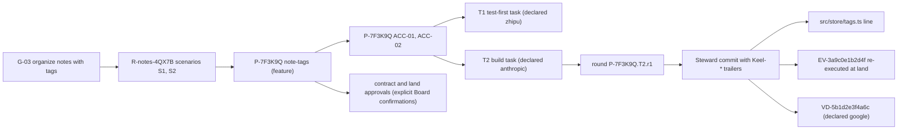

# keel vision, positioning and principles

This document owns keel's positioning and non-goals, the mapping that shows how the design meets the
owner's mandate, the principles KP-01 to KP-16, the glossary, and one end-to-end example. The requirement
statements themselves and their provenance live in [00-mandate.md](00-mandate.md), which is authoritative;
this document only shows how the design meets them. Every other concept has its home elsewhere; the
single-home table in [README.md](README.md) says where.

## One-line positioning and non-goals

**keel is a git-native, traceable company of multi-vendor AI employees with compiled intent, explicitly
confirmed approvals, re-executed evidence and architecture intelligence.**

keel is a local-first TypeScript/Node CLI. It ships an MCP server with two read tools and one outbox-only
write tool, and a read-only dashboard built with TanStack and pre-rendered to one self-contained page
([08-dashboard.md](08-dashboard.md)). It runs a small, contract-bound company of coding agents from
different vendors: Claude Code, Codex, Gemini CLI, Qwen Code, Kimi Code and opencode. GLM-family and
Gemini-family models are reached through host runtimes or through keel's direct lane.

The company has three parts ([01-org-model.md](01-org-model.md)):

- the **Board**: one or more humans, the only source of authority;
- the **Steward**: keel's deterministic core, which never calls an LLM. It mints ids, compiles
  byte-identical briefs, schedules and claims work, spawns runtimes headless, ingests results, makes every
  commit, runs the five phase gates, re-runs acceptance on the integrated commit, lands, and writes a
  hash-chained ledger. The direct lane runs as a separate child process, spawned like any other runtime;
- at most five **seats** (product, architect, planner, engineer, reviewer), which produce typed artifacts
  only.

Goal consistency is enforced mechanically, not by persuasion:

1. The charter, goals, EARS requirements, ADR obligations and the frozen per-proposal intent compile into
   one hashed brief per seat and subject ([02-alignment.md](02-alignment.md)).
2. Every seat ACKs, and keel diffs the ACK's id sets against the brief.
3. At submit, keel recompiles the brief and the seat echoes it again.
4. Approvals are explicit Board confirmations of a shown change, recorded with the artifact hashes, the
   approver and the time, including the request that starts a standing-policy change. Any change to
   approved content invalidates the approval, and seat output can never produce one.
5. Tests are fixed independently of the code. Policy lands also need proof that a test failed before the
   change and passes after it (red-before/green-after).
6. The Steward's runner re-executes evidence on the integrated commit at land.
7. A reviewer of a declared-different model family reviews the work under findings authority. Seat
   conformance status is shown as verified, failed or unverified.
8. A trace (RTM) gate refuses any in-range commit that cannot be walked back to an approved requirement and
   goal.

Architecture intelligence, in the spirit of Sourcegraph and arch-viewer, joins a declared C4-style model
with a derived code graph rented from codegraph or SCIP through keel's IndexProvider port. From that join
keel provides search, impact, drift, ownership, a change feed and the upward-only track ratchet
([07-architecture-intelligence.md](07-architecture-intelligence.md)).

git alone is sufficient: trailers, create-only CAS refs, worktrees, merge-tree, ref snapshots and
committed approval records. jj is an opt-in accelerator ([05-vcs.md](05-vcs.md)). keel runs natively on Windows with no
tmux, WSL, Docker, bash or python.

### The pitch

For every landed line keel can answer:

- which goal and requirement it serves;
- which seat, runtime and declared model family produced it;
- from which byte-identical brief;
- proven by which re-executed evidence;
- governed by which architecture element and rules;
- approved by which human, as declared, after viewing which content.

This holds on every supported runtime (the six host runtimes and the direct lane), on plain git, on
Windows.

### Non-goals

keel is not:

- an agent runtime, an LLM router or a proxy;
- an LLM manager: no model decides routing, claims, state transitions or "done";
- persona role-play ([01-org-model.md](01-org-model.md) explains why);
- a code-graph engine: it rents one through the IndexProvider port;
- a hosted service;
- an OS security sandbox. keel is a cooperative process with explicitly confirmed human authority, re-execution and
  after-the-fact detection, and `keel doctor` reports, per runtime and OS, what it prevents and what it
  only detects ([14-trust-security.md](14-trust-security.md));
- a user of the OpenSpec CLI;
- derived from any design that is not credited. Every construct maps to a permitted, credited source in
  [16-sources-credits.md](16-sources-credits.md), and the M0 D2 provenance audit checks this.

keel never opens a provider value file, a runtime credential file or a shared runtime settings file. It
knows only environment variable names, protocol ids, aliases and a names-only provider path set, and it
dereferences environment values only in memory, at spawn time and at direct-lane call time
([10-providers.md](10-providers.md)).

## Requirement mapping R1–R5 / D1–D7 / P1–P5

R1 to R5 are the owner's requirements, D1 to D7 the fixed decisions, and P1 to P5 the owner's standing
preferences; their statements and provenance live in [00-mandate.md](00-mandate.md). Each row names how
and where the design meets one of them.

| Id | Requirement or decision | How keel meets it | Home |
| --- | --- | --- | --- |
| R1 | Borrow the best ideas from OpenSpec, codegraph, edikt, keel-other (dcsg/keel), oh-my-claudecode, oh-my-codex, old-coder, rtk, OpenHands, BMAD-METHOD, superpowers and other well-designed workflows; Kiro through its public documentation only | Every construct maps to a credited source; ELv2 sources (edikt, dcsg/keel) contribute ideas only; Kiro is credited from its public documentation alone; each principle below lists its sources | [00-mandate](00-mandate.md), [16](16-sources-credits.md) |
| R2 | Architecture visualization fusing approaches of the kind Sourcegraph and arch-viewer take | Declared C4-style model joined with a derived graph through IndexProvider; from the Sourcegraph side, per-commit indexes, search, definitions and references (`keel arch find`), impact and drift with invariant proof; from the arch-viewer side, a self-contained architecture view with element pages, click-through detail and a change feed, laid out as a deterministic SVG | [07](07-architecture-intelligence.md), [08](08-dashboard.md) |
| R3 | Usable across Claude, Codex, Gemini, Qwen, Kimi, GLM and OpenCode | One canonical source (skills, seat contracts, descriptors), keel-owned generated surfaces, per-run config, degradation rungs A to D; opencode is a host runtime and the default GLM host; GLM and Gemini-family models as declared families on host runtimes or the direct lane | [09](09-runtimes.md), [10](10-providers.md) |
| R4 | git primary and sufficient on its own; jj only an optional enhancement for parallel versions and traceability | Every guarantee is specified in git primitives; opt-in JjBackend behind the Vcs interface: change ids, op log and evolog, megamerge preview, `jj run`; the M7 exit requires that disabling jj loses nothing | [05](05-vcs.md), [ADR-0001](adr/ADR-0001-git-primary-jj-optional.md) |
| R5 | A company of AI employees in roles, with guaranteed consistency with the work goals | Board, Steward and five contract-bound seats; alignment chain L0 to L11; ACK diff; explicitly confirmed approvals; test independence; land re-execution; cross-family review with findings authority; trace gate | [01](01-org-model.md), [02](02-alignment.md), [03](03-lifecycle.md), [11](11-verification.md) |
| D1 | M0 delivers a design document set plus a repository skeleton only | Docs, schemas, templates, YAML tables, type-only TypeScript, examples and fixtures; no product logic and no `bin`; `scripts/validate.mjs` is the single declared tooling exception | [13](13-artifacts-schemas.md), [15](15-roadmap.md) |
| D2 | A fresh, independent design | Every construct maps to a permitted, credited source; the D2 provenance audit (the D2 term list in `scripts/validate.mjs`) and the ELv2 shape audit are recorded | [16](16-sources-credits.md) |
| D3 | TypeScript/Node >= 22.13 with Markdown, YAML and JSON Schema artifacts; native on Windows without tmux, WSL, Docker, bash or python in the core | Node built-ins plus `yaml` and `ajv`; Windows spawn contract; `taskkill` cancellation; CI on windows-latest and ubuntu | [ADR-0002](adr/ADR-0002-node-windows-native.md), [06](06-parallelism.md), [09](09-runtimes.md) |
| D4 | git is primary and fully sufficient; jj is optional behind the Vcs interface | Every guarantee, including reserved-operation detection, is specified in git primitives | [05](05-vcs.md), [ADR-0001](adr/ADR-0001-git-primary-jj-optional.md) |
| D5 | Human-facing docs are bilingual | English canonical `<name>.md`, Simplified Chinese mirror `<name>.zh-CN.md` with identical heading levels, checked by `validate --only i18n`; identifiers English only | [README](README.md) |
| D6 | Human approval is explicit confirmation of a shown change, recorded with the subject, the artifact hashes, the approver and the time; any change to approved content invalidates it; seat output cannot approve; no SSH, key or hardware identity | `keel approve` shows the change and takes the confirmation word, writes the committed approval record and its ledger event, re-hashes after the confirmation and at every gate, refuses inside runs; a declared approver and a local clock, stated as such | [02](02-alignment.md), [14](14-trust-security.md), [ADR-0005](adr/ADR-0005-explicit-confirmation-approvals.md) |
| D7 | MIT licence, "Copyright (c) 2026 Qither" | `LICENSE`; package `@qither/keel` | [17](17-open-decisions.md) |
| P1 | Provider endpoints, keys and model names belong to the user | Names-only `routing.yaml`; values dereferenced in memory in exactly two modules; exposure rule with no Board-ack path; doctor prints SET/UNSET and PRESENT/ABSENT only; loopback fakes with fake keys; protocols `anthropic-messages`, `openai-chat`, `openai-responses`, `google` | [10](10-providers.md), [14](14-trust-security.md), [ADR-0006](adr/ADR-0006-provider-values-by-reference.md) |
| P2 | Every frontend display keel ships is built with TanStack; the libraries are headless, so the markup stays native HTML elements with hand-written CSS; no UI kit, CDN or web font | TanStack on the React adapter, pre-rendered to static HTML that is readable without JavaScript and then hydrated; libraries bundled at package build and never runtime dependencies; one self-contained read-only file with no external requests | [08](08-dashboard.md), [ADR-0008](adr/ADR-0008-read-only-dashboard.md), [ADR-0009](adr/ADR-0009-tanstack-frontend.md) |
| P3 | Borrow ideas, not dependencies | No OpenSpec CLI dependency; codegraph, SCIP and jj are optional adapters; no text or code copied from ELv2 or non-OSS sources | [16](16-sources-credits.md) |
| P4 | Refresh discipline: at every refactor review the reference projects are pulled to their latest version, their additions are analysed, and keel is re-checked and corrected against them as a first-time design; GitHub is searched for new well-designed workflows, the owner is prompted to pull candidates locally, and adopted ideas are merged | The procedure in [00-mandate.md](00-mandate.md) section 4; the reference registry `docs/reference-projects.yaml`, validated against `schemas/reference-registry.schema.json` by the `examples` check (mapped in `schemas/examples.map.json`) and cross-referenced with the mandate and the credits by the `references` check; a refresh review in every milestone exit from M1a | [00-mandate](00-mandate.md), [15](15-roadmap.md), [16](16-sources-credits.md) |
| P5 | Design iteration discipline: a defect found in keel's own documents, schemas, templates or tables is filed, classified, walked, routed and closed by the procedure of section 5 before it is fixed; a conflict with the statement is put to the owner and never reconciled by rewording a lower document; no rule is introduced, tightened or loosened without its walk; open issues gate milestone exits | The procedure in [00-mandate.md](00-mandate.md) section 5; the design-issue register `docs/design-issues.yaml`, validated against `schemas/design-issues.schema.json` by the `examples` check and cross-checked by the `issues` check (ids, anchors, statuses, the blocks gate while `exit_review` is set, cycles and reachability in the order map, the glossary); the baseline walk and the `issues` gate in the exit criteria of every milestone from M0 | [00-mandate](00-mandate.md), [15](15-roadmap.md) |

## Principles KP-01…KP-16 (with sources)

The principles are binding. When a design question is open, the principle decides it; when a principle
must change, it changes here first.

### KP-01 Intent is compiled, not remembered

Every seat receives a deterministic, hashed brief compiled from canonical documents for its subject: the
proposal for product, architect and planner, the task for engineers, and the review packet for reviewers.
`AGENTS.md` only points to `keel brief`.

**Why.** Passive context drifts and loads unevenly across runtimes. A hash makes "what was this employee
told" provable and comparable across vendors.

**Sources.** OpenSpec (instructions envelope), codegraph, Paperclip (goal ancestry), Gas Town (priming
command), BMAD-METHOD (session-sized specs, compiled context), Kiro steering inclusion modes (public docs).

**Home.** [02-alignment.md](02-alignment.md).

### KP-02 Understanding is checked twice

There is a mechanical ACK against a per-seat id set before the first edit, with a bounded retry. At
submit, the brief is recompiled and the seat must echo it again. A stale contract always requires a new
ACK.

**Why.** Heterogeneous models misread the same brief in different ways. Catching the misreading before work
starts is cheapest, and doing it by id-set diff works on the weakest runtime.

**Sources.** oh-my-codex (ACK readback), oh-my-claudecode, superpowers (goal-echo conformance),
restate-and-confirm practice in agent company systems.

**Home.** [02-alignment.md](02-alignment.md).

### KP-03 Authority is an explicit confirmation of shown content

A Board approval is an explicit confirmation of a change the Board viewed, recorded with the exact artifact
hashes, the declared approver and the time. Any edit to approved content invalidates it and brings the
change back to the Board. Seats cannot approve, relay approvals or fabricate them: only `keel approve`,
run by a human outside any keel run, writes a record and its ledger event. Records are committed, so every
clone can read what was approved and at which version.

**Why.** The owner asks keel to keep the human's decision right and the consistency between what was
approved and what runs, not to defeat a malicious program under the same OS account. A confirmation bound
to content hashes gives exactly that, without keys, signer lists or hardware. keel states the limit plainly
instead of claiming an authenticity it cannot provide on native Windows.

**Sources.** old-coder (consent bound to a version), superpowers (approval binds only the presented
artifact), BMAD-METHOD (frozen after approval), the owner's mandate (D6).

**Home.** [02-alignment.md](02-alignment.md); limits in [14-trust-security.md](14-trust-security.md).

### KP-04 Control is code, production is LLM

Scheduling, claims, compilation, commits, gates, integration and state transitions are keel code. LLM seats
emit schema-checked artifacts, and an agent's message carries data, never authority.

**Why.** LLM-manager routing is unreliable (CrewAI; the MAST failure taxonomy). A deterministic core behaves
identically on every runtime and can be audited.

**Sources.** edikt (LLM-free core; idea only, ELv2), oh-my-codex, agent company systems.

**Home.** [01-org-model.md](01-org-model.md).

### KP-05 Trace or it did not happen

Every commit in a proposal's range, and every evidence record and verdict, links goal → requirement →
proposal → task → round. Untraced commits in range, orphan tasks and uncovered requirements cannot land.
History before the trace epoch is adopted explicitly, never guessed.

**Why.** Consistency across many AI employees can only be verified if every act can be joined back to intent.

**Sources.** BMAD-METHOD (covers maps), oh-my-claudecode (decision trailers), jj (id binding), GitHub Spec Kit
and Kiro (requirement ids).

**Home.** [04-trace-and-state.md](04-trace-and-state.md).

### KP-06 Done means evidence that keel re-executed

Evidence is bound to source state: the commit; the source tree hash of all non-`.keel` paths; the
work-order hash; the contract hash frozen at contract approval; the charter version; the env fingerprint.
Land re-runs the full acceptance matrix on the integrated commit, inside the land process. EV files are only
a cache. A check that did not run is `not_run`, never `pass`.

**Why.** Self-reported completion, file-exists checks and evidence files that a seat can reach all proved to
give false positives.

**Sources.** superpowers (task-done), old-coder (evidence bound to commit plus tree hash; fail-closed
gauntlet), Gas Town Refinery (verify the merged batch, bisect red), OpenSpec (as a pitfall).

**Home.** [11-verification.md](11-verification.md).

### KP-07 Tests are independent of the code they certify

- Feature and system tracks: acceptance tests are fixed before the build and frozen, or written by a
  different seat. A cross-family verification-gap lens checks the frozen tests and the ACC → command mapping.
- Policy lands need a red-before/green-after proof.
- Tests the builder adds count toward acceptance only after that lens passes them.

**Why.** This closes the path where one agent defines "done", builds it and proves it by itself. Scenarios
that already pass certify no change.

**Sources.** BMAD-METHOD (matrix test audit, verification-gap lens), superpowers (TDD, verify before claiming).

**Home.** [11-verification.md](11-verification.md).

### KP-08 Independence comes from a declared model family, and findings have authority

- The Board-approved routing declares each alias's family, and receipts show it as "declared", never
  "verified".
- The reviewer's declared family differs from the engineer's.
- An unavailable review lane means "not approved".
- A critical finding closes only through a fix plus re-review by the same lane, or through a Board
  ruling.

**Why.** A correlated model repeats the same blind spots. Under P1 keel cannot inspect endpoints or model
names, so the trust anchor is the Board's approved declaration, and keel says so.

**Sources.** OpenSpec (cross-model review), oh-my-codex (dual lanes), BMAD-METHOD (intent auditor, evidence
triage), old-coder (blind verifier).

**Home.** [11-verification.md](11-verification.md); families in [10-providers.md](10-providers.md).

### KP-09 Git is sufficient; jj is an enhancement behind one Vcs interface

Every guarantee, including reserved-operation detection, is specified in git primitives. Disabling jj
mid-project loses nothing.

**Why.** Decision D4. jj is pre-1.0, and its secondary workspaces break agent CLIs that expect a git
checkout (verify by probe on each jj release).

**Sources.** jj (Jujutsu), survey of the runtimes' git expectations.

**Home.** [05-vcs.md](05-vcs.md).

### KP-10 Hooks warn, gates decide

Enforcement that matters is re-checked by the Steward at ingest, submit and land. Hooks fail open but are
journaled with denominators.

**Why.** Hook coverage ranges from 32 events with about 8 blockable (Claude Code) down to 3 blockable,
user-global-only events (Kimi Code); both counts verify by probe per version. edikt recorded hooks that
failed open silently.

**Sources.** edikt (journaled fail-open hooks; idea only), runtime hook documentation, codegraph (deny-hook
A/B).

**Home.** [09-runtimes.md](09-runtimes.md); gates in [11-verification.md](11-verification.md).

### KP-11 One ceremony axis

There are four tracks: spike, patch, feature and system. The track is recomputed from the actual diff and
impact at submit and can only rise. "Tier" means only model capability: frontier, standard or fast.

**Why.** Scale-adaptive paths replaced document bloat in every mature source. A track guessed too low at
intake must not slip through.

**Sources.** superpowers (ceremony ratchet), BMAD-METHOD (intent-sized routing), architecture impact analysis.

**Home.** [03-lifecycle.md](03-lifecycle.md).

### KP-12 Honest views

Every aggregate shows its denominator, and every edge shows its provenance. A stale index yields "unknown".
Heuristic or LLM facts never fail a gate. Inert gates are reported as inert.

**Why.** Green boards that overclaim, and fabricated architecture edges, mislead both humans and agents.

**Sources.** codegraph, arch-viewer (as a counter-example), old-coder (layers not run: N-A, UNAVAILABLE,
SUBSTITUTED).

**Home.** [07-architecture-intelligence.md](07-architecture-intelligence.md) and
[08-dashboard.md](08-dashboard.md).

### KP-13 Provider values belong to the user

- keel never opens any file that holds provider values, runtime credentials or shared runtime settings.
- It reads environment values only in memory: in `src/providers/env-policy.ts` at spawn, and through an
  opaque handle in the direct lane's request builder at call time.
- It never persists, prints, logs or hashes a value, and never puts one in argv.
- A seat that can execute code is dispatched only on a route whose env exposure and file exposure are both
  verified as closed.

**Why.** Standing preference P1, stated precisely enough to be verifiable. Diagnosis goes through doctor
output, never through configuration files.

**Sources.** owner preference P1; the runtimes' provider documentation.

**Home.** [10-providers.md](10-providers.md).

### KP-14 A small surface generated from manifests

- 16 top-level verbs and at most 40 verb modes (enum parameter values are not counted);
- 5 LLM seats, 5 skills, 3 default MCP tools and 5 phase gates.

Each table has one canonical data file. TypeScript literal types, shims, permissions and CLI enums are
generated from it. Drift, dangling references and budget overruns fail CI.

**Why.** The projects oh-my-claudecode, oh-my-codex, BMAD-METHOD and superpowers each paid heavily for
surface sprawl and for drift between docs, shims and code.

**Sources.** oh-my-claudecode, oh-my-codex, BMAD-METHOD (docs and shims drift), superpowers (manifest drift).

**Home.** [12-cli-api-mcp.md](12-cli-api-mcp.md) and [13-artifacts-schemas.md](13-artifacts-schemas.md).

### KP-15 Borrow ideas, not dependencies or text

keel does not depend on the OpenSpec CLI and copies no ELv2 or non-OSS code or prose. codegraph, SCIP and
jj are optional adapters. Every construct maps to a permitted source, and the M0 audit checks this.

**Why.** Standing preference P3 and decision D2.

**Sources.** owner preference P3, decision D2.

**Home.** [16-sources-credits.md](16-sources-credits.md).

### KP-16 Say what is prevented and what is only detected

Every runtime and OS pair has a doctor-reported exposure profile: `tool_env_exposure`,
`tool_file_exposure`, `control_plane_exposure`, and reserved-operation prevention. Receipts carry the
profile. Guarantees rest on approval records checked against current content, re-execution, ref snapshots
and hash chains, not on sandboxes that may be absent.

**Why.** On native Windows most agent CLIs run with the user's full file rights. Claiming isolation that does
not exist would turn a detection design into false assurance.

**Sources.** old-coder (honest "layers not run"), oh-my-codex (per-event capability matrix with a fallback
ladder), codegraph (honest freshness).

**Home.** [14-trust-security.md](14-trust-security.md).

## Glossary

Every term and id prefix used in the design, with its Simplified Chinese rendering (used by every
`.zh-CN.md` mirror), a one-line meaning and its home document. Id patterns are defined only in
`schemas/common.schema.json`.

### Organization

| Term | zh-CN | Meaning | Home |
| --- | --- | --- | --- |
| Board | 董事会 | The human owners, who confirm shown changes at a terminal through `keel approve`; the only source of authority | [01](01-org-model.md) |
| Steward | Steward | keel's deterministic core (compiler, dispatcher, runner, integrator, cartographer, auditor); never calls a model | [01](01-org-model.md) |
| seat | 席位 | One of five contract-bound LLM roles: product, architect, planner, engineer, reviewer | [01](01-org-model.md) |
| seat contract | 席位契约 | `org/seats/<seat>.yaml`: inputs, outputs, writable globs, allowed `keel api` ops, execution class, ACK id set, output schema, submit channel, default tier, independence rule, encoded assumption | [01](01-org-model.md) |
| execution class | 执行等级 | `none`, `read-only` or `code-executing`; decides which exposure rule a route must pass | [01](01-org-model.md) |
| tier | 档位 | Model capability of a route: frontier, standard or fast; never a ceremony level | [01](01-org-model.md) |
| route | 路由 | The {runtime, profile alias, tier} resolved for a seat from approved routing at dispatch and frozen in the run record | [01](01-org-model.md) |
| checkpoint | 检查点 | One of four Board approval stages: contract, plan, land, receipt | [01](01-org-model.md) |
| Board ruling | 董事会裁定 | An approved `keel approve <subject> --rule <kind>`: answer, budget, track, override, dismiss, degraded, unverified or abandon | [01](01-org-model.md) |
| override | 豁免 | An expiring Board ruling (`--until`) that waives a specific check or trace failure; waivers are overrides | [01](01-org-model.md) |
| ask | 提问 | `keel api ask` with the clause id in its input, routed by clause type to the clause owner; parks the task | [01](01-org-model.md) |
| stop class | 停止类别 | One of four situations that always become an ask to the Board: `irreversible_or_destructive`, `security_sensitive`, `side_effect_outside_workspace`, `every_path_a_guess` | [01](01-org-model.md) |
| remedy ladder | 补救阶梯 | The response to BLOCKED or NEEDS_CONTEXT: more context, one tier up, split the task, planner ruling or replan, Board | [01](01-org-model.md) |
| single writer | 单写者 | Each artifact and field has exactly one writer | [01](01-org-model.md) |
| artifact | 产物 | Anything a seat or the Steward writes that keel records or checks: proposal files, work orders, briefs, records, approval records, receipts | [13](13-artifacts-schemas.md) |
| schema | schema | A JSON Schema under `schemas/`; the Chinese mirrors keep the word in English and never render it as 模式 | [13](13-artifacts-schemas.md) |
| reserved action | 保留操作 | An action only the Board may authorize, such as pushing to a shared remote; listed in `org/reserved-actions.yaml` | [05](05-vcs.md) |

### Intent and work

| Term | zh-CN | Meaning | Home |
| --- | --- | --- | --- |
| alignment chain | 对齐链 | The twelve levels L0 (charter) to L11 (approval, receipt) that link intent to landed code | [02](02-alignment.md) |
| charter | 章程 | `.keel/charter.md`: mission, INV, decision boundaries, precedence order, reserved-action ids, pitfalls; versioned by `charter_version` (semver) | [02](02-alignment.md) |
| INV | 不变量 | Charter invariant `INV-nn`: a must or must_not obligation with `applies_to` globs and an optional check command | [02](02-alignment.md) |
| goal | 目标 | `G-nn` in `.keel/goals.yaml`: objective, success signal, non-goals, budget, status | [02](02-alignment.md) |
| requirement | 需求 | `R-<area>-<5>` in a living spec: an EARS statement with scenarios, goal refs and `realized_in` elements | [02](02-alignment.md) |
| scenario | 场景 | `R-…#S<n>`: a Given/When/Then case of a requirement; JUnit rows are tagged with it | [02](02-alignment.md) |
| EARS | EARS 需求句式 | Easy Approach to Requirements Syntax: fixed sentence shapes such as "When <trigger>, the <system> shall <response>" | [02](02-alignment.md) |
| rev_hash | 修订哈希 | sha256 of a normalized requirement; a spec delta names the base `rev_hash` it modifies | [02](02-alignment.md) |
| ADR | 架构决策记录 | `ADR-<5>`: a project decision with an explicit "## Obligations" list; keel's own design ADRs (ADR-0001 onwards) are a separate sequence | [02](02-alignment.md) |
| obligation | 义务 | `ADR-<5>.O<n>` with level must, must_not or should, `applies_to` globs and an optional check; parsed deterministically | [02](02-alignment.md) |
| proposal | 提案 | `P-<6>`: one change, living on branch `keel/<P>/main` until land | [03](03-lifecycle.md) |
| frozen intent | 冻结意图 | The part of `intent.md` between `keel:frozen` markers: problem, outcome, non-goals, decision boundaries, ACC, Always/Never, scope, open questions (empty), failure model (system) | [02](02-alignment.md) |
| ACC | 验收项 | Acceptance item `<P>#ACC-nn`: statement, covered R or scenarios, evidence mode | [02](02-alignment.md) |
| contract_hash | 契约哈希 | sha256 of the normalized frozen block, the spec and arch delta blobs and the `rev_hash` of covered requirements; frozen at contract approval | [02](02-alignment.md) |
| decision boundaries | 决策边界 | The may-decide and must-ask lists of the charter and the frozen intent | [02](02-alignment.md) |
| precedence order | 优先顺序 | Board ruling > INV > accepted ADR obligation > frozen intent > requirement > plan > task notes > model preference | [02](02-alignment.md) |
| work order | 工单 | `workorders/T<n>.yaml`: covers, after, write_set, frozen_tests, interfaces, ACC → command table, global constraints, review focus, stop classes, route hint, budget, `derived_from` | [02](02-alignment.md) |
| task | 任务 | `<P>.T<n>`: one work order, implemented by one engineer in its own worktree | [03](03-lifecycle.md) |
| round | 轮次 | `<P>.T<n>.r<k>`: one submit round of a task, recorded as one Steward commit | [04](04-trace-and-state.md) |
| write_set | 写集 | The paths and symbols a task may change | [02](02-alignment.md) |
| amendment | 修订案 | `AM-<sha12>`: the record of a change to the frozen block or ACC after contract approval; the Board views it and approves again | [02](02-alignment.md) |
| ruling | 裁定 | `RL-<sha12>`: a seat's recorded decision inside its boundaries (clause, what, why, cost if wrong, reversible) | [02](02-alignment.md) |
| receipt | 回执 | `receipt.json` and `receipt.md` in the archive: what landed, on what evidence, under which rulings and risks | [02](02-alignment.md) |

### Lifecycle

| Term | zh-CN | Meaning | Home |
| --- | --- | --- | --- |
| track | 轨道 | The single ceremony axis: spike, patch, feature or system | [03](03-lifecycle.md) |
| spike | spike（保留英文） | Read-only question answered by the product seat in `answer.md`; no land | [03](03-lifecycle.md) |
| patch | patch（保留英文） | Small change (at most 5 files and about 100 LOC, one element); phase 2 skipped | [03](03-lifecycle.md) |
| feature | feature（保留英文） | Change with product, planner, engineers and the quick lens set; typically two Board confirmations | [03](03-lifecycle.md) |
| system | system（保留英文） | Change that adds the architect, a failure model and the thorough lens set; typically three Board confirmations | [03](03-lifecycle.md) |
| ratchet | 棘轮 | The track is recomputed at submit from the actual diff and impact and can only rise | [03](03-lifecycle.md) |
| phase | 阶段 | One of 0 Intake, 1 Frame, 2 Plan, 3 Build, 4 Verify, 5 Land, 6 Close | [03](03-lifecycle.md) |
| standing policy | 常设策略 | A Board-approved, revocable `.keel/policies/<name>.yaml` that lets a narrow class of patches proceed under fixed predicates | [03](03-lifecycle.md) |
| policy path | 策略路径 | A patch contract made of an approved request plus an approved standing policy plus deterministically derived fields | [03](03-lifecycle.md) |
| receipt acknowledgement | 回执确认 | A non-blocking Board approval after a policy land; while missing, it blocks the next change touching the same elements or paths | [03](03-lifecycle.md) |
| blocked | 阻塞 | A task state with a reason: `ack_mismatch`, `non_convergence`, `track_raised`, `budget`, `runtime_unavailable`, `reserved_op` | [03](03-lifecycle.md) |
| unblock_owner | 解除负责人 | The party named on a parked or blocked task who must act before it can move | [03](03-lifecycle.md) |
| liveness | 活性 | Every non-terminal task holds exactly one of: a claim, a queued dispatch, an unblock_owner with an open ask, a pending approval | [03](03-lifecycle.md) |
| quiescence | 静止审计 | The M8 audit that flags a proposal with open work on which nothing has happened for longer than a threshold | [03](03-lifecycle.md) |
| budget | 预算 | Limits on goals, proposals and tasks; warning at 80%, `blocked(budget)` at 100% | [03](03-lifecycle.md) |

### Alignment mechanics

| Term | zh-CN | Meaning | Home |
| --- | --- | --- | --- |
| brief | 简报 | `BR-<sha12>`: the compiled, byte-identical input for one seat and subject | [02](02-alignment.md) |
| why-chain | 缘由链 | The brief's opening section: charter → goal → requirement → frozen intent → work order | [02](02-alignment.md) |
| freshness stamp | 新鲜度戳 | `computed_at`, `head_commit`, `index_commit`, `charter_version` in the brief header | [02](02-alignment.md) |
| PG | 提示来源哈希 | `PG-<sha12>`: hash of seat contract, skill, runtime overlay, tier overlay, descriptor and keel version; recorded in the `Keel-Prompt` trailer | [02](02-alignment.md) |
| ACK | ACK（复述确认） | The seat's first act: brief hash, objective, per-seat id set, non-goals, write_set, planned steps, assumptions, questions; diffed mechanically | [02](02-alignment.md) |
| ACK id set | ACK 编号集 | The ids a seat must echo in its ACK (for example ACC, R, in-scope INV and must and must_not obligation ids for an engineer) | [01](01-org-model.md) |
| submit channel | 提交通道 | How a seat's ACK and result reach the Steward: `final-message`, `mcp` (`keel_submit`) or `outbox` | [02](02-alignment.md) |
| outbox | 发件箱 | `<workspace_root>/_runs/<RUN>/outbox/`: O_EXCL JSON drops written through `keel api` | [02](02-alignment.md) |
| stale_contract | 契约过期 | Recompilation at submit shows that an ACC, a must or must_not obligation, or an R changed; requires a re-ACK and re-review | [02](02-alignment.md) |
| derived_from | 派生来源 | Hashes of upstream inputs recorded on plans, work orders, briefs, verdicts and evidence | [02](02-alignment.md) |
| approval record | 批准记录 | `AP-<sha12>`: the JSON record `keel approve` writes after an explicit confirmation, binding stage or kind, subject, commit, artifact hashes, an optional note, the declared approver, the ledger chain head and the local time | [02](02-alignment.md) |
| request record | 请求记录 | The Board's approval of the verbatim request of `keel new --policy` | [02](02-alignment.md) |
| rung | 梯级 | Degradation level of a runtime and mode: A (native schema output and blocking hooks), B (hooks plus outbox or MCP), C (no project hooks), D (manual) | [09](09-runtimes.md) |
| hook | 钩子 | A runtime event callback that runs `keel hook`; it fails open, is journaled and never decides a gate | [09](09-runtimes.md) |
| direct lane | 直连通道 | keel's own tool-less child process that calls a model API for read-only lenses (M6) | [09](09-runtimes.md) |
| runtime descriptor | 运行时描述符 | `runtimes/<id>.yaml`: binary resolution, channels, flags, permission map, exit codes, provider path set, verification status per field | [09](09-runtimes.md) |
| verify by probe | 待探测验证 | Marks an unconfirmed runtime, CLI or jj fact; YAML uses `verification_status` | [09](09-runtimes.md) |
| conformance checks | 一致性测评检查 | Plumbing checks against scripted fakes (CI) and behaviour checks against real routes (opt-in, run by the user) | [09](09-runtimes.md) |
| conformance status | 一致性测评状态 | verified, failed or unverified per (seat, runtime, alias, revision) | [11](11-verification.md) |

### Providers and exposure

| Term | zh-CN | Meaning | Home |
| --- | --- | --- | --- |
| profile alias | 配置别名 | A lowercase name in `routing.yaml` that stands for one provider route; carries protocol, declared family, auth mode, env var names, revision | [10](10-providers.md) |
| declared family | 声明的模型家族 | The model family the Board declares for an alias in approved routing: anthropic, openai, google, alibaba, moonshot, zhipu or other; shown as "declared", never "verified" | [10](10-providers.md) |
| protocol | 协议 | `anthropic-messages`, `openai-chat`, `openai-responses` or `google` | [10](10-providers.md) |
| provider path set | 模型提供方路径集 | A descriptor's names-only list of runtime homes, credential locations, user-global configs and `.env*`; tested by stat only | [10](10-providers.md) |
| exposure rule | 暴露规则 | A code-executing seat is dispatched only when tool env exposure is scrubbed and tool file exposure is none or blocked | [10](10-providers.md) |
| exposure profile | 暴露面画像 | Per runtime and OS: `tool_env_exposure`, `tool_file_exposure`, `control_plane_exposure`, reserved-operation prevention; carried in receipts | [14](14-trust-security.md) |
| doctor | 诊断 | `keel doctor`: capability probes and reports; prints variable names as SET or UNSET and paths as PRESENT or ABSENT | [12](12-cli-api-mcp.md) |

### Verification

| Term | zh-CN | Meaning | Home |
| --- | --- | --- | --- |
| gate | 门禁 | One of five phase gates (frame, plan, submit, verify, land), each holding named checks | [11](11-verification.md) |
| check | 检查项 | A named check inside a gate; status pass, fail, not_run, unknown or waived, always with a denominator | [11](11-verification.md) |
| lens | 评审镜头 | A read-only, context-free review prompt: spec, blind-diff, edge-case, verification-gap, intent-alignment, architecture, audit | [11](11-verification.md) |
| lens set | 镜头集 | A named group of lenses launched together, for example `quick`, `policy` or `thorough`; defined only in `org/seats/reviewer.yaml` | [11](11-verification.md) |
| verdict | 评审结论 | `VD-<sha12>`: a lens result with spec verdict, findings, declined items and a recommendation (approve, revise, reject) | [11](11-verification.md) |
| finding | 发现项 | A reviewer finding with file:line and severity critical, important or minor | [11](11-verification.md) |
| findings authority | 发现项裁决权 | A critical or important finding closes only through a fix plus scoped re-review by the same lane, or a Board `--rule dismiss` | [11](11-verification.md) |
| triage record | 分诊记录 | `TR-<sha12>`: the planner's confirm, upgrade or proposed dismissal of a finding, citing evidence | [11](11-verification.md) |
| fix loop | 修复循环 | Rounds 1 to 3 resume the engineer, rounds 4 and 5 use a fresh engineer one tier up, then `blocked(non_convergence)` | [11](11-verification.md) |
| evidence | 证据 | `EV-<sha12>`: a runner record of commands, exit codes, output digests and JUnit rows, bound to source state | [11](11-verification.md) |
| source-state binding | 源状态绑定 | Recorded commit and tree plus match fields (source tree, work-order hash, contract hash, charter version, env fingerprint) | [11](11-verification.md) |
| land re-execution | 落地重跑 | The full acceptance matrix re-run on the integrated commit, in the land process | [11](11-verification.md) |
| red/green proof | 红绿证明 | A cited scenario or independently fixed test fails at the base commit and passes at the change commit | [11](11-verification.md) |
| independence | 独立性 | Declared-family difference between engineer and reviewer; one family only means `degraded`, which needs `--rule degraded` | [11](11-verification.md) |
| intent_gap | 意图缺口 | The intent-alignment lens finds that the diff implements a reading the frozen intent does not support | [11](11-verification.md) |
| negative control | 负对照 | A seeded failure every check must catch, with a pinned failure reason | [11](11-verification.md) |

### State, trace and VCS

| Term | zh-CN | Meaning | Home |
| --- | --- | --- | --- |
| plane | 平面 | Declared (`.keel/`), VCS-embedded (commits, trailers, refs) or local control plane (`$(git rev-parse --git-common-dir)/keel`) | [04](04-trace-and-state.md) |
| ledger | 账本 | `ledger/<yyyy-mm>.jsonl`: the canonical, hash-chained event log with one writer | [04](04-trace-and-state.md) |
| chain head | 链头 | The hash of the latest ledger event; every approval record includes it | [04](04-trace-and-state.md) |
| ledger anchor | 账本锚点 | `refs/keel/ledger/head`: a Steward-owned ref to a blob holding the chain hash, CAS-updated after every append and checked before each one | [04](04-trace-and-state.md) |
| trailer | 提交尾注 | `Keel-*` lines on Steward commits that link a commit to round, requirements, ACC, seat, run, runtime, brief, prompt and charter | [04](04-trace-and-state.md) |
| governance commit | 治理提交 | A Steward commit of a Board-approved document, carrying `Keel-Doc` and `Keel-Approval` | [04](04-trace-and-state.md) |
| archive commit | 归档提交 | The land commit that applies deltas to living specs and the arch model, promotes ADRs and writes projections | [04](04-trace-and-state.md) |
| projection gate | 投影门禁 | Refuses URL-shaped or key-shaped tokens, other than documented placeholders, in archive projections | [04](04-trace-and-state.md) |
| RTM | 需求追溯矩阵 | Requirements traceability matrix: R → ACC → task → round → commit → tests → evidence → verdict → element | [04](04-trace-and-state.md) |
| trace epoch | 追溯纪元 | `trace.since`, set by `keel init`; history before it is adopted explicitly | [04](04-trace-and-state.md) |
| Vcs interface | Vcs 接口 | `src/vcs/vcs.ts`, implemented by GitBackend and the optional JjBackend | [05](05-vcs.md) |
| sparse worktree | 稀疏工作树 | A task or verify worktree checked out with `'/*' '!/.keel/proposals/'`, so proposal files are absent | [05](05-vcs.md) |
| ref snapshot | 引用快照 | Pre-spawn copy of refs, worktree HEADs and reflog tails, diffed at ingest and land to detect reserved operations | [05](05-vcs.md) |
| claim | 认领 | `refs/keel/claims/<P.Tn>`: a create-only CAS lock holding a token; lease and heartbeat live in the ledger | [06](06-parallelism.md) |
| wave | 波次 | A set of tasks with pairwise-disjoint write sets and impact, dispatched in parallel | [06](06-parallelism.md) |

### Architecture

| Term | zh-CN | Meaning | Home |
| --- | --- | --- | --- |
| element | 架构元素 | `el:<dotted.slug>`: a C4 system, container or component with path globs, owner label, tags and relations | [07](07-architecture-intelligence.md) |
| arch rule | 架构规则 | `AR-<5>`: an executable boundary rule (forbidden, allowed, required, layers, acyclic, independent) | [07](07-architecture-intelligence.md) |
| baseline | 基线 | Frozen known violations; shrinks freely, grows only through a contract approval | [07](07-architecture-intelligence.md) |
| IndexProvider | IndexProvider | The port through which keel rents a code graph (codegraph, SCIP, heuristic, none) | [07](07-architecture-intelligence.md) |
| provenance | 来源 | Where an edge comes from: scip, tree-sitter, heuristic or llm; only scip and tree-sitter edges can fail a gate | [07](07-architecture-intelligence.md) |
| drift | 漂移 | A difference between the declared model and the derived graph, classified by kind and severity | [07](07-architecture-intelligence.md) |
| impact | 影响面 | `IM-<sha12>`: changed files → symbols → dependents → elements, boundaries, owners, affected tests | [07](07-architecture-intelligence.md) |
| unknown | 未知 | The honest answer when the index is stale or missing; blocks only where the unknown policy says so | [07](07-architecture-intelligence.md) |
| element brief | 架构元素简报 | A 2 to 4 KiB summary of an element compiled into briefs | [07](07-architecture-intelligence.md) |
| change feed | 变更流 | Newest-first land and round events and series points touching an element | [07](07-architecture-intelligence.md) |

### Design of keel itself

| Term | zh-CN | Meaning | Home |
| --- | --- | --- | --- |
| design iteration | 设计迭代 | One run of the P5 procedure: file, classify, walk, audit terms, route, prompt the owner, correct, close, record | [00-mandate](00-mandate.md) |
| design issue | 设计问题 | `DI-nn` in `docs/design-issues.yaml`: a defect in keel's own design with its class (mandate-conflict, cycle, term-collision, gap, cost), status, anchors, walk and closure | [00-mandate](00-mandate.md) |
| design-issue register | 设计问题登记表 | `docs/design-issues.yaml`: the issues, the order map, the walkthrough matrix and the walkthrough history; validated by `schemas/design-issues.schema.json` and the `issues` check | [00-mandate](00-mandate.md) |
| rule walk | 规则走查 | The four facts written for a rule: producers and their sufficiency, consumers derived from the canonical tables, places and actors, readers and tallies | [00-mandate](00-mandate.md) |
| order map | 顺序图 | The standing steps, artifacts and locks of the design with produced-by, required-by, after and released-by edges; the `issues` check finds cycles and unreachable places in it | [00-mandate](00-mandate.md) |
| walkthrough matrix | 走查矩阵 | Track × actor × sequence; the cells a design iteration and every milestone exit walk | [00-mandate](00-mandate.md) |
| baseline walk | 基线走查 | The first run of the P5 procedure: the order map filled and every cell of the matrix walked once; an M0 exit criterion | [00-mandate](00-mandate.md) |
| light mode | 轻量模式 | The part of the P5 procedure a rule change may run alone: the walk of the changed rule, in the same commit, never skipped | [00-mandate](00-mandate.md) |

### Id prefixes

| Prefix | zh-CN | Record | Home |
| --- | --- | --- | --- |
| `G-` / `INV-` | 目标 / 不变量 | Goal, charter invariant (Board-serialized numbers) | [04](04-trace-and-state.md) |
| `R-` / `#S` | 需求 / 场景 | Requirement, scenario | [04](04-trace-and-state.md) |
| `ADR-` / `.O` | 决策 / 义务 | Project ADR, obligation | [04](04-trace-and-state.md) |
| `AR-` / `el:` | 架构规则 / 架构元素 | Arch rule, element | [04](04-trace-and-state.md) |
| `P-` / `.T` / `.r` / `#ACC-` | 提案 / 任务 / 轮次 / 验收项 | Proposal, task, round, acceptance item | [04](04-trace-and-state.md) |
| `BR-` / `PG-` | 简报 / 提示来源 | Brief, prompt provenance | [04](04-trace-and-state.md) |
| `EV-` / `VD-` / `TR-` / `IM-` | 证据 / 评审结论 / 分诊 / 影响面 | Evidence, verdict, triage record, impact record | [04](04-trace-and-state.md) |
| `AP-` / `AM-` / `OV-` / `RL-` / `Q-` | 批准 / 修订案 / 豁免 / 裁定 / 提问 | Approval, amendment, override, ruling, question | [04](04-trace-and-state.md) |
| `RUN-` / `EVT-` | 运行 / 事件 | Run, ledger event (26-character ULIDs) | [04](04-trace-and-state.md) |
| `DI-` | 设计问题 | Design issue in keel's own register (keel's own sequence, like its design ADRs; not minted for target projects) | [00-mandate](00-mandate.md) |

## End-to-end example: from G-03 to one line of code

This walk follows the golden example project in `examples/acme-notes/`: a small notes application whose
owner wants tags. Where this narrative and the example files differ, the example files are canonical.
Hash-derived ids below are illustrative.



1. **Setup, once.** `keel init` scaffolds `.keel/` and the control plane and sets the trace epoch. The Board
   reads and approves the charter (`charter_version: 1.0.0`, with invariants such as `INV-01`), `goals.yaml`,
   `routing.yaml` and the tag-storage decision `ADR-7KQ2B` with `keel approve --doc <path>`; each lands on
   trunk as a Steward governance commit. The approved routing declares the engineer route on claude-code
   (declared family anthropic), the engineer's test route to a GLM alias on opencode (declared family
   zhipu) and the reviewer route on opencode (declared family google). It holds environment variable
   names only.
2. **Goal.** `G-03` ("users can organize notes with tags") is active in `goals.yaml`, with a success signal
   and a budget.
3. **Intake (phase 0).** The Board runs `keel new "Note tags" --goal G-03`. The Steward mints `P-7F3K9Q`,
   checks the anchors, predicts impact across two elements and classifies the track as feature. It creates
   branch `keel/P-7F3K9Q/main` and a planning worktree.
4. **Frame (phase 1).** The product seat ACKs its brief (id set: `G-03`, `R-notes-4QX7B`, in-scope `INV`)
   and writes `intent.md` with a frozen block holding `P-7F3K9Q#ACC-01` (covers `R-notes-4QX7B#S1`, mode
   test) and `P-7F3K9Q#ACC-02` (covers `R-notes-4QX7B#S2`, mode test), plus `spec.delta.yaml`, which modifies
   `R-notes-4QX7B` against its base `rev_hash`. A spec lens from a different declared family reviews it and
   the frame gate passes.
5. **Contract approval (Board confirmation 1).** `keel approve P-7F3K9Q --stage contract` shows the frozen
   block and the spec-delta diff, and the Board types the confirmation word. The record binds the
   `contract_hash`, the commit of `keel/P-7F3K9Q/main`, the declared approver and the time.
6. **Plan (phase 2).** The planner writes two work orders in two waves. `T1` is a test-first task on the approved
   test route (the GLM alias); it writes `tests/notes/tags.test.ts`. `T2` is the build task on claude-code;
   its `frozen_tests` include that test file, its write_set covers `src/store/**`, and its ACC → command
   table maps `ACC-01` to the command `npm test` and the matrix row tagged `[R-notes-4QX7B#S1]`. A cross-family
   verification-gap lens checks the table and the test-task definition. Each wave has width 1 and routing
   follows the approved routing, so no plan approval is needed.
7. **Build (phase 3).** `keel run P-7F3K9Q` runs `T1`, then `T2`. `T1`'s round must leave its two cited
   test rows red (`verify.test-red`), and a verification-gap lens on the reviewer route reads the frozen test
   output and approves it before `T1` lands on `keel/P-7F3K9Q/main`. For `T2` the Steward acquires the claim
   `refs/keel/claims/P-7F3K9Q.T2`, creates a sparse worktree, snapshots refs, compiles `BR-9e4c1a7b2d05` and
   spawns claude-code as run `RUN-01J9Z8Q4TKXW3M5N7P2R6S8V0A`. The engineer ACKs through the outbox
   (`0001-ack.json`, id set `ACC-01`, `ACC-02`, `R-notes-4QX7B` and in-scope must and must_not obligations
   such as `ADR-7KQ2B.O1`; no invariant applies to `src/store/**`), edits `src/store/tags.ts` without
   committing, and submits `0002-result.json` with status DONE, a goal echo and the brief echo. The Steward
   commits round `P-7F3K9Q.T2.r1`, and the submit gate passes on that commit:

   ```text
   notes: normalize and store note tags

   Keel-Round: P-7F3K9Q.T2.r1
   Keel-Req: R-notes-4QX7B#S1
   Keel-Req: R-notes-4QX7B#S2
   Keel-Acc: P-7F3K9Q#ACC-01
   Keel-Acc: P-7F3K9Q#ACC-02
   Keel-Seat: engineer
   Keel-Run: RUN-01J9Z8Q4TKXW3M5N7P2R6S8V0A
   Keel-Runtime: claude-code@2.1.259
   Keel-Brief: BR-9e4c1a7b2d05
   Keel-Prompt: PG-4d8f0b2c6a13
   Keel-Charter: 1.0.0
   Keel-Ruling: RL-2c7e9a4b6d18
   Not-tested: Concurrent addTag calls on the same note (the store is single-writer).
   ```

8. **Verify (phase 4).** The runner executes the acceptance matrix in a clean sparse detached checkout of
   the round commit and records `EV-3a9c0e1b2d4f`, bound to source state. The `quick` lens set
   (`org/seats/reviewer.yaml`) runs on the reviewer route, declared family google, and returns
   `VD-5b1d2e3f4a6c` with recommendation approve. The verify gate passes.
9. **Land (phase 5, Board confirmation 2).** The Steward integrates both tasks onto `keel/P-7F3K9Q/main`,
   re-executes the full acceptance matrix on the integrated commit and writes the receipt draft. The Board
   reads `receipt.md` (the archived one is
   [`examples/acme-notes/.keel/archive/2026/P-7F3K9Q-note-tags/receipt.md`](../examples/acme-notes/.keel/archive/2026/P-7F3K9Q-note-tags/receipt.md))
   and runs `keel approve P-7F3K9Q --stage land`. `keel land P-7F3K9Q` checks that the draft still hashes
   to what the record binds, re-runs the land gate, writes the archive commit (spec delta applied, projections under
   `.keel/archive/2026/P-7F3K9Q-note-tags/`) and advances trunk.
10. **Close (phase 6).** Keel-provenance worktrees and refs are cleaned up; liveness is clean.

Afterwards, any line can be walked back. `keel trace src/store/tags.ts:42` follows blame to the round commit,
reads the trailers (`P-7F3K9Q.T2.r1` → `P-7F3K9Q#ACC-01` → `R-notes-4QX7B#S1` → `G-03`), then the ledger to
`BR-9e4c1a7b2d05`, `EV-3a9c0e1b2d4f`, `VD-5b1d2e3f4a6c` and the two Board approvals, and path lift to the
element that owns `src/store/` (`el:notes.store`), its owner label, its obligations and its arch rules.
