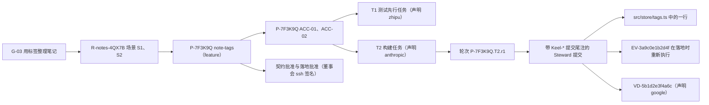

# keel 的愿景、定位与原则

> 英文原文（规范版本）：[00-vision.md](00-vision.md)。本文是其简体中文镜像，两者不一致时以英文版为准。

本文档负责 keel 的定位与非目标、从所有者的需求和决策到设计的映射、原则 KP-01 到 KP-16、术语表，以及一个端到端示例。其他每个概念都在别处有其归属文档；[README.zh-CN.md](README.zh-CN.md) 中的单一归属表说明了各自的位置。

## 一句话定位与非目标

**keel 是一家 git 原生、可追溯、由多厂商 AI 员工组成的公司，具备编译的意图、签名的批准、重新执行的证据和架构智能。**

keel 是一个本地优先的 TypeScript/Node CLI。它附带一个 MCP 服务器（两个只读工具和一个只写发件箱的写工具），以及一个静态的原生 HTML 看板（dashboard）。它运营一家由不同厂商的编码智能体组成、受契约约束的小型公司：Claude Code、Codex、Gemini CLI、Qwen Code、Kimi Code 和 opencode。GLM 家族和 Gemini 家族的模型通过宿主运行时（runtime）或 keel 的直连通道（direct lane）接入。

这家公司由三部分组成（[01-org-model.zh-CN.md](01-org-model.zh-CN.md)）：

- **董事会（Board）**：一位或多位人类，是唯一的权力来源；
- **Steward**：keel 的确定性核心，从不调用 LLM。它铸造编号、编译逐字节一致的简报（brief）、调度并认领（claim）工作、以无头方式拉起运行时、接收结果、完成每一次提交、运行五道阶段门禁（gate）、在集成后的提交上重新运行验收、执行落地（land），并写入哈希链式的账本（ledger）。直连通道作为一个独立的子进程运行，与其他任何运行时一样被拉起；
- 至多五个**席位（seat）**（产品、架构、规划、工程、评审席位，即 product、architect、planner、engineer、reviewer），它们只产出类型化的产物。

目标一致性靠机制强制保证，而不是靠说服：

1. 章程（charter）、目标（goal）、EARS 需求（requirement）、ADR 义务（obligation）以及每个提案（proposal）的冻结意图（frozen intent），被编译成每个席位、每个主题一份带哈希的简报（[02-alignment.zh-CN.md](02-alignment.zh-CN.md)）。
2. 每个席位都要做 ACK（复述确认），keel 将 ACK 中的编号集与简报做差异比对。
3. 提交时，keel 重新编译简报，席位需再次回显它。
4. 批准是董事会的 ssh 签名，绑定到产物哈希和账本链头，其中也包括发起常设策略（standing policy）变更的那份请求。只要某把董事会密钥可以从 ssh-agent 加载，keel 就拒绝生成或接受批准，除非它是 FIDO2 `-sk` 密钥。
5. 测试独立于代码而确定。策略落地还需要证明某个测试在变更前失败、变更后通过（红前/绿后，red-before/green-after）。
6. Steward 的运行器（runner）在落地时，于集成后的提交上重新执行证据（evidence）。
7. 由声明的模型家族（declared family）与工程席位不同的评审席位，在发现项裁决权（findings authority）之下评审工作。席位的一致性测评状态（conformance status）显示为 verified、failed 或 unverified。
8. 追溯（RTM）门禁拒绝范围内任何无法回溯到已批准需求和目标的提交。

架构智能秉承 Sourcegraph 和 arch-viewer 的精神，将一个声明式的 C4 风格模型，与通过 keel 的 IndexProvider 端口从 codegraph 或 SCIP 租用的派生代码图谱相结合。基于这一结合，keel 提供搜索、影响面（impact）、漂移（drift）、归属、变更流以及只升不降的轨道（track）棘轮（[07-architecture-intelligence.zh-CN.md](07-architecture-intelligence.zh-CN.md)）。

仅用 git 就足够：提交尾注（trailer）、仅创建的 CAS 引用、工作树（worktree）、merge-tree、引用快照和 ssh 签名。jj 是可选启用的加速器（[05-vcs.zh-CN.md](05-vcs.zh-CN.md)）。keel 在 Windows 上原生运行，不需要 tmux、WSL、Docker、bash 或 python。

### 核心主张

对每一行已落地的代码，keel 都能回答：

- 它服务于哪个目标和需求；
- 由哪个席位、运行时和声明的模型家族产出；
- 来自哪份逐字节一致的简报；
- 由哪些重新执行过的证据证明；
- 受哪个架构元素（element）和哪些规则约束；
- 由哪位人类签署。

这在六种 LLM 技术栈中的任何一种上、在普通 git 上、在 Windows 上都成立。

### 非目标

keel 不是：

- 智能体运行时、LLM 路由器或代理；
- LLM 管理者：没有任何模型决定路由、认领、状态迁移或“完成”；
- 人设角色扮演（原因见 [01-org-model.zh-CN.md](01-org-model.zh-CN.md)）；
- 代码图谱引擎：它通过 IndexProvider 端口租用一个；
- 托管服务；
- 操作系统级安全沙箱。keel 是一个协作式进程，依靠签名的人类权力、重新执行和事后检测；`keel doctor` 按运行时和操作系统报告它能阻止什么、只能检测什么（[14-trust-security.zh-CN.md](14-trust-security.zh-CN.md)）；
- OpenSpec CLI 的使用者；
- 源自任何未经致谢的设计。每个构件都对应到 [16-sources-credits.zh-CN.md](16-sources-credits.zh-CN.md) 中一个被允许且已致谢的来源，M0 的 D2 出处审计会检查这一点。

keel 从不打开模型提供方（provider）的值文件、运行时凭据文件或共享的运行时设置文件。它只知道环境变量名、协议 id、别名以及一个仅含名称的模型提供方路径集，并且只在内存中、在拉起时和直连通道调用时解引用环境变量的值（[10-providers.zh-CN.md](10-providers.zh-CN.md)）。

## 需求映射 R1–R5 / D1–D7 / P1–P3

R1 到 R5 是所有者的需求，D1 到 D7 是固定决策，P1 到 P3 是所有者的常设偏好。每一行都指出设计在何处满足它。

| 编号 | 需求或决策 | keel 如何满足 | 归属 |
| --- | --- | --- | --- |
| R1 | 借鉴 OpenSpec、codegraph、edikt、keel-other（dcsg/keel）、oh-my-claudecode、oh-my-codex、old-coder、OpenHands、BMAD-METHOD、superpowers 以及其他设计良好的工作流中的最佳思想 | 每个构件都对应到一个已致谢的来源；ELv2 来源（edikt、dcsg/keel）只贡献思想；下文每条原则都列出其来源 | [16](16-sources-credits.zh-CN.md) |
| R2 | 秉承 Sourcegraph（代码智能、搜索、代码图谱）和 arch-viewer 精神的架构可视化 | 声明式 C4 风格模型通过 IndexProvider 与派生图谱相结合；`keel arch find`、影响面、附带不变量证明的漂移、架构元素页面、变更流、确定性的 SVG 视图 | [07](07-architecture-intelligence.zh-CN.md)、[08](08-dashboard.zh-CN.md) |
| R3 | 在 Claude、Codex、Gemini、Qwen、Kimi 和 GLM 之间都易于使用 | 单一规范来源（技能、席位契约、描述符）、keel 自有的生成接口面、按运行的配置、降级梯级 A 到 D；GLM 和 Gemini 家族模型作为宿主运行时或直连通道上的声明的模型家族 | [09](09-runtimes.zh-CN.md)、[10](10-providers.zh-CN.md) |
| R4 | 考虑用 jj 支持并行版本和可追溯性 | Vcs 接口背后可选启用的 JjBackend：change id、op log 与 evolog、megamerge 预览、`jj run`；M7 的退出标准要求禁用 jj 不损失任何东西 | [05](05-vcs.zh-CN.md)、[ADR-0001](adr/ADR-0001-git-primary-jj-optional.zh-CN.md) |
| R5 | 一家由担任各角色的 AI 员工组成的公司，并保证与工作目标一致 | 董事会、Steward 和五个受契约约束的席位；对齐链 L0 到 L11；ACK 差异比对；签名批准；测试独立性；落地重跑；具有发现项裁决权的跨家族评审；追溯门禁 | [01](01-org-model.zh-CN.md)、[02](02-alignment.zh-CN.md)、[03](03-lifecycle.zh-CN.md)、[11](11-verification.zh-CN.md) |
| D1 | M0 只交付一套设计文档和一个仓库骨架 | 文档、schema、模板、YAML 表、纯类型 TypeScript、示例和夹具；没有产品逻辑，也没有 `bin`；`scripts/validate.mjs` 是唯一声明的工具例外 | [13](13-artifacts-schemas.zh-CN.md)、[15](15-roadmap.zh-CN.md) |
| D2 | 全新、独立的设计 | 每个构件都对应到一个被允许且已致谢的来源；D2 出处审计（`scripts/validate.mjs` 中的 D2 术语列表）和 ELv2 形态审计均有记录 | [16](16-sources-credits.zh-CN.md) |
| D3 | TypeScript/Node >= 22.13，产物为 Markdown、YAML 和 JSON Schema；在 Windows 上原生运行，核心中不使用 tmux、WSL、Docker、bash 或 python | Node 内置模块加上 `yaml` 和 `ajv`；Windows 拉起契约；用 `taskkill` 取消；在 windows-latest 和 ubuntu 上运行 CI | [ADR-0002](adr/ADR-0002-node-windows-native.zh-CN.md)、[06](06-parallelism.zh-CN.md)、[09](09-runtimes.zh-CN.md) |
| D4 | git 为主且完全够用；jj 是 Vcs 接口背后的可选项 | 每项保证（包括保留操作检测）都用 git 原语来规定 | [05](05-vcs.zh-CN.md)、[ADR-0001](adr/ADR-0001-git-primary-jj-optional.zh-CN.md) |
| D5 | 面向人的文档采用双语 | 英文规范版 `<name>.md`，简体中文镜像 `<name>.zh-CN.md`，标题层级相同，由 `validate --only i18n` 检查；标识符只用英文 | [README](README.zh-CN.md) |
| D6 | 董事会批准是绑定到产物哈希和账本链头的 ssh 签名 | `ssh-keygen -Y sign/verify`、已提交的分离信封、以最近一次董事会签名的主干修订中的 `allowed_signers` 为准进行验证、失败即关闭（fail-closed）的 ssh-agent 检查 | [02](02-alignment.zh-CN.md)、[14](14-trust-security.zh-CN.md)、[ADR-0005](adr/ADR-0005-signed-board-approvals.zh-CN.md) |
| D7 | MIT 许可证，“Copyright (c) 2026 Qither” | `LICENSE`；包 `@qither/keel` | [17](17-open-decisions.zh-CN.md) |
| P1 | 模型提供方的端点、密钥和模型名称属于用户 | 仅含名称的 `routing.yaml`；值只在恰好两个模块中于内存里解引用；暴露规则没有董事会确认式的绕行路径；doctor 只打印 SET/UNSET 和 PRESENT/ABSENT；带伪密钥的回环伪提供方；协议 `anthropic-messages`、`openai-chat`、`openai-responses`、`google` | [10](10-providers.zh-CN.md)、[14](14-trust-security.zh-CN.md)、[ADR-0006](adr/ADR-0006-provider-values-by-reference.zh-CN.md) |
| P2 | 看板使用原生 HTML 元素和手写 CSS，不用框架 | 单个自包含的 HTML 文件，不开 JavaScript 也可阅读，至多约 300 行原生 JS，只读 | [08](08-dashboard.zh-CN.md)、[ADR-0008](adr/ADR-0008-read-only-dashboard.zh-CN.md) |
| P3 | 借鉴思想，而非依赖 | 不依赖 OpenSpec CLI；codegraph、SCIP 和 jj 都是可选适配器；不从 ELv2 或非开源来源复制文本或代码 | [16](16-sources-credits.zh-CN.md) |

## 原则 KP-01…KP-16（附来源）

这些原则具有约束力。设计问题悬而未决时，由原则来裁决；原则需要修改时，先在这里修改。

### KP-01 意图靠编译，而非记忆

每个席位都会收到一份确定性的、带哈希的简报，它由针对其主题的规范文档编译而成：产品、架构和规划席位的主题是提案，工程席位的主题是任务，评审席位的主题是评审包。`AGENTS.md` 只指向 `keel brief`。

**原因。** 被动上下文会漂移，并且在不同运行时之间加载得参差不齐。哈希让“这位员工被告知了什么”变得可证明，并且可以跨厂商比较。

**来源。** OpenSpec（指令信封）、codegraph、Paperclip（目标谱系）、Gas Town（预热命令）、BMAD-METHOD（会话大小的规格、编译后的上下文）、Kiro steering 的包含模式（公开文档）。

**归属。** [02-alignment.zh-CN.md](02-alignment.zh-CN.md)。

### KP-02 理解要检查两次

在第一次编辑之前，针对每个席位的编号集做一次机械的 ACK，重试次数有上限。提交时，简报被重新编译，席位必须再次回显它。契约过期总是需要一次新的 ACK。

**原因。** 异构模型会以不同方式误读同一份简报。在工作开始前发现误读成本最低，而用编号集差异比对来做，在最弱的运行时上也行得通。

**来源。** oh-my-codex（ACK 复读）、oh-my-claudecode、superpowers（目标回显一致性）、智能体公司系统中的复述确认实践。

**归属。** [02-alignment.zh-CN.md](02-alignment.zh-CN.md)。

### KP-03 权力必须签名

董事会批准是一个经 ssh 签名的信封，它绑定确切的产物哈希、一段引述的同意声明和账本链头。任何编辑都会使其失效。席位不能批准，也不能转交批准。只要任何受允许签名者的公钥被一个可访问的 ssh-agent 列出，keel 就拒绝生成或接受批准，除非它是 FIDO2 `-sk` 密钥。签名信封和签名者列表都会被提交，因此在每个克隆上都能验证。

**原因。** TTY 检查只在每个进程都配合时才有效。在 Windows 上，ssh-agent 持有的密钥可被同一用户下运行的任何进程使用。每次签名都需要口令、或需要触碰硬件的签名，才能让权力真实可信。

**来源。** old-coder（可引述的同意）、superpowers（批准只绑定所呈现的产物）、BMAD-METHOD（批准后冻结）、OpenSSH `ssh-keygen -Y`。

**归属。** [02-alignment.zh-CN.md](02-alignment.zh-CN.md)；密钥卫生见 [14-trust-security.zh-CN.md](14-trust-security.zh-CN.md)。

### KP-04 控制归代码，产出归 LLM

调度、认领、编译、提交、门禁、集成和状态迁移都是 keel 代码。LLM 席位输出经 schema 检查的产物，智能体的消息携带的是数据，永远不是权力。

**原因。** 由 LLM 担任管理者的路由并不可靠（CrewAI；MAST 失败分类法）。确定性核心在每个运行时上行为一致，并且可以审计。

**来源。** edikt（无 LLM 的核心；仅借鉴思想，ELv2）、oh-my-codex、智能体公司系统。

**归属。** [01-org-model.zh-CN.md](01-org-model.zh-CN.md)。

### KP-05 没有追溯就等于没发生

提案范围内的每个提交，以及每条证据记录和评审结论（verdict），都链接 目标 → 需求 → 提案 → 任务 → 轮次。范围内未追溯的提交、孤儿任务和未覆盖的需求都不能落地。追溯纪元之前的历史要显式接纳，绝不猜测。

**原因。** 只有每个行为都能被关联回意图，众多 AI 员工之间的一致性才可验证。

**来源。** BMAD-METHOD（覆盖映射）、oh-my-claudecode（决策尾注）、jj（编号绑定）、GitHub Spec Kit 和 Kiro（需求编号）。

**归属。** [04-trace-and-state.zh-CN.md](04-trace-and-state.zh-CN.md)。

### KP-06 完成意味着有 keel 重新执行过的证据

证据绑定到源状态：提交；所有非 `.keel` 路径的源树哈希；工单（work order）哈希；在契约批准时冻结的契约哈希；章程版本；环境指纹。落地会在集成后的提交上、在落地进程内部重新运行完整的验收矩阵。EV 文件只是缓存。未运行的检查记为 `not_run`，永远不记为 `pass`。

**原因。** 自我报告的完成、检查文件是否存在，以及席位能够触及的证据文件，都已被证明会产生假阳性。

**来源。** superpowers（task-done）、old-coder（证据绑定到提交加树哈希；失败即关闭的连环检查）、Gas Town Refinery（验证合并后的批次，对红色结果做二分）、OpenSpec（作为反面教训）。

**归属。** [11-verification.zh-CN.md](11-verification.zh-CN.md)。

### KP-07 测试独立于其所认证的代码

- feature 和 system 轨道：验收测试在构建之前确定并冻结，或由另一个席位编写。跨家族的验证缺口（verification-gap）评审镜头（lens）检查冻结测试以及 ACC → 命令映射。
- 策略落地需要红前/绿后证明。
- 构建者新增的测试，只有在该评审镜头通过后才计入验收。

**原因。** 这堵住了由同一个智能体定义“完成”、构建它并自行证明的路径。原本就已通过的场景不能证明任何变更。

**来源。** BMAD-METHOD（矩阵测试审计、验证缺口镜头）、superpowers（TDD，先验证再声称）。

**归属。** [11-verification.zh-CN.md](11-verification.zh-CN.md)。

### KP-08 独立性来自声明的模型家族，发现项具有权威

- 董事会签名的路由声明每个别名的家族，回执（receipt）将其显示为“declared”（已声明），绝不显示为“verified”（已验证）。
- 评审席位声明的家族与工程席位的不同。
- 评审通道不可用即意味着“未批准”。
- critical（严重）发现项（finding）只能通过修复加同一通道的重新评审关闭，或通过签名的董事会裁定关闭。

**原因。** 相互关联的模型会重复同样的盲点。在 P1 之下 keel 无法检查端点或模型名称，因此信任锚是董事会的签名声明，keel 也如实这样说明。

**来源。** OpenSpec（跨模型评审）、oh-my-codex（双通道）、BMAD-METHOD（意图审计员、证据分诊）、old-coder（盲验证者）。

**归属。** [11-verification.zh-CN.md](11-verification.zh-CN.md)；家族见 [10-providers.zh-CN.md](10-providers.zh-CN.md)。

### KP-09 git 足矣；jj 是单一 Vcs 接口背后的增强

每项保证（包括保留操作检测）都用 git 原语来规定。在项目中途禁用 jj 不会损失任何东西。

**原因。** 决策 D4。jj 尚未到 1.0，其次级工作区会破坏那些期望 git 检出的智能体 CLI（每个 jj 版本都需待探测验证，verify by probe）。

**来源。** jj（Jujutsu）、对各运行时 git 预期的调研。

**归属。** [05-vcs.zh-CN.md](05-vcs.zh-CN.md)。

### KP-10 钩子只告警，门禁做决定

真正重要的强制措施会由 Steward 在接收、提交和落地时重新检查。钩子失败时放行（fail open），但会连同分母一起记入日志。

**原因。** 钩子覆盖范围从 32 个事件、约 8 个可阻断（Claude Code），到只有 3 个可阻断且仅限用户全局的事件（Kimi Code）不等；两个数字都需按版本待探测验证。edikt 记录过悄无声息地失败放行的钩子。

**来源。** edikt（记入日志的失败放行钩子；仅借鉴思想）、各运行时的钩子文档、codegraph（deny-hook A/B 测试）。

**归属。** [09-runtimes.zh-CN.md](09-runtimes.zh-CN.md)；门禁见 [11-verification.zh-CN.md](11-verification.zh-CN.md)。

### KP-11 单一仪式轴

共有四种轨道：spike、patch、feature 和 system。轨道在提交时根据实际的差异和影响面重新计算，并且只能上升。“档位（tier）”只表示模型能力：frontier、standard 或 fast。

**原因。** 在每个成熟的来源中，按规模自适应的路径都取代了文档膨胀。受理时猜得过低的轨道不能蒙混过关。

**来源。** superpowers（仪式棘轮）、BMAD-METHOD（按意图规模路由）、架构影响面分析。

**归属。** [03-lifecycle.zh-CN.md](03-lifecycle.zh-CN.md)。

### KP-12 诚实的视图

每个聚合值都显示其分母，每条边都显示其来源。过期的索引产生“unknown”（未知）。启发式或 LLM 得出的事实永远不会让门禁失败。不起作用的门禁会被如实报告为不起作用。

**原因。** 过度声称的全绿面板和捏造的架构边，会同时误导人类和智能体。

**来源。** codegraph、arch-viewer（作为反例）、old-coder（未运行的层：N-A、UNAVAILABLE、SUBSTITUTED）。

**归属。** [07-architecture-intelligence.zh-CN.md](07-architecture-intelligence.zh-CN.md) 和 [08-dashboard.zh-CN.md](08-dashboard.zh-CN.md)。

### KP-13 模型提供方的值属于用户

- keel 从不打开任何保存模型提供方值、运行时凭据或共享运行时设置的文件。
- 它只在内存中读取环境变量的值：在拉起时于 `src/providers/env-policy.ts` 中读取，以及在调用时通过直连通道请求构建器中的一个不透明句柄读取。
- 它从不持久化、打印、记录或哈希任何值，也从不把值放进 argv。
- 能够执行代码的席位，只会被派发到环境暴露和文件暴露都被验证为关闭的路由上。

**原因。** 这是常设偏好 P1，表述得足够精确，以便可以验证。诊断通过 doctor 输出进行，绝不通过配置文件。

**来源。** 所有者偏好 P1；各运行时的模型提供方文档。

**归属。** [10-providers.zh-CN.md](10-providers.zh-CN.md)。

### KP-14 由清单生成的小接口面

- 16 个顶层动词，至多 40 个动词模式（枚举参数值不计入）；
- 5 个 LLM 席位、5 个技能、3 个默认 MCP 工具和 5 道阶段门禁。

每张表都有一个规范的数据文件。TypeScript 字面量类型、shim、权限和 CLI 枚举都由它生成。漂移、悬空引用和超出预算都会让 CI 失败。

**原因。** oh-my-claudecode、oh-my-codex、BMAD-METHOD 和 superpowers 这些项目，都曾为接口面的蔓延以及文档、shim 与代码之间的漂移付出沉重代价。

**来源。** oh-my-claudecode、oh-my-codex、BMAD-METHOD（文档与 shim 漂移）、superpowers（清单漂移）。

**归属。** [12-cli-api-mcp.zh-CN.md](12-cli-api-mcp.zh-CN.md) 和 [13-artifacts-schemas.zh-CN.md](13-artifacts-schemas.zh-CN.md)。

### KP-15 借鉴思想，不借依赖或文本

keel 不依赖 OpenSpec CLI，也不复制任何 ELv2 或非开源的代码或文字。codegraph、SCIP 和 jj 都是可选适配器。每个构件都对应到一个被允许的来源，M0 审计会检查这一点。

**原因。** 常设偏好 P3 和决策 D2。

**来源。** 所有者偏好 P3、决策 D2。

**归属。** [16-sources-credits.zh-CN.md](16-sources-credits.zh-CN.md)。

### KP-16 说清什么被阻止、什么只被检测

每一对运行时与操作系统都有一份由 doctor 报告的暴露面画像（exposure profile）：`tool_env_exposure`、`tool_file_exposure`、`control_plane_exposure`，以及保留操作的阻止情况。回执携带这份画像。各项保证建立在签名、重新执行、引用快照和哈希链之上，而不是建立在可能并不存在的沙箱之上。

**原因。** 在原生 Windows 上，大多数智能体 CLI 以用户的全部文件权限运行。声称并不存在的隔离，会把一个检测型设计变成虚假的保证。

**来源。** old-coder（诚实的“未运行的层”）、oh-my-codex（带回退阶梯的逐事件能力矩阵）、codegraph（诚实的新鲜度）。

**归属。** [14-trust-security.zh-CN.md](14-trust-security.zh-CN.md)。

## 术语表

设计中用到的每个术语和编号前缀，附其简体中文译名（每个 `.zh-CN.md` 镜像都使用它）、一句话含义及其归属文档。编号模式只在 `schemas/common.schema.json` 中定义。

### 组织

| 术语 | 中文 | 含义 | 归属 |
| --- | --- | --- | --- |
| Board | 董事会 | 人类所有者，由 `.keel/board/allowed_signers` 中的 ssh 签名密钥标识；唯一的权力来源 | [01](01-org-model.zh-CN.md) |
| Steward | Steward | keel 的确定性核心（compiler、dispatcher、runner、integrator、cartographer、auditor）；从不调用模型 | [01](01-org-model.zh-CN.md) |
| seat | 席位 | 五种受契约约束的 LLM 角色之一：product、architect、planner、engineer、reviewer | [01](01-org-model.zh-CN.md) |
| seat contract | 席位契约 | `org/seats/<seat>.yaml`：输入、输出、可写 glob、允许的 `keel api` 操作、执行等级、ACK 编号集、输出 schema、提交通道、默认档位、独立性规则、所编码的假设 | [01](01-org-model.zh-CN.md) |
| execution class | 执行等级 | `none`、`read-only` 或 `code-executing`；决定路由必须通过哪条暴露规则 | [01](01-org-model.zh-CN.md) |
| tier | 档位 | 路由的模型能力：frontier、standard 或 fast；从不表示仪式级别 | [01](01-org-model.zh-CN.md) |
| route | 路由 | 派发时根据签名的路由配置为席位解析出的 {runtime, profile alias, tier}，并冻结在运行记录中 | [01](01-org-model.zh-CN.md) |
| checkpoint | 检查点 | 四个董事会签名阶段之一：contract、plan、land、receipt | [01](01-org-model.zh-CN.md) |
| Board ruling | 董事会裁定 | 一次签名的 `keel approve <subject> --rule <kind>`：answer、budget、track、override、dismiss、degraded、unverified 或 abandon | [01](01-org-model.zh-CN.md) |
| override | 豁免 | 一种会过期的董事会裁定（`--until`），用于豁免某项特定检查或追溯失败；各种 waiver 都属于豁免 | [01](01-org-model.zh-CN.md) |
| ask | 提问 | 输入中带条款 id 的 `keel api ask`，按条款类型路由给条款负责人；使任务停驻 | [01](01-org-model.zh-CN.md) |
| stop class | 停止类别 | 始终会变成向董事会提问的四种情形之一：`irreversible_or_destructive`、`security_sensitive`、`side_effect_outside_workspace`、`every_path_a_guess` | [01](01-org-model.zh-CN.md) |
| remedy ladder | 补救阶梯 | 对 BLOCKED 或 NEEDS_CONTEXT 的应对：补充上下文、升高一个档位、拆分任务、规划席位裁定或重新规划、董事会 | [01](01-org-model.zh-CN.md) |
| single writer | 单写者 | 每个产物和字段都恰好只有一个写者 | [01](01-org-model.zh-CN.md) |
| artifact | 产物 | 席位或 Steward 写出、并由 keel 记录或检查的任何东西：提案文件、工单、简报、记录、信封、回执 | [13](13-artifacts-schemas.zh-CN.md) |
| schema | schema | `schemas/` 下的 JSON Schema；中文镜像中保留英文原词，从不译作“模式” | [13](13-artifacts-schemas.zh-CN.md) |
| reserved action | 保留操作 | 只有董事会可以授权的操作，例如推送到共享远程仓库；列于 `org/reserved-actions.yaml` | [05](05-vcs.zh-CN.md) |

### 意图与工作

| 术语 | 中文 | 含义 | 归属 |
| --- | --- | --- | --- |
| alignment chain | 对齐链 | 把意图与已落地代码联系起来的十二个层级，从 L0（章程）到 L11（批准、回执） | [02](02-alignment.zh-CN.md) |
| charter | 章程 | `.keel/charter.md`：使命、INV、决策边界、优先顺序、保留操作编号、陷阱、根签名者指纹；以 `charter_version`（semver）进行版本管理 | [02](02-alignment.zh-CN.md) |
| INV | 不变量 | 章程不变量 `INV-nn`：一条 must 或 must_not 义务，带 `applies_to` glob 和可选的检查命令 | [02](02-alignment.zh-CN.md) |
| goal | 目标 | `.keel/goals.yaml` 中的 `G-nn`：目的、成功信号、非目标、预算、状态 | [02](02-alignment.zh-CN.md) |
| requirement | 需求 | 活规格中的 `R-<area>-<5>`：一条 EARS 陈述，带场景、目标引用和 `realized_in` 架构元素 | [02](02-alignment.zh-CN.md) |
| scenario | 场景 | `R-…#S<n>`：需求的一个 Given/When/Then 用例；JUnit 行会标注它 | [02](02-alignment.zh-CN.md) |
| EARS | EARS 需求句式 | Easy Approach to Requirements Syntax（需求语法简易方法）：固定的句式，例如 “When <trigger>, the <system> shall <response>” | [02](02-alignment.zh-CN.md) |
| rev_hash | 修订哈希 | 规范化需求的 sha256；规格增量会指明它所修改的基准 `rev_hash` | [02](02-alignment.zh-CN.md) |
| ADR | 架构决策记录 | `ADR-<5>`：带有显式 “## Obligations” 列表的项目决策；keel 自身的设计 ADR（从 ADR-0001 起）是另一个独立序列 | [02](02-alignment.zh-CN.md) |
| obligation | 义务 | `ADR-<5>.O<n>`，级别为 must、must_not 或 should，带 `applies_to` glob 和可选检查；以确定性方式解析 | [02](02-alignment.zh-CN.md) |
| proposal | 提案 | `P-<6>`：一次变更，在落地之前位于分支 `keel/<P>/main` 上 | [03](03-lifecycle.zh-CN.md) |
| frozen intent | 冻结意图 | `intent.md` 中位于 `keel:frozen` 标记之间的部分：问题、结果、非目标、决策边界、ACC、Always/Never、范围、未决问题（为空）、失败模型（system） | [02](02-alignment.zh-CN.md) |
| ACC | 验收项 | 验收项 `<P>#ACC-nn`：陈述、所覆盖的 R 或场景、证据模式 | [02](02-alignment.zh-CN.md) |
| contract_hash | 契约哈希 | 规范化冻结块、规格与架构增量的 blob，以及所覆盖需求的 `rev_hash` 共同计算出的 sha256；在契约批准时冻结 | [02](02-alignment.zh-CN.md) |
| decision boundaries | 决策边界 | 章程和冻结意图中的“可自行决定”与“必须提问”列表 | [02](02-alignment.zh-CN.md) |
| precedence order | 优先顺序 | 董事会裁定 > INV > 已接受的 ADR 义务 > 冻结意图 > 需求 > 计划 > 任务备注 > 模型偏好 | [02](02-alignment.zh-CN.md) |
| work order | 工单 | `workorders/T<n>.yaml`：covers、after、write_set、frozen_tests、interfaces、ACC → 命令表、全局约束、评审重点、停止类别、路由提示、预算、`derived_from` | [02](02-alignment.zh-CN.md) |
| task | 任务 | `<P>.T<n>`：一份工单，由一个工程席位在自己的工作树中实现 | [03](03-lifecycle.zh-CN.md) |
| round | 轮次 | `<P>.T<n>.r<k>`：任务的一次提交轮次，记录为一个 Steward 提交 | [04](04-trace-and-state.zh-CN.md) |
| write_set | 写集 | 任务可以更改的路径和符号 | [02](02-alignment.zh-CN.md) |
| amendment | 修订案 | `AM-<sha12>`：契约批准后对冻结块或 ACC 所作更改的记录；董事会需重新签名 | [02](02-alignment.zh-CN.md) |
| ruling | 裁定 | `RL-<sha12>`：席位在其边界内记录的决定（条款、内容、理由、出错代价、是否可逆） | [02](02-alignment.zh-CN.md) |
| receipt | 回执 | 归档中的 `receipt.json` 和 `receipt.md`：落地了什么、依据哪些证据、在哪些裁定和风险之下 | [02](02-alignment.zh-CN.md) |

### 生命周期

| 术语 | 中文 | 含义 | 归属 |
| --- | --- | --- | --- |
| track | 轨道 | 唯一的仪式轴：spike、patch、feature 或 system | [03](03-lifecycle.zh-CN.md) |
| spike | spike（保留英文） | 由产品席位在 `answer.md` 中只读作答的问题；不落地 | [03](03-lifecycle.zh-CN.md) |
| patch | patch（保留英文） | 小变更（至多 5 个文件、约 100 行代码、一个架构元素）；跳过阶段 2 | [03](03-lifecycle.zh-CN.md) |
| feature | feature（保留英文） | 由产品、规划、工程席位和 quick 镜头集参与的变更；通常需要董事会介入两次 | [03](03-lifecycle.zh-CN.md) |
| system | system（保留英文） | 增加架构席位、失败模型和 thorough 镜头集的变更；通常需要董事会介入三次 | [03](03-lifecycle.zh-CN.md) |
| ratchet | 棘轮 | 轨道在提交时根据实际差异和影响面重新计算，并且只能上升 | [03](03-lifecycle.zh-CN.md) |
| phase | 阶段 | 0 受理（Intake）、1 框定（Frame）、2 规划（Plan）、3 构建（Build）、4 验证（Verify）、5 落地（Land）、6 收尾（Close）之一 | [03](03-lifecycle.zh-CN.md) |
| standing policy | 常设策略 | 董事会签名、可撤销的 `.keel/policies/<name>.yaml`，允许一类范围狭窄的 patch 在固定谓词下推进 | [03](03-lifecycle.zh-CN.md) |
| policy path | 策略路径 | 由签名的请求、签名的常设策略以及确定性派生的字段构成的 patch 契约 | [03](03-lifecycle.zh-CN.md) |
| receipt acknowledgement | 回执确认 | 策略落地后的一次非阻塞董事会签名；缺失时，会阻塞下一个触及相同架构元素或路径的变更 | [03](03-lifecycle.zh-CN.md) |
| blocked | 阻塞 | 带原因的任务状态：`ack_mismatch`、`non_convergence`、`track_raised`、`budget`、`runtime_unavailable`、`reserved_op` | [03](03-lifecycle.zh-CN.md) |
| unblock_owner | 解除负责人 | 停驻或阻塞的任务上所指名的一方，任务要推进必须先由其行动 | [03](03-lifecycle.zh-CN.md) |
| liveness | 活性 | 每个非终态任务恰好持有以下之一：一个认领、一个排队的派发、一个带未决提问的 unblock_owner、一个待处理的批准 | [03](03-lifecycle.zh-CN.md) |
| quiescence | 静止审计 | M8 的审计，标记那些有未完成工作、但在超过阈值的时间内毫无动静的提案 | [03](03-lifecycle.zh-CN.md) |
| budget | 预算 | 对目标、提案和任务的限额；80% 时告警，100% 时 `blocked(budget)` | [03](03-lifecycle.zh-CN.md) |

### 对齐机制

| 术语 | 中文 | 含义 | 归属 |
| --- | --- | --- | --- |
| brief | 简报 | `BR-<sha12>`：为一个席位和主题编译出的、逐字节一致的输入 | [02](02-alignment.zh-CN.md) |
| why-chain | 缘由链 | 简报的开头部分：章程 → 目标 → 需求 → 冻结意图 → 工单 | [02](02-alignment.zh-CN.md) |
| freshness stamp | 新鲜度戳 | 简报头部中的 `computed_at`、`head_commit`、`index_commit`、`charter_version` | [02](02-alignment.zh-CN.md) |
| PG | 提示来源哈希 | `PG-<sha12>`：席位契约、技能、运行时叠加层、档位叠加层、描述符和 keel 版本的哈希；记录在 `Keel-Prompt` 提交尾注中 | [02](02-alignment.zh-CN.md) |
| ACK | ACK（复述确认） | 席位的第一个动作：简报哈希、目的、按席位的编号集、非目标、write_set、计划步骤、假设、问题；以机械方式做差异比对 | [02](02-alignment.zh-CN.md) |
| ACK id set | ACK 编号集 | 席位必须在其 ACK 中回显的编号（例如工程席位的 ACC、R、范围内的 INV 以及 must 与 must_not 义务编号） | [01](01-org-model.zh-CN.md) |
| submit channel | 提交通道 | 席位的 ACK 和结果到达 Steward 的方式：`final-message`、`mcp`（`keel_submit`）或 `outbox` | [02](02-alignment.zh-CN.md) |
| outbox | 发件箱 | `<workspace_root>/_runs/<RUN>/outbox/`：通过 `keel api` 以 O_EXCL 方式写入的 JSON 投递文件 | [02](02-alignment.zh-CN.md) |
| stale_contract | 契约过期 | 提交时的重新编译表明某个 ACC、must 或 must_not 义务或 R 已变化；需要重新 ACK 和重新评审 | [02](02-alignment.zh-CN.md) |
| derived_from | 派生来源 | 记录在计划、工单、简报、评审结论和证据上的上游输入哈希 | [02](02-alignment.zh-CN.md) |
| approval envelope | 批准信封 | `AP-<sha12>`：经 ssh 签名的 JSON，绑定阶段或种类、主题、提交、产物哈希、引述、批准人、账本链头、时间戳和随机数 | [02](02-alignment.zh-CN.md) |
| request envelope | 请求信封 | 董事会对 `keel new --policy` 的逐字请求所作的签名 | [02](02-alignment.zh-CN.md) |
| rung | 梯级 | 运行时与模式的降级等级：A（原生 schema 输出和可阻断的钩子）、B（钩子加 outbox 或 MCP）、C（无项目级钩子）、D（手动） | [09](09-runtimes.zh-CN.md) |
| hook | 钩子 | 运行时的事件回调，它运行 `keel hook`；失败时放行、记入日志，从不决定门禁 | [09](09-runtimes.zh-CN.md) |
| direct lane | 直连通道 | keel 自己的无工具子进程，为只读评审镜头调用模型 API（M6） | [09](09-runtimes.zh-CN.md) |
| runtime descriptor | 运行时描述符 | `runtimes/<id>.yaml`：二进制解析、通道、标志、权限映射、退出码、模型提供方路径集、逐字段的验证状态 | [09](09-runtimes.zh-CN.md) |
| verify by probe | 待探测验证 | 标记一条尚未确认的运行时、CLI 或 jj 事实；YAML 中使用 `verification_status` | [09](09-runtimes.zh-CN.md) |
| conformance checks | 一致性测评检查 | 针对脚本化伪实现的管道检查（CI），以及针对真实路由的行为检查（可选启用，由用户运行） | [09](09-runtimes.zh-CN.md) |
| conformance status | 一致性测评状态 | 按（席位、运行时、别名、修订）给出的 verified、failed 或 unverified | [11](11-verification.zh-CN.md) |

### 模型提供方与暴露面

| 术语 | 中文 | 含义 | 归属 |
| --- | --- | --- | --- |
| profile alias | 配置别名 | `routing.yaml` 中代表一条模型提供方路由的小写名称；携带协议、声明的模型家族、认证模式、环境变量名、修订 | [10](10-providers.zh-CN.md) |
| declared family | 声明的模型家族 | 董事会在签名的路由配置中为别名声明的模型家族：anthropic、openai、google、alibaba、moonshot、zhipu 或 other；显示为“declared”，绝不显示为“verified” | [10](10-providers.zh-CN.md) |
| protocol | 协议 | `anthropic-messages`、`openai-chat`、`openai-responses` 或 `google` | [10](10-providers.zh-CN.md) |
| provider path set | 模型提供方路径集 | 描述符中仅含名称的列表，列出运行时主目录、凭据位置、用户全局配置和 `.env*`；只用 stat 测试 | [10](10-providers.zh-CN.md) |
| exposure rule | 暴露规则 | 只有当工具环境暴露为 scrubbed、且工具文件暴露为 none 或 blocked 时，才会派发可执行代码的席位 | [10](10-providers.zh-CN.md) |
| exposure profile | 暴露面画像 | 按运行时和操作系统给出：`tool_env_exposure`、`tool_file_exposure`、`control_plane_exposure`、保留操作的阻止情况；由回执携带 | [14](14-trust-security.zh-CN.md) |
| doctor | 诊断 | `keel doctor`：能力探测与报告；把变量名打印为 SET 或 UNSET，把路径打印为 PRESENT 或 ABSENT | [12](12-cli-api-mcp.zh-CN.md) |

### 验证

| 术语 | 中文 | 含义 | 归属 |
| --- | --- | --- | --- |
| gate | 门禁 | 五道阶段门禁之一（frame、plan、submit、verify、land），每道都包含若干具名检查项 | [11](11-verification.zh-CN.md) |
| check | 检查项 | 门禁内的一个具名检查；状态为 pass、fail、not_run、unknown 或 waived，并始终带有分母 | [11](11-verification.zh-CN.md) |
| lens | 评审镜头 | 只读、无上下文的评审提示词：spec、blind-diff、edge-case、verification-gap、intent-alignment、architecture、audit | [11](11-verification.zh-CN.md) |
| lens set | 镜头集 | 一组同时启动的具名评审镜头，例如 `quick`、`policy` 或 `thorough`；只在 `org/seats/reviewer.yaml` 中定义 | [11](11-verification.zh-CN.md) |
| verdict | 评审结论 | `VD-<sha12>`：一个评审镜头的结果，含规格结论、发现项、拒绝评判的项和建议（approve、revise、reject） | [11](11-verification.zh-CN.md) |
| finding | 发现项 | 评审者的一条发现，带 file:line 和严重度 critical、important 或 minor | [11](11-verification.zh-CN.md) |
| findings authority | 发现项裁决权 | critical 或 important 发现项只能通过修复加同一通道限定范围的重新评审关闭，或通过董事会的 `--rule dismiss` 关闭 | [11](11-verification.zh-CN.md) |
| triage record | 分诊记录 | `TR-<sha12>`：规划席位对某个发现项的确认、升级或提议驳回，并引用证据 | [11](11-verification.zh-CN.md) |
| fix loop | 修复循环 | 第 1 到 3 轮恢复原工程席位，第 4 和 5 轮改用高一档位的全新工程席位，之后为 `blocked(non_convergence)` | [11](11-verification.zh-CN.md) |
| evidence | 证据 | `EV-<sha12>`：运行器对命令、退出码、输出摘要和 JUnit 行的记录，绑定到源状态 | [11](11-verification.zh-CN.md) |
| source-state binding | 源状态绑定 | 记录的提交与树，外加匹配字段（源树、工单哈希、契约哈希、章程版本、环境指纹） | [11](11-verification.zh-CN.md) |
| land re-execution | 落地重跑 | 在落地进程中，于集成后的提交上重新运行完整的验收矩阵 | [11](11-verification.zh-CN.md) |
| red/green proof | 红绿证明 | 某个被引用的场景或独立确定的测试在基准提交上失败、在变更提交上通过 | [11](11-verification.zh-CN.md) |
| independence | 独立性 | 工程席位与评审席位之间声明的模型家族差异；只有一个家族即意味着 `degraded`（降级），需要 `--rule degraded` | [11](11-verification.zh-CN.md) |
| intent_gap | 意图缺口 | 意图对齐评审镜头发现差异实现的是冻结意图所不支持的一种解读 | [11](11-verification.zh-CN.md) |
| negative control | 负对照 | 每项检查都必须捕获的预置失败，并带有固定的失败原因 | [11](11-verification.zh-CN.md) |

### 状态、追溯与 VCS

| 术语 | 中文 | 含义 | 归属 |
| --- | --- | --- | --- |
| plane | 平面 | 声明平面（`.keel/`）、VCS 内嵌平面（提交、提交尾注、引用）或本地控制平面（`$(git rev-parse --git-common-dir)/keel`） | [04](04-trace-and-state.zh-CN.md) |
| ledger | 账本 | `ledger/<yyyy-mm>.jsonl`：规范的、哈希链式的事件日志，只有一个写者 | [04](04-trace-and-state.zh-CN.md) |
| chain head | 链头 | 最新账本事件的哈希；每个董事会信封都包含它 | [04](04-trace-and-state.zh-CN.md) |
| ledger anchor | 账本锚点 | `refs/keel/ledger/head`：由 Steward 拥有、指向保存链哈希的 blob 的引用；每次追加之后以 CAS 方式更新，每次追加之前都要检查 | [04](04-trace-and-state.zh-CN.md) |
| trailer | 提交尾注 | Steward 提交上的 `Keel-*` 行，把提交与轮次、需求、ACC、席位、运行、运行时、简报、提示词和章程联系起来 | [04](04-trace-and-state.zh-CN.md) |
| governance commit | 治理提交 | 针对董事会签名文档的 Steward 提交，携带 `Keel-Doc` 和 `Keel-Approval` | [04](04-trace-and-state.zh-CN.md) |
| archive commit | 归档提交 | 落地时的提交：把增量应用到活规格和架构模型、晋升 ADR 并写入投影 | [04](04-trace-and-state.zh-CN.md) |
| projection gate | 投影门禁 | 拒绝归档投影中除已记录占位符之外的、形似 URL 或形似密钥的标记 | [04](04-trace-and-state.zh-CN.md) |
| RTM | 需求追溯矩阵 | Requirements traceability matrix：R → ACC → 任务 → 轮次 → 提交 → 测试 → 证据 → 评审结论 → 架构元素 | [04](04-trace-and-state.zh-CN.md) |
| trace epoch | 追溯纪元 | `trace.since`，由 `keel init` 设置；其之前的历史需显式接纳 | [04](04-trace-and-state.zh-CN.md) |
| Vcs interface | Vcs 接口 | `src/vcs/vcs.ts`，由 GitBackend 和可选的 JjBackend 实现 | [05](05-vcs.zh-CN.md) |
| sparse worktree | 稀疏工作树 | 以 `'/*' '!/.keel/proposals/'` 检出的任务或验证工作树，因此提案文件不存在于其中 | [05](05-vcs.zh-CN.md) |
| ref snapshot | 引用快照 | 拉起前对引用、工作树 HEAD 和 reflog 尾部所做的副本，在接收和落地时做差异比对以检测保留操作 | [05](05-vcs.zh-CN.md) |
| claim | 认领 | `refs/keel/claims/<P.Tn>`：持有令牌的仅创建 CAS 锁；租约和心跳保存在账本中 | [06](06-parallelism.zh-CN.md) |
| wave | 波次 | 一组写集和影响面两两不相交、并行派发的任务 | [06](06-parallelism.zh-CN.md) |

### 架构

| 术语 | 中文 | 含义 | 归属 |
| --- | --- | --- | --- |
| element | 架构元素 | `el:<dotted.slug>`：C4 中的一个系统、容器或组件，带路径 glob、所有者标签、标签（tag）和关系 | [07](07-architecture-intelligence.zh-CN.md) |
| arch rule | 架构规则 | `AR-<5>`：可执行的边界规则（forbidden、allowed、required、layers、acyclic、independent） | [07](07-architecture-intelligence.zh-CN.md) |
| baseline | 基线 | 冻结的已知违规；可自由缩减，只能通过契约批准增长 | [07](07-architecture-intelligence.zh-CN.md) |
| IndexProvider | IndexProvider | keel 租用代码图谱所经的端口（codegraph、SCIP、heuristic、none） | [07](07-architecture-intelligence.zh-CN.md) |
| provenance | 来源 | 一条边的出处：scip、tree-sitter、heuristic 或 llm；只有 scip 和 tree-sitter 的边能让门禁失败 | [07](07-architecture-intelligence.zh-CN.md) |
| drift | 漂移 | 声明模型与派生图谱之间的差异，按种类和严重度分类 | [07](07-architecture-intelligence.zh-CN.md) |
| impact | 影响面 | `IM-<sha12>`：变更文件 → 符号 → 依赖方 → 架构元素、边界、所有者、受影响的测试 | [07](07-architecture-intelligence.zh-CN.md) |
| unknown | 未知 | 索引过期或缺失时的诚实回答；只在未知策略（unknown policy）要求的地方阻塞 | [07](07-architecture-intelligence.zh-CN.md) |
| element brief | 架构元素简报 | 编译进简报的一段 2 到 4 KiB 的架构元素摘要 | [07](07-architecture-intelligence.zh-CN.md) |
| change feed | 变更流 | 触及某个架构元素的落地与轮次事件以及序列点，按最新在前排列 | [07](07-architecture-intelligence.zh-CN.md) |

### 编号前缀

| 前缀 | 中文 | 记录 | 归属 |
| --- | --- | --- | --- |
| `G-` / `INV-` | 目标 / 不变量 | 目标、章程不变量（由董事会顺序编号） | [04](04-trace-and-state.zh-CN.md) |
| `R-` / `#S` | 需求 / 场景 | 需求、场景 | [04](04-trace-and-state.zh-CN.md) |
| `ADR-` / `.O` | 决策 / 义务 | 项目 ADR、义务 | [04](04-trace-and-state.zh-CN.md) |
| `AR-` / `el:` | 架构规则 / 架构元素 | 架构规则、架构元素 | [04](04-trace-and-state.zh-CN.md) |
| `P-` / `.T` / `.r` / `#ACC-` | 提案 / 任务 / 轮次 / 验收项 | 提案、任务、轮次、验收项 | [04](04-trace-and-state.zh-CN.md) |
| `BR-` / `PG-` | 简报 / 提示来源 | 简报、提示来源 | [04](04-trace-and-state.zh-CN.md) |
| `EV-` / `VD-` / `TR-` / `IM-` | 证据 / 评审结论 / 分诊 / 影响面 | 证据、评审结论、分诊记录、影响面记录 | [04](04-trace-and-state.zh-CN.md) |
| `AP-` / `AM-` / `OV-` / `RL-` / `Q-` | 批准 / 修订案 / 豁免 / 裁定 / 提问 | 批准、修订案、豁免、裁定、提问 | [04](04-trace-and-state.zh-CN.md) |
| `RUN-` / `EVT-` | 运行 / 事件 | 运行、账本事件（26 个字符的 ULID） | [04](04-trace-and-state.zh-CN.md) |

## 端到端示例：从 G-03 到一行代码

本节跟随 `examples/acme-notes/` 中的黄金示例项目：一个小型笔记应用，其所有者想要标签功能。若本叙述与示例文件不一致，以示例文件为准。下文中由哈希派生的编号仅作示意。



1. **一次性设置。** `keel init` 搭建 `.keel/` 和控制平面，并设置追溯纪元。董事会用 `keel approve --doc <path>` 签署章程（`charter_version: 1.0.0`，含 `INV-01` 等不变量）、`goals.yaml`、`routing.yaml` 以及标签存储决策 `ADR-7KQ2B`；每份文档都作为一个 Steward 治理提交进入主干。签名的路由配置声明：工程席位路由在 claude-code 上（声明的模型家族 anthropic），工程席位的测试路由指向 opencode 上的一个 GLM 别名（声明的模型家族 zhipu），评审席位路由在 opencode 上（声明的模型家族 google）。它只保存环境变量名。
2. **目标。** `G-03`（“用户可以用标签整理笔记”）在 `goals.yaml` 中处于 active 状态，带有成功信号和预算。
3. **受理（阶段 0）。** 董事会运行 `keel new "Note tags" --goal G-03`。Steward 铸造 `P-7F3K9Q`，检查锚点，预测出跨两个架构元素的影响面，并将轨道分类为 feature。它创建分支 `keel/P-7F3K9Q/main` 和一个规划工作树。
4. **框定（阶段 1）。** 产品席位对其简报做 ACK（编号集：`G-03`、`R-notes-4QX7B`、范围内的 `INV`），并编写 `intent.md`，其冻结块包含 `P-7F3K9Q#ACC-01`（覆盖 `R-notes-4QX7B#S1`，模式 test）和 `P-7F3K9Q#ACC-02`（覆盖 `R-notes-4QX7B#S2`，模式 test），另外还编写 `spec.delta.yaml`，它以 `R-notes-4QX7B` 的基准 `rev_hash` 为基础对其进行修改。一个来自不同声明的模型家族的 spec 评审镜头对其进行评审，框定门禁通过。
5. **契约批准（董事会第 1 次介入）。** `keel approve P-7F3K9Q --stage contract` 显示冻结块和规格增量差异。董事会的签名绑定 `contract_hash`、`keel/P-7F3K9Q/main` 的提交以及账本链头。
6. **规划（阶段 2）。** 规划席位在两个波次（wave）中编写两份工单。`T1` 是走签名测试路由（GLM 别名）的测试先行任务；它编写 `tests/notes/tags.test.ts`。`T2` 是 claude-code 上的构建任务；它的 `frozen_tests` 包含该测试文件，write_set 覆盖 `src/store/**`，其 ACC → 命令表把 `ACC-01` 映射到命令 `npm test` 以及标记为 `[R-notes-4QX7B#S1]` 的矩阵行。一个跨家族的验证缺口评审镜头检查该表和测试任务的定义。每个波次宽度都为 1，且路由遵循签名的路由配置，因此不需要计划批准。
7. **构建（阶段 3）。** `keel run P-7F3K9Q` 先运行 `T1`，再运行 `T2`。`T1` 的轮次必须让它引用的两行测试保持为红（`verify.test-red`），并且评审席位路由上的一个验证缺口评审镜头阅读冻结测试的输出并予以批准之后，`T1` 才会落到 `keel/P-7F3K9Q/main` 上。对于 `T2`，Steward 获取认领 `refs/keel/claims/P-7F3K9Q.T2`，创建稀疏工作树，为引用做快照，编译 `BR-9e4c1a7b2d05`，并以运行 `RUN-01J9Z8Q4TKXW3M5N7P2R6S8V0A` 拉起 claude-code。工程席位通过发件箱做 ACK（`0001-ack.json`，编号集为 `ACC-01`、`ACC-02`、`R-notes-4QX7B` 以及 `ADR-7KQ2B.O1` 等范围内的 must 与 must_not 义务；没有任何不变量适用于 `src/store/**`），编辑 `src/store/tags.ts` 但不提交，并提交 `0002-result.json`，状态为 DONE，附带目标回显和简报回显。Steward 提交轮次 `P-7F3K9Q.T2.r1`，提交门禁在该提交上通过：

   ```text
   notes: normalize and store note tags

   Keel-Round: P-7F3K9Q.T2.r1
   Keel-Req: R-notes-4QX7B#S1
   Keel-Req: R-notes-4QX7B#S2
   Keel-Acc: P-7F3K9Q#ACC-01
   Keel-Acc: P-7F3K9Q#ACC-02
   Keel-Seat: engineer
   Keel-Run: RUN-01J9Z8Q4TKXW3M5N7P2R6S8V0A
   Keel-Runtime: claude-code@2.1.259
   Keel-Brief: BR-9e4c1a7b2d05
   Keel-Prompt: PG-4d8f0b2c6a13
   Keel-Charter: 1.0.0
   Keel-Ruling: RL-2c7e9a4b6d18
   Not-tested: Concurrent addTag calls on the same note (the store is single-writer).
   ```

8. **验证（阶段 4）。** 运行器在轮次提交的一个干净、稀疏、分离（detached）的检出中执行验收矩阵，并记录绑定到源状态的 `EV-3a9c0e1b2d4f`。`quick` 镜头集（`org/seats/reviewer.yaml`）在评审席位路由（声明的模型家族 google）上运行，返回建议为 approve 的 `VD-5b1d2e3f4a6c`。验证门禁通过。
9. **落地（阶段 5，董事会第 2 次介入）。** Steward 把两个任务集成到 `keel/P-7F3K9Q/main` 上，在集成后的提交上重新执行完整的验收矩阵，并写出回执草稿。董事会阅读 `receipt.md`（已归档的版本见 [`examples/acme-notes/.keel/archive/2026/P-7F3K9Q-note-tags/receipt.md`](../examples/acme-notes/.keel/archive/2026/P-7F3K9Q-note-tags/receipt.md)）并运行 `keel approve P-7F3K9Q --stage land`。`keel land P-7F3K9Q` 验证签名，重新运行落地门禁，写出归档提交（应用规格增量、在 `.keel/archive/2026/P-7F3K9Q-note-tags/` 下写入投影），并推进主干。
10. **收尾（阶段 6）。** 带 keel 出处标记的工作树和引用被清理；活性检查干净。

之后，任何一行都可以被回溯。`keel trace src/store/tags.ts:42` 沿 blame 找到轮次提交，读取提交尾注（`P-7F3K9Q.T2.r1` → `P-7F3K9Q#ACC-01` → `R-notes-4QX7B#S1` → `G-03`），再沿账本找到 `BR-9e4c1a7b2d05`、`EV-3a9c0e1b2d4f`、`VD-5b1d2e3f4a6c` 和两份董事会签名，并通过路径提升（path lift）找到拥有 `src/store/` 的架构元素（`el:notes.store`）、其所有者标签、其义务及其架构规则。
