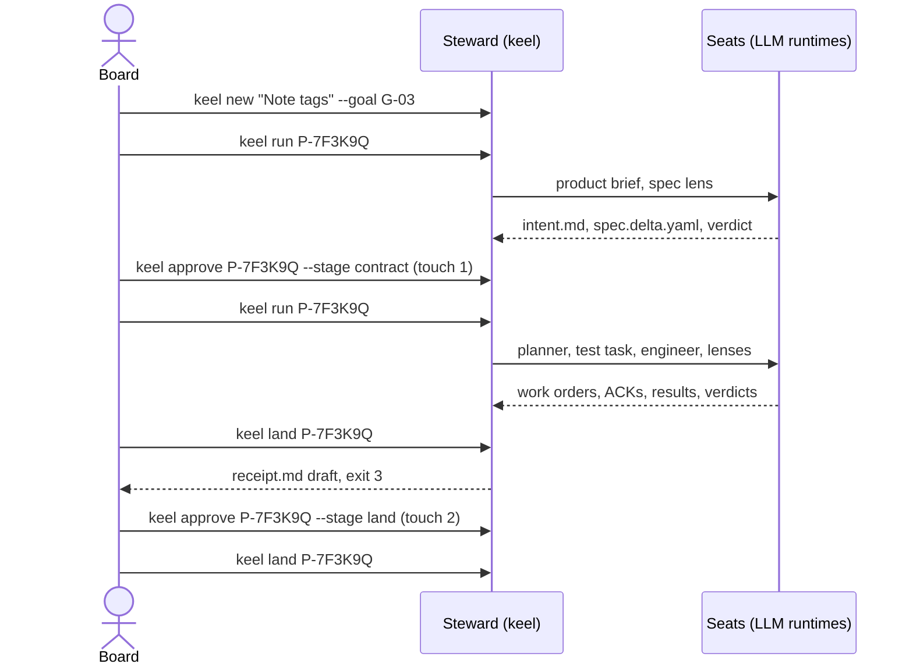

# Owner's one-page guide

You are the Board. keel's agents produce artifacts; you hold every decision that matters, and you exercise
it by signing. This page is what you need day to day. It owns three things: the daily commands, the
reading list for each checkpoint, and where to look when work is blocked. Everything else links to its
home. M0 ships no executable; the commands are the designed interface in
[12-cli-api-mcp.md](12-cli-api-mcp.md).

Before the first change, once per repository:

```sh
ssh-keygen -t ed25519-sk -f <path-to-board-key>   # your Board key; FIDO2 -sk on Windows: verify by probe
# set KEEL_BOARD_KEY=<path-to-board-key> in your own environment (a path, never key material)
keel init --signer <path-to-board-key>.pub         # scaffold .keel/, set the trace epoch, register your signer
keel doctor --section signing      # verified ssh-keygen path, -sk or not, no key loaded in an agent
keel doctor                        # runtimes, providers (names only), exposure profile
keel approve --doc .keel/charter.md
keel approve --doc .keel/goals.yaml
keel approve --doc .keel/routing.yaml
```

Provider endpoints, keys and model names live in your own environment or secret manager, never in a file
keel reads ([10-providers.md](10-providers.md)). Use a FIDO2 `-sk` key (`-sk` support on Windows: verify by
probe; see `keel doctor --section signing`), or a passphrase key that is not loaded in any ssh-agent: keel
refuses to sign while a non-`-sk` Board key is agent-loaded. Key selection (`KEEL_BOARD_KEY`,
`KEEL_BOARD_PRINCIPAL`) is defined in [14-trust-security.md](14-trust-security.md).

Your open actions: confirm the "Adopted by recommendation" list in
[17-open-decisions.md](17-open-decisions.md) (part of the M0 exit), and answer each truly open item there
when it blocks something you need. Until the env-scrub probe passes for a runtime on your machine, no route
can host the engineer seat ([10-providers.md](10-providers.md) section 4); `keel doctor --section exposure`
shows where you stand.

## The five commands you use every day

| Command | Use it to | Notes |
| --- | --- | --- |
| `keel status --next` | See every proposal's computed state and the legal next actions, including items waiting for you | State is computed from the ledger, never stored ([03-lifecycle.md](03-lifecycle.md)) |
| `keel new "<title>" --goal G-nn` | Start a change; keel mints a `P-` id and classifies the track | Add `--policy <name>` to use a standing policy; you sign the verbatim request |
| `keel run <P>` | Let the Steward dispatch the next seats and tasks for a proposal | `--wave` for parallel waves; `--hold on <P>` pauses a proposal |
| `keel approve <subject> ...` | Sign a checkpoint (`--stage contract\|plan\|land\|receipt`), a document (`--doc`), a standing policy (`--policy <name>`), or a ruling (`--rule ...`) | Shows exactly what to read, asks for a typed confirmation, then your passphrase or key touch |
| `keel land <P>` | Integrate, re-execute acceptance on the integrated commit, write the receipt draft, and move trunk once your land approval exists | Without an approval it stops at the receipt draft with exit 3; `--preview` stops after the integration preview |

When you need more:

- `keel trace <file:line|commit|R-…|G-…|P-…|el:…>` walks a line back to its goal; `--matrix` prints the RTM.
- `keel check <P>` runs the phase gates and shows each check with its denominator.
- `keel dashboard build` writes a read-only HTML page with your Board queue ([08-dashboard.md](08-dashboard.md)).
- `keel audit` finds orphans, expired overrides and ledger chain breaks.
- `keel doctor --section runtimes|providers|vcs|signing|exposure|arch` diagnoses one area.

## Walkthrough: two signatures for a feature change

The example is proposal `P-7F3K9Q` ("Note tags") from `examples/acme-notes/`, a feature with one builder.
Plan approval is not required on feature when every wave has width 1 and routing follows the signed
routing, so you sign twice.



1. `keel new "Note tags" --goal G-03`. keel mints `P-7F3K9Q`, classifies it as feature, and creates branch
   `keel/P-7F3K9Q/main`.
2. `keel run P-7F3K9Q`. The product seat frames the change and a spec lens from a different declared family
   reviews it. `keel status --next` then shows "contract approval due".
3. **Touch 1:** `keel approve P-7F3K9Q --stage contract`. Read the frozen block and the spec-delta diff
   (next section). Your signature freezes the contract; any later byte change invalidates it.
4. `keel run P-7F3K9Q` again. The planner plans; the test-first task, the build task and the review lenses
   run. You are interrupted only for stop-class asks, Board-owned asks and budget raises.
5. `keel land P-7F3K9Q`. The Steward integrates, previews, re-executes acceptance on the integrated commit
   and writes the receipt draft, then stops with exit 3 because your land approval does not exist yet.
6. **Touch 2:** `keel approve P-7F3K9Q --stage land`. Read `receipt.md`; the archived one for this change is
   [`examples/acme-notes/.keel/archive/2026/P-7F3K9Q-note-tags/receipt.md`](../examples/acme-notes/.keel/archive/2026/P-7F3K9Q-note-tags/receipt.md).
7. `keel land P-7F3K9Q` again. keel verifies your signature, re-runs the land gate, writes the archive
   commit and advances trunk. It never pushes; pushing to a shared remote is a reserved action you perform
   yourself.

How often you sign depends on the track ([03-lifecycle.md](03-lifecycle.md)); rulings and answers to asks
come on top whenever they arise:

| Track | Board touches |
| --- | --- |
| spike | None; the answer is a document, and nothing lands |
| patch (per-change contract) | Contract, then land; on a solo repository a signed land policy can replace the land approval, followed by a receipt acknowledgement |
| patch under a standing policy | The signed request (`keel new --policy <name>`), then a land approval on a shared trunk; on a solo repository a signed land policy instead, followed by a receipt acknowledgement |
| feature | Contract and land; plus plan approval when a wave is wider than 1 or routing deviates from the signed routing |
| system | Contract, plan and land |

## What to read at each checkpoint

`keel approve` prints the same list. Commentary goes into the signed quote (`--quote "..."`); `receipt.md`
is never edited after signing. The stages themselves are defined in [01-org-model.md](01-org-model.md).

| Checkpoint | Read | Ask yourself | Do not sign when |
| --- | --- | --- | --- |
| contract | The frozen block of `intent.md` and the spec-delta diff; on system also `arch.delta.yaml` and new ADRs with their obligations | Is this the problem I meant? Are the non-goals and decision boundaries right? Does every ACC say how it will be proven? | Open questions remain, an ACC has no feasible evidence mode, or scope is wider than the goal needs |
| plan | The task table (covers, write sets, frozen tests, waves) and the seat → runtime / alias / declared family / tier table, with the budget | Are tests fixed before the build, or written by another declared family? Does each reviewer's declared family differ from the engineer's? | A test-mode ACC has no frozen test or test task, or the plan gate reported CONCERNS you do not accept |
| land | `receipt.md`: integrated commit and expected trunk tip, evidence, verdicts, rulings by cost-if-wrong, gates not run, remaining risks, the ACC → command table, the declared engineer and reviewer families, conformance status, exposure profile (example: [`receipt.md` of P-7F3K9Q](../examples/acme-notes/.keel/archive/2026/P-7F3K9Q-note-tags/receipt.md)) | Did every ACC run, on the integrated commit? What was not run, and why? Which rulings would be expensive if wrong? | Any ACC shows not_run without an override you issued, or independence is degraded without your ruling |
| receipt | `receipt.md` of a change that landed under a standing policy | Should the policy stay as it is? | Never blocking, but an unacknowledged receipt blocks the next change that touches the same elements or paths |
| request (`keel new --policy`) | The verbatim request you are about to sign | Is this change really inside the policy's predicates? | You did not write the request yourself |
| document (`--doc`) | The diff of the charter, goals, routing or `allowed_signers` | For routing: is each alias's declared family what you believe the endpoint serves? | The diff contains anything you did not intend |
| policy (`--policy <name>`) | The diff of `.keel/policies/<name>.yaml` and each of its predicates | Would I accept every change these predicates let land without reading each one? | A predicate is wider than you intend |
| ruling (`--rule`) | The item: the question, finding, budget or track change, with its evidence | What does it cost if this ruling is wrong, and can it be reversed? | The item asks you to act on a stop class without the facts |

## Where to look when something is blocked

Start with `keel status --next`; it names the reason, the unblock owner and the legal next actions. The
states and reasons are defined in [03-lifecycle.md](03-lifecycle.md).

| Symptom | Where to look | How it unblocks |
| --- | --- | --- |
| `blocked(ack_mismatch)` | `keel status <P.Tn>` shows the ACK diff against the brief's id set | The ask goes to the clause owner; answer it, or amend the contract if the brief was wrong |
| Task parked on an ask | `keel status --next` lists open asks `Q-…` owned by you | `keel approve Q-… --rule answer --quote "..."` |
| `blocked(non_convergence)` | The verdicts and fix rounds in `keel status <P.Tn>` and the dashboard Proposals view | Your ruling: `--rule dismiss` for a wrong finding, a replan, or `--rule abandon` |
| `blocked(track_raised)` | `keel check <P> --gate submit` shows predicted vs actual impact | Let it re-route with the added checkpoints, or lower it if the raise is spurious: `keel approve <P> --rule track --to <track> --quote "..."` |
| `blocked(budget)` | `keel status <P>` shows spend against budget | Raise it: `keel approve <subject> --rule budget --limit usd=<n>` (or `runs=<n>`, `wall_minutes=<n>`) |
| `blocked(runtime_unavailable)` | `keel doctor --section runtimes`, `--section providers`, `--section exposure` | Set the named variables in your environment, fix the route in `routing.yaml` and re-sign it, or route the seat elsewhere; there is no acknowledgement path around the exposure rule |
| `blocked(reserved_op)` | The ref-snapshot diff in `keel status <P.Tn>` and the Board queue | Investigate; then `--rule override` with a reason and expiry, or `--rule abandon` |
| Liveness orphan | `keel audit` and the dashboard Board queue | Give the task an owner: answer the ask, re-run, or abandon |
| Exit 3 | Any command | A human decision is needed; the output names it |
| Exit 4 | `keel run` | Another run holds the claim; it is never retried automatically |
| Exit 5 | `keel land` | Trunk is checked out in a dirty worktree, or state is stale; clean up and retry |
| Exit 6 | `keel approve`, `keel run`, `keel land` | Environment problem, for example a Board key loaded in an ssh-agent; remove it with `ssh-add -d <path-to-board-key>` (or `ssh-add -D`); the Windows agent keeps keys across reboots |

Never debug a failing model call by opening provider or credential files. keel's refusal messages and
`keel doctor` carry the routing decision without the values ([10-providers.md](10-providers.md)).
