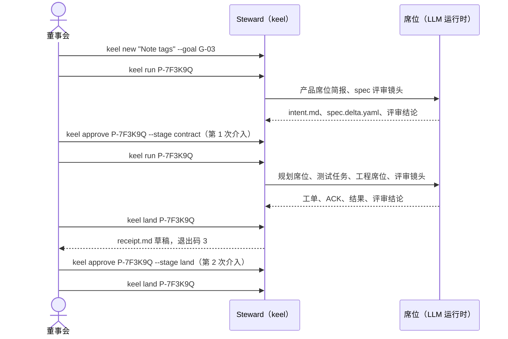

# 所有者一页指南

> 英文原文（规范版本）：[00a-owner-guide.md](00a-owner-guide.md)。本文是其简体中文镜像，两者不一致时以英文版为准。

你就是董事会（Board）。keel 的智能体产出产物；每一个重要的决定都由你掌握，而你通过签名来行使它。这一页是你日常所需的内容。它负责三件事：日常命令、每个检查点（checkpoint）的阅读清单，以及工作受阻时去哪里看。其余一切都链接到各自的归属文档。M0 不提供可执行文件；这些命令是 [12-cli-api-mcp.zh-CN.md](12-cli-api-mcp.zh-CN.md) 中设计好的接口。

在第一次变更之前，每个仓库执行一次：

```sh
ssh-keygen -t ed25519-sk -f <path-to-board-key>   # your Board key; FIDO2 -sk on Windows: verify by probe
# set KEEL_BOARD_KEY=<path-to-board-key> in your own environment (a path, never key material)
keel init --signer <path-to-board-key>.pub         # scaffold .keel/, set the trace epoch, register your signer
keel doctor --section signing      # verified ssh-keygen path, -sk or not, no key loaded in an agent
keel doctor                        # runtimes, providers (names only), exposure profile
keel approve --doc .keel/charter.md
keel approve --doc .keel/goals.yaml
keel approve --doc .keel/routing.yaml
```

模型提供方（provider）的端点、密钥和模型名称保存在你自己的环境或密钥管理器中，绝不放在 keel 会读取的文件里（[10-providers.zh-CN.md](10-providers.zh-CN.md)）。请使用 FIDO2 `-sk` 密钥（Windows 上对 `-sk` 的支持：待探测验证；见 `keel doctor --section signing`），或者一把没有加载到任何 ssh-agent 中的口令密钥：只要某把非 `-sk` 的董事会密钥被加载在 ssh-agent 中，keel 就拒绝签名。密钥的指定方式（`KEEL_BOARD_KEY`、`KEEL_BOARD_PRINCIPAL`）定义见 [14-trust-security.zh-CN.md](14-trust-security.zh-CN.md)。

你的待办事项：确认 [17-open-decisions.zh-CN.md](17-open-decisions.zh-CN.md) 中的“按建议采纳”清单（这是 M0 退出标准的一部分），并在其中某个真正待定的事项阻塞了你需要的东西时作出回答。在某个运行时的环境变量清洗探测于你的机器上通过之前，没有任何路由能承担工程席位（[10-providers.zh-CN.md](10-providers.zh-CN.md) 第 4 节）；`keel doctor --section exposure` 会显示你目前的状况。

## 你每天用的五个命令

| 命令 | 用途 | 说明 |
| --- | --- | --- |
| `keel status --next` | 查看每个提案（proposal）计算出的状态和合法的下一步操作，包括等待你处理的事项 | 状态由账本（ledger）计算得出，从不存储（[03-lifecycle.zh-CN.md](03-lifecycle.zh-CN.md)） |
| `keel new "<title>" --goal G-nn` | 发起一次变更；keel 铸造一个 `P-` 编号并对轨道（track）分类 | 加上 `--policy <name>` 以使用常设策略（standing policy）；你签署的是逐字请求 |
| `keel run <P>` | 让 Steward 为某个提案派发接下来的席位（seat）和任务 | `--wave` 用于并行波次（wave）；`--hold on <P>` 暂停一个提案 |
| `keel approve <subject> ...` | 签署检查点（`--stage contract\|plan\|land\|receipt`）、文档（`--doc`）、常设策略（`--policy <name>`）或裁定（`--rule ...`） | 准确显示要读什么，要求输入确认，然后要求你的口令或触碰密钥 |
| `keel land <P>` | 集成、在集成后的提交上重新执行验收、写出回执（receipt）草稿，并在你的落地批准存在后移动主干 | 没有批准时停在回执草稿处，退出码为 3；`--preview` 在集成预览之后停止 |

需要更多功能时：

- `keel trace <file:line|commit|R-…|G-…|P-…|el:…>` 把一行代码回溯到其目标；`--matrix` 打印 RTM。
- `keel check <P>` 运行阶段门禁（gate），并显示每项检查及其分母。
- `keel dashboard build` 写出一个只读的 HTML 页面，其中含有你的董事会待办队列（[08-dashboard.zh-CN.md](08-dashboard.zh-CN.md)）。
- `keel audit` 查找孤儿项、已过期的豁免（override）和账本链断裂。
- `keel doctor --section runtimes|providers|vcs|signing|exposure|arch` 诊断某一个方面。

## 演练：一次 feature 变更的两次签名

示例是来自 `examples/acme-notes/` 的提案 `P-7F3K9Q`（“Note tags”），这是一个只有一个构建者的 feature。在 feature 轨道上，当每个波次的宽度都为 1、且路由遵循签名的路由配置时，不需要计划批准，所以你只需签名两次。



1. `keel new "Note tags" --goal G-03`。keel 铸造 `P-7F3K9Q`，将其分类为 feature，并创建分支 `keel/P-7F3K9Q/main`。
2. `keel run P-7F3K9Q`。产品席位框定这次变更，一个来自不同声明的模型家族（declared family）的 spec 评审镜头（lens）对其进行评审。随后 `keel status --next` 显示 “contract approval due”（契约批准待办）。
3. **第 1 次介入：** `keel approve P-7F3K9Q --stage contract`。阅读冻结块和规格增量差异（见下一节）。你的签名冻结契约；此后任何字节变化都会使其失效。
4. 再次 `keel run P-7F3K9Q`。规划席位进行规划；测试先行任务、构建任务和评审镜头依次运行。只有停止类别（stop class）提问、董事会负责的提问和预算上调才会打扰你。
5. `keel land P-7F3K9Q`。Steward 进行集成、预览、在集成后的提交上重新执行验收并写出回执草稿，然后以退出码 3 停止，因为你的落地批准尚不存在。
6. **第 2 次介入：** `keel approve P-7F3K9Q --stage land`。阅读 `receipt.md`；这次变更归档后的版本见 [`examples/acme-notes/.keel/archive/2026/P-7F3K9Q-note-tags/receipt.md`](../examples/acme-notes/.keel/archive/2026/P-7F3K9Q-note-tags/receipt.md)。
7. 再次 `keel land P-7F3K9Q`。keel 验证你的签名，重新运行落地门禁，写出归档提交并推进主干。它从不推送；推送到共享远程仓库是一项由你亲自执行的保留操作。

你需要签名的次数取决于轨道（[03-lifecycle.zh-CN.md](03-lifecycle.zh-CN.md)）；裁定和对提问的回答随时可能额外出现：

| 轨道 | 董事会介入 |
| --- | --- |
| spike | 无；答案是一份文档，不会落地任何东西 |
| patch（逐变更契约） | 契约，然后落地；在单人仓库上，已签名的落地策略可以取代落地批准，之后再做一次回执确认 |
| 常设策略下的 patch | 签署请求（`keel new --policy <name>`），然后在共享主干上做落地批准；在单人仓库上改为已签名的落地策略，之后再做一次回执确认 |
| feature | 契约和落地；当某个波次宽度大于 1 或路由偏离签名的路由配置时，再加计划批准 |
| system | 契约、计划和落地 |

## 每个检查点要读什么

`keel approve` 会打印同样的清单。评注写进签名的引述（`--quote "..."`）中；`receipt.md` 在签名之后从不编辑。阶段本身的定义见 [01-org-model.zh-CN.md](01-org-model.zh-CN.md)。

| 检查点 | 阅读 | 自问 | 以下情况不要签名 |
| --- | --- | --- | --- |
| contract | `intent.md` 的冻结块和规格增量差异；在 system 轨道上还有 `arch.delta.yaml` 以及新 ADR 及其义务 | 这是我想解决的问题吗？非目标和决策边界对吗？每个 ACC 都说明了如何证明吗？ | 仍有未决问题、某个 ACC 没有可行的证据模式，或范围超出目标所需 |
| plan | 任务表（covers、写集、冻结测试、波次）以及席位 → 运行时 / 别名 / 声明的模型家族 / 档位表，连同预算 | 测试是否已在构建之前固定，或者由另一个声明的模型家族编写？每个评审席位声明的家族是否都与工程席位的不同？ | 某个 test 模式的 ACC 没有冻结测试或测试任务，或计划门禁报告了你不接受的 CONCERNS |
| land | `receipt.md`：集成后的提交和预期的主干顶端、证据、评审结论、按出错代价排序的裁定、未运行的门禁、剩余风险、ACC → 命令表、声明的工程席位家族和评审席位家族、一致性测评状态、暴露面画像（示例：[P-7F3K9Q 的 `receipt.md`](../examples/acme-notes/.keel/archive/2026/P-7F3K9Q-note-tags/receipt.md)） | 每个 ACC 都在集成后的提交上运行了吗？哪些没有运行，为什么？哪些裁定一旦出错代价高昂？ | 任何 ACC 显示 not_run 却没有你签发的豁免，或者独立性为降级（degraded）却没有你的裁定 |
| receipt | 在常设策略下落地的变更的 `receipt.md` | 该策略应该保持原样吗？ | 从不阻塞，但未确认的回执会阻塞下一个触及相同架构元素或路径的变更 |
| 请求（`keel new --policy`） | 你即将签署的逐字请求 | 这次变更真的在策略的谓词范围之内吗？ | 请求不是你亲自写的 |
| 文档（`--doc`） | 章程、目标、路由或 `allowed_signers` 的差异 | 对于路由：每个别名声明的家族，是否就是你认为该端点所提供的模型家族？ | 差异中包含任何你无意做出的改动 |
| 策略（`--policy <name>`） | `.keel/policies/<name>.yaml` 的差异及其每个谓词 | 这些谓词允许不经我逐一阅读就落地的每一个变更，我都能接受吗？ | 某个谓词比你的本意更宽 |
| 裁定（`--rule`） | 该事项：问题、发现项、预算或轨道变更，连同其证据 | 如果这个裁定错了，代价是什么？能否撤回？ | 该事项要求你在没有事实依据的情况下就停止类别采取行动 |

## 工作受阻时去哪里看

从 `keel status --next` 开始；它会指出原因、解除阻塞的负责人以及合法的下一步操作。状态和原因的定义见 [03-lifecycle.zh-CN.md](03-lifecycle.zh-CN.md)。

| 症状 | 去哪里看 | 如何解除 |
| --- | --- | --- |
| `blocked(ack_mismatch)` | `keel status <P.Tn>` 显示 ACK 与简报编号集之间的差异 | 提问会发给条款负责人；回答它，或者如果简报有误，就修订契约 |
| 任务停驻在某个提问上 | `keel status --next` 列出由你负责的未决提问 `Q-…` | `keel approve Q-… --rule answer --quote "..."` |
| `blocked(non_convergence)` | `keel status <P.Tn>` 中的评审结论和修复轮次，以及看板的 Proposals 视图 | 你的裁定：对错误的发现项用 `--rule dismiss`、重新规划，或者 `--rule abandon` |
| `blocked(track_raised)` | `keel check <P> --gate submit` 显示预测与实际的影响面对比 | 让它带着新增的检查点重新路由；若该上调属于误报，则降低轨道：`keel approve <P> --rule track --to <track> --quote "..."` |
| `blocked(budget)` | `keel status <P>` 显示花费与预算的对比 | 提高预算：`keel approve <subject> --rule budget --limit usd=<n>`（或 `runs=<n>`、`wall_minutes=<n>`） |
| `blocked(runtime_unavailable)` | `keel doctor --section runtimes`、`--section providers`、`--section exposure` | 在你的环境中设置所指明的变量、修正 `routing.yaml` 中的路由并重新签署，或者把该席位路由到别处；暴露规则没有任何确认式的绕行路径 |
| `blocked(reserved_op)` | `keel status <P.Tn>` 中的引用快照差异和董事会待办队列 | 先调查；然后用 `--rule override` 并给出理由和到期时间，或者用 `--rule abandon` |
| 活性孤儿 | `keel audit` 和看板的董事会待办队列 | 给任务一个负责人：回答提问、重新运行或放弃 |
| 退出码 3 | 任何命令 | 需要人类作出决定；输出会指明是什么决定 |
| 退出码 4 | `keel run` | 另一个运行持有该认领；永远不会自动重试 |
| 退出码 5 | `keel land` | 主干被检出在一个有未提交改动的工作树中，或者状态已过期；清理后重试 |
| 退出码 6 | `keel approve`、`keel run`、`keel land` | 环境问题，例如董事会密钥被加载在 ssh-agent 中；用 `ssh-add -d <path-to-board-key>`（或 `ssh-add -D`）移除它；Windows 的 agent 会在重启后保留密钥 |

绝不要通过打开模型提供方或凭据文件来调试失败的模型调用。keel 的拒绝消息和 `keel doctor` 会携带路由决定，但不携带任何值（[10-providers.zh-CN.md](10-providers.zh-CN.md)）。
