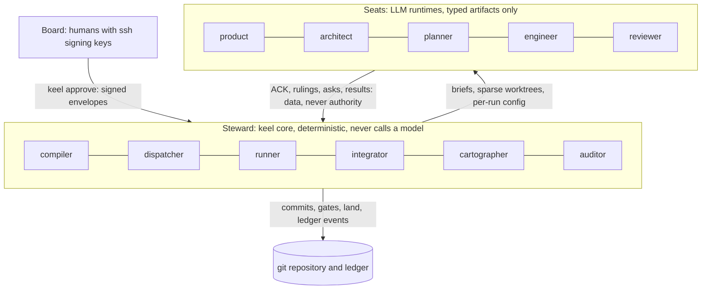

# Organization model: the Board, the Steward and five seats

This document owns keel's organization: who holds authority, what the deterministic core does, what each
LLM seat may and may not do, who writes which artifact, how work escalates, and how many seats each track
uses. The alignment mechanisms that bind seats to intent are in [02-alignment.md](02-alignment.md); the
lifecycle is in [03-lifecycle.md](03-lifecycle.md).

## Organization as data

The company is data, not dialogue. It has three parts:

- **the Board**, one or more humans;
- **the Steward**, keel's deterministic core, made of six code modules (compiler, dispatcher, runner,
  integrator, cartographer, auditor), none of which is an employee;
- **five seat contracts**, one YAML file each under `org/seats/`.

There are no departments and no desks. From M4, element owner labels in the architecture model route
reviewers ([07-architecture-intelligence.md](07-architecture-intelligence.md)).

The canonical organization files:

| File | Holds |
| --- | --- |
| `org/seats/<seat>.yaml` | One seat contract per seat (schema `schemas/seat.schema.json`) |
| `org/seats/reviewer.yaml` | The reviewer contract and the only lens-set table |
| `org/reserved-actions.yaml` | The canonical reserved actions; project additions are referenced from the charter |
| `org/checkpoints.yaml` | Checkpoint stages and what each asks the Board to read |

A seat contract lists:

- inputs and outputs;
- writable globs and fields;
- allowed `keel api` ops;
- an execution class: `none`, `read-only` or `code-executing`;
- the per-seat ACK id set;
- the output schema and submit channel;
- the default tier;
- the independence rule;
- the assumption the seat encodes, so that a seat can be retired with evidence.

At dispatch, the Steward resolves a route {runtime, profile alias, tier} for the seat from the Board-signed
`.keel/routing.yaml`. The route is frozen into the run record together with the route's exposure profile and
the seat's conformance status. A route that fails the seat's exposure rule is refused with
`blocked(runtime_unavailable)`; there is no acknowledgement path around it
([10-providers.md](10-providers.md)).

Coordination is deterministic: consumes/produces edges between artifacts, a task DAG from the work orders'
`after` edges, and CAS claim locks whose lease state lives in the ledger
([06-parallelism.md](06-parallelism.md)). No LLM routes work.

Borrowed from: MetaGPT (roles as typed subscribers to artifact kinds), BMAD-METHOD (ticket DAG), Paperclip
(atomic checkout where a conflict is final).

## Board powers and the four stage signatures

The Board is one or more humans identified by ssh signing keys in `.keel/board/allowed_signers`. The root
signer's fingerprint is pinned in the signed charter, and `keel init` records trust on first use with a
quoted consent. Changes to `allowed_signers` must be signed by an existing signer.

The Board alone does the following, all through `keel approve`:

- **Signs documents**: charter, goals, routing (including each alias's declared family) and
  `allowed_signers`, with `keel approve --doc <path>`, and standing policies with
  `keel approve --policy <name>` (envelope kind `policy`). Each reaches trunk as a Steward governance commit
  carrying `Keel-Doc` and `Keel-Approval` ([04-trace-and-state.md](04-trace-and-state.md)).
- **Signs policy-path requests**: `keel new --policy <name>` makes the Board sign the verbatim request, one
  touch ([02-alignment.md](02-alignment.md)).
- **Signs the four stage checkpoints** (table below).
- **Issues every Board ruling** with `keel approve <subject> --rule <kind>` (table below).
- **Authorizes reserved actions**, such as pushing to a shared remote ([05-vcs.md](05-vcs.md)).
- **Sets every provider endpoint, key and model name** in its own environment, outside keel.

The Board may not approve through an agent or a relayed message, sign an artifact whose current hash
differs from the one presented, sign with a key loaded in an ssh-agent (unless it is a FIDO2 `-sk` key), or
expose provider values to keel or to any assistant. No seat reviews the Board; the auditor module reports
unsigned, expired and stale items, unacknowledged receipts and agent-loadable signer keys.

### Checkpoint stages

| Stage | Binds | Required | Blocking |
| --- | --- | --- | --- |
| contract | The frozen intent plus `spec.delta.yaml` (plus `arch.delta.yaml` on system), as `contract_hash`; the `keel/
/main` commit; the ledger chain head | patch without a policy path, feature, system | Yes |
| plan | `plan.yaml`, the work orders, `routing.snapshot.yaml` and the budget | Always on system; on feature only when a wave is wider than 1 or routing deviates from the signed routing; never on patch | Yes |
| land | The receipt draft, which names the integrated commit and the expected trunk tip, and the chain head | feature and system; on patch, as the land policy says | Yes on feature and system |
| receipt | Acknowledgement of the receipt of a change that landed under a standing policy | After every policy land | No, but an unacknowledged receipt blocks the next change that touches the same elements, or the same path globs when the paths are unmapped |

The envelope format and how signatures are verified are in [02-alignment.md](02-alignment.md). What the
Board reads at each stage is in [00a-owner-guide.md](00a-owner-guide.md).

`keel approve` requires interactive confirmation: a TTY, or a typed confirmation code under Git Bash mintty.
It refuses under `KEEL_RUN` or `KEEL_RUN_ID`, exits 6 while any allowed signer key is agent-listed and is not
`-sk`, and needs the key's passphrase or a hardware touch ([14-trust-security.md](14-trust-security.md)).

### Board rulings

| Ruling | Use | Record |
| --- | --- | --- |
| `--rule answer` | Answer a Board-owned ask `Q-…` (ACC, scope, non-goals, INV, goals, stop classes) | `RL-` |
| `--rule budget` | Raise a budget that reached 100% | `RL-` |
| `--rule track` | Lower a track; the ratchet otherwise only rises | `RL-` |
| `--rule override` | Waive a named check or trace failure until a date, until land, or until a commit touches a path (`--until`) | `OV-` |
| `--rule dismiss` | Dismiss a finding; the only way besides a fix to close a critical or important finding | `RL-` |
| `--rule degraded` | Accept, per change, a review with no declared-family independence | `RL-` |
| `--rule unverified` | Accept, per change, a judge seat whose conformance status is unverified | `RL-` |
| `--rule abandon` | Abandon a proposal | `RL-` |

Waivers are overrides; there is no separate waiver record. Every ruling is a signed envelope and a ledger
event.

Borrowed from: old-coder (quotable consent), superpowers (approval binds only the presented artifact),
edikt (expiring overrides; idea only), OpenSSH (`ssh-keygen -Y`, `allowed_signers`, FIDO2 `-sk` keys).

## Steward modules (not employees)

The Steward is keel's own process. It never calls an LLM. The direct lane, which does call a model API for
tool-less review lenses, is a separate child process that the Steward spawns like any other runtime
([09-runtimes.md](09-runtimes.md)). The module names describe responsibilities; the TypeScript skeleton in
`src/` is organized by area.

| Module | Responsibilities |
| --- | --- |
| compiler | Mints ids; normalizes and hashes artifacts; computes `contract_hash`; compiles briefs and the PG hash; recompiles at submit and at each gate ([02-alignment.md](02-alignment.md)) |
| dispatcher | Resolves signed routing, compatibility, the exposure rule and conformance status; acquires claims; creates sparse worktrees; snapshots refs before each spawn; spawns runtimes headless with per-run config; ingests submit-channel drops |
| runner | Runs declared commands in clean sparse detached checkouts; records evidence; produces red/green proofs; re-executes the full acceptance matrix at land ([11-verification.md](11-verification.md)) |
| integrator | Makes every commit, with trailers; restacks task rounds; previews integration; writes the archive commit; updates trunk by ff-only or CAS ([05-vcs.md](05-vcs.md)) |
| cartographer | Classifies the track and recomputes it at submit; queries the IndexProvider; computes impact and drift; compiles element briefs ([07-architecture-intelligence.md](07-architecture-intelligence.md)) |
| auditor | Keeps the hash-chained ledger and verifies the chain; checks liveness; sweeps leases and overrides; runs the trace check; reports unsigned, expired or stale items and agent-loadable signer keys ([04-trace-and-state.md](04-trace-and-state.md)) |

The Steward may:

- write the control plane `.git/keel/**` as its sole writer;
- create and remove keel-provenance worktrees and refs under `refs/keel/*`;
- commit on `keel/*` branches, and CAS-update trunk after a verified land approval or a signed land policy;
- run declared commands in detached verify checkouts;
- run read-only `git ls-remote` against configured remotes.

The Steward may not:

- call any LLM in its own process;
- approve, or accept an unsigned, invalid or agent-key-signed approval;
- auto-resolve conflicts (`-X ours` or `-X theirs`) or rewrite landed history;
- open provider, credential or shared settings files, or dereference environment values outside
  `src/providers/env-policy.ts` and the direct lane's request builder.

The Board reviews the Steward through `keel check` and `keel trace`, the selftest suite and the gates'
negative controls.

Borrowed from: edikt (LLM-free core; idea only), OpenHands (event-sourced log), Gas Town (Refinery merge
queue).

## Five seat contracts, execution classes and ACK sets

`org/seats/*.yaml` is canonical; the tables summarize it.

| Seat | Subject | Writes | Execution class | ACK id set | Output | Default tier |
| --- | --- | --- | --- | --- | --- | --- |
| product | proposal `P` | `intent.md`, `spec.delta.yaml` (planning worktree); `answer.md` for a spike | read-only | goal, R, in-scope INV | `result.json` | frontier |
| architect | proposal `P` (system track) | `arch.delta.yaml`, `decisions/ADR-*.md` | read-only | goal, R, in-scope INV | `result.json` | frontier |
| planner | proposal `P` | `plan.yaml`, `workorders/T<n>.yaml`; triage records through `keel api submit` | read-only | ACC, R | `result.json`, `TR` records | frontier |
| engineer | task `P.Tn` | Files matching the work order's write_set in its own worktree; its run outbox | code-executing | ACC, R, in-scope INV, in-scope must and must_not obligations | file changes (committed by the Steward), `result.json` | standard |
| reviewer | review packet | Nothing | read-only (none on the direct lane) | the packet's ids | `verdict.json` | standard |

Execution classes:

- `none`: no tools at all; the whole input is the brief or lens prompt (the direct lane).
- `read-only`: reads the repository and runs no shell and no declared command. It authors only the files
  its contract names and returns them in its result (`files`); the Steward checks each path against the
  seat's writable globs and writes the files into the planning worktree, because read-only runtime modes
  cannot write.
- `code-executing`: runs a shell or declared build and test commands. Such a seat is dispatched only on a
  route that passes the exposure rule ([10-providers.md](10-providers.md)). A route that gives any seat a
  shell makes it code-executing for this rule.

Tiers: the engineer uses fast for mechanical transcription and moves one tier up at fix round 4. The
reviewer uses frontier for the final whole-proposal review and for intent alignment on the system track.

### Seat by seat

**product** turns a goal and a request into the proposal's frozen intent: problem, outcome, non-goals,
decision boundaries, ACC items with evidence modes, Always/Never, open questions, and a failure model on the
system track. It writes `spec.delta.yaml` (EARS requirements with scenarios, goal refs and `realized_in`),
answers requirement asks, and runs spikes, which produce `answer.md`.

- May: author `.keel/proposals/
-<slug>/{intent.md, spec.delta.yaml}` (written by the Steward into the
  planning worktree from its result); read code, specs, element pages and predicted impact;
  `keel api ack|ask|rule|submit`.
- May not: edit source or tests; edit the frozen block after contract approval except through an amendment
  the Board re-signs; write living specs; approve anything.
- Reviewed by: the frame gate, a spec lens from a different declared family, and the Board at contract
  approval.
- Suggested runtimes: claude-code (plan mode, submit via `--json-schema`), codex (`-s read-only`, submit via
  `--output-schema -o`), gemini-cli (plan mode; reviewer-class only until its `--policy` probe passes).

**architect** owns the declared architecture on the system track through `arch.delta.yaml`, ADRs with a
`## Obligations` list, and typed `keel arch plan` ops. It judges drift triage (fix, declare, escalate), owns
rule and baseline proposals, and receives non-convergent fixes on the system track.

- May: author `.keel/proposals/
-<slug>/{arch.delta.yaml, decisions/ADR-*.md}` (written by the Steward
  from its result); run `keel arch find|impact|drift|plan` (read-only).
- May not: edit code; edit `model.yaml` or `rules.yaml` directly; grow the baseline or loosen a rule
  without a contract approval that includes it.
- Reviewed by: the architecture lens from a different declared family, and the Board at contract approval.
- Suggested runtimes: claude-code, codex, gemini-cli.

**planner** turns an approved intent into `plan.yaml` and `workorders/T<n>.yaml`. Each work order carries
covers (ACC, R), `after`, write_set, frozen_tests, interfaces consumed and produced, the ACC → acceptance
command and matrix-row table, the global constraints copied verbatim, a review focus of at most 5 items,
stop classes, a route hint and a budget. The planner also writes triage records (confirm, upgrade, propose
dismissal), issues plan rulings and runs the BLOCKED remedy ladder.

- May: author `.keel/proposals/
-<slug>/{plan.yaml, workorders/*.yaml}` (written by the Steward from its
  result); submit `TR` records; `keel api ack|ask|rule|submit`.
- May not: edit code; change intent or ACC (asks go to product or the Board); dismiss an independent
  critical or important finding; choose a worker's next task or claim tasks; override a plan-gate FAIL.
- Reviewed by: the plan gate (PASS, CONCERNS or FAIL), a cross-family verification-gap lens over the ACC →
  command table and the frozen test tasks (feature and system), the Board at plan approval when required, and
  an auditor check that every triage record cites evidence.
- Suggested runtimes: claude-code, codex.

**engineer** implements exactly one work order in its own sparse worktree. It ACKs first; writes code, and
tests where the work order assigns them, red then green; does not commit; records rulings inside its
decision boundaries; asks when a question falls outside them; and submits `result.json` (status DONE,
DONE_WITH_CONCERNS, BLOCKED or NEEDS_CONTEXT, with a goal echo and the brief echo). The same seat type writes
test-first tasks for a different builder.

- May: write files matching write_set in its worktree; write its run outbox via `keel api`; run declared
  build and test commands (this produces no evidence; only the runner's evidence counts).
- May not: touch frozen_tests, `.keel/**` or paths outside write_set; push, move refs, rebase, write commit
  trailers, or run `jj undo` or `jj op restore`; run any mutating keel verb (`new`, `run`, `land`, `sync`,
  `audit`, `approve`); claim or pick tasks, mark work done, or weaken acceptance; use permission-bypass flags
  or spawn writing subagents; open provider or credential paths (checked at ingest).
- Reviewed by: reviewer lenses from a different declared family, and the Steward's gates.
- Suggested runtimes, each only once the env-scrub probe passes on the installed version
  ([10-providers.md](10-providers.md) section 4): claude-code (env auth with its candidate scrub control),
  codex (only on an env-only route verified by probe), qwen-code and opencode (GLM, Qwen or Kimi models;
  no scrub control is known, so their probe passes only if they scrub by themselves), kimi-code (rung D
  until a non-bypass write mode is verified by probe). In M0 no probe has passed, so no route qualifies
  yet and dispatch refuses the engineer with `blocked(runtime_unavailable)`.

**reviewer** runs read-only, context-free lenses: spec (frame stage), blind-diff, edge-case,
verification-gap, intent-alignment, architecture and audit. Each lens emits a verdict bound to the commit,
the diff digest, the contract hash and the brief. The lens catalogue and the synthesis rules are in
[11-verification.md](11-verification.md).

- May: read the exact commit in a sparse detached checkout, the diff, the work order, the element brief and
  the evidence; decline to judge, with reasons.
- May not: edit anything; see the engineer's transcript or treat its rationale as authority; approve or
  land; accept coaching (a controller tripwire rejects it).
- Reviewed by: the Steward's synthesis rules, then Board rulings on disputes. Planner triage cannot
  dismiss. Conformance status is shown as verified, failed or unverified.
- Suggested runtimes: any runtime whose declared family differs from the engineer's; the direct lane
  (tool-less, diff inline; M6).

Borrowed from: superpowers (status enum, BLOCKED remedy ladder, tier per seat, anti-coaching), BMAD-METHOD
(single-writer ownership, intent auditor), oh-my-codex (decision boundaries as typed fields), Agent OS
(seats record the assumption they encode).

## Single-writer ownership

Every artifact and field has exactly one writer. Everything else reads.

| Artifact | Sole writer |
| --- | --- |
| Living specs `.keel/specs/**`, arch model `.keel/arch/{model.yaml, rules.yaml, baseline.json}`, promoted ADRs `.keel/decisions/**` | The land archive commit (Steward), from approved deltas |
| Charter, goals, routing, policies, `allowed_signers` | The Board (edits take effect only once signed and committed through a governance commit) |
| Signature envelopes `.keel/signatures/**` | The Board through `keel approve`; committed by the Steward |
| `proposal.yaml` (intake signals only) | Steward |
| `intent.md`, `spec.delta.yaml` | product content, written from its result by the Steward |
| `arch.delta.yaml`, proposal `decisions/ADR-*.md` | architect content, written from its result by the Steward |
| `plan.yaml`, `workorders/*.yaml` | planner content, written from its result by the Steward |
| `routing.snapshot.yaml` | Steward |
| Triage records `TR-*` | planner (validated and stored by the Steward) |
| Verdicts `VD-*` | reviewer content, captured and stored by the Steward at ingest |
| Source and tests inside a task's write_set | That task's engineer (in its worktree; the Steward commits) |
| Frozen tests | The seat of the test-first task that wrote them, on a different declared family |
| Ledger, evidence, briefs, run records, claims, commits, trailers, `refs/keel/*` | Steward |
| Archive projections `.keel/archive/**` | Steward (archive commit) |
| keel-owned generated surfaces (managed `AGENTS.md` block, skill copies, keel agent files, `.keel/generated.lock.json`) | `keel sync` |
| Shared runtime settings and provider values | The user only; keel never reads or writes them |

The track, claim leases and heartbeats are ledger events, not file fields. `receipt.md` is never edited after
signing.

## Escalation path, four stop classes, remedy ladder

All escalation steps are ledger events.

1. **ACK mismatch.** keel returns success-shaped guidance. A second mismatch sets `blocked(ack_mismatch)`
   and routes an ask to the clause owner ([02-alignment.md](02-alignment.md)).
2. **Asks.** `keel api ask`, whose input names the clause id, routes by clause type (table below). The task
   parks until the answer is recorded.
3. **Stop classes.** The four stop classes always force an ask to the Board and are never settled by a
   seat's ruling (table below).
4. **BLOCKED or NEEDS_CONTEXT.** The planner runs the remedy ladder (below). The same model is never retried
   unchanged.
5. **Fix loop.** Rounds 1 to 3 resume the engineer; rounds 4 and 5 use a fresh engineer one tier up; past
   round 5 the task is `blocked(non_convergence)` and goes to the Board. Three failed fixes of the same
   finding go to the architect on the system track, and to the Board otherwise
   ([11-verification.md](11-verification.md)).
6. **intent_gap.** The patch is saved under `refs/keel/snap`, the proposal returns to framing and needs a
   fresh contract approval ([03-lifecycle.md](03-lifecycle.md)).
7. **Track raised at submit.** `blocked(track_raised)`, then re-routing with the added gates and
   checkpoints ([03-lifecycle.md](03-lifecycle.md)).
8. **Budget.** A warning at 80%, and `blocked(budget)` at 100% until `--rule budget`
   ([03-lifecycle.md](03-lifecycle.md)).
9. **Unavailable route or runtime**, including a failed exposure rule: `blocked(runtime_unavailable)` with
   the doctor reason. There is never a silent engine switch ([10-providers.md](10-providers.md)).
10. **Reserved operation** found in the ref-snapshot diff at ingest: `blocked(reserved_op)`, a Board item
    ([05-vcs.md](05-vcs.md)).
11. **Liveness.** Every non-terminal task holds a claim, a queued dispatch, a named unblock_owner with an
    open ask, or a pending approval; orphans surface on the Board queue ([03-lifecycle.md](03-lifecycle.md)).

### Ask routing

| Clause type | Routed to | Answered with |
| --- | --- | --- |
| Requirement `R-…` and scenarios `R-…#S<n>` | product | `keel api rule` or a spec-delta change in a new round |
| Architecture elements, rules and ADR obligations `ADR-<5>.O<n>` | architect | `keel api rule` or an arch-delta change |
| Plan steps and interfaces | planner | `keel api rule` or a replan |
| ACC, scope, non-goals, INV, goals, and every stop class | Board | `keel approve Q-… --rule answer` |

### Stop classes

| Identifier | Meaning | Examples |
| --- | --- | --- |
| `irreversible_or_destructive` | The action cannot be undone or destroys data | Deleting or migrating stored data, dropping a schema, removing files outside the task's purpose |
| `security_sensitive` | The action changes a security property | Authentication, authorization, cryptography, secret handling, permission changes |
| `side_effect_outside_workspace` | The action reaches beyond the task's worktree | Network calls to real services, writes outside the workspace, sending messages, publishing |
| `every_path_a_guess` | No option is supported by the brief, the contract or the code | Two contradictory requirements with no precedence to decide between them |

Stop classes are listed in every work order and brief; a ruling that touches one is flagged to the Board
automatically ([02-alignment.md](02-alignment.md)).

### Remedy ladder

For a result of BLOCKED or NEEDS_CONTEXT, the planner climbs one step at a time:

1. add context on the same route;
2. one tier higher;
3. split the task;
4. planner ruling or replan;
5. the Board.

Borrowed from: superpowers (rulings with cost-if-wrong, stop classes, BLOCKED remedy ladder, bounded fix
loop), Paperclip (budgets that warn at 80% and stop at 100%, never silently switch engines).

## Staffing per track

There is one right-sizing axis, the track ([03-lifecycle.md](03-lifecycle.md)). The lens sets are defined
in `org/seats/reviewer.yaml` and explained in [11-verification.md](11-verification.md).

| Track | Seats | Review | Board checkpoints | Typical Board touches |
| --- | --- | --- | --- | --- |
| spike | product (read-only, scratch worktree) | none | none; no land | 0 |
| patch | engineer; product only when new ACC are needed | the `patch` lens set (one lens), or the `policy` set (two lenses) on a policy land | contract (or a signed request on the policy path); land per land policy; receipt acknowledgement after a policy land | 1 to 2 |
| feature | product, planner, 1..N engineers, the Steward | frame: `frame` set; plan: `plan` set; build: `quick` set; all on a different declared family | contract, land; plan only when a wave is wider than 1 or routing deviates | 2 |
| system | product, architect, planner, 1..N engineers, the Steward | frame: `frame_system` set; plan: `plan` set; build: `thorough` set with a frontier intent auditor | contract (with arch delta and failure model), plan (always), land | 3 |

Seat counts: spike 1; patch 1 (plus 1 or 2 lenses, plus product for new ACC); feature 3 to 4 plus N;
system 5 plus N.

## Why keel uses no personas

keel's seats are contracts, not characters. A seat is defined by what it reads, what it may write, what it
must echo and who checks it, never by a name, a backstory or a department.

- **Mature workflows are shedding personas.** BMAD-METHOD v6 merged its Scrum Master and QA personas into
  the Developer and records its persona A/B evidence in its changelog (#2675); Agent OS v3 removed its role
  subagents. keel starts from the lesson rather than repeating the experiment.
- **LLM managers route unreliably.** CrewAI's hierarchical delegation and the MAST failure taxonomy show
  models mis-assigning and dropping work, so keel's routing, claims and state transitions are code
  ([KP-04](00-vision.md#kp-04-control-is-code-production-is-llm)).
- **Departments without mechanisms are noise.** Every organizational element keel keeps has an enforcement
  point: a writable glob, an ACK id set, a gate or a signature.
- **Seats must be retirable.** Each contract records the assumption it encodes (for example, that a separate
  planner catches coverage gaps an engineer would miss), so a seat, a lens or a review layer can be removed
  when measured yield does not justify it.
- **Prompts stay vendor-neutral.** Coercive, single-model-tuned prompt tone is avoided; conformance checks,
  not persona text, establish whether a model follows a contract ([09-runtimes.md](09-runtimes.md)).
