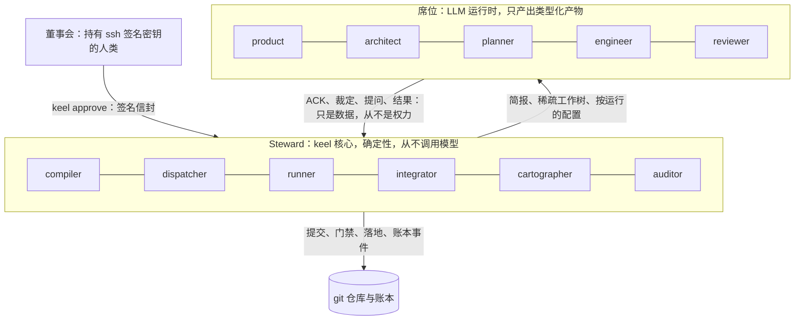

# 组织模型：董事会、Steward 与五个席位

> 英文原文（规范版本）：[01-org-model.md](01-org-model.md)。本文是其简体中文镜像，两者不一致时以英文版为准。

本文档负责 keel 的组织：谁掌握权力、确定性核心做什么、每个 LLM 席位（seat）可以做什么和不可以做什么、谁写哪个产物、工作如何升级，以及每种轨道（track）使用多少个席位。将席位绑定到意图的对齐机制见 [02-alignment.zh-CN.md](02-alignment.zh-CN.md)；生命周期见 [03-lifecycle.zh-CN.md](03-lifecycle.zh-CN.md)。

## 组织即数据

公司是数据，而不是对话。它由三部分组成：

- **董事会（Board）**，一位或多位人类；
- **Steward**，keel 的确定性核心，由六个代码模块组成（compiler、dispatcher、runner、integrator、cartographer、auditor），其中没有一个是员工；
- **五份席位契约**，每份都是 `org/seats/` 下的一个 YAML 文件。

没有部门，也没有工位。从 M4 起，架构模型中架构元素（element）的所有者标签用于路由评审者（[07-architecture-intelligence.zh-CN.md](07-architecture-intelligence.zh-CN.md)）。

规范的组织文件：

| 文件 | 内容 |
| --- | --- |
| `org/seats/<seat>.yaml` | 每个席位一份席位契约（schema 为 `schemas/seat.schema.json`） |
| `org/seats/reviewer.yaml` | 评审席位契约，以及唯一的镜头集表 |
| `org/reserved-actions.yaml` | 规范的保留操作；项目追加的保留操作从章程中引用 |
| `org/checkpoints.yaml` | 检查点阶段，以及每个阶段要求董事会阅读的内容 |

一份席位契约列出：

- 输入和输出；
- 可写的 glob 和字段；
- 允许的 `keel api` 操作；
- 执行等级：`none`、`read-only` 或 `code-executing`；
- 按席位的 ACK 编号集；
- 输出 schema 和提交通道；
- 默认档位（tier）；
- 独立性规则；
- 该席位所编码的假设，以便能够凭证据让一个席位退役。

派发时，Steward 根据董事会签名的 `.keel/routing.yaml` 为席位解析出一条路由 {runtime, profile alias, tier}。该路由连同其暴露面画像（exposure profile）和席位的一致性测评状态（conformance status）一起被冻结进运行记录。未通过该席位暴露规则的路由会以 `blocked(runtime_unavailable)` 被拒绝；不存在任何确认式的绕行路径（[10-providers.zh-CN.md](10-providers.zh-CN.md)）。

协调是确定性的：产物之间的消费/产出边、由工单（work order）的 `after` 边构成的任务 DAG，以及租约状态保存在账本（ledger）中的 CAS 认领（claim）锁（[06-parallelism.zh-CN.md](06-parallelism.zh-CN.md)）。没有任何 LLM 来路由工作。

借鉴自：MetaGPT（角色作为产物种类的类型化订阅者）、BMAD-METHOD（工单 DAG）、Paperclip（冲突即终局的原子签出）。

## 董事会权力与四个阶段签名

董事会由一位或多位人类组成，以 `.keel/board/allowed_signers` 中的 ssh 签名密钥标识。根签名者的指纹被固定在签名的章程（charter）中，`keel init` 以一段引述的同意声明记录首次使用时的信任（trust on first use）。对 `allowed_signers` 的更改必须由现有签名者签署。

只有董事会能做以下事情，且全部通过 `keel approve` 进行：

- **签署文档**：章程、目标、路由（包括每个别名声明的模型家族）和 `allowed_signers` 使用 `keel approve --doc <path>`，常设策略使用 `keel approve --policy <name>`（信封类型 `policy`）。每份文档都以一个携带 `Keel-Doc` 和 `Keel-Approval` 的 Steward 治理提交进入主干（[04-trace-and-state.zh-CN.md](04-trace-and-state.zh-CN.md)）。
- **签署策略路径请求**：`keel new --policy <name>` 让董事会签署逐字请求，一次介入（[02-alignment.zh-CN.md](02-alignment.zh-CN.md)）。
- **签署四个阶段检查点**（见下表）。
- **签发每一项董事会裁定**，使用 `keel approve <subject> --rule <kind>`（见下表）。
- **授权保留操作**，例如推送到共享远程仓库（[05-vcs.zh-CN.md](05-vcs.zh-CN.md)）。
- **设置每个模型提供方的端点、密钥和模型名称**，在其自己的环境中、keel 之外完成。

董事会不得通过智能体或转发的消息进行批准，不得签署当前哈希与所呈现哈希不同的产物，不得使用加载在 ssh-agent 中的密钥签名（FIDO2 `-sk` 密钥除外），也不得把模型提供方（provider）的值暴露给 keel 或任何助手。没有席位评审董事会；auditor 模块会报告未签名、已过期和已过时的事项、未确认的回执，以及可从 ssh-agent 加载的签名者密钥。

### 检查点阶段

| 阶段 | 绑定 | 何时需要 | 是否阻塞 |
| --- | --- | --- | --- |
| contract | 冻结意图加 `spec.delta.yaml`（system 轨道上再加 `arch.delta.yaml`），作为 `contract_hash`；`keel/
/main` 提交；账本链头 | 无策略路径的 patch、feature、system | 是 |
| plan | `plan.yaml`、工单、`routing.snapshot.yaml` 和预算 | system 上始终需要；feature 上仅当某个波次宽度大于 1 或路由偏离签名的路由配置时需要；patch 上从不需要 | 是 |
| land | 回执草稿（其中指明集成后的提交和预期的主干顶端）以及链头 | feature 和 system；patch 上按落地策略决定 | feature 和 system 上是 |
| receipt | 对在常设策略下落地的变更的回执进行确认 | 每次策略落地之后 | 否，但未确认的回执会阻塞下一个触及相同架构元素的变更；路径未映射时，则阻塞下一个触及相同路径 glob 的变更 |

信封格式以及签名如何验证，见 [02-alignment.zh-CN.md](02-alignment.zh-CN.md)。董事会在每个阶段阅读什么，见 [00a-owner-guide.zh-CN.md](00a-owner-guide.zh-CN.md)。

`keel approve` 需要交互式确认：一个 TTY，或在 Git Bash mintty 下输入确认码。它在 `KEEL_RUN` 或 `KEEL_RUN_ID` 下拒绝执行；只要任何受允许签名者的密钥被 ssh-agent 列出且不是 `-sk` 密钥，它就以退出码 6 退出；并且需要密钥的口令或硬件触碰（[14-trust-security.zh-CN.md](14-trust-security.zh-CN.md)）。

### 董事会裁定

| 裁定 | 用途 | 记录 |
| --- | --- | --- |
| `--rule answer` | 回答董事会负责的提问 `Q-…`（ACC、范围、非目标、INV、目标、停止类别） | `RL-` |
| `--rule budget` | 上调已达 100% 的预算 | `RL-` |
| `--rule track` | 降低轨道；否则棘轮只会上升 | `RL-` |
| `--rule override` | 豁免某项具名检查或追溯失败，直到某个日期、直到落地，或直到某个提交触及某个路径（`--until`） | `OV-` |
| `--rule dismiss` | 驳回一个发现项；这是除修复之外关闭 critical 或 important 发现项的唯一方式 | `RL-` |
| `--rule degraded` | 按变更接受一次没有声明的模型家族独立性的评审 | `RL-` |
| `--rule unverified` | 按变更接受一个一致性测评状态为 unverified 的评判席位 | `RL-` |
| `--rule abandon` | 放弃一个提案 | `RL-` |

waiver 就是豁免（override）；没有单独的 waiver 记录。每项裁定都是一个签名信封和一个账本事件。

借鉴自：old-coder（可引述的同意）、superpowers（批准只绑定所呈现的产物）、edikt（会过期的豁免；仅借鉴思想）、OpenSSH（`ssh-keygen -Y`、`allowed_signers`、FIDO2 `-sk` 密钥）。

## Steward 模块（不是员工）

Steward 是 keel 自己的进程。它从不调用 LLM。直连通道（direct lane）确实会为无工具的评审镜头调用模型 API，但它是一个独立的子进程，由 Steward 像拉起任何其他运行时（runtime）一样拉起（[09-runtimes.zh-CN.md](09-runtimes.zh-CN.md)）。模块名描述的是职责；`src/` 中的 TypeScript 骨架按领域组织。

| 模块 | 职责 |
| --- | --- |
| compiler | 铸造编号；规范化并哈希产物；计算 `contract_hash`；编译简报（brief）和 PG 哈希；在提交时和每道门禁处重新编译（[02-alignment.zh-CN.md](02-alignment.zh-CN.md)） |
| dispatcher | 解析签名的路由、兼容性、暴露规则和一致性测评状态；获取认领；创建稀疏工作树；每次拉起前为引用做快照；以按运行的配置无头拉起运行时；接收提交通道的投递文件 |
| runner | 在干净的稀疏分离检出中运行声明的命令；记录证据；生成红绿证明；在落地时重新执行完整的验收矩阵（[11-verification.zh-CN.md](11-verification.zh-CN.md)） |
| integrator | 完成每一次提交，并附上提交尾注；对任务轮次做 restack；预览集成；写出归档提交；以 ff-only 或 CAS 方式更新主干（[05-vcs.zh-CN.md](05-vcs.zh-CN.md)） |
| cartographer | 对轨道分类并在提交时重新计算；查询 IndexProvider；计算影响面和漂移；编译架构元素简报（[07-architecture-intelligence.zh-CN.md](07-architecture-intelligence.zh-CN.md)） |
| auditor | 维护哈希链式账本并验证链；检查活性；清扫租约和豁免；运行追溯检查；报告未签名、已过期或已过时的事项以及可从 ssh-agent 加载的签名者密钥（[04-trace-and-state.zh-CN.md](04-trace-and-state.zh-CN.md)） |

Steward 可以：

- 作为唯一写者，写入控制平面 `.git/keel/**`；
- 创建和删除带 keel 出处标记的工作树，以及 `refs/keel/*` 下的引用；
- 在 `keel/*` 分支上提交，并在经验证的落地批准或签名的落地策略之后，以 CAS 方式更新主干；
- 在分离的验证检出中运行声明的命令；
- 对已配置的远程仓库运行只读的 `git ls-remote`。

Steward 不可以：

- 在自己的进程中调用任何 LLM；
- 进行批准，或接受未签名、无效或由 ssh-agent 中的密钥签名的批准；
- 自动解决冲突（`-X ours` 或 `-X theirs`），或改写已落地的历史；
- 打开模型提供方、凭据或共享设置文件，或者在 `src/providers/env-policy.ts` 和直连通道的请求构建器之外解引用环境变量的值。

董事会通过 `keel check` 和 `keel trace`、自测套件以及各门禁的负对照来审查 Steward。

借鉴自：edikt（无 LLM 的核心；仅借鉴思想）、OpenHands（事件溯源日志）、Gas Town（Refinery 合并队列）。

## 五份席位契约、执行等级与 ACK 编号集

`org/seats/*.yaml` 是规范来源；下表是其摘要。

| 席位 | 主题 | 写入 | 执行等级 | ACK 编号集 | 输出 | 默认档位 |
| --- | --- | --- | --- | --- | --- | --- |
| product | 提案 `P` | `intent.md`、`spec.delta.yaml`（规划工作树）；spike 时为 `answer.md` | read-only | 目标、R、范围内的 INV | `result.json` | frontier |
| architect | 提案 `P`（system 轨道） | `arch.delta.yaml`、`decisions/ADR-*.md` | read-only | 目标、R、范围内的 INV | `result.json` | frontier |
| planner | 提案 `P` | `plan.yaml`、`workorders/T<n>.yaml`；通过 `keel api submit` 提交分诊记录 | read-only | ACC、R | `result.json`、`TR` 记录 | frontier |
| engineer | 任务 `P.Tn` | 在自己的工作树中与工单 write_set 匹配的文件；其运行的发件箱 | code-executing | ACC、R、范围内的 INV、范围内的 must 与 must_not 义务 | 文件改动（由 Steward 提交）、`result.json` | standard |
| reviewer | 评审包 | 不写任何东西 | read-only（直连通道上为 none） | 评审包中的编号 | `verdict.json` | standard |

执行等级：

- `none`：完全没有工具；全部输入就是简报或评审镜头提示词（直连通道）。
- `read-only`：读取仓库，不运行 shell，也不运行声明的命令。它只编写其契约指明的文件，并在结果中（`files`）返回；由于只读的运行时模式无法写文件，由 Steward 按该席位的可写 glob 检查每个路径，再把文件写入规划工作树。
- `code-executing`：运行 shell 或声明的构建与测试命令。这样的席位只会被派发到通过暴露规则的路由上（[10-providers.zh-CN.md](10-providers.zh-CN.md)）。就这条规则而言，任何给席位提供 shell 的路由都会使该席位成为 code-executing。

档位：工程席位在机械性的转写工作中使用 fast，并在第 4 轮修复时升高一个档位。评审席位在最终的整提案评审以及 system 轨道上的意图对齐评审中使用 frontier。

### 逐个席位

**product（产品席位）**把一个目标和一个请求转化为提案的冻结意图：问题、结果、非目标、决策边界、带证据模式的 ACC 项、Always/Never、未决问题，以及 system 轨道上的失败模型。它编写 `spec.delta.yaml`（带场景、目标引用和 `realized_in` 的 EARS 需求），回答需求类提问，并运行 spike，spike 产出 `answer.md`。

- 可以：编写 `.keel/proposals/
-<slug>/{intent.md, spec.delta.yaml}`（由 Steward 依据其结果写入规划工作树）；阅读代码、规格、架构元素页面和预测的影响面；`keel api ack|ask|rule|submit`。
- 不可以：编辑源代码或测试；在契约批准之后编辑冻结块，除非通过董事会重新签署的修订案（amendment）；写入活规格；批准任何东西。
- 评审方：框定门禁、一个来自不同声明的模型家族的 spec 评审镜头，以及契约批准时的董事会。
- 建议的运行时：claude-code（plan 模式，通过 `--json-schema` 提交）、codex（`-s read-only`，通过 `--output-schema -o` 提交）、gemini-cli（plan 模式；在其 `--policy` 探测通过之前仅限评审类用途）。

**architect（架构席位）**在 system 轨道上通过 `arch.delta.yaml`、带 `## Obligations` 列表的 ADR 以及类型化的 `keel arch plan` 操作，负责声明式架构。它裁断漂移分诊（修复、声明、上报），负责规则和基线提案，并接手 system 轨道上无法收敛的修复。

- 可以：编写 `.keel/proposals/
-<slug>/{arch.delta.yaml, decisions/ADR-*.md}`（由 Steward 依据其结果写入）；运行 `keel arch find|impact|drift|plan`（只读）。
- 不可以：编辑代码；直接编辑 `model.yaml` 或 `rules.yaml`；在没有包含该变化的契约批准的情况下扩大基线或放宽规则。
- 评审方：来自不同声明的模型家族的 architecture 评审镜头，以及契约批准时的董事会。
- 建议的运行时：claude-code、codex、gemini-cli。

**planner（规划席位）**把已批准的意图转化为 `plan.yaml` 和 `workorders/T<n>.yaml`。每份工单都包含 covers（ACC、R）、`after`、write_set、frozen_tests、消费和产出的接口、ACC → 验收命令与矩阵行表、逐字复制的全局约束、至多 5 项的评审重点、停止类别、路由提示和预算。规划席位还编写分诊记录（确认、升级、提议驳回），签发计划裁定，并执行 BLOCKED 补救阶梯。

- 可以：编写 `.keel/proposals/
-<slug>/{plan.yaml, workorders/*.yaml}`（由 Steward 依据其结果写入）；提交 `TR` 记录；`keel api ack|ask|rule|submit`。
- 不可以：编辑代码；更改意图或 ACC（提问发给产品席位或董事会）；驳回独立的 critical 或 important 发现项；为工作者选择下一个任务或认领任务；推翻计划门禁的 FAIL。
- 评审方：计划门禁（PASS、CONCERNS 或 FAIL）、针对 ACC → 命令表和冻结测试任务的跨家族验证缺口评审镜头（feature 和 system）、在需要时进行计划批准的董事会，以及一项检查每条分诊记录都引用了证据的 auditor 检查。
- 建议的运行时：claude-code、codex。

**engineer（工程席位）**在自己的稀疏工作树中恰好实现一份工单。它先做 ACK（复述确认）；编写代码，并在工单指派时编写测试，先红后绿；不做提交；在其决策边界内记录裁定；问题超出边界时提问；并提交 `result.json`（状态为 DONE、DONE_WITH_CONCERNS、BLOCKED 或 NEEDS_CONTEXT，附目标回显和简报回显）。同一种席位类型也为另一个构建者编写测试先行任务。

- 可以：在其工作树中写入与 write_set 匹配的文件；通过 `keel api` 写入其运行的发件箱；运行声明的构建和测试命令（这不产生证据；只有运行器的证据才算数）。
- 不可以：触碰 frozen_tests、`.keel/**` 或 write_set 之外的路径；推送、移动引用、rebase、写提交尾注，或运行 `jj undo` 或 `jj op restore`；运行任何会改变状态的 keel 动词（`new`、`run`、`land`、`sync`、`audit`、`approve`）；认领或挑选任务、把工作标记为完成，或削弱验收；使用绕过权限的标志或拉起具有写权限的子智能体；打开模型提供方或凭据路径（在接收时检查）。
- 评审方：来自不同声明的模型家族的评审镜头，以及 Steward 的门禁。
- 建议的运行时，每一个都须等到环境变量清洗探测在所安装版本上通过之后（[10-providers.zh-CN.md](10-providers.zh-CN.md) 第 4 节）：claude-code（环境变量认证，使用其候选清洗控制手段）、codex（仅限经探测验证的纯环境变量路由）、qwen-code 和 opencode（GLM、Qwen 或 Kimi 模型；尚无已知的清洗控制手段，因此只有它们自行清洗时探测才会通过）、kimi-code（在非绕过式写模式经探测验证之前为梯级 D）。在 M0 中还没有任何探测通过，因此目前没有任何路由符合条件，派发会以 `blocked(runtime_unavailable)` 拒绝工程席位。

**reviewer（评审席位）**运行只读、无上下文的评审镜头（lens）：spec（框定阶段）、blind-diff、edge-case、verification-gap、intent-alignment、architecture 和 audit。每个评审镜头都输出一个绑定到提交、差异摘要、契约哈希和简报的评审结论（verdict）。评审镜头目录和综合规则见 [11-verification.zh-CN.md](11-verification.zh-CN.md)。

- 可以：在稀疏分离检出中阅读确切的提交、差异、工单、架构元素简报和证据；拒绝评判并给出理由。
- 不可以：编辑任何东西；查看工程席位的对话记录，或把其理由当作权威；批准或落地；接受引导（controller 的绊线会拒绝它）。
- 评审方：Steward 的综合规则，然后是就争议作出的董事会裁定。规划席位的分诊不能驳回。一致性测评状态显示为 verified、failed 或 unverified。
- 建议的运行时：任何声明的模型家族与工程席位不同的运行时；直连通道（无工具，差异内联；M6）。

借鉴自：superpowers（状态枚举、BLOCKED 补救阶梯、按席位的档位、反引导）、BMAD-METHOD（单写者归属、意图审计员）、oh-my-codex（作为类型化字段的决策边界）、Agent OS（席位记录其所编码的假设）。

## 单写者归属

每个产物和字段都恰好只有一个写者。其他所有方都只读。

| 产物 | 唯一写者 |
| --- | --- |
| 活规格 `.keel/specs/**`、架构模型 `.keel/arch/{model.yaml, rules.yaml, baseline.json}`、已晋升的 ADR `.keel/decisions/**` | 落地归档提交（Steward），依据已批准的增量 |
| 章程、目标、路由、策略、`allowed_signers` | 董事会（编辑只有在签名并通过治理提交提交之后才生效） |
| 签名信封 `.keel/signatures/**` | 董事会通过 `keel approve` 生成；由 Steward 提交 |
| `proposal.yaml`（仅受理信号） | Steward |
| `intent.md`、`spec.delta.yaml` | product 的内容，由 Steward 依据其结果写入 |
| `arch.delta.yaml`、提案中的 `decisions/ADR-*.md` | architect 的内容，由 Steward 依据其结果写入 |
| `plan.yaml`、`workorders/*.yaml` | planner 的内容，由 Steward 依据其结果写入 |
| `routing.snapshot.yaml` | Steward |
| 分诊记录 `TR-*` | planner（由 Steward 验证并存储） |
| 评审结论 `VD-*` | reviewer 的内容，由 Steward 在接收时捕获并存储 |
| 任务 write_set 内的源代码和测试 | 该任务的工程席位（在其工作树中；由 Steward 提交） |
| 冻结测试 | 编写它们的测试先行任务所在的席位，位于不同的声明的模型家族上 |
| 账本、证据、简报、运行记录、认领、提交、提交尾注、`refs/keel/*` | Steward |
| 归档投影 `.keel/archive/**` | Steward（归档提交） |
| keel 自有的生成接口面（受管的 `AGENTS.md` 区块、技能副本、keel 智能体文件、`.keel/generated.lock.json`） | `keel sync` |
| 共享运行时设置和模型提供方的值 | 仅限用户；keel 从不读取或写入它们 |

轨道、认领租约和心跳都是账本事件，而不是文件字段。`receipt.md` 在签名之后从不编辑。

## 升级路径、四类停止类别与补救阶梯

所有升级步骤都是账本事件。

1. **ACK 不匹配。** keel 返回成功形态的指引（success-shaped guidance）。第二次不匹配会设置 `blocked(ack_mismatch)`，并把一个提问路由给条款负责人（[02-alignment.zh-CN.md](02-alignment.zh-CN.md)）。
2. **提问。** `keel api ask` 的输入指明条款 id，并按条款类型路由（见下表）。任务停驻，直到答案被记录。
3. **停止类别。** 四类停止类别（stop class）总是强制向董事会提问，绝不由席位的裁定解决（见下表）。
4. **BLOCKED 或 NEEDS_CONTEXT。** 规划席位执行补救阶梯（见下文）。同一个模型绝不会原样重试。
5. **修复循环。** 第 1 到 3 轮恢复原工程席位；第 4 和 5 轮使用高一档位的全新工程席位；超过第 5 轮，任务变为 `blocked(non_convergence)` 并交给董事会。同一发现项三次修复失败时，在 system 轨道上交给架构席位，否则交给董事会（[11-verification.zh-CN.md](11-verification.zh-CN.md)）。
6. **intent_gap（意图缺口）。** 当前改动被保存在 `refs/keel/snap` 下，提案回到框定阶段，并需要一次新的契约批准（[03-lifecycle.zh-CN.md](03-lifecycle.zh-CN.md)）。
7. **提交时轨道上升。** `blocked(track_raised)`，然后带着新增的门禁和检查点重新路由（[03-lifecycle.zh-CN.md](03-lifecycle.zh-CN.md)）。
8. **预算。** 80% 时告警，100% 时 `blocked(budget)`，直到 `--rule budget`（[03-lifecycle.zh-CN.md](03-lifecycle.zh-CN.md)）。
9. **路由或运行时不可用**，包括暴露规则未通过：`blocked(runtime_unavailable)`，并附 doctor 给出的原因。绝不会悄悄切换引擎（[10-providers.zh-CN.md](10-providers.zh-CN.md)）。
10. **保留操作**在接收时于引用快照差异中被发现：`blocked(reserved_op)`，成为一个董事会事项（[05-vcs.zh-CN.md](05-vcs.zh-CN.md)）。
11. **活性。** 每个非终态任务都持有一个认领、一个排队的派发、一个带未决提问的具名 unblock_owner，或一个待处理的批准；孤儿会出现在董事会待办队列中（[03-lifecycle.zh-CN.md](03-lifecycle.zh-CN.md)）。

### 提问路由

| 条款类型 | 路由给 | 答复方式 |
| --- | --- | --- |
| 需求 `R-…` 和场景 `R-…#S<n>` | product | `keel api rule`，或在新一轮中修改规格增量 |
| 架构元素、规则和 ADR 义务 `ADR-<5>.O<n>` | architect | `keel api rule` 或修改架构增量 |
| 计划步骤和接口 | planner | `keel api rule` 或重新规划 |
| ACC、范围、非目标、INV、目标，以及每一类停止类别 | 董事会 | `keel approve Q-… --rule answer` |

### 停止类别

| 标识符 | 含义 | 示例 |
| --- | --- | --- |
| `irreversible_or_destructive` | 该操作无法撤销或会破坏数据 | 删除或迁移已存储的数据、删除 schema、删除任务目的之外的文件 |
| `security_sensitive` | 该操作改变某项安全属性 | 认证、授权、密码学、密钥处理、权限变更 |
| `side_effect_outside_workspace` | 该操作的影响超出任务的工作树 | 对真实服务的网络调用、写入工作区之外、发送消息、发布 |
| `every_path_a_guess` | 没有任何选项得到简报、契约或代码的支持 | 两条相互矛盾的需求，且没有优先顺序可以在两者之间作出裁决 |

每份工单和简报都列出停止类别；触及其中之一的裁定会被自动标记给董事会（[02-alignment.zh-CN.md](02-alignment.zh-CN.md)）。

### 补救阶梯

对于 BLOCKED 或 NEEDS_CONTEXT 的结果，规划席位一次爬一级：

1. 在同一路由上补充上下文；
2. 升高一个档位；
3. 拆分任务；
4. 规划席位裁定或重新规划；
5. 董事会。

借鉴自：superpowers（带出错代价的裁定、停止类别、BLOCKED 补救阶梯、有界的修复循环）、Paperclip（80% 告警、100% 停止的预算，绝不悄悄切换引擎）。

## 各轨道的人员配置

只有一条规模适配轴，即轨道（[03-lifecycle.zh-CN.md](03-lifecycle.zh-CN.md)）。镜头集定义在 `org/seats/reviewer.yaml` 中，并在 [11-verification.zh-CN.md](11-verification.zh-CN.md) 中解释。

| 轨道 | 席位 | 评审 | 董事会检查点 | 典型的董事会介入次数 |
| --- | --- | --- | --- | --- |
| spike | product（只读，草稿工作树） | 无 | 无；不落地 | 0 |
| patch | engineer；仅在需要新 ACC 时加上 product | `patch` 镜头集（一个评审镜头），或在策略落地时为 `policy` 镜头集（两个评审镜头） | contract（或策略路径上的签名请求）；按落地策略进行 land；策略落地后进行回执确认 | 1 到 2 |
| feature | product、planner、1..N 个 engineer、Steward | 框定：`frame` 镜头集；规划：`plan` 镜头集；构建：`quick` 镜头集；均运行在不同的声明的模型家族上 | contract、land；仅当某个波次宽度大于 1 或路由偏离时才需要 plan | 2 |
| system | product、architect、planner、1..N 个 engineer、Steward | 框定：`frame_system` 镜头集；规划：`plan` 镜头集；构建：带 frontier 意图审计员的 `thorough` 镜头集 | contract（含架构增量和失败模型）、plan（始终需要）、land | 3 |

席位数量：spike 1；patch 1（外加 1 或 2 个评审镜头，需要新 ACC 时再加 product）；feature 3 到 4 再加 N；system 5 再加 N。

## 为什么 keel 不使用人设

keel 的席位是契约，而不是角色人物。一个席位由它读什么、可以写什么、必须回显什么以及由谁检查它来定义，绝不由名字、背景故事或部门来定义。

- **成熟的工作流正在抛弃人设。** BMAD-METHOD v6 把其 Scrum Master 和 QA 人设合并进了 Developer，并在其变更日志中记录了人设的 A/B 证据（#2675）；Agent OS v3 移除了其角色子智能体。keel 从这一教训出发，而不是重复这个实验。
- **LLM 管理者的路由不可靠。** CrewAI 的层级委派和 MAST 失败分类法都表明，模型会错误分派和遗漏工作，因此 keel 的路由、认领和状态迁移都是代码（[KP-04](00-vision.zh-CN.md#kp-04-控制归代码产出归-llm)）。
- **没有机制的部门只是噪音。** keel 保留的每个组织要素都有一个强制点：一个可写 glob、一个 ACK 编号集、一道门禁或一个签名。
- **席位必须可退役。** 每份契约都记录其所编码的假设（例如，一个独立的规划席位能发现工程席位会遗漏的覆盖缺口），因此当实测收益不足以支撑时，可以移除某个席位、评审镜头或评审层。
- **提示词保持厂商中立。** 避免使用强迫性的、针对单一模型调校的提示词语气；确定一个模型是否遵循契约的是一致性测评检查，而不是人设文本（[09-runtimes.zh-CN.md](09-runtimes.zh-CN.md)）。
