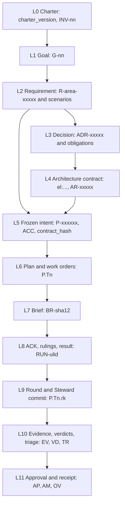

# Goal-consistency guarantees

This document owns the mechanisms that keep every seat's work consistent with the Board's goals: the
alignment chain, the brief compiler, the ACK and the submit channels, submit-time recompilation, the
approval envelope, amendments, precedence and rulings, and which of these mechanisms hold at every rung.
Who holds which role is in [01-org-model.md](01-org-model.md); the gates that enforce these mechanisms are
catalogued in [11-verification.md](11-verification.md).

## Alignment chain L0–L11

Intent flows down twelve levels. Each level has one artifact, one owner, an id format and a named
enforcement point; each lower level cites the level above, so any act can be walked back to the charter.



| Level | Artifact | Ids | Owner | Enforced by |
| --- | --- | --- | --- | --- |
| L0 Charter | `.keel/charter.md` | `charter_version` (semver); invariants `INV-nn` | Board (signed with `--doc`, committed by a governance commit) | Effective only once signed. Every artifact stamps `charter_version`; the frame gate flags a MAJOR or MINOR lag. INV checks run in the verify gate, cheap ones also at submit. In-scope INV are delivered in the brief and join the ACK id set of the product, architect and engineer seats |
| L1 Goal | `.keel/goals.yaml` | `G-nn` (Board-serialized) | Board (signed) | Every proposal cites at least one active goal (frame gate). The brief's why-chain starts at the goal. Budgets roll up per goal. Goal progress = requirements verified at head / total |
| L2 Requirement | `.keel/specs/<area>/spec.yaml` (living spec) | `R-<area>-<5>`; scenarios `R-…#S<n>`; `rev_hash` | product drafts deltas; only the land archive commit writes | Deltas target ids and carry a base `rev_hash`; the archive refuses on a base mismatch and shows the three texts. Requirement text is quoted verbatim into briefs. The RTM check verifies coverage and realization |
| L3 Decision and obligations | `.keel/decisions/ADR-<5>-<slug>.md` (in flight under the proposal's `decisions/`, promoted at land) | `ADR-<5>`; obligations `ADR-<5>.O<n>` with level must, must_not or should | architect or product propose; accepted by contract approval (system) or `--doc` | Obligations are parsed deterministically, never extracted by an LLM. They are delivered when `applies_to` intersects write_set, and must/must_not ids join the ACK set. Checks run in the verify gate (cheap ones at submit). Anchor or body drift voids acceptance |
| L4 Architecture contract | `.keel/arch/model.yaml`, `rules.yaml`, `baseline.json` | `el:<dotted.slug>`; `AR-<5>` | architect, through `arch.delta` applied at land | New violations backed by trusted-provenance edges fail; "unknown" blocks per the unknown policy; baseline growth or rule loosening needs contract approval; the element brief is compiled into briefs ([07](07-architecture-intelligence.md)) |
| L5 Frozen intent | `.keel/proposals/<P>-<slug>/intent.md` + `spec.delta.yaml` (+ `arch.delta.yaml`) on `keel/<P>/main` | `P-<6>`; `<P>#ACC-nn`; `contract_hash` | product (arch delta: architect) | The contract signature binds `contract_hash`, the `keel/<P>/main` commit and the chain head. Any byte change invalidates it and blocks dispatch and land. Acceptance changes only through an amendment |
| L6 Plan and work order | `plan.yaml`, `workorders/T<n>.yaml`, `routing.snapshot.yaml` | `<P>.T<n>` | planner (routing snapshot: Steward) | The plan gate checks two-way coverage, interfaces, disjoint write sets per wave, frozen tests outside write_set and budgets; on feature and system a cross-family verification-gap lens checks the ACC → command table and the test tasks. Plan approval signs the plan, work orders and routing snapshot when required |
| L7 Brief | `.git/keel/briefs/BR-<sha12>.{md,json}`, copied into the run's inputs | `BR-<sha12>` of the normalized body | Steward (compiler) | See the next section |
| L8 ACK, rulings, result | Submit-channel drops ingested as ledger events `ack.recorded`, `ruling.made`, `question.asked`, `result.submitted` | `RUN-<ulid>`; `RL-<sha12>`; `Q-<sha12>` | The dispatched seat; validated by the Steward | See "ACK and submit channels" and "Precedence order, decision boundaries and rulings" |
| L9 Round and commit | Steward-made commits on `keel/<P>/t/<n>` | `<P>.T<n>.r<k>`; commit id; jj change id when enabled | Steward | Trailers on every round commit; seat-made commits preserved under `refs/keel/snap`; the trace check covers the proposal's range ([04](04-trace-and-state.md)) |
| L10 Evidence and verdicts | `.git/keel/records/EV-*.json` (a cache), `VD-*.json`, `TR-*.json`, projected at land | `EV-`, `VD-`, `TR-<sha12>`; source-state binding | Steward runner (EV); reviewer seats, validated by the Steward (VD); planner (TR) | Only runner evidence counts; land re-executes the full acceptance matrix on the integrated commit; stale verdicts are ignored ([11](11-verification.md)) |
| L11 Approval and receipt | `.keel/signatures/<blob-sha256>.<kind>.json`; `receipt.json` and `receipt.md` in `.keel/archive/<yyyy>/<P>-<slug>/` | `AP-`, `AM-`, `OV-<sha12>`; one receipt per proposal | Board (AP, OV); Steward (receipt) | Land needs a valid land signature over the receipt draft and the chain head, or a signed land policy plus a later receipt acknowledgement ([03](03-lifecycle.md)) |

The charter (L0) holds the mission (at most 200 characters), the invariants as must/must_not obligations
with `applies_to` globs and optional check commands, the company decision boundaries, the precedence order,
the reserved-action ids, pitfalls each citing an incident id, and the root signer fingerprint, within a
6 KiB budget. The frozen block (L5) sits between `keel:frozen` markers and holds: problem; outcome and
signal; non-goals; decision boundaries (may decide, must ask); ACC items {id, statement, covers R or
scenarios, evidence mode test, command, review, manual or unobservable}; Always/Never; scope {allowed,
protected globs}; open questions, which must be empty; and a failure model on the system track.

`contract_hash` is the sha256 of the normalized frozen block, the `spec.delta.yaml` blob, the
`arch.delta.yaml` blob and the `rev_hash` of every covered requirement. It is frozen at contract approval
and never recomputed after the archive commit.

The receipt (L11) covers the integrated commit and the expected trunk tip, the task → round → commit map,
evidence and verdicts, the ACC → command table, rulings by cost, gates not run, overrides, remaining risks,
the arch delta applied, the RTM summary, the declared engineer families (build and test routes) and the
reviewer family, conformance status and
the exposure profile. The landed commit id goes in the `land.completed` ledger event, not in the signed
receipt.

Borrowed from: GitHub Spec Kit (semver'd constitution stamped on artifacts), OpenSpec (delta specs by id
with base fingerprints), Kiro (EARS requirements, public docs), BMAD-METHOD (frozen-after-approval intent),
edikt (deterministic obligation parsing; idea only), oh-my-claudecode (receipts with a remaining-risk
register).

## Brief compiler and normalized hashing

`keel brief <P|P.Tn> --seat <seat> [--format md|json]` prints the compiled brief for a seat and subject,
with its hash and its ACK id set. The subject is the proposal `P` for product, architect and planner, the
task `P.Tn` for an engineer, and the review packet for a reviewer. `AGENTS.md` only points here; its size
budget is in [09-runtimes.md](09-runtimes.md).

**Compilation.** The compiler builds a deterministic intermediate representation from the canonical
documents and the proposal branch at the approved commit, selects slices, and renders them through the
single template `templates/prompts/brief.md.tmpl`. The body contains, in order:

1. the why-chain: charter → goal → requirement → frozen intent (verbatim) → work order;
2. in-scope INV and ADR obligations (those whose `applies_to` intersects the write_set);
3. the element brief and the impact;
4. the write_set and the forbidden paths;
5. the gates the work will face;
6. the precedence order;
7. the decision boundaries and stop classes;
8. how to ACK, ask, rule and submit on this runtime's submit channel;
9. the output contract.

The header holds a freshness stamp (`computed_at`, `head_commit`, `index_commit`, `charter_version`) and one
input hash per section. The header is not part of the hashed body.

**Hashing.** The body is normalized to LF line endings, stripped of any BOM and put in Unicode NFC before
hashing; `BR-<sha12>` is taken from those bytes. The runtime wrapper (flags, a short fixed prompt, an agent
file frame) sits outside the hashed body. A golden hash must be identical on a Windows CRLF checkout and on
Linux (M1a exit criterion).

**Budget.** Each runtime profile has a byte budget. ACC items and must and must_not obligations are never
truncated; a brief over budget means the task must be split, and the plan gate checks that every brief
compiles within budget.

**Delivery.** The same bytes go through every channel. The descriptor chooses the channel per runtime
([09-runtimes.md](09-runtimes.md)):

- stdin, with a short fixed `-p` string where the runtime appends stdin to the prompt (verify by probe per
  runtime);
- a system-prompt or agent file: Claude Code `--append-system-prompt-file`, Kimi Code `--agent-file`,
  opencode `-f`;
- the MCP tool `keel_context`, with the subject required;
- re-injection after context compaction: Claude Code `SessionStart` with matcher `compact`, Gemini CLI
  `BeforeAgent` additional context, Qwen Code `PostCompact` (each verify by probe);
- a pull with `keel brief`;
- a human paste of `keel brief --format md` at rung D.

**Isolation.** Task and verify worktrees use the sparse checkout `'/*' '!/.keel/proposals/'`, so proposal
files are absent from seat worktrees; seats see only the compiled brief or review packet
([05-vcs.md](05-vcs.md)).

**Prompt provenance.** The seat contract, skill, runtime overlay, tier overlay, descriptor and keel version
are composed deterministically and hashed as `PG-<sha12>`. The PG id goes in the run record and in the
`Keel-Prompt` trailer, so what each vendor was told is reproducible.

Borrowed from: OpenSpec (runtime-compiled instructions envelope), Gas Town (priming command), BMAD-METHOD
(session-sized specs of 900 to 1600 tokens; content-addressed render snapshots), oh-my-claudecode (prompt
digests), arch-viewer (element briefs), dcsg/keel (post-compaction re-injection; idea only).

## ACK and submit channels (per runtime and mode)

**The ACK.** A seat's first act is an ACK with: the brief hash, the objective, the per-seat id set, the
non-goals, the write_set, planned steps, assumptions and questions. The per-seat id sets are part of the seat
contracts ([01-org-model.md](01-org-model.md)): product and architect goal, R and INV ids; planner ACC and R
ids; engineer ACC, R, in-scope INV and in-scope must and must_not obligation ids; reviewer the packet's
ids.

**Validation.** The Steward validates at ingest and never trusts seat-side checks:

- the ACK's id set must equal the brief's id set;
- its write_set must be a subset of the work order's write_set;
- its brief hash must equal the compiled hash.

The first mismatch returns success-shaped guidance that names what differs, and the seat retries. A second
mismatch sets `blocked(ack_mismatch)` and routes an ask to the clause owner. If the snapshot the Steward
takes synchronously when it ingests the ACK differs from the pre-spawn base, the seat edited before a
matching ACK and the run is void. The snapshot triggers are Steward-side events, specified in
[05-vcs.md](05-vcs.md); the residual limits per rung are in section 6 of [09-runtimes.md](09-runtimes.md).

**Submit channels.** Seats write only through their submit channel; `keel api` writes only to the run
outbox, and the Steward validates every drop.

| Channel | How it works |
| --- | --- |
| `final-message` | The runtime's native structured final message, validated against the seat's output schema (Claude Code and Qwen Code `--json-schema`; Codex `--output-schema` with `-o`) |
| `mcp` | The outbox-only MCP write tool `keel_submit` (verify by probe, per runtime, that MCP servers run outside the tool sandbox) |
| `outbox` | `keel api ack\|ask\|rule\|submit` writes an O_EXCL JSON drop into `<workspace_root>/_runs/<RUN>/outbox/`; usable only in modes that can write the run directory |

Seats in read-only modes cannot write the outbox, so they ACK through the structured final message of a
short pre-run, or through MCP. The table lists the rung and channels each runtime and mode reaches; the
rungs themselves are defined in [09-runtimes.md](09-runtimes.md).

| Runtime | Mode | Rung | ACK via | Result via |
| --- | --- | --- | --- | --- |
| claude-code | `--permission-mode plan` (read-only seats) | A | final message of a pre-run (`--json-schema`, inline minified schema), or `mcp` | `final-message` |
| claude-code | `--permission-mode acceptEdits` (engineer) | A | `outbox` (run directory added with `--add-dir`) or `mcp` | `outbox` |
| codex | `-s read-only` | C until the hook probe passes, then A | final message of a pre-run (`--output-schema <path> -o`) | `final-message` |
| codex | `-s workspace-write` | C until the hook probe passes, then A | `outbox` (run directory via `--add-dir`) | `final-message` |
| gemini-cli | `--approval-mode plan` | B once the `--policy` probe passes; reviewer seats only until then | `final-message` or `mcp` | `final-message` or `mcp` |
| gemini-cli | `--approval-mode auto_edit` | B once the `--policy` probe passes | `outbox` | `outbox` |
| qwen-code | `--approval-mode plan` | C until the hook probe passes, then A | final message of a pre-run (`--json-schema @<path>`) | `final-message` |
| qwen-code | `--approval-mode auto-edit` | C until the hook probe passes, then A | `outbox` | `final-message` |
| kimi-code | `-p` (runs under the `auto` permission policy; bypass-equivalent) | D until an allowlisted agent file, deny rules or the ACP driver are verified by probe | the human runs `keel api ack` | the human runs `keel api submit` |
| opencode | per-agent permission blocks | C | `outbox` or `mcp` | `outbox` or `mcp` |
| direct (M6) | tool-less, read-only lenses only | not applicable (no tools, no hooks) | structured response of a pre-run call | structured response (`json_schema` response format, or `output_config.format` where probed) |
| any runtime, manual | web chat | D | the human runs `keel api ack` | the human runs `keel api submit` |

Each mode's `submit_channel` in the runtime descriptor records the one result channel keel uses; where a row
lists two, the descriptor picks one (opencode: `mcp` for read-only agents, `outbox` for the build agent;
gemini-cli plan mode: `final-message`). Every runtime flag in this table is recorded in the runtime's
descriptor with its `verification_status`; flags not yet probed on the installed version are verify by
probe.

Borrowed from: oh-my-codex (ACK readback), oh-my-claudecode (verdict-file contract for non-Claude
reviewers), OpenSpec (one-JSON agent contract).

## Submit-time recompilation

At submit, and again at each gate, the Steward recompiles the brief from the current canonical inputs and
compares section input hashes with the brief the seat ACKed. The seat's result echoes the brief hash
(`BR` echo) and restates the goal (`goal_echo`).

- **stale_contract**: an ACC, a must or must_not obligation or a covered requirement changed. The seat must
  re-ACK the new brief, and any review of the old round is redone.
- **context-only change**: another section changed (for example the element brief or impact). The result
  is annotated; no re-ACK is needed.

Plans, work orders, briefs, verdicts and evidence carry `derived_from` hashes of their inputs. When an
upstream input changes, every dependent is marked stale, and stale work cannot land. The freshness check of
the submit gate applies this rule ([11-verification.md](11-verification.md)).

Borrowed from: GitHub Spec Kit (constitution version on artifacts).

## Signed approvals (chain head, agent-key refusal)

Every Board act is an ssh signature over an envelope. The stages and rulings the Board signs are listed in
[01-org-model.md](01-org-model.md); this section defines the envelope and its verification. Signing key
hygiene is detailed in [14-trust-security.md](14-trust-security.md), and the decision is recorded in
[ADR-0005](adr/ADR-0005-signed-board-approvals.md).

**Envelope.** `keel approve` builds:

```json
{
  "v": 1,
  "payload": {
    "kind": "stage",
    "stage": "contract",
    "rule": null,
    "subject": "P-7F3K9Q",
    "commit": "<40-hex commit of keel/P-7F3K9Q/main>",
    "artifacts": [{ "path": ".keel/proposals/P-7F3K9Q-note-tags/intent.md", "sha256": "<64 hex>" }],
    "contract_hash": "<64 hex>",
    "request": null,
    "land": null,
    "quote": "Approved as framed; tags stay local to a note.",
    "approver": {
      "principal": "<signer principal from allowed_signers>",
      "fingerprint": "SHA256:<43 base64 characters>",
      "key_type": "sk-ssh-ed25519@openssh.com"
    },
    "ledger_chain_head": "<64 hex>",
    "ts": "2026-09-25T10:00:00Z",
    "nonce": "<random>"
  },
  "signature": { "namespace": "keel-approval", "format": "sshsig", "armored": "<SSH SIGNATURE block>" }
}
```

The signature covers the canonical JSON of `payload`. A document, policy, request or ruling sets `kind`
(`doc`, `policy`, `request`, `rule`; `tofu` records the first signer) with `stage: null`, and a ruling also
sets `rule`. The authoritative shape is `schemas/approval.schema.json`; the example envelope is
`examples/acme-notes/.keel/signatures/example.contract.json`.

**Signing.** `keel approve` prints exactly what to read, asks for interactive confirmation (a TTY, or a
typed confirmation code under Git Bash mintty), and refuses under `KEEL_RUN` or `KEEL_RUN_ID`. It signs with
`ssh-keygen -Y sign -n keel-approval`, which asks for the key's passphrase or a hardware touch; the key is
the one `KEEL_BOARD_KEY` names ([14-trust-security.md](14-trust-security.md)). The Steward commits the
detached envelope at `.keel/signatures/<blob-sha256>.<kind>.json` as soon as it is signed, so dispatch and
land verify it from git: document, policy and receipt envelopes through a governance commit on trunk;
contract, plan and request envelopes and rulings on a proposal through a governance-style commit on
`keel/<P>/main`, which reaches trunk with the archive commit; the land envelope in the archive commit
itself. Envelopes authenticate themselves; the ledger references them, so they verify on every clone.

**Chain anchoring.** Each envelope includes the ledger chain head. An edit to any ledger event before a
signed head is therefore detectable, and a signature cannot be replayed onto a different history
([04-trace-and-state.md](04-trace-and-state.md)).

**Verification.** The Steward verifies with `ssh-keygen -Y verify -n keel-approval` against the
`allowed_signers` blob at the last Board-signed trunk revision, never against a working-tree copy. The root
signer's fingerprint is pinned in the signed charter; `keel init` records trust on first use. An approval
is invalid when any bound artifact's current hash differs from the signed one, when the signer is not in the
verified `allowed_signers`, or when an amendment has superseded it.

**Agent-key refusal (fail closed).** `keel approve`, `keel run` (dispatch) and `keel land` exit 6 while any
allowed signer's public key appears in `ssh-add -L`, reached through `SSH_AUTH_SOCK` or the Windows named pipe
`\\.\pipe\openssh-ssh-agent`, unless the key is a FIDO2 `-sk` key. `-sk` keys are recommended on Windows;
`-sk` support in the Windows OpenSSH and Git for Windows builds of `ssh-keygen` is verify by probe, and
`keel doctor --section signing` names the verified `ssh-keygen` path. Negative control: a passphrase key
loaded into the agent must make `approve` and `land` refuse.

### Requests and seat-proof verbs

`keel new --policy <name>` makes the Board sign the verbatim request as a request envelope, one touch.
Policy-path dispatch and land verify that signature on the `proposal.created` event. Each proposal records
its origin, board-signed request or contract-approved, and the receipt shows it.

As a first line of defence, every mutating verb (`new`, `run`, `land`, `sync`, `audit`, `approve`) refuses
under `KEEL_RUN` or `KEEL_RUN_ID`, and also when an ancestor process is a registered keel run (the ancestry
walk on Windows is verify by probe). Only `keel run` claims work. The exit codes are in
[12-cli-api-mcp.md](12-cli-api-mcp.md).

Borrowed from: old-coder (quotable consent), superpowers (approval binds only the presented artifact),
OpenSSH (`ssh-keygen -Y`, FIDO2 `-sk`).

## Amendment ledger

After contract approval the frozen block and the ACC items change only through an amendment. When the
Steward sees such a change on `keel/<P>/main`, it derives an `AM-<sha12>` record from git:

- the original text, verbatim, taken from the signed blob;
- the replacement text;
- the changed ids;
- the reason;
- the authority (the ask, ruling or Board request that caused it).

The amendment invalidates the contract approval and, if present, the plan approval; the Board re-signs.
Completion claims (results, evidence, receipts) cite the ACC revision they satisfied, so a weakened
criterion can never be satisfied silently. An `intent_gap` from the intent-alignment lens returns the
proposal to framing and ends in the same re-signing ([03-lifecycle.md](03-lifecycle.md)).

Borrowed from: oh-my-claudecode (criterion amend and supersede ledger).

## Precedence order, decision boundaries and rulings

**Precedence order.** When two sources disagree, the higher one wins:

1. Board ruling;
2. INV (charter invariant);
3. accepted ADR obligation;
4. frozen intent (ACC, non-goals, scope);
5. requirement;
6. plan;
7. task notes;
8. model preference.

The charter holds this order, and every brief ends with it.

**Decision boundaries.** The charter holds company-wide boundaries, and the frozen intent holds per-change
may-decide and must-ask lists. Every brief includes both, together with the four stop classes
([01-org-model.md](01-org-model.md)).

**Seat rulings.** Inside its boundaries a seat decides and records the decision with
`keel api rule {clause, what, why, cost_if_wrong, reversible}`, which becomes an `RL-<sha12>` record and a
`ruling.made` event. Outside its boundaries it asks. The Steward flags to the Board, automatically, any
ruling outside the boundaries and any ruling that touches a stop class. The audit lens compares the actual
diff with the recorded rulings and cites every unrecorded decision it finds. Receipts list rulings by cost
if wrong, so the Board reads the expensive ones first.

This works at the prompt level on strong models and only partly on weak ones; the backstop on every runtime
is the scope check, the track ratchet and the audit lens.

Borrowed from: superpowers (rulings, not stalls; cost-if-wrong; stop classes), OpenSpec ("decided
autonomously" records), oh-my-codex (decision boundaries as typed fields).

## Test independence and red/green proof

Consistency with the goal is only as strong as the tests that certify it, so keel forbids the loop in which
one agent defines "done", builds it and proves it. On feature and system tracks the ACC → command table is
fixed before the build and the frozen tests are outside the builder's write_set; missing tests become a
test task on a different declared family; builder-added tests count only after a cross-family
verification-gap lens passes them. Policy lands need a red-before/green-after proof. The rules, and the
checks that enforce them, are owned by [11-verification.md](11-verification.md).

## What each rung can prevent and what it can only detect

The alignment mechanisms split into two groups.

**Steward-side: identical at every rung.** These run in keel's own process, before dispatch or after the
seat has finished, so no runtime can weaken them:

- the compiled, hashed brief and its recompilation at submit;
- the ACK id-set diff;
- detecting edits before a matching ACK: the snapshot taken synchronously at ACK ingest is compared with
  the pre-spawn base ([05-vcs.md](05-vcs.md)). The check is the same at every rung, but what it can see is
  not: an edit made and reverted before the ACK is invisible, and prevention exists only where hooks load
  (section 6 of [09-runtimes.md](09-runtimes.md));
- signature verification of every approval, request and ruling;
- the scope check, the frozen and protected path checks and the track ratchet;
- ref-snapshot and `ls-remote` detection of reserved operations;
- re-executed evidence at land and the trace check;
- the exposure refusal at dispatch.

**Runtime-side: varies by rung.** Keeping the seat from misbehaving in the first place depends on what the
runtime offers: native schema validation of the final message, blocking hooks, per-run permission and
deny-read rules, and re-injection of the brief after context compaction. At rung A most of these exist; at
rung C only per-agent permission rules and brief pulls remain; at rung D a human carries the brief and the
submit, and prevention is whatever the human does. Hooks fail open and are journaled, so prevention is
always best effort ([KP-10](00-vision.md#kp-10-hooks-warn-gates-decide)).

The consequence for alignment is that no guarantee in this document depends on prevention: a weaker
runtime makes misalignment more likely to be attempted, not more likely to land. The rungs, the per-rung
prevent-versus-detect table and the per-runtime prevention details are owned by
[09-runtimes.md](09-runtimes.md); prevention of git operations is in [05-vcs.md](05-vcs.md); what doctor
reports as the exposure profile is in [14-trust-security.md](14-trust-security.md).

Borrowed from: oh-my-codex (per-event capability matrix with a fallback ladder), old-coder (honest "layers
not run").
