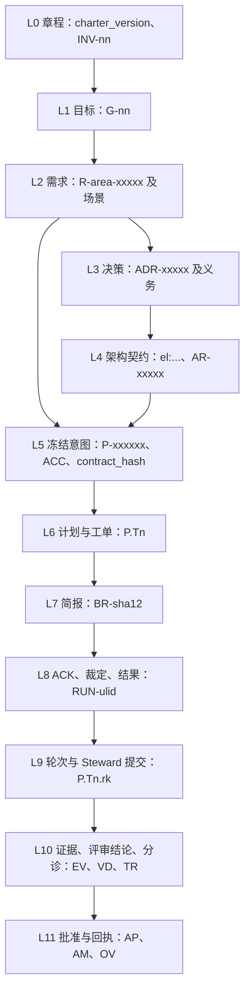

# 目标一致性保证

> 英文原文（规范版本）：[02-alignment.md](02-alignment.md)。本文是其简体中文镜像，两者不一致时以英文版为准。

本文档负责让每个席位（seat）的工作与董事会（Board）目标保持一致的机制：对齐链、简报（brief）编译器、ACK（复述确认）与提交通道、提交时重新编译、批准信封、修订案（amendment）、优先顺序与裁定，以及这些机制中哪些在每个梯级（rung）上都成立。谁担任哪个角色见 [01-org-model.zh-CN.md](01-org-model.zh-CN.md)；强制执行这些机制的门禁（gate）在 [11-verification.zh-CN.md](11-verification.zh-CN.md) 中编目。

## 对齐链 L0–L11

意图沿十二个层级向下流动。每个层级有一个产物、一个负责人、一种编号格式和一个具名的强制点；每个较低层级都引用其上一层级，因此任何行为都可以一路回溯到章程（charter）。



| 层级 | 产物 | 编号 | 负责人 | 强制方式 |
| --- | --- | --- | --- | --- |
| L0 章程 | `.keel/charter.md` | `charter_version`（semver）；不变量 `INV-nn` | 董事会（用 `--doc` 签名，由治理提交提交） | 只有签名后才生效。每个产物都标记 `charter_version`；框定门禁会标记 MAJOR 或 MINOR 版本的滞后。INV 检查在验证门禁中运行，低成本的检查也在提交时运行。范围内的 INV 随简报下发，并加入产品、架构和工程席位的 ACK 编号集 |
| L1 目标 | `.keel/goals.yaml` | `G-nn`（由董事会顺序编号） | 董事会（签名） | 每个提案至少引用一个 active 状态的目标（框定门禁）。简报的缘由链从目标开始。预算按目标汇总。目标进度 = 在 head 处已验证的需求数 / 需求总数 |
| L2 需求 | `.keel/specs/<area>/spec.yaml`（活规格） | `R-<area>-<5>`；场景 `R-…#S<n>`；`rev_hash` | product 起草增量；只有落地归档提交会写入 | 增量以编号为目标并携带基准 `rev_hash`；基准不匹配时归档会拒绝，并显示三方文本。需求文本被逐字引用进简报。RTM 检查验证覆盖和实现情况 |
| L3 决策与义务 | `.keel/decisions/ADR-<5>-<slug>.md`（进行中时位于提案的 `decisions/` 下，落地时晋升） | `ADR-<5>`；义务 `ADR-<5>.O<n>`，级别为 must、must_not 或 should | architect 或 product 提出；通过契约批准（system）或 `--doc` 接受 | 义务以确定性方式解析，绝不由 LLM 抽取。当 `applies_to` 与 write_set 相交时下发，must/must_not 编号加入 ACK 编号集。检查在验证门禁中运行（低成本的在提交时运行）。锚点或正文漂移会使接受失效 |
| L4 架构契约 | `.keel/arch/model.yaml`、`rules.yaml`、`baseline.json` | `el:<dotted.slug>`；`AR-<5>` | architect，通过在落地时应用的 `arch.delta` | 由可信来源边支撑的新违规会失败；“unknown”按未知策略阻塞；基线增长或规则放宽需要契约批准；架构元素简报被编译进简报（[07](07-architecture-intelligence.zh-CN.md)） |
| L5 冻结意图 | `keel/<P>/main` 上的 `.keel/proposals/<P>-<slug>/intent.md` + `spec.delta.yaml`（+ `arch.delta.yaml`） | `P-<6>`；`<P>#ACC-nn`；`contract_hash` | product（架构增量：architect） | 契约签名绑定 `contract_hash`、`keel/<P>/main` 提交和链头。任何字节变化都会使其失效，并阻塞派发和落地。验收只能通过修订案更改 |
| L6 计划与工单 | `plan.yaml`、`workorders/T<n>.yaml`、`routing.snapshot.yaml` | `<P>.T<n>` | planner（路由快照：Steward） | 计划门禁检查双向覆盖、接口、每个波次内互不相交的写集、位于 write_set 之外的冻结测试以及预算；在 feature 和 system 上，一个跨家族的验证缺口评审镜头检查 ACC → 命令表和测试任务。需要时，计划批准会签署计划、工单和路由快照 |
| L7 简报 | `.git/keel/briefs/BR-<sha12>.{md,json}`，复制到运行的输入中 | 规范化正文的 `BR-<sha12>` | Steward（compiler） | 见下一节 |
| L8 ACK、裁定、结果 | 以账本事件 `ack.recorded`、`ruling.made`、`question.asked`、`result.submitted` 接收的提交通道投递文件 | `RUN-<ulid>`；`RL-<sha12>`；`Q-<sha12>` | 被派发的席位；由 Steward 验证 | 见“ACK 与提交通道”和“优先顺序、决策边界与裁定” |
| L9 轮次与提交 | `keel/<P>/t/<n>` 上由 Steward 完成的提交 | `<P>.T<n>.r<k>`；提交 id；启用时的 jj change id | Steward | 每个轮次提交都带提交尾注（trailer）；席位自行做出的提交被保存在 `refs/keel/snap` 下；追溯检查覆盖提案的范围（[04](04-trace-and-state.zh-CN.md)） |
| L10 证据与评审结论 | `.git/keel/records/EV-*.json`（缓存）、`VD-*.json`、`TR-*.json`，在落地时投影 | `EV-`、`VD-`、`TR-<sha12>`；源状态绑定 | Steward 运行器（EV）；评审席位，由 Steward 验证（VD）；planner（TR） | 只有运行器的证据才算数；落地时在集成后的提交上重新执行完整的验收矩阵；过期的评审结论被忽略（[11](11-verification.zh-CN.md)） |
| L11 批准与回执 | `.keel/signatures/<blob-sha256>.<kind>.json`；`.keel/archive/<yyyy>/<P>-<slug>/` 中的 `receipt.json` 和 `receipt.md` | `AP-`、`AM-`、`OV-<sha12>`；每个提案一份回执 | 董事会（AP、OV）；Steward（回执） | 落地需要一个覆盖回执草稿和链头的有效落地签名，或者一份签名的落地策略加上随后的回执确认（[03](03-lifecycle.zh-CN.md)） |

章程（L0）包含：使命（至多 200 个字符）、作为 must/must_not 义务并带 `applies_to` glob 和可选检查命令的不变量、公司级决策边界、优先顺序、保留操作编号、各自引用一个事故编号的陷阱，以及根签名者指纹，总体积控制在 6 KiB 预算以内。冻结块（L5）位于 `keel:frozen` 标记之间，包含：问题；结果和信号；非目标；决策边界（可自行决定、必须提问）；ACC 项 {id、陈述、覆盖的 R 或场景、证据模式 test、command、review、manual 或 unobservable}；Always/Never；范围 {允许的 glob、受保护的 glob}；必须为空的未决问题；以及 system 轨道上的失败模型。

`contract_hash` 是规范化冻结块、`spec.delta.yaml` blob、`arch.delta.yaml` blob 以及每个被覆盖需求的 `rev_hash` 的 sha256。它在契约批准时冻结，在归档提交之后永不重新计算。

回执（L11）涵盖集成后的提交和预期的主干顶端、任务 → 轮次 → 提交映射、证据和评审结论、ACC → 命令表、按代价排序的裁定、未运行的门禁、豁免、剩余风险、已应用的架构增量、RTM 摘要、声明的工程席位家族（构建路由和测试路由）与评审席位家族、一致性测评状态以及暴露面画像。已落地的提交 id 放在 `land.completed` 账本事件中，而不放在签名的回执里。

借鉴自：GitHub Spec Kit（带 semver 版本并标记在产物上的 constitution）、OpenSpec（按编号并带基准指纹的增量规格）、Kiro（EARS 需求，公开文档）、BMAD-METHOD（批准后冻结的意图）、edikt（确定性的义务解析；仅借鉴思想）、oh-my-claudecode（带剩余风险登记表的回执）。

## 简报编译器与规范化哈希

`keel brief <P|P.Tn> --seat <seat> [--format md|json]` 打印针对某个席位和主题编译出的简报，以及其哈希和 ACK 编号集。对于产品、架构和规划席位，主题是提案 `P`；对于工程席位，主题是任务 `P.Tn`；对于评审席位，主题是评审包。`AGENTS.md` 只指向这里；其大小预算见 [09-runtimes.zh-CN.md](09-runtimes.zh-CN.md)。

**编译。** 编译器根据规范文档以及已批准提交处的提案分支，构建一个确定性的中间表示，选取切片，并通过唯一的模板 `templates/prompts/brief.md.tmpl` 渲染它们。正文依次包含：

1. 缘由链：章程 → 目标 → 需求 → 冻结意图（逐字）→ 工单；
2. 范围内的 INV 和 ADR 义务（`applies_to` 与 write_set 相交的那些）；
3. 架构元素简报和影响面；
4. write_set 和禁止的路径；
5. 该工作将面对的门禁；
6. 优先顺序；
7. 决策边界和停止类别；
8. 如何在该运行时的提交通道上进行 ACK、提问、裁定和提交；
9. 输出契约。

头部包含一个新鲜度戳（`computed_at`、`head_commit`、`index_commit`、`charter_version`），以及每个章节各一个输入哈希。头部不属于被哈希的正文。

**哈希。** 正文在哈希之前被规范化为 LF 换行、去掉任何 BOM，并转换为 Unicode NFC；`BR-<sha12>` 取自这些字节。运行时包装（标志、一段简短固定的提示词、智能体文件框架）位于被哈希的正文之外。一个黄金哈希在 Windows CRLF 检出和 Linux 上必须完全相同（M1a 退出标准）。

**预算。** 每个运行时配置都有一个字节预算。ACC 项和 must 与 must_not 义务从不截断；超出预算的简报意味着任务必须拆分，计划门禁会检查每份简报都能在预算内编译完成。

**下发。** 同样的字节通过每一个通道下发。描述符按运行时选择通道（[09-runtimes.zh-CN.md](09-runtimes.zh-CN.md)）：

- stdin，在运行时会把 stdin 追加到提示词之后的情况下，配合一个简短固定的 `-p` 字符串（按运行时待探测验证，verify by probe）；
- 系统提示词或智能体文件：Claude Code `--append-system-prompt-file`、Kimi Code `--agent-file`、opencode `-f`；
- MCP 工具 `keel_context`，必须提供主题；
- 上下文压缩之后的重新注入：Claude Code 带 matcher `compact` 的 `SessionStart`、Gemini CLI `BeforeAgent` 附加上下文、Qwen Code `PostCompact`（各自待探测验证）；
- 用 `keel brief` 主动拉取；
- 在梯级 D 上由人类粘贴 `keel brief --format md` 的输出。

**隔离。** 任务和验证工作树使用稀疏检出（sparse checkout）`'/*' '!/.keel/proposals/'`，因此席位工作树中没有提案文件；席位只能看到编译后的简报或评审包（[05-vcs.zh-CN.md](05-vcs.zh-CN.md)）。

**提示词来源。** 席位契约、技能、运行时叠加层、档位叠加层、描述符和 keel 版本以确定性方式组合，并哈希为 `PG-<sha12>`。PG 编号写入运行记录和 `Keel-Prompt` 提交尾注，因此每个厂商被告知了什么是可复现的。

借鉴自：OpenSpec（运行时编译的指令信封）、Gas Town（预热命令）、BMAD-METHOD（900 到 1600 个 token 的会话大小规格；内容寻址的渲染快照）、oh-my-claudecode（提示词摘要）、arch-viewer（架构元素简报）、dcsg/keel（压缩后的重新注入；仅借鉴思想）。

## ACK 与提交通道（按运行时和模式）

**ACK。** 席位的第一个动作是一次 ACK，包含：简报哈希、目的、按席位的编号集、非目标、write_set、计划步骤、假设和问题。按席位的编号集是席位契约的一部分（[01-org-model.zh-CN.md](01-org-model.zh-CN.md)）：产品席位和架构席位为目标、R 和 INV 编号；规划席位为 ACC 和 R 编号；工程席位为 ACC、R、范围内的 INV 以及范围内的 must 与 must_not 义务编号；评审席位为评审包中的编号。

**验证。** Steward 在接收时进行验证，从不信任席位一侧的检查：

- ACK 的编号集必须等于简报的编号集；
- 其 write_set 必须是工单 write_set 的子集；
- 其简报哈希必须等于编译出的哈希。

第一次不匹配会返回成功形态的指引（success-shaped guidance），指出哪里不同，席位随后重试。第二次不匹配会设置 `blocked(ack_mismatch)`，并把一个提问路由给条款负责人。如果 Steward 在摄取 ACK 时同步拍摄的快照与派生前的基线不同，就说明席位在匹配的 ACK 之前做了编辑，该运行作废。快照的触发点都是 Steward 侧的事件，规定见 [05-vcs.zh-CN.md](05-vcs.zh-CN.md)；各梯级的残余局限见 [09-runtimes.zh-CN.md](09-runtimes.zh-CN.md) 第 6 节。

**提交通道。** 席位只通过其提交通道写入；`keel api` 只写入运行的发件箱，Steward 验证每一个投递文件。

| 通道 | 工作方式 |
| --- | --- |
| `final-message` | 运行时原生的结构化最终消息，按席位的输出 schema 验证（Claude Code 和 Qwen Code `--json-schema`；Codex `--output-schema` 配合 `-o`） |
| `mcp` | 只写发件箱的 MCP 写工具 `keel_submit`（按运行时待探测验证 MCP 服务器是否运行在工具沙箱之外） |
| `outbox` | `keel api ack\|ask\|rule\|submit` 把一个 O_EXCL 的 JSON 投递文件写入 `<workspace_root>/_runs/<RUN>/outbox/`；只能在可以写入运行目录的模式下使用 |

处于只读模式的席位无法写发件箱，因此它们通过一次简短预运行（pre-run）的结构化最终消息，或通过 MCP 来做 ACK。下表列出每种运行时和模式所能达到的梯级和通道；梯级本身的定义见 [09-runtimes.zh-CN.md](09-runtimes.zh-CN.md)。

| 运行时 | 模式 | 梯级 | ACK 途径 | 结果途径 |
| --- | --- | --- | --- | --- |
| claude-code | `--permission-mode plan`（只读席位） | A | 预运行的最终消息（`--json-schema`，内联压缩后的 schema），或 `mcp` | `final-message` |
| claude-code | `--permission-mode acceptEdits`（engineer） | A | `outbox`（用 `--add-dir` 添加运行目录）或 `mcp` | `outbox` |
| codex | `-s read-only` | 钩子探测通过之前为 C，之后为 A | 预运行的最终消息（`--output-schema <path> -o`） | `final-message` |
| codex | `-s workspace-write` | 钩子探测通过之前为 C，之后为 A | `outbox`（通过 `--add-dir` 添加运行目录） | `final-message` |
| gemini-cli | `--approval-mode plan` | `--policy` 探测通过后为 B；在此之前仅限评审席位 | `final-message` 或 `mcp` | `final-message` 或 `mcp` |
| gemini-cli | `--approval-mode auto_edit` | `--policy` 探测通过后为 B | `outbox` | `outbox` |
| qwen-code | `--approval-mode plan` | 钩子探测通过之前为 C，之后为 A | 预运行的最终消息（`--json-schema @<path>`） | `final-message` |
| qwen-code | `--approval-mode auto-edit` | 钩子探测通过之前为 C，之后为 A | `outbox` | `final-message` |
| kimi-code | `-p`（在 `auto` 权限策略下运行；等同于绕过） | D，直到白名单化的智能体文件、拒绝规则或 ACP 驱动经探测验证 | 由人类运行 `keel api ack` | 由人类运行 `keel api submit` |
| opencode | 按智能体的权限块 | C | `outbox` 或 `mcp` | `outbox` 或 `mcp` |
| direct（M6） | 无工具，仅限只读评审镜头 | 不适用（无工具、无钩子） | 预运行调用的结构化响应 | 结构化响应（`json_schema` 响应格式，或在已探测处使用 `output_config.format`） |
| 任意运行时，手动 | 网页聊天 | D | 由人类运行 `keel api ack` | 由人类运行 `keel api submit` |

运行时描述符中各模式的 `submit_channel` 记录 keel 实际使用的唯一结果通道；某行列出两个通道时，由描述符选定其一（opencode：只读智能体用 `mcp`，构建智能体用 `outbox`；gemini-cli 的 plan 模式：`final-message`）。本表中的每个运行时标志都连同其 `verification_status` 记录在该运行时的描述符中；尚未在已安装版本上探测过的标志均为待探测验证。

借鉴自：oh-my-codex（ACK 复读）、oh-my-claudecode（面向非 Claude 评审者的评审结论文件契约）、OpenSpec（单一 JSON 的智能体契约）。

## 提交时重新编译

在提交时以及每道门禁处，Steward 都会根据当前的规范输入重新编译简报，并将各章节的输入哈希与席位 ACK 过的简报进行比较。席位的结果会回显简报哈希（`BR` 回显），并复述目标（`goal_echo`）。

- **stale_contract（契约过期）**：某个 ACC、must 或 must_not 义务或被覆盖的需求发生了变化。席位必须对新简报重新 ACK，旧轮次的任何评审都要重做。
- **仅上下文变化**：其他章节发生了变化（例如架构元素简报或影响面）。结果会被加注；不需要重新 ACK。

计划、工单、简报、评审结论和证据都携带其输入的 `derived_from` 哈希。当某个上游输入变化时，每个依赖项都被标记为过期，过期的工作不能落地。提交门禁的新鲜度检查执行这条规则（[11-verification.zh-CN.md](11-verification.zh-CN.md)）。

借鉴自：GitHub Spec Kit（产物上的 constitution 版本）。

## 签名批准（链头、拒绝 ssh-agent 中的密钥）

董事会的每个行为都是对一个信封的 ssh 签名。董事会签署的阶段和裁定列于 [01-org-model.zh-CN.md](01-org-model.zh-CN.md)；本节定义信封及其验证。签名密钥卫生详见 [14-trust-security.zh-CN.md](14-trust-security.zh-CN.md)，该决策记录在 [ADR-0005](adr/ADR-0005-signed-board-approvals.zh-CN.md) 中。

**信封。** `keel approve` 构建：

```json
{
  "v": 1,
  "payload": {
    "kind": "stage",
    "stage": "contract",
    "rule": null,
    "subject": "P-7F3K9Q",
    "commit": "<40-hex commit of keel/P-7F3K9Q/main>",
    "artifacts": [{ "path": ".keel/proposals/P-7F3K9Q-note-tags/intent.md", "sha256": "<64 hex>" }],
    "contract_hash": "<64 hex>",
    "request": null,
    "land": null,
    "quote": "Approved as framed; tags stay local to a note.",
    "approver": {
      "principal": "<signer principal from allowed_signers>",
      "fingerprint": "SHA256:<43 base64 characters>",
      "key_type": "sk-ssh-ed25519@openssh.com"
    },
    "ledger_chain_head": "<64 hex>",
    "ts": "2026-09-25T10:00:00Z",
    "nonce": "<random>"
  },
  "signature": { "namespace": "keel-approval", "format": "sshsig", "armored": "<SSH SIGNATURE block>" }
}
```

签名覆盖 `payload` 的规范化 JSON。文档、策略、请求或裁定设置 `kind`（`doc`、`policy`、`request`、`rule`；`tofu` 记录首个签名者）并令 `stage: null`，裁定还会设置 `rule`。权威的结构以 `schemas/approval.schema.json` 为准；示例信封见 `examples/acme-notes/.keel/signatures/example.contract.json`。

**签名。** `keel approve` 准确打印要阅读的内容，要求交互式确认（一个 TTY，或在 Git Bash mintty 下输入确认码），并在 `KEEL_RUN` 或 `KEEL_RUN_ID` 下拒绝执行。它使用 `ssh-keygen -Y sign -n keel-approval` 签名，这会要求输入密钥口令或进行硬件触碰；所用密钥是 `KEEL_BOARD_KEY` 指定的那一把（[14-trust-security.zh-CN.md](14-trust-security.zh-CN.md)）。分离的信封一经签名，Steward 就把它提交到 `.keel/signatures/<blob-sha256>.<kind>.json`，使派发和落地能从 git 中验证它：文档、策略和回执信封通过主干上的治理提交；某个提案的契约、计划和请求信封以及裁定，通过 `keel/<P>/main` 上的治理式提交，并随归档提交进入主干；落地信封则直接放在归档提交中。信封自我认证；账本（ledger）引用它们，因此它们在每个克隆上都能验证。

**链锚定。** 每个信封都包含账本链头。因此，对已签名链头之前任何账本事件的编辑都是可检测的，签名也无法被重放到另一段历史上（[04-trace-and-state.zh-CN.md](04-trace-and-state.zh-CN.md)）。

**验证。** Steward 使用 `ssh-keygen -Y verify -n keel-approval`，以最近一次董事会签名的主干修订中的 `allowed_signers` blob 为准进行验证，绝不以工作树中的副本为准。根签名者的指纹被固定在签名的章程中；`keel init` 记录首次使用时的信任。当任何被绑定产物的当前哈希与签名时的哈希不同、签名者不在经验证的 `allowed_signers` 中，或者某个修订案已将其取代时，批准无效。

**拒绝 ssh-agent 中的密钥（失败即关闭）。** 只要任何受允许签名者的公钥出现在 `ssh-add -L` 中（通过 `SSH_AUTH_SOCK` 或 Windows 命名管道 `\\.\pipe\openssh-ssh-agent` 访问），`keel approve`、`keel run`（派发）和 `keel land` 就以退出码 6 退出，除非该密钥是 FIDO2 `-sk` 密钥。在 Windows 上推荐使用 `-sk` 密钥；Windows OpenSSH 和 Git for Windows 所带 `ssh-keygen` 构建对 `-sk` 的支持为待探测验证，`keel doctor --section signing` 会指明经验证的 `ssh-keygen` 路径。负对照：加载进 ssh-agent 的口令密钥必须使 `approve` 和 `land` 拒绝执行。

### 请求与席位不可调用的动词

`keel new --policy <name>` 让董事会把逐字请求作为请求信封签署，一次介入。策略路径的派发和落地会在 `proposal.created` 事件上验证该签名。每个提案都记录其来源——董事会签名的请求，或经契约批准——回执会显示它。

作为第一道防线，每个会改变状态的动词（`new`、`run`、`land`、`sync`、`audit`、`approve`）在 `KEEL_RUN` 或 `KEEL_RUN_ID` 下都会拒绝执行，当某个祖先进程是已登记的 keel 运行时也会拒绝（Windows 上的祖先进程遍历为待探测验证）。只有 `keel run` 会认领工作。退出码见 [12-cli-api-mcp.zh-CN.md](12-cli-api-mcp.zh-CN.md)。

借鉴自：old-coder（可引述的同意）、superpowers（批准只绑定所呈现的产物）、OpenSSH（`ssh-keygen -Y`、FIDO2 `-sk`）。

## 修订案账本

契约批准之后，冻结块和 ACC 项只能通过修订案更改。当 Steward 在 `keel/<P>/main` 上看到此类更改时，它会从 git 中派生一条 `AM-<sha12>` 记录：

- 原文，逐字取自签名的 blob；
- 替换文本；
- 变化的编号；
- 原因；
- 授权依据（导致该更改的提问、裁定或董事会请求）。

修订案会使契约批准失效，如果存在计划批准，也会使其失效；董事会需重新签名。完成声明（结果、证据、回执）会引用它们所满足的 ACC 修订版本，因此被削弱的标准绝不会被悄悄满足。来自意图对齐评审镜头的 `intent_gap` 会让提案回到框定阶段，并以同样的重新签名结束（[03-lifecycle.zh-CN.md](03-lifecycle.zh-CN.md)）。

借鉴自：oh-my-claudecode（标准的修订与取代账本）。

## 优先顺序、决策边界与裁定

**优先顺序。** 当两个来源不一致时，较高者胜出：

1. 董事会裁定；
2. INV（章程不变量）；
3. 已接受的 ADR 义务；
4. 冻结意图（ACC、非目标、范围）；
5. 需求；
6. 计划；
7. 任务备注；
8. 模型偏好。

章程保存这一顺序，每份简报都以它结尾。

**决策边界。** 章程保存公司级的边界，冻结意图保存每次变更的“可自行决定”和“必须提问”列表。每份简报都包含这两者，连同四类停止类别（[01-org-model.zh-CN.md](01-org-model.zh-CN.md)）。

**席位裁定。** 在其边界之内，席位自行决定，并用 `keel api rule {clause, what, why, cost_if_wrong, reversible}` 记录该决定，它会成为一条 `RL-<sha12>` 记录和一个 `ruling.made` 事件。超出边界时，席位提问。Steward 会自动把任何越界的裁定以及任何触及停止类别的裁定标记给董事会。audit 评审镜头把实际差异与已记录的裁定进行比较，并引用它发现的每一个未记录的决定。回执按出错代价列出裁定，让董事会先读代价高的那些。

这在强模型上能在提示词层面奏效，在弱模型上只部分奏效；在每个运行时上兜底的都是范围检查、轨道棘轮和 audit 评审镜头。

借鉴自：superpowers（做裁定而不是停滞；出错代价；停止类别）、OpenSpec（“自主决定”记录）、oh-my-codex（作为类型化字段的决策边界）。

## 测试独立性与红绿证明

与目标的一致性只与认证它的测试一样强，因此 keel 禁止由同一个智能体定义“完成”、构建它并证明它的闭环。在 feature 和 system 轨道上，ACC → 命令表在构建之前确定，冻结测试位于构建者的 write_set 之外；缺失的测试会成为一个在不同声明的模型家族上执行的测试任务；构建者新增的测试只有在跨家族的验证缺口评审镜头通过后才计入。策略落地需要红前/绿后证明。这些规则以及执行它们的检查归 [11-verification.zh-CN.md](11-verification.zh-CN.md) 所有。

## 各梯级能阻止什么、只能检测什么

对齐机制分为两组。

**Steward 侧：在每个梯级上都相同。** 这些机制运行在 keel 自己的进程中，在派发之前或席位完成之后执行，因此任何运行时都无法削弱它们：

- 编译并哈希的简报及其在提交时的重新编译；
- ACK 编号集差异比对；
- 检测在匹配 ACK 之前的编辑：把 ACK 摄取时同步拍摄的快照与派生前的基线比较（[05-vcs.zh-CN.md](05-vcs.zh-CN.md)）。这项检查在每个梯级上都相同，但它能看到的内容并不相同：在 ACK 之前做出又撤销的编辑是看不见的，而防止只存在于钩子能加载之处（[09-runtimes.zh-CN.md](09-runtimes.zh-CN.md) 第 6 节）；
- 对每个批准、请求和裁定的签名验证；
- 范围检查、冻结路径与受保护路径检查以及轨道棘轮；
- 通过引用快照和 `ls-remote` 检测保留操作；
- 落地时重新执行的证据和追溯检查；
- 派发时的暴露拒绝。

**运行时侧：随梯级而变。** 能否从一开始就阻止席位行为不端，取决于运行时（runtime）提供了什么：对最终消息的原生 schema 验证、可阻断的钩子、按运行的权限和拒绝读取规则，以及上下文压缩后简报的重新注入。在梯级 A 上这些大多存在；在梯级 C 上只剩下按智能体的权限规则和简报拉取；在梯级 D 上由人类携带简报和提交，阻止能力取决于人类所做的事。钩子失败时放行并记入日志，因此阻止始终是尽力而为（[KP-10](00-vision.zh-CN.md#kp-10-钩子只告警门禁做决定)）。

这对对齐的影响是：本文档中没有任何保证依赖于阻止——较弱的运行时让不一致更可能被尝试，而不是更可能落地。梯级、按梯级的阻止与检测对照表以及按运行时的阻止细节归 [09-runtimes.zh-CN.md](09-runtimes.zh-CN.md) 所有；git 操作的阻止见 [05-vcs.zh-CN.md](05-vcs.zh-CN.md)；doctor 作为暴露面画像（exposure profile）报告的内容见 [14-trust-security.zh-CN.md](14-trust-security.zh-CN.md)。

借鉴自：oh-my-codex（带回退阶梯的逐事件能力矩阵）、old-coder（诚实的“未运行的层”）。
