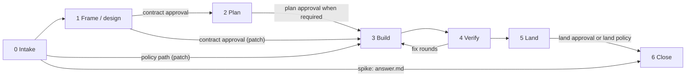
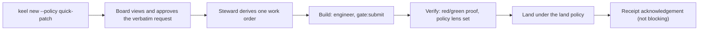
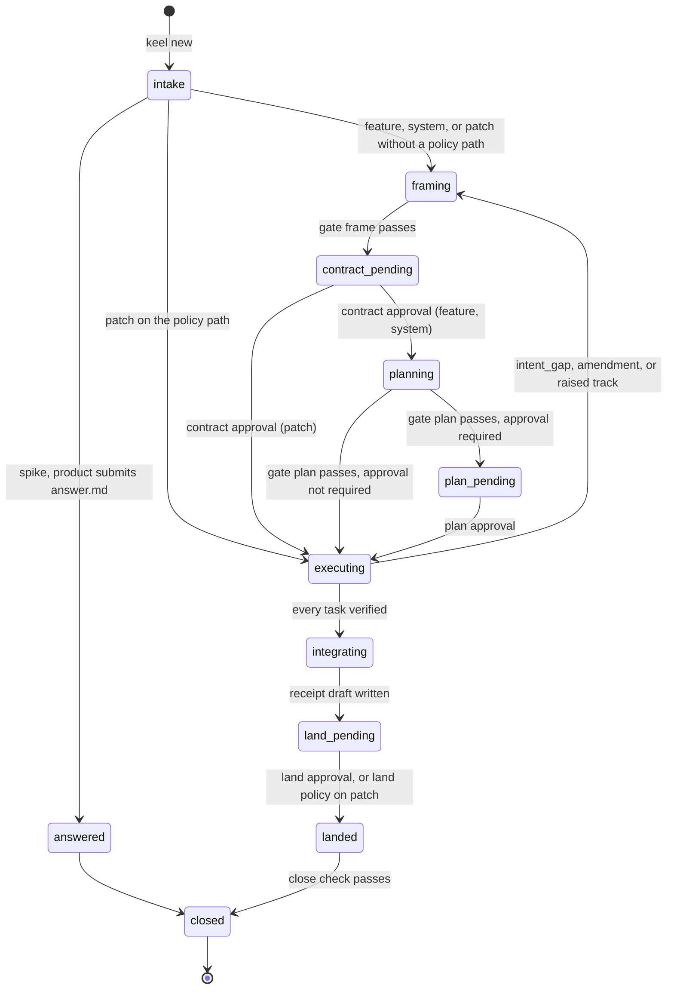
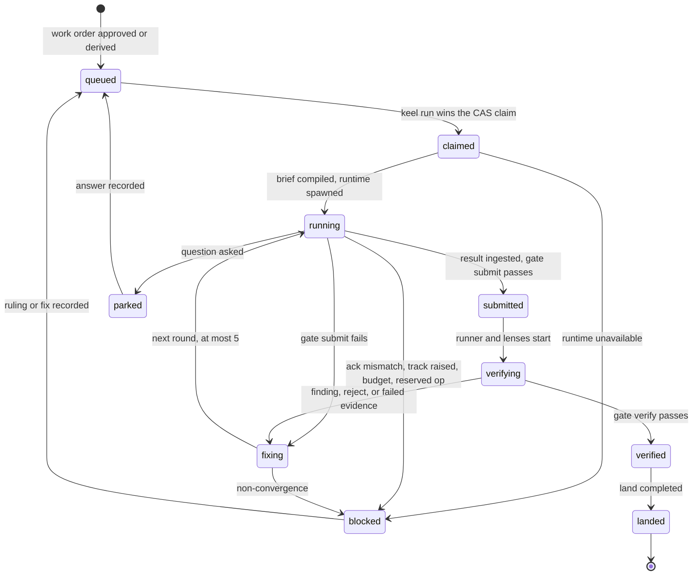

# Lifecycle and tracks

This document owns how a change moves through keel: the track and its ratchet, the seven phases, the patch
track and the policy path, the proposal and task state machines, standing policies, the liveness invariant
and budgets. The checks inside each gate are catalogued only in [11-verification.md](11-verification.md);
who approves what is in [01-org-model.md](01-org-model.md).

## Track signals and the upward-only ratchet (including the no-index fallback)

There is one ceremony axis, the **track**. "Tier" is a different thing: model capability only
([01-org-model.md](01-org-model.md)).

| Track | Fits when | Ceremony |
| --- | --- | --- |
| spike | The request is a question, not a change | The product seat answers read-only in a scratch worktree and writes `answer.md` (`templates/proposal/answer.md`); no land and no checkpoints |
| patch | At most 1 session, 5 files and about 100 LOC; one element or unmapped paths; no arch rules, contracts or public API touched | Phase 2 always skipped; one Steward-derived work order ([Patch track and policy path](#patch-track-and-policy-path)) |
| feature | Larger than a patch, within the declared architecture | Frame, plan, build, verify, land; contract and land approvals, plan approval only when needed |
| system | The change needs an architecture delta, or crosses the declared architecture | Adds the architect, the failure model, the thorough lens set, and an always-required plan approval |

**Signals.** At intake the Steward records the signals in `proposal.yaml`:

- anchors: the cited goal, requirements and scenarios, elements and paths;
- predicted impact: elements reached and declared boundaries crossed;
- protected globs touched;
- INV and ADR obligations whose `applies_to` the change reaches;
- public API: paths under elements tagged `public-api`.

The classifier picks the lowest track whose limits the signals fit. The numeric limits are track thresholds
in `.keel/config.yaml`, defaulting to `config/keel.defaults.yaml`. `keel new --track <track>` can ask for a
higher track than the classifier picked; a lower one needs a Board `--rule track`. A request with no anchor
goes to framing, where product supplies the anchors.

**Ratchet.** At submit the cartographer recomputes impact from the actual diff (elements reached, boundaries
crossed, rules and public API touched), records predicted versus actual, and recomputes the track. The track
can only rise:

- if the actual track is higher than the recorded one, the task becomes `blocked(track_raised)` and the
  proposal is re-routed with the added gates and checkpoints. It returns to the earliest phase that the
  higher track adds or changes: a patch raised to feature returns to framing (a real frame and a plan
  phase), and a feature raised to system returns to framing for the architect's design and a new contract;
- only a Board `keel approve 
 --rule track` lowers a track.

The current track lives only in the ledger (`track.decided` events); `proposal.yaml` holds intake signals
only.

**No-index fallback.** Before M4, or with the index backend `none`, impact is not computable, so the
ratchet uses a conservative path rule. The track rises above patch when:

- the changed path count exceeds the patch limit;
- any protected glob or any `public-api`-tagged element's glob is touched;
- the changed paths span more than one top-level directory mapping.

Borrowed from: superpowers (ceremony ratchet), BMAD-METHOD (intent-sized routing), Sourcegraph-style impact
analysis ([07-architecture-intelligence.md](07-architecture-intelligence.md)).

## Phases 0–6

Phases 1 to 5 each end at a gate: `gate:frame`, `gate:plan`, `gate:submit` (end of build), `gate:verify`
and `gate:land`. Intake runs the intake part of `gate:frame`, and close runs the close check. The named
checks, their statuses and their negative controls are in [11-verification.md](11-verification.md).

### Phase 0 Intake

- **Entry.** The Board runs `keel new "<title>" [--goal G-nn] [--track …] [--policy <name>]` outside any keel
  run. The request cites an active goal. The policy path needs the Board's request approval.
- **Who.** The Steward: id minting, anchor check, predicted impact, track classification.
- **Produces.** Branch `keel/
/main` from trunk and the planning worktree `<workspace_root>/
.plan`;
  `proposal.yaml` with intake signals; the ledger events `proposal.created` (with the origin) and
  `track.decided`. For a spike, the product seat then answers read-only in a scratch worktree and
  submits `answer.md`; the proposal closes without land.
- **Gate.** The intake part of `gate:frame`: the goal is active, the charter is current, and on the policy
  path the request is approved.
- **Board.** Approves the request on the policy path. Lowering the track needs `--rule track`.

### Phase 1 Frame (and design on system)

- **Entry.** Track patch without a policy path, or any patch that needs new ACC; feature; system.
- **Who.** product; architect on system; reviewer lenses from a different declared family (spec, plus
  architecture on system).
- **Produces.** The frozen block of `intent.md` and `spec.delta.yaml`; on system also `arch.delta.yaml`,
  `decisions/ADR-*.md` with obligations and typed `keel arch plan` ops.
- **Gate.** `gate:frame`: deterministic checks, plus a separate frame-review check over the synthesized lens
  verdicts.
- **Board.** Contract approval, `keel approve 
 --stage contract`, which binds `contract_hash`, the
  `keel/
/main` commit and the chain head ([02-alignment.md](02-alignment.md)).

### Phase 2 Plan

- **Entry.** A valid contract approval on feature or system. Patch always skips this phase.
- **Who.** planner; the Steward (impact, waves, routing snapshot); a reviewer running the verification-gap
  lens over the ACC → command table and the test-task definitions (no test is written yet).
- **Produces.** `plan.yaml`; `workorders/T<n>.yaml`, including test tasks and `frozen_tests`;
  `routing.snapshot.yaml`; impact records `IM-*` (in `.git/keel/records`, projected at land).
- **Gate.** `gate:plan`, with readiness PASS, CONCERNS or FAIL.
- **Board.** Plan approval, `keel approve 
 --stage plan`, when required: always on system; on feature
  when a wave is wider than 1 or routing deviates from the approved routing. After the plan is approved (or
  found not to need approval) the planning worktree is removed; it can be re-created.

### Phase 3 Build

- **Entry.** A task is ready when its `after` edges are verified, its route passes the exposure rule and
  its conformance status is recorded, the CAS claim is acquired, and its sparse worktree sits at the
  recorded base with bootstrap and green-baseline evidence.
- **Who.** The Steward (claim, brief, ref snapshot, spawn, ingest, commit); the engineer.
- **Produces.** Run inputs and outbox under `<workspace_root>/_runs/<RUN>/` (the raw stream is parsed in
  memory and never written);
  `ack.recorded`, `ruling.made`, `question.asked` and `result.submitted` events through the typed-field
  whitelist; shadow snapshots `refs/keel/snap/<task>/<seq>`; the Steward commit of round `
.T<n>.r<k>`
  with trailers, made at submit ingest, after which the task worktree's index is refreshed.
- **Gate.** The brief check at dispatch, the ACK diff before any counted edit, and `gate:submit` on the round
  commit ([05-vcs.md](05-vcs.md)).
- **Board.** Only stop-class asks, Board-owned asks and budget raises.

### Phase 4 Verify

- **Entry.** `gate:submit` passed.
- **Who.** The Steward's runner; reviewer lenses of a different declared family, all launched before any
  result is read; the planner (triage records); the engineer (fix rounds).
- **Produces.** Evidence `EV-*` (a cache), verdicts `VD-*`, triage records `TR-*`, actual impact and drift
  reports, the red/green proof on policy lands, fix-round events, and deferred minor findings.
- **Gate.** `gate:verify`. A test task (work order kind `test`) is verified differently: its cited rows must
  be red at its commit (`verify.test-red`) and the `test_task` lens set reads its frozen test output;
  `verify.evidence` applies to the build tasks that consume those tests
  ([11-verification.md](11-verification.md) section 3). A task whose `after` edges point at a test task
  starts only once that test task is verified and restacked onto `keel/
/main`.
- **Board.** Nothing by default. Board items that can arise: `intent_gap`, dismissal proposals,
  non-convergence, overrides, and degraded or unverified acknowledgements.

### Phase 5 Land

- **Entry.** Every task of the proposal is verified.
- **Who.** The Steward (integrator, runner, trace check).
- **Produces.**
  - the task rounds integrated onto `keel/
/main` in wave order (a restack; evidence is reused only on an
    identical source state);
  - an integration preview (a chain of `git merge-tree` runs, or a jj megamerge);
  - the receipt draft, naming the integrated commit and the expected trunk tip;
  - the archive commit: deltas applied to the living specs and the arch model, accepted ADRs promoted to
    `.keel/decisions/`, a series point appended, and the proposal folder moved to
    `.keel/archive/<yyyy>/
-<slug>/` with projections (ledger slice, EV, VD, TR, reports, receipt) that
    pass the projection gate ([04-trace-and-state.md](04-trace-and-state.md));
  - the trunk update: `merge --ff-only` in a clean worktree that has trunk checked out, otherwise a CAS
    `update-ref` ([05-vcs.md](05-vcs.md));
  - the `land.completed` event with the landed commit id.
- **Gate.** `gate:land`, which re-executes the full acceptance matrix on a fresh detached checkout of the
  integrated commit.
- **Board.** Land approval, `keel approve 
 --stage land`, after reading `receipt.md`; on patch, the land
  policy decides. Pushing to a shared remote is a reserved action.

### Phase 6 Close

- **Entry.** Landed.
- **Who.** The Steward (auditor, cleanup); optionally a reviewer running the audit lens.
- **Produces.** Cleanup events (only keel-provenance worktrees and refs are removed); a before/after aggregate
  view; the jj op log and evolog export when jj is enabled; a receipt acknowledgement item when the change
  landed under a policy.
- **Gate.** The close check: liveness clean, overrides expired, no unacknowledged receipt on the touched
  elements or paths. It is liveness-only until M8 adds the quiescence audit.
- **Board.** Receipt acknowledgement after a policy land, `keel approve 
 --stage receipt`; not blocking.

## Patch track and policy path

A patch is a change of at most one session, five files and about 100 LOC, confined to one element or to
unmapped paths, touching no arch rules, contracts or public API. The ratchet enforces those limits at
submit.

- **Phase 2 is always skipped.** The Steward derives exactly one work order: its write_set from the
  anchors, and its acceptance from the cited `R-…#S<n>` scenarios or from a test fixed first by a test task
  on a different declared family.
- **Seats.** The engineer; review lenses (the policy set of two on a policy land, otherwise the one-lens
  `patch` set); product only when new ACC are needed.

The contract comes from one of two routes:

| Route | What is approved | When it applies |
| --- | --- | --- |
| Per-change contract | A contract approval over a frozen block derived deterministically from the request, the anchors and the cited scenarios (drafted by product when new ACC are needed) | Any patch; required whenever new ACC are needed |
| Policy path | A Board-approved request record (`keel new --policy <name>`), a Board-approved standing policy, and deterministically derived fields | Only when every predicate of the policy holds and no new ACC are needed |

A **policy land** has extra requirements, because no human looked at the change before it was built:

1. a red-before/green-after proof: the runner executes the cited acceptance at the base commit and at the
   change commit, and at least one cited scenario, or a test fixed first by a different-family test task,
   must fail before and pass after; otherwise the change needs a per-change contract approval;
2. the `policy` lens set (`org/seats/reviewer.yaml`) always runs, on a declared family different from
   the engineer's;
3. land follows the land policy, and a receipt acknowledgement follows the land.

Borrowed from: superpowers (ceremony ratchet), Kiro (its Quick Spec is why standing policies never approve
LLM-drafted acceptance; public docs), old-coder (fail-closed proofs).

## State machine

State is computed from ledger events and never stored. `keel status [<id>] --next` prints the computed
state and the legal next actions. The full event union is `schemas/ledger-event.schema.json`
([04-trace-and-state.md](04-trace-and-state.md)).

### Proposal states

| State | Phase | Meaning |
| --- | --- | --- |
| `intake` | 0 | `proposal.created` recorded; track being decided |
| `framing` | 1 | product (and architect on system) writing the frozen intent |
| `answered` | 0 | Spike answer submitted; closes without land |
| `contract_pending` | 1 | `gate:frame` passed; waiting for the contract approval |
| `planning` | 2 | planner writing the plan and work orders |
| `plan_pending` | 2 | `gate:plan` passed; waiting for a required plan approval |
| `executing` | 3 and 4 | Tasks building and verifying; each task has its own state (below) |
| `integrating` | 5 | Restack, preview and re-execution on the integrated commit |
| `land_pending` | 5 | Receipt draft written; waiting for the land approval (or the land policy) |
| `landed` | 5 | `land.completed` recorded with the landed commit id |
| `closed` | 6 | Close check passed; terminal |
| `abandoned` | any | `keel approve 
 --rule abandon`; terminal, from any non-terminal state |

A Board hold (`keel run --hold on 
`) overlays any non-terminal state: running runs are cancelled
([06-parallelism.md](06-parallelism.md)), nothing is dispatched until `--hold off`, and liveness counts the
hold as a pending Board item.

### Task states

A failed submit gate returns its findings to the engineer as the next round, and counts toward the round
cap like a review finding. A task on the patch track or in a wave waits in `queued` until its `after` edges
are verified. Any non-terminal task can become `abandoned` with its proposal.

### Blocked reasons

| Reason | Set when | Unblocked by |
| --- | --- | --- |
| `ack_mismatch` | The second ACK in a run still differs from the brief's id set, write_set or hash | An answer from the clause owner, or an amendment if the brief was wrong |
| `non_convergence` | A task passes fix round 5 without closing its findings | A Board ruling (dismiss, override), a replan, or abandonment; on system, three failed fixes of one finding go to the architect first |
| `track_raised` | The actual track at submit is higher than the recorded one | Re-routing with the added checkpoints, or `--rule track` |
| `budget` | Spend reaches 100% of a budget | `--rule budget` |
| `runtime_unavailable` | No compatible route, a missing runtime, or a failed exposure rule | Fixing the route or environment (per `keel doctor`); never a Board acknowledgement |
| `reserved_op` | The ref-snapshot or `ls-remote` diff shows a change keel did not make | Board investigation, then `--rule override` or abandonment |

Where the owner looks for each one is in [00a-owner-guide.md](00a-owner-guide.md).

## Standing policy limits

A standing policy is a Board-approved file `.keel/policies/<name>.yaml` (schema `schemas/policy.schema.json`,
template `templates/project/policies/quick-patch.yaml`), approved with `keel approve --policy <name>`
(record kind `policy`). Policies are revocable, and every receipt lists the policies it used.

Adopted defaults ([17-open-decisions.md](17-open-decisions.md)):

- **quick-patch**: at most 5 files and 100 LOC; one element or unmapped paths; no protected globs, INV or
  obligations touched; an approved request; a red-before/green-after proof; the `policy` lens set.
- **Land policy for patches**: a land approval on shared trunks; an approved land policy plus a receipt
  acknowledgement on solo repositories.

What a standing policy can never do:

- approve acceptance drafted by an LLM: new ACC always need a per-change contract approval;
- apply to feature or system work: if the ratchet raises the track at submit, the policy stops applying and
  the normal checkpoints return;
- waive the exposure rule, an approval check, the trace check or land re-execution;
- start a change on its own: the request that names the change is always approved by the Board.

After a policy land the Board acknowledges the receipt with `keel approve 
 --stage receipt`. The
acknowledgement does not block, but an unacknowledged receipt blocks the next change that touches the same
elements, or the same path globs when the paths are unmapped.

Borrowed from: edikt (expiring overrides; idea only), Kiro (Quick Spec as the counter-example).

## Liveness invariant

Every non-terminal task holds exactly one of:

- a **claim** (`claimed`, `running`; the claim is released when the submit is ingested or the run is
  cancelled);
- a **queued dispatch** (`queued`; `submitted` and `verifying`, whose runner and lens dispatches are
  queued or running; `fixing`, whose next round is queued);
- a named **unblock_owner** with an open ask (`parked`, `blocked`); rung-D tasks always hold
  `unblock_owner: board`, because a human must run them;
- a **pending approval** (`verified` tasks waiting for land, and tasks of a proposal waiting at a
  checkpoint or under a Board hold).

A task that holds none of these is an **orphan**. `keel audit` and the dashboard Board queue flag orphans.
Heartbeats have one channel: they are derived from the runtime's parsed stream events, and `keel audit`
re-queues a claim whose lease expired ([06-parallelism.md](06-parallelism.md)).

**Quiescence** is the complementary check, added in M8: the quiescence audit flags a proposal that has open
work but on which nothing has happened for longer than a threshold, even though every task holds a liveness
item. Until M8 the close check tests liveness only.

Borrowed from: Paperclip (liveness invariant, quiescence watchdog), superpowers (stall lessons).

## Budgets

Budgets are declared by the Board in `goals.yaml`, carried into `plan.yaml`, and split per task in the work
orders. Spend is derived from the runtimes' parsed stream events and rolls up per task, proposal and goal.

- **80%**: a warning event, shown on the dashboard and in `keel status`.
- **100%**: `blocked(budget)` until the Board raises it with `keel approve <subject> --rule budget`.
- The plan gate checks that the task budgets fit the proposal and goal budgets.
- Runtimes that support it also receive per-run limits through their flags (for example a maximum spend or
  turn count), declared in the descriptor ([09-runtimes.md](09-runtimes.md)).

Other bounded quantities are not money but still budgets, each owned elsewhere: brief byte budgets
([02-alignment.md](02-alignment.md)), the handbook budget ([09-runtimes.md](09-runtimes.md)), the fix-round
cap of 5 ([11-verification.md](11-verification.md)), and the surface budget of 16 verbs and at most 40 modes
([12-cli-api-mcp.md](12-cli-api-mcp.md)). Caps and thresholds, each with a reason, live in
`config/keel.defaults.yaml`.

Borrowed from: Paperclip (budgets that warn at 80% and stop at 100%).
