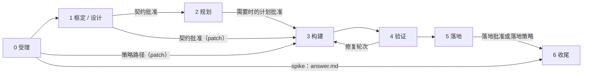
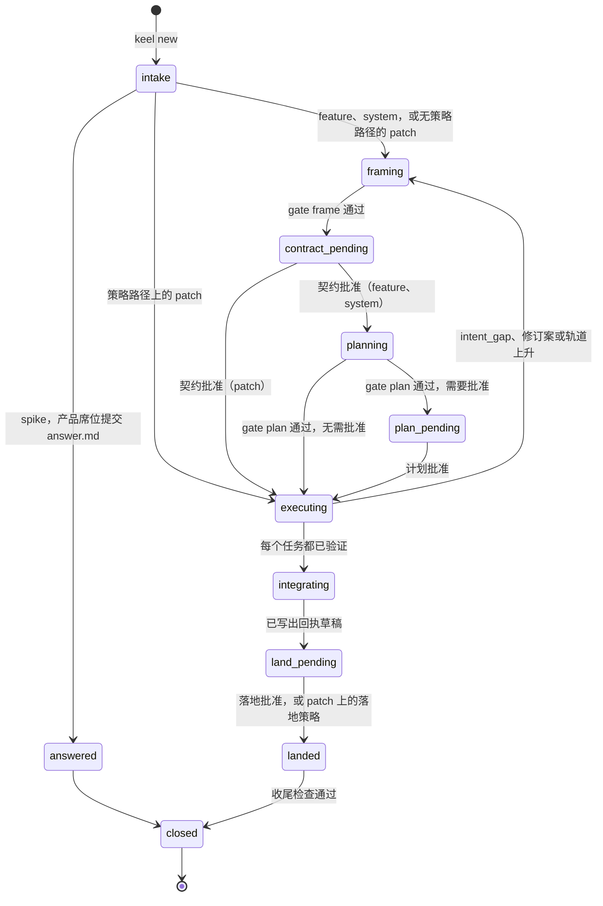
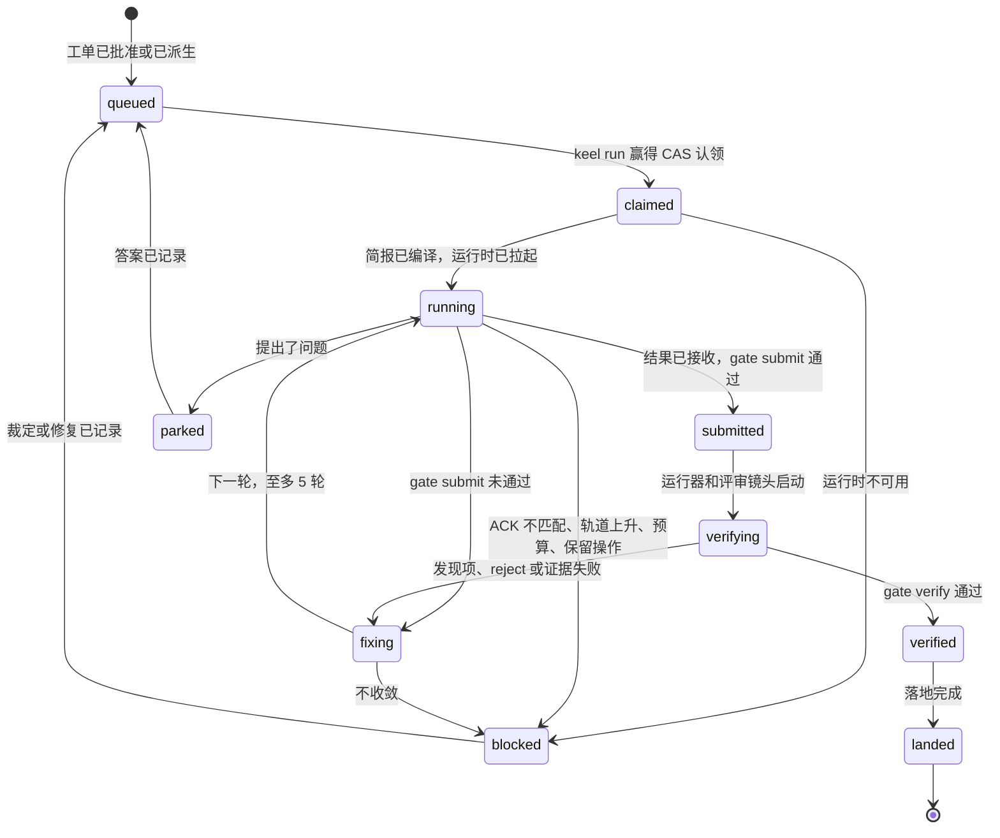

# 生命周期与轨道

> 英文原文（规范版本）：[03-lifecycle.md](03-lifecycle.md)。本文是其简体中文镜像，两者不一致时以英文版为准。

本文档负责一次变更如何在 keel 中推进：轨道（track）及其棘轮、七个阶段、patch 轨道与策略路径、提案与任务状态机、常设策略（standing policy）、活性不变量以及预算。每道门禁（gate）内部的检查只在 [11-verification.zh-CN.md](11-verification.zh-CN.md) 中编目；谁签署什么见 [01-org-model.zh-CN.md](01-org-model.zh-CN.md)。

## 轨道信号与只升不降的棘轮（含无索引回退）

只有一条仪式轴，即**轨道**。“档位（tier）”是另一回事：只表示模型能力（[01-org-model.zh-CN.md](01-org-model.zh-CN.md)）。

| 轨道 | 适用情形 | 仪式 |
| --- | --- | --- |
| spike | 请求是一个问题，而不是一次变更 | 产品席位在草稿工作树中只读作答，并写出 `answer.md`（`templates/proposal/answer.md`）；不落地，也没有检查点 |
| patch | 至多 1 个会话、5 个文件、约 100 行代码；一个架构元素或未映射的路径；不触及架构规则、契约或公共 API | 始终跳过阶段 2；一份由 Steward 派生的工单（[patch 轨道与策略路径](#patch-轨道与策略路径)） |
| feature | 大于 patch，且在声明的架构之内 | 框定、规划、构建、验证、落地；契约批准和落地批准，只在需要时进行计划批准 |
| system | 变更需要架构增量，或跨越声明的架构 | 增加架构席位、失败模型、thorough 镜头集，以及始终需要的计划批准 |

**信号。** 受理时，Steward 在 `proposal.yaml` 中记录以下信号：

- 锚点：所引用的目标、需求与场景、架构元素（element）和路径；
- 预测的影响面（impact）：波及的架构元素和跨越的声明边界；
- 触及的受保护 glob；
- 变更波及其 `applies_to` 的 INV 和 ADR 义务；
- 公共 API：标记为 `public-api` 的架构元素下的路径。

分类器选取信号能满足其限额的最低轨道。数值限额是 `.keel/config.yaml` 中的轨道阈值，默认取自 `config/keel.defaults.yaml`。`keel new --track <track>` 可以要求比分类器所选更高的轨道；更低的轨道则需要董事会（Board）的 `--rule track`。没有锚点的请求会进入框定阶段，由产品席位补充锚点。

**棘轮。** 提交时，cartographer 根据实际差异重新计算影响面（波及的架构元素、跨越的边界、触及的规则和公共 API），记录预测值与实际值，并重新计算轨道。轨道只能上升：

- 如果实际轨道高于已记录的轨道，任务变为 `blocked(track_raised)`，提案带着新增的门禁和检查点被重新路由。它会回到更高轨道所增加或改变的最早阶段：从 patch 升为 feature 时回到框定阶段（进行真正的框定和规划阶段），从 feature 升为 system 时回到框定阶段，以进行架构席位的设计并形成新的契约；
- 只有董事会的 `keel approve 
 --rule track` 能降低轨道。

当前轨道只保存在账本（ledger）中（`track.decided` 事件）；`proposal.yaml` 只保存受理信号。

**无索引回退。** 在 M4 之前，或者当索引后端为 `none` 时，影响面无法计算，因此棘轮使用一条保守的路径规则。在以下情况下，轨道会升到 patch 之上：

- 变更路径数超过 patch 限额；
- 触及任何受保护 glob，或任何标记为 `public-api` 的架构元素的 glob；
- 变更路径跨越不止一个顶层目录映射。

借鉴自：superpowers（仪式棘轮）、BMAD-METHOD（按意图规模路由）、Sourcegraph 风格的影响面分析（[07-architecture-intelligence.zh-CN.md](07-architecture-intelligence.zh-CN.md)）。

## 阶段 0–6

阶段 1 到 5 各自以一道门禁结束：`gate:frame`、`gate:plan`、`gate:submit`（构建结束时）、`gate:verify` 和 `gate:land`。受理运行 `gate:frame` 的受理部分，收尾运行收尾检查。具名检查、其状态及其负对照见 [11-verification.zh-CN.md](11-verification.zh-CN.md)。

### 阶段 0 受理（Intake）

- **进入条件。** 董事会在任何 keel 运行之外执行 `keel new "<title>" [--goal G-nn] [--track …] [--policy <name>]`。请求引用一个 active 状态的目标。策略路径需要一个董事会签名的请求信封。
- **执行者。** Steward：铸造编号、检查锚点、预测影响面、对轨道分类。
- **产出。** 从主干创建的分支 `keel/
/main` 和规划工作树 `<workspace_root>/
.plan`；带受理信号的 `proposal.yaml`；账本事件 `proposal.created`（含来源）和 `track.decided`。对于 spike，产品席位随后在草稿工作树中只读作答并提交 `answer.md`；提案不经落地即关闭。
- **门禁。** `gate:frame` 的受理部分：目标处于 active 状态、章程是最新的，且在策略路径上请求已签名。
- **董事会。** 在策略路径上签署请求。降低轨道需要 `--rule track`。

### 阶段 1 框定（Frame；system 轨道上兼做设计）

- **进入条件。** 没有策略路径的 patch 轨道，或任何需要新 ACC 的 patch；feature；system。
- **执行者。** 产品席位；system 上还有架构席位；来自不同声明的模型家族（declared family）的评审镜头（spec，system 上再加 architecture）。
- **产出。** `intent.md` 的冻结块和 `spec.delta.yaml`；system 上还有 `arch.delta.yaml`、带义务的 `decisions/ADR-*.md` 以及类型化的 `keel arch plan` 操作。
- **门禁。** `gate:frame`：确定性检查，外加一项针对综合后的评审镜头评审结论的独立框定评审检查。
- **董事会。** 契约批准，即 `keel approve 
 --stage contract`，它签署 `contract_hash`、`keel/
/main` 提交和链头（[02-alignment.zh-CN.md](02-alignment.zh-CN.md)）。

### 阶段 2 规划（Plan）

- **进入条件。** feature 或 system 上有一个有效的契约批准。patch 始终跳过此阶段。
- **执行者。** 规划席位；Steward（影响面、波次、路由快照）；一个针对 ACC → 命令表和测试任务的定义（此时尚未编写任何测试）运行验证缺口评审镜头的评审席位。
- **产出。** `plan.yaml`；`workorders/T<n>.yaml`，包括测试任务和 `frozen_tests`；`routing.snapshot.yaml`；影响面记录 `IM-*`（位于 `.git/keel/records`，在落地时投影）。
- **门禁。** `gate:plan`，就绪度为 PASS、CONCERNS 或 FAIL。
- **董事会。** 需要时进行计划批准，即 `keel approve 
 --stage plan`：system 上始终需要；feature 上当某个波次宽度大于 1 或路由偏离签名的路由配置时需要。计划获批（或被判定无需批准）后，规划工作树被删除；之后可以重新创建。

### 阶段 3 构建（Build）

- **进入条件。** 当一个任务的 `after` 边都已验证、其路由通过暴露规则且其一致性测评状态（conformance status）已记录、CAS 认领已获取，并且其稀疏工作树位于记录的基准处、带有引导（bootstrap）和绿色基线证据时，该任务就绪。
- **执行者。** Steward（认领、简报、引用快照、拉起、接收、提交）；工程席位。
- **产出。** `<workspace_root>/_runs/<RUN>/` 下的运行输入和发件箱（原始流在内存中解析，从不写入）；经过类型化字段白名单的 `ack.recorded`、`ruling.made`、`question.asked` 和 `result.submitted` 事件；影子快照 `refs/keel/snap/<task>/<seq>`；带提交尾注（trailer）的轮次 `
.T<n>.r<k>` 的 Steward 提交（在摄取提交时生成），之后任务工作树的索引会被刷新。
- **门禁。** 派发时的简报检查、任何计入的编辑之前的 ACK 差异比对，以及在轮次提交上运行的 `gate:submit`（[05-vcs.zh-CN.md](05-vcs.zh-CN.md)）。
- **董事会。** 只处理停止类别提问、董事会负责的提问和预算上调。

### 阶段 4 验证（Verify）

- **进入条件。** `gate:submit` 已通过。
- **执行者。** Steward 的运行器；来自不同声明的模型家族的评审镜头，全部在读取任何结果之前启动；规划席位（分诊记录）；工程席位（修复轮次）。
- **产出。** 证据 `EV-*`（缓存）、评审结论 `VD-*`、分诊记录 `TR-*`、实际影响面和漂移报告、策略落地上的红绿证明、修复轮次事件，以及推迟处理的 minor 发现项。
- **门禁。** `gate:verify`。测试任务（`test` 类型的工单）的验证方式不同：其引用的行必须在其提交上为红（`verify.test-red`），并由 `test_task` 评审镜头集阅读其冻结测试的输出；`verify.evidence` 适用于使用这些测试的构建任务（[11-verification.zh-CN.md](11-verification.zh-CN.md) 第 3 节）。`after` 边指向某个测试任务的任务，只有在该测试任务通过验证并被重新堆叠到 `keel/
/main` 上之后才会开始。
- **董事会。** 默认没有。可能出现的董事会事项：`intent_gap`、驳回提议、不收敛、豁免，以及对降级（degraded）或 unverified 的确认。

### 阶段 5 落地（Land）

- **进入条件。** 提案的每个任务都已验证。
- **执行者。** Steward（integrator、runner、追溯检查）。
- **产出。**
  - 按波次顺序集成到 `keel/
/main` 上的任务轮次（一次 restack；只有在源状态完全相同时才复用证据）；
  - 一次集成预览（一连串 `git merge-tree` 运行，或一次 jj megamerge）；
  - 回执草稿，其中指明集成后的提交和预期的主干顶端；
  - 归档提交：把增量应用到活规格和架构模型、把已接受的 ADR 晋升到 `.keel/decisions/`、追加一个序列点，并把提案文件夹连同投影（账本切片、EV、VD、TR、报告、回执）移动到 `.keel/archive/<yyyy>/
-<slug>/`，这些投影需通过投影门禁（[04-trace-and-state.zh-CN.md](04-trace-and-state.zh-CN.md)）；
  - 主干更新：在检出主干的干净工作树中执行 `merge --ff-only`，否则执行 CAS `update-ref`（[05-vcs.zh-CN.md](05-vcs.zh-CN.md)）；
  - 带已落地提交 id 的 `land.completed` 事件。
- **门禁。** `gate:land`，它在集成后提交的一个全新分离检出上重新执行完整的验收矩阵。
- **董事会。** 阅读 `receipt.md` 之后进行落地批准，即 `keel approve 
 --stage land`；在 patch 上由落地策略决定。推送到共享远程仓库是一项保留操作。

### 阶段 6 收尾（Close）

- **进入条件。** 已落地。
- **执行者。** Steward（auditor、清理）；可选地由一个评审席位运行 audit 评审镜头。
- **产出。** 清理事件（只删除带 keel 出处标记的工作树和引用）；一个前后对比的聚合视图；启用 jj 时导出 jj op log 和 evolog；变更在策略下落地时生成一个回执确认事项。
- **门禁。** 收尾检查：活性干净、豁免已过期、所触及的架构元素或路径上没有未确认的回执。在 M8 加入静止审计之前，它只检查活性。
- **董事会。** 策略落地之后进行回执确认，即 `keel approve 
 --stage receipt`；不阻塞。

## patch 轨道与策略路径

patch 是一次至多一个会话、五个文件、约 100 行代码的变更，限定在一个架构元素或未映射的路径之内，不触及架构规则、契约或公共 API。棘轮在提交时强制执行这些限额。

- **始终跳过阶段 2。** Steward 恰好派生一份工单：其 write_set 来自锚点，其验收来自所引用的 `R-…#S<n>` 场景，或来自由不同声明的模型家族上的测试任务先行确定的测试。
- **席位。** 工程席位；评审镜头（策略落地时为两个评审镜头组成的 policy 镜头集，否则为只含一个镜头的 `patch` 镜头集）；仅在需要新 ACC 时加上产品席位。

契约来自以下两条途径之一：

| 途径 | 签署的内容 | 适用情形 |
| --- | --- | --- |
| 逐变更契约 | 对一个冻结块的契约批准，该冻结块由请求、锚点和所引用的场景以确定性方式派生（需要新 ACC 时由产品席位起草） | 任何 patch；只要需要新 ACC 就必须采用 |
| 策略路径 | 一个董事会签名的请求信封（`keel new --policy <name>`）、一份董事会签名的常设策略，以及确定性派生的字段 | 只有当策略的每个谓词都成立且不需要新 ACC 时 |

**策略落地**有额外要求，因为在变更构建之前没有任何人类看过它：

1. 红前/绿后证明：运行器在基准提交和变更提交上执行所引用的验收，至少一个被引用的场景、或一个由不同家族测试任务先行确定的测试，必须在变更前失败、变更后通过；否则该变更需要逐变更的契约批准；
2. `policy` 镜头集（`org/seats/reviewer.yaml`）始终运行，且运行在与工程席位不同的声明的模型家族上；
3. 落地遵循落地策略，落地之后进行回执确认。

借鉴自：superpowers（仪式棘轮）、Kiro（其 Quick Spec 正是常设策略从不批准由 LLM 起草的验收的原因；公开文档）、old-coder（失败即关闭的证明）。

## 状态机

状态由账本事件计算得出，从不存储。`keel status [<id>] --next` 打印计算出的状态和合法的下一步操作。完整的事件联合类型是 `schemas/ledger-event.schema.json`（[04-trace-and-state.zh-CN.md](04-trace-and-state.zh-CN.md)）。

### 提案状态

| 状态 | 阶段 | 含义 |
| --- | --- | --- |
| `intake` | 0 | 已记录 `proposal.created`；正在决定轨道 |
| `framing` | 1 | 产品席位（system 上还有架构席位）正在编写冻结意图 |
| `answered` | 0 | 已提交 spike 答复；不经落地即关闭 |
| `contract_pending` | 1 | `gate:frame` 已通过；等待契约批准 |
| `planning` | 2 | 规划席位正在编写计划和工单 |
| `plan_pending` | 2 | `gate:plan` 已通过；等待必需的计划批准 |
| `executing` | 3 和 4 | 任务正在构建和验证；每个任务都有自己的状态（见下文） |
| `integrating` | 5 | 在集成后的提交上进行 restack、预览和重新执行 |
| `land_pending` | 5 | 已写出回执草稿；等待落地批准（或落地策略） |
| `landed` | 5 | 已记录带已落地提交 id 的 `land.completed` |
| `closed` | 6 | 收尾检查已通过；终态 |
| `abandoned` | 任意 | `keel approve 
 --rule abandon`；终态，可从任何非终态进入 |

董事会暂停（`keel run --hold on 
`）会叠加在任何非终态之上：正在进行的运行被取消（[06-parallelism.zh-CN.md](06-parallelism.zh-CN.md)），在 `--hold off` 之前不派发任何东西，活性把该暂停计为一个待处理的董事会事项。

### 任务状态

未通过的提交门禁会把其发现项作为下一轮返回给工程席位，并像评审发现项一样计入轮次上限。patch 轨道上或某个波次中的任务会在 `queued` 中等待，直到其 `after` 边都已验证。任何非终态任务都可以随其提案一起变为 `abandoned`。

### 阻塞原因

| 原因 | 何时设置 | 解除方式 |
| --- | --- | --- |
| `ack_mismatch` | 一次运行中的第二次 ACK 仍与简报的编号集、write_set 或哈希不同 | 条款负责人的答复；如果简报有误，则为修订案 |
| `non_convergence` | 任务超过第 5 轮修复仍未关闭其发现项 | 董事会裁定（dismiss、override）、重新规划或放弃；在 system 上，同一发现项三次修复失败时先交给架构席位 |
| `track_raised` | 提交时的实际轨道高于已记录的轨道 | 带着新增的检查点重新路由，或 `--rule track` |
| `budget` | 花费达到某项预算的 100% | `--rule budget` |
| `runtime_unavailable` | 没有兼容的路由、运行时缺失，或暴露规则未通过 | 修正路由或环境（按 `keel doctor` 的指示）；绝不能通过董事会确认解除 |
| `reserved_op` | 引用快照或 `ls-remote` 差异显示了一项并非由 keel 做出的更改 | 董事会调查，然后 `--rule override` 或放弃 |

所有者针对每种原因去哪里查看，见 [00a-owner-guide.zh-CN.md](00a-owner-guide.zh-CN.md)。

## 常设策略的限制

常设策略是一个董事会签名的文件 `.keel/policies/<name>.yaml`（schema 为 `schemas/policy.schema.json`，模板为 `templates/project/policies/quick-patch.yaml`），用 `keel approve --policy <name>` 签署（信封类型 `policy`）。策略可以撤销，每份回执（receipt）都列出它所使用的策略。

已采纳的默认值（[17-open-decisions.zh-CN.md](17-open-decisions.zh-CN.md)）：

- **quick-patch**：至多 5 个文件和 100 行代码；一个架构元素或未映射的路径；不触及受保护 glob、INV 或义务；签名的请求；红前/绿后证明；`policy` 镜头集。
- **patch 的落地策略**：在共享主干上需要落地批准；在单人仓库上为签名的落地策略加回执确认。

常设策略永远不能做的事：

- 批准由 LLM 起草的验收：新 ACC 始终需要逐变更的契约批准；
- 适用于 feature 或 system 工作：如果棘轮在提交时上调了轨道，策略即不再适用，常规检查点随之恢复；
- 豁免暴露规则、签名检查、追溯检查或落地重跑；
- 自行发起变更：指明该变更的请求始终由董事会签署。

策略落地之后，董事会用 `keel approve 
 --stage receipt` 确认回执。该确认不阻塞，但未确认的回执会阻塞下一个触及相同架构元素的变更；路径未映射时，则阻塞下一个触及相同路径 glob 的变更。

借鉴自：edikt（会过期的豁免；仅借鉴思想）、Kiro（Quick Spec 作为反例）。

## 活性不变量

每个非终态任务恰好持有以下之一：

- 一个**认领**（`claimed`、`running`；在提交被接收或运行被取消时释放认领）；
- 一个**排队的派发**（`queued`；`submitted` 和 `verifying`，其运行器和评审镜头的派发处于排队或运行中；`fixing`，其下一轮处于排队中）；
- 一个带未决提问的具名 **unblock_owner**（`parked`、`blocked`）；梯级（rung）D 的任务始终持有 `unblock_owner: board`，因为必须由人类来运行它们；
- 一个**待处理的批准**（等待落地的 `verified` 任务，以及其提案在某个检查点等待或处于董事会暂停之下的任务）。

不持有其中任何一项的任务是**孤儿**。`keel audit` 和看板的董事会待办队列会标记孤儿。心跳只有一个通道：它们来自对运行时流事件的解析，`keel audit` 会重新排队租约已过期的认领（[06-parallelism.zh-CN.md](06-parallelism.zh-CN.md)）。

**静止（quiescence）**是与之互补的检查，在 M8 中加入：静止审计会标记那些有未完成工作、但在超过阈值的时间内毫无动静的提案，即使每个任务都持有一个活性项。在 M8 之前，收尾检查只测试活性。

借鉴自：Paperclip（活性不变量、静止看门狗）、superpowers（停滞方面的教训）。

## 预算

预算由董事会在 `goals.yaml` 中声明，带入 `plan.yaml`，并在工单中按任务拆分。花费来自对运行时流事件的解析，并按任务、提案和目标汇总。

- **80%**：一个告警事件，显示在看板和 `keel status` 中。
- **100%**：`blocked(budget)`，直到董事会用 `keel approve <subject> --rule budget` 上调预算。
- 计划门禁检查任务预算是否在提案和目标预算之内。
- 支持该能力的运行时还会通过其标志接收按运行的限额（例如最大花费或轮次数），这些限额在描述符中声明（[09-runtimes.zh-CN.md](09-runtimes.zh-CN.md)）。

其他有界的量并非金钱，但同样是预算，各自归属于别处：简报字节预算（[02-alignment.zh-CN.md](02-alignment.zh-CN.md)）、手册预算（[09-runtimes.zh-CN.md](09-runtimes.zh-CN.md)）、5 轮的修复轮次上限（[11-verification.zh-CN.md](11-verification.zh-CN.md)），以及 16 个动词、至多 40 个模式的接口面预算（[12-cli-api-mcp.zh-CN.md](12-cli-api-mcp.zh-CN.md)）。上限与阈值（每项都附理由）位于 `config/keel.defaults.yaml`。

借鉴自：Paperclip（80% 告警、100% 停止的预算）。
