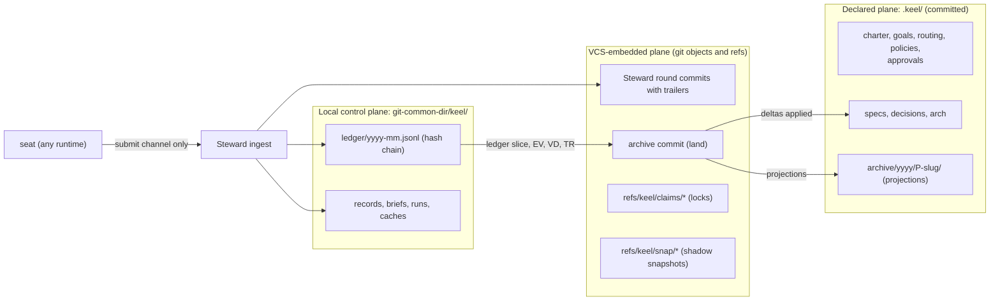
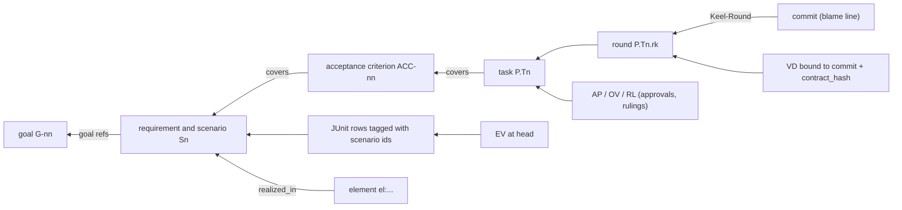

# Trace and state

This document is the only home of traceability and state in keel: where each fact is stored, the
hash-chained ledger, the id scheme, commit trailers, the trace check, the RTM, land projections and
redaction. Other documents link here instead of restating it.

Related homes: the gate catalogue is in [11-verification.md](11-verification.md) (including the
source-state binding of evidence and land re-execution), Board approvals are in
[02-alignment.md](02-alignment.md), what an approval record proves and the threat model are in
[14-trust-security.md](14-trust-security.md), and git and jj mechanics are in [05-vcs.md](05-vcs.md).
The decision to keep the control plane in the git common directory is
[ADR-0003](adr/ADR-0003-control-plane-in-git-common-dir.md).

## Three planes

keel keeps state in three planes, and every fact has exactly one truth store. Anything that can be
computed from events (proposal state, task state, element status, dashboard badges) is computed and
never stored.



| Plane | Location | Holds | Written by |
| --- | --- | --- | --- |
| Declared | `.keel/` in the repository | Governance documents, living specs, promoted ADRs, the architecture model, committed approval records, archived projections | Board edits (effective once approved and committed by a Steward governance commit); the land archive commit; seats only for in-flight proposal files on the proposal branch |
| VCS-embedded | git commits and refs | Trailers on Steward commits, claim locks, shadow snapshots, optional git notes | The Steward only |
| Local control plane | `$(git rev-parse --git-common-dir)/keel/` (`.git/keel/` in a normal clone) | The ledger, in-flight records, compiled briefs, run records, conformance results, derived caches, locks | The Steward only |

### Declared plane

The declared plane is `.keel/`, committed with the code, schema-validated and reviewed like code. It holds
`config.yaml`, `charter.md`, `goals.yaml`, `routing.yaml`, `policies/`, `approvals/`, `specs/`,
`decisions/`, `arch/` and `archive/`. The full layout and the schema of each file
are in [13-artifacts-schemas.md](13-artifacts-schemas.md).

Write rules:

- Living specs (`.keel/specs/<area>/spec.yaml`), the architecture model (`.keel/arch/`) and promoted ADRs
  (`.keel/decisions/`) change only through the land archive commit.
- Governance documents (charter, goals, routing, policies) reach trunk only through a Steward governance
  commit, made by `keel approve --doc <path>` after the Board views the diff and confirms.
- In-flight proposal files (`.keel/proposals/<P>-<slug>/...`) exist only on the proposal branch
  `keel/<P>/main`, authored in the planning worktree. Approvals bind their normalized blob hashes at a
  specific commit of that branch.
- Approval records are committed as soon as they are written ([02-alignment.md](02-alignment.md)): a
  proposal's contract, plan and request records and its rulings on `keel/<P>/main` (they reach trunk with
  the archive commit), document, policy and receipt records on trunk, and the land record in the archive
  commit.
- Task and verify worktrees are sparse and exclude `/.keel/proposals/` (see [05-vcs.md](05-vcs.md)), so
  proposal files are absent from seat worktrees. A seat sees only its compiled brief or review packet
  ([02-alignment.md](02-alignment.md)).

### VCS-embedded plane

- Steward-made commits carry trailers (section "Steward commits and trailers" below).
- Claim refs `refs/keel/claims/<P>.T<n>` are create-only compare-and-swap (CAS) locks that hold only a
  token. They are created with `git update-ref <ref> <token-blob> <zero-oid>` and released by a CAS delete.
  Lease and heartbeat state is not in the ref; it lives in the ledger
  ([06-parallelism.md](06-parallelism.md)).
- Shadow snapshots live under `refs/keel/snap/<P>.T<n>/`.
- The ledger anchor `refs/keel/ledger/head` points at a blob that holds the current chain hash (section
  "Single writer" below).
- git notes are an optional derived index, off by default. They are never a truth store.
- With the jj backend, jj change ids and operation ids are recorded alongside the git facts, never
  instead of them.

### Local control plane

The control plane is `$(git rev-parse --git-common-dir)/keel/`. In a normal clone that is `.git/keel/`.

```text
<git-common-dir>/keel/
  ledger/<yyyy-mm>.jsonl        canonical hash-chained event log (the only truth store for events)
  records/                      in-flight EV (cache only), VD, TR and IM records
  briefs/                       compiled briefs BR-<sha12>.md and BR-<sha12>.json
  runs/<RUN>/                   run records: argv.redacted.json, events.jsonl (typed whitelist)
  conformance/                  conformance results (see 09-runtimes.md)
  cache/index/<commit>/         derived index behind the IndexProvider port (see 07-architecture-intelligence.md)
  cache/trace.db                derived trace index (node:sqlite)
  cache/dashboard/index.html    rendered dashboard (see 08-dashboard.md)
  locks/                        O_EXCL lock files (ledger writer, worktree creation)
```

Properties of this location:

- It is shared by every worktree of the repository, because linked worktrees share the common directory.
- It is invisible to diffs and to jj snapshots, and `git clean -fdx` does not touch it.
- It is outside Codex's workspace-write roots. It is writable, however, by seats on runtimes that have no
  OS write boundary, which on native Windows is most of them. `keel doctor` reports
  `control_plane_exposure` (`sandboxed` or `exposed`) per runtime and OS, and every receipt carries it.

Integrity therefore rests on the hash chain, committed approval records checked against current content,
capture at ingest and land re-execution, not on seats being unable to reach the directory. [14-trust-security.md](14-trust-security.md)
states the limits.

Seats write only through their submit channel (final message, MCP `keel_submit`, or the run outbox;
[ADR-0004](adr/ADR-0004-steward-commits-and-submit-channels.md)). The Steward validates every drop at
ingest before anything reaches the ledger.

## Hash-chained ledger and single-writer lock

The ledger is the canonical event log: `<git-common-dir>/keel/ledger/<yyyy-mm>.jsonl`, one JSON event per
line, one file per month. The chain runs across month files: the first event of a month links to the last
event of the previous month, so there is exactly one chain head. The idea of an event-sourced run log comes
from OpenHands.

### Event shape

Every event carries the same envelope. The normative shape is
[`schemas/ledger-event.schema.json`](../schemas/ledger-event.schema.json); the example below is
illustrative.

```json
{
  "v": 1,
  "id": "EVT-01J9Z8R2M4N6P8Q0S2T4V6W8X0",
  "prev": "<sha256 of the previous event>",
  "ts": "2026-09-22T09:42:00Z",
  "type": "result.submitted",
  "actor": {
    "kind": "seat",
    "seat": "engineer",
    "runtime": "claude-code",
    "declared_family": "anthropic",
    "alias": "anthropic-main",
    "run": "RUN-01J9Z8Q4TKXW3M5N7P2R6S8V0A"
  },
  "subject": "P-7F3K9Q.T2",
  "refs": {
    "brief": "BR-9e4c1a7b2d05",
    "pg": "PG-4d8f0b2c6a13",
    "contract_hash": "<sha256>",
    "charter_version": "1.0.0",
    "commit": null,
    "tree": null,
    "op": null
  },
  "data": { "status": "DONE", "channel": "outbox" },
  "hash": "<sha256 of this event without the hash field>"
}
```

| Field | Meaning |
| --- | --- |
| `v` | Ledger schema version. Migrations ship as data ([13-artifacts-schemas.md](13-artifacts-schemas.md)). |
| `id` | `EVT-<ulid>`. |
| `prev` | Hash of the previous event in the chain. |
| `ts` | RFC 3339 timestamp. |
| `type` | Event type from the union in the schema, for example `proposal.created`, `track.decided`, `ack.recorded`, `ruling.made`, `question.asked`, `result.submitted`, `vcs.op` (a ref or commit change the Steward made), `land.completed`. |
| `actor` | Who acted: `kind` (Board, Steward or seat), and for seats the seat, runtime, declared family, profile alias and run. The family is the Board-approved declaration from routing, never a verified fact. `board` appears only on events `keel approve` writes; the field alone makes nothing an approval. |
| `subject` | The id the event is about (`P`, `P.Tn`, `R-...`, `el:...`, ...). |
| `refs` | Hash and version bindings: brief, prompt (PG), contract hash, charter version, commit, tree, and the jj operation id when jj is enabled. |
| `data` | Type-specific payload, restricted by the typed-field whitelist (section "Redaction and field whitelist"). |
| `hash` | sha256 over the event's canonical serialization with `hash` omitted. The canonical form is fixed with the normalization rules in `src/core/normalize.ts` and pinned by a golden test in M1a. |

State that looks mutable is still an event: claims, leases and heartbeats, the current track of a
proposal, fix rounds, gate results and cleanup are all ledger events. `proposal.yaml` holds only intake
signals.

### Single writer

Only the Steward appends, and only one Steward process at a time:

1. Take the writer lock `<git-common-dir>/keel/locks/ledger.lock` with an exclusive create (`O_EXCL`); if
   the lock exists, wait or fail, never append.
2. Read the tail of the current month file and check that its last event hash equals the chain hash held
   by the ledger anchor `refs/keel/ledger/head`, a blob the Steward writes with `git hash-object -w`. The
   anchor is the reference for every process, including a new `keel land` process that has written nothing
   yet; a process never trusts its own memory of the tail alone. A mismatch is a `chain-break`; the append
   is refused.
3. Append the event with `prev` set to that hash and flush.
4. Write a blob holding the new chain hash and CAS-update the anchor to it
   (`git update-ref refs/keel/ledger/head <new-blob> <old-blob>`), then release the lock. A process that
   starts verifies the whole chain up to the anchor before its first append.

The anchor matters because the file alone is not enough: on native Windows a seat can usually write the
control plane, and the chain arithmetic is an unkeyed sha256 that anyone can extend. A seat that appends a
well-formed event without moving the anchor breaks the tail check at the next append. A seat that also
moves the anchor makes a ref change, and `refs/keel` is part of the pre-spawn ref snapshot
([05-vcs.md](05-vcs.md)).

Window check at ingest. While a seat runs, only its supervising Steward process (the `keel run` process
that spawned it; `keel run <P> --wave` supervises every run of a wave) appends to the ledger. Every other
mutating verb, `keel approve` included, waits for the supervisor lock
`<git-common-dir>/keel/locks/supervisor.lock`; there is no exception, because an approval record no
longer verifies itself. A Board member who runs `keel approve` while a wave is in flight is told which run
holds the lock and that the approval is recorded once the window ends. The supervisor keeps the ids and
hashes of its own appends in memory. At the ingest of every run, after the seat's process tree has ended,
it walks the events appended during the run window: each must be one of its own appends. Any other event,
an `approval.recorded` included, and any anchor move that does not match, is unexplained: the run is
`blocked(reserved_op)` (`submit.reserved-op`), and the Board sees the foreign events. A later process
therefore trusts events that were appended in a verified window or while no seat ran, and an approval
record is authority only together with an `approval.recorded` event appended that way
([02-alignment.md](02-alignment.md)).

How a lock left behind by a crashed process is recovered is an M1a implementation detail. The rule it
must keep is that no append happens without re-verifying the tail against the anchor.

### What the chain proves

- `keel audit` verifies the whole chain on its default pass. A negative control edits one event and must
  see `chain-break`.
- Every approval record includes the chain head at recording time (`ledger_chain_head`,
  [02-alignment.md](02-alignment.md)). An edit to any event before a recorded head is therefore detectable
  by someone who recomputes only the later hashes, because the recorded head no longer appears in the
  chain. This is a consistency check: a writer that also rewrites the records is not detected, and that
  actor is out of scope ([14-trust-security.md](14-trust-security.md)).
- The chain alone does not prevent a writer with file access from appending forged events after the last
  recorded head. The anchor and the window check at ingest close that path for seats; claim state is
  re-derived and cross-checked, verdicts are captured at ingest, and land re-executes acceptance instead of
  trusting records ([11-verification.md](11-verification.md)). The residual limit, a process that outlives
  its run window, is stated in [14-trust-security.md](14-trust-security.md).

The ledger is local to one machine in v1. Other clones see committed approval records and land
projections; multi-machine collaboration is an open decision
([17-open-decisions.md](17-open-decisions.md)).

## Id table

This is the single id table. The patterns themselves live only in
[`schemas/common.schema.json`](../schemas/common.schema.json) (`$defs`); `src/core/ids.ts` mirrors them as
types. Crockford base32 uses the alphabet `0-9A-HJKMNP-TV-Z` (no I, L, O, U).

| Id | Shape | Minted by | Example | Home |
| --- | --- | --- | --- | --- |
| Goal | `G-nn` | Board, serialized | `G-03` | `.keel/goals.yaml` |
| Invariant | `INV-nn` | Board, serialized | `INV-01` | `.keel/charter.md` |
| Charter version | semver field `charter_version` | Board | `1.0.0` | `.keel/charter.md` frontmatter |
| Requirement | `R-<area>-<5 base32>` | product seat, uncoordinated | `R-notes-4QX7B` | `.keel/specs/<area>/spec.yaml` |
| Scenario | `R-<area>-<5>#S<n>` | product seat | `R-notes-4QX7B#S1` | inside the requirement |
| Decision | `ADR-<5 base32>` | architect or product, uncoordinated | `ADR-7KQ2B` | `.keel/decisions/ADR-<5>-<slug>.md` |
| Obligation | `ADR-<5>.O<n>` | decision author | `ADR-7KQ2B.O1` | the ADR's `## Obligations` list |
| Architecture rule | `AR-<5 base32>` | architect, uncoordinated | `AR-3M8QD` | `.keel/arch/rules.yaml` |
| Element | `el:<dotted.slug>` | architect | `el:notes.store` | `.keel/arch/model.yaml` |
| Proposal | `P-<6 base32>` | Steward at intake, uncoordinated | `P-7F3K9Q` | branch `keel/<P>/main`, then `.keel/archive/` |
| Task | `<P>.T<n>` | planner (Steward on patch) | `P-7F3K9Q.T2` | `workorders/T<n>.yaml` |
| Round | `<P>.T<n>.r<k>` | Steward, one per submit round | `P-7F3K9Q.T2.r1` | `Keel-Round` trailer |
| Acceptance criterion | `<P>#ACC-nn` | product seat | `P-7F3K9Q#ACC-01` | frozen block of `intent.md` |
| Run | `RUN-<ulid>` | Steward | `RUN-01J9Z8Q4TKXW3M5N7P2R6S8V0A` | run record, `Keel-Run` trailer |
| Event | `EVT-<ulid>` | Steward | `EVT-01J9Z8R2M4N6P8Q0S2T4V6W8X0` | ledger |
| Content-addressed record | `<KIND>-<sha12>` | Steward | `EV-3a9c0e1b2d4f` | see the next table |

Serialized ids (G, INV) are assigned by the Board one at a time. Base32 ids (R, ADR, AR, P) are minted
without coordination, so two branches can mint the same one; the frame gate's id-unique check and land
detect the collision. ULIDs sort by time. keel's own design ADRs
(`docs/adr/ADR-0001-...`) are a separate, four-digit sequence and never use the project `ADR-<5>` shape.

Content-addressed records use one scheme, `<KIND>-<sha12>`: the first 12 hex characters of the sha256 of
the record's normalized bytes.

| Kind | Record | What is hashed |
| --- | --- | --- |
| `BR` | Compiled brief | The normalized brief body, without the runtime wrapper ([02-alignment.md](02-alignment.md)) |
| `PG` | Prompt provenance | The composed seat contract, skill, runtime overlay, tier overlay, descriptor and keel version |
| `EV` | Runner evidence | The evidence record ([11-verification.md](11-verification.md)) |
| `VD` | Lens verdict | The verdict as captured at ingest |
| `TR` | Triage record | The planner's triage record |
| `IM` | Impact record | Predicted or actual impact ([07-architecture-intelligence.md](07-architecture-intelligence.md)) |
| `AP` | Approval | An approval record written by `keel approve` |
| `AM` | Amendment | An amendment record derived from git |
| `OV` | Override | A Board override (waivers are overrides) |
| `RL` | Ruling | A seat or Board ruling |
| `Q` | Question | An ask |

Hashes that are not ids (`contract_hash`, `rev_hash`, `workorder_hash`, `source_tree`, `env_fp`, the chain
hashes) are full lowercase sha256 values. Approval records are stored as
`.keel/approvals/<record-sha256>.<kind>.json`.

## Steward commits and trailers

Seats never commit on keel's behalf and never write trailers. The Steward makes every commit that keel
relies on ([ADR-0004](adr/ADR-0004-steward-commits-and-submit-channels.md)); how it writes the tree without
touching the seat's work is in [05-vcs.md](05-vcs.md). There are three kinds:

| Kind | Where | Trailers |
| --- | --- | --- |
| Round commit | `keel/<P>/t/<n>`, one per submit round `<P>.T<n>.r<k>` | Round trailers |
| Governance commit | trunk, made by `keel approve --doc <path>` | `Keel-Doc`, `Keel-Approval` |
| Archive commit | `keel/<P>/main` at land, then trunk | `Keel-Doc` (the archived `receipt.md`), `Keel-Approval` (the land approval, or on a policy land the approved request) |

Round trailers:

| Trailer | Value | Repeats |
| --- | --- | --- |
| `Keel-Round` | `<P>.T<n>.r<k>` | no |
| `Keel-Req` | `R-...` or `R-...#S<n>` | yes |
| `Keel-Acc` | `<P>#ACC-nn` | yes |
| `Keel-Seat` | seat that produced the round | no |
| `Keel-Run` | `RUN-<ulid>` | no |
| `Keel-Runtime` | `<runtimeId>@<version>` | no |
| `Keel-Brief` | `BR-<sha12>` the seat ACKed | no |
| `Keel-Prompt` | `PG-<sha12>` | no |
| `Keel-Charter` | charter version (semver) | no |
| `Keel-Ruling` | `RL-<sha12>`, optional | yes |
| `Not-tested` | free text, optional | yes |

An illustrative round commit (the full example is
[`examples/acme-notes/commit-message.txt`](../examples/acme-notes/commit-message.txt)):

```text
notes: normalize and store note tags

Keel-Round: P-7F3K9Q.T2.r1
Keel-Req: R-notes-4QX7B#S1
Keel-Req: R-notes-4QX7B#S2
Keel-Acc: P-7F3K9Q#ACC-01
Keel-Acc: P-7F3K9Q#ACC-02
Keel-Seat: engineer
Keel-Run: RUN-01J9Z8Q4TKXW3M5N7P2R6S8V0A
Keel-Runtime: claude-code@2.1.259
Keel-Brief: BR-9e4c1a7b2d05
Keel-Prompt: PG-4d8f0b2c6a13
Keel-Charter: 1.0.0
Keel-Ruling: RL-2c7e9a4b6d18
Not-tested: Concurrent addTag calls on the same note (the store is single-writer).
```

In JSON records, multi-valued trailers are arrays (`schemas/common.schema.json#/$defs/trailers`); in the
commit message they are repeated lines. keel reads trailers through `Vcs.trailers.read`
(`git interpret-trailers --parse` on the git backend). The sources of the idea are oh-my-claudecode
(decision trailers) and jj (binding a stable id to each change).

Other rules:

- Seat-made commits are tolerated but not trusted: the Steward preserves them under
  `refs/keel/snap/<P>.T<n>/seat-<n>` and makes its own round commit ([05-vcs.md](05-vcs.md)).
- An optional `commit-msg` hook (M2) adds trailers for interactive human sessions only. The Steward never
  depends on a hook.
- With the jj backend, the round's jj change id and operation id are recorded in its ledger events next to
  `Keel-Round`.

## Trace check range and epoch

The trace check joins every act back to intent (KP-05). It runs as the `trace` check of the land gate
([11-verification.md](11-verification.md)) and in `keel audit`.

Range and epoch:

- At land, the check covers `merge-base(trunk, keel/<P>/main)..tip` of the proposal.
- `keel audit` and `keel trace --matrix` cover trunk history after `trace.since`.
- `trace.since` in `.keel/config.yaml` is the epoch, set by `keel init` to the trunk tip at adoption. History
  before the epoch is never guessed and never fails the check.

Inside the range, every commit must be one of the three Steward commit kinds above. Anything else is an
`untraced-commit`. A human commit after the epoch is adopted explicitly, in one of two ways:

- through the patch track, so the change gets a proposal, a round and trailers; or
- through an approved `keel approve <commit> --rule override --note "..."`, which records the commit and the
  reason in an `OV` record.

The walk, for each requirement in scope:



`keel trace <file:line|symbol|commit|R-...|G-...|P-...|el:...>` walks the same graph from any node:

1. blame (`git blame`, or `jj file annotate` on the jj backend; verify by probe) gives the commit;
2. trailers give the round, task, ACC and requirements, then the goal;
3. ledger records give evidence, verdicts, approvals and rulings;
4. path lift gives the element, its owner, obligations and rules
   ([07-architecture-intelligence.md](07-architecture-intelligence.md)).

Illustrative output (the format is fixed in M1b):

```text
$ keel trace src/store/tags.ts:42
line      src/store/tags.ts:42  commit 3f1c2e9  round P-7F3K9Q.T2.r1
seat      engineer  runtime claude-code@2.1.259  family anthropic (declared)  brief BR-9e4c1a7b2d05
task      P-7F3K9Q.T2  covers P-7F3K9Q#ACC-01, P-7F3K9Q#ACC-02, R-notes-4QX7B#S1, R-notes-4QX7B#S2
goal      G-03 (via R-notes-4QX7B)
evidence  EV-3a9c0e1b2d4f  pass  source state matches head
verdict   VD-5b1d2e3f4a6c  approve  lens blind-diff  family google (declared)
approval  contract AP-2d9e4f6a8b0c, land AP-7a1c3e5f9b2d
element   el:notes.store  owner storage  rules AR-3M8QD (proven)
```

`trace.db` (`node:sqlite`, available without a flag from Node 22.13; its stability status is verify by
probe) is a derived index for fast queries. `keel audit --rebuild` builds it from scratch and compares the
incremental build with the full rebuild by set difference, an idea taken from codegraph. The M1b trace
check runs without it.

## RTM and drift classes

`keel trace --matrix` prints the requirements traceability matrix (RTM): one row per requirement and
scenario in scope, with the goal, ACC, tasks, rounds, commits, tagged tests, evidence at head, verdicts
and realizing elements. A gap cell always carries a text label (for example `no evidence at head`), never
only a colour. Goal progress is requirements verified at head divided by the total, and the denominator is
always shown.

Trace drift classes:

| Class | Meaning | Consequence |
| --- | --- | --- |
| `untraced-commit` | A commit in range that is not a Steward round, governance or archive commit | Fails the trace check |
| `orphan-task` | A task that covers no ACC or requirement of its proposal | Fails the trace check |
| `uncovered-requirement` | A requirement in scope that no ACC covers | Fails the trace check |
| `unverified-requirement` | A covered requirement with no passing evidence at head | Fails the trace check |
| `stale-evidence` | Evidence whose match fields differ from the current source state | Fails the trace check; the evidence is re-run |
| `stale-verdict` | A verdict bound to another commit or contract hash | Fails the trace check; the lens is re-run |
| `realization-mismatch` | The elements that covering commits touch differ from the requirement's `realized_in` | Fails the trace check; shared with architecture drift |
| `citation-drift` | An ADR's symbol citation or anchor no longer matches the code | The decision's acceptance is void until re-accepted |
| `charter-lag` | An artifact stamped with an older `charter_version` | The frame gate flags a MAJOR or MINOR lag |
| `missing-approval` | A governance document or checkpoint without a valid approval: no record, no `approval.recorded` event, a subject mismatch, a bound artifact whose current hash differs from the record, a superseding amendment or an expiry | Dispatch or land refuses; the item returns to the Board with the change shown |
| `unacknowledged-receipt` | A policy land whose receipt the Board has not acknowledged | Blocks the next change touching the same elements, or the same path globs when unmapped |
| `chain-break` | The ledger chain does not verify | Board item; approvals whose recorded head is not on the verified chain fail |

The first seven are the classes the trace check fails on. The consequences for gates are catalogued in
[11-verification.md](11-verification.md); the architecture drift classes are in
[07-architecture-intelligence.md](07-architecture-intelligence.md).

## Land projection and the projection gate

At land the Steward writes one archive commit on `keel/<P>/main` ([05-vcs.md](05-vcs.md) covers how it
reaches trunk). The archive commit:

- applies `spec.delta.yaml` to the living specs and `arch.delta.yaml` to the architecture model;
- promotes accepted proposal ADRs to `.keel/decisions/`;
- appends one series point to `.keel/arch/series.jsonl`
  ([07-architecture-intelligence.md](07-architecture-intelligence.md));
- commits the land approval record under `.keel/approvals/`;
- moves the proposal folder to `.keel/archive/<yyyy>/<P>-<slug>/` and writes the projections next to it.

```text
.keel/archive/<yyyy>/<P>-<slug>/
  proposal.yaml, intent.md, spec.delta.yaml, arch.delta.yaml, plan.yaml, workorders/, routing.snapshot.yaml
  ledger.slice.jsonl     the proposal's ledger events
  evidence/              EV-<sha12>.json
  verdicts/              VD-<sha12>.json
  triage/                TR-<sha12>.json
  reports/               impact, drift and trace reports
  receipt.json           machine-readable receipt
  receipt.md             the receipt the Board read and approved
```

Rules for projections:

- They are durable, shareable history and are never trusted as input. Approvals are re-checked from
  `.keel/approvals/` and the ledger, and evidence is re-executed, never read back from an archive.
- `receipt.md` is never edited after the land approval. The approved draft names the integrated commit and the expected
  trunk tip; the landed sha goes into the `land.completed` ledger event, which avoids a receipt that has to
  name its own commit.
- The archive commit touches only `.keel/**`, and the source tree hash excludes `.keel/**`
  ([05-vcs.md](05-vcs.md)), so writing it cannot invalidate evidence taken on the integrated commit.

The projection gate is the land gate's `projection` check. Before the archive commit is written, it scans
every projected file and refuses URL-shaped or key-shaped tokens other than the documented placeholders
(`https://provider.example.invalid` with or without `/v1`, loopback URLs `http://127.0.0.1:<port>`, fake keys
`sk-fake-keel-*`). A refusal blocks land and names the file and line, never the token itself.

## Redaction and field whitelist

keel cannot redact a provider value it never reads, so the design keeps values out of records in the first
place ([10-providers.md](10-providers.md)):

- Records hold env var NAMES, profile aliases and `${ENV:NAME}` placeholders only.
- `argv.redacted.json` keeps `${ENV:NAME}` placeholders. No route puts a model name, URL or key in argv.
- The child's stdout and stderr streams are parsed in memory into canonical events as they arrive. keel
  never writes the raw stream to disk, because it carries the runtime-reported model name and free-text
  runtime and provider error bodies, which often embed the endpoint URL.
- Persisted stream data passes a typed-field whitelist: canonical event types with typed fields only. Free
  text from provider or runtime error bodies is not persisted, and the runtime-reported model field is
  dropped unless `record_model_names` is set in routing (default `false`). The optional same/different
  model check of [10-providers.md](10-providers.md) compares ids in memory only.
- Plumbing tests replay recorded streams from `test/fixtures/`, which are authored against the loopback
  fakes and hold fake values only; nothing is captured from a user's run.
- `{workspace_root}/_runs/*/raw/` is listed in every tool-running descriptor's provider path set, so any
  capture left there by other tooling counts as a provider path and is covered by the generated deny-read
  rules.
- A path denylist (credential file names, `.env*`, the runtime descriptors' provider path sets) applies
  before any write, and before any `git add` of a seat worktree ([05-vcs.md](05-vcs.md)).
- The projection gate applies at land.

| Data | Stored at | Persisted | Filter |
| --- | --- | --- | --- |
| Raw runtime stream | Memory of the supervising Steward process only | No, never written | Parsed in memory; never projected |
| Canonical run events | `<git-common-dir>/keel/runs/<RUN>/events.jsonl` | Yes, local | Typed-field whitelist |
| Spawn arguments | `<git-common-dir>/keel/runs/<RUN>/argv.redacted.json` | Yes, local | `${ENV:NAME}` placeholders |
| Ledger events | `<git-common-dir>/keel/ledger/` | Yes, local | Typed-field whitelist, path denylist |
| Archive projections | `.keel/archive/` | Yes, committed | Projection gate |

The ledger schema is versioned (`v`), and migrations ship as data, never as ad hoc rewrites of old
events.
