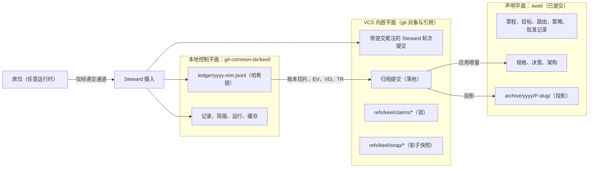
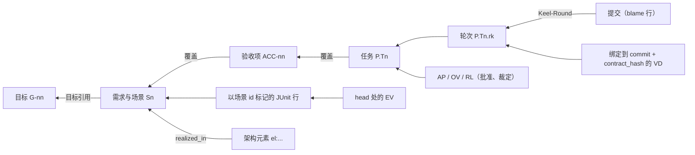

# 追踪与状态

> 英文原文（规范版本）：[04-trace-and-state.md](04-trace-and-state.md)。本文是其简体中文镜像，两者不一致时以英文版为准。

本文是 keel 中可追溯性与状态的唯一归属文档：每项事实存放在哪里、哈希链式账本（ledger）、id 方案、提交尾注（trailer）、追踪检查、RTM、落地（land）投影以及脱敏。其他文档链接到这里，而不是重复其内容。

相关的归属文档：门禁（gate）目录见 [11-verification.zh-CN.md](11-verification.zh-CN.md)（包括证据（evidence）的源状态绑定和落地时的重新执行），董事会批准见 [02-alignment.zh-CN.md](02-alignment.zh-CN.md)，批准记录能证明什么以及威胁模型见 [14-trust-security.zh-CN.md](14-trust-security.zh-CN.md)，git 与 jj 的机制见 [05-vcs.zh-CN.md](05-vcs.zh-CN.md)。将控制平面放在 git 公共目录中的决策见 [ADR-0003](adr/ADR-0003-control-plane-in-git-common-dir.zh-CN.md)。

## 三个平面

keel 将状态保存在三个平面中，每项事实恰好有一个真相存储（truth store）。凡是可以从事件计算出来的内容（提案（proposal）状态、任务状态、架构元素（element）状态、看板（dashboard）徽标）都只计算、从不存储。



| 平面 | 位置 | 保存内容 | 写入方 |
| --- | --- | --- | --- |
| 声明平面 | 仓库中的 `.keel/` | 治理文档、现行规格、已晋升的 ADR、架构模型、已提交的批准记录、已归档的投影 | 董事会（Board）的编辑（经批准并由 Steward 治理提交落入后生效）；落地归档提交；席位（seat）仅能在提案分支上写入进行中的提案文件 |
| VCS 内嵌平面 | git 提交与引用 | Steward 提交上的提交尾注、认领（claim）锁、影子快照、可选的 git notes | 仅 Steward |
| 本地控制平面 | `$(git rev-parse --git-common-dir)/keel/`（普通克隆中为 `.git/keel/`） | 账本、进行中的记录、已编译的简报（brief）、运行记录、一致性测评结果、派生缓存、锁 | 仅 Steward |

### 声明平面

声明平面即 `.keel/`，它与代码一同提交，经过 schema 校验，并像代码一样接受评审。它包含 `config.yaml`、`charter.md`、`goals.yaml`、`routing.yaml`、`policies/`、`approvals/`、`specs/`、`decisions/`、`arch/` 和 `archive/`。完整布局以及每个文件的 schema 见 [13-artifacts-schemas.zh-CN.md](13-artifacts-schemas.zh-CN.md)。

写入规则：

- 现行规格（`.keel/specs/<area>/spec.yaml`）、架构模型（`.keel/arch/`）和已晋升的 ADR（`.keel/decisions/`）只能通过落地归档提交变更。
- 治理文档（章程（charter）、目标（goal）、路由、策略）只能通过 Steward 治理提交进入主干（trunk），该提交在董事会查看差异并确认后由 `keel approve --doc <path>` 生成。
- 进行中的提案文件（`.keel/proposals/<P>-<slug>/...`）只存在于提案分支 `keel/<P>/main` 上，在规划工作树（worktree）中编写。批准绑定的是这些文件在该分支某个特定提交上的规范化 blob 哈希。
- 批准记录一经写出就会被提交（[02-alignment.zh-CN.md](02-alignment.zh-CN.md)）：某个提案的契约、计划和请求记录及其裁定提交在 `keel/<P>/main` 上（随归档提交进入主干），文档、策略和回执记录提交在主干上，落地记录则放在归档提交中。
- 任务工作树和验证工作树都是稀疏的，并排除 `/.keel/proposals/`（见 [05-vcs.zh-CN.md](05-vcs.zh-CN.md)），因此席位工作树中没有提案文件。席位只能看到自己的已编译简报或评审包（[02-alignment.zh-CN.md](02-alignment.zh-CN.md)）。

### VCS 内嵌平面

- Steward 生成的提交带有提交尾注（见下文"Steward 提交与提交尾注"一节）。
- 认领引用 `refs/keel/claims/<P>.T<n>` 是只允许创建的比较并交换（CAS）锁，只保存一个令牌。它们通过 `git update-ref <ref> <token-blob> <zero-oid>` 创建，通过 CAS 删除释放。租约与心跳状态不在引用中，而在账本中（[06-parallelism.zh-CN.md](06-parallelism.zh-CN.md)）。
- 影子快照位于 `refs/keel/snap/<P>.T<n>/` 之下。
- 账本锚点 `refs/keel/ledger/head` 指向一个保存当前链哈希的 blob（见下文“单写者”一节）。
- git notes 是可选的派生索引，默认关闭。它们从来不是真相存储。
- 使用 jj 后端时，jj 的 change id 和 operation id 与 git 事实一并记录，从不取而代之。

### 本地控制平面

控制平面是 `$(git rev-parse --git-common-dir)/keel/`。在普通克隆中即 `.git/keel/`。

```text
<git-common-dir>/keel/
  ledger/<yyyy-mm>.jsonl        canonical hash-chained event log (the only truth store for events)
  records/                      in-flight EV (cache only), VD, TR and IM records
  briefs/                       compiled briefs BR-<sha12>.md and BR-<sha12>.json
  runs/<RUN>/                   run records: argv.redacted.json, events.jsonl (typed whitelist)
  conformance/                  conformance results (see 09-runtimes.md)
  cache/index/<commit>/         derived index behind the IndexProvider port (see 07-architecture-intelligence.md)
  cache/trace.db                derived trace index (node:sqlite)
  cache/dashboard/index.html    rendered dashboard (see 08-dashboard.md)
  locks/                        O_EXCL lock files (ledger writer, worktree creation)
```

该位置的特性：

- 它由仓库的所有工作树共享，因为链接的工作树共享公共目录。
- 它对 diff 和 jj 快照不可见，`git clean -fdx` 也不会触及它。
- 它位于 Codex 的 workspace-write 可写根目录之外。然而，对于在没有操作系统级写入边界的运行时（runtime）上运行的席位，它是可写的；在原生 Windows 上，大多数运行时都属于这种情况。`keel doctor` 按运行时和操作系统报告 `control_plane_exposure`（`sandboxed` 或 `exposed`），每份回执（receipt）都携带该值。

因此，完整性依赖于哈希链、对照当前内容核对的已提交批准记录、摄入时的捕获以及落地时的重新执行，而不是依赖席位无法访问该目录。[14-trust-security.zh-CN.md](14-trust-security.zh-CN.md) 说明了其局限。

席位只能通过自己的递交通道（submit channel）写入（最终消息、MCP `keel_submit` 或运行 outbox；[ADR-0004](adr/ADR-0004-steward-commits-and-submit-channels.zh-CN.md)）。在任何内容进入账本之前，Steward 都会在摄入（ingest）时校验每一份投递。

## 哈希链式账本与单写者锁

账本是规范的事件日志：`<git-common-dir>/keel/ledger/<yyyy-mm>.jsonl`，每行一个 JSON 事件，每月一个文件。链跨越各个月份文件：每月第一个事件链接到上月最后一个事件，因此恰好只有一个链头。事件溯源式运行日志的想法来自 OpenHands。

### 事件结构

每个事件都带有相同的信封。规范结构见 [`schemas/ledger-event.schema.json`](../schemas/ledger-event.schema.json)；下面的示例仅作说明。

```json
{
  "v": 1,
  "id": "EVT-01J9Z8R2M4N6P8Q0S2T4V6W8X0",
  "prev": "<sha256 of the previous event>",
  "ts": "2026-09-22T09:42:00Z",
  "type": "result.submitted",
  "actor": {
    "kind": "seat",
    "seat": "engineer",
    "runtime": "claude-code",
    "declared_family": "anthropic",
    "alias": "anthropic-main",
    "run": "RUN-01J9Z8Q4TKXW3M5N7P2R6S8V0A"
  },
  "subject": "P-7F3K9Q.T2",
  "refs": {
    "brief": "BR-9e4c1a7b2d05",
    "pg": "PG-4d8f0b2c6a13",
    "contract_hash": "<sha256>",
    "charter_version": "1.0.0",
    "commit": null,
    "tree": null,
    "op": null
  },
  "data": { "status": "DONE", "channel": "outbox" },
  "hash": "<sha256 of this event without the hash field>"
}
```

| 字段 | 含义 |
| --- | --- |
| `v` | 账本 schema 版本。迁移以数据形式发布（[13-artifacts-schemas.zh-CN.md](13-artifacts-schemas.zh-CN.md)）。 |
| `id` | `EVT-<ulid>`。 |
| `prev` | 链中上一个事件的哈希。 |
| `ts` | RFC 3339 时间戳。 |
| `type` | 取自 schema 中联合类型的事件类型，例如 `proposal.created`、`track.decided`、`ack.recorded`、`ruling.made`、`question.asked`、`result.submitted`、`vcs.op`（Steward 做出的引用或提交变更）、`land.completed`。 |
| `actor` | 行为者：`kind`（Board、Steward 或 seat），对于席位还包括席位、运行时、声明的模型家族（declared family）、配置档别名（profile alias）和运行。模型家族是路由中经董事会批准的声明，从来不是已验证的事实。`board` 只出现在 `keel approve` 写入的事件上；单凭该字段不能让任何东西成为批准。 |
| `subject` | 事件所关于的 id（`P`、`P.Tn`、`R-...`、`el:...` 等）。 |
| `refs` | 哈希与版本绑定：简报、提示（PG）、契约哈希、章程版本、提交、树，以及启用 jj 时的 jj operation id。 |
| `data` | 类型特定的载荷，受类型化字段白名单限制（见"脱敏与字段白名单"一节）。 |
| `hash` | 对省略 `hash` 字段后的事件规范序列化计算的 sha256。规范形式由 `src/core/normalize.ts` 中的规范化规则确定，并在 M1a 中由黄金测试（golden test）固定。 |

看似可变的状态仍然是事件：认领、租约和心跳、提案的当前轨道（track）、修复轮次、门禁结果以及清理都是账本事件。`proposal.yaml` 只保存受理（intake）信号。

### 单写者

只有 Steward 追加事件，并且同一时间只有一个 Steward 进程：

1. 以独占创建（`O_EXCL`）方式获取写者锁 `<git-common-dir>/keel/locks/ledger.lock`；如果锁已存在，则等待或失败，绝不追加。
2. 读取当月文件的尾部，检查其最后一个事件的哈希是否等于账本锚点 `refs/keel/ledger/head` 所保存的链哈希；该锚点是 Steward 用 `git hash-object -w` 写入的一个 blob。锚点是每个进程的参照，包括尚未写过任何内容的新 `keel land` 进程；进程从不只凭自己对尾部的记忆行事。不一致即为 `chain-break`，追加被拒绝。
3. 以该哈希作为 `prev` 追加事件，刷新到磁盘。
4. 写入一个保存新链哈希的 blob，并以 CAS 方式把锚点更新到它（`git update-ref refs/keel/ledger/head <new-blob> <old-blob>`），然后释放锁。进程启动时，会在第一次追加之前把整条链一直验证到锚点。

锚点之所以重要，是因为单靠文件并不够：在原生 Windows 上，席位通常可以写入控制平面，而链的计算只是任何人都能延伸的无密钥 sha256。席位如果追加了一个格式正确的事件却没有移动锚点，下一次追加时的尾部检查就会失败。席位如果同时移动了锚点，就造成了一次引用变更，而 `refs/keel` 属于派生前的引用快照（[05-vcs.zh-CN.md](05-vcs.zh-CN.md)）。

摄入时的窗口检查。席位运行期间，只有负责监督它的 Steward 进程（派生它的那个 `keel run` 进程；`keel run <P> --wave` 监督一个波次中的所有运行）向账本追加。其他每一个会修改状态的动词，包括 `keel approve`，都要等待监督者锁 `<git-common-dir>/keel/locks/supervisor.lock`；没有例外，因为批准记录不再能自我验证。董事会成员在某个波次进行中运行 `keel approve` 时，会被告知哪个运行持有该锁，以及批准将在窗口结束后记录。监督进程在内存中保存自己所做追加的 id 和哈希。在每次运行的摄入阶段，席位的进程树结束之后，它逐一检查运行窗口期间追加的事件：每个事件都必须是它自己的追加。任何其他事件（包括 `approval.recorded`），以及任何对不上的锚点移动，都属于无法解释的变更：该次运行被置为 `blocked(reserved_op)`（`submit.reserved-op`），董事会会看到这些外来事件。因此，之后的进程信任的是在已验证窗口内、或在没有席位运行时追加的事件，而批准记录只有连同以这种方式追加的 `approval.recorded` 事件一起才构成权威（[02-alignment.zh-CN.md](02-alignment.zh-CN.md)）。

崩溃进程遗留的锁如何恢复属于 M1a 的实现细节。它必须遵守的规则是：不对照锚点重新验证尾部就绝不追加。

### 哈希链能证明什么

- `keel audit` 在默认检查中验证整条链。一个负对照（negative control）会修改一个事件，并且必须看到 `chain-break`。
- 每条批准记录都包含记录时的链头（`ledger_chain_head`，[02-alignment.zh-CN.md](02-alignment.zh-CN.md)）。因此，对已记录链头之前任何事件的修改，对于只重新计算其后哈希的人而言是可以被检测到的，因为已记录的链头不再出现在链中。这是一项一致性检查：连记录一起改写的写入者不会被检测到，而这样的行为者不在范围之内（[14-trust-security.zh-CN.md](14-trust-security.zh-CN.md)）。
- 单靠哈希链不能阻止拥有文件访问权限的写入者在最后一个已记录链头之后追加伪造事件。锚点和摄入时的窗口检查为席位堵住了这条路；认领状态要重新推导并交叉核对，评审结论（verdict）在摄入时捕获，落地时重新执行验收而不是信任记录（[11-verification.zh-CN.md](11-verification.zh-CN.md)）。残余局限（比运行窗口活得更久的进程）见 [14-trust-security.zh-CN.md](14-trust-security.zh-CN.md)。

在 v1 中，账本仅存在于单台机器上。其他克隆能看到已提交的批准记录和落地投影；多机协作是一项待定决策（[17-open-decisions.zh-CN.md](17-open-decisions.zh-CN.md)）。

## Id 表

这是唯一的 id 表。模式本身只存在于 [`schemas/common.schema.json`](../schemas/common.schema.json)（`$defs`）中；`src/core/ids.ts` 将它们镜像为类型。Crockford base32 使用字母表 `0-9A-HJKMNP-TV-Z`（不含 I、L、O、U）。

| Id | 形式 | 铸造方 | 示例 | 归属位置 |
| --- | --- | --- | --- | --- |
| 目标 | `G-nn` | 董事会，串行分配 | `G-03` | `.keel/goals.yaml` |
| 不变量（invariant） | `INV-nn` | 董事会，串行分配 | `INV-01` | `.keel/charter.md` |
| 章程版本 | semver 字段 `charter_version` | 董事会 | `1.0.0` | `.keel/charter.md` frontmatter |
| 需求（requirement） | `R-<area>-<5 base32>` | 产品席位，无需协调 | `R-notes-4QX7B` | `.keel/specs/<area>/spec.yaml` |
| 场景 | `R-<area>-<5>#S<n>` | 产品席位 | `R-notes-4QX7B#S1` | 在需求内部 |
| 决策 | `ADR-<5 base32>` | 架构席位或产品席位，无需协调 | `ADR-7KQ2B` | `.keel/decisions/ADR-<5>-<slug>.md` |
| 义务（obligation） | `ADR-<5>.O<n>` | 决策作者 | `ADR-7KQ2B.O1` | 该 ADR 的 `## Obligations` 列表 |
| 架构规则 | `AR-<5 base32>` | 架构席位，无需协调 | `AR-3M8QD` | `.keel/arch/rules.yaml` |
| 架构元素 | `el:<dotted.slug>` | 架构席位 | `el:notes.store` | `.keel/arch/model.yaml` |
| 提案 | `P-<6 base32>` | Steward 于受理时铸造，无需协调 | `P-7F3K9Q` | 分支 `keel/<P>/main`，之后为 `.keel/archive/` |
| 任务 | `<P>.T<n>` | 规划席位（patch 轨道上为 Steward） | `P-7F3K9Q.T2` | `workorders/T<n>.yaml` |
| 轮次 | `<P>.T<n>.r<k>` | Steward，每个递交轮次一个 | `P-7F3K9Q.T2.r1` | `Keel-Round` 提交尾注 |
| 验收项（ACC） | `<P>#ACC-nn` | 产品席位 | `P-7F3K9Q#ACC-01` | `intent.md` 的冻结区块 |
| 运行 | `RUN-<ulid>` | Steward | `RUN-01J9Z8Q4TKXW3M5N7P2R6S8V0A` | 运行记录、`Keel-Run` 提交尾注 |
| 事件 | `EVT-<ulid>` | Steward | `EVT-01J9Z8R2M4N6P8Q0S2T4V6W8X0` | 账本 |
| 内容寻址记录 | `<KIND>-<sha12>` | Steward | `EV-3a9c0e1b2d4f` | 见下一张表 |

串行 id（G、INV）由董事会逐个分配。Base32 id（R、ADR、AR、P）无需协调即可铸造，因此两个分支可能铸造出相同的 id；框定门禁（frame gate）的 id 唯一性检查和落地会检测到这种冲突。ULID 按时间排序。keel 自身的设计 ADR（`docs/adr/ADR-0001-...`）是一个独立的四位数序列，从不使用项目的 `ADR-<5>` 形式。

内容寻址记录使用同一种方案 `<KIND>-<sha12>`：记录规范化字节的 sha256 的前 12 个十六进制字符。

| 类别 | 记录 | 哈希对象 |
| --- | --- | --- |
| `BR` | 已编译简报 | 规范化的简报正文，不含运行时包装（[02-alignment.zh-CN.md](02-alignment.zh-CN.md)） |
| `PG` | 提示来源 | 组合后的席位契约、技能、运行时叠加层、档位（tier）叠加层、描述符和 keel 版本 |
| `EV` | 运行器证据 | 证据记录（[11-verification.zh-CN.md](11-verification.zh-CN.md)） |
| `VD` | 评审镜头（lens）结论 | 摄入时捕获的评审结论 |
| `TR` | 分诊记录 | 规划席位的分诊记录 |
| `IM` | 影响面（impact）记录 | 预测的或实际的影响面（[07-architecture-intelligence.zh-CN.md](07-architecture-intelligence.zh-CN.md)） |
| `AP` | 批准 | 由 `keel approve` 写出的批准记录 |
| `AM` | 修订案（amendment） | 从 git 推导出的修订案记录 |
| `OV` | 豁免（override） | 董事会豁免（waiver 也是一种豁免） |
| `RL` | 裁定（ruling） | 席位或董事会的裁定 |
| `Q` | 问题 | 一次提问 |

不是 id 的哈希（`contract_hash`、`rev_hash`、`workorder_hash`、`source_tree`、`env_fp`、链哈希）都是完整的小写 sha256 值。批准记录存储为 `.keel/approvals/<record-sha256>.<kind>.json`。

## Steward 提交与提交尾注

席位从不代表 keel 提交，也从不写提交尾注。keel 所依赖的每一个提交都由 Steward 生成（[ADR-0004](adr/ADR-0004-steward-commits-and-submit-channels.zh-CN.md)）；它如何在不触碰席位工作成果的情况下写入树，见 [05-vcs.zh-CN.md](05-vcs.zh-CN.md)。共有三种：

| 种类 | 位置 | 提交尾注 |
| --- | --- | --- |
| 轮次提交 | `keel/<P>/t/<n>`，每个递交轮次 `<P>.T<n>.r<k>` 一个 | 轮次提交尾注 |
| 治理提交 | 主干，由 `keel approve --doc <path>` 生成 | `Keel-Doc`、`Keel-Approval` |
| 归档提交 | 落地时位于 `keel/<P>/main`，随后进入主干 | `Keel-Doc`（已归档的 `receipt.md`）、`Keel-Approval`（落地批准；在按策略落地时为已批准的请求） |

轮次提交尾注：

| 提交尾注 | 值 | 可重复 |
| --- | --- | --- |
| `Keel-Round` | `<P>.T<n>.r<k>` | 否 |
| `Keel-Req` | `R-...` 或 `R-...#S<n>` | 是 |
| `Keel-Acc` | `<P>#ACC-nn` | 是 |
| `Keel-Seat` | 产生该轮次的席位 | 否 |
| `Keel-Run` | `RUN-<ulid>` | 否 |
| `Keel-Runtime` | `<runtimeId>@<version>` | 否 |
| `Keel-Brief` | 席位 ACK（复述确认）过的 `BR-<sha12>` | 否 |
| `Keel-Prompt` | `PG-<sha12>` | 否 |
| `Keel-Charter` | 章程版本（semver） | 否 |
| `Keel-Ruling` | `RL-<sha12>`，可选 | 是 |
| `Not-tested` | 自由文本，可选 | 是 |

一个示意性的轮次提交（完整示例见 [`examples/acme-notes/commit-message.txt`](../examples/acme-notes/commit-message.txt)）：

```text
notes: normalize and store note tags

Keel-Round: P-7F3K9Q.T2.r1
Keel-Req: R-notes-4QX7B#S1
Keel-Req: R-notes-4QX7B#S2
Keel-Acc: P-7F3K9Q#ACC-01
Keel-Acc: P-7F3K9Q#ACC-02
Keel-Seat: engineer
Keel-Run: RUN-01J9Z8Q4TKXW3M5N7P2R6S8V0A
Keel-Runtime: claude-code@2.1.259
Keel-Brief: BR-9e4c1a7b2d05
Keel-Prompt: PG-4d8f0b2c6a13
Keel-Charter: 1.0.0
Keel-Ruling: RL-2c7e9a4b6d18
Not-tested: Concurrent addTag calls on the same note (the store is single-writer).
```

在 JSON 记录中，多值提交尾注是数组（`schemas/common.schema.json#/$defs/trailers`）；在提交消息中则是重复的行。keel 通过 `Vcs.trailers.read` 读取提交尾注（在 git 后端上为 `git interpret-trailers --parse`）。这一想法的来源是 oh-my-claudecode（决策提交尾注）和 jj（为每个变更绑定一个稳定的 id）。

其他规则：

- 席位自行生成的提交可以容忍但不被信任：Steward 将其保存在 `refs/keel/snap/<P>.T<n>/seat-<n>` 下，并生成自己的轮次提交（[05-vcs.zh-CN.md](05-vcs.zh-CN.md)）。
- 可选的 `commit-msg` 钩子（M2）仅为交互式的人工会话添加提交尾注。Steward 从不依赖钩子。
- 使用 jj 后端时，轮次的 jj change id 和 operation id 与 `Keel-Round` 一起记录在该轮次的账本事件中。

## 追踪检查的范围与起点

追踪检查把每一个行为都关联回意图（KP-05）。它作为落地门禁的 `trace` 检查运行（[11-verification.zh-CN.md](11-verification.zh-CN.md)），也在 `keel audit` 中运行。

范围与起点：

- 落地时，检查覆盖提案的 `merge-base(trunk, keel/<P>/main)..tip`。
- `keel audit` 和 `keel trace --matrix` 覆盖 `trace.since` 之后的主干历史。
- `.keel/config.yaml` 中的 `trace.since` 是起点（epoch），由 `keel init` 设置为采用 keel 时的主干末端。起点之前的历史从不被猜测，也从不导致检查失败。

在范围内，每个提交都必须是上述三种 Steward 提交之一。其他任何提交都是 `untraced-commit`。起点之后的人工提交需通过以下两种方式之一显式接纳：

- 通过 patch 轨道，使该变更获得一个提案、一个轮次和提交尾注；或
- 通过已批准的 `keel approve <commit> --rule override --note "..."`，它将该提交及理由记录在一条 `OV` 记录中。

对范围内的每个需求，遍历路径如下：



`keel trace <file:line|symbol|commit|R-...|G-...|P-...|el:...>` 从任意节点出发遍历同一张图：

1. blame（`git blame`，jj 后端上为 `jj file annotate`；verify by probe（需通过探测验证））给出提交；
2. 提交尾注给出轮次、任务、ACC 和需求，进而给出目标；
3. 账本记录给出证据、评审结论、批准和裁定；
4. 路径提升（path lift）给出架构元素、其所有者、义务和规则（[07-architecture-intelligence.zh-CN.md](07-architecture-intelligence.zh-CN.md)）。

示意输出（格式在 M1b 中确定）：

```text
$ keel trace src/store/tags.ts:42
line      src/store/tags.ts:42  commit 3f1c2e9  round P-7F3K9Q.T2.r1
seat      engineer  runtime claude-code@2.1.259  family anthropic (declared)  brief BR-9e4c1a7b2d05
task      P-7F3K9Q.T2  covers P-7F3K9Q#ACC-01, P-7F3K9Q#ACC-02, R-notes-4QX7B#S1, R-notes-4QX7B#S2
goal      G-03 (via R-notes-4QX7B)
evidence  EV-3a9c0e1b2d4f  pass  source state matches head
verdict   VD-5b1d2e3f4a6c  approve  lens blind-diff  family google (declared)
approval  contract AP-2d9e4f6a8b0c, land AP-7a1c3e5f9b2d
element   el:notes.store  owner storage  rules AR-3M8QD (proven)
```

`trace.db`（`node:sqlite`，自 Node 22.13 起无需标志即可使用；其稳定性状态 verify by probe）是用于快速查询的派生索引。`keel audit --rebuild` 从零构建它，并通过集合差比较增量构建与完整重建的结果，这一想法取自 codegraph。M1b 的追踪检查不依赖它运行。

## RTM 与漂移类别

`keel trace --matrix` 打印需求追踪矩阵（RTM）：范围内每个需求和场景各占一行，列出目标、ACC、任务、轮次、提交、已标记的测试、head 处的证据、评审结论以及实现它的架构元素。缺口单元格总是带有文字标签（例如 `no evidence at head`），从不只用颜色表示。目标进度等于在 head 处已验证的需求数除以总数，并且分母始终显示。

追踪漂移（drift）类别：

| 类别 | 含义 | 后果 |
| --- | --- | --- |
| `untraced-commit` | 范围内不是 Steward 轮次、治理或归档提交的提交 | 追踪检查失败 |
| `orphan-task` | 不覆盖其提案中任何 ACC 或需求的任务 | 追踪检查失败 |
| `uncovered-requirement` | 范围内没有任何 ACC 覆盖的需求 | 追踪检查失败 |
| `unverified-requirement` | 已被覆盖、但在 head 处没有通过的证据的需求 | 追踪检查失败 |
| `stale-evidence` | 匹配字段与当前源状态不同的证据 | 追踪检查失败；重新运行该证据 |
| `stale-verdict` | 绑定到其他提交或契约哈希的评审结论 | 追踪检查失败；重新运行该评审镜头 |
| `realization-mismatch` | 覆盖提交所触及的架构元素与该需求的 `realized_in` 不同 | 追踪检查失败；与架构漂移共用 |
| `citation-drift` | ADR 的符号引用或锚点不再与代码匹配 | 该决策的接受状态失效，直至重新接受 |
| `charter-lag` | 带有较旧 `charter_version` 标记的产物 | 框定门禁标记 MAJOR 或 MINOR 滞后 |
| `missing-approval` | 没有有效批准的治理文档或检查点（checkpoint）：没有记录、没有 `approval.recorded` 事件、主题不匹配、某个被绑定产物的当前哈希与记录不同、有取代它的修订案，或已过期 | 派发或落地拒绝执行；该事项连同所展示的变更一起返回董事会 |
| `unacknowledged-receipt` | 董事会尚未确认其回执的按策略落地 | 阻塞下一个触及相同架构元素的变更；未映射时则阻塞触及相同路径 glob 的变更 |
| `chain-break` | 账本链无法验证 | 成为董事会事项；所记录链头不在已验证链上的批准均失败 |

前七个是会导致追踪检查失败的类别。对门禁的后果汇总在 [11-verification.zh-CN.md](11-verification.zh-CN.md) 中；架构漂移类别见 [07-architecture-intelligence.zh-CN.md](07-architecture-intelligence.zh-CN.md)。

## 落地投影与投影门禁

落地时，Steward 在 `keel/<P>/main` 上写入一个归档提交（它如何进入主干见 [05-vcs.zh-CN.md](05-vcs.zh-CN.md)）。该归档提交：

- 将 `spec.delta.yaml` 应用到现行规格，将 `arch.delta.yaml` 应用到架构模型；
- 将已接受的提案 ADR 晋升到 `.keel/decisions/`；
- 向 `.keel/arch/series.jsonl` 追加一个序列点（[07-architecture-intelligence.zh-CN.md](07-architecture-intelligence.zh-CN.md)）；
- 将落地批准记录提交到 `.keel/approvals/` 下；
- 将提案文件夹移动到 `.keel/archive/<yyyy>/<P>-<slug>/`，并在其旁写入投影。

```text
.keel/archive/<yyyy>/<P>-<slug>/
  proposal.yaml, intent.md, spec.delta.yaml, arch.delta.yaml, plan.yaml, workorders/, routing.snapshot.yaml
  ledger.slice.jsonl     the proposal's ledger events
  evidence/              EV-<sha12>.json
  verdicts/              VD-<sha12>.json
  triage/                TR-<sha12>.json
  reports/               impact, drift and trace reports
  receipt.json           machine-readable receipt
  receipt.md             the receipt the Board read and approved
```

投影规则：

- 它们是持久、可共享的历史，但从不被当作可信输入。批准从 `.keel/approvals/` 和账本重新核对，证据重新执行，从不从归档中读回。
- `receipt.md` 在落地批准之后从不修改。已批准的草稿写明集成提交和预期的主干末端；落地后的 sha 写入 `land.completed` 账本事件，从而避免回执需要写明自身所在的提交。
- 归档提交只触及 `.keel/**`，而源树哈希排除 `.keel/**`（[05-vcs.zh-CN.md](05-vcs.zh-CN.md)），因此写入它不会使在集成提交上获取的证据失效。

投影门禁是落地门禁的 `projection` 检查。在写入归档提交之前，它扫描每个投影文件，拒绝除文档化占位符（带或不带 `/v1` 的 `https://provider.example.invalid`、回环 URL `http://127.0.0.1:<port>`、假密钥 `sk-fake-keel-*`）之外的任何形似 URL 或形似密钥的令牌。一次拒绝会阻塞落地，并指出文件和行号，但从不输出令牌本身。

## 脱敏与字段白名单

模型提供方（provider）的值只在派生子进程时和直连通道调用时存在于 keel 的进程内存中，从不写出，因此设计从一开始就让这些值不进入记录，而不是事后脱敏（[10-providers.zh-CN.md](10-providers.zh-CN.md)）：

- 记录只保存环境变量名称、配置档别名和 `${ENV:NAME}` 占位符。
- `argv.redacted.json` 保留 `${ENV:NAME}` 占位符。没有任何路由会把模型名称、URL 或密钥放入 argv。
- 子进程的 stdout 和 stderr 流在到达时即在内存中解析为规范事件。keel 从不把原始流写入磁盘，因为它带有运行时报告的模型名称，以及运行时和模型提供方的自由文本错误正文，而这些正文常常嵌有端点 URL。
- 持久化的流数据要经过类型化字段白名单：只允许带类型化字段的规范事件类型。来自模型提供方或运行时错误正文的自由文本不会被持久化；运行时报告的模型字段会被丢弃，除非在路由中设置了 `record_model_names`（默认 `false`）。[10-providers.zh-CN.md](10-providers.zh-CN.md) 中可选的相同/不同模型检查只在内存中比较 id。
- 管道测试回放 `test/fixtures/` 中录制的输出流，这些输出流针对回环假服务编写，只含假值；不会从任何用户的运行中捕获内容。
- `{workspace_root}/_runs/*/raw/` 列在每个会运行工具的描述符的模型提供方路径集合中，因此其他工具留在那里的任何捕获都算作模型提供方路径，并受生成的禁读规则覆盖。
- 路径拒绝列表（凭据文件名、`.env*`、运行时描述符中的模型提供方路径集合）在任何写入之前生效，也在对席位工作树执行任何 `git add` 之前生效（[05-vcs.zh-CN.md](05-vcs.zh-CN.md)）。
- 投影门禁在落地时生效。

| 数据 | 存储位置 | 是否持久化 | 过滤 |
| --- | --- | --- | --- |
| 原始运行时流 | 仅在负责监督的 Steward 进程的内存中 | 否，从不写入 | 在内存中解析；从不投影 |
| 规范运行事件 | `<git-common-dir>/keel/runs/<RUN>/events.jsonl` | 是，本地 | 类型化字段白名单 |
| 启动参数 | `<git-common-dir>/keel/runs/<RUN>/argv.redacted.json` | 是，本地 | `${ENV:NAME}` 占位符 |
| 账本事件 | `<git-common-dir>/keel/ledger/` | 是，本地 | 类型化字段白名单、路径拒绝列表 |
| 归档投影 | `.keel/archive/` | 是，已提交 | 投影门禁 |

账本 schema 带有版本（`v`），迁移以数据形式发布，从不对旧事件做临时改写。
