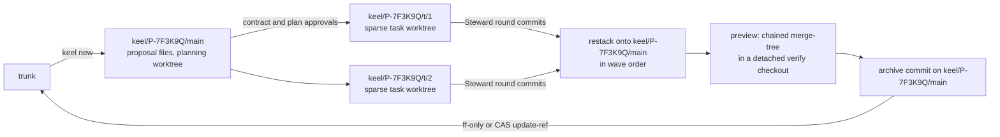
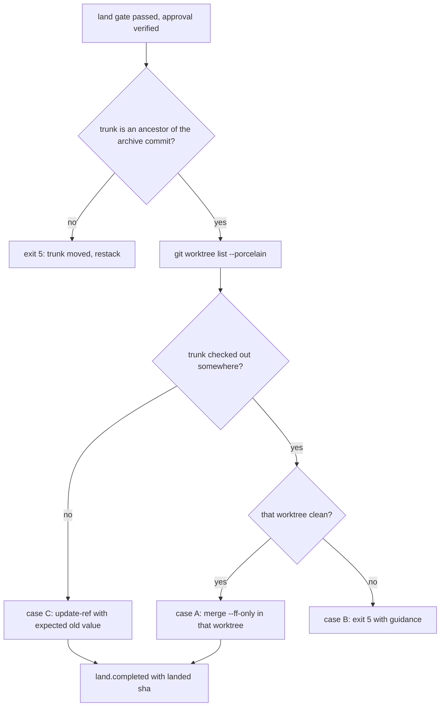

# Version control: git primary, jj optional

git is keel's primary version control system and is fully sufficient: every guarantee in this document is
specified in git primitives (D4, KP-09, [ADR-0001](adr/ADR-0001-git-primary-jj-optional.md)). jj is an
optional enhancement behind the same interface, delivered in M7. Turning jj off mid-project loses nothing.

This document is the home of the VCS mechanics: the `Vcs` interface, ref naming, worktrees, Steward
commits, the land cases, reserved-operation detection and jj parity. What the commits and trailers mean
for traceability is in [04-trace-and-state.md](04-trace-and-state.md); how waves and the integration queue
use these primitives is in [06-parallelism.md](06-parallelism.md); gates are catalogued in
[11-verification.md](11-verification.md).

## The Vcs interface

Both backends implement `src/vcs/vcs.ts`. The Steward never calls git or jj outside this interface.

| Method | Purpose | GitBackend | JjBackend adds |
| --- | --- | --- | --- |
| `detect` | Choose the backend; report versions, feature probes and hazards | `git --version`, feature probes, ref-conflict scan | jj version and colocation, LFS/submodule/filter hazards |
| `workspace.create`, `list`, `remove` | Locked, sparse worktrees for planning, tasks and verification | `git worktree add --lock --reason ...` plus `sparse-checkout set --no-cone` | jj workspaces only once `--colocate` ships |
| `snapshot` | Shadow snapshot of a seat's files at the Steward-side triggers below | Temporary-index tree, commit under `refs/keel/snap/` | Nothing for git worktrees; `jj util snapshot` only for jj workspaces, once they are allowed |
| `refSnapshot`, `refDiff` | Reserved-operation detection | `for-each-ref`, worktree HEADs, reflog tails | The op log as an extra source |
| `remoteSnapshot` | Push detection | `git ls-remote` of each configured remote | Same |
| `diffNames` | Changed paths for scope, impact and the ratchet | `git diff --name-only -z <a> <b>` | Same |
| `sourceTreeHash` | Hash of the source tree without `.keel/**` | `git ls-tree -r -z --full-tree <commit>`, filtered in-process | Same |
| `commitTree` | Steward commit with trailers | Temporary index, `commit-tree`, CAS `update-ref` | jj change id recorded alongside |
| `trailers.read` | Parse trailers | `git interpret-trailers --parse` | Same |
| `claims.acquire`, `release` | Create-only CAS lock refs | `update-ref <ref> <blob> <zero-oid>`, `update-ref -d <ref> <blob>` | Same (plain git refs) |
| `previewIntegration` | Throwaway integration of submitted tips | Chained `merge-tree --write-tree` plus `commit-tree` | Megamerge preview |
| `restack` | Replay commits onto a new base | Worktree-free replay (below) | `jj rebase -s ... -o ...` |
| `land(expectedOld, new)` | Move trunk | ff-only or CAS `update-ref` (three cases) | Bookmark set after the same checks |
| `annotate` | Line to commit, for `keel trace` | `git blame --porcelain` | `jj file annotate` |

### Source tree hash

`sourceTreeHash(commit)` is the sha256 of the NUL-separated output of
`git ls-tree -r -z --full-tree <commit>`, after every entry under `.keel/` has been removed in-process.
Because it hashes blob ids, it does not depend on the checkout's line endings. The evidence binding that
consumes it is defined in [11-verification.md](11-verification.md).

Any glob-scoped hash (for example over a work order's `write_set`) uses keel's own glob matcher over the
same listing. keel never passes globs to `git ls-tree`: it treats pathspecs as literal prefixes and rejects
glob magic, so a glob scope would hash an empty listing and never change. A scope that matches zero paths
is an error, and a negative control checks it.

### Backend selection

`vcs.backend` in the Board-owned `.keel/config.yaml` is `auto`, `git` or `jj`. `keel init` copies
`templates/project/config.yaml`, which writes `backend: auto` together with `jj_opt_in: false` (the same
values as `config/keel.defaults.yaml`); `--vcs git` or `--vcs jj` writes that value instead. While
`jj_opt_in` is `false`, `auto` behaves exactly like `git`. `git` never uses jj. keel uses JjBackend only when
the backend is `auto` or `jj` and all of these hold:

- jj ≥0.45.1, feature-probed;
- the repository is colocated (`.jj/` and `.git/` share the working copy);
- no git LFS, no submodules and no clean/smudge filters;
- the Board opted in (`jj_opt_in: true`).

With `auto`, a failed condition means GitBackend, and `keel doctor --section vcs` names the condition. With
`jj`, a failed condition is an environment error (exit 6). There is never a silent switch: every run record
and receipt names the backend it used.

`keel doctor --section vcs` feature-probes a git floor of 2.38 (`merge-tree --write-tree` and `--name-only`
need 2.38; `worktree add --lock --reason` needs 2.35) and runs the ref-conflict check below.

## Branch naming (no nesting)

A git ref cannot be both a file and a directory: once `refs/heads/keel/P-7F3K9Q` exists,
`refs/heads/keel/P-7F3K9Q/T1` cannot be created. keel therefore never nests a branch under another branch.

| Ref or path | Kind | Created by | Removed |
| --- | --- | --- | --- |
| `refs/heads/keel/<P>/main` | Proposal branch: proposal files, integration, archive commit | `keel new` | Cleanup at close |
| `refs/heads/keel/<P>/t/<n>` | Task branch for `<P>.T<n>`, holds round commits | `keel run` | Cleanup at close |
| `refs/keel/claims/<P>.T<n>` | Claim lock, a blob holding only a token ([06-parallelism.md](06-parallelism.md)) | `keel run` | CAS delete on release |
| `refs/keel/snap/<P>.T<n>/<seq>` | Shadow snapshots at the Steward-side triggers | Steward | Cleanup at close |
| `refs/keel/snap/<P>.T<n>/seat-<n>` | Commits a seat made itself, preserved | Steward at ingest | Cleanup at close |
| `refs/keel/ledger/head` | Ledger anchor: a blob holding the current chain hash, CAS-updated after every append ([04-trace-and-state.md](04-trace-and-state.md)) | Steward | Never |
| `<workspace_root>/<P>.plan` | Planning worktree, full checkout of `keel/<P>/main` | `keel new` | After plan approval (re-creatable) |
| `<workspace_root>/<P>.T<n>` | Task worktree, sparse | `keel run` | Cleanup at close |
| `<workspace_root>/_verify/<sha7>` | Detached verify or index checkout, sparse | Steward | After the check |
| `<workspace_root>/_runs/<RUN>/` | Run inputs and outbox (not a worktree). keel never writes the raw runtime stream to disk ([04-trace-and-state.md](04-trace-and-state.md)) | `keel run` | Cleanup at close |

The default `workspace_root` is `../<repo>.ws/`, outside the repository, so no scratch or keel state lives
inside a working tree. Cleanup at close removes only worktrees and refs with keel provenance (an idea from
superpowers).

`keel doctor --section vcs` and `keel doctor --selftest` check for directory/file conflicts: any existing
ref that would block keel's names, such as a branch named `keel` or `keel/<P>`. The M1a exit includes a
negative control where a nested name is rejected.



## Sparse worktrees and Steward commits

### Creating worktrees

Worktrees are created one at a time, under the lock `<git-common-dir>/keel/locks/worktree.lock`. keel
spawns git with an argv array and no shell, so the patterns below reach git literally.

Task worktree:

```text
git worktree add --lock --reason keel:<P>.T<n>:<RUN> -b keel/<P>/t/<n> <ws> <base>
git -C <ws> sparse-checkout set --no-cone '/*' '!/.keel/proposals/'
git -C <ws> config --worktree remote.<name>.pushurl https://push-disabled.invalid/
```

- `<base>` is the base recorded at dispatch ([06-parallelism.md](06-parallelism.md)).
- The sparse pattern keeps everything except `/.keel/proposals/`, so proposal files are absent from seat
  worktrees ([02-alignment.md](02-alignment.md)). No seat is spawned before the sparse checkout is set.
- The per-worktree `pushurl` (one line per configured remote) is part of the env hardening in "Reserved
  operations" below. It needs `extensions.worktreeConfig`, which keel enables once at init; that setting
  may raise `core.repositoryformatversion` to 1, which some older tools cannot read (verify by probe;
  doctor reports it).

Verify or index checkout, used for evidence, lenses and indexing:

```text
git worktree add --detach <workspace_root>/_verify/<sha7> <commit>
git -C <workspace_root>/_verify/<sha7> sparse-checkout set --no-cone '/*' '!/.keel/proposals/'
```

Planning worktree: `<workspace_root>/<P>.plan` checks out `keel/<P>/main` in full, because the product,
architect and planner seats author proposal files there. It is removed after plan approval and can be
re-created, so restacking `keel/<P>/main` never moves a branch that is checked out.

### The Steward commit at submit

Seats never commit on keel's behalf ([ADR-0004](adr/ADR-0004-steward-commits-and-submit-channels.md)). When
it ingests a submit, the Steward first commits the worktree's files as they are, as round `<P>.T<n>.r<k>`, and
then runs the submit gate on that round commit ([11-verification.md](11-verification.md)). Every submitted
round therefore has a commit, whether its submit gate passes or not: a round that fails stays on
`keel/<P>/t/<n>` as history, never enters verification or the integration queue, and the fix round builds on
it. The one check that runs before the commit is the name-only provider path listing (step 1 below); a hit
fails the round with `submit.provider-path-events` and nothing is staged or committed.

```text
git -C <ws> status --porcelain -z --untracked-files=all         1. names only; keel matches them against the provider path set
git -C <ws> rev-parse --git-path index                          -> <ws-index>
copy <ws-index> to <run>/index.tmp
GIT_INDEX_FILE=<run>/index.tmp git -C <ws> add -A -- . <excludes>   stage the worktree files into the copy
GIT_INDEX_FILE=<run>/index.tmp git -C <ws> write-tree           -> <tree>
git -C <ws> commit-tree <tree> -p <tip> -F <run>/message.txt    -> <commit>   (message carries the trailers)
git update-ref refs/heads/keel/<P>/t/<n> <commit> <current>     CAS
git -C <ws> read-tree HEAD                                      refresh the worktree index
```

- Step 1 lists changed and untracked paths by name only (`-z`, parsed in-process; no file is opened). If any
  path matches the provider path set of the run's runtime descriptor, `.env` or `.env.*`, or a credential
  basename from those sets (for example `.credentials.json`, `auth.json`, `gateway.json`), matched with keel's
  own glob matcher, the Steward stages nothing, fails the round with `submit.provider-path-events` and names
  the path (never its content) for the Board. keel's own git child therefore never reads such a file, hashes
  it into a blob or persists it under any ref. A file the repository ignores is neither listed nor staged,
  so it never becomes a blob either.
- `<excludes>` are exclude pathspecs for the same patterns, for example `':(exclude,glob)**/.env'`,
  `':(exclude,glob)**/.env.*'` and one entry per credential basename, passed on every `add -A` (snapshots and
  round commits alike). They are the backstop for a file created between the listing and the staging. The
  pathspec magic on the git floor is verify by probe; the hazard suite carries the negative control that a
  seat-created `.env` never becomes a blob.
- `GIT_INDEX_FILE` is set in the child environment by keel; no shell syntax is involved.
- The temporary index starts as a copy of the worktree's own index, so the entries excluded by the sparse
  checkout keep their skip-worktree bits and stay in the tree instead of being recorded as deletions
  (verify by probe on the git floor; the hazard suite covers it). The submit gate's protected-path check is
  the backstop: a round that deletes `.keel/**` fails.
- `<tip>` is the task branch tip recorded before the run. `<current>` is the branch's value now. They are
  equal unless the seat committed.
- If the seat made commits on its own task branch (a fast-forward from `<tip>`), the Steward first preserves
  `<current>` under `refs/keel/snap/<P>.T<n>/seat-<n>`, then builds its round commit on `<tip>`. This is the
  one seat-made ref change the reserved-operation diff expects.
- `read-tree HEAD` makes the worktree's index match the new HEAD; the files already equal it. The refresh
  must keep the skip-worktree bits of the excluded paths. Whether plain `read-tree HEAD` keeps them, or a
  `git -C <ws> sparse-checkout reapply` must follow, is verify by probe.

### Snapshots between turns

The Steward takes shadow snapshots with the same temporary-index technique: the name-only listing of step 1
above, then copy the index, `add -A -- . <excludes>`, `write-tree`, `commit-tree -p <tip>`, then create
`refs/keel/snap/<P>.T<n>/<seq>` with a zero expected old value. It never touches the seat's index or branch.
A provider-path hit in the listing skips the snapshot and fails the run with `submit.provider-path-events`.
Snapshots preserve the patch when an `intent_gap` returns a proposal to framing, and they let the Steward
detect edits made before a matching ACK, which void the run ([02-alignment.md](02-alignment.md)).

A headless run has no turns that keel controls (`codex exec`, `opencode run`, `qwen -p` and `kimi -p` run to
completion on their own), so snapshots are triggered by Steward-side events, never by the runtime:

| Trigger | When | Applies to |
| --- | --- | --- |
| Pre-spawn base | Before the spawn: the task tip and its tree are recorded | Every run |
| Stream boundary | At each parsed `tool_use` or `tool_result` event of the stream, after the event is read | Runtimes that stream (every rung except D) |
| ACK ingest | Synchronously when the ACK drop is ingested: the Steward watches the run outbox and receives the MCP `keel_submit` call, and takes the snapshot before it answers or validates the ACK | Seats that ACK through the outbox or MCP |
| Pre-run ACK | The read-only pre-run ends before the main run is spawned, so the worktree still equals the pre-spawn base | Seats that ACK through a pre-run's final message |
| Submit ingest | The round commit above | Every run |

The ACK-ordering check compares the tree of the ACK-ingest snapshot with the pre-spawn base tree; the run
directory lies outside the worktree and never takes part. Any difference means edits before a matching ACK
and voids the run. This is detection, not prevention, and its limits are stated per rung in section 6 of
[09-runtimes.md](09-runtimes.md): an edit made and reverted before the ACK is invisible, and a write that
races the ACK drop can fall on either side of the snapshot.

### Integration preview and restack

The integration queue ([06-parallelism.md](06-parallelism.md)) uses two primitives.

`previewIntegration` merges all submitted tips into a throwaway commit, without any worktree:

```text
acc := keel/<P>/main                      (already restacked onto trunk)
for each submitted tip, in wave order:
  git merge-tree --write-tree --name-only <acc> <tip>
      exit 0 -> first line is <tree>
      exit 1 -> conflict; the listed paths become a resolution task
  git commit-tree <tree> -p <acc> -p <tip> -m "keel preview"   -> new <acc>
```

The final `<acc>` is checked out detached in a verify worktree, where integration tests and drift run. A red
preview is bisected by dropping tips. keel never resolves a conflict with `-X ours` or `-X theirs`; a
conflict is always a task. The preview commits are unreferenced and left to git's normal pruning.

`restack` replays commits onto a new base: first `keel/<P>/main` onto the current trunk tip, then each task's
round commits onto `keel/<P>/main` in wave order. Each replayed commit keeps its message and trailers, so
the trace survives; the ledger records the old and new commit ids. The worktree-free replay is
`git merge-tree --write-tree --merge-base <parent> <onto> <commit>` followed by
`git commit-tree <tree> -p <onto>` and a CAS `update-ref`. `--merge-base` needs a newer git than the 2.38
floor (verify by probe); where the probe fails, keel replays with `git cherry-pick` in a temporary detached
worktree under `_verify/`. Evidence survives a restack only when its source state is unchanged
([11-verification.md](11-verification.md)).

## Three land cases

Land happens after the land gate passes and the land approval (or, on a policy land, the approved land policy
and request) is verified ([11-verification.md](11-verification.md)). The archive commit is the new trunk tip.

1. Ancestry: `git merge-base --is-ancestor <trunk> <archive>`. If trunk is not an ancestor, trunk moved:
   exit 5, restack and land again.
2. `git worktree list --porcelain` shows which worktree, if any, has trunk checked out.
3. Exactly one of three cases applies:

| Case | Condition | Action |
| --- | --- | --- |
| A | A worktree has trunk checked out and is clean (`git -C <wt> status --porcelain --untracked-files=no` is empty) | `git -C <wt> merge --ff-only <archive>`, which moves the branch, index and files together and fails if trunk moved (a CAS) |
| B | A worktree has trunk checked out and is dirty | Refuse with exit 5 and guidance: commit, stash or switch that worktree, then run `keel land <P>` again |
| C | No worktree has trunk checked out | `git update-ref refs/heads/<trunk> <archive> <expected-old>` (a CAS) |

4. The Steward appends `land.completed` with the landed sha ([04-trace-and-state.md](04-trace-and-state.md)).



Why not always `update-ref`: moving a checked-out branch with `update-ref` leaves that worktree's index and
files at the old commit, so `git status` there shows the land reversed, and a later commit from that
worktree silently reverts it.

Pushing to a shared remote is a reserved action. The Board pushes; keel does not.
[14-trust-security.md](14-trust-security.md) recommends server-side branch protection.

## Reserved operations: ref snapshots, ls-remote, env hardening

Reserved operations are the actions only the Board may take, such as pushing, moving or deleting refs,
rewriting history, and jj `undo`, `op restore` or `--ignore-immutable`. The canonical list is
[`org/reserved-actions.yaml`](../org/reserved-actions.yaml); seat contracts refer to it
([01-org-model.md](01-org-model.md)). On plain git, detection is the guarantee and prevention is
best-effort.

### Detection (the guarantee)

Before each spawn the Steward records a ref snapshot:

```text
refs      git for-each-ref --format=%(refname)%00%(objectname) refs/heads refs/tags refs/remotes refs/keel
heads     git worktree list --porcelain            HEAD and branch of every worktree
reflogs   git reflog show -n <k> <ref>             newest entries of each HEAD and branch reflog
remotes   git ls-remote <remote>                   each configured remote, read-only
```

- The ref, HEAD and reflog parts are diffed at ingest and at land. A change is explained only when the
  Steward recorded it as a `vcs.op` ledger event, when it is a seat commit fast-forwarding the seat's own
  task branch (preserved as above), or when it is a move of the ledger anchor `refs/keel/ledger/head` that
  matches the appends the supervising Steward process made itself
  ([04-trace-and-state.md](04-trace-and-state.md)). Any other change sets `blocked(reserved_op)` and
  becomes a Board item.
- `git ls-remote` runs before and after each run. A remote ref that changed is `blocked(reserved_op)`. If a
  remote cannot be reached, the check reports `unknown`, never `pass`.
- Detection cannot tell who moved a ref. A ref the Board moves by hand during a run is flagged like any
  other; the Board clears it with an approved override (`keel approve <RUN> --rule override`). With parallel
  runs, an unexplained change is attributed to every run whose window covers it.
- With JjBackend, the op log is an extra detection source.

This is what makes "every guarantee holds on plain git" true: detection needs no hooks, no shims and no
jj.

### Prevention (best-effort)

- Generated per-runtime permission rules, and PreToolUse guards where hooks exist
  ([09-runtimes.md](09-runtimes.md)).
- Seat env hardening, applied to every spawned seat:

| Setting | Effect |
| --- | --- |
| `GIT_CONFIG_COUNT`, `GIT_CONFIG_KEY_<i>=credential.helper`, `GIT_CONFIG_VALUE_<i>=` (empty) | An empty helper value resets the helper list, so git in the seat cannot use stored credentials. Git for Windows' default credential manager would otherwise authenticate HTTPS pushes silently. |
| `GIT_TERMINAL_PROMPT=0` | git never prompts for credentials. |
| `GCM_INTERACTIVE=never` | Git Credential Manager never opens a prompt. |
| Per-worktree `remote.<name>.pushurl` set to `https://push-disabled.invalid/` (needs `extensions.worktreeConfig`) | A plain `git push` from the worktree goes to an unresolvable host. `pushurl` is multi-valued and git pushes to every value, so if the repository config already sets a `pushurl` for that remote the hardening is ineffective, and doctor reports it (verify by probe). |

- Advisory shims, shipped in M2 (the M0 design describes them only): an extensionless `sh` script, a
  `git.cmd` and a `git.ps1`, and the same three for `jj`, placed first on the seat's PATH. All three are
  needed because Git Bash does not run a `.cmd` by bare name, and cmd.exe and PowerShell do not run an
  extensionless script. Node and Rust spawns never use a `.cmd` shim, so a runtime that spawns git directly
  bypasses the shims. `keel doctor` reports shim coverage per runtime shell.

Known gap: a push to a URL that is not a configured remote, using the seat's own credentials, is neither
prevented nor detected, because `ls-remote` only watches configured remotes. Server-side branch protection
is the mitigation ([14-trust-security.md](14-trust-security.md)).

## Prevent-vs-detect table

Detection is the same on every runtime and rung: the ref snapshot diff at ingest and land, `ls-remote`
before and after each run, and the op log with jj. Prevention differs per runtime. Every prevention entry
below is verify by probe; `keel doctor --section exposure` reports what was verified on this machine. The
rung-level table for all guarantees (not only reserved VCS operations) is in section 6 of
[09-runtimes.md](09-runtimes.md), and the per-runtime permission details are in its section 5.

| Runtime | Rung | Prevention of reserved VCS operations (best-effort) | Main weakness |
| --- | --- | --- | --- |
| claude-code | A | Per-run `--settings` deny rules for git commands; PreToolUse guard through `keel hook` (exit 2 blocks); plan mode for read-only seats; env hardening; the `sh` shim covers its Git Bash tool | Bash deny patterns are easy to evade; no OS sandbox on native Windows |
| codex | C until the hook probe passes, then A | `-s read-only` for read-only seats; `-s workspace-write` limits writes to the worktree and run directory, which excludes refs and objects in the common git directory where the sandbox is enforced; network off by default in workspace-write | Windows sandbox mode and whether the hardening variables reach the tool shell (`shell_environment_policy`) are verify by probe |
| gemini-cli | B once the `--policy` probe passes | Reviewer seats only until then, in `--approval-mode plan`; per-run `--policy` deny rules; BeforeTool hook in trusted folders only | Untrusted folders skip hooks; policy file behaviour unverified |
| qwen-code | C until the hook probe passes, then A | `--approval-mode plan` or `auto-edit`, `--allowed-tools` and tool exclusions; env hardening | Hooks come only from a printed snippet and folder trust applies |
| kimi-code | D until verified | None in headless mode: `-p` runs under the `auto` permission policy (bypass-equivalent). At rung D a human runs the seat and `keel api` | Hooks are user-global only |
| opencode | C | Per-run agent permission blocks with deny rules; env hardening | No hooks used; enforcement at ingest, submit and land |
| direct | n/a | Tool-less lane: no shell, no VCS access | None for VCS |

## JjBackend enhancements and parity table

JjBackend is opt-in (M7) and adds, never replaces. The ideas come from jj itself and from CodeAlive's
jj-agentic-workflow (integrator as the sole trunk writer, serialized workspaces, a hazard list). jj is
pre-1.0 and changes its CLI between minor versions, so every command here is verify by probe against the
installed version.

- jj change ids are recorded next to `Keel-Round`.
- Operations run with `operation.username=keel/<seat>/<run>`, so the op log attributes every operation.
- The op log and evolog are exported (`keel audit --export-vcs`), and the op log is an extra source for
  reserved-operation detection: an operation not made under a keel username is unexplained.
- Restack uses `jj rebase -s 'roots(trunk()..tip)' -o 'trunk()'` (`-o/--onto` replaced `-d` in jj 0.44).
  Revisions in `conflicts() & mutable()` become resolution tasks.
- `jj util snapshot` snapshots jj workspaces, once they are allowed. Seats work in git worktrees until
  then, and jj does not track those, so the temporary-index snapshot stays the mechanism for git worktrees
  under both backends.
- `jj run --ignore-changes` runs per-revision checks without rewriting revisions.
- A megamerge (one merge commit over all submitted tips) is the integration preview.
- Policy revsets express which revisions seats may touch.

Agent workspaces stay git worktrees, because agent CLIs expect a git checkout, until
`jj workspace add --colocate` ships. It is unreleased as of jj 0.45.1 and is feature-detected; when it
ships it colocates by default if `git.colocate` is true, and the unreleased version requires git 2.42 or
later for `jj workspace add`. A runtime descriptor may instead declare `git_required: false`. Workspace
creation is serialized under a keel lock (jj issue #9314). Dashboard reads use `--ignore-working-copy` so
that reading never snapshots a working copy.

| Concern | git | jj adds |
| --- | --- | --- |
| Identity | `Keel-Round` trailer | + change id |
| Reserved-operation detection | Ref snapshot + `ls-remote` | + op log |
| Audit | Ledger `vcs.op` events | + evolog |
| Conflicts | `merge-tree` preview + resolution task | First-class conflicts |
| Isolation | Sparse worktree | Workspace (when allowed) |
| Snapshots | Temporary-index refs (git worktrees, both backends) | `jj util snapshot` for jj workspaces only |
| Per-revision checks | Detached worktree | `jj run` |
| Land | ff-only or CAS `update-ref` | Bookmark set after the same checks |

M7 exit: the M1-M4 suites pass on both backends, and disabling jj mid-project loses no trace, evidence or
approval, because all three live in git trailers, the ledger and committed approval records.

## Windows notes

keel runs natively on Windows (D3, [ADR-0002](adr/ADR-0002-node-windows-native.md)). For VCS work:

- `core.longpaths=true` is required; worktree paths under `../<repo>.ws/` get long quickly. doctor checks
  it.
- With jj, `working-copy.eol-conversion` must match git's `core.autocrlf`, or the two tools see different
  files (verify by probe).
- No symlinks: keel creates none in worktrees, and skills and configs are copies.
- keel spawns git and jj with `shell: false` and an argv array, and parses NUL-separated output (`-z`)
  wherever git offers it, so paths with spaces, CRLF and quoting never reach a parser.
- keel passes `--no-pager` and disables colour (`-c color.ui=never` for git, `--color never` for jj), so
  parsers never see a pager or ANSI codes.
- When a human types these commands in PowerShell, quote revisions that contain `@` or braces, for example
  `git rev-parse 'HEAD@{1}'` and `jj log -r '@'`. keel itself never goes through a shell.
- keel's own ref names are case-stable (uppercase Crockford ids, fixed lowercase segments), which matters
  because the files ref backend on a case-insensitive file system cannot hold two refs that differ only in
  case.
