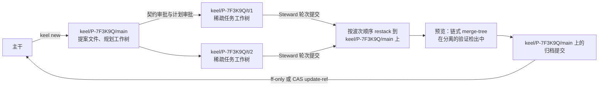
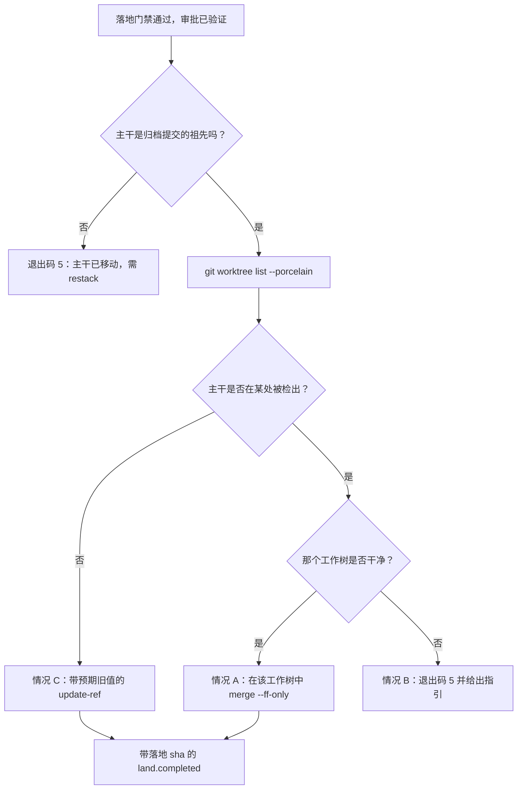

# 版本控制：git 为主，jj 可选

> 英文原文（规范版本）：[05-vcs.md](05-vcs.md)。本文是其简体中文镜像，两者不一致时以英文版为准。

git 是 keel 的主要版本控制系统，并且完全够用：本文中的每一项保证都以 git 原语来规定（D4、KP-09、[ADR-0001](adr/ADR-0001-git-primary-jj-optional.zh-CN.md)）。jj 是位于同一接口之后的可选增强，在 M7 交付。在项目中途关闭 jj 不会丢失任何东西。

本文是 VCS 机制的归属文档：`Vcs` 接口、引用命名、工作树（worktree）、Steward 提交、落地（land）的三种情况、保留操作检测以及 jj 对等性。这些提交和提交尾注（trailer）对可追溯性意味着什么，见 [04-trace-and-state.zh-CN.md](04-trace-and-state.zh-CN.md)；波次（wave）和集成队列如何使用这些原语，见 [06-parallelism.zh-CN.md](06-parallelism.zh-CN.md)；门禁（gate）目录见 [11-verification.zh-CN.md](11-verification.zh-CN.md)。

## Vcs 接口

两个后端都实现 `src/vcs/vcs.ts`。Steward 从不在该接口之外调用 git 或 jj。

| 方法 | 用途 | GitBackend | JjBackend 额外提供 |
| --- | --- | --- | --- |
| `detect` | 选择后端；报告版本、特性探测结果和隐患 | `git --version`、特性探测、引用冲突扫描 | jj 版本与共置（colocation）状态，LFS/子模块/过滤器隐患 |
| `workspace.create`, `list`, `remove` | 用于规划、任务和验证的加锁稀疏工作树 | `git worktree add --lock --reason ...` 加 `sparse-checkout set --no-cone` | 仅在 `--colocate` 发布后使用 jj 工作区 |
| `snapshot` | 在下文所列 Steward 侧触发点上为席位文件拍摄的影子快照 | 临时索引树，提交到 `refs/keel/snap/` 下 | 对 git 工作树无新增；`jj util snapshot` 只用于 jj 工作区，且须等到其被允许之后 |
| `refSnapshot`, `refDiff` | 保留操作检测 | `for-each-ref`、各工作树的 HEAD、reflog 末尾 | 操作日志（op log）作为额外来源 |
| `remoteSnapshot` | 推送检测 | 对每个已配置的远程执行 `git ls-remote` | 相同 |
| `diffNames` | 用于范围、影响面（impact）和棘轮的变更路径 | `git diff --name-only -z <a> <b>` | 相同 |
| `sourceTreeHash` | 不含 `.keel/**` 的源树哈希 | `git ls-tree -r -z --full-tree <commit>`，在进程内过滤 | 相同 |
| `commitTree` | 带提交尾注的 Steward 提交 | 临时索引、`commit-tree`、CAS `update-ref` | 同时记录 jj change id |
| `trailers.read` | 解析提交尾注 | `git interpret-trailers --parse` | 相同 |
| `claims.acquire`, `release` | 只允许创建的 CAS 锁引用 | `update-ref <ref> <blob> <zero-oid>`、`update-ref -d <ref> <blob>` | 相同（普通 git 引用） |
| `previewIntegration` | 对已递交（submit）末端（tip）的一次性集成 | 链式 `merge-tree --write-tree` 加 `commit-tree` | Megamerge 预览 |
| `restack` | 将提交重放到新的基点上 | 无需工作树的重放（见下文） | `jj rebase -s ... -o ...` |
| `land(expectedOld, new)` | 移动主干（trunk） | ff-only 或 CAS `update-ref`（三种情况） | 经过相同检查后设置书签（bookmark） |
| `annotate` | 行到提交的映射，用于 `keel trace` | `git blame --porcelain` | `jj file annotate` |

### 源树哈希

`sourceTreeHash(commit)` 是 `git ls-tree -r -z --full-tree <commit>` 以 NUL 分隔的输出在进程内移除 `.keel/` 下所有条目之后的 sha256。由于它对 blob id 做哈希，因此不依赖检出的行尾格式。使用它的证据（evidence）绑定定义在 [11-verification.zh-CN.md](11-verification.zh-CN.md) 中。

任何限定于 glob 范围的哈希（例如对工单（work order）的 `write_set`）都在同一份列表上使用 keel 自己的 glob 匹配器。keel 从不向 `git ls-tree` 传递 glob：它把路径规格（pathspec）视为字面前缀并拒绝 glob 魔法，所以 glob 范围会对空列表做哈希，并且永远不会变化。匹配零个路径的范围是错误，由一个负对照（negative control）检查。

### 后端选择

由董事会（Board）拥有的 `.keel/config.yaml` 中的 `vcs.backend` 取值为 `auto`、`git` 或 `jj`。`keel init` 复制 `templates/project/config.yaml`，写入 `backend: auto` 以及 `jj_opt_in: false`（与 `config/keel.defaults.yaml` 中的值相同）；`--vcs git` 或 `--vcs jj` 会改写为该值。只要 `jj_opt_in` 为 `false`，`auto` 的行为就与 `git` 完全相同。`git` 从不使用 jj。只有当后端为 `auto` 或 `jj`，并且以下条件全部满足时，keel 才使用 JjBackend：

- jj ≥0.45.1，经特性探测；
- 仓库是共置的（`.jj/` 与 `.git/` 共享工作副本）；
- 没有 git LFS、没有子模块、没有 clean/smudge 过滤器；
- 董事会已主动选择（`jj_opt_in: true`）。

使用 `auto` 时，条件不满足即使用 GitBackend，并由 `keel doctor --section vcs` 指出是哪个条件。使用 `jj` 时，条件不满足是环境错误（退出码 6）。永远不会静默切换：每份运行记录和回执（receipt）都会写明所用的后端。

`keel doctor --section vcs` 对 git 最低版本 2.38 进行特性探测（`merge-tree --write-tree` 和 `--name-only` 需要 2.38；`worktree add --lock --reason` 需要 2.35），并运行下文的引用冲突检查。

## 分支命名（不嵌套）

git 引用不能既是文件又是目录：一旦 `refs/heads/keel/P-7F3K9Q` 存在，就无法创建 `refs/heads/keel/P-7F3K9Q/T1`。因此 keel 从不将一个分支嵌套在另一个分支之下。

| 引用或路径 | 类型 | 创建者 | 移除时机 |
| --- | --- | --- | --- |
| `refs/heads/keel/<P>/main` | 提案分支：提案文件、集成、归档提交 | `keel new` | 关闭时清理 |
| `refs/heads/keel/<P>/t/<n>` | `<P>.T<n>` 的任务分支，保存轮次提交 | `keel run` | 关闭时清理 |
| `refs/keel/claims/<P>.T<n>` | 认领（claim）锁，一个只保存令牌的 blob（[06-parallelism.zh-CN.md](06-parallelism.zh-CN.md)） | `keel run` | 释放时 CAS 删除 |
| `refs/keel/snap/<P>.T<n>/<seq>` | 在 Steward 侧触发点上拍摄的影子快照 | Steward | 关闭时清理 |
| `refs/keel/snap/<P>.T<n>/seat-<n>` | 席位（seat）自行生成并被保留的提交 | Steward（摄入时） | 关闭时清理 |
| `refs/keel/ledger/head` | 账本锚点：一个保存当前链哈希的 blob，每次追加后以 CAS 方式更新（[04-trace-and-state.zh-CN.md](04-trace-and-state.zh-CN.md)） | Steward | 从不 |
| `<workspace_root>/<P>.plan` | 规划工作树，`keel/<P>/main` 的完整检出 | `keel new` | 计划审批之后（可重建） |
| `<workspace_root>/<P>.T<n>` | 任务工作树，稀疏 | `keel run` | 关闭时清理 |
| `<workspace_root>/_verify/<sha7>` | 分离的验证或索引检出，稀疏 | Steward | 检查完成后 |
| `<workspace_root>/_runs/<RUN>/` | 运行输入和 outbox（不是工作树）。keel 从不把原始运行时输出流写入磁盘（[04-trace-and-state.zh-CN.md](04-trace-and-state.zh-CN.md)） | `keel run` | 关闭时清理 |

默认的 `workspace_root` 是仓库之外的 `../<repo>.ws/`，因此不会有草稿或 keel 状态存放在工作树内。关闭时的清理只移除带有 keel 来源标记的工作树和引用（该想法来自 superpowers）。

`keel doctor --section vcs` 和 `keel doctor --selftest` 检查目录/文件冲突：任何会阻挡 keel 命名的现有引用，例如名为 `keel` 或 `keel/<P>` 的分支。M1a 的退出标准包括一个拒绝嵌套名称的负对照。



## 稀疏工作树与 Steward 提交

### 创建工作树

工作树在锁 `<git-common-dir>/keel/locks/worktree.lock` 之下逐个创建。keel 以 argv 数组且不经 shell 的方式启动 git，因此下面的模式会原样到达 git。

任务工作树：

```text
git worktree add --lock --reason keel:<P>.T<n>:<RUN> -b keel/<P>/t/<n> <ws> <base>
git -C <ws> sparse-checkout set --no-cone '/*' '!/.keel/proposals/'
git -C <ws> config --worktree remote.<name>.pushurl https://push-disabled.invalid/
```

- `<base>` 是派发时记录的基点（[06-parallelism.zh-CN.md](06-parallelism.zh-CN.md)）。
- 稀疏模式保留除 `/.keel/proposals/` 之外的一切，因此席位工作树中没有提案文件（[02-alignment.zh-CN.md](02-alignment.zh-CN.md)）。在稀疏检出（sparse checkout）设置好之前，不会启动任何席位。
- 每个工作树的 `pushurl`（每个已配置的远程一行）是下文"保留操作"中环境加固的一部分。它需要 `extensions.worktreeConfig`，keel 在 init 时启用一次；该设置可能把 `core.repositoryformatversion` 提升到 1，部分旧工具无法读取（verify by probe（需通过探测验证）；doctor 会报告）。

验证或索引检出，用于证据、评审镜头（lens）和索引：

```text
git worktree add --detach <workspace_root>/_verify/<sha7> <commit>
git -C <workspace_root>/_verify/<sha7> sparse-checkout set --no-cone '/*' '!/.keel/proposals/'
```

规划工作树：`<workspace_root>/<P>.plan` 完整检出 `keel/<P>/main`，因为产品、架构和规划席位在那里编写提案文件。它在计划审批后移除且可以重建，因此对 `keel/<P>/main` 做 restack（重新堆叠）时从不会移动一个已被检出的分支。

### 递交时的 Steward 提交

席位从不代表 keel 提交（[ADR-0004](adr/ADR-0004-steward-commits-and-submit-channels.zh-CN.md)）。在摄入一次递交时，Steward 先按工作树文件的现状把它提交为轮次 `<P>.T<n>.r<k>`，然后在这个轮次提交上运行递交门禁（[11-verification.zh-CN.md](11-verification.zh-CN.md)）。因此，每个被递交的轮次都有一个提交，无论其递交门禁是否通过：未通过的轮次作为历史留在 `keel/<P>/t/<n>` 上，从不进入验证或集成队列，修复轮次在它之上继续构建。唯一在提交之前运行的检查，是仅列出名称的模型提供方路径清单（下面的第 1 步）；一旦命中，该轮次以 `submit.provider-path-events` 失败，不暂存、也不提交任何内容。

```text
git -C <ws> status --porcelain -z --untracked-files=all         1. names only; keel matches them against the provider path set
git -C <ws> rev-parse --git-path index                          -> <ws-index>
copy <ws-index> to <run>/index.tmp
GIT_INDEX_FILE=<run>/index.tmp git -C <ws> add -A -- . <excludes>   stage the worktree files into the copy
GIT_INDEX_FILE=<run>/index.tmp git -C <ws> write-tree           -> <tree>
git -C <ws> commit-tree <tree> -p <tip> -F <run>/message.txt    -> <commit>   (message carries the trailers)
git update-ref refs/heads/keel/<P>/t/<n> <commit> <current>     CAS
git -C <ws> read-tree HEAD                                      refresh the worktree index
```

- 第 1 步只按名称列出已变更和未跟踪的路径（`-z`，在进程内解析；不打开任何文件）。如果某个路径用 keel 自己的 glob 匹配器匹配到该运行时描述符的模型提供方路径集、`.env` 或 `.env.*`，或者这些路径集中的凭据文件基名（例如 `.credentials.json`、`auth.json`、`gateway.json`），Steward 就什么也不暂存，以 `submit.provider-path-events` 使该轮次失败，并把路径（绝不包括其内容）报告给董事会。因此，keel 自己的 git 子进程从不读取这类文件，不会把它哈希成 blob，也不会把它持久保存到任何引用之下。被仓库忽略的文件既不会被列出，也不会被暂存，因此同样永远不会变成 blob。
- `<excludes>` 是针对同样模式的排除路径规格，例如 `':(exclude,glob)**/.env'`、`':(exclude,glob)**/.env.*'`，以及每个凭据文件基名各一条；每次 `add -A`（快照与轮次提交都一样）都会传入。它们是对在列出清单与暂存之间新建的文件的兜底。git 最低版本上的这一路径规格语法 verify by probe；隐患测试套件带有相应的负对照：席位创建的 `.env` 永远不会变成 blob。
- `GIT_INDEX_FILE` 由 keel 在子进程环境中设置；不涉及任何 shell 语法。
- 临时索引从工作树自身索引的副本开始，因此被稀疏检出排除的条目保留其 skip-worktree 位并留在树中，而不会被记录为删除（在 git 最低版本上 verify by probe；隐患测试套件覆盖这一点）。递交门禁的受保护路径检查是兜底：删除 `.keel/**` 的轮次会失败。
- `<tip>` 是运行前记录的任务分支末端。`<current>` 是该分支当前的值。除非席位自行提交过，否则两者相等。
- 如果席位在自己的任务分支上生成了提交（从 `<tip>` 快进），Steward 先把 `<current>` 保存在 `refs/keel/snap/<P>.T<n>/seat-<n>` 下，然后在 `<tip>` 上构建自己的轮次提交。这是保留操作 diff 所预期的唯一一种由席位造成的引用变更。
- `read-tree HEAD` 让工作树的索引与新的 HEAD 一致；文件本身已经与之相同。刷新必须保留被排除路径的 skip-worktree 位。普通的 `read-tree HEAD` 是否能保留它们，或者是否必须随后执行 `git -C <ws> sparse-checkout reapply`，verify by probe。

### 回合之间的快照

Steward 用相同的临时索引技术获取影子快照：先执行上文第 1 步那样仅列名称的清单，然后复制索引、`add -A -- . <excludes>`、`write-tree`、`commit-tree -p <tip>`，再以零值作为预期旧值创建 `refs/keel/snap/<P>.T<n>/<seq>`。它从不触碰席位的索引或分支。清单中出现模型提供方路径命中时，跳过该快照，并以 `submit.provider-path-events` 使该次运行失败。当 `intent_gap` 把提案退回框定阶段时，快照会保存补丁；快照也让 Steward 能检测到在匹配的 ACK（复述确认）之前做出的编辑，这类编辑会使该次运行作废（[02-alignment.zh-CN.md](02-alignment.zh-CN.md)）。

无头运行没有由 keel 控制的回合（`codex exec`、`opencode run`、`qwen -p` 和 `kimi -p` 会自行运行到结束），因此快照由 Steward 侧的事件触发，而从不由运行时触发：

| 触发点 | 时机 | 适用于 |
| --- | --- | --- |
| 派生前基线 | 派生之前：记录任务末端及其树 | 每次运行 |
| 流边界 | 在输出流中每个已解析的 `tool_use` 或 `tool_result` 事件被读取之后 | 会输出流的运行时（除 D 以外的所有梯级） |
| ACK 摄入 | 摄入 ACK 投递文件时同步拍摄：Steward 监视运行 outbox 并接收 MCP `keel_submit` 调用，在应答或校验该 ACK 之前拍摄快照 | 通过 outbox 或 MCP 发送 ACK 的席位 |
| 预运行 ACK | 只读预运行在主运行派生之前结束，因此工作树仍等于派生前基线 | 通过预运行最终消息发送 ACK 的席位 |
| 递交摄入 | 即上文的轮次提交 | 每次运行 |

ACK 顺序检查把 ACK 摄入快照的树与派生前基线树进行比较；运行目录位于工作树之外，从不参与比较。任何差异都意味着在匹配的 ACK 之前有编辑，该次运行作废。这是检测而不是防止，其局限在 [09-runtimes.zh-CN.md](09-runtimes.zh-CN.md) 第 6 节中按梯级说明：在 ACK 之前做出又撤销的编辑是看不见的；与 ACK 投递竞争的写入可能落在快照的任意一侧。

### 集成预览与 restack

集成队列（[06-parallelism.zh-CN.md](06-parallelism.zh-CN.md)）使用两个原语。

`previewIntegration` 将所有已递交的末端合并成一个一次性提交，无需任何工作树：

```text
acc := keel/<P>/main                      (already restacked onto trunk)
for each submitted tip, in wave order:
  git merge-tree --write-tree --name-only <acc> <tip>
      exit 0 -> first line is <tree>
      exit 1 -> conflict; the listed paths become a resolution task
  git commit-tree <tree> -p <acc> -p <tip> -m "keel preview"   -> new <acc>
```

最终的 `<acc>` 以分离方式检出到一个验证工作树中，在那里运行集成测试和漂移（drift）检查。红色的预览通过丢弃末端进行二分。keel 从不使用 `-X ours` 或 `-X theirs` 解决冲突；冲突始终是一个任务。预览提交没有引用指向，留给 git 的常规清理处理。

`restack` 将提交重放到新的基点上：先把 `keel/<P>/main` 重放到当前主干末端，然后按波次顺序把每个任务的轮次提交重放到 `keel/<P>/main` 上。每个被重放的提交都保留其消息和提交尾注，因此追踪得以延续；账本（ledger）记录新旧提交 id。无需工作树的重放方式是 `git merge-tree --write-tree --merge-base <parent> <onto> <commit>`，随后执行 `git commit-tree <tree> -p <onto>` 和一次 CAS `update-ref`。`--merge-base` 需要比 2.38 最低版本更新的 git（verify by probe）；探测失败时，keel 在 `_verify/` 下的临时分离工作树中用 `git cherry-pick` 重放。只有当证据的源状态未变时，证据才能在 restack 之后保留（[11-verification.zh-CN.md](11-verification.zh-CN.md)）。

## 三种落地情况

落地发生在落地门禁通过、并且落地审批（或在按策略落地时，已批准的落地策略和请求）验证通过之后（[11-verification.zh-CN.md](11-verification.zh-CN.md)）。归档提交成为新的主干末端。

1. 祖先关系：`git merge-base --is-ancestor <trunk> <archive>`。如果主干不是祖先，说明主干已移动：以退出码 5 退出，restack 后再次落地。
2. `git worktree list --porcelain` 显示哪个工作树（如果有）检出了主干。
3. 以下三种情况恰好有一种适用：

| 情况 | 条件 | 动作 |
| --- | --- | --- |
| A | 某个工作树检出了主干并且是干净的（`git -C <wt> status --porcelain --untracked-files=no` 为空） | `git -C <wt> merge --ff-only <archive>`，它同时移动分支、索引和文件，并在主干已移动时失败（相当于一次 CAS） |
| B | 某个工作树检出了主干但不干净 | 以退出码 5 拒绝并给出指引：提交、stash 或切换那个工作树，然后再次运行 `keel land <P>` |
| C | 没有工作树检出主干 | `git update-ref refs/heads/<trunk> <archive> <expected-old>`（一次 CAS） |

4. Steward 追加带有落地 sha 的 `land.completed`（[04-trace-and-state.zh-CN.md](04-trace-and-state.zh-CN.md)）。



为什么不总是使用 `update-ref`：用 `update-ref` 移动一个已检出的分支，会让那个工作树的索引和文件停留在旧提交上，于是在那里执行 `git status` 会显示这次落地被反转，而之后从该工作树做的提交会悄悄撤销这次落地。

推送到共享远程是一项保留操作。由董事会推送；keel 不推送。[14-trust-security.zh-CN.md](14-trust-security.zh-CN.md) 建议使用服务端分支保护。

## 保留操作：引用快照、ls-remote、环境加固

保留操作是只有董事会才能执行的动作，例如推送、移动或删除引用、改写历史，以及 jj 的 `undo`、`op restore` 或 `--ignore-immutable`。规范列表是 [`org/reserved-actions.yaml`](../org/reserved-actions.yaml)；席位契约引用它（[01-org-model.zh-CN.md](01-org-model.zh-CN.md)）。在纯 git 上，检测是保证，预防是尽力而为。

### 检测（保证）

每次启动席位之前，Steward 记录一次引用快照：

```text
refs      git for-each-ref --format=%(refname)%00%(objectname) refs/heads refs/tags refs/remotes refs/keel
heads     git worktree list --porcelain            HEAD and branch of every worktree
reflogs   git reflog show -n <k> <ref>             newest entries of each HEAD and branch reflog
remotes   git ls-remote <remote>                   each configured remote, read-only
```

- 引用、HEAD 和 reflog 部分在摄入（ingest）时和落地时做 diff。只有当 Steward 把某项变更记录为 `vcs.op` 账本事件，或者该变更是席位提交对其自身任务分支的快进（如上所述被保留），或者它是账本锚点 `refs/keel/ledger/head` 的移动且与负责监督的 Steward 进程自己所做的追加相符时（[04-trace-and-state.zh-CN.md](04-trace-and-state.zh-CN.md)），这项变更才算得到解释。任何其他变更都会设置 `blocked(reserved_op)` 并成为董事会事项。
- `git ls-remote` 在每次运行前后执行。远程引用发生变化即为 `blocked(reserved_op)`。如果某个远程无法访问，检查报告 `unknown`，从不报告 `pass`。
- 检测无法分辨是谁移动了引用。董事会在运行期间手动移动的引用会像其他引用一样被标记；董事会用已批准的豁免（override）（`keel approve <RUN> --rule override`）清除它。在并行运行时，一项未解释的变更会归因于时间窗口覆盖它的每一次运行。
- 使用 JjBackend 时，操作日志是额外的检测来源。

正是这一点让"每项保证在纯 git 上都成立"为真：检测不需要钩子、不需要垫片（shim），也不需要 jj。

### 预防（尽力而为）

- 生成的按运行时（runtime）权限规则，以及在有钩子的地方使用 PreToolUse 守卫（[09-runtimes.zh-CN.md](09-runtimes.zh-CN.md)）。
- 席位环境加固，应用于每个被启动的席位：

| 设置 | 效果 |
| --- | --- |
| `GIT_CONFIG_COUNT`, `GIT_CONFIG_KEY_<i>=credential.helper`, `GIT_CONFIG_VALUE_<i>=` (empty) | 空的 helper 值会重置 helper 列表，因此席位中的 git 无法使用已存储的凭据。否则 Git for Windows 默认的凭据管理器会静默地为 HTTPS 推送完成认证。 |
| `GIT_TERMINAL_PROMPT=0` | git 从不提示输入凭据。 |
| `GCM_INTERACTIVE=never` | Git Credential Manager 从不弹出提示。 |
| 每个工作树的 `remote.<name>.pushurl` 设为 `https://push-disabled.invalid/`（需要 `extensions.worktreeConfig`） | 在该工作树中执行普通的 `git push` 会推向一个无法解析的主机。`pushurl` 是多值的，git 会推送到每一个值，因此如果仓库配置已经为该远程设置了 `pushurl`，这项加固就无效，doctor 会报告这一点（verify by probe）。 |

- 建议性垫片，在 M2 发布（M0 设计只描述它们）：一个无扩展名的 `sh` 脚本、一个 `git.cmd` 和一个 `git.ps1`，以及对应 `jj` 的同样三个，放在席位 PATH 的最前面。三个都需要，因为 Git Bash 不会按裸名称运行 `.cmd`，而 cmd.exe 和 PowerShell 不会运行无扩展名的脚本。Node 和 Rust 启动进程时从不使用 `.cmd` 垫片，所以直接启动 git 的运行时会绕过这些垫片。`keel doctor` 按运行时的 shell 报告垫片覆盖情况。

已知缺口：使用席位自己的凭据推送到一个不是已配置远程的 URL，既不会被阻止也不会被检测到，因为 `ls-remote` 只监视已配置的远程。缓解措施是服务端分支保护（[14-trust-security.zh-CN.md](14-trust-security.zh-CN.md)）。

## 预防与检测对照表

在每个运行时和梯级（rung）上，检测都相同：摄入时和落地时的引用快照 diff、每次运行前后的 `ls-remote`，以及使用 jj 时的操作日志。预防因运行时而异。下表中的每一条预防措施都是 verify by probe；`keel doctor --section exposure` 报告在本机上已验证的内容。涵盖所有保证（不仅是保留的 VCS 操作）的梯级级别表见 [09-runtimes.zh-CN.md](09-runtimes.zh-CN.md) 第 6 节，按运行时的权限细节见该文档第 5 节。

| 运行时 | 梯级 | 对保留 VCS 操作的预防（尽力而为） | 主要弱点 |
| --- | --- | --- | --- |
| claude-code | A | 针对 git 命令的按运行 `--settings` 拒绝规则；通过 `keel hook` 的 PreToolUse 守卫（退出码 2 表示阻止）；只读席位使用 plan 模式；环境加固；`sh` 垫片覆盖其 Git Bash 工具 | Bash 拒绝模式容易被规避；原生 Windows 上没有操作系统沙箱 |
| codex | 钩子探测通过之前为 C，之后为 A | 只读席位使用 `-s read-only`；`-s workspace-write` 将写入限制在工作树和运行目录内，在沙箱被强制执行的地方，这会排除公共 git 目录中的引用和对象；workspace-write 下默认关闭网络 | Windows 沙箱模式，以及加固变量是否能到达工具 shell（`shell_environment_policy`），均为 verify by probe |
| gemini-cli | `--policy` 探测通过后为 B | 在那之前仅用于评审席位，使用 `--approval-mode plan`；按运行的 `--policy` 拒绝规则；BeforeTool 钩子仅在受信任文件夹中生效 | 非受信任文件夹会跳过钩子；策略文件行为未经验证 |
| qwen-code | 钩子探测通过之前为 C，之后为 A | `--approval-mode plan` 或 `auto-edit`、`--allowed-tools` 与工具排除；环境加固 | 钩子只能来自打印出的代码片段，并且受文件夹信任限制 |
| kimi-code | 验证之前为 D | 无头模式下没有预防：`-p` 在 `auto` 权限策略下运行（等同于绕过）。在梯级 D 由人工运行该席位和 `keel api` | 钩子只能是用户全局的 |
| opencode | C | 按运行的 agent 权限块与拒绝规则；环境加固 | 不使用钩子；在摄入、递交和落地时强制执行 |
| direct | n/a | 无工具通道：没有 shell，也不能访问 VCS | 就 VCS 而言无 |

## JjBackend 增强与对等性表

JjBackend 需主动启用（M7），只做增加，从不替代。这些想法来自 jj 本身以及 CodeAlive 的 jj-agentic-workflow（集成者作为唯一的主干写入者、串行化的工作区、隐患清单）。jj 尚处于 1.0 之前，并且会在次版本之间修改其 CLI，因此这里的每条命令都要针对已安装的版本 verify by probe。

- jj change id 与 `Keel-Round` 一起记录。
- 操作以 `operation.username=keel/<seat>/<run>` 运行，因此操作日志能归属每一个操作。
- 操作日志和 evolog 会被导出（`keel audit --export-vcs`），操作日志也是保留操作检测的额外来源：不在 keel 用户名下进行的操作即为未解释的操作。
- restack 使用 `jj rebase -s 'roots(trunk()..tip)' -o 'trunk()'`（在 jj 0.44 中 `-o/--onto` 取代了 `-d`）。位于 `conflicts() & mutable()` 中的修订成为冲突解决任务。
- `jj util snapshot` 为 jj 工作区拍摄快照，须等到 jj 工作区被允许之后。在此之前席位都在 git 工作树中工作，而 jj 不跟踪这些工作树，因此在两种后端下，临时索引快照都仍是 git 工作树的快照机制。
- `jj run --ignore-changes` 在不改写修订的情况下运行逐修订检查。
- megamerge（覆盖所有已递交末端的一个合并提交）就是集成预览。
- 策略 revset 表达席位可以触碰哪些修订。

在 `jj workspace add --colocate` 发布之前，agent 工作区仍然是 git 工作树，因为 agent CLI 期望的是 git 检出。截至 jj 0.45.1 它尚未发布，因此通过特性检测来判断；它发布后，如果 `git.colocate` 为 true，则默认共置，而这个未发布的版本要求 `jj workspace add` 使用 git 2.42 或更高版本。运行时描述符也可以改为声明 `git_required: false`。工作区创建在一个 keel 锁下串行进行（jj issue #9314）。看板（dashboard）读取使用 `--ignore-working-copy`，这样读取从不会对工作副本做快照。

| 关注点 | git | jj 额外提供 |
| --- | --- | --- |
| 身份 | `Keel-Round` 提交尾注 | + change id |
| 保留操作检测 | 引用快照 + `ls-remote` | + 操作日志 |
| 审计 | 账本 `vcs.op` 事件 | + evolog |
| 冲突 | `merge-tree` 预览 + 冲突解决任务 | 一等公民的冲突 |
| 隔离 | 稀疏工作树 | 工作区（在允许时） |
| 快照 | 临时索引引用（git 工作树，两种后端） | `jj util snapshot`，仅用于 jj 工作区 |
| 逐修订检查 | 分离工作树 | `jj run` |
| 落地 | ff-only 或 CAS `update-ref` | 经过相同检查后设置书签 |

M7 退出标准：M1-M4 测试套件在两个后端上都通过，并且在项目中途禁用 jj 不会丢失任何追踪、证据或审批，因为这三者都存在于 git 提交尾注、账本和已提交的批准记录中。

## Windows 说明

keel 在 Windows 上原生运行（D3、[ADR-0002](adr/ADR-0002-node-windows-native.zh-CN.md)）。对于 VCS 工作：

- 必须设置 `core.longpaths=true`；位于 `../<repo>.ws/` 下的工作树路径很快就会变长。doctor 会检查它。
- 使用 jj 时，`working-copy.eol-conversion` 必须与 git 的 `core.autocrlf` 一致，否则两个工具看到的文件会不同（verify by probe）。
- 不使用符号链接：keel 不在工作树中创建任何符号链接，技能和配置都是副本。
- keel 以 `shell: false` 和 argv 数组启动 git 和 jj，并在 git 提供的地方解析以 NUL 分隔的输出（`-z`），因此带空格的路径、CRLF 和引号问题永远不会到达解析器。
- keel 传递 `--no-pager` 并禁用颜色（git 用 `-c color.ui=never`，jj 用 `--color never`），因此解析器永远不会遇到分页器或 ANSI 代码。
- 当人在 PowerShell 中输入这些命令时，要给含有 `@` 或花括号的修订加引号，例如 `git rev-parse 'HEAD@{1}'` 和 `jj log -r '@'`。keel 自身从不经过 shell。
- keel 自己的引用名称大小写稳定（大写 Crockford id、固定的小写片段），这一点很重要，因为大小写不敏感文件系统上的 files 引用后端无法容纳两个仅大小写不同的引用。
