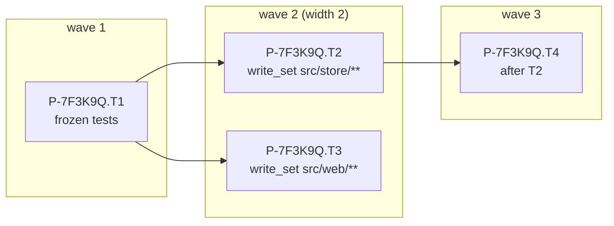
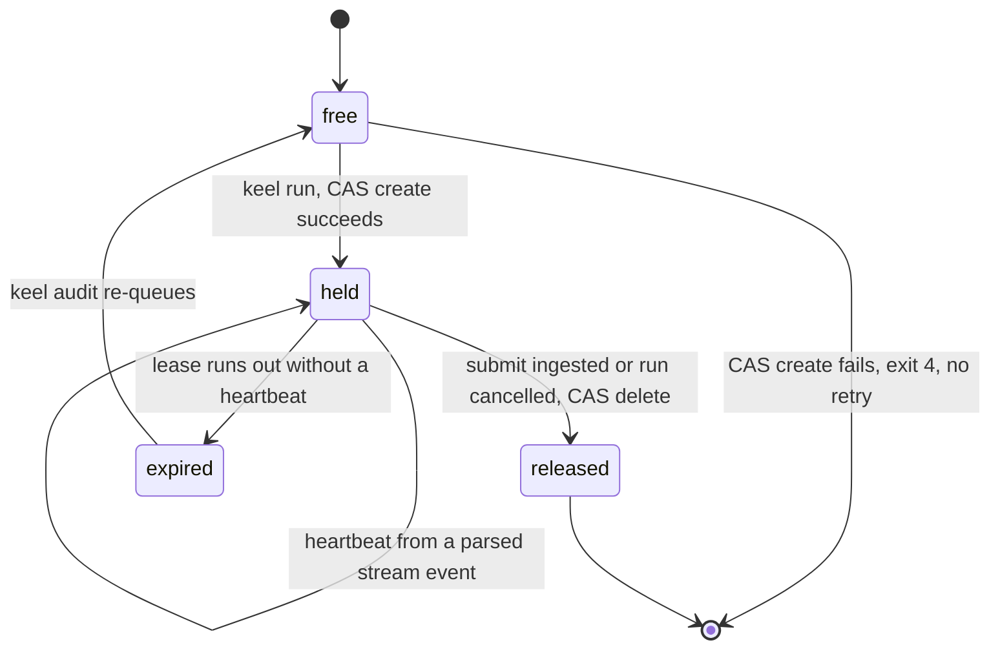
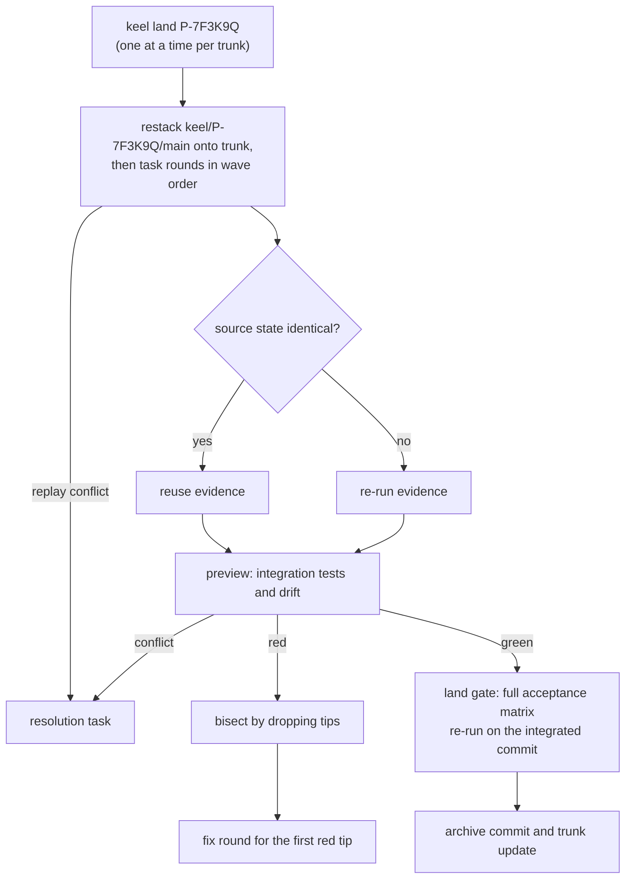

# Parallelism and integration

Parallel work is opt-in per proposal, through waves. This document is the home of wave computation, claims
and leases, the process model and cancellation, collision prediction and the integration queue. The git
primitives it uses (worktrees, `previewIntegration`, `restack`, the land cases) are in
[05-vcs.md](05-vcs.md); the evidence binding and land re-execution are in
[11-verification.md](11-verification.md); the liveness invariant and budgets are in
[03-lifecycle.md](03-lifecycle.md).

Milestones ([15-roadmap.md](15-roadmap.md)): CAS claims with ledger leases arrive in M2, the integration
queue with land re-execution in M3, and the wave scheduler with impact disjointness, collision prediction,
preview bisection and campaign plans in M8.

## Waves

The Steward computes waves from the proposal's `workorders/*.yaml`. The planner never schedules workers;
it only declares `after`, `write_set`, interfaces and route hints.

1. Order the tasks topologically over `after`. A cycle fails the plan gate.
2. Pack greedily, in that order, into the earliest wave where the task fits. A task fits a wave when:
   - all its `after` predecessors are in earlier waves;
   - its `write_set` is disjoint from the `write_set` of every task already in the wave;
   - its predicted impact (reverse closure at depth 2,
     [07-architecture-intelligence.md](07-architecture-intelligence.md)) misses their write sets, and theirs
     misses its write set;
   - the wave is below the width cap.
3. Hot files force a serial spine: two tasks that touch the same high-churn file (from the churn data given
   to the planner) are never in one wave; they run one after another in plan order.
4. The tasks on the longest remaining chain go to the strongest tier their route allows, so the critical
   path is not starved.

Disjointness is decided with keel's own glob matcher, the same one the scope check uses. When it cannot
decide, for example for two globs that could both match a file that does not exist yet, it treats the
write sets as overlapping.

The planner states the widest wave it intends as `max_width` in `plan.yaml` (default 1); the effective
width is the smaller of that and the cap `caps.max_parallel`, which defaults to 3
(`config/keel.defaults.yaml`). A width above 1 on the feature track, and any fan-out on the system track,
requires plan approval ([01-org-model.md](01-org-model.md)); the plan gate re-checks disjointness per wave,
and impact overlap from M8 ([11-verification.md](11-verification.md)). A campaign plan
(`plan.kind: campaign`, `on: <element query>`) expands into one work order per element matched by the
query (M8).

Example: T1 writes the frozen acceptance tests (on a different declared family), T2 and T3 build against
them in separate elements, and T4 depends on T2.



The idea of a serial spine comes from OpenSpec, disjoint-file markers from GitHub Spec Kit, and
dependency-graph waves from Kiro's public docs.

## Claim locks and ledger leases

Only `keel run` claims work. Mutating verbs, `keel run` included, refuse under `KEEL_RUN` or a keel-run
ancestor process ([02-alignment.md](02-alignment.md)), so a seat cannot claim.

### The lock

A claim is a create-only compare-and-swap on a ref that holds only a token:

```text
git hash-object -w --stdin              <- the claim token      -> <token-blob>
git update-ref refs/keel/claims/<P>.T<n> <token-blob> <zero-oid>
```

The zero object id as the expected old value means "create only": if the ref exists, `update-ref` fails.
The zero id is 40 zeros in a SHA-1 repository and 64 in a SHA-256 repository. A lost CAS exits 4 (claim
conflict) and is never retried; a conflict is final (the atomic-checkout idea from Paperclip; the CAS claim
with a token from oh-my-claudecode). Release is a CAS delete,
`git update-ref -d refs/keel/claims/<P>.T<n> <token-blob>`, which fails if the ref no longer holds this
token.

### The lease

Everything else about a claim is ledger events ([04-trace-and-state.md](04-trace-and-state.md)): the claim
itself with its token, run, workspace, recorded base and route (runtime, profile alias, tier), the lease,
and heartbeats. The claim record shape is [`schemas/claim.schema.json`](../schemas/claim.schema.json).

- Heartbeats come only from the child's parsed stream events ([09-runtimes.md](09-runtimes.md)). There is
  no separate heartbeat call. A rung-D task has no stream; it holds `unblock_owner: board` instead of a
  lease.
- Claim state is derived from the ledger and cross-checked against the lock ref at every ingest and in
  `keel audit`:

| Ledger says | Lock ref | Result |
| --- | --- | --- |
| Held | Holds the same token | Held |
| Held | Missing or another token | The ref was changed outside keel: `blocked(reserved_op)` (the ref snapshot covers `refs/keel`) |
| Released or expired | Still present | Stale lock: `keel audit` removes it by CAS delete and records that |

- An expired lease is re-queued by `keel audit`, which releases the lock and records the re-queue. Drops
  that arrive later from the old run are rejected at ingest, because their run no longer holds the claim.
- A task's base is recorded in the claim. For a task with `after` edges, the base must contain the verified
  rounds of its predecessors.



The liveness invariant (every non-terminal task holds a claim, a queued dispatch, an `unblock_owner` with
an open ask, or a pending approval) is defined in [03-lifecycle.md](03-lifecycle.md); claims are one of its
four holds.

## Windows process model and cancellation

### Spawning

`keel run <P> --wave` spawns up to `max_parallel` headless runtime processes with `child_process.spawn` and
`shell: false`. Each child gets its own:

- compiled brief (`BR-<sha12>`) and ACK id set;
- budget;
- per-run configuration under `<workspace_root>/_runs/<RUN>/inputs/`;
- submit channel (final message, MCP `keel_submit` or the outbox);
- stdout event stream, parsed line by line into canonical events.

How a runtime binary is resolved on Windows (npm `.cmd` and `.ps1` shims resolved to the node script or
`.exe`, never `shell: true`), how the prompt reaches it and which environment it gets are in
[09-runtimes.md](09-runtimes.md) and [10-providers.md](10-providers.md).

Read-only fan-out, meaning review lenses and audits, always runs in parallel: all lenses are launched
before any result is read, so no verdict can influence another.

### Cancellation

A run is cancelled on `keel run --hold on <P>`, at 100% of its budget (`blocked(budget)`), on an expired
lease, or on an abandon ruling. keel appends the cancellation to the ledger before it signals the process,
so the outcome `killed` comes from keel's own cancellation journal, never from an exit code.

| Step | Windows | POSIX |
| --- | --- | --- |
| 1 | Close the child's stdin | Send `SIGTERM` |
| 2 | Wait a grace period | Wait a grace period |
| 3 | `taskkill /PID <pid> /T /F` | Send `SIGKILL` |

- `taskkill` without `/F` cannot end console processes, and every agent CLI is a console process, so the
  last step must use `/F`; `/T` ends the whole process tree.
- Node's `subprocess.kill()` on Windows always terminates forcefully and reaches only the direct child, so
  keel does not use it for cancellation there. keel ships no native addons, so it does not use Windows job
  objects either.
- Exit code 143 (128 + `SIGTERM`) is interpreted on POSIX only. It never occurs on Windows.
- Whether a force-killed Claude Code or Codex session can be resumed afterwards is verify by probe. keel
  does not assume it.

## Collision prediction

A collision is one task's actual change reaching into another task's declared area. At submit of task A,
and continuously on the dashboard, the Steward computes

```text
collision(A, B) = impact(actual diff of A)  ∩  write_set(B)
```

for every other non-terminal task B of the proposal. `impact` is the closure from changed files through
symbols to dependents at depth 2 ([07-architecture-intelligence.md](07-architecture-intelligence.md)).

- A non-empty result is recorded as an impact record and a ledger event, shown in the dashboard's collision
  overlay, and listed in the receipt.
- If the collision crosses a declared element boundary, a planner ruling is required
  (`keel api rule`, for example re-sequence, merge the tasks, or accept) before either task integrates.
- Without an index (before M4, or with backend `none`), keel falls back to the changed paths of A
  intersected with `write_set(B)`, labelled path-only.
- Collisions between proposals are caught later, by the integration queue: they show up as `merge-tree`
  conflicts or a red preview.

The predicted impact from plan time and the actual impact at submit are both kept, so the planner's
estimates can be compared with reality.

## Integration queue and land re-run

Integration is one serialized queue per trunk, in the style of Gas Town's Refinery: verify the merged
batch, bisect a red one. One proposal integrates at a time per trunk, under a per-trunk lock in
`<git-common-dir>/keel/locks/`, in the order `keel land` requests arrive.

1. Restack `keel/<P>/main` onto the trunk tip, then each task's round commits onto `keel/<P>/main` in wave
   order ([05-vcs.md](05-vcs.md)). A replay conflict becomes a resolution task.
2. Reuse evidence only where the source state is identical (every match field equal,
   [11-verification.md](11-verification.md)); everything else is re-run. Scope-limited reuse is allowed
   only once the M4 impact closure proves that no dependency changed.
3. Preview: integration tests and drift run on the combined tips, built by `previewIntegration`
   ([05-vcs.md](05-vcs.md)) and checked out in a detached verify worktree. `keel land <P> --preview` runs
   this step alone.
4. Bisect a red preview by dropping tips while keeping wave order: dropping a tip also drops the tips that
   depend on it through `after`. The first tip whose addition turns the preview red gets a fix round.
5. Conflicts are never auto-resolved; each becomes a resolution task.
6. Land re-runs the full acceptance matrix on the integrated commit, in the land process, on a fresh
   detached checkout ([11-verification.md](11-verification.md)). Evidence files are only a cache.



## When not to parallelize

keel does not run these in parallel; the Steward refuses, and the plan gate flags plans that try:

| Situation | Why |
| --- | --- |
| Tasks that share an interface without a produced/consumed contract in their work orders | Each side would guess the other's shape; the integration conflict arrives late and semantic, not textual |
| Tasks that touch the same element's public API | Callers of that API cannot be built against two moving versions |
| System-track work before contract and plan approval | The architecture delta is not settled, so disjointness cannot be judged |
| Tasks whose impact is `unknown` | Disjointness cannot be proven; `unknown` never counts as disjoint |
| Tasks touching a hot file | They form the serial spine (see "Waves") |

Sequential execution is always a valid plan. Parallelism is an optimization the Board approves, not a
default.
