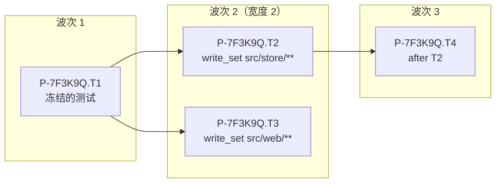
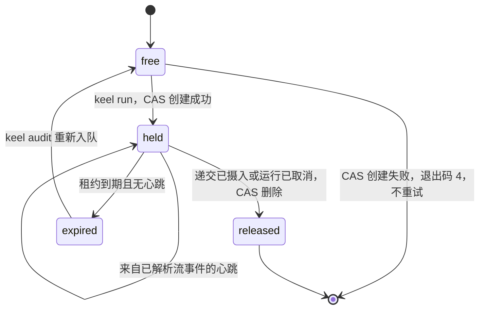
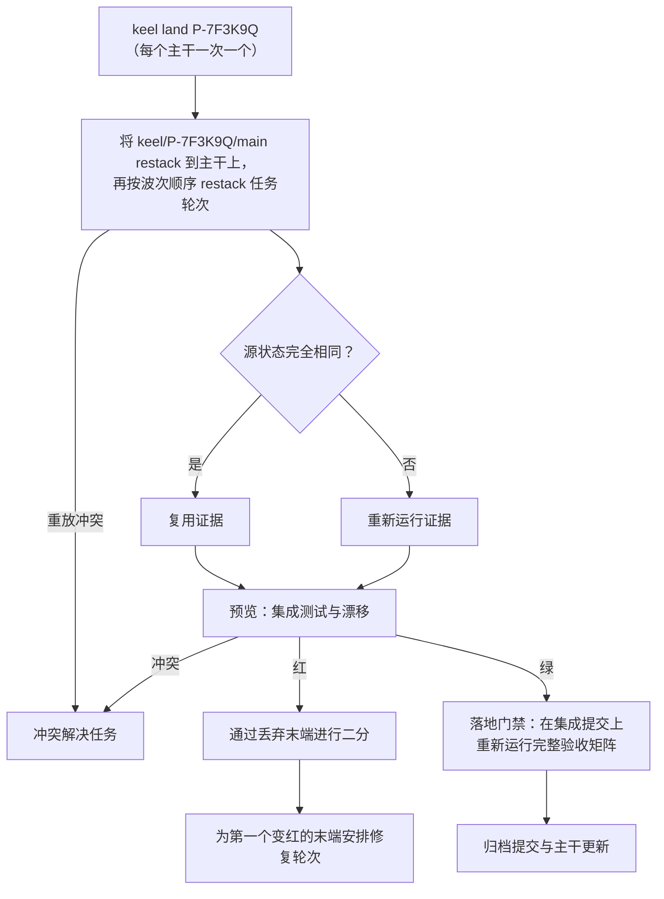

# 并行与集成

> 英文原文（规范版本）：[06-parallelism.md](06-parallelism.md)。本文是其简体中文镜像，两者不一致时以英文版为准。

并行工作按提案（proposal）选择启用，通过波次（wave）进行。本文是以下内容的归属文档：波次计算、认领（claim）与租约、进程模型与取消、碰撞预测以及集成队列。它使用的 git 原语（工作树（worktree）、`previewIntegration`、`restack`、落地（land）的几种情况）见 [05-vcs.zh-CN.md](05-vcs.zh-CN.md)；证据（evidence）绑定和落地时的重新执行见 [11-verification.zh-CN.md](11-verification.zh-CN.md)；活性不变量（invariant）和预算见 [03-lifecycle.zh-CN.md](03-lifecycle.zh-CN.md)。

里程碑（[15-roadmap.zh-CN.md](15-roadmap.zh-CN.md)）：带账本（ledger）租约的 CAS 认领在 M2 到来，带落地重新执行的集成队列在 M3 到来，带影响面（impact）不相交判定、碰撞预测、预览二分和战役计划（campaign plan）的波次调度器在 M8 到来。

## 波次

Steward 根据提案的 `workorders/*.yaml` 计算波次。规划席位（planner seat）从不调度执行者；它只声明 `after`、`write_set`、接口和路由提示。

1. 按 `after` 对任务做拓扑排序。出现环会使计划门禁（plan gate）失败。
2. 按该顺序贪心打包，把每个任务放入它能容纳的最早波次。任务能放入某个波次的条件是：
   - 它的所有 `after` 前驱都在更早的波次中；
   - 它的 `write_set` 与该波次中已有的每个任务的 `write_set` 都不相交；
   - 它的预测影响面（深度为 2 的反向闭包，[07-architecture-intelligence.zh-CN.md](07-architecture-intelligence.zh-CN.md)）不触及它们的写集合，它们的预测影响面也不触及它的写集合；
   - 该波次的宽度低于上限。
3. 热点文件强制形成串行主干：两个触及同一高变动文件（依据提供给规划席位的变动数据）的任务从不在同一波次中；它们按计划顺序一个接一个运行。
4. 位于最长剩余链上的任务分配到其路由允许的最强档位（tier），这样关键路径不会被饿死。

不相交性由 keel 自己的 glob 匹配器判定，与范围检查所用的是同一个。当它无法判定时，例如两个 glob 都可能匹配一个尚不存在的文件，它将这两个写集合视为重叠。

规划席位在 `plan.yaml` 中以 `max_width`（默认 1）声明其打算使用的最宽波次；实际宽度取它与上限 `caps.max_parallel` 中的较小值，后者默认为 3（`config/keel.defaults.yaml`）。在 feature 轨道（track）上宽度大于 1，以及在 system 轨道上的任何扇出，都需要计划审批（[01-org-model.zh-CN.md](01-org-model.zh-CN.md)）；计划门禁会逐波次重新检查不相交性，并从 M8 起检查影响面重叠（[11-verification.zh-CN.md](11-verification.zh-CN.md)）。战役计划（`plan.kind: campaign`，`on: <element query>`）会展开为对该查询匹配到的每个架构元素（element）各一个工单（work order）（M8）。

示例：T1 编写冻结的验收测试（使用不同的声明的模型家族（declared family）），T2 和 T3 在不同的架构元素中基于这些测试进行构建，T4 依赖 T2。



串行主干的想法来自 OpenSpec，不相交文件标记来自 GitHub Spec Kit，依赖图波次来自 Kiro 的公开文档。

## 认领锁与账本租约

只有 `keel run` 会认领工作。包括 `keel run` 在内的变更性命令在 `KEEL_RUN` 之下或存在 keel-run 祖先进程时拒绝执行（[02-alignment.zh-CN.md](02-alignment.zh-CN.md)），因此席位（seat）无法认领。

### 锁

认领是对一个只保存令牌的引用做的只允许创建的比较并交换（CAS）：

```text
git hash-object -w --stdin              <- the claim token      -> <token-blob>
git update-ref refs/keel/claims/<P>.T<n> <token-blob> <zero-oid>
```

以零对象 id 作为预期旧值意味着"只允许创建"：如果引用已存在，`update-ref` 就会失败。零 id 在 SHA-1 仓库中是 40 个零，在 SHA-256 仓库中是 64 个零。CAS 失败以退出码 4（认领冲突）退出，并且从不重试；冲突是最终结果（原子签出的想法来自 Paperclip；带令牌的 CAS 认领来自 oh-my-claudecode）。释放是一次 CAS 删除，即 `git update-ref -d refs/keel/claims/<P>.T<n> <token-blob>`，如果该引用已不再保存这个令牌，它就会失败。

### 租约

认领的其余一切都是账本事件（[04-trace-and-state.zh-CN.md](04-trace-and-state.zh-CN.md)）：认领本身（带有令牌、运行、工作区、记录的基点和路由（运行时、配置档别名、档位））、租约以及心跳。认领记录的结构见 [`schemas/claim.schema.json`](../schemas/claim.schema.json)。

- 心跳只来自子进程被解析的流事件（[09-runtimes.zh-CN.md](09-runtimes.zh-CN.md)）。没有单独的心跳调用。梯级（rung）D 的任务没有流；它持有 `unblock_owner: board` 而不是租约。
- 认领状态从账本推导，并在每次摄入（ingest）时以及在 `keel audit` 中与锁引用交叉核对：

| 账本记录 | 锁引用 | 结果 |
| --- | --- | --- |
| 持有 | 保存相同的令牌 | 持有 |
| 持有 | 缺失或为其他令牌 | 该引用在 keel 之外被修改：`blocked(reserved_op)`（引用快照覆盖 `refs/keel`） |
| 已释放或已过期 | 仍然存在 | 陈旧锁：`keel audit` 通过 CAS 删除移除它，并记录下来 |

- 过期的租约由 `keel audit` 重新入队，它会释放锁并记录这次重新入队。之后来自旧运行的投递在摄入时被拒绝，因为它们的运行不再持有该认领。
- 任务的基点记录在认领中。对于带有 `after` 边的任务，基点必须包含其前驱已验证的轮次。



活性不变量（每个非终态任务都持有一个认领、一个已排队的派发、一个带有未决提问的 `unblock_owner`，或一个待处理的审批）定义在 [03-lifecycle.zh-CN.md](03-lifecycle.zh-CN.md) 中；认领是其四种持有方式之一。

## Windows 进程模型与取消

### 启动

`keel run <P> --wave` 使用 `child_process.spawn` 和 `shell: false` 启动最多 `max_parallel` 个无头运行时（runtime）进程。每个子进程都有自己的：

- 已编译简报（brief）（`BR-<sha12>`）和 ACK（复述确认）id 集合；
- 预算；
- 位于 `<workspace_root>/_runs/<RUN>/inputs/` 下的按运行配置；
- 递交（submit）通道（最终消息、MCP `keel_submit` 或 outbox）；
- stdout 事件流，逐行解析为规范事件。

运行时二进制在 Windows 上如何解析（npm 的 `.cmd` 和 `.ps1` 垫片解析为 node 脚本或 `.exe`，从不使用 `shell: true`）、提示如何送达它以及它获得哪些环境变量，见 [09-runtimes.zh-CN.md](09-runtimes.zh-CN.md) 和 [10-providers.zh-CN.md](10-providers.zh-CN.md)。

只读扇出，即评审镜头（lens）和审计，总是并行运行：所有评审镜头都在读取任何结果之前启动，因此没有任何评审结论（verdict）能影响另一个。

### 取消

在执行 `keel run --hold on <P>`、达到预算的 100%（`blocked(budget)`）、租约过期或作出放弃裁定（ruling）时，运行会被取消。keel 在向进程发送信号之前把取消追加到账本，因此结果 `killed` 来自 keel 自己的取消日志，而不是来自退出码。

| 步骤 | Windows | POSIX |
| --- | --- | --- |
| 1 | 关闭子进程的 stdin | 发送 `SIGTERM` |
| 2 | 等待一段宽限期 | 等待一段宽限期 |
| 3 | `taskkill /PID <pid> /T /F` | 发送 `SIGKILL` |

- 不带 `/F` 的 `taskkill` 无法结束控制台进程，而每个 agent CLI 都是控制台进程，所以最后一步必须使用 `/F`；`/T` 结束整个进程树。
- 在 Windows 上，Node 的 `subprocess.kill()` 总是强制终止，并且只作用于直接子进程，因此 keel 在那里不使用它来取消。keel 不附带原生插件，所以也不使用 Windows 作业对象。
- 退出码 143（128 + `SIGTERM`）只在 POSIX 上解释。它在 Windows 上从不出现。
- 被强制终止的 Claude Code 或 Codex 会话之后能否恢复，verify by probe（需通过探测验证）。keel 不作此假设。

## 碰撞预测

碰撞是指一个任务的实际变更伸入了另一个任务声明的区域。在任务 A 递交时，以及在看板（dashboard）上持续地，Steward 计算

```text
collision(A, B) = impact(actual diff of A)  ∩  write_set(B)
```

对该提案中每一个其他非终态任务 B 都计算一次。`impact` 是从变更文件经由符号到依赖方、深度为 2 的闭包（[07-architecture-intelligence.zh-CN.md](07-architecture-intelligence.zh-CN.md)）。

- 非空结果会被记录为一条影响面记录和一个账本事件，显示在看板的碰撞叠加层中，并列在回执（receipt）中。
- 如果碰撞跨越了已声明的架构元素边界，则在任一任务集成之前需要一项规划席位裁定（`keel api rule`，例如重新排序、合并任务或接受）。
- 没有索引时（M4 之前，或后端为 `none`），keel 回退为 A 的变更路径与 `write_set(B)` 求交集，并标记为 path-only。
- 提案之间的碰撞稍后由集成队列捕获：它们表现为 `merge-tree` 冲突或红色预览。

计划时的预测影响面和递交时的实际影响面都会保留，因此可以把规划席位的估计与实际情况进行比较。

## 集成队列与落地重跑

集成是每个主干（trunk）一个串行队列，采用 Gas Town 的 Refinery 风格：验证合并后的批次，对红色批次进行二分。每个主干同一时间只有一个提案在集成，受 `<git-common-dir>/keel/locks/` 中的按主干锁保护，并按 `keel land` 请求到达的顺序进行。

1. 先把 `keel/<P>/main` restack 到主干末端，再按波次顺序把每个任务的轮次提交 restack 到 `keel/<P>/main` 上（[05-vcs.zh-CN.md](05-vcs.zh-CN.md)）。重放冲突成为冲突解决任务。
2. 只在源状态完全相同时（每个匹配字段都相等，[11-verification.zh-CN.md](11-verification.zh-CN.md)）复用证据；其他一切都重新运行。只有当 M4 的影响面闭包证明没有任何依赖发生变化时，才允许限定范围的复用。
3. 预览：在由 `previewIntegration`（[05-vcs.zh-CN.md](05-vcs.zh-CN.md)）构建、并在分离的验证工作树中检出的组合末端上运行集成测试和漂移（drift）检查。`keel land <P> --preview` 只运行这一步。
4. 在保持波次顺序的前提下，通过丢弃末端对红色预览进行二分：丢弃一个末端也会丢弃通过 `after` 依赖它的末端。第一个一加入就使预览变红的末端获得一个修复轮次。
5. 冲突从不自动解决；每个冲突都成为一个冲突解决任务。
6. 落地时在落地进程中、在全新的分离检出上，对集成提交重新运行完整的验收矩阵（[11-verification.zh-CN.md](11-verification.zh-CN.md)）。证据文件只是缓存。



## 何时不应并行

keel 不会并行运行以下情形；Steward 会拒绝，计划门禁会标记试图这样做的计划：

| 情形 | 原因 |
| --- | --- |
| 共享某个接口、但其工单中没有生产/消费契约的任务 | 双方都会猜测对方的形态；集成冲突来得晚，而且是语义上的而非文本上的 |
| 触及同一架构元素公共 API 的任务 | 该 API 的调用方无法同时针对两个都在变动的版本进行构建 |
| 在契约审批和计划审批之前的 system 轨道工作 | 架构增量尚未确定，因此无法判断不相交性 |
| 影响面为 `unknown` 的任务 | 无法证明不相交；`unknown` 从不算作不相交 |
| 触及热点文件的任务 | 它们构成串行主干（见"波次"） |

顺序执行始终是有效的计划。并行是董事会（Board）批准的一种优化，而不是默认行为。
