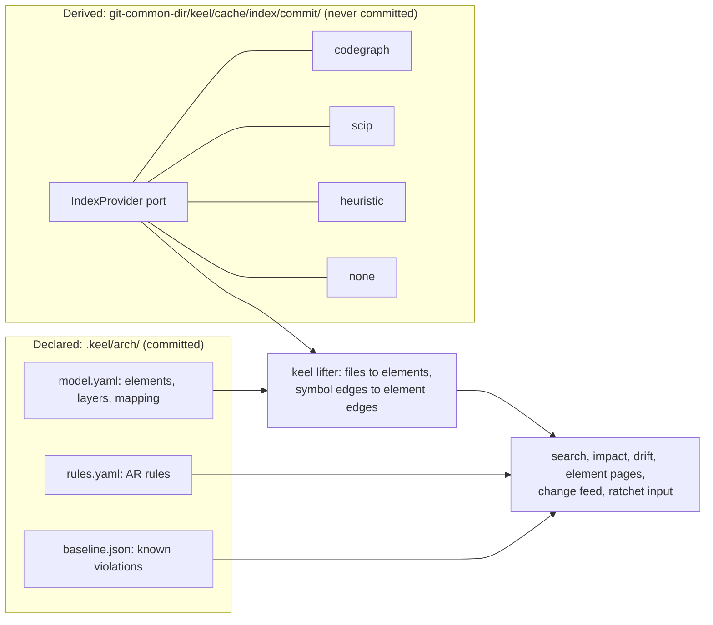
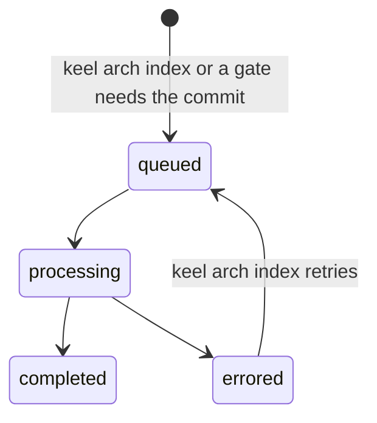
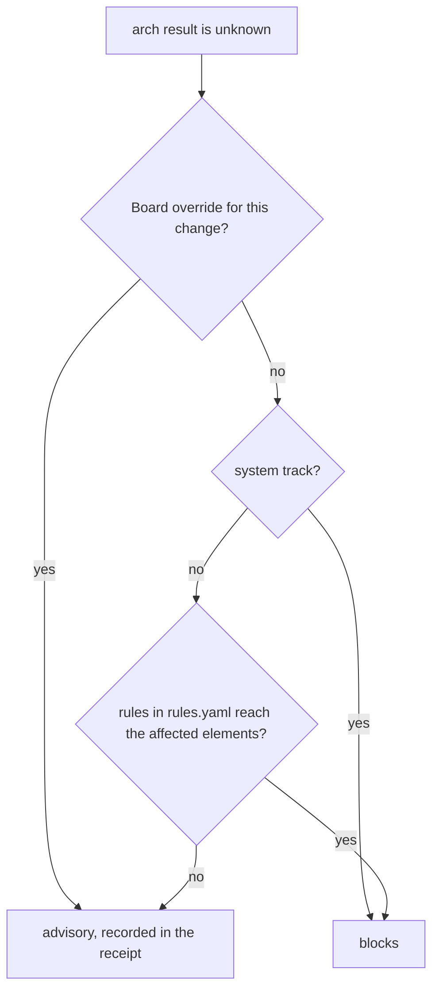
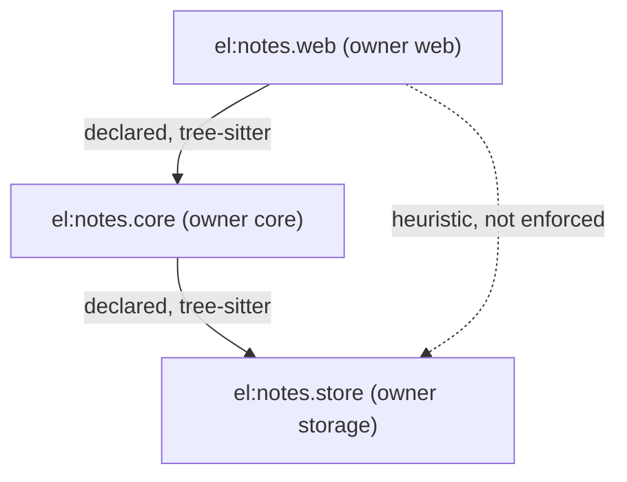

# Architecture intelligence

keel joins a declared architecture model, committed and owned by the architect seat and the Board, with a
derived model, an index rented from an external tool behind the IndexProvider port. The two are joined by
element ids, and every answer shows where its facts came from (provenance) and what commit they describe
(freshness). The spirit is Sourcegraph's code intelligence (per-commit indexes, definitions and references,
search) and arch-viewer's self-contained architecture view with click-through and a change feed. The decision
record is [ADR-0007](adr/ADR-0007-declared-vs-derived-architecture.md).

This document is the home of the declared model, the IndexProvider port, search, the index freshness
rules, architecture drift and the unknown policy, impact, element pages and the change feed. The `arch`
check itself is catalogued in [11-verification.md](11-verification.md), the track ratchet in
[03-lifecycle.md](03-lifecycle.md), and the dashboard's architecture view in
[08-dashboard.md](08-dashboard.md).

Milestone: M4 ([15-roadmap.md](15-roadmap.md)). M0 ships the schemas for the model, rules, baseline and
delta, a stub schema for reports (`schemas/arch-report.schema.json`) and stub types in `src/arch/`.



## Declared model

The declared model is committed under `.keel/arch/` and changes only through an `arch.delta.yaml` applied
by the land archive commit ([04-trace-and-state.md](04-trace-and-state.md)).

| File | Holds | Changed by |
| --- | --- | --- |
| `.keel/arch/model.yaml` | Elements, layers, path mapping | `arch.delta` at land |
| `.keel/arch/rules.yaml` | Executable rules `AR-<5>` | `arch.delta` at land; loosening needs a contract approval that includes it |
| `.keel/arch/baseline.json` | Frozen known violations | Shrinks freely; grows only through a contract approval |
| `.keel/arch/series.jsonl` | One metrics point per land | Appended by the archive commit |
| `.keel/decisions/ADR-<5>-<slug>.md` | Obligations with `applies_to` globs ([02-alignment.md](02-alignment.md)) | Promoted at land |

Elements follow the C4 hierarchy (system, container, component). Each element has `id` (`el:<dotted.slug>`),
`kind`, `parent`, `title`, `paths` (globs), `owner` (a label), `tags` (`layer:<name>`, `stakes:high`,
`public-api`), `relations` (`{to, kind}`) and `adrs`, a derived projection of the `governs` lists of accepted
decisions. The model also lists `layers` in order, and a
`mapping` with `overrides` and `ignore`. An illustrative model (schema:
[`schemas/arch-model.schema.json`](../schemas/arch-model.schema.json), template:
[`templates/project/arch-model.yaml`](../templates/project/arch-model.yaml)):

```yaml
layers:
  - web
  - core
  - store
elements:
  - id: el:notes
    kind: system
    parent: null
    title: Acme Notes
    paths: []
    owner: notes-team
    tags: []
    relations: []
    adrs: []
  - id: el:notes.web
    kind: container
    parent: el:notes
    title: HTTP API
    paths: ["src/web/**"]
    owner: web
    tags: ["layer:web", "public-api"]
    relations:
      - {to: el:notes.core, kind: uses}
    adrs: [ADR-7KQ2B]
  - id: el:notes.core
    kind: container
    parent: el:notes
    title: Note logic
    paths: ["src/core/**"]
    owner: core
    tags: ["layer:core"]
    relations:
      - {to: el:notes.store, kind: uses}
    adrs: []
  - id: el:notes.store
    kind: container
    parent: el:notes
    title: Note storage
    paths: ["src/store/**"]
    owner: storage
    tags: ["layer:store", "stakes:high"]
    relations: []
    adrs: [ADR-7KQ2B]
mapping:
  overrides: []
  ignore: ["dist/**"]
```

Rules are executable, in the tradition of dependency-cruiser, ArchUnit and import-linter. Each rule has
`id` (`AR-<5>`), `kind` (`forbidden`, `allowed`, `required`, `layers`, `acyclic`, `independent`), `from`
and `to` selectors (`{element: ...}`, `{tag: ...}`, `{owner: ...}`), `severity` (`error` or `warn`), `adr`
and `rationale`:

```yaml
rules:
  - id: AR-3M8QD
    kind: forbidden
    from: {element: el:notes.web}
    to: {element: el:notes.store}
    severity: error
    adr: null
    rationale: "The web layer reaches storage only through core."
```

`adr` cites the decision that introduced or changed a rule. An element's `adrs` list is never edited: the
`governs` list in each decision's frontmatter is the single source, and the governance commit that accepts
a decision and every land archive commit refresh the projection. In the acme-notes example the rules keep
`adr: null` because they date from adoption, while `ADR-7KQ2B`, accepted later, governs `el:notes.store` and
`el:notes.web` and restates the web-to-store boundary as its obligation `ADR-7KQ2B.O2`.

The baseline freezes violations that exist when a rule is introduced, so a new rule does not fail every
change on day one. It may shrink in any land; it grows only when a contract approval includes the growth.

Path mapping: every file maps to the element whose matching glob is the most specific; `mapping.overrides`
win over globs, and `mapping.ignore` removes paths from the model. Two equally specific globs make the
model ambiguous, which the frame gate reports. Unmapped files are listed, never guessed.

## IndexProvider port and backends

The derived half sits behind one port, `IndexProvider` in `src/arch/index-provider.ts`. Its shape follows
the pluggable IndexProvider of the arch_viz survey and Sourcegraph's code-intel API (per-commit uploads,
nearest indexed ancestor, definitions, references, search):

| Method | Returns |
| --- | --- |
| `status(commit)` | Upload state (`queued`, `processing`, `completed`, `errored`), nearest indexed ancestor, coverage, provenance mix |
| `search(query)` | Hits for a `text`, `symbol` or `path` query |
| `definitions(symbol)` | Definition sites |
| `references(symbol)` | Reference sites |
| `dependents(files, depth)` | Files and symbols that depend on the given files, to the given depth |

keel's own lifter computes everything architectural on top of the port: element edges, impact, and
affected tests (dependents intersected with the test globs).

Derived data is cached in `<git-common-dir>/keel/cache/index/<commit>/` and never committed.

| Backend | What it is | Edge provenance | Can fail the arch check |
| --- | --- | --- | --- |
| `codegraph` | Default when installed. MIT licensed, run as an external process, never vendored | As codegraph reports it, mapped to keel's enum (verify by probe) | Yes, with `tree-sitter` edges |
| `scip` | Import of an `index.scip` the user produced with a SCIP indexer | `scip` | Yes |
| `heuristic` | Built-in import scan plus text search | `heuristic` | No, advisory only |
| `none` | An honest "no index" | none | No; the check is reported as inert |

Constraints on codegraph, all verify by probe against the installed version:

- keel runs it only inside its own detached `_verify/<sha7>` or index checkout, never in a seat worktree
  or the user's checkout;
- keel uses only its index and query commands, never `init` or `install`, because those edit agent
  configuration;
- the environment sets `CODEGRAPH_TELEMETRY=0`, `DO_NOT_TRACK=1` and `CODEGRAPH_NO_DAEMON=1`;
- codegraph indexes the working directory and writes `.codegraph/` inside it (`CODEGRAPH_DIR` must be a
  plain directory name), so keel moves `.codegraph/` into the cache afterwards;
- `.codegraph/` is one of keel's managed lines in `.git/info/exclude`, which lives in the common directory,
  so no worktree ever shows it as untracked.

Every edge carries a provenance (`scip`, `tree-sitter`, `heuristic` or `llm`) and a confidence. An edge a
backend resolved by name only is `heuristic`. Only `scip` and `tree-sitter` edges are trusted provenance,
which is what can fail a gate (idea from codegraph: provenance and confidence on every edge).

## Search

`keel arch find <query>` searches the index's symbols and files and maps every hit to its element, the
element's owner, and the freshness of the index. It is the search pillar of Sourcegraph, scaled down to one
repository. The backend is codegraph's search or the SCIP symbols; the heuristic text search works without
an index, and its hits are labelled `heuristic`.

The same operation is mirrored in the MCP tool `keel_arch` (op `find`) and in the dashboard's search box,
which searches an embedded symbol and element list ([08-dashboard.md](08-dashboard.md)).

Illustrative output:

```text
$ keel arch find addTag
index    codegraph at 3f1c2e9 (head 3f1c2e9, fresh)   coverage 212/240 mapped files
symbol   TagStore.addTag        src/store/tags.ts:18        el:notes.store   owner storage   tree-sitter
ref      TagStore.addTag        src/core/notes.ts:57        el:notes.core    owner core      tree-sitter
text     "addTag"               docs/api.md:77              (unmapped)                       heuristic
```

## Per-commit index and diff overlay

Indexes are per commit, as in Sourcegraph. Each commit's index moves through the upload states:



`keel arch index [<commit>]` builds or refreshes an index in a detached checkout. When a question is asked
about commit C:

1. If C has a `completed` index, it answers directly.
2. Otherwise keel uses the nearest indexed trunk ancestor A and overlays the diff `A..C`: facts from the
   files changed in `A..C` are dropped and derived again for those files.
3. If the overlay fails (the backend cannot re-derive a file, or a rename cannot be mapped), everything that
   depends on those files is `unknown`.
4. With no usable index, the answer is `unknown`, or a labelled heuristic answer where one exists.

Every answer is stamped with the freshness record from `schemas/common.schema.json`: `computed_at`,
`head_commit`, `index_commit` (null when there is none) and `charter_version`. A stale index never produces
a pass; it produces `unknown`.

## Drift and the unknown policy

`keel arch drift [<commit>]` compares the derived element graph with the declared model and rules. The
verify gate's `arch` check runs it on the round commit, and the integration preview runs it on the combined
tips ([06-parallelism.md](06-parallelism.md)).

| Drift class | Severity | Meaning |
| --- | --- | --- |
| `undeclared-dependency` | error | A derived element edge with no declared relation |
| `forbidden-dependency` | error | A derived edge that a rule rejects |
| `element-cycle` | error | A cycle between elements |
| `unmapped-code` | warn | Files no element maps; new unmapped files block land |
| `phantom-relation` | info | A declared relation with no derived edge |
| `ownership-gap` | warn | An element or mapped path without an owner |
| `realization-mismatch` | see [04-trace-and-state.md](04-trace-and-state.md) | Requirements realized in elements the code does not touch, or the reverse |

Only NEW errors (not in the baseline) that are backed by `scip` or `tree-sitter` edges fail. A heuristic or
LLM edge is reported, never enforced.

The invariant proof: for every rule that reaches the affected elements, the report says whether it is
proven (evaluated on trusted edges from a fresh index covering the affected files) or unproven. A reviewer
reading the report sees which rules actually held, not only that nothing failed.

The unknown policy decides what an `unknown` arch result means:



The override is `keel approve <P> --rule override`. A team can tighten the policy (for example
`arch.unknown: block` in `.keel/config.yaml`), never loosen it below this default.

## Impact and the ratchet

Impact follows one path: changed files, then the symbols in them, then dependents at depth 2, then the
elements those belong to. The impact report lists:

- boundaries crossed (element edges the change reaches);
- owners of the reached elements;
- requirements realized in them;
- affected tests (dependents intersected with the test globs), which the acceptance run must include;
- collisions with other tasks' write sets ([06-parallelism.md](06-parallelism.md));
- predicted versus actual impact.

Predicted impact is computed at intake and per task at plan time and stored as `IM-<sha12>` records; actual
impact is computed from the diff at submit. The actual impact feeds the track ratchet: crossed boundaries,
touched rules and `public-api` tags can raise the track, never lower it. The rule is in
[03-lifecycle.md](03-lifecycle.md), including the path fallback used without an index (before M4, or with
backend `none`).

How architecture enters each phase ([03-lifecycle.md](03-lifecycle.md) has the phases):

| Phase | Architecture input |
| --- | --- |
| Intake | Predicted impact for track classification |
| Frame | `realized_in` element refs on requirements |
| Design (system) | `keel arch plan` typed ops: `add-element`, `add-relation`, `move-paths`, `tighten-rule`, `loosen-rule` (needs contract approval); `--suggest` drafts an `arch.delta.yaml` |
| Plan | Waves, reviewer routing by element owner, affected tests frozen into work orders |
| Build | A 2-4 KiB element brief compiled into the brief, plus MCP `keel_arch` |
| Submit | Actual impact and the ratchet |
| Verify | The `arch` check with the unknown policy |
| Land | The delta merge, plus one series point appended by the archive commit |
| Close | A before/after aggregate view |

The series point appended to `.keel/arch/series.jsonl` at land (one line in the file; the values are
illustrative and the normative shape is the M4 report schema):

```json
{
  "commit": "<integrated commit the metrics were computed on>",
  "violations_new": 0,
  "known": 3,
  "cross_element_edges": 41,
  "unmapped": 28,
  "churn_by_element": [{ "element": "el:notes.store", "lines": 112 }],
  "by_seat": [{ "seat": "engineer", "lines": 112 }],
  "by_runtime": [{ "runtime": "claude-code", "lines": 112 }]
}
```

The point names the integrated commit, not the archive commit that carries it, for the same reason the
receipt does not name the landed sha ([04-trace-and-state.md](04-trace-and-state.md)).

`keel audit --backfill` fills the series for history after the trace epoch. Scope-limited evidence reuse
relies on the same impact closure: from M4, evidence may be reused for a scope when the closure proves that
no dependency of that scope changed ([11-verification.md](11-verification.md)).

## Element pages and change feed

An element page is the same data in three places: `keel arch render <el:...>` in the CLI, `keel_arch` in
MCP, and a dialog in the dashboard. It shows:

- purpose, owner and relations;
- rules that reach the element, each with its proof status;
- obligations whose `applies_to` covers the element's paths;
- requirements realized in the element, with their RTM status;
- open drift;
- active claims touching it;
- the change feed: series points plus ledger land and round events that touched the element, newest first;
- a churn sparkline;
- index freshness.

Queries select elements with predicates that combine: `el:`, `owner:`, `tag:`, `touched-by:`, `req:` and
`since:`. For example `owner:storage tag:public-api`, `touched-by:P-7F3K9Q`, `req:R-notes-4QX7B`,
`since:2026-09-01`.

Exports: Mermaid for receipts and pull requests, and LikeC4 `.c4` later. An illustrative export, with
provenance carried by line style:



keel computes no scalar health score: arch-viewer's 0-100 score is a counter-example, as are its fabricated
edges. LLM narration of an element page is optional and labelled non-authoritative.

## Honesty and inert-check reporting

The rules that keep architecture answers honest (KP-12):

- every edge shows its provenance and confidence;
- every answer shows its freshness stamp, and a stale or failed overlay yields `unknown`;
- heuristic and LLM facts never fail a gate;
- every aggregate shows its denominator, for example `212/240 mapped files`;
- an inert check is reported as inert, never as a pass.

`keel doctor --section arch` says plainly when the architecture checks are inert: backend `none`, backend
`heuristic` only, or no `model.yaml`. The receipt and the dashboard's runtime health view carry the same
statement. Illustrative output:

```text
$ keel doctor --section arch
index backend   heuristic (codegraph not found)
model           .keel/arch/model.yaml: 14 elements, 212/240 files mapped, 28 unmapped
rules           6 rules, 1 baseline violation
arch check      INERT: heuristic edges cannot fail a gate; install codegraph or import an index.scip
freshness       index 3f1c2e9 = head 3f1c2e9
```

An index is never required for the non-architecture gates: without one, keel loses architecture checks
and says so, and every other guarantee still holds.
