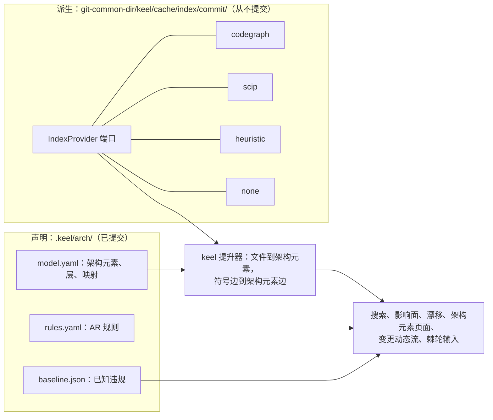
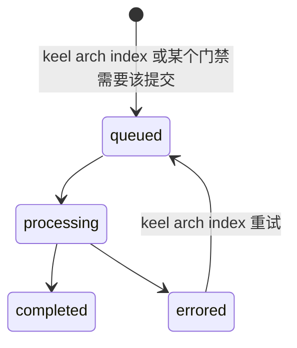
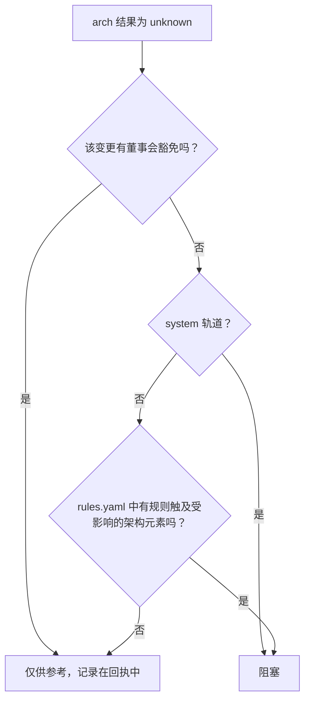
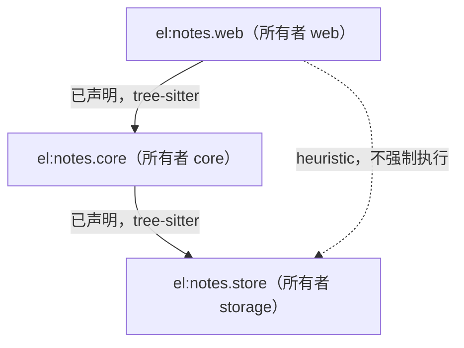

# 架构智能

> 英文原文（规范版本）：[07-architecture-intelligence.md](07-architecture-intelligence.md)。本文是其简体中文镜像，两者不一致时以英文版为准。

keel 把一个声明的架构模型（已提交，由架构席位（architect seat）和董事会（Board）拥有）与一个派生模型（通过 IndexProvider 端口从外部工具"租用"的索引）结合起来。二者通过架构元素（element）id 连接，每个答案都会显示其事实从何而来（来源，provenance）以及它描述的是哪个提交（新鲜度，freshness）。其精神来自 Sourcegraph 的代码智能（按提交的索引、定义与引用、搜索），以及 arch-viewer 的自包含架构视图（可点击跳转并带有变更动态流）。决策记录是 [ADR-0007](adr/ADR-0007-declared-vs-derived-architecture.zh-CN.md)。

本文是以下内容的归属文档：声明模型、IndexProvider 端口、搜索、索引新鲜度规则、架构漂移（drift）与 unknown 策略、影响面（impact）、架构元素页面以及变更动态流。`arch` 检查本身在 [11-verification.zh-CN.md](11-verification.zh-CN.md) 中编目，轨道（track）棘轮在 [03-lifecycle.zh-CN.md](03-lifecycle.zh-CN.md) 中，看板（dashboard）的架构视图在 [08-dashboard.zh-CN.md](08-dashboard.zh-CN.md) 中。

里程碑：M4（[15-roadmap.zh-CN.md](15-roadmap.zh-CN.md)）。M0 发布模型、规则、基线（baseline）和增量的 schema，报告的桩 schema（`schemas/arch-report.schema.json`），以及 `src/arch/` 中的桩类型。



## 声明模型

声明模型提交在 `.keel/arch/` 下，只能通过落地（land）归档提交所应用的 `arch.delta.yaml` 变更（[04-trace-and-state.zh-CN.md](04-trace-and-state.zh-CN.md)）。

| 文件 | 保存内容 | 变更方式 |
| --- | --- | --- |
| `.keel/arch/model.yaml` | 架构元素、层、路径映射 | 落地时的 `arch.delta` |
| `.keel/arch/rules.yaml` | 可执行规则 `AR-<5>` | 落地时的 `arch.delta`；放宽规则需要一次包含该放宽的契约审批 |
| `.keel/arch/baseline.json` | 冻结的已知违规 | 可以自由缩减；只能通过契约审批增长 |
| `.keel/arch/series.jsonl` | 每次落地一个指标点 | 由归档提交追加 |
| `.keel/decisions/ADR-<5>-<slug>.md` | 带有 `applies_to` glob 的义务（obligation）（[02-alignment.zh-CN.md](02-alignment.zh-CN.md)） | 落地时晋升 |

架构元素遵循 C4 层级（system、container、component）。每个架构元素都有 `id`（`el:<dotted.slug>`）、`kind`、`parent`、`title`、`paths`（glob）、`owner`（一个标签）、`tags`（`layer:<name>`、`stakes:high`、`public-api`）、`relations`（`{to, kind}`）和 `adrs`（已接受决策的 `governs` 列表的派生投影）。模型还按顺序列出 `layers`，以及一个带有 `overrides` 和 `ignore` 的 `mapping`。一个示意模型（schema：[`schemas/arch-model.schema.json`](../schemas/arch-model.schema.json)，模板：[`templates/project/arch-model.yaml`](../templates/project/arch-model.yaml)）：

```yaml
layers:
  - web
  - core
  - store
elements:
  - id: el:notes
    kind: system
    parent: null
    title: Acme Notes
    paths: []
    owner: notes-team
    tags: []
    relations: []
    adrs: []
  - id: el:notes.web
    kind: container
    parent: el:notes
    title: HTTP API
    paths: ["src/web/**"]
    owner: web
    tags: ["layer:web", "public-api"]
    relations:
      - {to: el:notes.core, kind: uses}
    adrs: [ADR-7KQ2B]
  - id: el:notes.core
    kind: container
    parent: el:notes
    title: Note logic
    paths: ["src/core/**"]
    owner: core
    tags: ["layer:core"]
    relations:
      - {to: el:notes.store, kind: uses}
    adrs: []
  - id: el:notes.store
    kind: container
    parent: el:notes
    title: Note storage
    paths: ["src/store/**"]
    owner: storage
    tags: ["layer:store", "stakes:high"]
    relations: []
    adrs: [ADR-7KQ2B]
mapping:
  overrides: []
  ignore: ["dist/**"]
```

规则是可执行的，沿袭 dependency-cruiser、ArchUnit 和 import-linter 的传统。每条规则都有 `id`（`AR-<5>`）、`kind`（`forbidden`、`allowed`、`required`、`layers`、`acyclic`、`independent`）、`from` 和 `to` 选择器（`{element: ...}`、`{tag: ...}`、`{owner: ...}`）、`severity`（`error` 或 `warn`）、`adr` 以及 `rationale`：

```yaml
rules:
  - id: AR-3M8QD
    kind: forbidden
    from: {element: el:notes.web}
    to: {element: el:notes.store}
    severity: error
    adr: null
    rationale: "The web layer reaches storage only through core."
```

`adr` 引用引入或修改某条规则的决策。架构元素的 `adrs` 列表从不被编辑：每个决策 frontmatter 中的 `governs` 列表是唯一来源，接受某个决策的治理提交以及每一次落地归档提交都会刷新这一投影。在 acme-notes 示例中，规则保持 `adr: null`，因为它们来自采用 keel 之时；而之后才被接受的 `ADR-7KQ2B` 治理 `el:notes.store` 和 `el:notes.web`，并以其义务 `ADR-7KQ2B.O2` 重申了 web 到 store 的边界。

基线冻结引入规则时已经存在的违规，这样新规则不会在第一天就让所有变更失败。它可以在任何一次落地中缩减；只有当契约审批包含这次增长时，它才会增长。

路径映射：每个文件映射到其匹配 glob 最具体的架构元素；`mapping.overrides` 优先于 glob，`mapping.ignore` 把路径从模型中移除。两个同样具体的 glob 会使模型产生歧义，框定门禁（frame gate）会报告这一点。未映射的文件会被列出，从不猜测。

## IndexProvider 端口与后端

派生的一半位于一个端口之后，即 `src/arch/index-provider.ts` 中的 `IndexProvider`。它的形态沿袭 arch_viz 调研中的可插拔 IndexProvider 以及 Sourcegraph 的 code-intel API（按提交上传、最近的已索引祖先、定义、引用、搜索）：

| 方法 | 返回 |
| --- | --- |
| `status(commit)` | 上传状态（`queued`、`processing`、`completed`、`errored`）、最近的已索引祖先、覆盖率、来源构成 |
| `search(query)` | `text`、`symbol` 或 `path` 查询的命中结果 |
| `definitions(symbol)` | 定义位置 |
| `references(symbol)` | 引用位置 |
| `dependents(files, depth)` | 依赖给定文件的文件和符号，直到给定深度 |

keel 自己的提升器（lifter）在该端口之上计算一切与架构相关的内容：架构元素边、影响面以及受影响的测试（依赖方与测试 glob 的交集）。

派生数据缓存在 `<git-common-dir>/keel/cache/index/<commit>/` 中，从不提交。

| 后端 | 是什么 | 边的来源 | 能否使 arch 检查失败 |
| --- | --- | --- | --- |
| `codegraph` | 安装时的默认后端。MIT 许可，作为外部进程运行，从不打包进 keel（vendored） | 按 codegraph 的报告，映射到 keel 的枚举（verify by probe（需通过探测验证）） | 能，基于 `tree-sitter` 边 |
| `scip` | 导入用户用 SCIP 索引器生成的 `index.scip` | `scip` | 能 |
| `heuristic` | 内置的导入扫描加文本搜索 | `heuristic` | 不能，仅供参考 |
| `none` | 诚实的"没有索引" | 无 | 不能；该检查报告为空转（inert） |

关于 codegraph 的约束，全部要针对已安装的版本 verify by probe：

- keel 只在它自己的分离 `_verify/<sha7>` 或索引检出中运行它，从不在席位（seat）工作树或用户的检出中运行；
- keel 只使用它的索引和查询命令，从不使用 `init` 或 `install`，因为它们会编辑 agent 配置；
- 环境设置 `CODEGRAPH_TELEMETRY=0`、`DO_NOT_TRACK=1` 和 `CODEGRAPH_NO_DAEMON=1`；
- codegraph 对工作目录建立索引并在其中写入 `.codegraph/`（`CODEGRAPH_DIR` 必须是普通目录名），因此 keel 事后把 `.codegraph/` 移到缓存中；
- `.codegraph/` 是 keel 在 `.git/info/exclude` 中管理的条目之一，该文件位于公共目录中，因此没有任何工作树会把它显示为未跟踪。

每条边都带有来源（`scip`、`tree-sitter`、`heuristic` 或 `llm`）和置信度。后端仅按名称解析出的边属于 `heuristic`。只有 `scip` 和 `tree-sitter` 边是可信来源，也就是能使门禁（gate）失败的来源（想法来自 codegraph：每条边都带来源和置信度）。

## 搜索

`keel arch find <query>` 搜索索引中的符号和文件，并把每个命中映射到其架构元素、该元素的所有者以及索引的新鲜度。它是 Sourcegraph 的搜索支柱缩小到单个仓库的版本。后端是 codegraph 的搜索或 SCIP 符号；启发式文本搜索无需索引即可工作，其命中结果标记为 `heuristic`。

同一操作也映射在 MCP 工具 `keel_arch`（op `find`）和看板的搜索框中，后者搜索一份嵌入的符号与架构元素列表（[08-dashboard.zh-CN.md](08-dashboard.zh-CN.md)）。

示意输出：

```text
$ keel arch find addTag
index    codegraph at 3f1c2e9 (head 3f1c2e9, fresh)   coverage 212/240 mapped files
symbol   TagStore.addTag        src/store/tags.ts:18        el:notes.store   owner storage   tree-sitter
ref      TagStore.addTag        src/core/notes.ts:57        el:notes.core    owner core      tree-sitter
text     "addTag"               docs/api.md:77              (unmapped)                       heuristic
```

## 按提交的索引与 diff 叠加

索引是按提交建立的，与 Sourcegraph 一样。每个提交的索引都会经历以下上传状态：



`keel arch index [<commit>]` 在分离检出中构建或刷新索引。当针对提交 C 提出问题时：

1. 如果 C 有 `completed` 索引，直接回答。
2. 否则 keel 使用最近的已索引主干祖先 A，并叠加 diff `A..C`：丢弃来自 `A..C` 中变更文件的事实，并针对这些文件重新推导。
3. 如果叠加失败（后端无法重新推导某个文件，或某次重命名无法映射），依赖这些文件的一切都是 `unknown`。
4. 没有可用索引时，答案是 `unknown`，或者在存在启发式答案时给出带标记的启发式答案。

每个答案都带有来自 `schemas/common.schema.json` 的新鲜度记录：`computed_at`、`head_commit`、`index_commit`（没有时为 null）和 `charter_version`。陈旧的索引从不产生通过；它产生 `unknown`。

## 漂移与 unknown 策略

`keel arch drift [<commit>]` 将派生的架构元素图与声明模型和规则进行比较。验证门禁的 `arch` 检查在轮次提交上运行它，集成预览在组合末端上运行它（[06-parallelism.zh-CN.md](06-parallelism.zh-CN.md)）。

| 漂移类别 | 严重程度 | 含义 |
| --- | --- | --- |
| `undeclared-dependency` | error | 没有已声明关系与之对应的派生架构元素边 |
| `forbidden-dependency` | error | 被某条规则拒绝的派生边 |
| `element-cycle` | error | 架构元素之间的环 |
| `unmapped-code` | warn | 没有任何架构元素映射的文件；新的未映射文件会阻塞落地 |
| `phantom-relation` | info | 没有派生边与之对应的已声明关系 |
| `ownership-gap` | warn | 没有所有者的架构元素或已映射路径 |
| `realization-mismatch` | 见 [04-trace-and-state.zh-CN.md](04-trace-and-state.zh-CN.md) | 需求实现在代码并未触及的架构元素中，或者反过来 |

只有由 `scip` 或 `tree-sitter` 边支撑的新错误（不在基线中）才会导致失败。启发式或 LLM 边只报告，从不强制执行。

不变量证明：对于每条触及受影响架构元素的规则，报告会说明它是已证明的（在覆盖受影响文件的新鲜索引上基于可信边求值）还是未证明的。阅读报告的评审者能看到哪些规则真正成立，而不仅仅是没有失败。

unknown 策略决定 `unknown` 的 arch 结果意味着什么：



豁免（override）通过 `keel approve <P> --rule override` 给出。团队可以收紧该策略（例如在 `.keel/config.yaml` 中设置 `arch.unknown: block`），但永远不能放宽到低于这一默认值。

## 影响面与棘轮

影响面只沿一条路径计算：变更文件，然后是其中的符号，然后是深度为 2 的依赖方，然后是这些依赖方所属的架构元素。影响面报告列出：

- 跨越的边界（变更触及的架构元素边）；
- 被触及架构元素的所有者；
- 实现在其中的需求（requirement）；
- 受影响的测试（依赖方与测试 glob 的交集），验收运行必须包含它们；
- 与其他任务写集合的碰撞（[06-parallelism.zh-CN.md](06-parallelism.zh-CN.md)）；
- 预测影响面与实际影响面的对比。

预测影响面在受理（intake）时计算，并在计划时逐任务计算，存储为 `IM-<sha12>` 记录；实际影响面在递交（submit）时根据 diff 计算。实际影响面输入轨道棘轮：跨越的边界、触及的规则以及 `public-api` 标签可以提升轨道，但从不降低。该规则见 [03-lifecycle.zh-CN.md](03-lifecycle.zh-CN.md)，包括没有索引时（M4 之前，或后端为 `none`）使用的路径回退。

架构如何进入每个阶段（阶段定义见 [03-lifecycle.zh-CN.md](03-lifecycle.zh-CN.md)）：

| 阶段 | 架构输入 |
| --- | --- |
| 受理 | 用于轨道分类的预测影响面 |
| 框定 | 需求上的 `realized_in` 架构元素引用 |
| 设计（system） | `keel arch plan` 类型化操作：`add-element`、`add-relation`、`move-paths`、`tighten-rule`、`loosen-rule`（需要契约审批）；`--suggest` 起草一个 `arch.delta.yaml` |
| 计划 | 波次、按架构元素所有者路由评审者、冻结到工单中的受影响测试 |
| 构建 | 编译进简报（brief）的 2-4 KiB 架构元素简报，外加 MCP `keel_arch` |
| 递交 | 实际影响面与棘轮 |
| 验证 | 带 unknown 策略的 `arch` 检查 |
| 落地 | 增量合并，外加由归档提交追加的一个序列点 |
| 关闭 | 前后对比的汇总视图 |

落地时追加到 `.keel/arch/series.jsonl` 的序列点（文件中的一行；数值仅作示意，规范结构以 M4 报告 schema 为准）：

```json
{
  "commit": "<integrated commit the metrics were computed on>",
  "violations_new": 0,
  "known": 3,
  "cross_element_edges": 41,
  "unmapped": 28,
  "churn_by_element": [{ "element": "el:notes.store", "lines": 112 }],
  "by_seat": [{ "seat": "engineer", "lines": 112 }],
  "by_runtime": [{ "runtime": "claude-code", "lines": 112 }]
}
```

该点写明的是集成提交，而不是承载它的归档提交，原因与回执（receipt）不写明落地 sha 相同（[04-trace-and-state.zh-CN.md](04-trace-and-state.zh-CN.md)）。

`keel audit --backfill` 为追踪起点之后的历史补全序列。限定范围的证据（evidence）复用依赖同一个影响面闭包：从 M4 起，当闭包证明某个范围的依赖都没有变化时，该范围的证据可以复用（[11-verification.zh-CN.md](11-verification.zh-CN.md)）。

## 架构元素页面与变更动态流

架构元素页面是在三个地方呈现的同一份数据：CLI 中的 `keel arch render <el:...>`、MCP 中的 `keel_arch`，以及看板中的一个对话框。它显示：

- 用途、所有者和关系；
- 触及该架构元素的规则，每条都带证明状态；
- `applies_to` 覆盖该架构元素路径的义务；
- 实现在该架构元素中的需求，及其 RTM 状态；
- 未解决的漂移；
- 触及它的活动认领（claim）；
- 变更动态流：序列点加上触及该架构元素的账本（ledger）落地事件和轮次事件，最新的在前；
- 变动迷你走势图（sparkline）；
- 索引新鲜度。

查询使用可组合的谓词选择架构元素：`el:`、`owner:`、`tag:`、`touched-by:`、`req:` 和 `since:`。例如 `owner:storage tag:public-api`、`touched-by:P-7F3K9Q`、`req:R-notes-4QX7B`、`since:2026-09-01`。

导出：用于回执和拉取请求的 Mermaid，以后还有 LikeC4 `.c4`。一个示意导出，来源由线型表示：



keel 不计算标量健康分：arch-viewer 的 0-100 分数是反例，它伪造的边也是。对架构元素页面的 LLM 叙述是可选的，并标记为非权威。

## 诚实性与空转检查报告

保持架构答案诚实的规则（KP-12）：

- 每条边都显示其来源和置信度；
- 每个答案都显示其新鲜度标记，陈旧或失败的叠加产生 `unknown`；
- 启发式和 LLM 事实从不使门禁失败；
- 每个汇总都显示其分母，例如 `212/240 mapped files`；
- 空转检查报告为空转，从不报告为通过。

`keel doctor --section arch` 会明确说明架构检查何时处于空转状态：后端为 `none`、只有 `heuristic` 后端，或者没有 `model.yaml`。回执和看板的运行时健康视图带有同样的说明。示意输出：

```text
$ keel doctor --section arch
index backend   heuristic (codegraph not found)
model           .keel/arch/model.yaml: 14 elements, 212/240 files mapped, 28 unmapped
rules           6 rules, 1 baseline violation
arch check      INERT: heuristic edges cannot fail a gate; install codegraph or import an index.scip
freshness       index 3f1c2e9 = head 3f1c2e9
```

非架构门禁从不需要索引：没有索引时，keel 失去架构检查并如实说明，其他所有保证依然成立。
