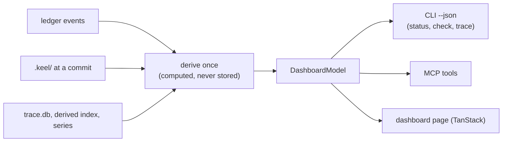

# Read-only dashboard

`keel dashboard build` renders one self-contained HTML file that shows the state of the company: goals,
proposals, the trace, the architecture, seats, evidence, runtime health and the change feed. An optional
`keel dashboard serve` shows the same page on loopback with live updates. The dashboard is read-only:
there is no second approval path, and every Board action is a copyable `keel approve ...` command run in a
terminal ([ADR-0008](adr/ADR-0008-read-only-dashboard.md)). Its frontend is built with TanStack
([ADR-0009](adr/ADR-0009-tanstack-frontend.md)).

This document is the home of the dashboard's technology rules
([ADR-0009](adr/ADR-0009-tanstack-frontend.md) records the decision), views, layout and serve boundary.
What the views display is defined elsewhere: states in [03-lifecycle.md](03-lifecycle.md), trace and drift
in [04-trace-and-state.md](04-trace-and-state.md), architecture in
[07-architecture-intelligence.md](07-architecture-intelligence.md), gates and evidence in
[11-verification.md](11-verification.md), exposure in [14-trust-security.md](14-trust-security.md).

Milestone: M5 writes the TanStack application, its render and client bundles and the CSS tokens
([15-roadmap.md](15-roadmap.md)); M0 ships only the hand-written static mock
[`examples/dashboard/sample.html`](../examples/dashboard/sample.html), which shows the markup and token
rules the application must reproduce, and the stub type `src/dashboard/model.ts`. The mock predates
ADR-0009 and stays hand-written; it is an illustration of the rules, not the application.

## TanStack, headless, over native markup

Every frontend keel ships is built with TanStack libraries on the React adapter (P2,
[ADR-0009](adr/ADR-0009-tanstack-frontend.md)). The libraries are headless: they manage state and behaviour
and render nothing, so the markup stays native HTML elements with hand-written CSS. No UI kit, no CSS
framework, no icon font, no web font, no CDN.

| Library | Used for |
| --- | --- |
| Router, with hash history | The eight views as routes, linkable as `#/trace`; works from `file://`. All eight views are always in the tree: the matched route sets `aria-current` on the nav, scrolls to the view and carries search-param state (sort, filter, selected element); it never mounts or unmounts a view |
| Query | The model: `initialData` from the embedded JSON when built, invalidation on server-sent events when served. In build mode the model query has no fetch function, `staleTime: Infinity` and refetching disabled, so the page performs no request of any kind; only serve mode registers the `/api/model` fetcher |
| Table | The RTM, gate results, the capability and conformance matrices, findings; sorting, filtering, column visibility, always with the `n of N rows` denominator (see "Accessibility and budgets") |
| Virtual | The change feed, the ledger tail, the symbol list; each is pre-rendered in full, and Virtual takes over only after the first user scroll |
| Form, Store | Not used: a read-only page needs neither |

Because the libraries render nothing, the markup belongs to keel and uses these native elements:

| Element | Used for |
| --- | --- |
| `header`, `nav` | The view navigation, as hash routes (`#/trace`); each view is a `section` whose `id` equals the route path (`/trace`), so the fragment works as an anchor without JavaScript |
| `table` with `caption` and `th scope` | The RTM, gate results, the capability and conformance matrices |
| `details` / `summary` | Expandable findings, evidence rows and Board queue items |
| `dialog` | The element page in the architecture view |
| `meter` / `progress` | Goal progress and budgets, always with the denominator as visible text |
| `input type="search"` | `arch find` over the embedded symbol and element list |
| `fieldset` with checkboxes | Architecture overlays |
| Inline SVG | The architecture diagram and sparklines |

CSS is a set of custom-property tokens with a light and a dark value, switched by
`prefers-color-scheme`, and a system font stack:

```css
:root {
  --bg: #ffffff;
  --fg: #1f2328;
  --line: #d1d9e0;
  --pass: #1a7f37;
  --fail: #cf222e;
  --unknown: #6e7781;
  font-family: system-ui, sans-serif;
}
@media (prefers-color-scheme: dark) {
  :root {
    --bg: #0d1117;
    --fg: #e6edf3;
    --line: #3d444d;
    --pass: #3fb950;
    --fail: #f85149;
    --unknown: #9198a1;
  }
}
```

**Pre-rendered, then hydrated.** `keel dashboard build` renders the React tree to static HTML with the
model embedded in a `<script type="application/json">` block, inlines the client bundle and writes one
file. The static HTML shows every view without JavaScript: all eight views are always rendered, pre-rendered
and hydrated alike, and long lists are pre-rendered in full. The bundled TanStack code then hydrates the page
and adds sorting, filtering, search, overlays, the element dialog and live refresh; the router never mounts
or unmounts a view, and Virtual windows a list only after the first user scroll, so the hydration snapshot
equals the pre-rendered tree. Hydration must not change the markup (an M5 golden test hydrates at a fixed set
of locations, at least `#/` and one deep link such as `#/trace`, and compares the pre-rendered and the
hydrated tree). Without JavaScript, element pages are ordinary sections reached by anchor links.

**Bundled, not depended upon.** The frontend and its libraries are compiled at package build time into two
self-contained bundles shipped inside the npm package: a render bundle that keel imports to pre-render, and
the client bundle that it inlines. `react`, `react-dom` and the `@tanstack/*` packages are development
dependencies of keel only, never entries in `dependencies`; the runtime dependency list of
[ADR-0002](adr/ADR-0002-node-windows-native.md) is unchanged, and no frontend code loads for any other
command.

## One model, many renderers

The dashboard has no data of its own. It renders `DashboardModel` (`src/dashboard/model.ts`), the same
model that the CLI's `--json` output and the MCP tools use, so the three can never disagree.



- The model is computed from ledger events, the committed `.keel/` files and the derived caches. Nothing in
  it is stored state; the only file written is the rendered page.
- `keel dashboard build [--out <file>]` writes one self-contained file, by default
  `<git-common-dir>/keel/cache/dashboard/index.html`. CSS and the client bundle (the TanStack and React
  code, compiled at package build) are inline. The embedded data is the `DashboardModel`, including the
  symbol and element list for search, in a `<script type="application/json">` block; it feeds the page's
  Query cache as `initialData`.
- In serve mode the same Query cache is fed from `/api/model` and invalidated by server-sent events, so a
  page built from disk and a page served on loopback render the same model through the same code.
- The page header carries the freshness stamp: head commit, ledger chain head, index commit and
  `computed_at`. The stamp comes from the model alone, never from a build timestamp.
- The model holds names only: profile aliases, env var names with SET or UNSET, declared families. It never
  holds a provider value, because keel never reads one ([10-providers.md](10-providers.md)).
- The M5 golden tests require the same states and denominators as the `check --json` and `trace --json`
  golden outputs.

## Eight views

### Overview

- Goal progress: requirements verified at head over total, per goal, as a `meter` with the fraction in text.
- Proposals by computed state.
- Failing gates.
- The Board queue, each item with what to read and the copyable command:
  - approvals due, with what each asks the Board to read;
  - rulings by cost-if-wrong;
  - open asks;
  - degraded and unverified lanes awaiting a ruling;
  - liveness orphans;
  - unacknowledged receipts;
  - unapproved, invalidated or expiring documents and policies;
  - reserved-operation alerts.
- Budgets per goal and proposal, warning at 80%.

### Trace

The RTM table from `keel trace --matrix` ([04-trace-and-state.md](04-trace-and-state.md)). Gap cells carry
text labels such as `no evidence at head` or `stale verdict`, never only a colour.

### Architecture

- A deterministic layered SVG of the declared model (see "Deterministic layout").
- Edge styles: declared relations solid, forbidden edges red with a `forbidden` label, heuristic edges
  dashed, phantom relations dotted.
- Overlays, toggled by checkboxes: drift, staleness, impact, ownership, active claims, collisions.
- A search box running `arch find` over the embedded list, and the element page in a `dialog`, including its
  change feed ([07-architecture-intelligence.md](07-architecture-intelligence.md)).

### Org

- Seats with their runtime, profile alias, declared family and tier.
- Active runs, claims, heartbeats and budgets.
- Track records per route.
- The conformance matrix per (seat, runtime, alias, revision): `verified`, `failed` or `unverified`.

### Proposals

A state strip per proposal; gate results with `pass`, `fail`, `not_run`, `unknown` and `waived` shown as
distinct words; the current fix round; independence, always labelled `declared`; and the origin
(Board-approved request or contract approval).

### Evidence and receipts

Evidence per commit, land re-execution results, stale evidence, gates not run, remaining risks, and the
ACC to command table of each receipt.

### Runtime health

- The capability matrix with each fact's verification status.
- Hook journal outcomes with denominators (hooks fail open, so the journal shows how often they ran).
- The exposure profile per route: tool env exposure, tool file exposure, control plane exposure, shim
  coverage.
- Inert architecture checks, as `keel doctor` reports them.

### Series and change feed

Sparklines from `.keel/arch/series.jsonl`, and a repository-wide feed of land and round events per element,
newest first.

## Deterministic layout

The architecture SVG is laid out by a fixed algorithm, so the same model and data always produce a
byte-identical SVG. There is no force-directed layout and no randomness, which keeps the picture stable
between builds and diffable in review.

1. Nesting: C4 containment (system, container, component) becomes nested boxes. Each parent's children
   are laid out on their own, bottom-up.
2. Layer bands: elements tagged `layer:<name>` go into bands in the order of the model's `layers` list.
3. Layering within a band: longest-path layering over the declared relations. Layout uses declared
   relations only, so the picture moves when the model changes, not when code changes; derived edges are
   drawn over it. Cycles are broken by ignoring the back edges a depth-first search finds when it visits
   elements in id order (a cycle is already reported as drift).
4. Ordering within a layer: barycenter ordering in three sweeps (down, up, down); ties are broken by
   element id.
5. Coordinates: a fixed grid. Box widths come from label length times a fixed factor, not from font
   metrics, so they do not depend on the viewer's fonts.
6. Edges: drawn with the styles listed under "Architecture", each with a text label where colour alone
   would carry meaning.

## serve security boundary

`keel dashboard serve [--port 0]` is optional. It is a `node:http` server with these limits:

- It binds `127.0.0.1` only, on an ephemeral port by default (`--port 0` lets the OS choose), and prints
  the URL.
- Every request is checked: the `Host` header must be `127.0.0.1:<port>` or `localhost:<port>`, and an
  `Origin` header, when present, must be that same origin; anything else is refused. This defends against
  DNS rebinding and cross-site requests (an idea from codegraph's loopback server).
- Only `GET` and `HEAD` are served: the page, the read-only model at `/api/model`, and a server-sent events
  stream that tails the ledger and sends new events after the typed-field whitelist
  ([04-trace-and-state.md](04-trace-and-state.md)). The page's Query cache invalidates on each event and
  refetches `/api/model`; the events carry no model of their own.
- There are no write endpoints, no cookies and no CORS headers. Board actions appear only as copyable
  `keel approve ...` commands, because an approval is an explicit confirmation of a shown change at the
  Board's terminal
  ([02-alignment.md](02-alignment.md)).
- jj reads use `--ignore-working-copy`, so serving never snapshots a working copy.

Loopback is not a user boundary: another local process, including one running as another user, can connect
to the port. The data is names-only and read-only, but it includes requirement text and file paths; the
threat model in [14-trust-security.md](14-trust-security.md) covers this.

## Accessibility and budgets

These rules hold because the markup is native and the libraries render nothing:

- Keyboard navigation works everywhere, because every control is a native link, button, input or
  `dialog`; focus is always visible, and Escape closes the element page.
- Every colour has a text label: statuses are words, edge styles have a legend and labels, and gap cells
  say what is missing.
- `prefers-reduced-motion` is respected; the page has no animation it needs.
- Tables have a `caption` and `th scope`; `meter` and `progress` always show their denominator as text.
- A filtered or sorted table always shows `n of N rows` with N taken from the model, and filtering never
  changes any meter, progress or count derived from the model; the M5 golden test for states and denominators
  runs with a filter applied as well as without one.

Budgets, checked in M5:

| Budget | Limit |
| --- | --- |
| Page size for a 5,000-file repository | Under 2 MB |
| Inline JavaScript | Under 600 KB minified (the client bundle only), inline; the embedded model JSON counts toward the page-size budget |
| External requests | None: no CDN, no web fonts; the file works when opened from disk |
| Without JavaScript | Every view renders from the pre-rendered HTML; sorting, filtering, search, overlays, the element dialog and live refresh need it |
| Hydration | Changes no markup (golden test) |
| Write endpoints in serve mode | None |
| Determinism | Same model and keel version give a byte-identical page |
