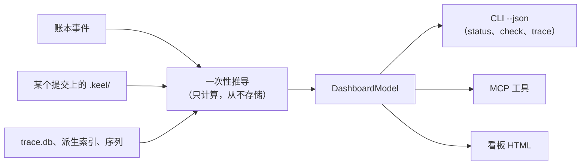

# 只读看板

> 英文原文（规范版本）：[08-dashboard.md](08-dashboard.md)。本文是其简体中文镜像，两者不一致时以英文版为准。

`keel dashboard build` 渲染一个自包含的 HTML 文件，展示公司的状态：目标（goal）、提案（proposal）、追踪、架构、席位（seat）、证据（evidence）、运行时（runtime）健康状况和变更动态流。可选的 `keel dashboard serve` 在回环地址上展示同一页面并实时更新。看板（dashboard）是只读的：不存在第二条审批路径，每一项董事会（Board）操作都是一条可复制的 `keel approve ...` 命令，在终端中运行（[ADR-0008](adr/ADR-0008-read-only-dashboard.zh-CN.md)）。

本文是看板的技术规则、视图、布局和 serve 边界的归属文档。视图显示的内容在其他地方定义：状态见 [03-lifecycle.zh-CN.md](03-lifecycle.zh-CN.md)，追踪与漂移（drift）见 [04-trace-and-state.zh-CN.md](04-trace-and-state.zh-CN.md)，架构见 [07-architecture-intelligence.zh-CN.md](07-architecture-intelligence.zh-CN.md)，门禁（gate）与证据见 [11-verification.zh-CN.md](11-verification.zh-CN.md)，暴露面见 [14-trust-security.zh-CN.md](14-trust-security.zh-CN.md)。

里程碑：M5 编写 HTML 外壳和 CSS（[15-roadmap.zh-CN.md](15-roadmap.zh-CN.md)）。M0 只发布静态样例 [`examples/dashboard/sample.html`](../examples/dashboard/sample.html) 和桩类型 `src/dashboard/model.ts`。

## 原生 HTML 与手写 CSS

看板只使用原生 HTML 元素和手写 CSS（P2）。不使用框架，不使用组件库，不使用 CDN，不使用网络字体。

| HTML 元素 | 用途 |
| --- | --- |
| `header`、`nav` | 视图导航，以页内锚点链接实现 |
| 带 `caption` 和 `th scope` 的 `table` | RTM、门禁结果、能力矩阵与一致性测评矩阵 |
| `details` / `summary` | 可展开的发现项（finding）、证据行和董事会队列条目 |
| `dialog` | 架构视图中的架构元素（element）页面 |
| `meter` / `progress` | 目标进度和预算，始终以可见文字显示分母 |
| `input type="search"` | 在嵌入的符号与架构元素列表上执行 `arch find` |
| 带复选框的 `fieldset` | 架构叠加层 |
| 内联 SVG | 架构图和迷你走势图 |

CSS 是一组自定义属性令牌，每个都有浅色值和深色值，通过 `prefers-color-scheme` 切换，并使用系统字体栈：

```css
:root {
  --bg: #ffffff;
  --fg: #1f2328;
  --line: #d1d9e0;
  --pass: #1a7f37;
  --fail: #cf222e;
  --unknown: #6e7781;
  font-family: system-ui, sans-serif;
}
@media (prefers-color-scheme: dark) {
  :root {
    --bg: #0d1117;
    --fg: #e6edf3;
    --line: #3d444d;
    --pass: #3fb950;
    --fail: #f85149;
    --unknown: #9198a1;
  }
}
```

页面在没有 JavaScript 时完全可读：每个视图都在构建时渲染为静态 HTML。至多约 300 行原生 JavaScript 用于添加过滤、搜索框、叠加层开关、在 `dialog` 中打开架构元素页面，以及 serve 模式下的刷新。没有 JavaScript 时，架构元素页面是通过锚点链接到达的普通章节。

## 一个模型，多种渲染器

看板没有自己的数据。它渲染 `DashboardModel`（`src/dashboard/model.ts`），这与 CLI 的 `--json` 输出和 MCP 工具使用的是同一个模型，因此三者永远不会不一致。



- 模型由账本（ledger）事件、已提交的 `.keel/` 文件和派生缓存计算得出。其中没有任何内容是存储的状态；唯一写入的文件是渲染出的页面。
- `keel dashboard build [--out <file>]` 写出一个自包含文件，默认为 `<git-common-dir>/keel/cache/dashboard/index.html`。CSS 和 JavaScript 都内联；唯一嵌入的数据是用于搜索的符号与架构元素列表，位于一个 `<script type="application/json">` 块中。
- 页面头部带有新鲜度标记：head 提交、账本链头、索引提交和 `computed_at`。
- 模型只保存名称：配置档别名、带 SET 或 UNSET 状态的环境变量名、声明的模型家族（declared family）。它从不保存模型提供方（provider）的值，因为 keel 从不读取这些值（[10-providers.zh-CN.md](10-providers.zh-CN.md)）。
- M5 的黄金测试要求其状态和分母与 `check --json` 和 `trace --json` 的黄金输出相同。

## 八个视图

### 概览

- 目标进度：按目标显示 head 处已验证的需求数与总数之比，用 `meter` 表示，并以文字给出该分数。
- 按计算状态分组的提案。
- 失败的门禁。
- 董事会队列，每个条目都附有要阅读的内容和可复制的命令：
  - 到期的审批，并说明每项审批要求董事会阅读什么；
  - 按错判代价排序的裁定（ruling）；
  - 未决的提问；
  - 等待裁定的降级（degraded）通道和未验证通道；
  - 活性孤儿；
  - 未确认的回执（receipt）；
  - 未签名或已过期的文档；
  - 已加载到 ssh-agent 中的签名者密钥；
  - 保留操作告警。
- 按目标和提案的预算，在 80% 时发出警告。

### 追踪

来自 `keel trace --matrix` 的 RTM 表（[04-trace-and-state.zh-CN.md](04-trace-and-state.zh-CN.md)）。缺口单元格带有文字标签，例如 `no evidence at head` 或 `stale verdict`，从不只用颜色表示。

### 架构

- 声明模型的确定性分层 SVG（见"确定性布局"）。
- 边的样式：已声明关系为实线，禁止的边为红色并带 `forbidden` 标签，启发式边为虚线，幻影关系为点线。
- 由复选框切换的叠加层：漂移、陈旧度、影响面（impact）、所有权、活动认领（claim）、碰撞。
- 一个在嵌入列表上运行 `arch find` 的搜索框，以及位于 `dialog` 中的架构元素页面，包括其变更动态流（[07-architecture-intelligence.zh-CN.md](07-architecture-intelligence.zh-CN.md)）。

### 组织

- 席位及其运行时、配置档别名、声明的模型家族和档位（tier）。
- 活动运行、认领、心跳和预算。
- 每条路由的历史表现记录（track record）。
- 按（席位、运行时、别名、修订版本）组织的一致性测评矩阵：`verified`、`failed` 或 `unverified`。

### 提案

每个提案一条状态条；门禁结果以不同的词显示 `pass`、`fail`、`not_run`、`unknown` 和 `waived`；当前修复轮次；独立性，始终标记为 `declared`；以及起源（董事会签名的请求或契约审批）。

### 证据与回执

按提交的证据、落地（land）重新执行的结果、陈旧证据、未运行的门禁、剩余风险，以及每份回执中的 ACC 到命令对照表。

### 运行时健康

- 能力矩阵，附带每项事实的验证状态。
- 带分母的钩子日志结果（钩子失败时放行，因此日志会显示它们实际运行的频率）。
- 每条路由的暴露面画像（exposure profile）：工具环境暴露、工具文件暴露、控制平面暴露、垫片覆盖率。
- 空转（inert）的架构检查，与 `keel doctor` 的报告一致。

### 序列与变更动态流

来自 `.keel/arch/series.jsonl` 的迷你走势图，以及按架构元素划分的仓库级落地与轮次事件动态流，最新的在前。

## 确定性布局

架构 SVG 由固定算法布局，因此相同的模型和数据总是产生逐字节相同的 SVG。没有力导向布局，也没有随机性，这使图在多次构建之间保持稳定，并且可以在评审中比较差异。

1. 嵌套：C4 包含关系（system、container、component）变成嵌套的框。每个父元素的子元素各自独立布局，自底向上进行。
2. 层带：带有 `layer:<name>` 标签的架构元素按模型 `layers` 列表的顺序放入各个带中。
3. 带内分层：在已声明关系上做最长路径分层。布局只使用已声明关系，因此图随模型变化而移动，而不随代码变化而移动；派生边绘制在其上。环通过忽略深度优先搜索按 id 顺序访问架构元素时发现的回边来打破（环本身已作为漂移报告）。
4. 层内排序：重心排序，进行三轮扫描（下、上、下）；平局按架构元素 id 打破。
5. 坐标：固定网格。框宽由标签长度乘以固定系数得出，而不是由字体度量得出，因此不依赖查看者的字体。
6. 边：按"架构"一节列出的样式绘制，在仅靠颜色表达含义的地方，每条边都带文字标签。

## serve 安全边界

`keel dashboard serve [--port 0]` 是可选的。它是一个 `node:http` 服务器，具有以下限制：

- 它只绑定 `127.0.0.1`，默认使用临时端口（`--port 0` 让操作系统选择），并打印 URL。
- 每个请求都会被检查：`Host` 头必须是 `127.0.0.1:<port>` 或 `localhost:<port>`，而 `Origin` 头（如果存在）必须是同一来源；其他任何情况都会被拒绝。这可以防御 DNS 重绑定和跨站请求（想法来自 codegraph 的回环服务器）。
- 只提供 `GET` 和 `HEAD`：页面、位于 `/api/model` 的只读模型，以及一个 server-sent events 流，它跟踪账本的尾部，并在经过类型化字段白名单过滤后发送新事件（[04-trace-and-state.zh-CN.md](04-trace-and-state.zh-CN.md)）。
- 没有写入端点、没有 cookie、没有 CORS 头。董事会操作只以可复制的 `keel approve ...` 命令出现，因为签名需要董事会在终端中使用其密钥（[02-alignment.zh-CN.md](02-alignment.zh-CN.md)）。
- jj 读取使用 `--ignore-working-copy`，因此提供服务时从不会对工作副本做快照。

回环不是用户边界：另一个本地进程，包括以其他用户身份运行的进程，都可以连接到该端口。数据只含名称且只读，但其中包括需求文本和文件路径；[14-trust-security.zh-CN.md](14-trust-security.zh-CN.md) 中的威胁模型涵盖了这一点。

## 无障碍与预算

- 键盘导航在所有地方都可用，因为每个控件都是原生的链接、按钮、输入框或 `dialog`；焦点始终可见，Escape 键关闭架构元素页面。
- 每种颜色都有文字标签：状态是词语，边的样式有图例和标签，缺口单元格说明缺少什么。
- 遵循 `prefers-reduced-motion`；页面没有任何必需的动画。
- 表格有 `caption` 和 `th scope`；`meter` 和 `progress` 始终以文字显示其分母。

预算，在 M5 中检查：

| 预算 | 限制 |
| --- | --- |
| 5,000 个文件的仓库的页面大小 | 小于 2 MB |
| JavaScript | 约 300 行，原生，内联 |
| 外部请求 | 无：没有 CDN，没有网络字体；从磁盘打开文件即可工作 |
| 没有 JavaScript 时 | 每个视图都能正确渲染和阅读 |
| serve 模式下的写入端点 | 无 |
