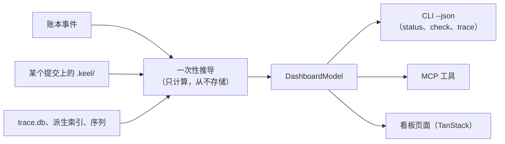

# 只读看板

> 英文原文（规范版本）：[08-dashboard.md](08-dashboard.md)。本文是其简体中文镜像，两者不一致时以英文版为准。

`keel dashboard build` 渲染一个自包含的 HTML 文件，展示公司的状态：目标（goal）、提案（proposal）、追踪、架构、席位（seat）、证据（evidence）、运行时（runtime）健康状况和变更流。可选的 `keel dashboard serve` 在回环地址上展示同一页面并实时更新。看板（dashboard）是只读的：不存在第二条审批路径，每一项董事会（Board）操作都是一条可复制的 `keel approve ...` 命令，在终端中运行（[ADR-0008](adr/ADR-0008-read-only-dashboard.zh-CN.md)）。它的前端使用 TanStack 构建（[ADR-0009](adr/ADR-0009-tanstack-frontend.zh-CN.md)）。

本文是看板的技术规则（决策记录见 [ADR-0009](adr/ADR-0009-tanstack-frontend.zh-CN.md)）、视图、布局和 serve 边界的归属文档。视图显示的内容在其他地方定义：状态见 [03-lifecycle.zh-CN.md](03-lifecycle.zh-CN.md)，追踪与漂移（drift）见 [04-trace-and-state.zh-CN.md](04-trace-and-state.zh-CN.md)，架构见 [07-architecture-intelligence.zh-CN.md](07-architecture-intelligence.zh-CN.md)，门禁（gate）与证据见 [11-verification.zh-CN.md](11-verification.zh-CN.md)，暴露面见 [14-trust-security.zh-CN.md](14-trust-security.zh-CN.md)。

里程碑：M5 编写 TanStack 应用、它的渲染打包产物与客户端打包产物，以及 CSS 令牌（[15-roadmap.zh-CN.md](15-roadmap.zh-CN.md)）；M0 只发布手写的静态样例 [`examples/dashboard/sample.html`](../examples/dashboard/sample.html)，它展示应用必须复现的标记规则和令牌规则，以及桩类型 `src/dashboard/model.ts`。该样例早于 ADR-0009，并保持手写；它是规则的示意，不是应用本身。

## TanStack：无头库，原生标记

keel 发布的每一个前端都使用 TanStack 库，基于 React 适配器构建（P2，[ADR-0009](adr/ADR-0009-tanstack-frontend.zh-CN.md)）。这些库是无头（headless）的：它们管理状态和行为，自身不渲染任何东西，因此标记仍然是原生 HTML 元素加手写 CSS。不使用 UI 套件，不使用 CSS 框架，不使用图标字体，不使用 Web 字体，不使用 CDN。

| 库 | 用途 |
| --- | --- |
| Router，使用 hash history | 八个视图作为路由，可以 `#/trace` 的形式链接；从 `file://` 打开也能工作。八个视图始终都在树中：匹配的路由只在导航上设置 `aria-current`、滚动到该视图并携带查询参数状态（排序、过滤、选中的架构元素）；它从不挂载或卸载任何视图 |
| Query | 模型：build 模式下以嵌入的 JSON 作为 `initialData`，serve 模式下在收到 server-sent events 时失效。build 模式下模型查询没有 fetch 函数、`staleTime: Infinity` 且禁用重新获取，因此页面不发出任何类型的请求；只有 serve 模式注册 `/api/model` 的获取器 |
| Table | RTM、门禁结果、能力矩阵与一致性测评矩阵、发现项（finding），带排序、过滤和列可见性，并始终显示 `n of N rows` 分母（见“无障碍与预算”） |
| Virtual | 变更流、账本尾部、符号列表；每个列表都完整预渲染，Virtual 只在用户第一次滚动后接管 |
| Form、Store | 不使用：只读页面两者都不需要 |

因为这些库不渲染任何东西，标记归 keel 所有，并使用以下原生元素：

| HTML 元素 | 用途 |
| --- | --- |
| `header`、`nav` | 视图导航，以 hash 路由（`#/trace`）实现；每个视图是一个 `section`，其 `id` 等于路由路径（`/trace`），因此没有 JavaScript 时该片段也能作为锚点工作 |
| 带 `caption` 和 `th scope` 的 `table` | RTM、门禁结果、能力矩阵与一致性测评矩阵 |
| `details` / `summary` | 可展开的发现项（finding）、证据行和董事会队列条目 |
| `dialog` | 架构视图中的架构元素（element）页面 |
| `meter` / `progress` | 目标进度和预算，始终以可见文字显示分母 |
| `input type="search"` | 在嵌入的符号与架构元素列表上执行 `arch find` |
| 带复选框的 `fieldset` | 架构叠加层 |
| 内联 SVG | 架构图和迷你走势图 |

CSS 是一组自定义属性令牌，每个都有浅色值和深色值，通过 `prefers-color-scheme` 切换，并使用系统字体栈：

```css
:root {
  --bg: #ffffff;
  --fg: #1f2328;
  --line: #d1d9e0;
  --pass: #1a7f37;
  --fail: #cf222e;
  --unknown: #6e7781;
  font-family: system-ui, sans-serif;
}
@media (prefers-color-scheme: dark) {
  :root {
    --bg: #0d1117;
    --fg: #e6edf3;
    --line: #3d444d;
    --pass: #3fb950;
    --fail: #f85149;
    --unknown: #9198a1;
  }
}
```

**先预渲染，再水合（hydrate）。** `keel dashboard build` 把 React 树渲染为静态 HTML，把模型嵌入一个 `<script type="application/json">` 块，内联客户端打包产物，并写出一个文件。静态 HTML 在没有 JavaScript 时展示每个视图：八个视图始终都被渲染，预渲染与水合时一样，长列表完整预渲染。随后打包的 TanStack 代码水合（hydrate）页面，添加排序、过滤、搜索、叠加层、架构元素对话框和实时刷新；路由器从不挂载或卸载视图，Virtual 只在用户第一次滚动后才对列表开窗，因此水合快照等于预渲染树。水合（hydrate）不得改变标记（M5 的一项黄金测试在一组固定位置水合，至少包括 `#/` 和一个深链接如 `#/trace`，并比较预渲染树和水合后的树）。没有 JavaScript 时，架构元素页面是通过锚点链接到达的普通章节。

**打包，而不依赖。** 前端及其库在软件包构建时编译为两个自包含的打包产物，随 npm 包一起发布：一个渲染打包产物，供 keel 导入以进行预渲染；一个客户端打包产物，由 keel 内联到页面中。`react`、`react-dom` 和 `@tanstack/*` 包只是 keel 的开发依赖，从不进入 `dependencies`；[ADR-0002](adr/ADR-0002-node-windows-native.zh-CN.md) 的运行时依赖清单不变，其他任何命令都不会加载前端代码。

## 一个模型，多种渲染器

看板没有自己的数据。它渲染 `DashboardModel`（`src/dashboard/model.ts`），这与 CLI 的 `--json` 输出和 MCP 工具使用的是同一个模型，因此三者永远不会不一致。



- 模型由账本（ledger）事件、已提交的 `.keel/` 文件和派生缓存计算得出。其中没有任何内容是存储的状态；唯一写入的文件是渲染出的页面。
- `keel dashboard build [--out <file>]` 写出一个自包含文件，默认为 `<git-common-dir>/keel/cache/dashboard/index.html`。CSS 和客户端打包产物（在软件包构建时编译的 TanStack 与 React 代码）都内联。嵌入的数据是 `DashboardModel`，包括用于搜索的符号与架构元素列表，位于一个 `<script type="application/json">` 块中；它作为 `initialData` 填充页面的 Query 缓存。
- serve 模式下，同一个 Query 缓存由 `/api/model` 填充，并在收到 server-sent events 时失效，因此从磁盘构建的页面和在回环地址上提供的页面通过同一份代码渲染同一个模型。
- 页面头部带有新鲜度标记：head 提交、账本链头、索引提交和 `computed_at`。该标记只来自模型，从不来自构建时间戳。
- 模型只保存名称：配置档别名、带 SET 或 UNSET 状态的环境变量名、声明的模型家族（declared family）。它从不保存模型提供方（provider）的值，因为构建它所用的记录都不含值：keel 从不持久化任何值（[10-providers.zh-CN.md](10-providers.zh-CN.md)）。
- M5 的黄金测试要求其状态和分母与 `check --json` 和 `trace --json` 的黄金输出相同。

## 八个视图

### 概览

- 目标进度：按目标显示 head 处已验证的需求数与总数之比，用 `meter` 表示，并以文字给出该分数。
- 按计算状态分组的提案。
- 失败的门禁。
- 董事会队列，每个条目都附有要阅读的内容和可复制的命令：
  - 到期的审批，并说明每项审批要求董事会阅读什么；
  - 按错判代价排序的裁定（ruling）；
  - 未决的提问；
  - 等待裁定的降级（degraded）通道和未验证通道；
  - 活性孤儿；
  - 未确认的回执（receipt）；
  - 未批准、批准已失效或即将到期的文档与策略；
  - 保留操作告警。
- 按目标和提案的预算，在 80% 时发出警告。

### 追踪

来自 `keel trace --matrix` 的 RTM 表（[04-trace-and-state.zh-CN.md](04-trace-and-state.zh-CN.md)）。缺口单元格带有文字标签，例如 `no evidence at head` 或 `stale verdict`，从不只用颜色表示。

### 架构

- 声明模型的确定性分层 SVG（见"确定性布局"）。
- 边的样式：已声明关系为实线，禁止的边为红色并带 `forbidden` 标签，启发式边为虚线，幻影关系为点线。
- 由复选框切换的叠加层：漂移、陈旧度、影响面（impact）、所有权、活动认领（claim）、碰撞。
- 一个在嵌入列表上运行 `arch find` 的搜索框，以及位于 `dialog` 中的架构元素页面，包括其变更流（[07-architecture-intelligence.zh-CN.md](07-architecture-intelligence.zh-CN.md)）。

### 组织

- 席位及其运行时、配置档别名、声明的模型家族和档位（tier）。
- 活动运行、认领、心跳和预算。
- 每条路由的历史表现记录（track record）。
- 按（席位、运行时、别名、修订版本）组织的一致性测评矩阵：`verified`、`failed` 或 `unverified`。

### 提案

每个提案一条状态条；门禁结果以不同的词显示 `pass`、`fail`、`not_run`、`unknown` 和 `waived`；当前修复轮次；独立性，始终标记为 `declared`；以及起源（董事会批准的请求或契约批准）。

### 证据与回执

按提交的证据、落地（land）重新执行的结果、陈旧证据、未运行的门禁、剩余风险，以及每份回执中的 ACC 到命令对照表。

### 运行时健康

- 能力矩阵，附带每项事实的验证状态。
- 带分母的钩子日志结果（钩子失败时放行，因此日志会显示它们实际运行的频率）。
- 每条路由的暴露面画像（exposure profile）：工具环境暴露、工具文件暴露、控制平面暴露、垫片覆盖率。
- 空转（inert）的架构检查，与 `keel doctor` 的报告一致。

### 序列与变更流

来自 `.keel/arch/series.jsonl` 的迷你走势图，以及按架构元素划分的仓库级落地与轮次事件动态流，最新的在前。

## 确定性布局

架构 SVG 由固定算法布局，因此相同的模型和数据总是产生逐字节相同的 SVG。没有力导向布局，也没有随机性，这使图在多次构建之间保持稳定，并且可以在评审中比较差异。

1. 嵌套：C4 包含关系（system、container、component）变成嵌套的框。每个父元素的子元素各自独立布局，自底向上进行。
2. 层带：带有 `layer:<name>` 标签的架构元素按模型 `layers` 列表的顺序放入各个带中。
3. 带内分层：在已声明关系上做最长路径分层。布局只使用已声明关系，因此图随模型变化而移动，而不随代码变化而移动；派生边绘制在其上。环通过忽略深度优先搜索按 id 顺序访问架构元素时发现的回边来打破（环本身已作为漂移报告）。
4. 层内排序：重心排序，进行三轮扫描（下、上、下）；平局按架构元素 id 打破。
5. 坐标：固定网格。框宽由标签长度乘以固定系数得出，而不是由字体度量得出，因此不依赖查看者的字体。
6. 边：按"架构"一节列出的样式绘制，在仅靠颜色表达含义的地方，每条边都带文字标签。

## serve 安全边界

`keel dashboard serve [--port 0]` 是可选的。它是一个 `node:http` 服务器，具有以下限制：

- 它只绑定 `127.0.0.1`，默认使用临时端口（`--port 0` 让操作系统选择），并打印 URL。
- 每个请求都会被检查：`Host` 头必须是 `127.0.0.1:<port>` 或 `localhost:<port>`，而 `Origin` 头（如果存在）必须是同一来源；其他任何情况都会被拒绝。这可以防御 DNS 重绑定和跨站请求（想法来自 codegraph 的回环服务器）。
- 只提供 `GET` 和 `HEAD`：页面、位于 `/api/model` 的只读模型，以及一个 server-sent events 流，它跟踪账本的尾部，并在经过类型化字段白名单过滤后发送新事件（[04-trace-and-state.zh-CN.md](04-trace-and-state.zh-CN.md)）。页面的 Query 缓存在每个事件到达时失效并重新获取 `/api/model`；事件本身不携带模型。
- 没有写入端点、没有 cookie、没有 CORS 头。董事会操作只以可复制的 `keel approve ...` 命令出现，因为批准是董事会在其终端上对所展示变更的显式确认（[02-alignment.zh-CN.md](02-alignment.zh-CN.md)）。
- jj 读取使用 `--ignore-working-copy`，因此提供服务时从不会对工作副本做快照。

回环不是用户边界：另一个本地进程，包括以其他用户身份运行的进程，都可以连接到该端口。数据只含名称且只读，但其中包括需求文本和文件路径；[14-trust-security.zh-CN.md](14-trust-security.zh-CN.md) 中的威胁模型涵盖了这一点。

## 无障碍与预算

以下规则之所以成立，是因为标记是原生的，而这些库不渲染任何东西：

- 键盘导航在所有地方都可用，因为每个控件都是原生的链接、按钮、输入框或 `dialog`；焦点始终可见，Escape 键关闭架构元素页面。
- 每种颜色都有文字标签：状态是词语，边的样式有图例和标签，缺口单元格说明缺少什么。
- 遵循 `prefers-reduced-motion`；页面没有任何必需的动画。
- 表格有 `caption` 和 `th scope`；`meter` 和 `progress` 始终以文字显示其分母。
- 经过过滤或排序的表格始终显示 `n of N rows`，其中 N 取自模型；过滤从不改变任何由模型派生的 meter、progress 或计数；M5 关于状态和分母的黄金测试在施加过滤和不施加过滤两种情况下都运行。

预算，在 M5 中检查：

| 预算 | 限制 |
| --- | --- |
| 5,000 个文件的仓库的页面大小 | 小于 2 MB |
| 内联 JavaScript | 压缩（minified）后小于 600 KB（仅客户端打包产物），内联；嵌入的模型 JSON 计入页面大小预算 |
| 外部请求 | 无：没有 CDN，没有 Web 字体；从磁盘打开文件即可工作 |
| 没有 JavaScript 时 | 每个视图都从预渲染的 HTML 渲染；排序、过滤、搜索、叠加层、架构元素对话框和实时刷新需要 JavaScript |
| 水合（hydrate） | 不改变任何标记（黄金测试） |
| serve 模式下的写入端点 | 无 |
| 确定性 | 相同的模型和 keel 版本产生逐字节相同的页面 |
