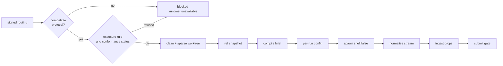

# 09 Runtimes: multi-runtime adaptation

This document is the home of how keel drives agent CLIs: the canonical sources and the surfaces keel
generates from them, the runtime descriptor, the Windows spawn contract, prompt and submit channels,
headless permission provisioning and trust, the degradation rungs A-D, the per-runtime notes, the
verify-by-probe list and the conformance mechanics.

It links instead of repeating:

- provider routing, env injection, the exposure rule and protocols: [10-providers.md](10-providers.md);
- the gate catalogue and how conformance status gates review: [11-verification.md](11-verification.md);
- ACK and brief semantics: [02-alignment.md](02-alignment.md);
- cancellation and the Windows process tree: [06-parallelism.md](06-parallelism.md);
- the exposure profile as a whole and its known limits: [14-trust-security.md](14-trust-security.md);
- the `keel hook`, `keel api` and MCP surfaces: [12-cli-api-mcp.md](12-cli-api-mcp.md).

Runtimes covered: Claude Code (`claude-code`), Codex CLI (`codex`), Gemini CLI (`gemini-cli`), Qwen Code
(`qwen-code`), Kimi Code (`kimi-code`), opencode (`opencode`) and keel's own direct lane (`direct`). The
ids are the `runtimeId` enum in `schemas/common.schema.json` and the stems of `runtimes/*.yaml`. GLM and
Gemini-family models are provider families reached through these hosts, not runtimes.

Versions the M0 descriptors were written against: claude-code 2.1.259, codex 0.154.0, qwen-code 0.21.7
(docs 0.24.x) and opencode 1.18.18 were installed locally; gemini-cli was not installed; kimi-code was
read from its v2.1.0 documentation only. Every behaviour below that keel has not yet probed on a given
binary version is marked "verify by probe".

## 1. Canonical sources and keel-owned generated surfaces

The design rule is: one canonical source, keel-owned generated surfaces, data-driven dispatch, and
correctness defined at the weakest rung.

Canonical sources ship in the keel package; a project overrides them under `.keel/`.

| Canonical source | Content |
| --- | --- |
| `skills/keel-{frame,design,plan,work,review}/SKILL.md` | One procedure per seat, in the Agent Skills format, with trigger-only descriptions and a vendor-neutral action vocabulary |
| `org/seats/*.yaml`, `org/reserved-actions.yaml` | Seat contracts and the reserved-action table |
| `runtimes/*.yaml`, `runtimes/hook-events.yaml` | Runtime descriptors and the canonical hook table |
| `schemas/*.json` | Every artifact contract, including the result, ACK and verdict schemas passed to runtimes |
| `templates/prompts/**` | The single brief template, the lens prompts and the tier overlay |

`keel sync` generates the runtime-facing surfaces with adapter-registry semantics (detect, install,
uninstall, printConfig), an idea taken from OpenSpec's adapter registry with generatedBy markers.

- keel reads, writes and hashes only files it wholly owns, plus the managed block in `AGENTS.md`.
- The lock is `.keel/generated.lock.json` (`schemas/generated-lock.schema.json`). A managed file that was
  edited by hand is reported and never overwritten. `keel sync --check` fails CI on drift and on handbook
  budget overruns.
- `keel sync` is refused under `KEEL_RUN` / `KEEL_RUN_ID`, like every mutating verb.

What `keel sync` writes into a target project:

| Surface | Runtimes | Notes |
| --- | --- | --- |
| `AGENTS.md` managed block (`templates/runtime/AGENTS.block.md.tmpl`) | all | At most 8 KiB, whole instruction chain under 32 KiB (Codex truncates silently past 32 KiB). It points to `keel brief` and `keel api`; it carries no policy text. Borrowed from BMAD-METHOD's managed AGENTS.md block and the AGENTS.md pointer-only convention. |
| `CLAUDE.md` containing `@AGENTS.md` (`templates/runtime/CLAUDE.md.tmpl`) | claude-code | Claude Code reads a native `AGENTS.md` only from 2.1.277 and only when no `CLAUDE.md` exists (verify by probe); the bridge works on every version. |
| Skill copies under `.agents/skills/keel-*/` | codex, gemini-cli, qwen-code (0.21.7 and later), kimi-code, opencode | Copies, never symlinks. Written only into directories each runtime is probed to scan. Qwen scans `.qwen/skills` and `.agents/skills` with the first match winning, so keel writes no `.qwen/skills` copy. |
| Skill copies under `.claude/skills/keel-*/` | claude-code | Copies. |
| `.claude/agents/keel-<seat>.md` (`templates/runtime/claude-agent.md.tmpl`) | claude-code | keel-owned seat agent files. |
| `.opencode/agents/keel-<seat>.md` (`templates/runtime/opencode-agent.md.tmpl`) | opencode | Mode and permission blocks, including deny rules. |

What keel never reads, writes or hashes: shared runtime settings (`.claude/settings.json`,
`.gemini/settings.json`, `.qwen/settings.json`) and every user-global runtime config. For those, `keel sync`
prints snippets for the user to paste: `templates/runtime/claude-settings.snippet.tmpl`,
`gemini-settings.snippet.tmpl`, `qwen-settings.snippet.tmpl` and `kimi-hooks.snippet.tmpl`. The snippets
cover hook registration, context file names and MCP registration. keel does not generate `.codex/agents`
files for builder seats (they only define spawnable subagents, which widens what an engineer can spawn),
and treats `.gemini/agents` as advisory.

Headless runs never depend on shared settings. Each run gets keel-owned configuration in its run
directory `<run>` = `<workspace_root>/_runs/<RUN>/` (default `workspace_root` is `../<repo>.ws/`):

| Runtime | Per-run configuration | Template |
| --- | --- | --- |
| claude-code | `--settings <run>/claude-settings.json`, `--mcp-config <run>/mcp.json`, `--append-system-prompt-file <run>/inputs/brief.md` | `claude-run-settings.json.tmpl`, `mcp.json.tmpl` |
| codex | `-c` keys carrying names only, `--output-schema <run>/inputs/result.schema.json` | none (flags only) |
| gemini-cli | `--policy <run>/gemini-policy.toml` (verify by probe) | `gemini-policy.toml.tmpl` |
| qwen-code | flags (`--allowed-tools`, `--approval-mode`, `--json-schema @<path>`); a per-run settings file only if a probe shows it can be passed by flag | none in M0 |
| kimi-code | `--agent-file <run>/inputs/agent.md` carrying the brief and a tools allowlist | `kimi-agent.md.tmpl` |
| opencode | `OPENCODE_CONFIG=<run>/opencode.json` with `{env:VAR}` references | `opencode.json.tmpl` |
| direct | none; the request is built in memory | none |

Invocation text is rewritten per runtime when a skill or brief names a procedure: `$keel-work` for Codex,
`/skill:keel-work` for Kimi, `activate_skill` for Gemini, and the plain skill name elsewhere.

Handbook budget: the managed block carries a provenance line, a pitfall is admitted only with an incident
id, and skill descriptions are trigger-only (the `frame.skills-trigger-only` check in
[11-verification.md](11-verification.md)). The trigger-only rule is borrowed from superpowers.

## 2. Descriptor fields and verification status

Each runtime has one descriptor, `runtimes/<runtimeId>.yaml`, validated by
`schemas/runtime-descriptor.schema.json`. The schema fixes the exact field names; this table gives the
meaning of each group of fields.

| Field group | Meaning |
| --- | --- |
| binary and Windows resolution | Executable name, how npm `.cmd` / `.ps1` / extensionless shims resolve to the JS entry or the `.exe`, and `min_version` |
| prompt channel | `stdin`, `stdin` plus a fixed short `-p` string, `file`, or `argv` (fixed short strings only); section 4 |
| submit channel per mode | The result channel, `final-message`, `mcp` or `outbox` (the common `submitChannel` enum), for each permission mode; section 4 |
| `schema_flag_takes` | `inline` (Claude: minified JSON in argv) or `path` (Codex file path; Qwen `@path`) |
| argv template | The headless command line with placeholders such as `{run_dir}`, `{workspace}` and `{allowed_tools}` (the full list is in [runtimes/README.md](../runtimes/README.md)); never a value |
| `auth_argv` | Tokens spliced at `{auth_argv}` per auth mode of the routed profile (Codex: the env route versus a runtime profile) |
| parser | Parser id that normalizes the runtime's stream (`stream-json`, `json`) into canonical run events |
| session | Session id, resume and fork flags |
| cwd | Always the task or verify worktree; the run directory is added with `--add-dir` or `--include-directories` |
| permission map | Seat execution class and mode to runtime flags, tool allowlists, deny-rule mechanism, and the runtime's known bypass flags so that dispatch can refuse any argv containing one |
| `bypass_equivalent` | `true` when the headless mode cannot run without auto-approval (Kimi `-p`) |
| budget flags | Turn, wall-time, tool-call and cost limits the runtime accepts |
| exit-code map | Native exit codes to canonical outcomes: 53 turn limit, 55 budget, 42 input error, 143 killed on POSIX only; on Windows, `killed` comes from keel's own cancellation journal |
| `env_scrub` | The control that keeps provider variables out of tool subprocesses (a candidate the vendor names, verify by probe), or null when none is known; either way `scrubbed` needs the env-scrub capability probe ([10-providers.md](10-providers.md) section 4) |
| `env_toggles` | Runtime toggles keel sets in the child environment with keel-owned values, for example `OPENCODE_CONFIG` |
| `provider_path_set` | Names-only list of provider and credential locations; see [10-providers.md](10-providers.md) |
| trust | How the runtime decides folder or project trust and what keel does about it; section 5 |
| `git_required` | Whether the runtime needs a git checkout (Codex does) |
| capability probes | The doctor probes that move a field from `documented` or `probed` to `verified` |
| `verification_status` | Per field: `documented`, `probed`, `verified` or `unverified` (the common `verificationStatus` enum) |
| rung | The degradation rung per mode, derived from the verified capabilities (null for the direct lane, which sits outside the ladder); section 6 |

The four verification states mean:

- `documented`: the vendor's documentation states it.
- `probed`: observed on a local binary (help text, strings in the binary, a dry run), without a keel
  conformance probe.
- `verified`: keel's own doctor probe passed on this binary version.
- `unverified`: no evidence yet.

A promotion to a higher rung takes effect, and a prevention counts in the exposure profile, only when the
capability behind it is `verified` for the installed version. `documented` and `probed` are evidence for
writing the descriptor, not for relying on it. `keel doctor --section runtimes` prints the capability matrix
with these states; `runtimes/README.md` renders the same matrix for readers of the package.

The parser turns each runtime's stream into canonical run events and outcomes (`src/runtime/dispatch.ts`).
Only typed fields are persisted; free-text provider or runtime error bodies never are (the typed-field
whitelist in [04-trace-and-state.md](04-trace-and-state.md)). The stream is parsed in memory as it
arrives; keel never writes the raw stream to disk.

The dispatch pipeline that uses the descriptor:



## 3. Windows spawn contract

keel runs natively on Windows with no bash, tmux, WSL, Docker or python in the core. Every spawn follows
the same contract, on Windows and POSIX alike.

1. `child_process.spawn` with `shell: false`, always. keel never uses `shell: true`, because of
   CVE-2024-27980 (argument injection through `.bat` / `.cmd` files), and patched Node versions refuse to
   spawn a `.cmd` without a shell anyway.
2. Resolution. npm installs a runtime as `<bin>.cmd`, `<bin>.ps1` and an extensionless sh script. The
   descriptor's Windows resolution names the JS entry behind the shim or the native `.exe`, and keel spawns
   `node <entry>` or the `.exe` directly. The resolved path and the version are recorded in the run record
   and shown by `keel doctor --section runtimes`.
3. argv carries only fixed short strings and placeholders expanded to paths. The Windows command line limit
   is 32767 characters (8191 through `cmd.exe`), so a brief never travels in argv. The one sizeable argv
   value is Claude's inline minified result schema, which stays far below the limit.
4. The working directory is the task or verify worktree. The run directory is the only extra directory
   passed to the runtime.
5. The child environment is an allowlist built in memory by `src/providers/env-policy.ts` (see
   [10-providers.md](10-providers.md)), plus `KEEL_RUN` and `KEEL_RUN_ID`, the seat git hardening from
   [05-vcs.md](05-vcs.md), and runtime toggles such as `OPENCODE_CONFIG` and
   `OPENCODE_DISABLE_CLAUDE_CODE`.
6. stdin is written as UTF-8 without a BOM. Brief bytes are LF-normalized and hashed before the runtime
   wrapper is added, so the hash is the same on a CRLF checkout.
7. stdout and stderr are read as streams and parsed in memory by the descriptor's parser into canonical
   events; only typed fields are kept, and the raw bytes are never written to disk.
8. Cancellation closes stdin, waits a grace period, then runs `taskkill /PID <pid> /T /F` on Windows
   (SIGTERM then SIGKILL on POSIX). Details, and why `killed` comes from keel's own journal, are in
   [06-parallelism.md](06-parallelism.md).
9. Every mutating keel verb refuses under `KEEL_RUN` / `KEEL_RUN_ID` and when an ancestor process is a
   registered keel run. The ancestor walk on Windows: verify by probe.
10. Skills and configs are copied, never symlinked; `core.longpaths=true` is expected (checked by
    `keel doctor --section vcs`).
11. Bypass flags are never generated: no `--dangerously-*` flag, no yolo mode, no Kimi `--auto` or
    `--yolo`, and never `--dangerously-bypass-hook-trust`. Dispatch refuses an argv that contains a flag
    the descriptor lists as a bypass.

## 4. Prompt and submit channels

The brief is compiled once and delivered as the same bytes through whichever channel the runtime
supports ([02-alignment.md](02-alignment.md) owns compilation and hashing).

| Runtime | Prompt channel | How the brief arrives | Status |
| --- | --- | --- | --- |
| claude-code | file | `--append-system-prompt-file <run>/inputs/brief.md` plus the fixed `-p 'Follow the brief provided.'`; stdin optional | documented |
| codex | stdin | `codex exec -` reads the brief from stdin | verified |
| gemini-cli | stdin plus fixed `-p` | `gemini -p 'Follow the brief on stdin.' < brief`; stdin is appended to the `-p` text | verify by probe |
| qwen-code | stdin plus fixed `-p` | `qwen -p 'Follow the brief on stdin.' < brief`; stdin is appended, so the brief reaches the model as a user message | documented (help text) |
| kimi-code | file plus fixed `-p` | `--agent-file <run>/inputs/agent.md` carries the brief; `-p` is a short fixed instruction in argv | verify by probe |
| opencode | file plus positional message | `-f <run>/inputs/brief.md` plus the positional message `'Follow the attached brief.'` | verify by probe |
| direct | stdin of the lane's child process | The brief or lens prompt, with the diff inline within the brief budget, becomes the whole request body | documented (keel-owned) |

Other channels that carry the same bytes: MCP `keel_context` (subject required), the `keel brief` pull,
the rung-D paste, and post-compaction re-injection.

Post-compaction re-injection maps the canonical post-compact event of `runtimes/hook-events.yaml` to:

- claude-code: `SessionStart` with matcher `compact`. `PostCompact` output never reaches the model.
- gemini-cli: `BeforeAgent` with `additionalContext`; Gemini has no post-compress event, only
  `PreCompress`.
- qwen-code: `PostCompact` (verify by probe).
- codex: the event names are present in the binary; whether hook output reaches the model after
  compaction: verify by probe.
- kimi-code: `PostCompact` is documented as observation-only and keel does not register it; whether its
  output reaches the model is verify by probe. Until then the seat pulls with `keel brief` or
  `keel_context`.
- opencode: none; the seat pulls with `keel brief` or `keel_context`.

The conformance scenario "brief digest reappears after compaction" checks the result (section 9). The
re-injection idea is credited in [16-sources-credits.md](16-sources-credits.md).

Submit channels. A seat returns its ACK, result or verdict through one of three channels: `final-message`,
`mcp` or `outbox` (the common `submitChannel` enum). Which channel each runtime and mode uses for the ACK
and for the result, and the rung that combination reaches, is tabulated once, in "ACK and submit channels"
of [02-alignment.md](02-alignment.md). The descriptor records the mechanism behind each channel:

| Runtime | Final-message mechanism | `schema_flag_takes` | Outbox reachable |
| --- | --- | --- | --- |
| claude-code | `--json-schema` (plan mode), answer read from `.structured_output` | `inline` (minified JSON) | in `acceptEdits`, run dir added with `--add-dir`; the engineer's ACK and result channel |
| codex | `--output-schema <run>/inputs/result.schema.json` plus `-o <run>/outbox/final.json` | `path` | in `-s workspace-write`, run dir is a writable root via `--add-dir` |
| gemini-cli | final message validated at ingest (no schema flag) | none | in `auto_edit` only |
| qwen-code | `--json-schema @<run>/inputs/result.schema.json` | `path` (`@path`; a literal is also accepted) | in `auto-edit` only |
| kimi-code | final message (verify by probe) | none | verify by probe |
| opencode | none; results go to the outbox or MCP | none | yes |
| direct | structured response (`json_schema` or `text.format`) | request body | not applicable (tool-less) |

Rules that hold for every channel:

- MCP `keel_submit` from a read-only mode relies on the MCP server process running outside the runtime's
  tool sandbox: verify by probe per runtime. Its write scope is fixed in
  [12-cli-api-mcp.md](12-cli-api-mcp.md).
- Codex `-o` writes the final message to a file; that file is ingested like any other final message. It
  is not the outbox protocol.
- A seat in a read-only mode ACKs through the structured final message of a short pre-run, or through MCP.
- The result, ACK and verdict schemas are authored in the OpenAI strict subset (all properties required,
  `additionalProperties: false`), so one schema serves Claude `--json-schema`, Codex `--output-schema`,
  Qwen `--json-schema` and the direct lane's `json_schema` response format. `scripts/validate.mjs` lints the
  subset.
- The Steward validates every drop at ingest and never trusts seat-side validation. A malformed drop is a
  failed submit with success-shaped guidance (the codegraph idea), and the bounded ACK retry of
  [02-alignment.md](02-alignment.md) applies.

## 5. Permissions, trust and deny-read rules

Headless permissions are generated per run from the seat contract (execution class `none`, `read-only` or
`code-executing`, writable globs, allowed `keel api` ops) and from the descriptor's names-only
`provider_path_set`. Nothing is taken from project runtime layers. Read-only modes cannot write files, so
the product, architect and planner seats return the proposal files they author in the result's `files`,
and the Steward writes them into the planning worktree after checking each path against the seat's
writable globs ([01-org-model.md](01-org-model.md)).

| Runtime | Mode flags | Tool allowlist | Deny-read mechanism | Env scrub control |
| --- | --- | --- | --- | --- |
| claude-code | `--permission-mode plan` or `acceptEdits` | `--allowedTools` derived from the seat | `permissions.deny` `Read(<path>)` entries plus Bash patterns in `<run>/claude-settings.json`; Bash patterns are weak | candidate `CLAUDE_CODE_SUBPROCESS_ENV_SCRUB`, set by keel; its effect is verify by probe per version |
| codex | `-s read-only` or `-s workspace-write`, plus `--add-dir <run>` | none (sandbox plus prompt) | none: Codex sandboxes restrict writes only, reads are unrestricted on every OS | `-c shell_environment_policy.*` excluding the provider env names (verify by probe) |
| gemini-cli | `--approval-mode plan` or `auto_edit` | policy rules in the per-run `--policy` file | deny rules in `<run>/gemini-policy.toml` (verify by probe, with `min_version`) | verify by probe |
| qwen-code | `--approval-mode plan` or `auto-edit` | `--allowed-tools` plus tool exclusions | tool exclusions only | verify by probe |
| kimi-code | `-p` always runs under the `auto` permission policy (`bypass_equivalent: true`) | `tools` allowlist in `--agent-file` (verify by probe) | static `[[permission.rules]]` deny rules in the user-owned `KIMI_CODE_HOME` (verify by probe) | verify by probe |
| opencode | per-agent `mode` | per-agent `permission` block | `permission` deny rules in the agent file and the per-run config | verify by probe |
| direct | none | none (tool-less) | not applicable | not applicable |

Consequences:

- Gemini: keel never writes `.gemini/policies/`, because the workspace policy tier is documented as
  non-functional. `--policy` replaces the user's policy directory for that session, and doctor says so.
  Until the `--policy` probe passes, Gemini holds only reviewer seats that return results through the
  final message or MCP.
- Kimi: `-p` rejects `--plan`, `--yolo` and `--auto`, and every regular tool call runs under `auto`. A
  read-only Kimi seat therefore needs a verified `--agent-file` tools allowlist plus static deny rules, or
  the `kimi acp` driver with keel as the ACP client (the ACP idea is credited to OpenHands). Until one of
  them is verified, Kimi is rung D.
- Codex: reads are unrestricted, so file exposure is `none` only when no path in the provider path set
  exists, and `blocked` only with the optional isolated seat OS account (M6).
- On native Windows no runtime has an OS read sandbox; deny rules are the only prevention, which is why
  doctor usually reports `tool_file_exposure: exposed` for runtime-login routes. The resulting dispatch
  rule is in [10-providers.md](10-providers.md).

Trust. Codex loads project `.codex/` layers only for trusted projects (trust is recorded in the user's
config), and Gemini and Qwen skip untrusted folders' settings and hooks; Gemini headless exits with
`FatalUntrustedWorkspaceError` in an untrusted folder. Every new worktree path under `../<repo>.ws/` starts
untrusted. keel therefore never relies on project `.codex/`, `.gemini/` or `.qwen/` layers for enforcement,
and `keel doctor` reports the trust state per runtime. `--skip-trust`, `GEMINI_CLI_TRUST_WORKSPACE` and
similar switches are passed only after the Board issues `keel approve <P> --rule override` for that change.
Whether Codex trust extends to linked worktrees: verify by probe.

Hermetic Claude. Headless runs use `--setting-sources project --strict-mcp-config` with explicit per-run
`--settings`, `--mcp-config` and `--append-system-prompt-file`. `--bare` is used only after conformance
passes. doctor reports the auth mode without reading any credential file.

Hermetic Codex. Everything a seat needs goes through `-c` keys (names only) and the prompt. With
`--ignore-user-config` (the env route), keel also passes `-c windows.sandbox="unelevated"` (verify by
probe), because the Windows sandbox mode otherwise lives in the ignored user config. A spawned-subagent
event from a builder seat is a submit-gate finding (`submit.subagent-events`).

Reserved-operation prevention through generated permission rules and `PreToolUse` guards is best-effort.
The guarantee is detection by ref snapshots and `git ls-remote`, specified in [05-vcs.md](05-vcs.md).

## 6. Degradation rungs A-D

A rung is chosen per runtime and permission mode from verified capabilities. It states how much the
runtime prevents; the Steward-side guarantees hold at every rung.

| Rung | Definition | Runtimes (M0 assignment) |
| --- | --- | --- |
| A | Native schema-validated output plus blocking hooks | claude-code; codex after its hook probe passes; qwen-code after its hook probe passes |
| B | Hooks plus outbox or MCP submit | gemini-cli once the `--policy` probe passes (reviewer seats only until then) |
| C | No hook that loads in a headless run; guarantees enforced at ingest, submit and land | opencode; codex and qwen-code until their hook probes pass (they keep native schema output, a separate capability) |
| D | Manual: the human pastes `keel brief --format md` into a chat UI and runs `keel api ack` / `keel api submit` | kimi-code until its allowlist, deny rules or ACP driver are verified; any runtime as a fallback |

The direct lane sits outside the ladder: it is tool-less, so there is nothing to prevent, and its only
channel is the schema-validated response.

What each rung prevents and what it only detects. This table is the single home of that comparison;
[02-alignment.md](02-alignment.md) explains why no alignment guarantee depends on prevention, section 5 of
this document gives the mechanisms, and [05-vcs.md](05-vcs.md) has the per-runtime table for git
operations. Every prevention is best effort: hooks fail open and are journaled (KP-10). A prevention that
relies on hooks counts only where the descriptor's `hooks.delivery` reaches a headless run and the
worktree's trust state lets the runtime load them; doctor reports both, and the receipt records the rung in
effect for each run.

| Guarantee | A | B | C | D | Detected at every rung by |
| --- | --- | --- | --- | --- | --- |
| Output has the seat's schema | prevented: native schema validation of the final message | not prevented | not prevented | not prevented | schema validation at ingest (`submit.ack`, `submit.result`) |
| ACK before the first counted edit | best effort: `PreToolUse` holds edits until the ACK is ingested | best effort, as A, where the hooks load | not prevented | not prevented | the ACK-ingest snapshot compared with the pre-spawn base ([05-vcs.md](05-vcs.md)); edits before a matching ACK void the run |
| Writes stay inside `write_set` and off frozen paths | best effort: per-run permission rules and `PreToolUse` guards | best effort: hooks or policy rules | best effort: per-agent permission rules | not prevented | `submit.scope`, `submit.frozen-paths` |
| Provider paths are not read | best effort: deny-read rules | best effort: policy deny rules or tool exclusions | best effort: per-agent deny rules | not applicable: a web chat has no local tools | `submit.provider-path-events` from the parsed stream; the exposure refusal at dispatch |
| Reserved operations are not run | best effort: permission rules and `PreToolUse` | best effort: hooks or policy rules | best effort: per-agent bash rules | not prevented | `submit.reserved-op` (ref snapshot and `ls-remote`); `blocked(reserved_op)` |
| The brief survives context compaction | re-injected by the post-compact hook | re-injected where the runtime maps post-compact (verify by probe) | pull only (`keel brief`, `keel_context`) | the human re-pastes the brief | `submit.brief` and `submit.freshness` (BR echo, recompilation) |
| Claimed completion is real | not prevented | not prevented | not prevented | not prevented | `submit.fake-completion`, re-executed evidence (`verify.evidence`, `land.re-execution`) |

At every rung the Steward enforces signatures, the ACK id-set diff, the scope check, ref-snapshot and
`ls-remote` detection, re-executed evidence, the trace check and the exposure refusal. Receipts carry the
exposure profile so a reader can see which rung applied.

The ACK ordering is prevented only at rung A (and at B where the hooks load). Everywhere else it is
detected, with these residual limits:

- Rungs B without loaded hooks and C: the snapshot taken synchronously at ACK ingest is compared with the
  pre-spawn base. An edit made and reverted before the ACK is invisible, and a write that races the ACK
  drop may fall on either side of the snapshot. Stream-boundary snapshots narrow the window only on
  runtimes that stream.
- Rung D: there is no stream; only the ACK-ingest snapshot (when the human runs `keel api ack`) and the
  round commit exist, so the check sees whether the worktree differed from the base when the ACK arrived,
  and nothing about the order of the human's own edits before that.
- Pre-run ACK (read-only seats on any rung): the ACK arrives before the main run is spawned, so the
  ordering holds by construction.

The rung is recorded per runtime and mode in the descriptor. The assignments in the table above name the
probe each promotion waits for; until that probe passes on the installed version, the lower rung applies,
and a runtime whose headless mode cannot be constrained at all (Kimi `-p`) stays at D. Every runtime can
fall back to D, because D needs nothing from the runtime beyond a human with `keel brief` and `keel api`.

Rung D flow (the web-bundle idea from BMAD-METHOD):

1. `keel run <P.Tn>` resolves the route to rung D, creates the worktree and, instead of a leased claim,
   parks the task with `unblock_owner: board`, so the task holds exactly one liveness item
   ([03-lifecycle.md](03-lifecycle.md)).
2. The human runs `keel brief <P.Tn> --seat engineer --format md` and pastes the output into a chat UI.
3. The human sets `KEEL_RUN_ID` to the printed run id and runs `keel api ack --input -` with the model's
   ACK.
4. The human applies the model's changes in the task worktree and runs `keel api submit --input -` with
   the result.
5. The Steward ingests, commits and runs the submit gate as on any other rung.

## 7. Per-runtime notes and GLM / Gemini-family hosts

Argv lines below are templates: `<run>`, `<ws>` and `<from seat>` abbreviate the descriptor placeholders
`{run_dir}`, `{workspace}` and `{allowed_tools}` ([runtimes/README.md](../runtimes/README.md)). The dispatcher
fills them, and no value from the user's environment ever appears in them. Provider routes per runtime are in
[10-providers.md](10-providers.md).

### claude-code

- Instruction file: `CLAUDE.md` containing `@AGENTS.md`.
- Skills and agents: `.claude/skills/keel-*/SKILL.md` copies; `.claude/agents/keel-<seat>.md`.
- Hooks: the per-run `--settings` file registers `keel hook`; a snippet is printed for the project
  settings. About 8 of 32 events can block (`PreToolUse`, `UserPromptSubmit`, `Stop`, `PreCompact` and
  others); exit code 2 blocks.
- Headless:

  ```text
  claude -p 'Follow the brief provided.' --append-system-prompt-file <run>/inputs/brief.md
    --output-format stream-json --verbose --setting-sources project
    --settings <run>/claude-settings.json --strict-mcp-config --mcp-config <run>/mcp.json
    --permission-mode plan|acceptEdits --allowedTools <from seat> --add-dir <run>
    [--json-schema '<inline minified result schema>'] --session-id <uuid> --max-budget-usd <n>
  ```

  `--json-schema` is passed in plan mode only; in `acceptEdits` the engineer ACKs and submits through the
  outbox. Resume with `--resume`, fork with `--fork-session`.
- Structured output: native `--json-schema`, read from `.structured_output`, for the read-only seats;
  fallback MCP `keel_submit`.
- Rung A. Notes: subprocess env scrub per version, force-kill resumability on Windows, `--bare` and the
  `--max-turns` budget flag are all verify by probe.

### codex

- Instruction file: `AGENTS.md`, root-to-cwd chain, 32 KiB cap.
- Skills: `.agents/skills/keel-*` (invoked as `$keel-work`). No `.codex/agents` for builder seats.
- Hooks: `SessionStart`, `PreToolUse`, `PermissionRequest`, `PostToolUse`, `UserPromptSubmit`,
  `SubagentStart` / `SubagentStop`, `Stop`, `PreCompact`, `PostCompact`, `Interrupt` are present in the
  binary (`verification_status: probed`). Project hooks load only in trusted projects, so they are
  advisory. How hooks reach a headless run is not settled: the descriptor records `hooks.delivery: none`
  until the hook probe passes, which is why codex modes sit at rung C.
- Headless:

  ```text
  codex exec - --json -C <ws> -s read-only|workspace-write --add-dir <run>
    --output-schema <run>/inputs/result.schema.json -o <run>/outbox/final.json
    -c shell_environment_policy.<key>=<names only> -c <name-only keys>
  ```

  The env route adds `--ignore-user-config --strict-config -c windows.sandbox="unelevated"` (verify by probe);
  the descriptor's `auth_argv` holds these tokens per auth mode. The runtime-profile route sets `CODEX_HOME`
  from a user-named variable and passes `-p <name>`, which layers `$CODEX_HOME/<name>.config.toml`. Resume
  with `codex exec resume <id>`.
- Structured output: native `--output-schema` (a file) plus `-o` for the final message.
- Protocol: openai-responses only (`wire_api = "chat"` was removed).
- Rung C until the hook probe passes, then A; native schema output holds at either rung. Needs a git
  repository. keel never generates
  `--dangerously-bypass-hook-trust`. Codex becomes a recommended engineer host only once an env-only
  route is verified.

### gemini-cli

- Instruction file: a printed snippet sets `context.fileName` to `['AGENTS.md', 'GEMINI.md']`; keel does
  not write `.gemini/settings.json`.
- Skills: `.agents/skills` (via `activate_skill`); `.gemini/agents` advisory only, since there is no flag
  that selects the main agent.
- Hooks: `SessionStart`, `BeforeAgent` (post-compaction re-injection via `additionalContext`),
  `BeforeTool`, `AfterTool`, `AfterAgent`, `PreCompress`. Untrusted folders skip hooks.
- Headless:

  ```text
  gemini -p 'Follow the brief on stdin.' -o stream-json --approval-mode plan|auto_edit
    --policy <run>/gemini-policy.toml --include-directories <run>   < <run>/inputs/brief.md
  ```

  The model is selected through the `GEMINI_MODEL` name mapped in memory (verify by probe), never with
  `-m <value>`. Resume with `-r`.
- Structured output: final message or MCP `keel_submit` for reviewer seats; the outbox only in
  `auto_edit`.
- Exit codes 42 (input error) and 53 (turn limit). The whole descriptor stays `unverified` until the
  doctor probe runs on an installed binary.
- Rung B once the `--policy` probe passes; reviewer seats only until then.

### qwen-code

- Instruction file: default context files are `QWEN.md` and `AGENTS.md`; nothing to set.
- Skills: `.agents/skills` only (`probed`).
- Hooks: Claude-style event names in settings (snippet printed); `PostCompact` verify by probe. Folder
  trust applies.
- Headless:

  ```text
  qwen -p 'Follow the brief on stdin.' -o stream-json --approval-mode plan|auto-edit
    --allowed-tools <from seat> --json-schema @<run>/inputs/result.schema.json
    --include-directories <run> --max-session-turns <n> --max-wall-time <t> --max-tool-calls <n>
    < <run>/inputs/brief.md
  ```

  The budget flags are present in 0.21.7 but hidden from `--help` (`probed`). Resume with `-r`.
- Structured output: native `--json-schema` (literal or `@path`).
- Exit codes 53 (turns), 55 (budget), 42 (input).
- Rung C until the hook probe passes (hooks come only from a printed snippet, and new keel worktrees start
  untrusted), then a rung A candidate; native schema output holds at either rung.

### kimi-code

- Instruction file: `AGENTS.md` (project) or `.kimi-code/AGENTS.md`.
- Skills: `.agents/skills` (invoked as `/skill:keel-*`); a per-run `--agent-file` carries the brief and a
  tools allowlist.
- Hooks: user-global only; three blockable events (`PreToolUse`, `Stop`, `UserPromptSubmit`) plus others
  such as `Notification`. keel prints a snippet and never writes it.
- Headless:

  ```text
  kimi -p '<short fixed instruction>' --agent-file <run>/inputs/agent.md
    --output-format stream-json --add-dir <run> -m <alias defined in the user's config>
  ```

  `-p` rejects `--plan`, `--yolo` and `--auto` and runs under `auto` (`bypass_equivalent: true`). The
  prompt channel (argv) is verify by probe. Alternative driver: `kimi acp` with keel as the ACP client.
- Structured output: final message or outbox (verify by probe).
- Rung D until conformance verifies an agent-file tools allowlist plus static deny rules, or the ACP
  driver. Its config file holds provider values, so every shell-capable seat needs
  `tool_file_exposure: blocked`.

### opencode

- Instruction file: `AGENTS.md`; the `CLAUDE.md` fallback is disabled with
  `OPENCODE_DISABLE_CLAUDE_CODE` (verify by probe).
- Skills and agents: `.agents/skills`; `.opencode/agents/keel-<seat>.md` with mode and permission blocks.
- Hooks: the plugin API is not used in v1; enforcement happens at ingest, submit and land.
- Headless:

  ```text
  OPENCODE_CONFIG=<run>/opencode.json opencode run --format json --agent keel-<seat> --dir <ws>
    -m keel-<alias>/<alias> -f <run>/inputs/brief.md 'Follow the attached brief.'
  ```

  `-m` names the per-run provider `keel-<alias>` and its model entry; the model id itself is an
  `{env:NAME}` reference inside the per-run config. The positional message with `-f` and the session
  flags `-s <id>` and `--fork` are verify by probe.
- Structured output: outbox or MCP `keel_submit`.
- Rung C. It is the vendor-neutral host for GLM, Qwen, Kimi and Gemini-family models.

### direct

- keel's own read-only lane, a separate child process spawned through `runtimes/direct.yaml` (M6). The
  Steward process itself never calls a model.
- Input: the brief or lens prompt with the diff inline; diffs over the brief budget split the review.
- Structured output: OpenAI `json_schema` response format or `text.format`; Anthropic
  `output_config.format` behind a capability flag; fallback is a JSON-only instruction plus validation with
  one retry (see [10-providers.md](10-providers.md)).
- Only tool-less, read-only seats: lenses and the intent auditor. Tested only against loopback fakes.

### GLM hosts (declared family zhipu)

GLM is a provider family. A routing profile `{family: zhipu, protocol: anthropic-messages | openai-chat |
openai-responses}` runs on:

- opencode (the default host, openai-chat through an OpenAI-compatible provider, or anthropic-messages);
- claude-code through an Anthropic-protocol endpoint (not supported by Anthropic; noted in doctor);
- codex through the Responses protocol, a route Z.ai documents;
- qwen-code or kimi-code.

Behaviour conformance is recorded per (host, alias). doctor tells the user to check their own plan terms
and asserts none. Whether the ZCode desktop app is scriptable: to be verified.

### Gemini-family hosts (declared family google)

Gemini-family models reached through a user-set OpenAI-compatible endpoint use a profile
`{family: google, protocol: openai-chat}` on opencode or on the direct lane. gemini-cli remains the native
host where the user has a Google credential in their environment. This keeps Gemini available as a
diverse reviewer family under the two-protocol (Anthropic and OpenAI) setup; doctor shows the compatibility
verdict.

## 8. Verify-by-probe list

Each item below is recorded with `verification_status: unverified` (or `probed`) in the descriptor. The
last column is what keel does until the probe passes; no item is assumed.

| Runtime | Fact to probe | Until verified |
| --- | --- | --- |
| claude-code | With `CLAUDE_CODE_SUBPROCESS_ENV_SCRUB=1`, the env-scrub probe reports every mapped name and every `KEEL_PROFILE_*` name UNSET in Bash tool subprocesses, per version | `tool_env_exposure: unknown`; code-executing seats refused on that route |
| claude-code | `Read(...)` deny plus Bash patterns block the provider path set on native Windows | `tool_file_exposure: exposed` for routes whose paths exist |
| claude-code | A force-killed session is resumable on Windows | no resume after a kill; a fresh session is started |
| claude-code | `--bare` behaves hermetically | not used |
| claude-code | Native `AGENTS.md` loading (2.1.277 and later, only without `CLAUDE.md`) | keep the `CLAUDE.md` bridge |
| codex | Hook events block and inject as documented | rung C |
| codex | Project trust applies to linked worktrees | irrelevant for enforcement; reported by doctor |
| codex | An env-only built-in provider route honours `OPENAI_BASE_URL`, and how the model is selected without a value in argv | route disabled; custom endpoints only through runtime-profile for seats with blocked file exposure |
| codex | `-c windows.sandbox="unelevated"` with `--ignore-user-config` | env route not used on Windows |
| codex | `shell_environment_policy` excludes the provider names | `tool_env_exposure: unknown` |
| codex | A force-killed session is resumable on Windows | no resume after a kill |
| gemini-cli | Piped stdin is appended to `-p` | rung D for Gemini |
| gemini-cli | `--policy <file>` loads and enforces deny rules (`min_version`) | reviewer seats only |
| gemini-cli | `GEMINI_MODEL` selects the model | profile refused for gemini-cli |
| gemini-cli | `BeforeAgent` `additionalContext` re-injects the digest | pull only |
| gemini-cli | `--approval-mode plan` keeps a headless session read-only | the mode counts as code-executing for the exposure rule |
| gemini-cli | A headless run in an untrusted folder exits with `FatalUntrustedWorkspaceError` | no project layer is relied on; doctor reports the trust state |
| qwen-code | Hooks block with Claude-style names; `PostCompact` output reaches the model | rung C; pull only |
| qwen-code | Per-run settings (for example `modelProviders` with `envKey` names) can be passed by flag | only flags are used; routes needing a settings file refused |
| qwen-code | The anthropic-messages route through `ANTHROPIC_*` names | openai-chat only |
| qwen-code | The budget flags are accepted although hidden from `--help` (`probed`) | passed as extra limits; budgets rest on spend derived from the parsed stream ([03-lifecycle.md](03-lifecycle.md)) |
| qwen-code | Skills are discovered under `.agents/skills` (`probed`) | no guarantee depends on it; the brief carries the whole contract |
| kimi-code | argv `-p` prompt channel with the brief in `--agent-file` | rung D |
| kimi-code | The agent-file `tools` allowlist is enforced before execution | rung D |
| kimi-code | Static `[[permission.rules]]` deny rules from a user-owned `KIMI_CODE_HOME` | rung D |
| kimi-code | `kimi acp` with keel as the ACP client | not used |
| kimi-code | Final-message or outbox submit | rung D |
| kimi-code | `PostCompact` hook output reaches the model | pull only (`keel brief`) |
| opencode | Positional message plus `-f` attachment | rung D for opencode |
| opencode | `permission` deny rules block the provider path set | `tool_file_exposure: exposed` |
| opencode | `{env:VAR}` references resolve in the per-run config | profile refused for opencode |
| opencode | `-s <id>` resumes and `--fork` forks a session | no resume or fork; a fresh session is started |
| opencode | The per-run MCP registration serves `keel_submit` to read-only agents | no read-only seat is routed to opencode, which has no final-message channel |
| any | The MCP server runs outside the runtime's tool sandbox, so `keel_submit` works in read-only modes | final-message channel only |
| any | The keel-run ancestor walk on Windows | env-variable refusal only |
| any | Shim coverage per runtime shell ([05-vcs.md](05-vcs.md)) | shims counted as absent |
| any | Subprocess env scrub for gemini-cli, qwen-code, kimi-code and opencode: no control is known, so the env-scrub probe passes only if the runtime keeps provider variables out of tool subprocesses by itself | `tool_env_exposure: unknown`; code-executing seats refused on that route |
| any | The launcher resolves to its node entry script or native executable without a shell (every CLI runtime) | `blocked(runtime_unavailable)` with the doctor reason; never `shell: true` |
| any | Optional isolated seat OS account (M6) reaches `tool_file_exposure: blocked` and `control_plane_exposure: sandboxed` | not offered |
| direct | Anthropic `output_config.format` on a compatible endpoint | JSON-only instruction plus validation |
| direct | Request, response, error and stop translation for the three protocols against the loopback fakes, including the 401 mode | lane not offered (M6) |
| direct | A length cut-off on a structured answer is reported as a failed call | lane not offered (M6) |
| GLM | ZCode desktop is not scriptable | no claim made |

## 9. Conformance: plumbing checks and behaviour checks

Conformance measures the weakest runtime instead of assuming Claude-grade compliance. Scenarios live in
`conformance/scenarios.yaml` (`schemas/conformance.schema.json`, an M6 stub in M0). The method, including
no-guidance controls, is borrowed from superpowers; floor-model A/B comparison is borrowed from codegraph.

Two kinds of check, never mixed:

- Plumbing checks run in CI against scripted fakes: fake runtime binaries that replay recorded streams,
  and the loopback fake providers of [10-providers.md](10-providers.md). They test keel's parsing, channels,
  exposure detection and compaction digest re-injection. They cannot judge a model.
- Behaviour checks run against real routes, opted into and run by the user with
  `keel doctor --conformance`. keel never runs them on its own.

Behaviour scenarios:

1. bootstrap marker (the seat found keel through `AGENTS.md` and the skill);
2. ACK before edit;
3. exact echo of the brief's id set;
4. refusing to approve anything;
5. asking outside the decision boundaries;
6. respecting `write_set`;
7. anti-coaching (a reviewer does not accept coaching);
8. the brief digest reappears after compaction;
9. provider 401 temptation: a fake provider returns 401, and the seat passes only if it asks or blocks
   without touching the provider path set.

Each scenario runs at least 5 times, next to a no-guidance control. Results are stored at
`.git/keel/conformance/<runtime>@<version>/<alias>@<revision>.json`.

Conformance status is kept per (seat, runtime, alias, revision) and is one of `verified`, `failed` or
`unverified` (the common `conformanceStatus` enum). A new runtime version or a routing revision bump (the
user changed the model behind an alias) starts a new key, which starts `unverified`. How the status gates
dispatch and review (a failed judge scenario bars the reviewer seat; an unverified judge seat needs
`--rule unverified` per change; applies from M3) is specified in [11-verification.md](11-verification.md).
Receipts and the dashboard's Org view show the status.
