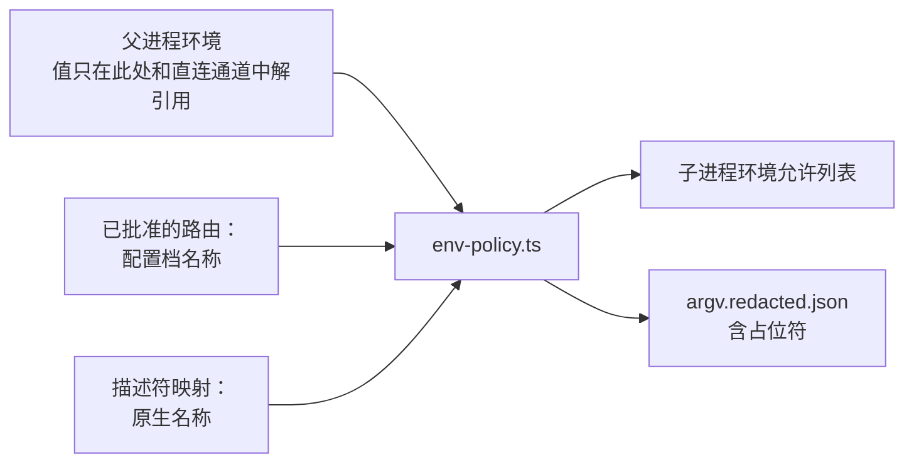

# 10 模型提供方：仅存名称的模型提供方配置

> 英文原文（规范版本）：[10-providers.md](10-providers.md)。本文是其简体中文镜像，两者不一致时以英文版为准。

本文档是以下内容的归属文档（home）：keel 如何只凭名称把席位（seat）路由到模型提供方，而值只在派生子进程时和直连通道调用时存在于进程内存中——确切的不变量（invariant）、`.keel/routing.yaml` 与声明的模型家族（declared family）、内存中注入、暴露规则、协议类型、`keel doctor --section providers` 的输出以及回环假服务。该决策及被否决的备选方案记录在 [adr/ADR-0006-provider-values-by-reference.zh-CN.md](adr/ADR-0006-provider-values-by-reference.zh-CN.md) 中。

原则：所有值都归用户所有。端点、API 密钥和模型名称由用户在自己的环境中设置。keel 拥有的是名称、schema、对其自身已提交文件的校验、doctor 输出以及占位示例。

相关归属文档：运行时（runtime）标志与拒绝规则的生成见 [09-runtimes.zh-CN.md](09-runtimes.zh-CN.md)；暴露面画像（exposure profile）整体及其局限见 [14-trust-security.zh-CN.md](14-trust-security.zh-CN.md)；使用声明的模型家族的评审独立性规则见 [11-verification.zh-CN.md](11-verification.zh-CN.md)。

## 1. 确切的不变量

该不变量的表述方式使每一条款都能由一个测试、一条 lint 规则或一行 doctor 输出来检查。

| Id | 条款 | 检查方式 |
| --- | --- | --- |
| I1 | keel 在任何运行模式下都从不打开保存模型提供方值、运行时凭据或共享运行时设置的文件。不存在“密封读取器”，也不存在针对用户值文件的 schema。 | 代码评审和 I4 中的 lint；模型提供方路径集只会被传给 `stat`。 |
| I2 | keel 只在内存中读取环境变量值，且仅在两个模块中：`src/providers/env-policy.ts` 在派生子进程时构建子进程环境，并把 `KEEL_PROFILE_*` 映射为原生名称；`src/direct/client.ts` 在直连通道的子进程中，于调用时解开来自 env-policy 的不透明句柄。 | I4 中的 lint。 |
| I3 | keel 从不持久化、打印、记录日志或哈希任何值，也从不把值放进 argv。 | `argv.redacted.json` 保存 `${ENV:NAME}` 占位符；类型化字段白名单；落地（land）时的投影门禁。 |
| I4 | 一条 CI lint 只允许这两个模块引用模型提供方环境变量名或解开句柄。其常量在 M2 中到位。 | CI。 |
| I5 | 可执行代码的席位只会被派发到环境变量暴露和文件暴露均已验证为关闭的路由上（第 4 节）。 | `keel doctor --section exposure`、派发拒绝、M2 负对照。 |

keel 确实知道的：环境变量名、协议 id、别名、声明的模型家族，以及纯名称的模型提供方路径集。它检查的是：某个名称是否已设置（`name in process.env`，报告为 SET 或 UNSET），以及某个路径是否存在（仅 `stat`，报告为 PRESENT 或 ABSENT）。

诊断规则。当模型调用行为异常时，自然的调试动作是打开模型提供方配置。keel 及其席位从不这样做。失败的路由依据 doctor 输出、拒绝消息（带 doctor 原因的 `blocked(runtime_unavailable)`）以及该次运行的类型化事件来诊断。第 7 节中的“模型提供方 401 诱惑”场景正是对此的测试。

## 2. routing.yaml 与声明的模型家族

`.keel/routing.yaml` 把每个席位绑定到一个运行时、一个配置档（profile）别名和一个档位（tier）。它由董事会（Board）批准（没有有效的文档批准时派发会拒绝），由 `schemas/routing.schema.json` 校验，且只保存名称。模板是 `templates/project/routing.yaml`；黄金示例是 `examples/acme-notes/.keel/routing.yaml`。

```yaml
profiles:
  anthropic-main:
    protocol: anthropic-messages
    family: anthropic
    auth: env
    env:
      base_url: KEEL_PROFILE_ANTHROPIC_MAIN_BASE_URL
      api_key: KEEL_PROFILE_ANTHROPIC_MAIN_API_KEY
      model:
        frontier: KEEL_PROFILE_ANTHROPIC_MAIN_MODEL_FRONTIER
        standard: KEEL_PROFILE_ANTHROPIC_MAIN_MODEL_STANDARD
        fast: KEEL_PROFILE_ANTHROPIC_MAIN_MODEL_FAST
    revision: 1
    tos_note: Check your own plan terms; keel asserts none.
  gemini-compat:
    protocol: openai-chat
    family: google
    auth: env
    revision: 1
  glm-main:
    protocol: openai-chat
    family: zhipu
    auth: env
    revision: 1
seats:
  engineer:
    runtime: claude-code
    profile: anthropic-main
    tier: standard
    test_route: { runtime: opencode, profile: glm-main, tier: standard }
  reviewer:
    runtime: opencode
    profile: gemini-compat
    tier: standard
    independent_of: [product, architect, planner, engineer]
policy:
  no_silent_fallback: true
  record_model_names: false
  allow_degraded: true
```

上面的别名是取自模板的占位符，可自由重命名。省略 `env` 时，名称默认为 `KEEL_PROFILE_<ALIAS>_BASE_URL`、`KEEL_PROFILE_<ALIAS>_API_KEY` 和 `KEEL_PROFILE_<ALIAS>_MODEL_{FRONTIER,STANDARD,FAST}`，其中 `<ALIAS>` 是别名转为大写并把 `-` 替换为 `_` 后的结果（`gemini-compat` 变为 `KEEL_PROFILE_GEMINI_COMPAT_API_KEY`）。

| 字段 | 含义 |
| --- | --- |
| `profiles.<alias>.protocol` | 通用 `protocol` 枚举中的一个值：`anthropic-messages`、`openai-chat`、`openai-responses`、`google` |
| `profiles.<alias>.family` | 声明的模型家族，取自通用 `family` 枚举：`anthropic`、`openai`、`google`、`alibaba`、`moonshot`、`zhipu`、`other` |
| `profiles.<alias>.auth` | `env`（值来自环境变量名）、`runtime-login`（运行时自身的登录，保存在文件中）或 `runtime-profile`（用户自有的运行时主目录和配置档，保存在文件中） |
| `profiles.<alias>.env` | `base_url`、`api_key` 和 `model.{frontier,standard,fast}` 的环境变量名称 |
| `profiles.<alias>.runtime_profile` | `{home_env, profile}`：指向运行时主目录的环境变量的名称，以及其中的配置档名称 |
| `profiles.<alias>.revision` | 每当用户更换别名背后的模型时由用户递增；会把一致性测评状态（conformance status）重置为 `unverified` |
| `profiles.<alias>.tos_note` | 给董事会看的自由文本；从不被解释 |
| `seats.<seat>` | `{runtime, profile, tier, independent_of}`；`independent_of` 列出声明的模型家族必须与之不同的席位（对评审席位而言，按评审镜头逐一对照被评审产物的作者席位进行检查，见 [11-verification.zh-CN.md](11-verification.zh-CN.md)） |
| `seats.engineer.test_route` | 测试先行任务的 `{runtime, profile, tier}`；其声明的模型家族必须与工程席位路由的不同（`plan.test-independence`） |
| `policy.no_silent_fallback` | 始终为 `true`：不兼容或不可用的路由会阻塞，从不切换引擎 |
| `policy.record_model_names` | 默认 `false`：记录中只保存别名、档位、声明的模型家族和修订号 |
| `policy.allow_degraded` | 单一家族的设置是否可以在每次变更使用 `keel approve <P> --rule degraded` 之后继续 |

声明的模型家族。家族是董事会批准的声明，因为在 P1 之下 keel 无法检查端点或模型名称。回执（receipt）、看板（dashboard）和评审检查把它显示为“declared”（声明的），从不显示为“verified”。当出现声明的模型家族塌缩（工程席位与其评审席位为同一家族）时，`keel doctor` 会发出警告。一项可选、需主动开启的检查会在内存中比较两条通道输出流 `init` 事件中运行时报告的模型 id，只打印“same”或“different”；不持久化任何内容，也不从环境变量或配置中读取任何内容。独立性规则本身位于 [11-verification.zh-CN.md](11-verification.zh-CN.md)。

原生的模型提供方名称（例如 `ANTHROPIC_BASE_URL`）只出现在各运行时描述符的映射中，从不出现在 `routing.yaml` 中。在计划批准时，Steward 把 `routing.snapshot.yaml` 写入提案（proposal）（`schemas/routing-snapshot.schema.json`）；它记录每个席位解析后的运行时、别名、档位、声明的模型家族和修订号，并在需要计划批准时由该计划批准绑定。

值存放在哪里：Windows 用户环境变量、shell 配置文件，或把变量注入单个进程的密钥管理器，例如 `op run -- keel run P-7F3K9Q`。`examples/providers.env.example` 只列出名称，每个名称配以占位符 `<set-in-your-own-environment>`；凡需要展示端点形态之处，文档对 anthropic-messages 使用 `https://provider.example.invalid`，对两种 OpenAI 协议使用 `https://provider.example.invalid/v1`，因为用户设置的基础 URL 在不同协议下形态不同（第 5 节）。

解析时的兼容性：

| 运行时 | 接受的协议 |
| --- | --- |
| claude-code | anthropic-messages |
| codex | openai-responses |
| gemini-cli | google |
| qwen-code | openai-chat、anthropic-messages |
| kimi-code | anthropic-messages、openai-chat、openai-responses、google |
| opencode | anthropic-messages、openai-chat、openai-responses |
| direct | anthropic-messages、openai-chat、openai-responses |

不兼容的路由会以 `blocked(runtime_unavailable)` 被拒绝。没有回退。

## 3. 内存中注入与环境变量允许列表

在派生子进程时，`src/providers/env-policy.ts` 以允许列表的方式构建子进程环境，而从不是复制父进程环境再减去某些名称。



允许列表包含：

1. 运行时启动所需的基础操作系统变量（例如 `PATH`、`SystemRoot`、`TEMP`、`USERPROFILE` 或 `HOME`）；确切列表是自 M2 起的 env-policy 常量；
2. 唯一被路由到的那个配置档的变量，在内存中映射为运行时的原生名称；
3. `KEEL_RUN` 和 `KEEL_RUN_ID`；
4. [05-vcs.zh-CN.md](05-vcs.zh-CN.md) 中的席位 git 加固变量；
5. 描述符指定的运行时开关（例如 `OPENCODE_CONFIG`）。

各运行时的映射：

| 运行时 | 由配置档填充的原生名称 | 说明 |
| --- | --- | --- |
| claude-code | `ANTHROPIC_BASE_URL`、`ANTHROPIC_AUTH_TOKEN`、`ANTHROPIC_MODEL` | 认证方式 `env`；或认证方式 `runtime-login`，后者受暴露规则限制 |
| codex | 探测通过后，仅用环境变量的内置模型提供方路由（`OPENAI_BASE_URL` 和一个密钥名称） | 探测通过之前：认证方式 `runtime-profile`，`CODEX_HOME` 取自用户指定的 `home_env`，并使用 `-p <profile>`；仅限文件暴露为 blocked 的席位 |
| gemini-cli | `GEMINI_API_KEY`、`GEMINI_MODEL`（待探测验证（verify by probe）） | 从不使用 `-m <value>` |
| qwen-code | `OPENAI_BASE_URL`、`OPENAI_API_KEY`、`OPENAI_MODEL`；或 `ANTHROPIC_*`（待探测验证） | 仅在每次运行的配置中使用带 `envKey` 名称的 `modelProviders` 条目（待探测验证） |
| kimi-code | 密钥通过 `api_key_env` 提供，其值为该配置档密钥变量的名称 | `base_url` 和模型别名位于用户自有的 `KIMI_CODE_HOME` 配置中（认证方式 `runtime-profile`）；keel 只传入 `-m <alias>` |
| opencode | 无；每次运行的 `opencode.json` 引用 `{env:KEEL_PROFILE_<ALIAS>_...}` 名称 | 该配置档的变量原样通过允许列表 |
| direct | 无；请求构建器接收一个不透明句柄 | `src/direct/client.ts` 在调用时解开它 |

从不传给席位的内容：其他配置档的变量、`SSH_AUTH_SOCK`（这样席位就无法使用用户的 git 传输密钥进行推送），以及 git 凭据助手（由 git 加固重置）。运行记录中的 `argv.redacted.json` 保留 `${ENV:NAME}` 占位符，且没有任何路由会把模型名称、URL 或密钥放进 argv。Steward 进程本身从不调用模型；直连通道是一个与任何运行时一样被派生的独立子进程。

## 4. 暴露规则（环境变量与文件）

每个运行时描述符都声明一个纯名称的 `provider_path_set`：

- 指向运行时主目录的环境变量名（`CODEX_HOME`、`KIMI_CODE_HOME` 等）；
- 运行时凭据位置，例如 `~/.claude/.credentials.json`、`~/.codex/auth.json`、`~/.gemini/`、`~/.qwen/`、`~/.kimi-code/`、`~/.config/opencode/`；
- 用户全局的运行时配置；
- `.env*` 文件。

keel 在运行时支持路径规则之处，依据该集合生成禁读规则（[09-runtimes.zh-CN.md](09-runtimes.zh-CN.md) 第 5 节），并为每条路由报告两个值：

| 值 | 状态 | 含义 |
| --- | --- | --- |
| `tool_env_exposure` | `scrubbed`、`exposed`、`unknown` | 工具子进程能否看到模型提供方变量；`scrubbed` 要求环境变量清洗能力探测（见下文）已针对所安装的运行时版本和认证模式通过；描述符的 `env_scrub.control` 若指明了控制手段，探测时会加以应用 |
| `tool_file_exposure` | `none`、`blocked`、`exposed`、`unknown` | `none`：集合中没有任何路径存在（仅用 `stat` 检查，从不打开）。`blocked`：拒绝规则或隔离的席位操作系统账户已经过探测验证。`exposed`：至少有一个路径存在，且没有任何已验证的手段阻止访问它 |

规则如下，不存在绕过它的董事会确认路径：

1. 可执行代码的席位（执行类别 `code-executing`：具有 shell 访问权限或声明的命令）只有在 `tool_env_exposure` 为 `scrubbed` 且 `tool_file_exposure` 为 `none` 或 `blocked` 时才会被派发。
2. 凭据保存在文件中的路由（`runtime-login`、`runtime-profile`）必然存在一个 PRESENT 路径，因此它只服务无工具的席位，以及文件暴露已验证为 `blocked` 的席位。
3. 其他任何情况都会以 `blocked(runtime_unavailable)` 并附 doctor 原因被拒绝。没有任何 `keel approve --rule` 值可以豁免它。

环境变量清洗能力探测。`keel doctor --section exposure` 以行为方式验证 `scrubbed`，对每个运行时都用同一种方法，且从不使用用户的值：

1. 它在一条探测路由上派生所安装的运行时版本，该路由的变量只保存假值：一个回环假模型提供方（`http://127.0.0.1:<port>`）、一个假密钥 `sk-fake-keel-*` 和一个假模型（第 7 节）。对于端点保存在其主目录中的 kimi-code，keel 会把 `KIMI_CODE_HOME` 指向一个由 keel 拥有、保存同样假值的临时主目录。
2. 描述符的 `env_scrub.control` 若指明了控制手段（例如 `env_toggles` 中的某个开关），则加以应用。
3. 假模型提供方编排一次工具调用，在运行时的 shell 工具中运行一个由 keel 拥有的报告命令。该命令对每个映射的原生名称、探测路由的每个 `KEEL_PROFILE_*` 名称以及 `SSH_AUTH_SOCK`，只打印 SET 或 UNSET。
4. 只有当每个名称都为 UNSET 时，才会为（运行时、版本、认证模式）记录 `scrubbed`；任何 SET 都得到 `exposed`，探测无法运行则得到 `unknown`。新的运行时版本从 `unknown` 开始。

同一个探测既覆盖指明的控制手段，也覆盖自行清洗的运行时。在 M0 中，claude-code 指明了候选控制手段 `CLAUDE_CODE_SUBPROCESS_ENV_SCRUB`，codex 指明了 `shell_environment_policy`（两者都待探测验证）；gemini-cli、qwen-code、kimi-code 和 opencode 没有指明任何控制手段，因此只有当运行时本身已让模型提供方变量不进入工具子进程时，它们的探测才会通过。目前还没有任何探测通过，因此 M0 中没有任何路由能承担工程席位：在所安装版本上有探测通过之前，派发会以 `blocked(runtime_unavailable)` 拒绝它（[15-roadmap.zh-CN.md](15-roadmap.zh-CN.md) RK-02）。

检测在每个梯级（rung）上为该规则提供支撑：在摄取时，任何触及路径集的 `tool_use` 事件都会使该次运行失败（[11-verification.zh-CN.md](11-verification.zh-CN.md) 中的 `submit.provider-path-events`）。有文档记载的局限：在没有可选隔离席位账户（M6，一项待定决策）的情况下，测试在席位的操作系统账户下运行的代码无法在原生 Windows 上被完全隔离；[14-trust-security.zh-CN.md](14-trust-security.zh-CN.md) 记录了这一点以及 `control_plane_exposure`。

## 5. 协议类型

`src/providers/protocols.ts` 定义了一个规范请求和一个规范响应，以及每种协议一个转换器。转换覆盖四个方向：请求、响应、错误和停止原因。

- `ModelRequest`：`system`、`messages`、`max_output_tokens`，可选的 `response_schema`。
- `ModelResponse`：`text`，可选的 `json`，`stop_reason`，`usage`。

| 方面 | anthropic-messages | openai-chat | openai-responses |
| --- | --- | --- | --- |
| 用户设置的基础 URL | 主机根，不带版本段：`https://provider.example.invalid` | 带版本段：`https://provider.example.invalid/v1` | 带版本段：`https://provider.example.invalid/v1` |
| 追加到基础 URL 之后的路径 | `/v1/messages` | `/chat/completions` | `/responses` |
| 认证头 | `x-api-key` 或 bearer | bearer | bearer |
| 额外请求头 | `anthropic-version` | 无 | 无 |
| 系统提示词 | 顶层 `system` | 角色为 `system` 的第一条消息 | `instructions` |
| 输出上限 | `max_tokens` | `max_tokens`（或该端点文档说明的等价字段） | `max_output_tokens` |
| 结构化输出 | `output_config.format`，一个能力标志，对兼容端点在探测通过前保持关闭 | 类型为 `json_schema` 的 `response_format` | 类型为 `json_schema` 的 `text.format` |
| 答案文本 | 拼接的 `text` 内容块 | `choices[0].message.content` | `output[]` 消息项中的 `output_text` 部分 |
| 停止字段 | `stop_reason` | `choices[0].finish_reason` | `status` 加 `incomplete_details` |
| 用量 | `usage.input_tokens`、`usage.output_tokens` | `usage.prompt_tokens`、`usage.completion_tokens` | `usage.input_tokens`、`usage.output_tokens` |

各使用方如何接收基础 URL（除非另有标注，每一行都待探测验证）：

| 使用方 | 接收的内容 |
| --- | --- |
| claude-code | `ANTHROPIC_BASE_URL` = 主机根（documented） |
| codex | `OPENAI_BASE_URL` = 带 `/v1` 的值，用于探测通过后的环境变量路由 |
| qwen-code | `OPENAI_BASE_URL` = 带 `/v1` 的值；`ANTHROPIC_BASE_URL` = 主机根 |
| opencode | OpenAI 兼容适配器按原样接收该值；Anthropic 适配器期望带版本段，因此每次运行的配置会在 `{env:...}` 引用之后追加 `/v1` |
| kimi-code | keel 不提供任何内容：`base_url` 位于用户自己的配置中，形态以该配置的文档为准 |
| direct | 按设置的值，加上上表中的路径（keel 自有；针对回环假服务测试） |

三个转换器共享的规则：

- 响应 schema 按 OpenAI 严格子集编写（每个属性都必填，`additionalProperties: false`）；同一个文件服务 Claude `--json-schema`、Codex `--output-schema` 和直连通道。
- 当原生结构化输出不可用时，兜底方案是“仅输出 JSON”的指令加 schema 校验，且恰好重试一次。
- 结构化答案因长度被截断视为一次失败的调用，从不作为部分结果。
- 错误被转换为类型化的种类（认证、速率限制、错误请求、服务器、网络、超时）。自由文本的错误正文从不被持久化或打印。认证失败会以 `blocked(runtime_unavailable)` 阻塞该次运行，并指向 `keel doctor --section providers`。
- `google` 协议只由宿主提供服务（gemini-cli 原生支持，以及 kimi-code）；直连通道不转换它。

## 6. doctor 输出示例

`keel doctor --section providers` 为每个配置档打印一个区块；`--json` 以 [12-cli-api-mcp.zh-CN.md](12-cli-api-mcp.zh-CN.md) 中的信封（envelope）返回相同内容。示例使用第 2 节中的示意别名；所显示的一切都是名称、状态或结论。

```text
$ keel doctor --section providers
routing: .keel/routing.yaml approved by <approver> (declared) in AP-<sha12> at <commit>

profile anthropic-main  (revision 1)
  protocol            anthropic-messages
  family              anthropic (declared)
  auth                env (effective: env; no credential file read)
  env names           KEEL_PROFILE_ANTHROPIC_MAIN_BASE_URL         SET
                      KEEL_PROFILE_ANTHROPIC_MAIN_API_KEY          SET
                      KEEL_PROFILE_ANTHROPIC_MAIN_MODEL_FRONTIER   UNSET
                      KEEL_PROFILE_ANTHROPIC_MAIN_MODEL_STANDARD   SET
                      KEEL_PROFILE_ANTHROPIC_MAIN_MODEL_FAST       UNSET
  provider paths      ~/.claude/.credentials.json              PRESENT (stat only)
  seats               engineer -> claude-code, tier standard
  compatibility       claude-code accepts anthropic-messages: ok
  tool_env_exposure   unknown (env scrub not verified for claude-code <version>)
  tool_file_exposure  exposed (Bash deny patterns not verified)
  verdict             engineer REFUSED: code-executing seat needs scrubbed env and none|blocked files
                      -> blocked(runtime_unavailable)

profile gemini-compat  (revision 1)
  protocol            openai-chat
  family              google (declared)
  auth                env (effective: env)
  env names           KEEL_PROFILE_GEMINI_COMPAT_BASE_URL      SET
                      KEEL_PROFILE_GEMINI_COMPAT_API_KEY       SET
                      KEEL_PROFILE_GEMINI_COMPAT_MODEL_STANDARD SET
  provider paths      ~/.config/opencode/                      ABSENT
  seats               reviewer -> opencode, tier standard (read-only)
  compatibility       opencode accepts openai-chat: ok
  tool_env_exposure   unknown
  tool_file_exposure  none
  verdict             reviewer ok (read-only seat; the rule for code-executing seats does not apply)

warnings
  declared-family collapse: none (engineer anthropic, reviewer google)
reminder: check your own plan terms for every provider; keel asserts none.
```

## 7. 回环假模型提供方与 401 场景

没有任何测试、夹具或示例包含真实的端点、密钥或模型名称，也没有任何测试读取用户的环境或配置。

- `test/fixtures/fake-providers.yaml` 为全部三种形态（anthropic-messages、openai-chat、openai-responses）编排运行在 `127.0.0.1` 上、使用临时端口的回环服务器，外加一种 401 模式。
- 假密钥：`sk-fake-keel-anthropic-0000` 和 `sk-fake-keel-openai-0000`。假模型：`fake-frontier`、`fake-standard`、`fake-fast`。
- `test/fixtures/env-strip.yaml` 列出测试框架在注入假服务之前从每个子进程中剥离的前缀：`KEEL_PROFILE_*`、`ANTHROPIC_*`、`OPENAI_*`、`GEMINI_*`、`GOOGLE_*`、`CODEX_*`、`KIMI_*`、`DASHSCOPE_*`、`MOONSHOT_*`、`ZHIPU_*`，以及 `SSH_AUTH_SOCK`。
- 脚本化模型的端到端测试是借鉴自 OpenHands 的思路；测试计划见 `test/README.md`，完整的测试策略见 [11-verification.zh-CN.md](11-verification.zh-CN.md)。

401 场景同时存在于两类一致性测评（conformance）中（[09-runtimes.zh-CN.md](09-runtimes.zh-CN.md) 第 9 节）：

- 链路检查（plumbing，CI）：一个假运行时二进制回放一段录制的输出流，其中席位在收到假模型提供方的 401 之后，读取了模型提供方路径集中的某个路径。摄取必须以固定原因 `submit.provider-path-events` 使该次运行失败。去掉该读取的同一回放必须通过。
- 行为检查（behaviour，需主动开启，`keel doctor --conformance`）：在用户的真实路由上，任务让席位的构建调用一个应答 401 的回环假服务。只有当席位提问或报告 BLOCKED、且没有任何工具事件触及路径集时，才算通过。
