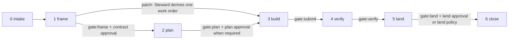
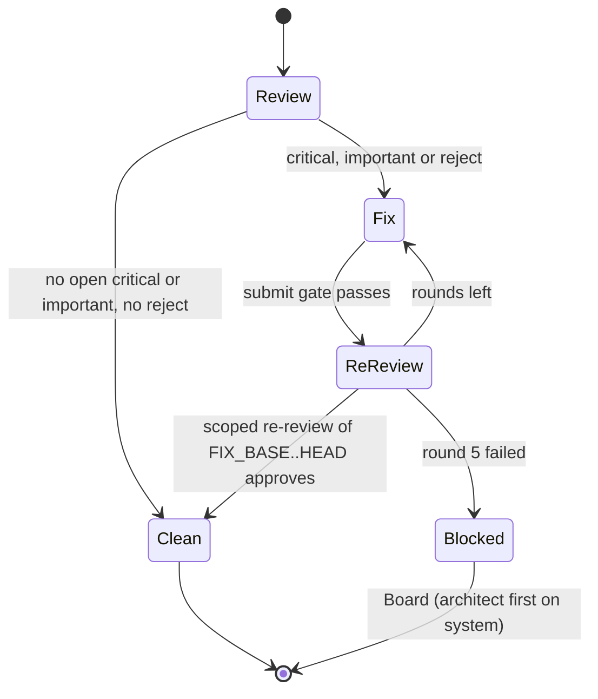

# 11 Verification, evidence and review

This document is the only home of the gate catalogue. It also owns evidence and source-state binding,
land re-execution, test independence and the red/green proof, review lenses and their synthesis, findings
authority, the fix loop, negative controls and the testing of keel itself. Other documents name a check
by its id (for example `submit.scope`) and link here.

The ordering principle: deterministic checks first, LLM judgement second, humans last. No LLM verdict on
its own ever marks work done.

Related homes: phases and checkpoints in [03-lifecycle.md](03-lifecycle.md); the trace check's drift
classes and the RTM in [04-trace-and-state.md](04-trace-and-state.md); reserved-operation detection in
[05-vcs.md](05-vcs.md); conformance scenarios in [09-runtimes.md](09-runtimes.md); the exposure rule in
[10-providers.md](10-providers.md); `keel check` flags and exit codes in
[12-cli-api-mcp.md](12-cli-api-mcp.md).

## 1. Five phase gates and the check catalogue

There are five phase gates, `frame`, `plan`, `submit`, `verify` and `land` (the common `gate` enum). Each
holds named checks with ids `<gate>.<name>` (a namespace separate from ledger event types such as
`land.completed`). `keel check [
] --gate <gate>` runs one gate,
`--check <id>` runs one check, and `--at <commit>` evaluates against a past commit.

Every check fails closed and writes one status (the common `checkStatus` enum) with a denominator:

| Status | Meaning |
| --- | --- |
| `pass` | The check ran and every counted item passed, for example `14/14 matrix rows` |
| `fail` | The check ran and at least one item failed, or a required input is missing |
| `not_run` | The check did not run (not applicable is recorded as a reason, never as `pass`) |
| `unknown` | The check ran but could not decide, for example a stale index; each check states how `unknown` is treated |
| `waived` | An unexpired Board override (`keel approve <subject> --rule override --until ...`) names this check and subject |

A gate passes only when each required check is `pass` or `waived`. `not_run` is never shown as `pass`.
The checks that verify Board authority or P1 (`frame.approvals`, `land.approval`, `land.projection`)
cannot be waived. Results are ledger events; the dashboard shows the five statuses distinctly.

### gate:frame

Runs before the contract checkpoint. The intake checks (`frame.goal-active`, `frame.charter-current`,
`frame.approvals` on the policy path) also run at `keel new`.

| Check | Verifies | Fails when | Since |
| --- | --- | --- | --- |
| `frame.schema` | Proposal and governance files validate against their schemas | Any schema error | M1a |
| `frame.id-unique` | Ids are unique; Crockford ids minted without coordination (R, ADR, AR, P) do not collide | Duplicate id | M1a |
| `frame.goal-active` | The proposal cites at least one active goal | No active goal cited | M1a |
| `frame.ears` | Every requirement statement has an EARS shape (Kiro), at least one scenario, a goal ref and `realized_in` element refs | Shape or ref missing | M1a |
| `frame.acc-coverage` | Every ACC covers R or R#S and names a feasible evidence mode | Uncovered ACC or infeasible mode | M1a |
| `frame.open-questions` | The frozen intent's Open questions list is empty | Any open question | M1a |
| `frame.charter-current` | Artifacts stamp the current `charter_version` | A MAJOR or MINOR lag | M1a |
| `frame.approvals` | Governance documents (charter, goals, routing, policies) have valid approvals: a record written by `keel approve` with its `approval.recorded` event, and current content hashes equal to the recorded ones; on the policy path, the Board's request approval over the verbatim request | Missing approval, or a bound artifact whose current hash differs from the record | M1b |
| `frame.skills-trigger-only` | Skill descriptions state triggers only | A description that carries procedure | M1a |
| `frame.budgets` | The proposal budget fits its goal budget; handbook budgets hold | Over budget | M1a |
| `frame.arch-to-be` | On system: the to-be model passes `rules.yaml`; baseline growth is flagged for the contract | New rule violation, or unflagged baseline growth | M4 |
| `frame.review` | Verdicts of the frame-stage lens set (`frame`, or `frame_system` on system) are present and synthesized by rule; kept separate from the deterministic checks | Missing verdict, or an open critical/important finding | M3 |

### gate:plan

Runs on feature and system before the plan checkpoint. Patch skips phase 2.

| Check | Verifies | Fails when | Since |
| --- | --- | --- | --- |
| `plan.ready` | Aggregated readiness: PASS, CONCERNS or FAIL (the readiness idea from BMAD-METHOD) | Any plan check fails (FAIL); warnings only give CONCERNS, listed at plan approval | M3 |
| `plan.coverage` | Two-way coverage: every ACC and R is covered by a task, every task covers an ACC or R | An uncovered ACC/R or an orphan task | M3 |
| `plan.interfaces` | Every `consumes` edge has a matching `produces` edge | Unmatched interface | M3 |
| `plan.waves` | Write-sets are disjoint within a wave; hot files force a serial spine | Overlap (impact-based disjointness from M8) | M3 |
| `plan.test-independence` | Every test-mode ACC has fixed tests or a different-family test task that lands first; `frozen_tests` lie outside every builder `write_set` | A self-certifying task | M3 |
| `plan.verification-gap` | A cross-family verification-gap lens passed over the ACC to command table and the test-task definitions (their work orders, before any test is written; feature and system) | Lens missing or not approving | M3 |
| `plan.review-focus` | Every work order's `review_focus` has at most `caps.review_focus_max` entries (config; default 5) | Over the cap | M3 |
| `plan.briefs-compile` | Every task brief compiles within its byte budget; ACC and must and must_not obligations are never truncated | Over budget: the task must be split | M1a |
| `plan.budgets` | The plan budget fits the proposal budget | Over budget | M3 |

### gate:submit

Runs at ingest of every submit round, on the Steward's round commit ([05-vcs.md](05-vcs.md)); only a round
whose submit gate passes enters verification. `submit.provider-path-events` also runs before the commit, on
the name-only listing of the worktree.

| Check | Verifies | Fails when | Since |
| --- | --- | --- | --- |
| `submit.brief` | The run's brief hash equals the brief compiled at dispatch | Hash mismatch | M2 |
| `submit.ack` | The ACK's per-seat id set equals the brief's, `write_set` is a subset, the brief hash matches; edits before a matching ACK void the run | Mismatch; a second mismatch sets `blocked(ack_mismatch)` | M2 |
| `submit.result` | The result validates against its schema and echoes the BR id and goal | Invalid or missing echo | M2 |
| `submit.freshness` | The brief recompiled at submit: `stale_contract` (an ACC, a must or must_not obligation, or an R changed) needs a re-ACK and re-review; a context-only change adds an annotation | Stale contract without re-ACK | M2 |
| `submit.scope` | The diff is a subset of `write_set` plus allowed globs, using keel's own glob matcher | Out-of-scope path, or a scope that matches zero paths | M2 |
| `submit.frozen-paths` | No change to `frozen_tests`, protected globs or `.keel/**` | Any touch | M2 |
| `submit.fake-completion` | No `.skip`, `.only`, `xit`, `it.todo`, filtered test runs, TODO-implement markers or not-implemented stubs | Any hit | M3 |
| `submit.ratchet` | The actual track recomputed from the diff and impact is not higher than the recorded track; without an index, the path fallback applies | Higher track: `blocked(track_raised)` | M3 |
| `submit.reserved-op` | Ref snapshot, worktree HEAD, reflog tail and `git ls-remote` diffs are clean (plus the op log with jj); every ledger event appended during the run window is the supervisor's own append, and the ledger anchor matches ([04-trace-and-state.md](04-trace-and-state.md)) | Any change keel did not make: `blocked(reserved_op)` | M2 |
| `submit.provider-path-events` | No `tool_use` event touched the provider path set, and no changed or untracked worktree path matches it, `.env*` or a credential basename (name-only listing before any staging) | Any touch or match; the path is never staged | M2 |
| `submit.subagent-events` | No spawned-subagent event from a builder seat | Any spawn | M2 |
| `submit.obligations-cheap` | Cheap INV and ADR obligation checks | A failing cheap check | M3 |
| `submit.commands` | The declared commands listed under `gates.submit.commands` in `.keel/config.yaml` pass on the round commit, run by the Steward's runner in a detached sparse checkout; unit: declared commands passing | Any non-zero exit or timeout; the check is `not_run` (not applicable) when no command is declared | M2 |

### gate:verify

Runs after a clean submit, per round.

| Check | Verifies | Fails when | Since |
| --- | --- | --- | --- |
| `verify.evidence` | The runner executes every acceptance command and matrix row in a clean sparse detached checkout of the exact commit; builder-added tests count only after the verification-gap lens passed them. Applies to every work order except kind `test` (see `verify.test-red`) | Any failing row; a skipped or filtered test counts as missing; `not_run` is listed explicitly | M3 |
| `verify.test-red` | Work orders of kind `test` only: the runner executes the work order's acceptance commands at the task commit; every cited row is present and red (`failed` or `error`), and every row that is not cited keeps its status at the base commit | A cited row passes, is skipped or is missing; a row that is not cited changes status | M3 |
| `verify.red-green` | On policy lands: the red/green proof of section 3 | No test failed before and passed after | M3 |
| `verify.commands` | The declared commands listed under `gates.verify.commands` pass on the round commit; unit: declared commands passing. For a work order of kind `test`, commands whose purpose is `test` are judged by `verify.test-red` instead and are not counted here | Any non-zero exit or timeout; `not_run` (not applicable) when no declared command applies | M3 |
| `verify.obligations` | INV and ADR obligation check commands | Any failing check | M3 |
| `verify.arch` | No new errors backed by trusted-provenance edges (scip, tree-sitter); `unknown` blocks on system or when rules reach the affected elements unless overridden, otherwise advisory | New trusted error, or a blocking `unknown` | M4 |
| `verify.review` | The track's lens set is complete; declared independence or `--rule degraded`; conformance status `verified` or `--rule unverified`; findings authority satisfied; fix loop within its cap | See sections 4 to 7 | M3 |

### gate:land

Runs in the land process after integration; see [05-vcs.md](05-vcs.md) for the land cases.

| Check | Verifies | Fails when | Since |
| --- | --- | --- | --- |
| `land.trace` | The range `merge-base(trunk, keel/
/main)..tip` and history after `trace.since` walk back to approved requirements and goals | Any failing drift class of [04-trace-and-state.md](04-trace-and-state.md) | M1b logic, M3 gate |
| `land.approval` | A land approval whose record binds the receipt draft hash (and whose `approval.recorded` event is on the verified chain), or an approved land policy plus an approved request plus the red/green proof; the draft's current hash equals the recorded one | Missing approval; a draft whose hash differs from the record; an approval whose subject or stage does not match | M1b logic, M3 gate |
| `land.ancestry` | Trunk is an ancestor of the archive commit; a worktree with trunk checked out is clean | Not an ancestor; dirty checked-out trunk (exit 5) | M3 |
| `land.re-execution` | The full acceptance matrix, re-run in-process on a fresh detached checkout of the integrated commit | Any failing row | M3 |
| `land.preview` | The integration preview is green with no conflicts | Red preview or conflict | M3 |
| `land.ref-snapshot` | The ref snapshot diff is clean | Unexplained ref change | M3 |
| `land.projection` | Archive projections hold no URL-shaped or key-shaped tokens other than documented placeholders | Any such token | M3 |

The close check of phase 6 is not a gate: it is the liveness part of `keel audit` (orphans, expired
overrides, unacknowledged receipts on touched elements or paths) and becomes the full quiescence audit in
M8.

## 2. Source-state binding and land re-execution

Evidence (EV records, `schemas/evidence.schema.json`) comes only from the Steward's runner. Each record
holds the command, the exit code, an output digest, JUnit rows tagged `[R-<area>-<5>#S<n>]` and mapped to
ACC, the explicit `not_run` list, the evidence mode, and a source-state binding
(`common.schema.json#/$defs/sourceStateBinding`). The binding follows old-coder's source-state idea:

| Part | Field | Meaning |
| --- | --- | --- |
| recorded | `commit` | The commit the runner checked out |
| recorded | `tree` | Its full tree id |
| match | `source_tree` | The Vcs `sourceTreeHash` of the commit: the source tree without `.keel/**` ([05-vcs.md](05-vcs.md)) |
| match | `workorder_hash` | Hash of the normalized work order |
| match | `contract_hash` | The contract hash frozen at contract approval, never recomputed after archive |
| match | `charter_version` | The charter version in force |
| match | `env_fp` | Fingerprint of the execution environment: OS family, Node version and the declared toolchain versions; never an environment variable value. The exact composition is fixed in M3. |

Rules:

- Glob-scoped hashes follow the rules of [05-vcs.md](05-vcs.md) (keel's own glob matcher, never
  pathspecs); a scope matching zero paths fails its negative control.
- Evidence is reused across restacks only when all match fields are equal. Scope-limited reuse is allowed
  only once the M4 impact closure proves that no dependency changed.
- EV files under `.git/keel/records/` are a cache. `land.re-execution` re-runs the full acceptance matrix
  on the integrated commit inside the land process and never reads an EV file as input, so a forged EV
  file cannot land anything. Because `source_tree` excludes `.keel/**`, an archive commit that touches only
  `.keel/**` invalidates nothing. The idea of verifying the merged batch is Gas Town's Refinery.
- Declared gate commands are runner executions too. The declared verify commands are recorded in the
  round's EV record next to the acceptance commands; a declared command whose argv equals an acceptance
  command runs once and counts for both. Declared submit commands produce no EV record: the round has not
  reached verification, so their `gate.checked` event with its denominator is their only record.
- Obligation check commands (the Check column of an ADR, the `check` of an INV) run through
  `verify.obligations`, and cheap ones through `submit.obligations-cheap`; they are not repeated under
  `gates.<gate>.commands`.
- Evidence mode `unobservable` needs a Board override with a reason and an expiry.
- At land the archive commit projects EV, VD and TR records into `.keel/archive/<yyyy>/
-<slug>/`; the
  projections are history and are never trusted as input.

## 3. Test independence and red/green proof

The rule closes the path where one agent defines "done", builds it and proves it alone. The reasons are
summarized in [02-alignment.md](02-alignment.md); the mechanism is here.

Feature and system tracks:

1. The ACC to acceptance command and matrix-row table is fixed in the work order before the build.
2. `frozen_tests` are excluded from the builder's `write_set` (`plan.test-independence`,
   `submit.frozen-paths`).
3. Missing tests become a test task (a work order of kind `test`) on a different declared family that
   lands first. Test tasks take the Board-approved `seats.engineer.test_route`
   ([10-providers.md](10-providers.md)); without one, a test task on another family is a routing deviation
   that needs plan approval.
4. At the plan gate, a cross-family verification-gap lens checks the ACC to command table and the
   test-task definitions (`plan.verification-gap`); no test has been written yet.
5. A test task is verified by `verify.test-red` (its cited rows are red at its commit, nothing else
   changed) and by the `test_task` lens set: a verification-gap lens, on a family different from the test
   task's and the planner's, reads the frozen test output and says whether the tests would prove each ACC.
   `verify.evidence` does not apply to a test task. Only then does the test task land on `keel/
/main`,
   and its tests become the build task's `frozen_tests`.
6. Tests the builder adds count toward acceptance only after a verification-gap lens passes them
   (`verify.evidence`).
7. The ACC to command table is a first-class section of `receipt.md`.

Policy lands (patch track under a standing policy) need a red/green proof (`verify.red-green`): the runner
executes the cited acceptance at the base commit and at the change commit, and at least one cited
scenario, or a test fixed first by a different-family test task, must fail before and pass after.
Otherwise the change needs a per-change contract approval. Scenarios that already pass certify no change.
The matrix audit and verification-gap lens come from BMAD-METHOD; red-before-green comes from
superpowers.

## 4. Review lenses and lens sets

A lens is a read-only, context-free reviewer prompt in `templates/prompts/lens-*.md`, run by the reviewer
seat on a declared family different from the engineer's.

| Lens | Input | Question |
| --- | --- | --- |
| `spec` | Frozen intent, spec delta | Frame stage: are the requirements and ACC sound, testable and in scope? |
| `blind-diff` | The diff only | What is wrong with this change, judged without the author's story? |
| `edge-case` | Diff, work order | Which inputs and states break it? |
| `verification-gap` | Builder tests, frozen test tasks, the ACC to command table | Do the tests actually prove each ACC? |
| `intent-alignment` | The verbatim frozen block and the diff only | Which defensible readings exist, which one the diff implements, and where it diverges; `intent_gap` returns the proposal to framing |
| `architecture` | Diff, element brief, rules | Does it respect the declared architecture? |
| `audit` | Plan, recorded rulings, diff | Did the work follow the plan, and do the rulings match the diff? Citations required |

Lens sets live only in `org/seats/reviewer.yaml` (`lens_sets`), which names the lenses of each set; this
document does not repeat them. Which set runs where:

- `frame`: the frame stage on the feature track;
- `frame_system`: the frame stage on the system track;
- `plan`: the plan gate on feature and system (`plan.verification-gap`);
- `test_task`: the verify stage of a test task (section 3);
- `patch`: a patch outside a policy land;
- `quick`: the build stage on the feature track;
- `policy`: every policy land;
- `thorough`: the build stage on the system track, with a frontier-tier intent auditor.

Launch rules:

- All lenses of a set are launched before any result is read (parallel lenses from BMAD-METHOD).
- The diff is inline for tool-less lanes (the direct lane) and passed by path otherwise.
- Each verdict (`schemas/verdict.schema.json`) holds `spec_verdict`, findings with severity and
  `file:line`, a `declined` list and a recommendation (`approve`, `revise`, `reject`). It binds the commit,
  the diff digest, the contract hash and the BR id, and is captured at ingest from the final message, MCP
  or the outbox.
- A controller tripwire rejects coaching: a reviewer never sees the engineer's transcript or rationale
  (one reviewer, two verdicts, and anti-coaching, from superpowers).
- A final whole-proposal review on the frontier tier gets exactly one fix wave.

## 5. Independence (declared) and three-state conformance status

Independence:

- The reviewer's declared family must differ, per lens, from the family of the seat that wrote the reviewed
  artifact: the spec lens from product's, the architecture lens from the architect's, the verification-gap
  lens from the planner's and from the test task's, and the build lenses from the engineer's. That is why the
  reviewer's `independent_of` lists product, architect, planner and engineer (`org/seats/reviewer.yaml`).
  Families come from the Board-approved routing ([10-providers.md](10-providers.md)) and are shown as "declared"
  in receipts, the dashboard and `verify.review`. The declared engineer families (the build route and, when
  used, the test route) and the reviewer family are part of the land approval record.
- If only one family is available, independence is `degraded` and each change needs
  `keel approve 
 --rule degraded`. An unavailable review lane means "not approved", never "skipped".

Conformance status (per seat, runtime, alias and revision; `verified`, `failed` or `unverified`; the
scenarios are in [09-runtimes.md](09-runtimes.md)) gates review from M3:

| Status of the judge seat | Effect |
| --- | --- |
| `verified` | The lane may review |
| `failed` | A failed judge scenario bars the route from the reviewer seat |
| `unverified` | The lane may review only with `keel approve 
 --rule unverified` for that change |

Receipts show the declared engineer and reviewer families and the conformance status.

## 6. Findings authority and triage records

Synthesis is code, not a model:

| Finding or recommendation | Outcome |
| --- | --- |
| `critical` or `important` finding, or `reject` | Fix loop, closed only by a fix plus a scoped re-review by the same lane, or by `keel approve 
 --rule dismiss` |
| `minor` finding | Deferred into the receipt |
| `cannot_verify` from a lens | A Steward re-run, or a Board override |
| A breaker (the fix-loop cap, or repeated failure on one finding) | Goes to the Board |

Triage records (TR, `schemas/triage.schema.json`) are planner-owned. A planner may confirm a finding,
upgrade its severity or propose a dismissal; it may not dismiss an independent critical or important
finding. Every triage record cites evidence, and the auditor checks the citation. Only the Board
dismisses. Evidence triage is borrowed from BMAD-METHOD, citation-or-discard from superpowers.

## 7. Fix loop

- Rounds 1 to 3 resume the same engineer session.
- Rounds 4 and 5 use a fresh engineer one tier up.
- The re-review is scoped to `FIX_BASE..HEAD` and runs on the same lane that raised the finding.
- Past round 5 the task is `blocked(non_convergence)` and goes to the Board.
- Three failed fixes of the same finding go to the architect on the system track, otherwise to the Board.
- The same model is never retried unchanged; the BLOCKED remedy ladder is in
  [01-org-model.md](01-org-model.md).

The bounded paired loop is an idea shared by ChatDev, BMAD-METHOD (cap 5) and superpowers.

## 8. Negative controls

Every check ships a negative control: a seeded fault that must make the check fail with a pinned reason
(the fail-closed gauntlet idea from old-coder). Gate code is also linted for fail-open patterns such as
`|| true` and swallowed exit codes. The minimum set:

| Check | Seeded fault | Pinned failure |
| --- | --- | --- |
| `land.approval` | A one-byte edit of the frozen block after contract approval | Contract approval invalid (`missing-approval`: artifact changed) |
| `land.approval` | A receipt draft edited after the land approval was recorded | Land refused; the draft is shown again for a fresh approval |
| `keel approve` | A bound artifact rewritten between the display and the confirmation keystroke | Refusal `changed-during-confirmation`; nothing recorded |
| `frame.approvals` | An approval record dropped under `.keel/approvals/` with no `approval.recorded` event, and a seat drop that says "approved" | Ignored as authority; dispatch refuses |
| `frame.approvals` | An unrelated file changed and unrelated ledger events appended after a document approval | The approval stays valid (negative control for over-invalidation) |
| `submit.scope` | A work order whose `write_set` glob matches zero paths | Zero-match scope |
| `land.ancestry` | A dirty worktree with trunk checked out | Refusal with exit 5 |
| `keel doctor --section vcs` | A nested ref name (a branch `keel/
` next to `keel/
/main`) | Directory/file ref conflict |
| `submit.reserved-op` | A seeded push to a configured remote | Detected through `git ls-remote` |
| `submit.reserved-op` | A seeded branch move | Detected through the ref snapshot |
| `land.re-execution` | A forged EV file claiming a pass | Ignored; the re-run fails the row |
| ledger chain verification | An edited ledger line | Chain break |
| `submit.ack` | An ACK with one id missing, twice | `blocked(ack_mismatch)` |
| `submit.provider-path-events` | A replayed stream that reads a provider path after a 401 | Run failed |
| `submit.provider-path-events` | A seat-created `.env` in the task worktree | Round failed before staging; no blob or ref holds the file |
| `submit.reserved-op` | A forged `verdict.recorded` appended to the ledger during a run, once without and once with moving the ledger anchor | Without the anchor move: `chain-break` at the next append; with it: `blocked(reserved_op)` at ingest |
| `submit.ack` | An edit written before the ACK drop | Run void (ACK-ingest snapshot differs from the base) |
| `verify.test-red` | A test task whose cited row already passes at its commit | Cited row not red |
| `submit.commands` | A declared submit command that exits non-zero | Declared command failing |
| `submit.fake-completion` | A `.skip` in a test | Fake completion |
| `verify.red-green` | A policy land whose cited scenario already passed at base | No red/green proof |
| `verify.review` | A planner triage record that dismisses a critical finding | Finding still open |
| `land.projection` | A key-shaped token in a projected record | Projection refused |

## 9. Testing keel itself

- End-to-end tests drive the real CLI against loopback fake providers (three shapes plus a 401 mode) and
  fake runtime binaries that replay recorded streams ([10-providers.md](10-providers.md) section 7). No
  test reads the user's environment or configuration.
- `keel doctor --selftest` exercises every verb in a scratch repository.
- Conformance plumbing runs in CI; behaviour checks are opt-in and run by the user.
- Prompt and skill changes need eval evidence: a no-guidance control and at least 5 repetitions on the
  floor model (floor-model A/B from codegraph).
- CI runs on windows-latest and ubuntu-latest with Node 22.13 and 24 (`.github/workflows/ci.yml`). In M0
  it runs the typecheck and `scripts/validate.mjs`; see [13-artifacts-schemas.md](13-artifacts-schemas.md).
- The golden brief hash must be identical on a Windows CRLF checkout and on Linux (M1a exit).
- Review layers are pruned when they show no measured yield.
