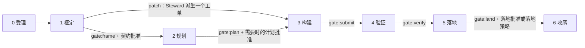
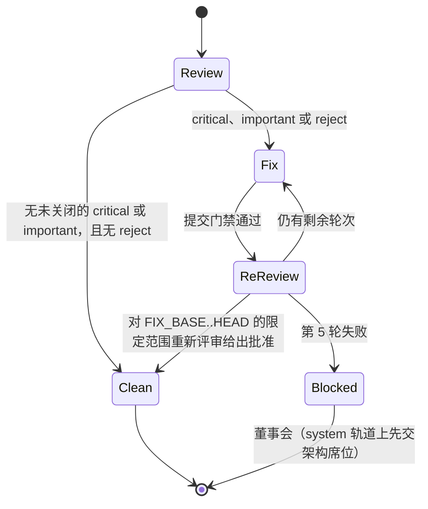

# 11 验证、证据与评审

> 英文原文（规范版本）：[11-verification.md](11-verification.md)。本文是其简体中文镜像，两者不一致时以英文版为准。

本文档是门禁（gate）目录的唯一归属文档（home）。它还负责：证据（evidence）与源状态绑定、落地（land）时的重新执行、测试独立性与红/绿证明、评审镜头（lens）及其综合、发现项（finding）的裁决权、修复循环、负对照（negative control），以及 keel 自身的测试。其他文档通过 id（例如 `submit.scope`）引用某项检查，并链接到这里。

排序原则：确定性检查在先，LLM 判断其次，人最后。任何 LLM 评审结论（verdict）都不能单独把工作标记为完成。

相关归属文档：阶段与检查点（checkpoint）见 [03-lifecycle.zh-CN.md](03-lifecycle.zh-CN.md)；追溯检查的漂移（drift）类别与 RTM 见 [04-trace-and-state.zh-CN.md](04-trace-and-state.zh-CN.md)；保留操作检测见 [05-vcs.zh-CN.md](05-vcs.zh-CN.md)；一致性测评（conformance）场景见 [09-runtimes.zh-CN.md](09-runtimes.zh-CN.md)；暴露规则见 [10-providers.zh-CN.md](10-providers.zh-CN.md)；`keel check` 的标志和退出码见 [12-cli-api-mcp.zh-CN.md](12-cli-api-mcp.zh-CN.md)。

## 1. 五个阶段门禁与检查目录

共有五个阶段门禁：`frame`、`plan`、`submit`、`verify` 和 `land`（通用 `gate` 枚举）。每个门禁包含若干具名检查，其 id 形如 `<gate>.<name>`（这一命名空间与 `land.completed` 等账本（ledger）事件类型相互独立）。`keel check [
] --gate <gate>` 运行一个门禁，`--check <id>` 运行一项检查，`--at <commit>` 针对某个过去的提交求值。

每项检查都失败即关闭（fail closed），并写出一个状态（通用 `checkStatus` 枚举）及其分母：

| 状态 | 含义 |
| --- | --- |
| `pass` | 检查已运行，且每个计数项都通过，例如 `14/14 matrix rows` |
| `fail` | 检查已运行且至少一项失败，或缺少必需的输入 |
| `not_run` | 检查未运行（“不适用”记录为原因，绝不记为 `pass`） |
| `unknown` | 检查已运行但无法判定，例如索引过期；每项检查都说明如何处理 `unknown` |
| `waived` | 一项未过期的董事会（Board）豁免（override）（`keel approve <subject> --rule override --until ...`）点名了该检查及其对象 |

只有当每项必需检查都为 `pass` 或 `waived` 时，门禁才通过。`not_run` 绝不显示为 `pass`。验证董事会权威或 P1 的检查（`frame.approvals`、`land.approval`、`land.projection`）不能被豁免。结果是账本事件；看板（dashboard）会分别显示这五种状态。

### gate:frame

在契约检查点之前运行。受理检查（`frame.goal-active`、`frame.charter-current`，以及策略路径上的 `frame.approvals`）在 `keel new` 时也会运行。

| 检查 | 验证内容 | 失败条件 | 起始里程碑 |
| --- | --- | --- | --- |
| `frame.schema` | 提案（proposal）与治理文件通过其 schema 校验 | 任何 schema 错误 | M1a |
| `frame.id-unique` | id 唯一；无需协调即可铸造的 Crockford id（R、ADR、AR、P）不冲突 | id 重复 | M1a |
| `frame.goal-active` | 提案至少引用一个活跃目标（goal） | 未引用活跃目标 | M1a |
| `frame.ears` | 每条需求（requirement）陈述都具有 EARS 形态（Kiro）、至少一个场景、一个目标引用以及 `realized_in` 架构元素（element）引用 | 缺少形态或引用 | M1a |
| `frame.acc-coverage` | 每个验收项（ACC）都覆盖 R 或 R#S，并指明可行的证据模式 | ACC 未覆盖或模式不可行 | M1a |
| `frame.open-questions` | 冻结意图（frozen intent）的 Open questions 列表为空 | 存在任何未决问题 | M1a |
| `frame.charter-current` | 产物标注的是当前 `charter_version` | 落后一个 MAJOR 或 MINOR 版本 | M1a |
| `frame.approvals` | 治理文档（章程（charter）、目标、路由、策略）具有有效的批准：由 `keel approve` 写出的批准记录及其 `approval.recorded` 事件，且当前内容哈希等于记录中的哈希；在策略路径上，还有董事会对逐字请求的请求批准 | 批准缺失，或某个被绑定产物的当前哈希与记录不同 | M1b |
| `frame.skills-trigger-only` | 技能描述只陈述触发条件 | 某条描述携带了流程内容 | M1a |
| `frame.budgets` | 提案预算在其目标预算之内；手册预算成立 | 超出预算 | M1a |
| `frame.arch-to-be` | 在 system 轨道（track）上：目标态（to-be）模型通过 `rules.yaml`；基线（baseline）增长被标记出来供契约审阅 | 出现新的规则违反，或基线增长未被标记 | M4 |
| `frame.review` | 框定阶段评审镜头集（`frame`，system 轨道上为 `frame_system`）的结论齐备并按规则综合；与确定性检查分开 | 缺少评审结论，或存在未关闭的 critical/important 发现项 | M3 |

### gate:plan

在 feature 和 system 轨道上、计划检查点之前运行。patch 跳过阶段 2。

| 检查 | 验证内容 | 失败条件 | 起始里程碑 |
| --- | --- | --- | --- |
| `plan.ready` | 聚合的就绪度：PASS、CONCERNS 或 FAIL（就绪度思路源自 BMAD-METHOD） | 任何计划检查失败（FAIL）；仅有警告时给出 CONCERNS，并在计划批准时列出 | M3 |
| `plan.coverage` | 双向覆盖：每个 ACC 和 R 都被某个任务覆盖，每个任务都覆盖某个 ACC 或 R | 存在未覆盖的 ACC/R 或孤立任务 | M3 |
| `plan.interfaces` | 每条 `consumes` 边都有匹配的 `produces` 边 | 接口不匹配 | M3 |
| `plan.waves` | 同一波次（wave）内写集互不相交；热点文件强制形成串行主干 | 重叠（自 M8 起基于影响面（impact）判定不相交） | M3 |
| `plan.test-independence` | 每个测试模式的 ACC 都有固定测试，或有一个由不同家族执行且先落地的测试任务；`frozen_tests` 位于所有构建者 `write_set` 之外 | 存在自我认证的任务 | M3 |
| `plan.verification-gap` | 一个跨家族的 verification-gap 评审镜头已审过 ACC 到命令的对照表以及测试任务的定义（它们的工单，此时尚未编写任何测试；feature 与 system） | 缺少该评审镜头或其未给出批准 | M3 |
| `plan.review-focus` | 每个工单的 `review_focus` 最多有 `caps.review_focus_max` 条（配置项；默认 5） | 超出上限 | M3 |
| `plan.briefs-compile` | 每个任务简报（brief）都能在其字节预算内编译；ACC 和 must 与 must_not 义务（obligation）从不被截断 | 超出预算：必须拆分该任务 | M1a |
| `plan.budgets` | 计划预算在提案预算之内 | 超出预算 | M3 |

### gate:submit

在每一轮提交的摄取阶段运行，作用于 Steward 的轮次提交（[05-vcs.zh-CN.md](05-vcs.zh-CN.md)）；只有提交门禁通过的轮次才进入验证。`submit.provider-path-events` 还会在提交之前，基于工作树的仅名称清单运行。

| 检查 | 验证内容 | 失败条件 | 起始里程碑 |
| --- | --- | --- | --- |
| `submit.brief` | 该次运行的简报哈希等于派发时编译的简报 | 哈希不匹配 | M2 |
| `submit.ack` | ACK（复述确认）的逐席位 id 集与简报一致，`write_set` 是其子集，简报哈希匹配；在匹配的 ACK 之前进行的编辑会使该次运行作废 | 不匹配；第二次不匹配会设置 `blocked(ack_mismatch)` | M2 |
| `submit.result` | 结果通过其 schema 校验，并复述 BR id 和目标 | 无效或缺少复述 | M2 |
| `submit.freshness` | 在提交时重新编译简报：`stale_contract`（某个 ACC、must 或 must_not 义务或 R 有变化）需要重新 ACK 并重新评审；仅上下文变化则添加一条注释 | 契约已过期却未重新 ACK | M2 |
| `submit.scope` | diff 是 `write_set` 加允许 glob 的子集，使用 keel 自己的 glob 匹配器判定 | 路径超出范围，或某个范围匹配零个路径 | M2 |
| `submit.frozen-paths` | 未改动 `frozen_tests`、受保护的 glob 或 `.keel/**` | 任何触碰 | M2 |
| `submit.fake-completion` | 没有 `.skip`、`.only`、`xit`、`it.todo`、经过滤的测试运行、TODO-implement 标记或未实现的桩 | 任何命中 | M3 |
| `submit.ratchet` | 根据 diff 和影响面重新计算的实际轨道不高于记录的轨道；没有索引时采用路径回退规则 | 轨道更高：`blocked(track_raised)` | M3 |
| `submit.reserved-op` | ref 快照、工作树（worktree）HEAD、reflog 尾部以及 `git ls-remote` 的差异均干净（使用 jj 时还包括操作日志）；运行窗口期间追加的每个账本事件都是监督进程自己的追加，且账本锚点相符（[04-trace-and-state.zh-CN.md](04-trace-and-state.zh-CN.md)） | 任何不是 keel 做出的变化：`blocked(reserved_op)` | M2 |
| `submit.provider-path-events` | 没有任何 `tool_use` 事件触及模型提供方（provider）路径集，并且没有任何已变更或未跟踪的工作树路径匹配该路径集、`.env*` 或凭据文件基名（在任何暂存之前的仅名称清单） | 任何触及或匹配；该路径永远不会被暂存 | M2 |
| `submit.subagent-events` | 构建类席位（seat）没有产生派生子智能体事件 | 任何派生 | M2 |
| `submit.obligations-cheap` | 低成本的 INV 和 ADR 义务检查 | 某项低成本检查失败 | M3 |
| `submit.commands` | `.keel/config.yaml` 中 `gates.submit.commands` 列出的已声明命令，由 Steward 的运行器在分离的稀疏检出中针对轮次提交运行并通过；单位：通过的已声明命令 | 任何非零退出或超时；未声明任何命令时该检查为 `not_run`（不适用） | M2 |

### gate:verify

在一次干净的提交之后逐轮运行。

| 检查 | 验证内容 | 失败条件 | 起始里程碑 |
| --- | --- | --- | --- |
| `verify.evidence` | 运行器在该确切提交的一份干净、分离 HEAD 的稀疏检出（sparse checkout）中执行每一条验收命令和矩阵行；构建者新增的测试只有在 verification-gap 评审镜头通过后才计入。适用于除 `test` 类型以外的所有工单（见 `verify.test-red`） | 任何失败的行；被跳过或过滤的测试计为缺失；`not_run` 被明确列出 | M3 |
| `verify.test-red` | 仅适用于 `test` 类型的工单：运行器在任务提交上执行该工单的验收命令；每个被引用的行都存在且为红（`failed` 或 `error`），每个未被引用的行保持其在基础提交上的状态 | 某个被引用的行通过、被跳过或缺失；某个未被引用的行状态发生变化 | M3 |
| `verify.red-green` | 在策略落地时：第 3 节的红/绿证明 | 没有测试在之前失败、之后通过 | M3 |
| `verify.commands` | `gates.verify.commands` 列出的已声明命令在轮次提交上通过；单位：通过的已声明命令。对于 `test` 类型的工单，用途为 `test` 的命令改由 `verify.test-red` 判定，不在此计数 | 任何非零退出或超时；没有适用的已声明命令时为 `not_run`（不适用） | M3 |
| `verify.obligations` | INV 和 ADR 义务检查命令 | 任何检查失败 | M3 |
| `verify.arch` | 没有由可信来源边（scip、tree-sitter）支撑的新错误；`unknown` 在 system 轨道上、或当规则触及受影响的架构元素时会阻塞（除非被豁免），否则仅作提示 | 新的可信错误，或阻塞性的 `unknown` | M4 |
| `verify.review` | 该轨道的评审镜头集齐全；声明的独立性或 `--rule degraded`；一致性测评状态为 `verified` 或 `--rule unverified`；满足发现项裁决权；修复循环在上限之内 | 见第 4 至 7 节 | M3 |

### gate:land

在集成之后于落地进程中运行；落地的各种情形见 [05-vcs.zh-CN.md](05-vcs.zh-CN.md)。

| 检查 | 验证内容 | 失败条件 | 起始里程碑 |
| --- | --- | --- | --- |
| `land.trace` | 范围 `merge-base(trunk, keel/
/main)..tip` 以及 `trace.since` 之后的历史都能回溯到已批准的需求和目标 | [04-trace-and-state.zh-CN.md](04-trace-and-state.zh-CN.md) 中任何一种漂移类别失败 | M1b 逻辑，M3 门禁 |
| `land.approval` | 一份记录绑定了回执（receipt）草稿哈希的落地批准（且其 `approval.recorded` 事件位于已验证的链上），或者一份已批准的落地策略加一份已批准的请求再加红/绿证明；草稿的当前哈希等于记录中的哈希 | 批准缺失；草稿哈希与记录不同；批准的对象或阶段不匹配 | M1b 逻辑，M3 门禁 |
| `land.ancestry` | 主干是归档提交的祖先；检出了主干的工作树是干净的 | 不是祖先；检出的主干有未提交改动（退出码 5） | M3 |
| `land.re-execution` | 在集成提交的全新分离检出上，于进程内重新运行完整的验收矩阵 | 任何失败的行 | M3 |
| `land.preview` | 集成预览为绿色且无冲突 | 预览为红色或有冲突 | M3 |
| `land.ref-snapshot` | ref 快照差异干净 | 无法解释的 ref 变化 | M3 |
| `land.projection` | 归档投影中除了有文档记载的占位符之外，不含任何 URL 形态或密钥形态的标记 | 任何此类标记 | M3 |

阶段 6 的收尾检查不是门禁：它是 `keel audit` 的活性部分（孤立项、过期的豁免、所触及架构元素或路径上未确认的回执），并在 M8 中成为完整的静止审计。

## 2. 源状态绑定与落地时重新执行

证据（EV 记录，`schemas/evidence.schema.json`）只来自 Steward 的运行器。每条记录包含命令、退出码、输出摘要、标记为 `[R-<area>-<5>#S<n>]` 并映射到 ACC 的 JUnit 行、明确的 `not_run` 列表、证据模式，以及一个源状态绑定（`common.schema.json#/$defs/sourceStateBinding`）。该绑定遵循 old-coder 的源状态思路：

| 部分 | 字段 | 含义 |
| --- | --- | --- |
| recorded | `commit` | 运行器检出的提交 |
| recorded | `tree` | 其完整的树 id |
| match | `source_tree` | 该提交的 Vcs `sourceTreeHash`：不含 `.keel/**` 的源代码树（[05-vcs.zh-CN.md](05-vcs.zh-CN.md)） |
| match | `workorder_hash` | 规范化后工单（work order）的哈希 |
| match | `contract_hash` | 在契约批准时冻结的契约哈希，归档后从不重新计算 |
| match | `charter_version` | 现行的章程版本 |
| match | `env_fp` | 执行环境的指纹：操作系统家族、Node 版本和声明的工具链版本；绝不包含环境变量的值。确切组成在 M3 中确定。 |

规则：

- 按 glob 限定范围的哈希遵循 [05-vcs.zh-CN.md](05-vcs.zh-CN.md) 的规则（使用 keel 自己的 glob 匹配器，从不使用路径规格）；匹配零个路径的范围会在其负对照中失败。
- 只有当所有 match 字段都相等时，证据才会在重新堆叠（restack）之间复用。只有当 M4 的影响面闭包证明没有依赖发生变化时，才允许限定范围的复用。
- `.git/keel/records/` 下的 EV 文件是缓存。`land.re-execution` 在落地进程内对集成提交重新运行完整的验收矩阵，从不把 EV 文件作为输入读取，因此伪造的 EV 文件无法让任何东西落地。由于 `source_tree` 排除了 `.keel/**`，只触及 `.keel/**` 的归档提交不会使任何东西失效。验证合并后批次的思路来自 Gas Town 的 Refinery。
- 已声明的门禁命令同样属于运行器的执行。已声明的验证命令与验收命令一起记录在该轮次的 EV 记录中；argv 与某条验收命令相同的已声明命令只运行一次，并同时计入两者。已声明的提交命令不产生 EV 记录：该轮次尚未进入验证，因此带有分母的 `gate.checked` 事件就是它们唯一的记录。
- 义务检查命令（ADR 的 Check 列、INV 的 `check`）通过 `verify.obligations` 运行，低成本的则通过 `submit.obligations-cheap` 运行；它们不会在 `gates.<gate>.commands` 下重复列出。
- 证据模式 `unobservable` 需要附带理由和到期时间的董事会豁免。
- 落地时，归档提交把 EV、VD 和 TR 记录投影到 `.keel/archive/<yyyy>/
-<slug>/`；这些投影是历史，从不作为可信输入。

## 3. 测试独立性与红/绿证明

该规则堵住了由一个智能体定义“完成”、构建它并独自证明它的路径。原因在 [02-alignment.zh-CN.md](02-alignment.zh-CN.md) 中概述；机制在此。

feature 与 system 轨道：

1. ACC 到验收命令及矩阵行的对照表在构建之前就在工单中固定下来。
2. `frozen_tests` 被排除在构建者的 `write_set` 之外（`plan.test-independence`、`submit.frozen-paths`）。
3. 缺失的测试会成为一个在不同的声明的模型家族（declared family）上执行、且先落地的测试任务（`test` 类型的工单）。测试任务使用董事会批准的 `seats.engineer.test_route`（[10-providers.zh-CN.md](10-providers.zh-CN.md)）；若未配置，在其他家族上运行测试任务属于路由偏离，需要计划审批。
4. 在规划门禁上，一个跨家族的 verification-gap 评审镜头检查 ACC 到命令的对照表以及测试任务的定义（`plan.verification-gap`）；此时尚未编写任何测试。
5. 测试任务由 `verify.test-red`（被引用的行在其提交上为红，其他一切不变）和 `test_task` 评审镜头集来验证：一个 verification-gap 评审镜头在不同于测试任务和规划席位的家族上，阅读冻结测试的输出，判断这些测试能否证明每条 ACC。`verify.evidence` 不适用于测试任务。只有在此之后，测试任务才会落到 `keel/
/main` 上，其测试成为构建任务的 `frozen_tests`。
6. 构建者新增的测试只有在某个 verification-gap 评审镜头通过后才计入验收（`verify.evidence`）。
7. ACC 到命令的对照表是 `receipt.md` 中的一等章节。

策略落地（常设策略（standing policy）下的 patch 轨道）需要红/绿证明（`verify.red-green`）：运行器在基础提交和变更提交上执行所引用的验收，至少有一个被引用的场景，或者一个由不同家族测试任务先行固定的测试，必须在之前失败、之后通过。否则该变更需要逐变更的契约批准。本来就已通过的场景不能为任何变更提供证明。矩阵审计和 verification-gap 评审镜头来自 BMAD-METHOD；先红后绿来自 superpowers。

## 4. 评审镜头与评审镜头集

评审镜头是位于 `templates/prompts/lens-*.md` 的只读、无上下文的评审者提示词，由评审席位在与工程席位不同的声明的模型家族上运行。

| 评审镜头 | 输入 | 问题 |
| --- | --- | --- |
| `spec` | 冻结意图、规格增量（spec delta） | 框定阶段：需求和 ACC 是否合理、可测试且在范围之内？ |
| `blind-diff` | 仅 diff | 在不听作者解释的情况下判断，这个变更有什么问题？ |
| `edge-case` | diff、工单 | 哪些输入和状态会让它出错？ |
| `verification-gap` | 构建者的测试、冻结测试任务、ACC 到命令的对照表 | 这些测试真的证明了每个 ACC 吗？ |
| `intent-alignment` | 仅逐字的冻结区块和 diff | 存在哪些站得住脚的解读，diff 实现的是哪一种，在哪里出现偏离；`intent_gap` 会把提案退回框定阶段 |
| `architecture` | diff、架构元素简报、规则 | 它是否遵守声明的架构？ |
| `audit` | 计划、已记录的裁定（ruling）、diff | 工作是否遵循了计划，裁定是否与 diff 相符？必须给出引用 |

评审镜头集只存放在 `org/seats/reviewer.yaml`（`lens_sets`）中，该文件列出每个集合包含的评审镜头；本文档不再重复。各集合的使用场合：

- `frame`：feature 轨道上的框定阶段；
- `frame_system`：system 轨道上的框定阶段；
- `plan`：feature 与 system 上的规划门禁（`plan.verification-gap`）；
- `test_task`：测试任务的验证阶段（第 3 节）；
- `patch`：非策略落地的 patch；
- `quick`：feature 轨道上的构建阶段；
- `policy`：每一次策略落地；
- `thorough`：system 轨道上的构建阶段，外加一个 frontier 档位（tier）的意图审计员。

启动规则：

- 一个集合中的所有评审镜头都在读取任何结果之前启动（并行评审镜头，源自 BMAD-METHOD）。
- 对无工具的通道（直连通道），diff 内联传入；否则按路径传入。
- 每个评审结论（`schemas/verdict.schema.json`）包含 `spec_verdict`、带严重程度和 `file:line` 的发现项、一个 `declined` 列表以及一个建议（`approve`、`revise`、`reject`）。它绑定提交、diff 摘要、契约哈希和 BR id，并在摄取时从最终消息、MCP 或发件箱中捕获。
- 控制器绊线拒绝诱导（coaching）：评审者从不看到工程席位的对话记录或理由（一个评审者、两份评审结论以及反诱导，均来自 superpowers）。
- 针对整个提案、在 frontier 档位上进行的最终评审只获得恰好一个修复波次。

## 5. 独立性（声明的）与三态一致性测评状态

独立性：

- 评审席位的声明的模型家族必须按评审镜头逐一与被评审产物作者席位的家族不同：spec 镜头对照产品席位，architecture 镜头对照架构席位，verification-gap 镜头对照规划席位和测试任务，构建阶段的镜头对照工程席位。因此评审席位的 `independent_of` 列出 product、architect、planner 和 engineer（`org/seats/reviewer.yaml`）。家族来自董事会批准的路由（[10-providers.zh-CN.md](10-providers.zh-CN.md)），并在回执、看板和 `verify.review` 中显示为“declared”（声明的）。声明的工程席位家族（构建路由，以及在使用时的测试路由）和评审席位家族是落地批准记录的一部分。
- 如果只有一个家族可用，独立性为 `degraded`（降级），每次变更都需要 `keel approve 
 --rule degraded`。评审通道不可用意味着“未批准”，绝不意味着“已跳过”。

一致性测评状态（conformance status）（按席位、运行时、别名和修订号；取值 `verified`、`failed` 或 `unverified`；场景见 [09-runtimes.zh-CN.md](09-runtimes.zh-CN.md)）自 M3 起把关评审：

| 评审判定席位的状态 | 效果 |
| --- | --- |
| `verified` | 该通道可以评审 |
| `failed` | 评审判定场景失败会禁止该路由担任评审席位 |
| `unverified` | 该通道只有在该变更附带 `keel approve 
 --rule unverified` 时才能评审 |

回执会显示声明的工程席位家族和评审席位家族，以及一致性测评状态。

## 6. 发现项裁决权与分诊记录

综合由代码完成，而不是由模型完成：

| 发现项或建议 | 结果 |
| --- | --- |
| `critical` 或 `important` 发现项，或 `reject` | 进入修复循环，只能通过修复加同一通道的限定范围重新评审来关闭，或通过 `keel approve 
 --rule dismiss` 关闭 |
| `minor` 发现项 | 推迟记入回执 |
| 评审镜头给出的 `cannot_verify` | 由 Steward 重新运行，或由董事会豁免 |
| 熔断（修复循环上限，或同一发现项反复失败） | 提交董事会 |

分诊记录（TR，`schemas/triage.schema.json`）归规划席位所有。规划席位可以确认一个发现项、提升其严重程度或提议驳回；但不得驳回独立评审给出的 critical 或 important 发现项。每条分诊记录都要引用证据，审计员会检查该引用。只有董事会可以驳回。证据分诊借鉴自 BMAD-METHOD，“要么引用要么丢弃”借鉴自 superpowers。

## 7. 修复循环

- 第 1 至 3 轮恢复同一个工程会话。
- 第 4 和第 5 轮使用高一个档位的全新工程席位。
- 重新评审限定在 `FIX_BASE..HEAD` 范围内，并在提出该发现项的同一通道上运行。
- 超过第 5 轮后，任务变为 `blocked(non_convergence)` 并提交董事会。
- 同一发现项的三次修复失败，在 system 轨道上提交架构席位，否则提交董事会。
- 从不在不做任何改变的情况下重试同一个模型；BLOCKED 补救阶梯见 [01-org-model.zh-CN.md](01-org-model.zh-CN.md)。

有上限的配对循环是 ChatDev、BMAD-METHOD（上限 5）和 superpowers 共有的思路。

## 8. 负对照

每项检查都附带一个负对照：一个植入的故障，必须使该检查以固定原因失败（失败即关闭的“考验场”思路来自 old-coder）。门禁代码还会针对 `|| true` 和被吞掉的退出码等失败放行模式做 lint。最小集合：

| 检查 | 植入的故障 | 固定的失败结果 |
| --- | --- | --- |
| `land.approval` | 契约批准之后对冻结区块做一个字节的编辑 | 契约批准无效（`missing-approval`：产物已变更） |
| `land.approval` | 落地批准记录写入之后被编辑过的回执草稿 | 落地被拒绝；草稿再次显示，等待一次新的批准 |
| `keel approve` | 一个被绑定的产物在显示与确认按键之间被重写 | 拒绝并给出 `changed-during-confirmation`；不记录任何内容 |
| `frame.approvals` | 一条放入 `.keel/approvals/` 下、却没有 `approval.recorded` 事件的批准记录，以及一个写着“approved”的席位投递文件 | 不被视为权威；派发拒绝 |
| `frame.approvals` | 文档批准之后，一个无关文件被改动、且追加了无关的账本事件 | 批准保持有效（针对过度失效的负对照） |
| `submit.scope` | 一个 `write_set` glob 匹配零个路径的工单 | 零匹配范围 |
| `land.ancestry` | 一个检出了主干且有未提交改动的工作树 | 以退出码 5 拒绝 |
| `keel doctor --section vcs` | 嵌套的 ref 名称（分支 `keel/
` 与 `keel/
/main` 并存） | 目录/文件 ref 冲突 |
| `submit.reserved-op` | 植入一次向已配置远端的推送 | 通过 `git ls-remote` 检测到 |
| `submit.reserved-op` | 植入一次分支移动 | 通过 ref 快照检测到 |
| `land.re-execution` | 一个声称通过的伪造 EV 文件 | 被忽略；重新运行使该行失败 |
| 账本链验证 | 一行被编辑过的账本 | 链断裂 |
| `submit.ack` | 两次缺少一个 id 的 ACK | `blocked(ack_mismatch)` |
| `submit.provider-path-events` | 一段在 401 之后读取模型提供方路径的回放输出流 | 运行失败 |
| `submit.provider-path-events` | 席位在任务工作树中创建的 `.env` | 该轮次在暂存之前失败；没有任何 blob 或引用保存该文件 |
| `submit.reserved-op` | 运行期间向账本追加的伪造 `verdict.recorded`，一次不移动账本锚点，一次移动锚点 | 不移动锚点时：下一次追加时 `chain-break`；移动锚点时：摄入时 `blocked(reserved_op)` |
| `submit.ack` | 在 ACK 投递之前写入的编辑 | 运行作废（ACK 摄入快照与基线不同） |
| `verify.test-red` | 一个测试任务，其被引用的行在其提交上已经通过 | 被引用的行不是红 |
| `submit.commands` | 一个以非零状态退出的已声明提交命令 | 已声明命令失败 |
| `submit.fake-completion` | 测试中的一个 `.skip` | 虚假完成 |
| `verify.red-green` | 一次策略落地，其引用的场景在基础提交上就已通过 | 无红/绿证明 |
| `verify.review` | 一条驳回 critical 发现项的规划席位分诊记录 | 发现项仍未关闭 |
| `land.projection` | 投影记录中出现密钥形态的标记 | 投影被拒绝 |

## 9. 测试 keel 自身

- 端到端测试驱动真实的 CLI，对接回环假模型提供方（三种形态加一种 401 模式）以及回放录制输出流的假运行时二进制（[10-providers.zh-CN.md](10-providers.zh-CN.md) 第 7 节）。没有任何测试读取用户的环境或配置。
- `keel doctor --selftest` 在一个临时仓库中演练每个动词。
- 一致性测评的链路检查在 CI 中运行；行为检查需主动开启并由用户运行。
- 提示词和技能的改动需要评测证据：一个无指引对照组，以及在底线模型上至少 5 次重复（底线模型 A/B 来自 codegraph）。
- CI 在 windows-latest 和 ubuntu-latest 上以 Node 22.13 和 24 运行（`.github/workflows/ci.yml`）。在 M0 中它运行类型检查和 `scripts/validate.mjs`；见 [13-artifacts-schemas.zh-CN.md](13-artifacts-schemas.zh-CN.md)。
- 黄金简报哈希在 Windows CRLF 检出与 Linux 上必须一致（M1a 退出条件）。
- 没有可度量收益的评审层会被裁剪。
