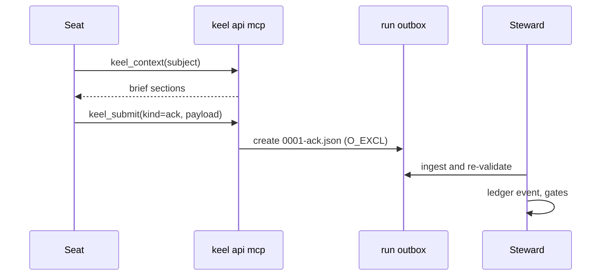

# 12 CLI, agent API and MCP

This document is the home of keel's command surface: the 16 verbs and their counted modes, the JSON
envelope, the exit codes, the agent-facing `keel api`, the MCP server with the write scope of
`keel_submit`, and the `keel hook` entry point. In M0 nothing here is executable; `package.json` has no
`bin` until M1. The type-level mirror of this surface is `src/cli/commands.ts` (verbs, modes and exit
codes) and `src/api/contract.ts` (api ops, submit channels, envelope); `src/mcp/tools.ts` types the MCP
tools. This document and those files must list the same verbs, modes and codes.

Related homes: what each gate checks in [11-verification.md](11-verification.md); signing and approval
semantics in [02-alignment.md](02-alignment.md); submit channels per runtime in
[09-runtimes.md](09-runtimes.md); the owner's daily commands in [00a-owner-guide.md](00a-owner-guide.md).

## 1. 16 verbs and at most 40 modes

The surface budget (KP-14) is 16 top-level verbs and at most 40 verb modes; the lesson comes from the
surface sprawl of oh-my-claudecode, oh-my-codex, BMAD-METHOD and superpowers. Synopses:

```text
keel init [--vcs auto|git|jj] [--runtimes <id,...>] [--signer <public key file>] [--yes]
keel sync [--check] [--runtime <id>]
keel doctor [--section runtimes|providers|vcs|signing|exposure|arch] [--conformance] [--selftest] [--json]
keel new "<title>" [--goal G-nn] [--track spike|patch|feature|system] [--policy <name>]
keel approve <subject> --stage contract|plan|land|receipt
keel approve --doc <path>
keel approve --policy <name>
keel approve <subject> --request
keel approve <subject> --rule answer|budget|track|override|dismiss|degraded|unverified|abandon
             [--until <date|land|commit-touching:path>] [--limit <usd|runs|wall_minutes>=<n>]
             [--to spike|patch|feature|system] [--quote "<text>"]
keel run <P|P.Tn> [--seat <seat>] [--wave] [--runtime <id>] [--resume] [--dry-run]
keel run --hold on|off <P>
keel check [<P>] [--gate frame|plan|submit|verify|land|all] [--check <id>] [--at <commit>] [--json]
keel land <P> [--preview]
keel status [<id>] [--next] [--json]
keel trace <file:line|symbol|commit|R-...|G-...|P-...|el:...> [--matrix] [--json]
keel brief <P|P.Tn> [--seat <seat>] [--format md|json]
keel arch index|find|impact|drift|plan|render ...
keel audit [--rebuild] [--export-vcs] [--backfill]
keel dashboard build [--out <file>]
keel dashboard serve [--port 0]
keel api ack|ask|rule|submit|context --input <json|-> --json
keel api mcp [--http]
keel hook <canonical event> --runtime <id>
```

Counting rule. A mode is a subcommand word, or a flag that selects a different operation (a different
side effect, a different signed subject kind, or a check-only variant of an operation). Not counted: enum
parameter values (`--stage`, `--rule`, `--section`, `--gate` values), output views (`--json`, `--format`,
`--next`, `--matrix`), filters (`--check <id>`, `--at`, `--seat`, `--runtime`) and tuners (`--wave`,
`--resume`, `--until`, `--limit`, `--to`, `--quote`, `--out`, `--port`, `--http`, `--goal`, `--track`,
`--vcs`, `--runtimes`, `--signer`, `--yes`). `keel new --policy <name>` is intake plus the `approve --request`
signing flow, so the signing is counted once, under `approve`.

| Verb | Counted modes | Count | Under `KEEL_RUN` | Phase |
| --- | --- | --- | --- | --- |
| `init` | init | 1 | refused | setup |
| `sync` | generate; `--check` | 2 | refused | setup, CI |
| `doctor` | probe (with `--section`); `--conformance`; `--selftest` | 3 | probe allowed; `--conformance` and `--selftest` refused | setup, ops |
| `new` | intake | 1 | refused | intake |
| `approve` | `--stage`; `--doc`; `--policy`; `--request`; `--rule` | 5 | refused | checkpoints, rulings |
| `run` | dispatch; `--dry-run`; `--hold` | 3 | refused | frame to verify |
| `check` | check | 1 | report-only (no ledger writes) | any |
| `land` | land; `--preview` | 2 | refused | land |
| `status` | status | 1 | allowed | any |
| `trace` | trace | 1 | allowed | any |
| `brief` | brief | 1 | allowed | any seat |
| `arch` | index; find; impact; drift; plan; render | 6 | find, impact, drift and plan (print only) allowed; index and render refused | design to land |
| `audit` | default pass; `--rebuild`; `--export-vcs`; `--backfill` | 4 | refused | ops, close |
| `dashboard` | build; serve | 2 | refused | any |
| `api` | ack; ask; rule; submit; context; mcp | 6 | allowed (this is its purpose) | agent |
| `hook` | hook | 1 | allowed | runtime hooks |
| **Total** | | **40** | | |

The budget is full: a new mode must replace an existing one.

What each verb does:

- **init** scaffolds `.keel/`, the control plane `.git/keel/` and the workspace root, sets `trace.since`
  (the trace epoch) and, with consent, registers the first Board signer from `--signer <public key file>`
  (trust on first use, with a quoted consent recorded in `.keel/signatures/`; key selection is in
  [14-trust-security.md](14-trust-security.md)) and runs `sync`. Idempotent.
- **sync** generates keel-owned surfaces and prints snippets for shared settings
  ([09-runtimes.md](09-runtimes.md)). `--check` writes nothing and fails on drift or handbook budget
  overruns.
- **doctor** runs capability probes and prints verification status: SET/UNSET env names and
  PRESENT/ABSENT provider paths (stat only), compatibility, auth mode, the exposure profile (tool env, tool
  file, control plane, shim coverage), trust state, signing hygiene (agent-loaded keys, the verified
  `ssh-keygen` path, `-sk`), the git floor, ref-conflict and jj hazard checks, and inert architecture
  checks. `--conformance` runs behaviour scenarios on real routes when the user opts in; `--selftest`
  exercises every verb in a scratch repository.
- **new** mints a proposal id, checks anchors, classifies the track, and creates `keel/<P>/main` and the
  planning worktree. With `--policy` the Board signs the verbatim request in the same interactive flow.
- **approve** is the single Board signing path. It builds a hash-bound, chain-anchored envelope, confirms
  interactively (a TTY, or a typed confirmation code under Git Bash mintty), shows exactly what to read, and
  the envelope is committed under `.keel/signatures/`. `--stage` signs a checkpoint, `--doc` a governance
  document, `--policy` a standing policy, `--request` a verbatim change request, `--rule` a ruling (`--until`
  sets an override's expiry, `--limit` the new limit of a budget ruling, `--to` the track a track ruling sets;
  both values are signed in the envelope's `rule` object). It exits 6 while any allowed signer key is
  agent-listed and is not `-sk`.
- **run** is the deterministic dispatcher: resolve signed routing, compatibility, the exposure rule and
  conformance status; claim; create the sparse worktree; snapshot refs; compile the brief; spawn headless
  with per-run config; ingest submit channels; make Steward commits. `--dry-run` stops before the claim
  and the spawn and prints the resolved route and argv template. `--hold on|off <P>` holds or releases a
  proposal.
- **check** runs phase gates; see [11-verification.md](11-verification.md).
- **land** integrates, previews, re-executes acceptance on the integrated commit and writes the receipt
  draft. Without a land approval over that draft (or a signed land policy) it stops there and exits 3.
  After `keel approve <P> --stage land`, a second `keel land` verifies the signature, writes the archive
  commit (which projects the signed receipt) and advances trunk (ff-only or CAS). `--preview` stops after
  the preview. Abandonment is `keel approve <P> --rule abandon`.
- **status** computes state from the ledger; `--next` lists the legal next actions.
- **trace** walks the trace graph from a file line, symbol, commit or id; `--matrix` prints the RTM
  ([04-trace-and-state.md](04-trace-and-state.md)).
- **brief** prints the compiled brief for a seat and subject with its hash and ACK id set. It is the pull
  channel and the rung-D paste source.
- **arch** covers the per-commit index, search mapped to elements, impact, drift, typed arch ops and
  exports ([07-architecture-intelligence.md](07-architecture-intelligence.md)).
- **audit** runs the liveness, lease, override and chain sweep; `--rebuild` compares `trace.db` against a
  full rebuild by set difference; `--export-vcs` exports the jj op log and evolog; `--backfill` fills the
  metrics series.
- **dashboard** builds the read-only native-HTML dashboard or serves it on loopback
  ([08-dashboard.md](08-dashboard.md)).
- **api** and **hook** are the agent and runtime entry points (sections 4 to 6).

Seat-proof verbs. Every refused mode in the table refuses when `KEEL_RUN` or `KEEL_RUN_ID` is set, or when
an ancestor process is a registered keel run (the Windows ancestor walk is verify by probe). The blueprint
names `new`, `run`, `land`, `sync`, `audit` and `approve`; the other refused modes follow from the rule
that only the Steward writes the declared plane, the control plane and refs.

## 2. JSON envelope

Every verb that accepts `--json`, and every `keel api` op, prints exactly one JSON document on stdout: the
envelope defined by `schemas/api-envelope.schema.json`, which is normative for field names. Progress and
human text go to stderr. The same model backs the dashboard, so CLI, MCP and dashboard never disagree.

```json
{
  "v": 1,
  "ok": false,
  "command": "check",
  "subject": "P-7F3K9Q",
  "exit_code": 1,
  "data": {
    "gate": "submit",
    "checks": [
      { "check": "submit.scope", "status": "fail", "passed": 3, "total": 4, "unit": "changed paths in scope" }
    ]
  },
  "diagnostics": [
    {
      "code": "submit.scope",
      "severity": "error",
      "subject": "P-7F3K9Q.T2",
      "message": "1 changed path is outside write_set",
      "hint": "keel status P-7F3K9Q.T2 --next"
    }
  ],
  "next": ["keel status P-7F3K9Q.T2 --next"],
  "freshness": {
    "computed_at": "2026-09-25T10:00:00Z",
    "head_commit": "3f9a1c0d2e4b6a8c0e1f3a5b7c9d1e3f5a7b9c0d",
    "index_commit": null,
    "charter_version": "1.0.0"
  }
}
```

Rules:

- `ok` is true exactly when `exit_code` is 0.
- `diagnostics[].code` is a check id from [11-verification.md](11-verification.md) or a refusal code; every
  error carries a `hint` with the next command to run (success-shaped guidance, an idea from codegraph).
- Aggregates always carry denominators, and `freshness` (the common `freshness` definition) says what the
  answer was computed from.
- No field ever carries a provider value; env names appear only as names, and records use `${ENV:NAME}`
  placeholders (P1, [10-providers.md](10-providers.md)).

## 3. Exit codes

keel's own exit codes, shared by every verb:

| Code | Meaning | Typical causes |
| --- | --- | --- |
| 0 | ok | Command succeeded; every selected check passed or was waived |
| 1 | gate failed | A check failed (`keel check`, the gates inside `run` and `land`) |
| 2 | usage | Unknown verb, mode or flag; invalid input JSON |
| 3 | needs a human | A Board item is pending: approval, ask, ruling, stop class, `blocked(...)` requiring a decision |
| 4 | claim conflict | A lost CAS on a claim ref; never retried automatically |
| 5 | stale, or checked-out trunk dirty | Trunk moved (restack and retry), or a worktree with trunk checked out is dirty |
| 6 | environment | Agent-loaded signer key, missing or too old git, unverified `ssh-keygen`, refusal under `KEEL_RUN` |

Runtime exit codes (for example 53 turn limit, 55 budget, 42 input error, 143 on POSIX only) are a
different thing: descriptors map them to canonical run outcomes ([09-runtimes.md](09-runtimes.md)).

## 4. keel api

`keel api` is how a seat, or at rung D the human acting for it, talks to the Steward. Every op writes at
most one file, into the run outbox, and the Steward validates that file at ingest; api-side validation is
a convenience, never a trust boundary.

```text
keel api ack     --input <json|-> --json
keel api ask     --input <json|-> --json
keel api rule    --input <json|-> --json
keel api submit  --input <json|-> --json
keel api context --input <json|-> --json
```

- Run binding: the run is identified by `KEEL_RUN_ID`, set by the Steward at spawn. At rung D the human
  sets it to the id printed by `keel run`. Without a run, every op except `context` refuses.
- Drops: `<workspace_root>/_runs/<RUN>/outbox/<seq>-<kind>.json`, created with O_EXCL, never overwritten.
  The outbox is writable only in workspace-write modes; read-only modes use the final message or MCP
  ([09-runtimes.md](09-runtimes.md) section 4).
- Allowed ops per seat come from the seat contract (`org/seats/*.yaml`).

| Op | Payload | Schema | Effect after ingest |
| --- | --- | --- | --- |
| `ack` | The ACK: brief hash, objective, per-seat id set, non-goals, `write_set`, planned steps, assumptions, questions | `schemas/ack.schema.json` (strict subset) | `ack.recorded`, diffed against the brief ([02-alignment.md](02-alignment.md)) |
| `ask` | Clause id and question (`clause`, `question`) | question record (Q, `schemas/governance-record.schema.json`) | `question.asked`; routed by clause type; the task parks |
| `rule` | `clause`, `what`, `why`, `cost_if_wrong`, `reversible` | ruling record (RL, `schemas/governance-record.schema.json`) | `ruling.made`; flagged when outside the decision boundaries or on a stop class |
| `submit` | The seat's output: a result, a lens verdict, or a planner triage record | `schemas/result.schema.json`, `schemas/verdict.schema.json` or `schemas/triage.schema.json` | `result.submitted`; the submit gate runs |
| `context` | Subject (required), seat (null: the bound run's seat), section (null: the whole brief) | none (read) | Nothing: returns brief sections, the element brief and freshness |

`keel api` never commits, never writes outside the outbox and never touches refs; seats never commit
(the Steward does, [ADR-0004](adr/ADR-0004-steward-commits-and-submit-channels.md)). The verdict-file
contract for non-Claude reviewers is an idea from oh-my-claudecode.

## 5. MCP (two read tools, one write tool)

`keel api mcp` serves MCP over stdio; `--http` serves it on `127.0.0.1` with an ephemeral port and Host and
Origin checks. Headless runs register it through the per-run `<run>/mcp.json`
(`templates/runtime/mcp.json.tmpl`), which binds the server to one run; interactive sessions get a
printed snippet. KP-14 caps the default set at three tools:

| Tool | Kind | Input | Output |
| --- | --- | --- | --- |
| `keel_context` | read | `subject` (required), `seat`, `section` (both nullable) | Brief sections by subject, the element brief, freshness |
| `keel_arch` | read | `op` (`find`, `impact`, `element`), `query` | Hits mapped to elements, owners and index freshness ([07-architecture-intelligence.md](07-architecture-intelligence.md)) |
| `keel_submit` | write (outbox only) | `kind` (`ack`, `ask`, `rule`, `result`, `verdict`, `triage`), `payload` | The drop's file name and a validation summary |

Write scope of `keel_submit`, exhaustively:

1. It writes only into the outbox of the run the server was started for (`KEEL_RUN_ID` from the per-run
   MCP config). With no bound run it refuses.
2. Each call creates exactly one new file `<seq>-<kind>.json`, O_EXCL, with a server-assigned sequence
   number. It never overwrites, appends to, renames or deletes a file.
3. Only kinds that the seat contract allows are accepted.
4. The payload is validated against its schema, and against the size cap `caps.submit_payload_bytes` from
   `config/keel.defaults.yaml`, before the write.
5. The file name and directory come from the server, never from the payload; paths inside a payload are
   data.
6. There are no other side effects: no ledger append, no git operation, no network call, no read of any
   other file. The Steward ingests the drop later and re-validates it.
7. When the MCP server runs outside the runtime's tool sandbox (verify by probe per runtime), this is the
   only write a read-only seat can make, which is why it exists.

Extra tools can be enabled by name through `KEEL_MCP_TOOLS`; they are read tools. `keel_submit` stays the
only write tool.



## 6. keel hook

`keel hook <canonical event> --runtime <id>` is the single hook entry point for every runtime. Canonical
event names, their native counterparts per runtime and their blockability live only in
`runtimes/hook-events.yaml` (`schemas/hook-events.schema.json`). Registration is either the per-run
settings file (claude-code) or a printed snippet (project settings for claude-code, Qwen and Gemini; the
user-global config for Kimi); keel never writes shared settings.

Behaviour:

1. Read the native hook payload from stdin and map it to the canonical event.
2. Evaluate the guards that apply to the event: ACK before the first edit, `write_set` and frozen paths,
   the provider path set, reserved operations, and brief re-injection after compaction
   ([09-runtimes.md](09-runtimes.md) section 4).
3. Answer in the runtime's native form: exit code 2 blocks where the runtime supports blocking; injected
   context goes through the runtime's context field.
4. On any internal error, fail open (allow) instead of breaking the session.
5. Journal a typed outcome (allow, block, inject, error) for every invocation. Inside a keel run the
   outcome is written as an O_EXCL drop into the run outbox and ingested as a ledger event, so
   `keel doctor` can report per-event denominators (fired, blocked, errored). Outside a run (an interactive
   session bootstrapped by a snippet) the hook is advisory and journals nothing, because only the Steward
   writes the control plane. Where the outbox is not writable, the denominators show `unknown`.

Hooks warn; gates decide (KP-10). Every guarantee a hook helps with is re-checked by the Steward at ingest,
submit and land ([11-verification.md](11-verification.md)). Journaled fail-open hooks are an idea from
edikt (idea only); the per-event capability matrix with a fallback ladder is from oh-my-codex.
