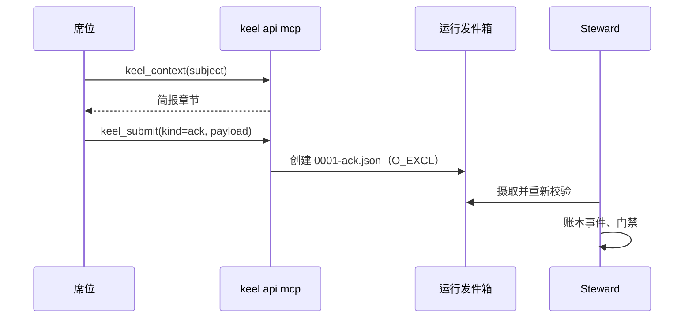

# 12 CLI、智能体 API 与 MCP

> 英文原文（规范版本）：[12-cli-api-mcp.md](12-cli-api-mcp.md)。本文是其简体中文镜像，两者不一致时以英文版为准。

本文档是 keel 命令接口的归属文档（home）：16 个动词及其计数的模式、JSON 信封（envelope）、退出码、面向智能体的 `keel api`、带 `keel_submit` 写入范围的 MCP 服务器，以及 `keel hook` 入口。在 M0 中这里的一切都不可执行；在 M1 之前 `package.json` 没有 `bin`。该接口在类型层面的镜像是 `src/cli/commands.ts`（动词、模式和退出码）和 `src/api/contract.ts`（api 操作、提交通道、信封）；`src/mcp/tools.ts` 为 MCP 工具定义类型。本文档与这些文件必须列出相同的动词、模式和代码。

相关归属文档：各门禁（gate）检查什么见 [11-verification.zh-CN.md](11-verification.zh-CN.md)；批准的语义见 [02-alignment.zh-CN.md](02-alignment.zh-CN.md)；各运行时（runtime）的提交通道见 [09-runtimes.zh-CN.md](09-runtimes.zh-CN.md)；所有者的日常命令见 [00a-owner-guide.zh-CN.md](00a-owner-guide.zh-CN.md)。

## 1. 16 个动词与至多 40 个模式

接口预算（KP-14）是 16 个顶层动词和至多 40 个动词模式；这一教训来自 oh-my-claudecode、oh-my-codex、BMAD-METHOD 和 superpowers 的接口膨胀。概要：

```text
keel init [--vcs auto|git|jj] [--runtimes <id,...>] [--yes]
keel sync [--check] [--runtime <id>]
keel doctor [--section runtimes|providers|vcs|approvals|exposure|arch] [--conformance] [--selftest] [--json]
keel new "<title>" [--goal G-nn] [--track spike|patch|feature|system] [--policy <name>]
keel approve <subject> --stage contract|plan|land|receipt
keel approve --doc <path>
keel approve --policy <name>
keel approve <subject> --request
keel approve <subject> --rule answer|budget|track|override|dismiss|degraded|unverified|abandon
             [--until <date|land|commit-touching:path>] [--limit <usd|runs|wall_minutes>=<n>]
             [--to spike|patch|feature|system] [--note "<text>"] [--as <approver>]
keel run <P|P.Tn> [--seat <seat>] [--wave] [--runtime <id>] [--resume] [--dry-run]
keel run --hold on|off <P>
keel check [<P>] [--gate frame|plan|submit|verify|land|all] [--check <id>] [--at <commit>] [--json]
keel land <P> [--preview]
keel status [<id>] [--next] [--json]
keel trace <file:line|symbol|commit|R-...|G-...|P-...|el:...> [--matrix] [--json]
keel brief <P|P.Tn> [--seat <seat>] [--format md|json]
keel arch index|find|impact|drift|plan|render ...
keel audit [--rebuild] [--export-vcs] [--backfill]
keel dashboard build [--out <file>]
keel dashboard serve [--port 0]
keel api ack|ask|rule|submit|context --input <json|-> --json
keel api mcp [--http]
keel hook <canonical event> --runtime <id>
```

计数规则。一个模式是一个子命令词，或一个选择不同操作的标志（不同的副作用、不同的批准对象种类，或某个操作的仅检查变体）。不计数的有：枚举参数值（`--stage`、`--rule`、`--section`、`--gate` 的取值）、输出视图（`--json`、`--format`、`--next`、`--matrix`）、过滤器（`--check <id>`、`--at`、`--seat`、`--runtime`）以及调节项（`--wave`、`--resume`、`--until`、`--limit`、`--to`、`--note`、`--as`、`--out`、`--port`、`--http`、`--goal`、`--track`、`--vcs`、`--runtimes`、`--yes`）。`keel new --policy <name>` 是受理加上 `approve --request` 确认流程，因此批准只在 `approve` 下计数一次。

| 动词 | 计数的模式 | 数量 | 在 `KEEL_RUN` 下 | 阶段 |
| --- | --- | --- | --- | --- |
| `init` | init | 1 | 拒绝 | 初始化 |
| `sync` | generate；`--check` | 2 | 拒绝 | 初始化、CI |
| `doctor` | probe（带 `--section`）；`--conformance`；`--selftest` | 3 | probe 允许；`--conformance` 和 `--selftest` 拒绝 | 初始化、运维 |
| `new` | intake | 1 | 拒绝 | 受理 |
| `approve` | `--stage`；`--doc`；`--policy`；`--request`；`--rule` | 5 | 拒绝 | 检查点、裁定 |
| `run` | dispatch；`--dry-run`；`--hold` | 3 | 拒绝 | 框定至验证 |
| `check` | check | 1 | 仅报告（不写账本） | 任意 |
| `land` | land；`--preview` | 2 | 拒绝 | 落地 |
| `status` | status | 1 | 允许 | 任意 |
| `trace` | trace | 1 | 允许 | 任意 |
| `brief` | brief | 1 | 允许 | 任意席位 |
| `arch` | index；find；impact；drift；plan；render | 6 | find、impact、drift 和 plan（仅打印）允许；index 和 render 拒绝 | 设计至落地 |
| `audit` | default pass；`--rebuild`；`--export-vcs`；`--backfill` | 4 | 拒绝 | 运维、关闭 |
| `dashboard` | build；serve | 2 | 拒绝 | 任意 |
| `api` | ack；ask；rule；submit；context；mcp | 6 | 允许（这正是其用途） | 智能体 |
| `hook` | hook | 1 | 允许 | 运行时钩子 |
| **合计** | | **40** | | |

预算已满：新增模式必须替换一个现有模式。

各动词的作用：

- **init** 搭建 `.keel/`、控制平面 `.git/keel/` 和工作区根目录，设置 `trace.since`（追溯纪元），并运行 `sync`。它不需要任何密钥、签名者或硬件；董事会（Board）事后用 `keel approve --doc` 批准搭建出的文档。幂等。
- **sync** 生成 keel 自有的接入面，并为共享设置打印片段（[09-runtimes.zh-CN.md](09-runtimes.zh-CN.md)）。`--check` 不写任何东西，在出现漂移（drift）或手册预算超限时失败。
- **doctor** 运行能力探测并打印验证状态：SET/UNSET 的环境变量名和 PRESENT/ABSENT 的模型提供方（provider）路径（仅 stat）、兼容性、认证模式、暴露面画像（exposure profile）（工具环境变量、工具文件、控制平面、垫片覆盖）、批准状态（没有账本事件的记录、所绑定内容已变更的批准、即将到期的文档与策略）、git 版本下限、ref 冲突和 jj 隐患检查，以及惰性的架构检查。`--conformance` 在用户主动选择时于真实路由上运行行为场景；`--selftest` 在临时仓库中演练每个动词。
- **new** 铸造一个提案（proposal）id，检查锚点，划分轨道（track），并创建 `keel/<P>/main` 和计划工作树（worktree）。使用 `--policy` 时，董事会在同一交互流程中查看并批准逐字的请求。
- **approve** 是唯一的董事会批准路径。它准确展示需要阅读的内容和变更本身，接受显式确认（在 TTY 上输入确认词，或在 Git Bash mintty 下输入所显示的确认码），重新计算所绑定产物的哈希，并把记录连同其 `approval.recorded` 事件写入 `.keel/approvals/` 下（[02-alignment.zh-CN.md](02-alignment.zh-CN.md)）。`--stage` 批准一个检查点（checkpoint），`--doc` 批准一份治理文档，`--policy` 批准一项常设策略（standing policy），`--request` 批准一个逐字的变更请求，`--rule` 批准一项裁定（ruling）（`--until` 设置豁免的到期时间，`--limit` 设置预算裁定的新上限，`--to` 设置轨道裁定所定的轨道；这两个值都记入记录的 `rule` 对象中）。`--note` 添加备注；在未配置 `board.approver` 时，`--as` 指定本次确认的批准人。它在 keel 运行内拒绝执行，在席位运行期间等待监督者锁，并在所绑定产物于显示期间发生变化时以 `changed-during-confirmation` 拒绝。
- **run** 是确定性的派发器：解析已批准的路由、兼容性、暴露规则和一致性测评状态（conformance status）；认领（claim）；创建稀疏工作树；对 ref 做快照；编译简报（brief）；以每次运行的配置无头派生；摄取提交通道；创建 Steward 提交。`--dry-run` 在认领和派生之前停止，并打印解析出的路由和 argv 模板。`--hold on|off <P>` 暂停或释放一个提案。
- **check** 运行阶段门禁；见 [11-verification.zh-CN.md](11-verification.zh-CN.md)。
- **land** 执行集成、预览、在集成提交上重新执行验收，并写出回执草稿。若该草稿尚无落地批准（也没有已批准的落地策略），它就在此停止并以退出码 3 结束。在 `keel approve <P> --stage land` 之后，再次运行 `keel land` 会检查草稿的哈希仍与记录所绑定的一致、写入归档提交（其中投影已批准的回执），并推进主干（ff-only 或 CAS）。`--preview` 在预览之后停止。放弃通过 `keel approve <P> --rule abandon` 完成。
- **status** 根据账本（ledger）计算状态；`--next` 列出合法的下一步动作。
- **trace** 从某个文件行、符号、提交或 id 出发遍历追溯图；`--matrix` 打印 RTM（[04-trace-and-state.zh-CN.md](04-trace-and-state.zh-CN.md)）。
- **brief** 打印某个席位（seat）和对象的已编译简报，附带其哈希和 ACK（复述确认）id 集。它是拉取通道，也是梯级（rung）D 的粘贴来源。
- **arch** 涵盖逐提交的索引、映射到架构元素（element）的搜索、影响面（impact）、漂移、类型化的架构操作以及导出（[07-architecture-intelligence.zh-CN.md](07-architecture-intelligence.zh-CN.md)）。
- **audit** 执行活性、租约、豁免（override）和链的巡检；`--rebuild` 用集合差比较 `trace.db` 与一次完整重建的结果；`--export-vcs` 导出 jj 操作日志和 evolog；`--backfill` 回填指标序列。
- **dashboard** 构建只读看板（dashboard），或在回环地址上提供服务（[08-dashboard.zh-CN.md](08-dashboard.zh-CN.md)）。
- **api** 和 **hook** 是智能体和运行时的入口（第 4 至 6 节）。

防席位误用的动词。表中每个标为拒绝的模式，在设置了 `KEEL_RUN` 或 `KEEL_RUN_ID` 时，或当某个祖先进程是已登记的 keel 运行时，都会拒绝（Windows 上的祖先进程遍历待探测验证（verify by probe））。蓝图点名了 `new`、`run`、`land`、`sync`、`audit` 和 `approve`；其余被拒绝的模式源自这样一条规则：只有 Steward 写声明平面、控制平面和 ref。

## 2. JSON 信封

每个接受 `--json` 的动词以及每个 `keel api` 操作，都会在 stdout 上恰好打印一个 JSON 文档：由 `schemas/api-envelope.schema.json` 定义的信封，字段名以该 schema 为准。进度和面向人的文本输出到 stderr。看板背后是同一个模型，因此 CLI、MCP 和看板从不相互矛盾。

```json
{
  "v": 1,
  "ok": false,
  "command": "check",
  "subject": "P-7F3K9Q",
  "exit_code": 1,
  "data": {
    "gate": "submit",
    "checks": [
      { "check": "submit.scope", "status": "fail", "passed": 3, "total": 4, "unit": "changed paths in scope" }
    ]
  },
  "diagnostics": [
    {
      "code": "submit.scope",
      "severity": "error",
      "subject": "P-7F3K9Q.T2",
      "message": "1 changed path is outside write_set",
      "hint": "keel status P-7F3K9Q.T2 --next"
    }
  ],
  "next": ["keel status P-7F3K9Q.T2 --next"],
  "freshness": {
    "computed_at": "2026-09-25T10:00:00Z",
    "head_commit": "3f9a1c0d2e4b6a8c0e1f3a5b7c9d1e3f5a7b9c0d",
    "index_commit": null,
    "charter_version": "1.0.0"
  }
}
```

规则：

- 当且仅当 `exit_code` 为 0 时，`ok` 为 true。
- `diagnostics[].code` 是 [11-verification.zh-CN.md](11-verification.zh-CN.md) 中的检查 id 或一个拒绝代码；每个错误都带有一个 `hint`，给出下一步要运行的命令（成功导向的指引，思路来自 codegraph）。
- 聚合值始终带有分母，`freshness`（通用 `freshness` 定义）说明答案是基于什么计算的。
- 任何字段都从不携带模型提供方的值；环境变量名只以名称形式出现，记录中使用 `${ENV:NAME}` 占位符（P1，[10-providers.zh-CN.md](10-providers.zh-CN.md)）。

## 3. 退出码

keel 自身的退出码，所有动词共用：

| 代码 | 含义 | 典型原因 |
| --- | --- | --- |
| 0 | ok | 命令成功；每项被选中的检查都已通过或被豁免 |
| 1 | 门禁失败 | 某项检查失败（`keel check`，`run` 和 `land` 内部的门禁） |
| 2 | 用法错误 | 未知的动词、模式或标志；无效的输入 JSON |
| 3 | 需要人工 | 有待处理的董事会事项：批准、提问、裁定、停止类别、需要决策的 `blocked(...)` |
| 4 | 认领冲突 | 认领 ref 上的 CAS 失败；从不自动重试 |
| 5 | 已过期，或检出的主干有未提交改动 | 主干已移动（重新堆叠后重试），或检出了主干的工作树有未提交改动 |
| 6 | 环境问题 | git 缺失或过旧、在 `KEEL_RUN` 下或存在 keel 运行祖先进程时被拒绝 |

运行时退出码（例如 53 轮次上限、55 预算、42 输入错误、143 仅限 POSIX）是另一回事：描述符把它们映射为规范的运行结果（[09-runtimes.zh-CN.md](09-runtimes.zh-CN.md)）。

## 4. keel api

`keel api` 是席位（或在梯级 D 下代其行事的人）与 Steward 通信的方式。每个操作至多写一个文件，写入运行发件箱（outbox），Steward 在摄取时校验该文件；api 侧的校验只是便利，从不是信任边界。

```text
keel api ack     --input <json|-> --json
keel api ask     --input <json|-> --json
keel api rule    --input <json|-> --json
keel api submit  --input <json|-> --json
keel api context --input <json|-> --json
```

- 运行绑定：运行由 `KEEL_RUN_ID` 标识，由 Steward 在派生时设置。在梯级 D 下，由人把它设为 `keel run` 打印出的 id。没有运行时，除 `context` 外的每个操作都会拒绝。
- 投递文件（drop）：`<workspace_root>/_runs/<RUN>/outbox/<seq>-<kind>.json`，以 O_EXCL 创建，从不覆盖。发件箱只在 workspace-write 模式下可写；只读模式使用最终消息或 MCP（[09-runtimes.zh-CN.md](09-runtimes.zh-CN.md) 第 4 节）。
- 每个席位允许的操作来自席位契约（`org/seats/*.yaml`）。

| 操作 | 载荷 | schema | 摄取后的效果 |
| --- | --- | --- | --- |
| `ack` | ACK：简报哈希、目的、逐席位 id 集、非目标、`write_set`、计划步骤、假设、问题 | `schemas/ack.schema.json`（严格子集） | `ack.recorded`，与简报做差异比对（[02-alignment.zh-CN.md](02-alignment.zh-CN.md)） |
| `ask` | 条款 id 与问题（`clause`、`question`） | 问题记录（Q，`schemas/governance-record.schema.json`） | `question.asked`；按条款类型路由；任务挂起 |
| `rule` | `clause`、`what`、`why`、`cost_if_wrong`、`reversible` | 裁定记录（RL，`schemas/governance-record.schema.json`） | `ruling.made`；在决策边界之外或涉及停止类别时会被标记 |
| `submit` | 席位的输出：结果、评审镜头（lens）的评审结论（verdict），或规划席位的分诊记录 | `schemas/result.schema.json`、`schemas/verdict.schema.json` 或 `schemas/triage.schema.json` | `result.submitted`；提交门禁运行 |
| `context` | 对象（必填）、席位（null 表示所绑定运行的席位）、章节（null 表示整份简报） | 无（读取） | 无：返回简报章节、架构元素简报和新鲜度 |

`keel api` 从不提交、从不在发件箱之外写入、从不触碰 ref；席位从不提交（由 Steward 提交，[ADR-0004](adr/ADR-0004-steward-commits-and-submit-channels.zh-CN.md)）。面向非 Claude 评审者的 verdict 文件契约是来自 oh-my-claudecode 的思路。

## 5. MCP（两个读工具，一个写工具）

`keel api mcp` 通过 stdio 提供 MCP；`--http` 在 `127.0.0.1` 的临时端口上提供服务，并做 Host 和 Origin 检查。无头运行通过每次运行的 `<run>/mcp.json`（`templates/runtime/mcp.json.tmpl`）注册它，该文件把服务器绑定到一次运行；交互式会话获得一个打印出的片段。KP-14 把默认集合限制为三个工具：

| 工具 | 类型 | 输入 | 输出 |
| --- | --- | --- | --- |
| `keel_context` | 读 | `subject`（必填）、`seat`、`section`（后两者可为 null） | 按对象返回的简报章节、架构元素简报、新鲜度 |
| `keel_arch` | 读 | `op`（`find`、`impact`、`element`）、`query` | 映射到架构元素的命中结果、所有者和索引新鲜度（[07-architecture-intelligence.zh-CN.md](07-architecture-intelligence.zh-CN.md)） |
| `keel_submit` | 写（仅发件箱） | `kind`（`ack`、`ask`、`rule`、`result`、`verdict`、`triage`）、`payload` | 投递文件的文件名和校验摘要 |

`keel_submit` 的写入范围，穷尽列举如下：

1. 它只写入服务器为之启动的那次运行的发件箱（来自每次运行 MCP 配置的 `KEEL_RUN_ID`）。没有绑定的运行时它会拒绝。
2. 每次调用恰好创建一个新文件 `<seq>-<kind>.json`，使用 O_EXCL，序号由服务器分配。它从不覆盖、追加、重命名或删除文件。
3. 只接受席位契约允许的种类。
4. 在写入之前，载荷会依据其 schema 以及 `config/keel.defaults.yaml` 中的大小上限（`caps.submit_payload_bytes`）进行校验。
5. 文件名和目录来自服务器，从不来自载荷；载荷中的路径只是数据。
6. 没有其他副作用：不追加账本、不做 git 操作、不发起网络调用、不读取任何其他文件。Steward 稍后摄取该投递文件并重新校验。
7. 当 MCP 服务器运行在运行时的工具沙箱之外时（逐运行时待探测验证），这是只读席位唯一能做的写入，这正是它存在的原因。

可以通过 `KEEL_MCP_TOOLS` 按名称启用额外的工具；它们都是读工具。`keel_submit` 始终是唯一的写工具。



## 6. keel hook

`keel hook <canonical event> --runtime <id>` 是所有运行时唯一的钩子入口。规范事件名、它们在各运行时中的原生对应项及其可阻断性只存放在 `runtimes/hook-events.yaml`（`schemas/hook-events.schema.json`）中。注册方式要么是每次运行的设置文件（claude-code），要么是打印出的片段（claude-code、Qwen 和 Gemini 用项目设置；Kimi 用用户全局配置）；keel 从不写共享设置。

行为：

1. 从 stdin 读取原生钩子载荷并映射为规范事件。
2. 评估适用于该事件的守卫：首次编辑前须有 ACK、`write_set` 与冻结路径、模型提供方路径集、保留操作，以及压缩后的简报重新注入（[09-runtimes.zh-CN.md](09-runtimes.zh-CN.md) 第 4 节）。
3. 以运行时的原生形式应答：在运行时支持阻断之处，退出码 2 表示阻断；注入的上下文通过运行时的上下文字段传递。
4. 发生任何内部错误时，失败放行（允许），而不是中断会话。
5. 为每次调用记录一个类型化的结果（allow、block、inject、error）。在 keel 运行内部，该结果作为 O_EXCL 投递文件写入运行发件箱，并作为账本事件被摄取，这样 `keel doctor` 可以报告逐事件的分母（触发、阻断、出错）。在运行之外（由片段引导的交互式会话），钩子仅作提示，不记录任何东西，因为只有 Steward 写控制平面。在发件箱不可写之处，分母显示为 `unknown`。

钩子警告，门禁决定（KP-10）。钩子协助实现的每项保证，都会由 Steward 在摄取、提交和落地时重新检查（[11-verification.zh-CN.md](11-verification.zh-CN.md)）。记录日志的失败放行钩子是来自 edikt 的思路（仅借鉴思路）；带回退阶梯的逐事件能力矩阵来自 oh-my-codex。
