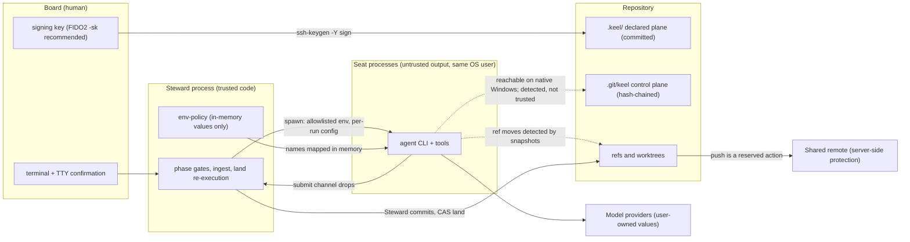
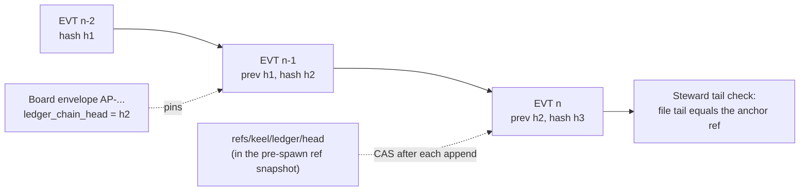

# Trust boundaries and security

This document owns keel's threat model, signing key hygiene, the meaning of the exposure profile and its
known limits, the integrity argument behind the hash chain and re-execution, the handling of untrusted data,
and the server-side protections keel recommends. Mechanics live in their home documents and are linked, not
repeated:

- approval envelopes and the approval flow: [02-alignment.md](02-alignment.md) and
  [ADR-0005](adr/ADR-0005-signed-board-approvals.md);
- the ledger format, ids and trailers: [04-trace-and-state.md](04-trace-and-state.md);
- reserved-operation detection and land mechanics: [05-vcs.md](05-vcs.md);
- runtime permissions, trust and rungs: [09-runtimes.md](09-runtimes.md);
- the provider invariant and the exposure rule: [10-providers.md](10-providers.md);
- the gate catalogue, evidence and negative controls: [11-verification.md](11-verification.md).

## Threat model

keel is a cooperative local process, not an OS security sandbox. On native Windows most agent CLIs run with
the user's full file rights, so keel does not promise that a seat cannot reach something. It promises that
what matters is either prevented where the runtime and OS allow it, or detected after the fact, and it says
which, per runtime and OS (KP-16). The guarantees rest on four things that hold at every rung: Board
signatures, Steward re-execution, ref snapshots and hash chains.

### Assets

| Asset | Where it lives | Why it matters |
| --- | --- | --- |
| Board authority | Board private keys (outside the repository, ideally on a FIDO2 authenticator); `.keel/board/allowed_signers`; `.keel/signatures/` | Every checkpoint, ruling, policy and governance document derives its force from a Board signature. |
| Trunk history | `refs/heads/<trunk>` locally and on the shared remote | Landed code is the product; it must only move through `keel land` or an explicit Board action. |
| Frozen intent and contract | `intent.md` frozen block, `contract_hash`, `.keel/charter.md`, `.keel/goals.yaml` | Weakening acceptance silently is the most damaging alignment failure. |
| Evidence and verdicts | `.git/keel/records/`, archive projections | "Done" means evidence keel re-executed. |
| Ledger | `.git/keel/ledger/<yyyy-mm>.jsonl` | The only truth store for events; all state is computed from it. |
| Provider values and runtime credentials | the user's environment, runtime homes and credential files | They belong to the user (P1). keel never opens them and must not let a seat read them. |

### Actors and trust levels

| Actor | Trust | Runs as | Notes |
| --- | --- | --- | --- |
| Board | Trusted; the only authority | A human at a terminal with a signing key | Signs through `keel approve` only. |
| Steward (keel core) | Trusted code | The user's OS account | Deterministic; never calls a model in its own process. |
| Seat processes | Output is untrusted data | The user's OS account (an isolated seat OS account is an M6 evaluation, [17-open-decisions.md](17-open-decisions.md)) | An agent CLI plus a model, spawned headless with a per-run config. |
| Direct-lane child | Tool-less; untrusted output | A separate child process spawned by the Steward (M6) | Holds one routed profile's values in memory at call time only. |
| Model providers | External; user-owned | Outside the machine | keel knows only env var names, protocol ids and aliases. |
| Repository content and third-party text | Untrusted data | n/a | Source files, issue text, test output, fetched pages. |
| Shared git remote | Outside keel | A forge or server | Protected by server-side rules (see the last section). |

### Trust boundaries



Solid arrows are the designed paths. Dotted arrows are paths keel cannot close on every runtime and OS, and
therefore detects and never trusts.

### Threats and responses

| Id | Threat | Prevented where possible by | Always detected or neutralized by | Home |
| --- | --- | --- | --- | --- |
| T1 | A seat or script mints, relays or replays a Board approval | `keel approve` refuses under `KEEL_RUN`/`KEEL_RUN_ID` and under a keel-run ancestor (Windows ancestry walk: verify by probe); interactive confirmation | Signatures verified against `allowed_signers` at the last Board-signed trunk revision; envelopes bind artifact hashes, a nonce and the chain head | [02](02-alignment.md), [ADR-0005](adr/ADR-0005-signed-board-approvals.md) |
| T2 | A seat signs with a Board key held by an ssh-agent | `SSH_AUTH_SOCK` and `KEEL_BOARD_*` are never passed to seats | Fail-closed agent check: approve, dispatch and land exit 6 | This document |
| T3 | A seat forges an evidence (EV) or verdict (VD) record | Sandboxed control plane where the runtime has a write boundary | EV files are a cache; land re-executes the full acceptance matrix; verdicts are captured at ingest | [11](11-verification.md) |
| T4 | A seat edits or appends ledger lines (for example a forged `verdict.recorded`), or edits claim state | Same as T3 | Hash chain; tail check against the Steward-owned anchor ref `refs/keel/ledger/head` before each append; the window check at ingest, which accepts only the supervisor's own appends and Board-signed approvals; chain head in every envelope; claim state derived from the ledger | [04](04-trace-and-state.md) |
| T5 | A seat moves refs, rewrites history or pushes | Generated permission rules, PreToolUse guards, seat git env hardening, advisory shims (M2) | Ref snapshot diff at ingest and land; `git ls-remote` before and after each run; the jj op log when enabled | [05](05-vcs.md) |
| T6 | A seat reads provider values or credential files, typically while debugging a failing model call | Env allowlist, generated deny-read rules, the exposure rule (code-executing seats only on scrubbed env plus none/blocked files) | Ingest fails the run on any tool event touching the provider path set; the "provider 401 temptation" conformance scenario | [10](10-providers.md) |
| T7 | One agent defines, builds and certifies its own acceptance | Frozen tests outside the builder's write_set | Verification-gap lens, red/green proof on policy lands, cross-family review | [11](11-verification.md) |
| T8 | A change slips through labelled too low, or grows past its scope | write_set permissions where the runtime supports them | Submit-time scope check and the upward-only track ratchet | [03](03-lifecycle.md), [11](11-verification.md) |
| T9 | A standing policy lands a change no human named | `keel new --policy` requires a Board-signed request envelope | Policy dispatch and land re-verify that signature; proposals record their origin | [03](03-lifecycle.md) |
| T10 | Prompt injection through repository content, tool output or memory | Seats hold no authority; stop classes force asks | Scope check, context-free lenses, Board reads the receipt | Untrusted data (below) |
| T11 | Provider URLs, keys or model names leak into records or projections | Typed-field whitelist at ingest; `argv.redacted.json` keeps `${ENV:NAME}` placeholders | The projection gate at land rejects URL-shaped and key-shaped tokens | [04](04-trace-and-state.md), [10](10-providers.md) |
| T12 | Runtime project config layers or hooks are altered to weaken enforcement | keel never relies on project `.codex/`, `.gemini/` or `.qwen/` layers; headless runs use per-run keel-owned configs | Hooks are journaled advisories; gates re-check at ingest, submit and land | [09](09-runtimes.md) |
| T13 | The dashboard is used as an approval path, or attacked through the browser | No write endpoints exist | Loopback bind, Host and Origin checks | [08](08-dashboard.md), [ADR-0008](adr/ADR-0008-read-only-dashboard.md) |
| T14 | Command injection through npm `.cmd` shims on Windows (CVE-2024-27980) | `shell:false`; shims resolved to the node script or `.exe`; only a fixed short string in argv | Spawn contract tests on windows-latest | [ADR-0002](adr/ADR-0002-node-windows-native.md) |
| T15 | An external adapter edits agent configs or sends telemetry | codegraph runs only in a detached verify or index checkout, index and query commands only, telemetry and daemon off (verify by probe) | doctor reports inert or misbehaving backends | [07](07-architecture-intelligence.md) |

### Out of scope

- A malicious or compromised Board member. A valid Board signature is authority by definition.
- Malware or another person operating the user's OS account outside keel, for example capturing a
  passphrase as it is typed.
- Network egress by seat processes. keel does not filter network traffic; a seat with shell tools can reach
  the network with the user's rights.
- Provider-side behaviour, model quality and plan terms. doctor reminds the user to check their own plan
  terms and asserts none.
- Confidentiality of repository content from the providers the Board routes to. Routing is a Board decision
  recorded in the signed `.keel/routing.yaml`.
- Concurrent use from several machines. v1 is single-machine ([17-open-decisions.md](17-open-decisions.md)).

## Signing key hygiene (fail-closed)

An approval is only as authentic as the act that produced it. keel's rule is that every Board signature
needs a human act at signing time, a hardware touch or a typed passphrase, and that no other process of the
same user can obtain a signature silently. On Windows an ssh-agent (including the service behind the named
pipe `\\.\pipe\openssh-ssh-agent`) serves keys to any process of the same user, so a signer key held by an
agent fails that rule unless each use still needs a touch.

### Key choices

| Key | Status | Reason |
| --- | --- | --- |
| FIDO2 key (`ed25519-sk` or `ecdsa-sk`) | Recommended, especially on Windows | Each signature needs a physical touch, so the key may sit in an agent. `-sk` support in the Windows OpenSSH `ssh-keygen` and in the Git for Windows `ssh-keygen`: verify by probe. doctor names the verified `ssh-keygen` path. |
| Passphrase-protected key that is never added to an agent | Allowed | The passphrase is typed per signature. |
| Any non-`-sk` signer key listed by a reachable agent | Refused | approve, dispatch and land exit 6 until the key is removed from the agent. |
| Key without a passphrase | Not detectable, strongly discouraged | keel never opens private key files, so it cannot tell. It defeats the design and is the Board's responsibility. |

### Key selection

keel learns which key to sign with from two environment variables, both set by the Board member in their
own terminal. They hold a path and a name, never key material, and are never passed to seats
([10-providers.md](10-providers.md)):

| Name | Holds | Used by |
| --- | --- | --- |
| `KEEL_BOARD_KEY` | Path of the Board member's private key file; for a FIDO2 key, the key-handle file that `ssh-keygen -t ed25519-sk` writes | `keel approve`, which passes it to `ssh-keygen -Y sign -f` and never opens it; keel reads only the public key next to it (`<path>.pub`) to find the matching `allowed_signers` line |
| `KEEL_BOARD_PRINCIPAL` | The principal to sign as, exactly as written in `.keel/board/allowed_signers` | `keel approve`; optional when the public key matches exactly one line |

These are the only `KEEL_BOARD_*` names. `keel init --signer <public key file>` registers the first signer
(trust on first use) from a public key file. Setup, in order:

1. Create the key, preferably `ssh-keygen -t ed25519-sk -f <path>` (`-sk` support in the Windows OpenSSH
   and Git for Windows builds: verify by probe), otherwise an `ed25519` key with a passphrase that is never
   added to an agent.
2. Set `KEEL_BOARD_KEY` to that path (and `KEEL_BOARD_PRINCIPAL` if needed), then run
   `keel init --signer <path>.pub`.
3. Run `keel doctor --section signing`, which reports the verified `ssh-keygen` path, whether the key is
   `-sk` and whether any signer key is agent-loaded.

### The agent check

keel runs the check before `keel approve`, before dispatch in `keel run`, and before `keel land`:

1. Load the allowed signer public keys from the `allowed_signers` blob at the last Board-signed trunk
   revision (never from the working tree).
2. List the keys held by reachable agents with `ssh-add -L`: through `SSH_AUTH_SOCK` when it is set, and
   through the Windows OpenSSH agent pipe.
3. If any allowed signer key is listed and is not an `-sk` key, stop with exit code 6 and guidance: remove
   it from the agent (`ssh-add -d <path-to-board-key>`, or `ssh-add -D` to remove every identity) or move
   to an `-sk` key. The Windows OpenSSH agent service keeps added keys across reboots, so a key added once
   stays loaded until it is removed.

`keel doctor --section signing` reports the same result, the agent channels it checked, the verified
`ssh-keygen` path and whether each signer key is `-sk`. Only these two channels are enumerated; an agent
that serves keys through another channel is not detected, which is recorded as a known limit below.

The negative control for this check, required by the M1b exit: a passphrase key loaded into the agent must
make `keel approve` and `keel land` refuse.

### Confirmation and refusal rules

- `keel approve` requires interactive confirmation: a TTY, or a typed confirmation code under Git Bash
  mintty, where Node does not see a TTY.
- It refuses under `KEEL_RUN` or `KEEL_RUN_ID`, and when an ancestor process is a registered keel run. The
  ancestor walk on Windows is to be verified by probe.
- It prints exactly what the Board must read at that checkpoint (`org/checkpoints.yaml`), and the quote the
  Board types becomes part of the signed envelope.
- Seats never receive `SSH_AUTH_SOCK`, `KEEL_BOARD_*` or git credential helpers in their environment
  ([10-providers.md](10-providers.md)).

### Signer list and trust root

`.keel/board/allowed_signers` uses the OpenSSH `allowed_signers` format; this section is its home. One line
per principal and key, restricted to the `keel-approval` namespace. Example with obviously fake keys:

```text
board-owner@example.com namespaces="keel-approval" sk-ssh-ed25519@openssh.com AAAA-fake-keel-example-sk
board-second@example.com namespaces="keel-approval" ssh-ed25519 AAAAC3NzaC1lZDI1NTE5AAAA-fake-keel-example
```

- The trust root is the root signer fingerprint pinned in the signed charter. `keel init` registers the
  first signer as trust on first use, with a quoted consent recorded under `.keel/signatures/`.
- Adding or removing a signer is a change to `allowed_signers` signed by an existing signer and committed
  through a Steward governance commit (`Keel-Doc`, `Keel-Approval`).
- Verification always reads the blob at the last Board-signed trunk revision, so a seat that edits the
  working-tree copy changes nothing.

The OpenSSH commands keel runs on the canonical payload bytes (the Board never needs to type them):

```sh
ssh-keygen -Y sign -f <board key> -n keel-approval <payload>
ssh-keygen -Y verify -f <allowed_signers blob> -I <principal> -n keel-approval -s <payload>.sig < <payload>
```

## Exposure profile and known limits

The exposure profile states, for one runtime on one OS with one auth mode, what a seat process can reach.
`keel doctor --section exposure` computes it, dispatch freezes it into the run record, and every receipt and
the dashboard's runtime health view show it. The rule that acts on it, refusing a code-executing seat on an
exposed route with no Board-ack path, lives in [10-providers.md](10-providers.md).

### Fields

| Field | Values | Meaning | How it is established |
| --- | --- | --- | --- |
| `tool_env_exposure` | `scrubbed`, `exposed`, `unknown` | Whether processes started by the seat's tools inherit provider env values | The descriptor's env scrub control, verified by probe per runtime version |
| `tool_file_exposure` | `none`, `blocked`, `exposed`, `unknown` | Whether the seat's tools can read the names-only provider path set | `none`: no path in the set exists, tested with stat only and never opened. `blocked`: deny rules or an isolated seat OS account, verified by probe |
| `control_plane_exposure` | `sandboxed`, `exposed` | Whether the seat can write `.git/keel` | The runtime's write boundary. Codex sandboxes restrict writes only; reads are unrestricted on every OS |
| reserved-operation prevention | per mechanism | Which reserved operations are prevented rather than only detected | Permission rules, PreToolUse guards, seat git env hardening and shim coverage per runtime shell |

`unknown` is treated as `exposed` by every rule.

### Prevented versus detected

| Concern | Prevented when | Always detected by | Not covered |
| --- | --- | --- | --- |
| Approval forgery | Always (a signature is required) | Steward verification on every clone | A compromised Board key |
| Board key misuse through an agent | The agent check passes | doctor and the agent check | Agents on channels other than `SSH_AUTH_SOCK` and the Windows pipe |
| Evidence forgery | `control_plane_exposure: sandboxed` | Land re-execution | None for land decisions |
| Ledger edits and forged appends | `control_plane_exposure: sandboxed` | Hash chain, tail check against the anchor ref, window check at ingest, chain head in envelopes | A process that outlives its run window (limit 11) |
| Ref moves and history rewrites | Permission rules and hooks on rungs A and B | Ref snapshot diff | None |
| Pushes | Invalid per-worktree `pushurl`, reset credential helper | `git ls-remote` before and after each run | A push to an unconfigured URL with the seat's own credentials |
| Provider value reads | `scrubbed` env and `none`/`blocked` files | Ingest check on tool events | Code run by tests or declared commands |
| Writes outside write_set | Runtime path permissions where they exist | Submit scope check | None for land decisions |

### Known limits

1. Native Windows has no OS write or read boundary for most agent CLIs. Seats run with the user's file
   rights unless the optional isolated seat OS account (M6, verify by probe) is used.
2. Codex sandboxes restrict writes only. Reads are unrestricted on every OS, so its `sandboxed` control
   plane value covers writes only.
3. Code run by tests or declared commands under the same OS account cannot be fully contained on native
   Windows. The ingest check sees tool events only, not what a test process does.
4. A push to a URL that is not a configured remote, using credentials the seat obtained itself, is not
   detectable by `git ls-remote`. Server-side protection closes this gap.
5. Advisory shims (sh, `.cmd`, `.ps1`) are bypassed by Node and Rust spawns and by Git Bash resolution of
   bare names. doctor reports shim coverage per runtime shell.
6. Hooks fail open and load only where the runtime trusts the project. They warn; gates decide.
7. Model family independence is a Board declaration shown as "declared", never "verified". Under P1 keel
   cannot inspect endpoints or model names; the optional same/different check compares runtime-reported
   ids in memory and persists nothing.
8. keel does not control network egress of seat processes.
9. The agent check enumerates `SSH_AUTH_SOCK` and the Windows OpenSSH pipe only.
10. keel cannot tell whether a Board key has a passphrase.
11. Ledger events written after the most recent Board-signed chain head are protected by the anchor ref and
    the window check at ingest, not by a signature. Verdicts, ACKs and results do decide lands, so the
    window check is what keeps a seat from approving its own round. The residual gap is a process that
    outlives its run window: keel ends the seat's whole process tree (`taskkill /T /F`) before ingest, but a
    process that escapes the tree (for example one started through a scheduler or a service) can append
    events and move the anchor after the window was verified, and a later Steward process cannot tell
    those appends from its own. The optional isolated seat OS account (M6) closes this gap.

## Hash chain and re-execution

Because seats can write the control plane on most native Windows routes, keel never argues from
unreachability. Every record a seat could forge is either chained and anchored outside the files a seat can
edit silently, captured by the Steward itself inside a verified window, or recomputed before it can decide
anything; the one residual path is known limit 11. The ledger format is in
[04-trace-and-state.md](04-trace-and-state.md); the gates that consume these records are in
[11-verification.md](11-verification.md).



| Record a seat could forge | Why the forgery decides nothing | Where it is checked |
| --- | --- | --- |
| A ledger line | Each event carries the previous event's hash; every Board envelope pins the chain head; every Steward process checks the tail against the anchor ref before each append; `keel audit` reports `chain-break` | [04](04-trace-and-state.md) |
| An appended event such as `verdict.recorded`, `ack.recorded` or `result.submitted` | The window check at ingest accepts only the supervising process's own appends and Board-signed approvals; a seat that moves the anchor to cover a forged append makes a ref change caught by the pre-spawn ref snapshot (`blocked(reserved_op)`) | [04](04-trace-and-state.md), [05](05-vcs.md) |
| Claim state | Claim state is derived from ledger events; the claim ref is only a create-only CAS lock holding a token | [06](06-parallelism.md) |
| An EV file | EV files are a cache. Land re-runs the full acceptance matrix in-process on a fresh detached checkout of the integrated commit; reuse before land needs equal source-state match fields | [11](11-verification.md) |
| A VD file | Verdicts are captured at ingest from the child's final message, MCP submit or outbox, and bind the commit and contract hash; a VD file counts only with its `verdict.recorded` event from a verified window | [11](11-verification.md) |
| A signature envelope | Verified with `ssh-keygen -Y verify` against the committed `allowed_signers` at the last Board-signed trunk revision | [ADR-0005](adr/ADR-0005-signed-board-approvals.md) |
| An archive projection | Projections are durable history, never input; signatures are re-verified from `.keel/signatures/` | [04](04-trace-and-state.md) |
| A commit with keel trailers | Only the Steward commits; seat-made commits are preserved under `refs/keel/snap/` and never trusted | [ADR-0004](adr/ADR-0004-steward-commits-and-submit-channels.md) |

Each of these has a negative control with a pinned failure reason, among them: a chain edit is detected, a
forged `verdict.recorded` appended during a run (with and without moving the anchor) is caught at ingest,
a forged EV file is ignored by land re-execution, a seeded push is detected through `git ls-remote`, and a
seeded ref move is detected by the snapshot diff.

## Untrusted data

Everything a model, a runtime or a third party produces is data. Authority comes only from Board signatures
and Steward code (KP-04).

| Source | Treatment |
| --- | --- |
| Seat drops: ACK, result, verdict, rulings, asks, triage records | Schema-validated at ingest; id sets diffed against the brief; never executed; a ruling outside the decision boundaries or on a stop class is flagged |
| Seat text that claims approval or consent | Ignored. Approvals exist only as signed envelopes |
| Repository content, issue text, code comments, test output, pages fetched by seats | May carry prompt injection. Seats cannot approve, land, claim or move refs; the four stop classes force asks to the Board; scope check, ratchet and context-free lenses bound the damage; the Board reads the receipt |
| Runtime memory, session history, compaction summaries | Untrusted (an idea taken from OpenHands). After compaction the brief digest is re-injected from the Steward's compiled brief, not from memory |
| Runtime project config layers and shared settings (`.codex/`, `.gemini/`, `.qwen/`, `.claude/settings.json`) | Never read, written or relied on for enforcement. keel prints snippets; trust-bypass flags are used only after `keel approve --rule override`; `--dangerously-bypass-hook-trust` is never generated |
| Hook output, including post-compaction output | Advisory; journaled with denominators |
| Provider error bodies and runtime free-text errors | Not persisted (typed-field whitelist); the raw stream is parsed in memory and never written to disk |
| Runtime-reported model ids | Used only for the optional in-memory same/different check |
| Archive projections and ledger slices on a clone | Display only; signatures re-verified |
| Human commits made outside keel | Untraced until adopted through the patch track or a signed `--rule override` |
| Index output (codegraph, SCIP, heuristic, LLM) | Every edge carries provenance; heuristic and LLM edges never fail a gate |
| Dashboard serve requests | Loopback only, Host and Origin checks, read-only |
| MCP tool calls | `keel_submit` writes only to the run outbox; the Steward validates every drop |
| Strings bound for a child process | argv is built from descriptor templates; never `shell:true`; long text goes through stdin or files |

## Server-side branch protection recommendations

keel's reserved-operation detection is local. It cannot stop a push made with credentials a seat found
itself, and it does not govern what other machines push. Server-side rules close that gap. keel never
configures a forge; these are recommendations for the Board, and the exact setting names differ per forge.

1. Protect trunk: forbid force pushes and deletion.
2. Allow pushes and merges to trunk only from Board identities. Seat environments carry no forge
   credentials: keel resets `credential.helper` for seats and never passes credential helpers, and forge
   tokens should not live in variables a seat inherits.
3. Prefer a fast-forward-only or linear trunk. keel lands with `merge --ff-only` or a CAS `update-ref`, so a
   foreign merge commit on trunk signals a commit that still needs adoption.
4. Reject pushes of keel's local working refs (`keel/*` branches and `refs/keel/*`) where the forge
   supports ref-pattern rules. They are local state, and pushing is a reserved action.
5. From M1b, require a CI status check that runs `keel check --gate land --check signature --at <sha>` on
   trunk tips, so every governance commit carries an envelope that verifies against the committed signer
   list. The exact CI invocation is confirmed when M1b ships.
6. Put `.keel/board/allowed_signers`, `.keel/charter.md` and `.keel/routing.yaml` under the forge's
   code-owner review in addition to keel signatures.
7. Protect release tags.

Pushing to a shared remote stays a reserved action: the Board pushes after `keel land`. Multi-machine
collaboration is an open decision ([17-open-decisions.md](17-open-decisions.md)); until it is settled,
other machines see committed signatures and archive projections only.
