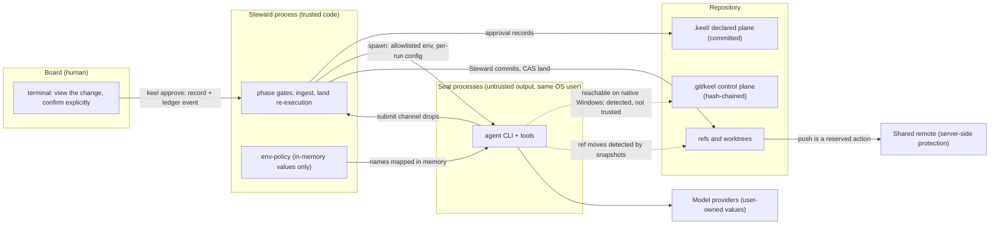

# Trust boundaries and security

This document owns keel's threat model, what an approval record proves and does not prove, the meaning of
the exposure profile and its known limits, the integrity argument behind the hash chain and re-execution,
the handling of untrusted data, and the server-side protections keel recommends. Mechanics live in their home documents and are linked, not
repeated:

- approval records and the confirmation flow: [02-alignment.md](02-alignment.md) and
  [ADR-0005](adr/ADR-0005-explicit-confirmation-approvals.md);
- the ledger format, ids and trailers: [04-trace-and-state.md](04-trace-and-state.md);
- reserved-operation detection and land mechanics: [05-vcs.md](05-vcs.md);
- runtime permissions, trust and rungs: [09-runtimes.md](09-runtimes.md);
- the provider invariant and the exposure rule: [10-providers.md](10-providers.md);
- the gate catalogue, evidence and negative controls: [11-verification.md](11-verification.md).

## Threat model

keel is a cooperative local process, not an OS security sandbox. On native Windows most agent CLIs run with
the user's full file rights, so keel does not promise that a seat cannot reach something. It promises that
what matters is either prevented where the runtime and OS allow it, or detected after the fact, and it says
which, per runtime and OS (KP-16). The guarantees rest on four things that hold at every rung: Board
approval records checked against current content, Steward re-execution, ref snapshots and hash chains.
By the owner's mandate (D6, [00-mandate.md](00-mandate.md)), keel protects the human's decision right and
the consistency between what was approved and what runs; it does not defend against a malicious program
running under the same operating-system account, and every guarantee below is stated within that limit.

### Assets

| Asset | Where it lives | Why it matters |
| --- | --- | --- |
| Board authority | The Board member at an interactive terminal; `.keel/approvals/` and the `approval.recorded` events | Every checkpoint, ruling, policy and governance document derives its force from an explicit Board confirmation of shown content. |
| Trunk history | `refs/heads/<trunk>` locally and on the shared remote | Landed code is the product; it must only move through `keel land` or an explicit Board action. |
| Frozen intent and contract | `intent.md` frozen block, `contract_hash`, `.keel/charter.md`, `.keel/goals.yaml` | Weakening acceptance silently is the most damaging alignment failure. |
| Evidence and verdicts | `.git/keel/records/`, archive projections | "Done" means evidence keel re-executed. |
| Ledger | `.git/keel/ledger/<yyyy-mm>.jsonl` | The only truth store for events; all state is computed from it. |
| Provider values and runtime credentials | the user's environment, runtime homes and credential files | They belong to the user (P1). keel never opens them and must not let a seat read them. |

### Actors and trust levels

| Actor | Trust | Runs as | Notes |
| --- | --- | --- | --- |
| Board | Trusted; the only authority | A human at an interactive terminal | Approves through `keel approve` only, after viewing the change. |
| Steward (keel core) | Trusted code | The user's OS account | Deterministic; never calls a model in its own process. |
| Seat processes | Output is untrusted data | The user's OS account (an isolated seat OS account is an M6 evaluation, [17-open-decisions.md](17-open-decisions.md)) | An agent CLI plus a model, spawned headless with a per-run config. |
| Direct-lane child | Tool-less; untrusted output | A separate child process spawned by the Steward (M6) | Holds one routed profile's values in memory at call time only. |
| Model providers | External; user-owned | Outside the machine | keel knows only env var names, protocol ids and aliases. |
| Repository content and third-party text | Untrusted data | n/a | Source files, issue text, test output, fetched pages. |
| Shared git remote | Outside keel | A forge or server | Protected by server-side rules (see the last section). |

### Trust boundaries

Solid arrows are the designed paths. Dotted arrows are paths keel cannot close on every runtime and OS, and
therefore detects and never trusts.

### Threats and responses

| Id | Threat | Prevented where possible by | Always detected or neutralized by | Home |
| --- | --- | --- | --- | --- |
| T1 | A seat or script mints, relays or replays a Board approval, or presents its own output as one | `keel approve` refuses under `KEEL_RUN`/`KEEL_RUN_ID` and under a keel-run ancestor (Windows ancestry walk: verify by probe); the explicit confirmation of shown content; `.keel/**` is a frozen path for seats | An approval counts only with its record and its `approval.recorded` event from a `keel approve` process outside a run window; seat drops, files and claims are data; the window check flags any foreign event | [02](02-alignment.md), [ADR-0005](adr/ADR-0005-explicit-confirmation-approvals.md) |
| T2 | An approval is applied to content the Board did not view: the artifact changed before, during or after the confirmation | `keel approve` shows the diff, then re-hashes after the confirmation and refuses if anything moved | Every gate re-hashes the bound artifacts against the record; a difference is `missing-approval` and the item returns to the Board with the change shown | [02](02-alignment.md) |
| T3 | A seat forges an evidence (EV) or verdict (VD) record | Sandboxed control plane where the runtime has a write boundary | EV files are a cache; land re-executes the full acceptance matrix; verdicts are captured at ingest | [11](11-verification.md) |
| T4 | A seat edits or appends ledger lines (for example a forged `verdict.recorded` or `approval.recorded`), or edits claim state | Same as T3 | Hash chain; tail check against the Steward-owned anchor ref `refs/keel/ledger/head` before each append; the window check at ingest, which accepts only the supervisor's own appends; chain head in every approval record; claim state derived from the ledger | [04](04-trace-and-state.md) |
| T5 | A seat moves refs, rewrites history or pushes | Generated permission rules, PreToolUse guards, seat git env hardening, advisory shims (M2) | Ref snapshot diff at ingest and land; `git ls-remote` before and after each run; the jj op log when enabled | [05](05-vcs.md) |
| T6 | A seat reads provider values or credential files, typically while debugging a failing model call | Env allowlist, generated deny-read rules, the exposure rule (code-executing seats only on scrubbed env plus none/blocked files) | Ingest fails the run on any tool event touching the provider path set; the "provider 401 temptation" conformance scenario | [10](10-providers.md) |
| T7 | One agent defines, builds and certifies its own acceptance | Frozen tests outside the builder's write_set | Verification-gap lens, red/green proof on policy lands, cross-family review | [11](11-verification.md) |
| T8 | A change slips through labelled too low, or grows past its scope | write_set permissions where the runtime supports them | Submit-time scope check and the upward-only track ratchet | [03](03-lifecycle.md), [11](11-verification.md) |
| T9 | A standing policy lands a change no human named | `keel new --policy` requires the Board's request approval | Policy dispatch and land re-check that record against the request text; proposals record their origin | [03](03-lifecycle.md) |
| T10 | Prompt injection through repository content, tool output or memory | Seats hold no authority; stop classes force asks | Scope check, context-free lenses, Board reads the receipt | Untrusted data (below) |
| T11 | Provider URLs, keys or model names leak into records or projections | Typed-field whitelist at ingest; `argv.redacted.json` keeps `${ENV:NAME}` placeholders | The projection gate at land rejects URL-shaped and key-shaped tokens | [04](04-trace-and-state.md), [10](10-providers.md) |
| T12 | Runtime project config layers or hooks are altered to weaken enforcement | keel never relies on project `.codex/`, `.gemini/` or `.qwen/` layers; headless runs use per-run keel-owned configs | Hooks are journaled advisories; gates re-check at ingest, submit and land | [09](09-runtimes.md) |
| T13 | The dashboard is used as an approval path, or attacked through the browser | No write endpoints exist; approvals come only from `keel approve` at a terminal | Loopback bind, Host and Origin checks | [08](08-dashboard.md), [ADR-0008](adr/ADR-0008-read-only-dashboard.md) |
| T14 | Command injection through npm `.cmd` shims on Windows (CVE-2024-27980) | `shell:false`; shims resolved to the node script or `.exe`; only a fixed short string in argv | Spawn contract tests on windows-latest | [ADR-0002](adr/ADR-0002-node-windows-native.md) |
| T15 | An external adapter edits agent configs or sends telemetry | codegraph runs only in a detached verify or index checkout, index and query commands only, telemetry and daemon off (verify by probe) | doctor reports inert or misbehaving backends | [07](07-architecture-intelligence.md) |

### Out of scope

- A malicious or compromised Board member. A confirmation made at the terminal is authority by definition.
- Malware or another person operating the user's OS account. Such a process can run `keel approve`, write
  records, ledger lines and the anchor ref, and recompute every hash; keel does not claim to detect that,
  by the owner's mandate (D6). Multi-user accountability, where it matters, comes from the
  forge's own identities and server-side rules (last section), not from keel's records.
- Proof of who a named approver is. The approver field is a declared local name; the approval time is the
  local clock.
- Network egress by seat processes. keel does not filter network traffic; a seat with shell tools can reach
  the network with the user's rights.
- Provider-side behaviour, model quality and plan terms. doctor reminds the user to check their own plan
  terms and asserts none.
- Confidentiality of repository content from the providers the Board routes to. Routing is a Board decision
  recorded in the approved `.keel/routing.yaml`.
- Concurrent use from several machines. v1 is single-machine ([17-open-decisions.md](17-open-decisions.md)).

## Approval records: what they prove and what they do not

An approval is an explicit confirmation of shown content, recorded by `keel approve`. The mechanics (the
flow, the record shape, what each kind binds and how gates check it) live in
[02-alignment.md](02-alignment.md). This section states the guarantees that follow from that design and
the ones that do not, so that no other document claims more. The decision is
[ADR-0005](adr/ADR-0005-explicit-confirmation-approvals.md).

### What a record binds

| Field | Binds | Verified by |
| --- | --- | --- |
| `subject`, `kind`, `stage` or `rule` | The one item the Board was shown | The gate requires an exact match |
| `artifacts[].sha256`, `contract_hash`, `request`, `land.receipt_draft` | The content version the Board viewed, as normalized bytes | Re-hashed and compared at every gate; any difference invalidates the approval |
| `commit` | Where the artifacts were read | The gate reads the artifacts at that commit or on the branch that carries it |
| `ledger_chain_head` | The ledger state at recording time | `keel audit` checks that the head is on the verified chain |
| `approver.name` | The declared identity of the person who confirmed | Recorded; never verified |
| `approved_at` | The local machine time at confirmation | Recorded; never verified |
| `note` | Optional commentary | Recorded; never interpreted |

The hashes are the whole of the binding. They cover exactly the artifacts the record lists, computed with
the normalization rules every other keel hash uses; a change to a listed artifact invalidates the
approval, and a change anywhere else does not. The record never hashes itself.

### What a record does not prove

- **Identity.** The approver field is a name from the personal configuration or the prompt. keel records
  it and does not authenticate it. A record does not prove that the named person, or any particular
  person, pressed the key.
- **Time.** `approved_at` is the local clock, not a trusted timestamp.
- **Genuineness on another machine.** A record committed to git can be read on any clone, and its hashes
  can be compared with the content there, so a clone can see what was approved and at which version. A
  clone cannot tell a record `keel approve` wrote from one an equally privileged process wrote; keel
  makes no such claim.
- **Resistance to a same-account process.** The hash chain, the anchor ref and the chain head in each
  record detect edits that leave the chain inconsistent. A process with the user's rights that rewrites
  records, ledger lines and the anchor together stays consistent and is not detected. By the owner's
  statement this is out of scope; keel is a cooperative local process.

### Confirmation and refusal rules

- `keel approve` shows the subject and its change before it asks anything, and asks for the confirmation
  word (or a shown confirmation code under Git Bash mintty, where Node does not see a TTY). A bare Enter, a
  generic "continue" or any other input is a refusal.
- It refuses under `KEEL_RUN` or `KEEL_RUN_ID`, and when an ancestor process is a registered keel run. The
  ancestor walk on Windows is to be verified by probe.
- After the confirmation it re-hashes the bound artifacts and refuses (`changed-during-confirmation`) if
  any differ from what was shown; nothing is recorded in that case.
- It prints exactly what the Board must read at that checkpoint (`org/checkpoints.yaml`), and the optional
  note the Board types becomes part of the record.
- Seats never receive `SSH_AUTH_SOCK` or git credential helpers in their environment
  ([10-providers.md](10-providers.md)). That rule is about git transport credentials and remains; it has
  nothing to do with approvals.

### Approvals and the single writer

An approval record is authority only together with its `approval.recorded` ledger event, and only the
`keel approve` process that wrote the record appends that event. `keel approve` takes the ledger writer
lock and waits for the supervisor lock like every other mutating verb, so no approval is recorded while a
seat runs, and the window check at ingest accepts only the supervising process's own appends: an
`approval.recorded` event that appears during a run window is foreign and makes the run
`blocked(reserved_op)` ([04-trace-and-state.md](04-trace-and-state.md)).

The consequence for seats is that no file, drop, message or ledger line they produce can become an
approval: a file under `.keel/approvals/` without its event is ignored and also fails
`submit.frozen-paths`; a drop or final message that says "approved" is data; a seat's completion claim is
checked by re-executed evidence. `keel doctor --section approvals` lists records without events, approvals
whose content has changed, and documents or policies about to expire.

## Exposure profile and known limits

The exposure profile states, for one runtime on one OS with one auth mode, what a seat process can reach.
`keel doctor --section exposure` computes it, dispatch freezes it into the run record, and every receipt and
the dashboard's runtime health view show it. The rule that acts on it, refusing a code-executing seat on an
exposed route with no Board-ack path, lives in [10-providers.md](10-providers.md).

### Fields

| Field | Values | Meaning | How it is established |
| --- | --- | --- | --- |
| `tool_env_exposure` | `scrubbed`, `exposed`, `unknown` | Whether processes started by the seat's tools inherit provider env values | The descriptor's env scrub control, verified by probe per runtime version |
| `tool_file_exposure` | `none`, `blocked`, `exposed`, `unknown` | Whether the seat's tools can read the names-only provider path set | `none`: no path in the set exists, tested with stat only and never opened. `blocked`: deny rules or an isolated seat OS account, verified by probe |
| `control_plane_exposure` | `sandboxed`, `exposed` | Whether the seat can write `.git/keel` | The runtime's write boundary. Codex sandboxes restrict writes only; reads are unrestricted on every OS |
| reserved-operation prevention | per mechanism | Which reserved operations are prevented rather than only detected | Permission rules, PreToolUse guards, seat git env hardening and shim coverage per runtime shell |

`unknown` is treated as `exposed` by every rule.

### Prevented versus detected

| Concern | Prevented when | Always detected by | Not covered |
| --- | --- | --- | --- |
| A seat approving, or an approval applied to changed content | `keel approve` refuses inside runs; the confirmation binds shown content | Record plus ledger event required; re-hash at every gate; the window check | A process with the user's rights that writes records, ledger and anchor together (out of scope) |
| Evidence forgery | `control_plane_exposure: sandboxed` | Land re-execution | None for land decisions |
| Ledger edits and forged appends | `control_plane_exposure: sandboxed` | Hash chain, tail check against the anchor ref, window check at ingest, chain head in approval records | A process that outlives its run window (limit 11); a same-account process that rewrites everything consistently (out of scope) |
| Ref moves and history rewrites | Permission rules and hooks on rungs A and B | Ref snapshot diff | None |
| Pushes | Invalid per-worktree `pushurl`, reset credential helper | `git ls-remote` before and after each run | A push to an unconfigured URL with the seat's own credentials |
| Provider value reads | `scrubbed` env and `none`/`blocked` files | Ingest check on tool events | Code run by tests or declared commands |
| Writes outside write_set | Runtime path permissions where they exist | Submit scope check | None for land decisions |

### Known limits

1. Native Windows has no OS write or read boundary for most agent CLIs. Seats run with the user's file
   rights unless the optional isolated seat OS account (M6, verify by probe) is used.
2. Codex sandboxes restrict writes only. Reads are unrestricted on every OS, so its `sandboxed` control
   plane value covers writes only.
3. Code run by tests or declared commands under the same OS account cannot be fully contained on native
   Windows. The ingest check sees tool events only, not what a test process does.
4. A push to a URL that is not a configured remote, using credentials the seat obtained itself, is not
   detectable by `git ls-remote`. Server-side protection closes this gap.
5. Advisory shims (sh, `.cmd`, `.ps1`) are bypassed by Node and Rust spawns and by Git Bash resolution of
   bare names. doctor reports shim coverage per runtime shell.
6. Hooks fail open and load only where the runtime trusts the project. They warn; gates decide.
7. Model family independence is a Board declaration shown as "declared", never "verified". Under P1 keel
   cannot inspect endpoints or model names; the optional same/different check compares runtime-reported
   ids in memory and persists nothing.
8. keel does not control network egress of seat processes.
9. An approval record proves that `keel approve` recorded a confirmation over specific content, not who
   confirmed it or when in real time. The approver name is declared and the time is the local clock.
10. A clone or archive shows approval records as process history. keel does not claim that a record can
    be verified as genuine on another machine, only that it can be read and its hashes compared.
11. Ledger events are protected by the hash chain, the anchor ref and the window check at ingest, never
    by a signature. Verdicts, ACKs and results do decide lands, so the window check is what keeps a seat
    from approving its own round. The residual gap is a process that outlives its run window: keel ends
    the seat's whole process tree (`taskkill /T /F`) before ingest, but a process that escapes the tree (for
    example one started through a scheduler or a service) can append events and move the anchor after the
    window was verified, and a later Steward process cannot tell those appends from its own. The optional
    isolated seat OS account (M6) closes this gap for seats; it does not, and is not meant to, cover a
    same-account process acting as the user (out of scope).
12. The chain heads in approval records are consistency checks. A process that rewrites the records, the
    ledger and the anchor together leaves nothing for `keel audit` to notice; that is the same
    out-of-scope actor as above.

## Hash chain and re-execution

Because seats can write the control plane on most native Windows routes, keel never argues from
unreachability. Every record a seat could forge is either chained and anchored outside the files a seat can
edit silently, captured by the Steward itself inside a verified window, or recomputed before it can decide
anything; the one residual path is known limit 11. What this section argues is consistency and detection
of seat activity, not resistance to a same-account process with the user's rights (limit 12). The ledger format is in
[04-trace-and-state.md](04-trace-and-state.md); the gates that consume these records are in
[11-verification.md](11-verification.md).

| Record a seat could forge | Why the forgery decides nothing | Where it is checked |
| --- | --- | --- |
| A ledger line | Each event carries the previous event's hash; every approval record cites the chain head; every Steward process checks the tail against the anchor ref before each append; `keel audit` reports `chain-break` | [04](04-trace-and-state.md) |
| An appended event such as `verdict.recorded`, `ack.recorded`, `result.submitted` or `approval.recorded` | The window check at ingest accepts only the supervising process's own appends; a seat that moves the anchor to cover a forged append makes a ref change caught by the pre-spawn ref snapshot (`blocked(reserved_op)`) | [04](04-trace-and-state.md), [05](05-vcs.md) |
| Claim state | Claim state is derived from ledger events; the claim ref is only a create-only CAS lock holding a token | [06](06-parallelism.md) |
| An EV file | EV files are a cache. Land re-runs the full acceptance matrix in-process on a fresh detached checkout of the integrated commit; reuse before land needs equal source-state match fields | [11](11-verification.md) |
| A VD file | Verdicts are captured at ingest from the child's final message, MCP submit or outbox, and bind the commit and contract hash; a VD file counts only with its `verdict.recorded` event from a verified window | [11](11-verification.md) |
| An approval record dropped under `.keel/approvals/` | Counts only with its `approval.recorded` event from a `keel approve` process outside a run window, a matching subject and current content hashes; a seat write to `.keel/**` also fails `submit.frozen-paths` | [02](02-alignment.md), [ADR-0005](adr/ADR-0005-explicit-confirmation-approvals.md) |
| An archive projection | Projections are durable history, never input; approvals are re-checked from `.keel/approvals/` and the ledger, and evidence is re-executed, never read back from an archive | [04](04-trace-and-state.md) |
| A commit with keel trailers | Only the Steward commits; seat-made commits are preserved under `refs/keel/snap/` and never trusted | [ADR-0004](adr/ADR-0004-steward-commits-and-submit-channels.md) |

Each of these has a negative control with a pinned failure reason, among them: a chain edit is detected, a
forged `verdict.recorded` appended during a run (with and without moving the anchor) is caught at ingest,
a forged EV file is ignored by land re-execution, a seeded push is detected through `git ls-remote`, and a
seeded ref move is detected by the snapshot diff.

## Untrusted data

Everything a model, a runtime or a third party produces is data. Authority comes only from the Board's
explicit confirmations, recorded by `keel approve`, and from Steward code (KP-04).

| Source | Treatment |
| --- | --- |
| Seat drops: ACK, result, verdict, rulings, asks, triage records | Schema-validated at ingest; id sets diffed against the brief; never executed; a ruling outside the decision boundaries or on a stop class is flagged |
| Seat text that claims approval, consent or completion; a file a seat writes under `.keel/approvals/`; a ledger line whose actor says `board` | Ignored as authority. Approvals exist only as records that `keel approve` wrote together with their ledger event; a completion claim is checked by re-executed evidence, never taken as a Board decision |
| Repository content, issue text, code comments, test output, pages fetched by seats | May carry prompt injection. Seats cannot approve, land, claim or move refs; the four stop classes force asks to the Board; scope check, ratchet and context-free lenses bound the damage; the Board reads the receipt |
| Runtime memory, session history, compaction summaries | Untrusted (an idea taken from OpenHands). After compaction the brief digest is re-injected from the Steward's compiled brief, not from memory |
| Runtime project config layers and shared settings (`.codex/`, `.gemini/`, `.qwen/`, `.claude/settings.json`) | Never read, written or relied on for enforcement. keel prints snippets; trust-bypass flags are used only after `keel approve --rule override`; `--dangerously-bypass-hook-trust` is never generated |
| Hook output, including post-compaction output | Advisory; journaled with denominators |
| Provider error bodies and runtime free-text errors | Not persisted (typed-field whitelist); the raw stream is parsed in memory and never written to disk |
| Runtime-reported model ids | Used only for the optional in-memory same/different check |
| Archive projections and ledger slices on a clone | Display and process history only; approvals are re-checked against the records and the ledger, not taken from the projection |
| Human commits made outside keel | Untraced until adopted through the patch track or an approved `--rule override` |
| Index output (codegraph, SCIP, heuristic, LLM) | Every edge carries provenance; heuristic and LLM edges never fail a gate |
| Dashboard serve requests | Loopback only, Host and Origin checks, read-only |
| MCP tool calls | `keel_submit` writes only to the run outbox; the Steward validates every drop |
| Strings bound for a child process | argv is built from descriptor templates; never `shell:true`; long text goes through stdin or files |

## Server-side branch protection recommendations

keel's reserved-operation detection is local. It cannot stop a push made with credentials a seat found
itself, and it does not govern what other machines push. Server-side rules close that gap. keel never
configures a forge; these are recommendations for the Board, and the exact setting names differ per forge.

1. Protect trunk: forbid force pushes and deletion.
2. Allow pushes and merges to trunk only from Board identities. Seat environments carry no forge
   credentials: keel resets `credential.helper` for seats and never passes credential helpers, and forge
   tokens should not live in variables a seat inherits.
3. Prefer a fast-forward-only or linear trunk. keel lands with `merge --ff-only` or a CAS `update-ref`, so a
   foreign merge commit on trunk signals a commit that still needs adoption.
4. Reject pushes of keel's local working refs (`keel/*` branches and `refs/keel/*`) where the forge
   supports ref-pattern rules. They are local state, and pushing is a reserved action.
5. From M1b, require a CI status check that runs `keel check --gate land --check approval --at <sha>` on
   trunk tips, so every governance commit carries an approval record whose hashes match the committed
   content. The exact CI invocation is confirmed when M1b ships.
6. Put `.keel/approvals/`, `.keel/charter.md` and `.keel/routing.yaml` under the forge's code-owner review.
   Where several people share a trunk, the forge's identities and review rules are what attributes an
   approval to a person; keel's approver field is a declared name.
7. Protect release tags.

Pushing to a shared remote stays a reserved action: the Board pushes after `keel land`. Multi-machine
collaboration is an open decision ([17-open-decisions.md](17-open-decisions.md)); until it is settled,
other machines see committed approval records and archive projections only, as process history.
