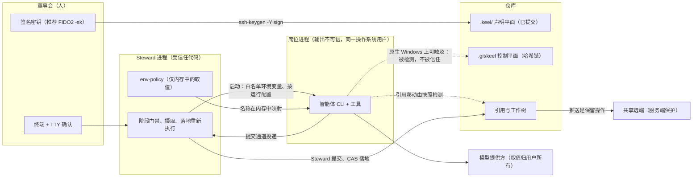
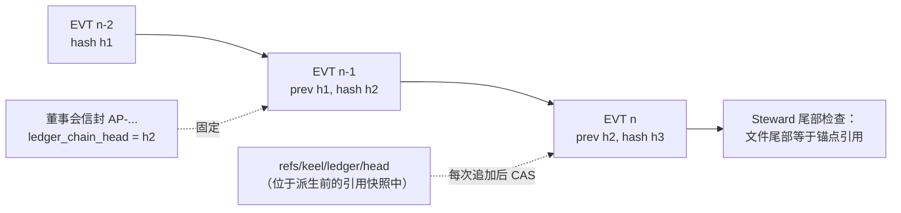

# 信任边界与安全

> 英文原文（规范版本）：[14-trust-security.md](14-trust-security.md)。本文是其简体中文镜像，两者不一致时以英文版为准。

本文档负责 keel 的威胁模型、签名密钥卫生、暴露面画像（exposure profile）的含义及其已知局限、哈希链与重新执行背后的完整性论证、不可信数据的处理，以及 keel 建议的服务端保护措施。具体机制在各自的归属文档中描述，此处只链接、不重复：

- 批准信封与批准流程：[02-alignment.zh-CN.md](02-alignment.zh-CN.md) 与 [ADR-0005](adr/ADR-0005-signed-board-approvals.zh-CN.md)；
- 账本（ledger）格式、id 与提交尾注（trailer）：[04-trace-and-state.zh-CN.md](04-trace-and-state.zh-CN.md)；
- 保留操作检测与落地（land）机制：[05-vcs.zh-CN.md](05-vcs.zh-CN.md)；
- 运行时（runtime）权限、信任与梯级（rung）：[09-runtimes.zh-CN.md](09-runtimes.zh-CN.md)；
- 模型提供方（provider）不变量与暴露规则：[10-providers.zh-CN.md](10-providers.zh-CN.md)；
- 门禁（gate）目录、证据（evidence）与负对照：[11-verification.zh-CN.md](11-verification.zh-CN.md)。

## 威胁模型

keel 是一个协作式的本地进程，而不是操作系统级的安全沙箱。在原生 Windows 上，大多数智能体 CLI 以用户的完整文件权限运行，因此 keel 并不承诺席位（seat）无法触及某些东西。它承诺的是：重要的事情要么在运行时和操作系统允许的范围内被阻止，要么在事后被检测到，并且会按运行时和操作系统说明属于哪一种（KP-16）。这些保证建立在四件在每个梯级上都成立的事情之上：董事会（Board）签名、Steward 重新执行、引用快照和哈希链。

### 资产

| 资产 | 存放位置 | 为何重要 |
| --- | --- | --- |
| 董事会权威 | 董事会私钥（在仓库之外，最好位于 FIDO2 认证器上）；`.keel/board/allowed_signers`；`.keel/signatures/` | 每个检查点（checkpoint）、裁定（ruling）、策略和治理文档的效力都来自董事会签名。 |
| 主干历史 | 本地及共享远端上的 `refs/heads/<trunk>` | 已落地的代码就是产品；它只能通过 `keel land` 或明确的董事会操作移动。 |
| 冻结意图（frozen intent）与契约 | `intent.md` 冻结块、`contract_hash`、`.keel/charter.md`、`.keel/goals.yaml` | 悄悄削弱验收标准是最具破坏性的对齐失败。 |
| 证据与评审结论（verdict） | `.git/keel/records/`、归档投影 | "完成"意味着 keel 重新执行过的证据。 |
| 账本 | `.git/keel/ledger/<yyyy-mm>.jsonl` | 事件的唯一真相存储；所有状态都由它计算得出。 |
| 模型提供方取值与运行时凭据 | 用户的环境、运行时主目录和凭据文件 | 它们属于用户（P1）。keel 从不打开它们，也不得让席位读取它们。 |

### 参与者与信任级别

| 参与者 | 信任 | 运行身份 | 说明 |
| --- | --- | --- | --- |
| 董事会 | 受信任；唯一的权威 | 持有签名密钥、坐在终端前的人 | 只通过 `keel approve` 签名。 |
| Steward（keel 核心） | 受信任的代码 | 用户的操作系统账户 | 确定性的；从不在自身进程中调用模型。 |
| 席位进程 | 输出是不可信数据 | 用户的操作系统账户（独立的席位操作系统账户是 M6 的评估项，[17-open-decisions.zh-CN.md](17-open-decisions.zh-CN.md)） | 一个智能体 CLI 加一个模型，以无头方式启动，使用按运行生成的配置。 |
| 直连通道（direct lane）子进程 | 无工具；输出不可信 | 由 Steward 启动的独立子进程（M6） | 仅在调用时于内存中持有一个已路由配置的取值。 |
| 模型提供方 | 外部；归用户所有 | 在本机之外 | keel 只知道环境变量名、协议 id 和别名。 |
| 仓库内容与第三方文本 | 不可信数据 | n/a | 源文件、issue 文本、测试输出、抓取的页面。 |
| 共享 git 远端 | 在 keel 之外 | 代码托管平台或服务器 | 由服务端规则保护（见最后一节）。 |

### 信任边界



实线箭头是设计好的路径。虚线箭头是 keel 无法在每个运行时和操作系统上封堵的路径，因此 keel 会检测它们，并且从不信任它们。

### 威胁与应对

| 编号 | 威胁 | 尽可能通过以下方式阻止 | 始终通过以下方式检测或化解 | 归属文档 |
| --- | --- | --- | --- | --- |
| T1 | 席位或脚本铸造、转发或重放董事会批准 | 在 `KEEL_RUN`/`KEEL_RUN_ID` 下以及存在 keel 运行祖先进程时，`keel approve` 拒绝执行（Windows 祖先进程遍历：待探测验证（verify by probe））；交互式确认 | 签名依据最近一个董事会签名的主干修订中的 `allowed_signers` 验证；信封绑定产物哈希、一次性随机数（nonce）和链头 | [02](02-alignment.zh-CN.md), [ADR-0005](adr/ADR-0005-signed-board-approvals.zh-CN.md) |
| T2 | 席位使用 ssh-agent 持有的董事会密钥签名 | `SSH_AUTH_SOCK` 和 `KEEL_BOARD_*` 从不传给席位 | 失败即关闭的 agent 检查：approve、dispatch 和 land 以退出码 6 退出 | 本文档 |
| T3 | 席位伪造证据（EV）或评审结论（VD）记录 | 在运行时具备写边界时使用沙箱化的控制平面 | EV 文件只是缓存；落地时重新执行完整的验收矩阵；评审结论在摄取时捕获 | [11](11-verification.zh-CN.md) |
| T4 | 席位编辑或追加账本行（例如伪造的 `verdict.recorded`），或编辑认领（claim）状态 | 同 T3 | 哈希链；每次追加前对照 Steward 拥有的锚点引用 `refs/keel/ledger/head` 检查尾部；摄入时的窗口检查，只接受监督进程自己的追加和董事会签名审批；每个信封中的链头；由账本推导的认领状态 | [04](04-trace-and-state.zh-CN.md) |
| T5 | 席位移动引用、改写历史或推送 | 生成的权限规则、PreToolUse 守卫、席位 git 环境加固、建议性 shim（M2） | 摄取和落地时的引用快照差异比对；每次运行前后的 `git ls-remote`；启用时的 jj 操作日志 | [05](05-vcs.zh-CN.md) |
| T6 | 席位读取模型提供方取值或凭据文件，通常发生在调试失败的模型调用时 | 环境变量白名单、生成的禁止读取规则、暴露规则（代码执行类席位只运行在环境已清洗且文件暴露为 none/blocked 的路由上） | 任何工具事件触及模型提供方路径集时，摄取即判定该运行失败；"provider 401 诱惑"一致性测评场景 | [10](10-providers.zh-CN.md) |
| T7 | 同一个智能体自行定义、构建并认证自己的验收 | 冻结测试位于构建者的 write_set 之外 | 验证缺口评审镜头（lens）、策略落地的红绿证明、跨家族评审 | [11](11-verification.zh-CN.md) |
| T8 | 变更被标低轨道（track）而漏过，或超出其范围 | 在运行时支持时使用 write_set 权限 | 提交时的范围检查和只升不降的轨道棘轮 | [03](03-lifecycle.zh-CN.md), [11](11-verification.zh-CN.md) |
| T9 | 常设策略（standing policy）落地了一个没有人点名的变更 | `keel new --policy` 需要董事会签名的请求信封 | 策略派发和落地会重新验证该签名；提案（proposal）记录其来源 | [03](03-lifecycle.zh-CN.md) |
| T10 | 通过仓库内容、工具输出或记忆进行的提示注入 | 席位不持有任何权威；停止类别强制发起提问 | 范围检查、无上下文的评审镜头、董事会阅读回执（receipt） | 不可信数据（见下文） |
| T11 | 模型提供方的 URL、密钥或模型名泄漏到记录或投影中 | 摄取时的类型化字段白名单；`argv.redacted.json` 保留 `${ENV:NAME}` 占位符 | 落地时的投影门禁拒绝 URL 形态和密钥形态的标记 | [04](04-trace-and-state.zh-CN.md), [10](10-providers.zh-CN.md) |
| T12 | 运行时的项目配置层或钩子被改动以削弱约束执行 | keel 从不依赖项目的 `.codex/`、`.gemini/` 或 `.qwen/` 层；无头运行使用 keel 拥有的按运行配置 | 钩子是记入日志的建议；门禁在摄取、提交和落地时重新检查 | [09](09-runtimes.zh-CN.md) |
| T13 | 看板（dashboard）被用作批准路径，或通过浏览器受到攻击 | 不存在任何写端点 | 仅绑定回环地址，检查 Host 和 Origin | [08](08-dashboard.zh-CN.md), [ADR-0008](adr/ADR-0008-read-only-dashboard.zh-CN.md) |
| T14 | 通过 Windows 上 npm `.cmd` shim 进行的命令注入（CVE-2024-27980） | `shell:false`；shim 解析为 node 脚本或 `.exe`；argv 中只有固定的短字符串 | windows-latest 上的启动契约测试 | [ADR-0002](adr/ADR-0002-node-windows-native.zh-CN.md) |
| T15 | 外部适配器编辑智能体配置或发送遥测 | codegraph 只在分离的验证或索引检出中运行，只使用索引和查询命令，关闭遥测和守护进程（待探测验证） | doctor 报告失效或行为异常的后端 | [07](07-architecture-intelligence.zh-CN.md) |

### 不在范围内

- 恶意或已被入侵的董事会成员。有效的董事会签名按定义就是权威。
- 在 keel 之外操作用户操作系统账户的恶意软件或他人，例如在输入口令时截获它。
- 席位进程的网络出口。keel 不过滤网络流量；拥有 shell 工具的席位能以用户的权限访问网络。
- 模型提供方侧的行为、模型质量和套餐条款。doctor 会提醒用户检查自己的套餐条款，但不对其作任何断言。
- 仓库内容对董事会所路由到的模型提供方的保密性。路由是董事会的决定，记录在已签名的 `.keel/routing.yaml` 中。
- 从多台机器并发使用。v1 仅支持单机（[17-open-decisions.zh-CN.md](17-open-decisions.zh-CN.md)）。

## 签名密钥卫生（失败即关闭）

批准的真实性取决于产生它的那个行为。keel 的规则是：每个董事会签名在签名时都需要一个人为动作（一次硬件触碰或一次输入的口令），并且同一用户的任何其他进程都不能悄无声息地获得签名。在 Windows 上，ssh-agent（包括命名管道 `\\.\pipe\openssh-ssh-agent` 背后的服务）会把密钥提供给同一用户的任何进程，因此由 agent 持有的签名密钥违反这条规则，除非每次使用仍需要触碰。

### 密钥选择

| 密钥 | 状态 | 原因 |
| --- | --- | --- |
| FIDO2 密钥（`ed25519-sk` 或 `ecdsa-sk`） | 推荐，尤其在 Windows 上 | 每次签名都需要物理触碰，因此该密钥可以放在 agent 中。Windows OpenSSH 的 `ssh-keygen` 与 Git for Windows 的 `ssh-keygen` 对 `-sk` 的支持：待探测验证。doctor 会给出已验证的 `ssh-keygen` 路径。 |
| 受口令保护且从不加入 agent 的密钥 | 允许 | 每次签名都要输入口令。 |
| 可访问的 agent 列出的任何非 `-sk` 签名密钥 | 拒绝 | 在该密钥从 agent 中移除之前，approve、dispatch 和 land 以退出码 6 退出。 |
| 没有口令的密钥 | 无法检测，强烈不建议 | keel 从不打开私钥文件，因此无从得知。它破坏了设计，由董事会负责。 |

### 指定签名密钥

keel 通过两个环境变量得知用哪把密钥签名，二者都由董事会成员在自己的终端中设置。它们保存的是路径和名称，从不是密钥材料，也从不传给席位（[10-providers.zh-CN.md](10-providers.zh-CN.md)）：

| 名称 | 保存内容 | 使用者 |
| --- | --- | --- |
| `KEEL_BOARD_KEY` | 董事会成员私钥文件的路径；对 FIDO2 密钥而言，是 `ssh-keygen -t ed25519-sk` 写出的密钥句柄文件 | `keel approve`，它把该路径传给 `ssh-keygen -Y sign -f`，从不打开它；keel 只读取旁边的公钥（`<path>.pub`），以找到匹配的 `allowed_signers` 行 |
| `KEEL_BOARD_PRINCIPAL` | 签名所用的主体名，与 `.keel/board/allowed_signers` 中的写法完全一致 | `keel approve`；当公钥恰好匹配一行时可省略 |

`KEEL_BOARD_*` 名称只有这两个。`keel init --signer <public key file>` 从一个公钥文件登记第一个签名者（首次使用即信任）。设置步骤依次为：

1. 创建密钥，首选 `ssh-keygen -t ed25519-sk -f <path>`（Windows OpenSSH 与 Git for Windows 版本对 `-sk` 的支持：待探测验证），否则使用带口令且从不加入 agent 的 `ed25519` 密钥。
2. 把 `KEEL_BOARD_KEY` 设为该路径（必要时再设置 `KEEL_BOARD_PRINCIPAL`），然后运行 `keel init --signer <path>.pub`。
3. 运行 `keel doctor --section signing`，它会报告已验证的 `ssh-keygen` 路径、该密钥是否为 `-sk`，以及是否有签名者密钥被加载进 agent。

### agent 检查

keel 在 `keel approve` 之前、`keel run` 中派发之前以及 `keel land` 之前运行该检查：

1. 从最近一个董事会签名的主干修订中的 `allowed_signers` blob 加载允许的签名者公钥（从不从工作树读取）。
2. 用 `ssh-add -L` 列出可访问的 agent 所持有的密钥：设置了 `SSH_AUTH_SOCK` 时通过它，另外通过 Windows OpenSSH agent 管道。
3. 如果任何允许的签名者密钥被列出且不是 `-sk` 密钥，则以退出码 6 停止并给出指引：将其从 agent 中移除（`ssh-add -d <path-to-board-key>`，或用 `ssh-add -D` 移除所有身份）或改用 `-sk` 密钥。Windows OpenSSH agent 服务会在重启后保留已加入的密钥，因此一旦加入，密钥会一直处于加载状态，直到被移除。

`keel doctor --section signing` 报告同样的结果、它检查过的 agent 通道、已验证的 `ssh-keygen` 路径，以及每个签名者密钥是否为 `-sk`。只枚举这两个通道；通过其他通道提供密钥的 agent 不会被检测到，这一点在下文作为已知局限记录。

该检查的负对照是 M1b 退出条件所要求的：加载到 agent 中的口令密钥必须使 `keel approve` 和 `keel land` 拒绝执行。

### 确认与拒绝规则

- `keel approve` 需要交互式确认：一个 TTY，或者在 Git Bash mintty 下（Node 在那里看不到 TTY）输入确认码。
- 在 `KEEL_RUN` 或 `KEEL_RUN_ID` 下，以及当某个祖先进程是已登记的 keel 运行时，它拒绝执行。Windows 上的祖先进程遍历有待探测验证。
- 它会准确打印董事会在该检查点必须阅读的内容（`org/checkpoints.yaml`），董事会输入的引述成为签名信封的一部分。
- 席位的环境中从不包含 `SSH_AUTH_SOCK`、`KEEL_BOARD_*` 或 git 凭据助手（[10-providers.zh-CN.md](10-providers.zh-CN.md)）。

### 签名者列表与信任根

`.keel/board/allowed_signers` 使用 OpenSSH 的 `allowed_signers` 格式；本节是它的归属。每个主体和密钥一行，限定在 `keel-approval` 命名空间。使用明显伪造密钥的示例：

```text
board-owner@example.com namespaces="keel-approval" sk-ssh-ed25519@openssh.com AAAA-fake-keel-example-sk
board-second@example.com namespaces="keel-approval" ssh-ed25519 AAAAC3NzaC1lZDI1NTE5AAAA-fake-keel-example
```

- 信任根是在已签名章程（charter）中固定的根签名者指纹。`keel init` 以首次使用即信任（trust on first use）的方式登记第一个签名者，并在 `.keel/signatures/` 下记录一段引述的同意。
- 增加或移除签名者是对 `allowed_signers` 的一次变更，由现有签名者签名，并通过 Steward 治理提交（`Keel-Doc`、`Keel-Approval`）提交。
- 验证总是读取最近一个董事会签名的主干修订中的 blob，因此编辑工作树副本的席位改变不了任何东西。

keel 对规范化载荷字节运行的 OpenSSH 命令（董事会永远无需手动输入它们）：

```sh
ssh-keygen -Y sign -f <board key> -n keel-approval <payload>
ssh-keygen -Y verify -f <allowed_signers blob> -I <principal> -n keel-approval -s <payload>.sig < <payload>
```

## 暴露面画像与已知局限

暴露面画像说明：对于一个操作系统上、采用一种认证模式的一个运行时，席位进程能触及什么。`keel doctor --section exposure` 计算它，派发时将其冻结进运行记录，每份回执以及看板的运行时健康视图都会展示它。依据它采取行动的规则（拒绝在已暴露路由上运行代码执行类席位，且不提供董事会确认的放行路径）位于 [10-providers.zh-CN.md](10-providers.zh-CN.md)。

### 字段

| 字段 | 取值 | 含义 | 如何确定 |
| --- | --- | --- | --- |
| `tool_env_exposure` | `scrubbed`, `exposed`, `unknown` | 由席位的工具启动的进程是否继承模型提供方的环境变量取值 | 描述符中的环境清洗控制，按运行时版本经探测验证 |
| `tool_file_exposure` | `none`, `blocked`, `exposed`, `unknown` | 席位的工具能否读取仅含名称的模型提供方路径集 | `none`：集合中没有任何路径存在，只用 stat 测试，从不打开。`blocked`：禁止规则或独立的席位操作系统账户，经探测验证 |
| `control_plane_exposure` | `sandboxed`, `exposed` | 席位能否写入 `.git/keel` | 运行时的写边界。Codex 沙箱只限制写入；在所有操作系统上读取都不受限制 |
| 保留操作预防 | 按机制 | 哪些保留操作是被阻止的，而不只是被检测到 | 按运行时 shell 的权限规则、PreToolUse 守卫、席位 git 环境加固和 shim 覆盖范围 |

每条规则都把 `unknown` 当作 `exposed` 处理。

### 预防与检测

| 关注点 | 在以下情况下被阻止 | 始终由以下方式检测 | 未覆盖 |
| --- | --- | --- | --- |
| 批准伪造 | 始终（需要签名） | 每个克隆上的 Steward 验证 | 被入侵的董事会密钥 |
| 通过 agent 滥用董事会密钥 | agent 检查通过 | doctor 与 agent 检查 | 位于 `SSH_AUTH_SOCK` 和 Windows 管道之外通道上的 agent |
| 证据伪造 | `control_plane_exposure: sandboxed` | 落地重新执行 | 对落地决策而言无 |
| 账本编辑与伪造追加 | `control_plane_exposure: sandboxed` | 哈希链、对照锚点引用的尾部检查、摄入时的窗口检查、信封中的链头 | 比运行窗口活得更久的进程（局限 11） |
| 引用移动与历史改写 | 梯级 A 和 B 上的权限规则和钩子 | 引用快照差异比对 | 无 |
| 推送 | 无效的按工作树 `pushurl`、重置的凭据助手 | 每次运行前后的 `git ls-remote` | 用席位自己的凭据推送到未配置的 URL |
| 读取模型提供方取值 | `scrubbed` 环境以及 `none`/`blocked` 文件 | 摄取时对工具事件的检查 | 由测试或声明的命令运行的代码 |
| 在 write_set 之外写入 | 运行时存在路径权限时 | 提交时的范围检查 | 对落地决策而言无 |

### 已知局限

1. 原生 Windows 对大多数智能体 CLI 没有操作系统级的写或读边界。除非使用可选的独立席位操作系统账户（M6，待探测验证），席位都以用户的文件权限运行。
2. Codex 沙箱只限制写入。在所有操作系统上读取都不受限制，因此它的 `sandboxed` 控制平面取值只涵盖写入。
3. 在原生 Windows 上，同一操作系统账户下由测试或声明的命令运行的代码无法被完全隔离。摄取检查只能看到工具事件，看不到测试进程做了什么。
4. 使用席位自行获得的凭据推送到一个未配置为远端的 URL，无法被 `git ls-remote` 检测到。服务端保护弥补了这一缺口。
5. 建议性 shim（sh、`.cmd`、`.ps1`）会被 Node 和 Rust 的进程启动以及 Git Bash 对裸名称的解析绕过。doctor 按运行时 shell 报告 shim 覆盖情况。
6. 钩子失败时放行（fail open），并且只在运行时信任该项目的地方加载。它们发出警告；由门禁做决定。
7. 模型家族独立性是董事会的声明，显示为"declared"（已声明），从不显示为"verified"（已验证）。在 P1 下 keel 无法检查端点或模型名；可选的相同/不同检查在内存中比较运行时报告的 id，不持久化任何东西。
8. keel 不控制席位进程的网络出口。
9. agent 检查只枚举 `SSH_AUTH_SOCK` 和 Windows OpenSSH 管道。
10. keel 无法判断董事会密钥是否设置了口令。
11. 在最近一个董事会签名的链头之后写入的账本事件，由锚点引用和摄入时的窗口检查保护，而不是由签名保护。评审结论、ACK 和结果确实会决定落地，因此正是窗口检查让席位无法批准它自己的轮次。残余缺口是比运行窗口活得更久的进程：keel 在摄入之前会结束席位的整个进程树（`taskkill /T /F`），但逃出该进程树的进程（例如通过计划任务或服务启动的进程）可以在窗口验证之后追加事件并移动锚点，而之后的 Steward 进程无法把这些追加与它自己的追加区分开。可选的隔离席位操作系统账户（M6）可以堵住这一缺口。

## 哈希链与重新执行

由于在大多数原生 Windows 路由上席位都能写控制平面，keel 从不以"无法触及"作为论据。席位可能伪造的每条记录，要么被纳入哈希链并锚定在席位无法悄悄编辑的文件之外，要么由 Steward 在已验证的窗口内亲自捕获，要么在它能决定任何事之前被重新计算；唯一的残余途径是已知局限 11。账本格式见 [04-trace-and-state.zh-CN.md](04-trace-and-state.zh-CN.md)；消费这些记录的门禁见 [11-verification.zh-CN.md](11-verification.zh-CN.md)。



| 席位可能伪造的记录 | 为何伪造决定不了任何事 | 在哪里检查 |
| --- | --- | --- |
| 一行账本 | 每个事件都携带前一个事件的哈希；每个董事会信封固定链头；每个 Steward 进程在每次追加前对照锚点引用检查尾部；`keel audit` 报告 `chain-break` | [04](04-trace-and-state.zh-CN.md) |
| 追加的事件，例如 `verdict.recorded`、`ack.recorded` 或 `result.submitted` | 摄入时的窗口检查只接受负责监督的进程自己的追加和董事会签名审批；为掩盖伪造追加而移动锚点的席位会造成一次引用变更，被派生前的引用快照捕获（`blocked(reserved_op)`） | [04](04-trace-and-state.zh-CN.md)、[05](05-vcs.zh-CN.md) |
| 认领状态 | 认领状态由账本事件推导；认领引用只是一个持有令牌的只可创建（create-only）CAS 锁 | [06](06-parallelism.zh-CN.md) |
| 一个 EV 文件 | EV 文件只是缓存。落地时在集成提交的全新分离检出上、在进程内重新运行完整的验收矩阵；落地前的复用要求源状态匹配字段完全相同 | [11](11-verification.zh-CN.md) |
| 一个 VD 文件 | 评审结论在摄取时从子进程的最终消息、MCP 提交或发件箱中捕获，并绑定提交与契约哈希；VD 文件只有配上来自已验证窗口的 `verdict.recorded` 事件才算数 | [11](11-verification.zh-CN.md) |
| 一个签名信封 | 用 `ssh-keygen -Y verify` 依据最近一个董事会签名的主干修订中已提交的 `allowed_signers` 验证 | [ADR-0005](adr/ADR-0005-signed-board-approvals.zh-CN.md) |
| 一个归档投影 | 投影是持久的历史，从不作为输入；签名从 `.keel/signatures/` 重新验证 | [04](04-trace-and-state.zh-CN.md) |
| 带 keel 提交尾注的提交 | 只有 Steward 提交；席位产生的提交保存在 `refs/keel/snap/` 下，从不被信任 | [ADR-0004](adr/ADR-0004-steward-commits-and-submit-channels.zh-CN.md) |

以上每一项都有一个固定了失败原因的负对照，其中包括：链编辑会被检测到，运行期间追加的伪造 `verdict.recorded`（无论是否移动锚点）会在摄入时被发现，伪造的 EV 文件会被落地重新执行忽略，植入的推送会通过 `git ls-remote` 被检测到，植入的引用移动会被快照差异比对检测到。

## 不可信数据

模型、运行时或第三方产生的一切都是数据。权威只来自董事会签名和 Steward 代码（KP-04）。

| 来源 | 处理方式 |
| --- | --- |
| 席位投递：ACK（复述确认）、结果、评审结论、裁定、提问、分诊记录 | 摄取时进行 schema 校验；id 集合与简报（brief）做差异比对；从不执行；超出决策边界或落在停止类别上的裁定会被标记 |
| 声称已获批准或同意的席位文本 | 忽略。批准只以签名信封的形式存在 |
| 仓库内容、issue 文本、代码注释、测试输出、席位抓取的页面 | 可能携带提示注入。席位不能批准、落地、认领或移动引用；四种停止类别强制向董事会提问；范围检查、棘轮和无上下文的评审镜头限制了损害；董事会阅读回执 |
| 运行时记忆、会话历史、压缩摘要 | 不可信（这一思路取自 OpenHands）。压缩之后，简报摘要从 Steward 编译好的简报重新注入，而不是从记忆中 |
| 运行时的项目配置层和共享设置（`.codex/`、`.gemini/`、`.qwen/`、`.claude/settings.json`） | 从不读取、写入或依赖它们进行约束执行。keel 打印配置片段；信任绕过标志只在 `keel approve --rule override` 之后使用；从不生成 `--dangerously-bypass-hook-trust` |
| 钩子输出，包括压缩后的输出 | 仅作建议；连同分母记入日志 |
| 模型提供方的错误正文和运行时的自由文本错误 | 不持久化（类型化字段白名单）；原始流在内存中解析，从不写入磁盘 |
| 运行时报告的模型 id | 仅用于可选的内存内相同/不同检查 |
| 克隆上的归档投影和账本片段 | 仅用于展示；签名会重新验证 |
| 在 keel 之外产生的人工提交 | 在通过 patch 轨道或已签名的 `--rule override` 采纳之前不被追溯 |
| 索引输出（codegraph、SCIP、启发式、LLM） | 每条边都带有来源；启发式和 LLM 边从不使门禁失败 |
| 看板 serve 请求 | 仅回环，检查 Host 和 Origin，只读 |
| MCP 工具调用 | `keel_submit` 只写入运行的发件箱；Steward 校验每一次投递 |
| 发往子进程的字符串 | argv 由描述符模板构建；从不使用 `shell:true`；长文本通过 stdin 或文件传递 |

## 服务端分支保护建议

keel 的保留操作检测是本地的。它无法阻止使用席位自行找到的凭据进行的推送，也不管辖其他机器推送的内容。服务端规则弥补这一缺口。keel 从不配置代码托管平台；以下是给董事会的建议，确切的设置名称因平台而异。

1. 保护主干：禁止强制推送和删除。
2. 只允许董事会身份向主干推送和合并。席位环境不携带任何代码托管平台凭据：keel 为席位重置 `credential.helper`，从不传递凭据助手，平台令牌也不应存放在席位会继承的变量中。
3. 优先采用仅快进或线性的主干。keel 使用 `merge --ff-only` 或 CAS `update-ref` 落地，因此主干上出现外来的合并提交，意味着有一个提交仍需采纳。
4. 在平台支持引用模式规则的情况下，拒绝推送 keel 的本地工作引用（`keel/*` 分支和 `refs/keel/*`）。它们是本地状态，而推送是保留操作。
5. 从 M1b 起，要求一个在主干顶端运行 `keel check --gate land --check signature --at <sha>` 的 CI 状态检查，使每个治理提交都携带一个能依据已提交签名者列表验证通过的信封。确切的 CI 调用方式在 M1b 发布时确定。
6. 除 keel 签名之外，还将 `.keel/board/allowed_signers`、`.keel/charter.md` 和 `.keel/routing.yaml` 纳入平台的代码所有者评审。
7. 保护发布标签。

推送到共享远端仍然是保留操作：董事会在 `keel land` 之后推送。多机协作是一项开放决策（[17-open-decisions.zh-CN.md](17-open-decisions.zh-CN.md)）；在它确定之前，其他机器只能看到已提交的签名和归档投影。
