# Roadmap

keel is built in nine milestones, M0 to M8, with M1 split into M1a and M1b. Each milestone has a fixed
scope and exit criteria that are tests, not opinions. A milestone is done when every exit criterion passes
in CI on windows-latest and ubuntu-latest (Node 22.13 and 24), or, for criteria that need real routes, when
the Board has run the opt-in check and recorded the result. From M1a on, a milestone also needs the refresh
review of P4 ([00-mandate.md](00-mandate.md) section 4) run and recorded in `docs/reference-projects.yaml`.

This document owns the milestone plan, the risks and the measures. Where a criterion names a mechanism, the
mechanism's home document is listed in the single-home table of [README.md](README.md).

## M0–M8 scope and exit criteria

```mermaid
flowchart LR
  M0["M0 design + skeleton"] --> M1a["M1a deterministic core"]
  M1a --> M1b["M1b approvals, policies, trace"]
  M1b --> M2["M2 dispatch on two runtimes"]
  M2 --> M3["M3 verify, review, land"]
  M3 --> M4["M4 architecture intelligence"]
  M4 --> M5["M5 read-only dashboard"]
  M5 --> M6["M6 all runtimes, direct lane, conformance"]
  M6 --> M7["M7 jj backend"]
  M7 --> M8["M8 waves, campaigns, audit"]
```

Milestones are delivered in this order, and each depends only on earlier ones: M2 exits at submit and the
Steward commit so that M3 owns verification and land; the M3 ratchet has a path fallback so that it does
not wait for the M4 index; the close gate stays liveness-only until M8 adds the quiescence audit.

### M0 Design document set and repository skeleton

Status: in progress in this repository.

Scope:

- the design documents in `docs/` (English canonical, Simplified Chinese mirrors) and the nine design
  ADRs in `docs/adr/` (ADR-0001 to ADR-0009);
- the owner's mandate (`docs/00-mandate.md`), which records the owner's statement verbatim and owns the
  refresh discipline (P4);
- the reference registry (`docs/reference-projects.yaml`, validated against
  `schemas/reference-registry.schema.json` by the `examples` check via `schemas/examples.map.json` and
  cross-referenced with 00-mandate and 16 by the `references` check of `scripts/validate.mjs`);
- full JSON Schemas and type-only TypeScript for the M1–M3 artifacts, with M4 and later artifacts as
  one-line deferred stubs;
- seat contracts and the canonical tables (`org/`, `runtimes/hook-events.yaml`);
- runtime descriptors with `verification_status` and a verify-by-probe list;
- skills and templates;
- one golden example path (`examples/acme-notes`, proposal `P-7F3K9Q`);
- test fixtures;
- `package.json`, `package-lock.json`, `tsconfig.json`, CI, and `scripts/validate.mjs` as the single
  declared tooling exception (D1).

No product logic and no `bin`. The advisory shims and the commit-msg hook are deferred to M2, and the
TanStack dashboard application, its bundles and CSS tokens to M5.

Exit criteria:

- The owner has answered the decisions that block M0 (licence, documentation language, approval mechanism,
  VCS strategy, provenance, stack) and confirmed the adopted-by-recommendation list; the owner's statement
  that settles them is recorded in [00-mandate.md](00-mandate.md). The decisions still open in
  [17-open-decisions.md](17-open-decisions.md) do not block M0.
- The owner's statement is recorded verbatim in [00-mandate.md](00-mandate.md), every R, D and P row of
  [00-vision.md](00-vision.md) maps to it, and the reference registry validates against its schema (`examples`
  check) and its owner-named projects are cross-referenced (the `references` check passes).
- `npm run typecheck` passes on windows-latest and ubuntu-latest.
- `node scripts/validate.mjs` meta-validates every schema, validates every YAML and JSON example listed in
  `schemas/examples.map.json` (JSONL from M1), and passes the strict-subset lint.
- `docs/13-artifacts-schemas.md`, `docs/12-cli-api-mcp.md` and the skeleton paths match (the manifest
  check).
- The D2 provenance audit is recorded: every construct in [16-sources-credits.md](16-sources-credits.md)
  maps to a permitted source, and the audit check for the D2 term list in `scripts/validate.mjs` comes back
  clean.
- The ELv2 shape audit is recorded in [16-sources-credits.md](16-sources-credits.md).

### M1a Deterministic core (no LLM, no approvals)

Scope: ids, normalization and hashing, the hash-chained single-writer ledger, parsers, the brief compiler
with a golden hash and per-seat ACK sets, `keel init`, `keel new`, `keel brief`, `keel status`, and the
frame gate.

Exit criteria:

- The golden brief hash is identical on a Windows CRLF checkout and on Linux.
- An ACK id-set mismatch is reported (fixture).
- A chain edit is detected.
- Nested ref names are rejected by the doctor check.

### M1b Approvals, policies and trace

Scope: explicit-confirmation approvals ([ADR-0005](adr/ADR-0005-explicit-confirmation-approvals.md): the
show-confirm-recheck-record flow, committed approval records with their `approval.recorded` events, the
re-hash at every gate, the mintty confirmation flow, `keel doctor --section approvals`), request records,
`--rule` modes, amendments, standing policies, governance commits, the trace check with its epoch (no
sqlite yet), and the refusal of mutating verbs under a keel run.

Exit criteria (each with a negative control in `test/README.md`):

- A protected step (dispatch, land, policy-path intake) does not proceed while its subject has no valid
  approval.
- An approval record binds the subject, the content hash of every bound artifact, the declared approver
  and the approval time, and its ledger event is on the chain.
- A one-byte edit to a frozen block invalidates the contract approval; an edited receipt draft invalidates
  the land approval.
- A bound artifact rewritten between the display and the confirmation keystroke is not approved: `keel
  approve` refuses and records nothing.
- Unrelated file changes and unrelated ledger appends after a document approval leave it valid.
- A seat's completion claim, a drop that says "approved" and a JSON file dropped under `.keel/approvals/`
  without a ledger event are not accepted as approvals.
- `keel init` and every daily approval complete with no SSH key, signer list, agent or hardware set up.
- `keel approve` and `keel new` refuse under `KEEL_RUN`.
- `keel trace` resolves `file:line` to a goal on the example.
- History before the epoch does not fail the trace check.

### M2 Dispatch on two runtimes, through submit

Scope: claude-code and codex descriptors and stream parsers; the Windows spawn contract; submit channels;
sparse worktrees; Steward commits with index refresh; CAS claim locks with ledger leases; ref-snapshot and
`ls-remote` detection; seat git hardening; advisory shims (sh, `.cmd`, `.ps1`); the commit-msg hook; the
exposure profile and exposure rule; per-run configs and printed snippets; the env allowlist; loopback fakes
for anthropic-messages and openai-responses; `keel doctor --section providers|runtimes|exposure`; the
env-policy constants.

Exit criteria:

- A patch task runs from dispatch through the Steward commit and the submit gate on that commit, on native
  Windows against the fakes.
- A seeded ref move and a seeded push are detected.
- The Codex seat makes no writes to `.git/keel` (verified by the ingest journal).
- A code-executing seat on an exposed route is refused.
- A double ACK mismatch blocks.
- No bypass flag appears in any argv.
- A lost claim exits 4.
- doctor shows SET/UNSET and PRESENT/ABSENT only.
- The env-scrub capability probe runs against the loopback fakes on the installed claude-code and codex, and
  the engineer is dispatched only on a route whose probe passed.
- A forged `verdict.recorded` appended during a run is caught at ingest, with and without a move of the
  ledger anchor, and a seat-created `.env` never becomes a blob.

### M3 Verify, review and land

Scope: runner evidence with source-state binding; land re-execution; red/green proof; lenses on headless
runtimes; findings authority; triage records; the fix loop; test independence and the verification-gap
lens; the fake-completion scan; the track ratchet with its path fallback; three-state conformance status
with `--rule unverified`; checkpoints; the archive commit with ADR promotion and the projection gate; the
land cases (ff-only, CAS, refuse); the liveness audit.

Exit criteria:

- A feature proposal lands with a cross-family reviewer and explicitly confirmed contract and land approvals.
- A planner cannot dismiss a critical finding.
- Builder-only tests do not satisfy an ACC without the verification-gap lens.
- A track raised by the path fallback blocks.
- Degraded and unverified lanes require rulings.
- Evidence is reused only on an identical source state, and land re-execution ignores a forged EV file.
- A policy land without red/green proof is refused.
- A dirty checked-out trunk is refused.
- Every check's negative control fails with its pinned reason.

### M4 Architecture intelligence

Scope: the architecture model, rules and baseline; the IndexProvider port with the codegraph backend under
its stated constraints and the scip backend; the lifter; `keel arch find`; the arch check with the unknown
policy; impact; `keel arch plan`; element pages and the change feed; owner routing; the series; scope-limited
evidence reuse through the impact closure.

Exit criteria:

- A seeded undeclared web → store dependency fails with tree-sitter provenance.
- A heuristic-only edge stays advisory.
- A stale index gives `unknown`, which blocks when rules reach the element.
- `keel arch find` maps hits to elements.
- Crossing a boundary raises the track.
- codegraph writes nothing in seat worktrees.

### M5 Read-only dashboard

Scope: the DashboardModel; the TanStack (React) application with its render bundle and client bundle, both
compiled at package build time ([ADR-0009](adr/ADR-0009-tanstack-frontend.md)); the CSS tokens; the eight
views including search and the change feed; and the optional loopback `serve`.

Exit criteria:

- The pre-rendered page shows every view without JavaScript: all eight views are in the tree and long lists
  are pre-rendered in full; hydration changes no markup (golden test, run at `#/` and at least one deep link
  such as `#/trace`).
- It shows the same states and denominators as the `keel check --json` and `keel trace --json` golden tests,
  with and without a table filter applied.
- It has no write endpoints.
- It is under 2 MB for a 5k-file fixture.
- Its inline JavaScript is under 600 KB minified.
- It makes zero external requests.
- The same model and keel version give a byte-identical page.
- `react`, `react-dom` and `@tanstack/*` appear only in `devDependencies`.

### M6 All runtimes, direct lane and behaviour conformance

Scope: gemini-cli, qwen-code, kimi-code and opencode descriptors, per-run configs and probes; GLM and
Gemini-family profiles; the direct-lane child with the three protocol translators and the Anthropic
`output_config` capability flag; behaviour conformance (opt-in, real routes); the rung D flow; track
records; the optional isolated seat OS account (verify by probe).

Exit criteria:

- Every runtime has a probe-backed descriptor, or is restricted by recorded evidence (for example Kimi Code
  at rung D).
- A judge route that fails the coercion scenarios is refused.
- `keel sync --check` is clean without touching shared settings.
- A rung D change lands with the Steward-side guarantees intact.

### M7 jj enhancement backend

Scope: the opt-in JjBackend: change ids, the op log as an extra detection source, evolog export, conflicts
as tasks, `jj run`, policy revsets and the hazard suite; jj agent workspaces only when `--colocate` is
detected (verify by probe).

Exit criteria:

- The M1–M4 suites pass on both backends.
- The hazard suite is green on jj ≥0.45.1 on Windows.
- Disabling jj in the middle of a project loses no trace, evidence or approval.

### M8 Waves, campaigns and audit

Scope: the wave scheduler with impact disjointness, collision prediction, preview bisect, campaign plans,
and the quiescence audit, which turns the close gate from liveness-only into its full form.

Exit criteria:

- A three-task wave from different declared families lands, with land re-execution green.
- A seeded collision is flagged.
- An untraced in-range commit and an expired override are found.
- A campaign expands one work order per element.

## Risks

The risks below come from the verify-by-probe list, the open decisions and the known limits in
[14-trust-security.md](14-trust-security.md). Each has a planned response and the milestone where it is
settled.

| Id | Risk | Effect if it materialises | Response | Settled in |
| --- | --- | --- | --- | --- |
| RK-01 | Runtime CLI flags, hook events or output formats change between versions | Dispatch or parsing breaks for one runtime | Descriptors carry `min_version` and `verification_status` per fact; doctor probes; plumbing conformance runs in CI against recorded streams | M2, M6 |
| RK-02 | The Codex env-only custom endpoint route (`OPENAI_BASE_URL` through the built-in provider) is not honoured | Codex cannot host code-executing seats on custom endpoints | Engineer role falls to claude-code, qwen-code or opencode, but only on a route whose env-scrub probe has passed ([10-providers.md](10-providers.md) section 4); until one passes, no route qualifies for the engineer and dispatch refuses it with `blocked(runtime_unavailable)`. Codex keeps tool-less and blocked-file-exposure seats | M2 probe |
| RK-03 | The Gemini CLI per-run `--policy` probe fails | Gemini CLI holds reviewer seats only | Gemini-family models stay reachable through opencode or the direct lane on openai-chat | M6 |
| RK-04 | Kimi Code never reaches a verified non-bypass write mode | Kimi Code stays at rung D | Kimi-family models run through opencode; the ACP driver is the candidate enforcement path | M6 |
| RK-05 | A Board member confirms without reading, or an approval is treated as more than a declared confirmation | A change lands that no human judged; a record is cited as proof of identity | `keel approve` shows the change before it asks; the reading list is printed verbatim; documents state that the approver is declared and the time is local ([14-trust-security.md](14-trust-security.md)) | M1b |
| RK-06 | Most native Windows routes report `tool_file_exposure: exposed` | Too few routes qualify for code-executing seats | Env-auth routes with a verified scrub; evaluate the isolated seat OS account | M2, M6 |
| RK-07 | Models from weaker or unfamiliar families misread briefs | ACK mismatches, blocked tasks, wasted budget | ACK id-set diff with one bounded retry, behaviour conformance with a no-guidance control, tier overlays, rung D fallback | M2, M6 |
| RK-08 | codegraph edits agent configs, writes in-tree or sends telemetry despite the constraints | Seat worktrees polluted; P1 or privacy concerns | Constraints verified by probe; scip import and the heuristic backend as alternatives; doctor reports inert architecture checks | M4 |
| RK-09 | jj workspace colocation stays unreleased or jj semantics shift before 1.0 | No jj agent workspaces | jj stays optional; agent workspaces stay git worktrees; the hazard suite gates the backend | M7 |
| RK-10 | Ceremony feels too heavy for a single owner | keel is bypassed | Track right-sizing (typically two Board confirmations per feature), standing policies for patches, the owner guide | M3 |
| RK-11 | Brief hashes differ across OS line endings or Unicode forms | ACKs mismatch spuriously; evidence reuse fails | LF/BOM/NFC normalization with a golden hash test on a Windows CRLF checkout | M1a |
| RK-12 | Surface sprawl (verbs, modes, tables) creeps back | Drift between docs, shims and code | Surface budgets and generated tables checked in CI | Every milestone |
| RK-13 | The package and CLI name collide with dcsg/keel | Confusion on publish | Open decision; revisit before the first publish | Before first publish |
| RK-14 | Readers take detection for prevention | False assurance | The exposure profile in every receipt; [14-trust-security.md](14-trust-security.md) states the limits | M2 |
| RK-15 | TanStack or React major versions change (framework churn) | The dashboard build breaks or needs migration | Pinned lockfile; headless libraries over native markup; the model is framework-independent, so a migration is confined to `src/dashboard/` | M5 and every refresh review |
| RK-16 | Refresh reviews are skipped | keel drifts from its references and from P4 | The review is an exit criterion from M1a; the registry records dates and HEADs; the "Refresh review currency" measure below | Every milestone |

## Measures

Measures are computed from ledger events and committed files, never stored as state (KP-12). Each shows
its denominator.

| Measure | Target or budget | Computed from | From |
| --- | --- | --- | --- |
| Board confirmations per proposal | Typically 2 on feature (contract, land), 3 on system (contract, plan, land) | Approval events per proposal | M1b |
| Surface size | 16 top-level verbs, at most 40 verb modes, 5 seats, 5 skills, 3 default MCP tools, 5 phase gates | Manifests; CI fails on overruns | M0 |
| Handbook size | Managed AGENTS.md block ≤ 8 KiB; instruction chain < 32 KiB; charter ≤ 6 KiB | `keel sync --check` | M1a |
| Brief determinism | 100% identical golden hashes across Windows CRLF and Linux | Golden test | M1a |
| Negative-control coverage | Every check has a negative control that fails with its pinned reason | Selftest suite | M3 |
| Untraced in-range commits at land | 0 | Trace check over the range and epoch | M1b |
| Requirement coverage | Verified requirements at head / total, per goal (goal progress) | RTM | M3 |
| Land re-execution | Pass rate on the integrated commit; forged or stale EV files never counted | Land events | M3 |
| Track ratchet rate | Share of tasks whose actual track exceeded the predicted track | `track.decided` events vs submit recomputation | M3 |
| ACK mismatch rate | Per runtime and alias, first and second attempt | ACK events and track records | M2 |
| Behaviour conformance | Status verified, failed or unverified per seat, runtime, alias and revision; each scenario run at least 5 times with a no-guidance control | Conformance results | M6 |
| Review yield | Findings per lens that led to a fix; layers without measured yield are pruned | Verdict and fix-round events | M3 |
| Fix-loop length | Distribution of rounds; cap 5 | Fix-round events | M3 |
| Budget use | Warning at 80%, block at 100% until `--rule budget` | Budget events per goal and proposal | M2 |
| Hook coverage | Hook outcomes journaled per runtime, fired / expected | Hook journal | M2 |
| Liveness orphans | 0 | `keel audit` | M3 |
| Index freshness | `index_commit` distance from head | Index status | M4 |
| Refresh review currency | Every project entry with a local clone has a review whose scope names the milestone being exited (for example "M1a exit review"), and `scouting.last_run` is dated at or after the previous milestone exit | `docs/reference-projects.yaml` | M1a |
| Dashboard size | Under 2 MB for a 5k-file repository | Build output | M5 |
| Dashboard JavaScript | Under 600 KB minified, inline | Build output | M5 |
