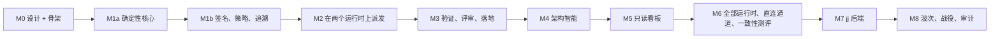

# 路线图

> 英文原文（规范版本）：[15-roadmap.md](15-roadmap.md)。本文是其简体中文镜像，两者不一致时以英文版为准。

keel 分九个里程碑构建，从 M0 到 M8，其中 M1 拆分为 M1a 和 M1b。每个里程碑都有固定的范围和退出条件，这些条件是测试，而不是看法。当每一项退出条件都在 windows-latest 和 ubuntu-latest（Node 22.13 和 24）的 CI 中通过时，或者对于需要真实路由的条件，当董事会（Board）已运行可选检查并记录结果时，该里程碑即告完成。

本文档负责里程碑计划、风险和度量。当某个条件提到某个机制时，该机制的归属文档列在 [README.zh-CN.md](README.zh-CN.md) 的单一归属表中。

## M0–M8 范围与退出条件

里程碑按此顺序交付，每个里程碑只依赖更早的里程碑：M2 在提交（submit）和 Steward 提交（commit）处退出，从而由 M3 负责验证和落地（land）；M3 的棘轮带有路径回退，因此无需等待 M4 的索引；收尾门禁（gate）在 M8 加入静止审计之前一直只检查活性。

### M0 设计文档集与仓库骨架

状态：在本仓库中进行中。

范围：

- `docs/` 中的设计文档（英文为规范版本，另有简体中文镜像）以及 `docs/adr/` 中的八份设计 ADR；
- M1–M3 产物的完整 JSON Schema 和纯类型 TypeScript，M4 及之后的产物为单行的延后存根；
- 席位（seat）契约和规范表（`org/`、`runtimes/hook-events.yaml`）；
- 带有 `verification_status` 和待探测验证（verify by probe）清单的运行时（runtime）描述符；
- 技能与模板；
- 一条黄金示例路径（`examples/acme-notes`，提案（proposal）`P-7F3K9Q`）；
- 测试夹具；
- `package.json`、`package-lock.json`、`tsconfig.json`、CI，以及作为唯一声明的工具例外（D1）的 `scripts/validate.mjs`。

没有产品逻辑，也没有 `bin`。建议性 shim 和 commit-msg 钩子延后到 M2，看板（dashboard）外壳和 CSS 延后到 M5。

退出条件：

- 所有者已回答阻塞 M0 的决策（许可证、文档语言、批准机制、VCS 策略、来源、技术栈），并确认了按建议采纳的清单。[17-open-decisions.zh-CN.md](17-open-decisions.zh-CN.md) 中仍开放的决策不阻塞 M0。
- `npm run typecheck` 在 windows-latest 和 ubuntu-latest 上通过。
- `node scripts/validate.mjs` 对每个 schema 进行元校验，校验 `schemas/examples.map.json` 中列出的每个 YAML 和 JSON 示例（JSONL 从 M1 开始），并通过严格子集检查。
- `docs/13-artifacts-schemas.md`、`docs/12-cli-api-mcp.md` 与骨架路径一致（清单检查）。
- D2 来源审计已记录：[16-sources-credits.zh-CN.md](16-sources-credits.zh-CN.md) 中的每个构造都映射到一个允许的来源，并且针对 `scripts/validate.mjs` 中 D2 术语列表的审计检查结果干净。
- ELv2 形态审计已记录在 [16-sources-credits.zh-CN.md](16-sources-credits.zh-CN.md) 中。

### M1a 确定性核心（无 LLM，无签名）

范围：id、规范化与哈希、带哈希链的单写者账本（ledger）、解析器、带黄金哈希和按席位 ACK（复述确认）集合的简报（brief）编译器、`keel init`、`keel new`、`keel brief`、`keel status`，以及 frame 门禁。

退出条件：

- 在 Windows CRLF 检出和 Linux 上，黄金简报哈希完全相同。
- ACK id 集合不匹配会被报告（夹具）。
- 链编辑会被检测到。
- 嵌套的引用名会被 doctor 检查拒绝。

### M1b 签名、策略与追溯

范围：签名批准（`ssh-keygen -Y`、已提交的信封、最近一次签名主干修订中的 `allowed_signers`、失败即关闭的 agent 检查、mintty 确认流程）、请求信封、`--rule` 模式、修订案（amendment）、常设策略（standing policy）、治理提交、带纪元的追溯检查（暂不使用 sqlite），以及在 keel 运行下拒绝变更类动词。

退出条件：

- 对冻结块的一字节编辑会使契约批准失效。
- 未签名和签名者错误的批准会被拒绝。
- 加载到 agent 中的口令密钥会使 `keel approve` 拒绝执行。
- `keel approve` 和 `keel new` 在 `KEEL_RUN` 下拒绝执行。
- `keel trace` 能在示例上把 `file:line` 解析到一个目标（goal）。
- 纪元之前的历史不会使追溯检查失败。

### M2 在两个运行时上派发，直至提交

范围：claude-code 和 codex 描述符及流解析器；Windows 启动契约；提交通道；稀疏工作树（worktree）；带索引刷新的 Steward 提交；使用账本租约的 CAS 认领（claim）锁；引用快照和 `ls-remote` 检测；席位 git 加固；建议性 shim（sh、`.cmd`、`.ps1`）；commit-msg 钩子；暴露面画像（exposure profile）和暴露规则；按运行配置和打印的配置片段；环境变量白名单；anthropic-messages 和 openai-responses 的回环伪造服务；`keel doctor --section providers|runtimes|exposure`；env-policy 常量。

退出条件：

- 一个 patch 任务在原生 Windows 上针对伪造服务，从派发经过 Steward 提交，一直运行到在该提交上执行的提交门禁。
- 植入的引用移动和植入的推送会被检测到。
- Codex 席位不对 `.git/keel` 做任何写入（由摄取日志验证）。
- 已暴露路由上的代码执行类席位会被拒绝。
- 两次 ACK 不匹配会导致阻塞。
- 任何 argv 中都不出现绕过标志。
- 丢失认领以退出码 4 退出。
- doctor 只显示 SET/UNSET 和 PRESENT/ABSENT。
- 环境变量清洗能力探测在已安装的 claude-code 和 codex 上针对回环伪造服务运行，工程席位只会被派发到探测已通过的路由上。
- 运行期间追加的伪造 `verdict.recorded`，无论是否移动账本锚点，都会在摄取时被发现；席位创建的 `.env` 永远不会变成 blob。

### M3 验证、评审与落地

范围：带源状态绑定的运行器证据（evidence）；落地重新执行；红绿证明；无头运行时上的评审镜头（lens）；发现项（finding）权威；分诊记录；修复循环；测试独立性和验证缺口评审镜头；伪完成扫描；带路径回退的轨道（track）棘轮；带 `--rule unverified` 的三态一致性测评状态（conformance status）；检查点（checkpoint）；带 ADR 晋升和投影门禁的归档提交；落地的几种情况（ff-only、CAS、拒绝）；活性审计。

退出条件：

- 一个 feature 提案在跨家族评审者以及已签名的契约批准和落地批准下落地。
- 规划席位不能驳回 critical 级别的发现项。
- 没有验证缺口评审镜头时，仅由构建者编写的测试不能满足验收项（ACC）。
- 由路径回退抬高的轨道会导致阻塞。
- 降级（degraded）和未验证（unverified）的通道需要裁定（ruling）。
- 证据只在源状态完全相同时复用，落地重新执行会忽略伪造的 EV 文件。
- 没有红绿证明的策略落地会被拒绝。
- 已检出的主干存在未提交修改时会被拒绝。
- 每个检查的负对照都以其固定的原因失败。

### M4 架构智能

范围：架构模型、规则和基线（baseline）；IndexProvider 端口，包括在其声明约束下的 codegraph 后端以及 scip 后端；提升器（lifter）；`keel arch find`；带未知策略的架构检查；影响面（impact）；`keel arch plan`；架构元素（element）页面和变更流；所有者路由；序列；通过影响面闭包实现的限定范围证据复用。

退出条件：

- 植入的未声明 web → store 依赖以 tree-sitter 来源失败。
- 仅有启发式的边保持为建议性。
- 过期的索引给出 `unknown`，当规则触及该架构元素时它会阻塞。
- `keel arch find` 把命中项映射到架构元素。
- 跨越边界会抬高轨道。
- codegraph 不在席位工作树中写入任何东西。

### M5 只读看板

范围：DashboardModel、CSS 和 HTML 外壳、八个视图（包括搜索和变更流），以及可选的回环 `serve`。

退出条件：

- 看板在没有 JavaScript 的情况下也能渲染。
- 它显示的状态和分母与 `keel check --json` 和 `keel trace --json` 黄金测试相同。
- 它没有写端点。
- 对于 5k 文件的夹具，它小于 2 MB。

### M6 全部运行时、直连通道与行为一致性测评

范围：gemini-cli、qwen-code、kimi-code 和 opencode 的描述符、按运行配置和探测；GLM 和 Gemini 家族配置；带三个协议转换器和 Anthropic `output_config` 能力标志的直连通道子进程；行为一致性测评（可选启用、真实路由）；梯级（rung）D 流程；历史表现记录（track records）；可选的独立席位操作系统账户（待探测验证）。

退出条件：

- 每个运行时都有基于探测的描述符，或者被记录在案的证据所限制（例如 Kimi Code 处于梯级 D）。
- 未通过强迫（coercion）场景的评判路由会被拒绝。
- `keel sync --check` 在不触碰共享设置的情况下结果干净。
- 一个梯级 D 的变更在 Steward 侧保证完好的情况下落地。

### M7 jj 增强后端

范围：需显式启用的 JjBackend：变更 id、作为额外检测来源的操作日志、evolog 导出、冲突即任务、`jj run`、策略 revset 以及隐患套件（hazard suite）；只有在检测到 `--colocate` 时才使用 jj 智能体工作区（待探测验证）。

退出条件：

- M1–M4 套件在两个后端上都通过。
- 隐患套件在 Windows 上的 jj ≥0.45.1 上全部通过。
- 在项目中途禁用 jj 不会丢失任何追溯、证据或批准。

### M8 波次、战役与审计

范围：带影响面不相交判断的波次（wave）调度器、冲突预测、预览二分、战役（campaign）计划，以及静止审计，它把收尾门禁从仅检查活性变为完整形式。

退出条件：

- 一个来自不同声明的模型家族（declared family）的三任务波次落地，落地重新执行通过。
- 植入的冲突会被标记。
- 未追溯的范围内提交和已过期的豁免（override）会被发现。
- 一个战役为每个架构元素展开一个工单（work order）。

## 风险

以下风险来自待探测验证清单、开放决策以及 [14-trust-security.zh-CN.md](14-trust-security.zh-CN.md) 中的已知局限。每项风险都有计划中的应对措施以及确定它的里程碑。

| 编号 | 风险 | 一旦发生的影响 | 应对 | 确定于 |
| --- | --- | --- | --- | --- |
| RK-01 | 运行时 CLI 的标志、钩子事件或输出格式在版本之间发生变化 | 某个运行时的派发或解析失效 | 描述符按事实携带 `min_version` 和 `verification_status`；doctor 探测；管道层一致性测评在 CI 中针对录制的流运行 | M2, M6 |
| RK-02 | Codex 仅用环境变量的自定义端点路由（通过内置 provider 使用 `OPENAI_BASE_URL`）不被遵循 | Codex 无法在自定义端点上承载代码执行类席位 | 工程角色落到 claude-code、qwen-code 或 opencode，但只限于环境变量清洗探测已通过的路由（[10-providers.zh-CN.md](10-providers.zh-CN.md) 第 4 节）；在有探测通过之前，没有任何路由符合工程席位的条件，派发会以 `blocked(runtime_unavailable)` 拒绝它。Codex 保留无工具和文件暴露为 blocked 的席位 | M2 探测 |
| RK-03 | Gemini CLI 的按运行 `--policy` 探测失败 | Gemini CLI 只承载评审席位 | Gemini 家族模型仍可通过 opencode 或 openai-chat 上的直连通道访问 | M6 |
| RK-04 | Kimi Code 始终无法达到经验证的非绕过写模式 | Kimi Code 停留在梯级 D | Kimi 家族模型通过 opencode 运行；ACP 驱动是候选的约束执行路径 | M6 |
| RK-05 | `-sk` 密钥无法与 Windows 或 Git for Windows 的 `ssh-keygen` 配合使用 | Windows 上无法使用 FIDO2 密钥 | 口令密钥不放入任何 agent；doctor 给出已验证的 `ssh-keygen` 路径 | M1b 探测 |
| RK-06 | 大多数原生 Windows 路由报告 `tool_file_exposure: exposed` | 能承载代码执行类席位的路由太少 | 使用环境清洗已验证的环境认证路由；评估独立的席位操作系统账户 | M2, M6 |
| RK-07 | 较弱或不熟悉家族的模型误读简报 | ACK 不匹配、任务阻塞、预算浪费 | 带一次有限重试的 ACK id 集合差异比对、带无指导对照的行为一致性测评、档位（tier）覆盖层、梯级 D 回退 | M2, M6 |
| RK-08 | 尽管有约束，codegraph 仍编辑智能体配置、在源码树内写入或发送遥测 | 席位工作树被污染；P1 或隐私问题 | 约束经探测验证；scip 导入和启发式后端作为替代；doctor 报告失效的架构检查 | M4 |
| RK-09 | jj 工作区共置（colocation）一直未发布，或 jj 的语义在 1.0 之前发生变化 | 没有 jj 智能体工作区 | jj 保持可选；智能体工作区保持为 git 工作树；隐患套件把关该后端 | M7 |
| RK-10 | 对单一所有者而言仪式感过重 | keel 被绕过 | 轨道按需定级（每个 feature 通常两次董事会介入）、针对 patch 的常设策略、所有者指南 | M3 |
| RK-11 | 简报哈希因操作系统换行符或 Unicode 形式不同而不同 | ACK 虚假不匹配；证据复用失败 | LF/BOM/NFC 规范化，并在 Windows CRLF 检出上进行黄金哈希测试 | M1a |
| RK-12 | 表面积膨胀（动词、模式、表）卷土重来 | 文档、shim 和代码之间出现漂移（drift） | 表面积预算和生成的表在 CI 中检查 | 每个里程碑 |
| RK-13 | 包名和 CLI 名与 dcsg/keel 冲突 | 发布时造成混淆 | 开放决策；首次发布前重新审视 | 首次发布前 |
| RK-14 | 读者把检测当成预防 | 虚假的安心 | 每份回执（receipt）中都有暴露面画像；[14-trust-security.zh-CN.md](14-trust-security.zh-CN.md) 说明了这些局限 | M2 |

## 度量

度量由账本事件和已提交的文件计算得出，从不作为状态存储（KP-12）。每项度量都显示其分母。

| 度量 | 目标或预算 | 计算来源 | 起始 |
| --- | --- | --- | --- |
| 每个提案的董事会介入次数 | feature 通常 2 次（契约、落地），system 3 次（契约、计划、落地） | 每个提案的批准事件 | M1b |
| 表面积大小 | 16 个顶层动词、最多 40 个动词模式、5 个席位、5 个技能、3 个默认 MCP 工具、5 个阶段门禁 | 清单；超出时 CI 失败 | M0 |
| 手册大小 | 受管 AGENTS.md 块 ≤ 8 KiB；指令链 < 32 KiB；章程（charter）≤ 6 KiB | `keel sync --check` | M1a |
| 简报确定性 | Windows CRLF 与 Linux 之间黄金哈希 100% 相同 | 黄金测试 | M1a |
| 负对照覆盖率 | 每个检查都有以其固定原因失败的负对照 | 自检套件 | M3 |
| 落地时未追溯的范围内提交 | 0 | 覆盖该范围和纪元的追溯检查 | M1b |
| 需求（requirement）覆盖率 | 每个目标在 head 上已验证的需求数 / 总数（目标进度） | RTM | M3 |
| 落地重新执行 | 集成提交上的通过率；伪造或过期的 EV 文件从不计入 | 落地事件 | M3 |
| 轨道棘轮率 | 实际轨道超过预测轨道的任务比例 | `track.decided` 事件与提交时重新计算的对比 | M3 |
| ACK 不匹配率 | 按运行时和别名，第一次与第二次尝试 | ACK 事件和历史表现记录 | M2 |
| 行为一致性测评 | 按席位、运行时、别名和修订给出 verified、failed 或 unverified 状态；每个场景至少运行 5 次并带无指导对照 | 一致性测评结果 | M6 |
| 评审产出 | 每个评审镜头促成修复的发现项数；没有测得产出的层会被裁剪 | 评审结论和修复轮次事件 | M3 |
| 修复循环长度 | 轮次分布；上限 5 | 修复轮次事件 | M3 |
| 预算使用 | 80% 时警告，100% 时阻塞，直到 `--rule budget` | 每个目标和提案的预算事件 | M2 |
| 钩子覆盖率 | 按运行时记入日志的钩子结果，已触发 / 预期 | 钩子日志 | M2 |
| 活性孤儿 | 0 | `keel audit` | M3 |
| 索引新鲜度 | `index_commit` 与 head 的距离 | 索引状态 | M4 |
| 看板大小 | 对 5k 文件的仓库小于 2 MB | 构建输出 | M5 |
