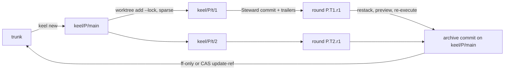

# ADR-0001 Git primary, jj optional

## Status

Accepted on 2026-09-25. Decided by the owner (D4). This ADR belongs to keel's own design sequence, not to
the `ADR-<5>` ids keel mints for target projects.

## Context

keel's traceability, isolation, claims, snapshots, integration and landing all need version control
primitives. Two candidates were considered.

- git is everywhere keel runs, including native Windows with Git for Windows, and every agent CLI expects a
  git checkout. It offers commit trailers, create-only compare-and-swap ref updates, worktrees with sparse
  checkout, `merge-tree --write-tree` previews and temporary-index snapshots.
- jj (Jujutsu) adds stable change ids, an operation log, an evolution log, first-class conflicts,
  `jj run` and revsets. It is pre-1.0. Its secondary workspaces are not git checkouts, which breaks agent
  CLIs that need one, and `jj workspace add --colocate` is unreleased as of jj 0.45.1 (verify by probe).

Reserved-operation detection must hold without jj: an earlier draft detected ref moves only through the jj
op log, which a review rejected.

## Decision

1. One Vcs interface, `src/vcs/vcs.ts`, with two backends. Its operations are detect, workspace
   create/list/remove (sparse), snapshot, ref snapshot and diff, remote snapshot (`ls-remote`), changed
   names, source tree hash, commit-tree, trailer read, claim acquire/release, integration preview, restack,
   land with an expected old value, and annotate.
2. GitBackend is complete on its own. Every guarantee is specified in git primitives:
   - identity through the `Keel-Round` trailer and non-nesting branches `keel/
/main` and `keel/
/t/<n>`;
   - isolation through locked, sparse worktrees created serially;
   - Steward commits through a temporary index and `commit-tree`, then a CAS `update-ref`;
   - claims as create-only CAS refs under `refs/keel/claims/`;
   - reserved-operation detection through ref snapshots, reflog tails and `git ls-remote` before and after
     each run;
   - landing with `merge --ff-only` in a clean checked-out worktree, a refusal when that worktree is dirty,
     and a CAS `update-ref` otherwise.
3. JjBackend is opt-in (M7). keel uses it only when jj ≥ 0.45.1 passes feature probes, the repository is
   colocated, there is no LFS, submodule or filter, and the Board opted in. It adds, never replaces: change
   ids recorded next to `Keel-Round`, the op log as an extra detection source, evolog export, conflicts as
   tasks, `jj run`, a megamerge preview and policy revsets.
4. Agent workspaces stay git worktrees until jj ships colocated workspaces or a descriptor declares
   `git_required: false`. jj workspace creation is serialized.
5. `keel doctor --section vcs` probes a git floor of 2.38 for `merge-tree --write-tree` and reports
   directory/file ref conflicts.

## Consequences

- Every guarantee holds on plain git; M7's exit requires that disabling jj mid-project loses no trace,
  evidence or approval.
- jj records sit alongside git records, so the trace store does not depend on which backend was active.
- Two backends must pass the same M1–M4 suites, plus a jj hazard suite on Windows.
- Non-nesting branch names avoid the git rule that a ref cannot be both a file and a directory.
- Mechanics, the prevent-vs-detect table and Windows notes live in [05-vcs.md](../05-vcs.md).

## Alternatives considered

- **jj as the primary backend.** Rejected: pre-1.0, secondary workspaces break agent CLIs that expect a git
  checkout, and D4 requires git to be sufficient.
- **git only, with no jj path.** Rejected: the op log, evolog and first-class conflicts are useful extra
  detection and audit sources for users who already run jj.
- **git notes as the primary trace store.** Rejected: notes are an optional derived index, off by default;
  trailers on Steward commits are the durable link.
- **Detection only through the jj op log.** Rejected: it would leave plain-git users without the guarantee.

## Sources

- jj (Jujutsu) and CodeAlive jj-agentic-workflow: change ids, op log, evolog, first-class conflicts, the
  integrator as sole trunk writer, serialized workspaces, the hazard list.
- Gas Town Refinery: verify the merged batch before landing.
- The compliance and facts review passes of the blueprint: plain-git reserved-operation detection, the
  land cases and non-nesting branch names.
- See [16-sources-credits.md](../16-sources-credits.md).
