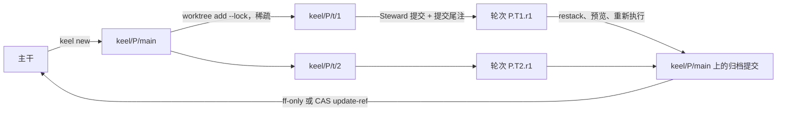

# ADR-0001 git 为主，jj 可选

> 英文原文（规范版本）：[ADR-0001-git-primary-jj-optional.md](ADR-0001-git-primary-jj-optional.md)。本文是其简体中文镜像，两者不一致时以英文版为准。

## 状态

于 2026-09-25 接受。由所有者决定（D4）。本 ADR 属于 keel 自身的设计序列，而不属于 keel 为目标项目生成的 `ADR-<5>` id。

## 背景

keel 的可追溯性、隔离、认领（claim）、快照、集成与落地（land）都需要版本控制原语。考虑过两个候选方案。

- git 在 keel 运行的所有地方都可用，包括装有 Git for Windows 的原生 Windows，而且每个智能体 CLI 都期望一个 git 检出。它提供提交尾注（trailer）、只可创建的比较并交换（CAS）引用更新、支持稀疏检出（sparse checkout）的工作树（worktree）、`merge-tree --write-tree` 预览以及临时索引快照。
- jj（Jujutsu）增加了稳定的变更 id、操作日志、演化日志（evolution log）、一等公民的冲突、`jj run` 和 revset。它尚处于 1.0 之前。它的辅助工作区不是 git 检出，这会破坏需要 git 检出的智能体 CLI；并且截至 jj 0.45.1，`jj workspace add --colocate` 尚未发布（待探测验证（verify by probe））。

保留操作检测必须在没有 jj 的情况下成立：一份早期草稿只通过 jj 操作日志检测引用移动，被一次评审否决。

## 决策

1. 一个 Vcs 接口 `src/vcs/vcs.ts`，带两个后端。它的操作包括：检测、工作区创建/列出/移除（稀疏）、快照、引用快照与差异比对、远端快照（`ls-remote`）、变更的文件名、源树哈希、commit-tree、读取提交尾注、认领获取/释放、集成预览、restack、带预期旧值的落地，以及 annotate。
2. GitBackend 本身就是完整的。每项保证都用 git 原语规定：
   - 身份通过 `Keel-Round` 提交尾注以及非嵌套分支 `keel/
/main` 和 `keel/
/t/<n>`；
   - 隔离通过串行创建的、加锁的稀疏工作树；
   - Steward 提交通过临时索引和 `commit-tree`，然后执行 CAS `update-ref`；
   - 认领是 `refs/keel/claims/` 下只可创建的 CAS 引用；
   - 保留操作检测通过每次运行前后的引用快照、reflog 尾部和 `git ls-remote`；
   - 落地时在干净的已检出工作树中使用 `merge --ff-only`，该工作树存在未提交修改时拒绝，否则使用 CAS `update-ref`。
3. JjBackend 需显式启用（M7）。只有当 jj ≥ 0.45.1 通过特性探测、仓库为共置（colocated）模式、没有 LFS、子模块或过滤器，并且董事会（Board）选择启用时，keel 才会使用它。它只做增补，从不替代：与 `Keel-Round` 并列记录的变更 id、作为额外检测来源的操作日志、evolog 导出、冲突即任务、`jj run`、megamerge 预览以及策略 revset。
4. 在 jj 发布共置工作区或某个描述符声明 `git_required: false` 之前，智能体工作区保持为 git 工作树。jj 工作区的创建是串行的。
5. `keel doctor --section vcs` 探测 git 最低版本 2.38（用于 `merge-tree --write-tree`），并报告目录/文件引用冲突。

## 后果

- 每项保证都在纯 git 上成立；M7 的退出条件要求在项目中途禁用 jj 不丢失任何追溯、证据（evidence）或批准。
- jj 记录与 git 记录并存，因此追溯存储不依赖于当时启用的是哪个后端。
- 两个后端必须通过相同的 M1–M4 套件，外加 Windows 上的 jj 隐患套件（hazard suite）。
- 非嵌套分支名避开了 git 中"一个引用不能既是文件又是目录"的规则。
- 机制、预防与检测对照表以及 Windows 注意事项位于 [05-vcs.zh-CN.md](../05-vcs.zh-CN.md)。

## 考虑过的备选方案

- **jj 作为主后端。** 否决：处于 1.0 之前，辅助工作区会破坏期望 git 检出的智能体 CLI，而且 D4 要求 git 本身即足够。
- **只用 git，不提供 jj 路径。** 否决：对于已经在使用 jj 的用户，操作日志、evolog 和一等公民的冲突是有用的额外检测与审计来源。
- **以 git notes 作为主追溯存储。** 否决：notes 是一个可选的派生索引，默认关闭；Steward 提交上的提交尾注才是持久的链接。
- **只通过 jj 操作日志进行检测。** 否决：这会让纯 git 用户失去该保证。

## 来源

- jj（Jujutsu）和 CodeAlive jj-agentic-workflow：变更 id、操作日志、evolog、一等公民的冲突、集成者作为唯一的主干写者、串行化的工作区、隐患清单。
- Gas Town Refinery：在落地前验证合并后的批次。
- 蓝图的合规与事实评审轮次：纯 git 的保留操作检测、落地的几种情况以及非嵌套分支名。
- 参见 [16-sources-credits.zh-CN.md](../16-sources-credits.zh-CN.md)。
