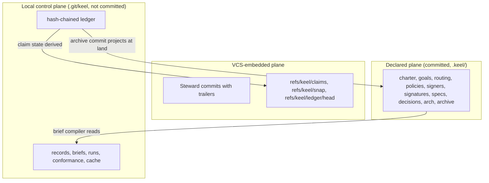

# ADR-0003 Control plane in the git common dir

## Status

Accepted on 2026-09-25, adopted by recommendation. Reversible through a superseding ADR.

## Context

keel needs one local store for events and in-flight records that:

- is shared by the main checkout and every worktree keel creates;
- stays out of diffs, commits, jj snapshots and `git clean -fdx`;
- has exactly one writer, the Steward, and is the only truth store for events.

Seats run as the same OS user. On native Windows most runtimes have no write boundary, so a seat can reach
any path the user can. Codex's `workspace-write` sandbox keeps writes inside its roots but leaves reads
unrestricted. An earlier draft claimed seats "cannot reach" the store; a review showed that claim false on
Windows.

## Decision

1. The local control plane lives at `$(git rev-parse --git-common-dir)/keel`, normally `.git/keel/`:
   - `ledger/<yyyy-mm>.jsonl`: the canonical event log;
   - `records/` (EV cache, VD, TR, IM), `briefs/`, `runs/<RUN>/`, `conformance/`, `cache/` (index,
     `trace.db`, dashboard) and `locks/`.
2. The ledger is hash-chained. Each event carries `prev` (the previous event's hash) and its own `hash`.
   One writer appends under an `O_EXCL` lock and checks, before each append, that the file tail equals the
   chain hash held by the Steward-owned anchor ref `refs/keel/ledger/head`, which it CAS-updates after
   every append. Every process, including a new `keel land`, checks against the anchor, not its memory.
   `refs/keel` is in the pre-spawn ref snapshot, so a seat that moves the anchor makes a reserved-operation
   finding; at ingest the supervising Steward accepts only its own appends and Board-signed approvals in
   the run window ([04-trace-and-state.md](../04-trace-and-state.md)).
3. Every Board envelope includes the ledger chain head, so any later edit of events before a signed head is
   detectable.
4. Claim state, leases, heartbeats and the current track are ledger events. Claim refs are only
   create-only CAS locks holding a token. Proposal, task and element status is computed from events and
   never stored.
5. Seats write only through their submit channel ([ADR-0004](ADR-0004-steward-commits-and-submit-channels.md));
   the Steward validates every drop at ingest and persists only whitelisted typed fields.
6. At land, the archive commit projects the ledger slice, evidence, verdicts, triage records, reports and
   the receipt into `.keel/archive/`, subject to the projection gate. Projections are history, never input.
7. `keel doctor` reports `control_plane_exposure` (`sandboxed` or `exposed`) per runtime and OS, and every
   receipt carries it.

## Consequences

- One store serves all worktrees and survives `git clean -fdx`; worktree diffs and jj snapshots never see
  it.
- Integrity rests on the hash chain and its anchor ref, signatures, ingest capture with the window check
  and land re-execution, not on unreachability. The argument, and the residual limit of a process that
  outlives its run, is in [14-trust-security.md](../14-trust-security.md).
- Exposure is reported honestly: most native Windows routes report `exposed`, and receipts say so.
- The store is local to one clone. Other machines see only committed signatures and archive projections;
  multi-machine collaboration is open ([17-open-decisions.md](../17-open-decisions.md)).
- Derived data (`trace.db`, index cache, dashboard) can be deleted and rebuilt; `keel audit --rebuild`
  compares incremental and full builds by set difference.
- The ledger format, ids and redaction rules live in [04-trace-and-state.md](../04-trace-and-state.md).

## Alternatives considered

- **Committed state files in the working tree.** Rejected: they pollute diffs, conflict on restack, and sit
  inside every seat's writable tree.
- **A database as the truth store.** Rejected: a single append-only, hash-chained log is simpler to verify;
  `trace.db` exists only as a derived index.
- **git refs or notes as the event store.** Rejected: refs hold claim tokens only; notes are an optional
  derived index, off by default.
- **A per-user directory outside the repository.** Rejected: it loses the binding between a repository and
  its events, and it is just as writable by seats.
- **A local server process holding the state.** Rejected: keel is not a hosted service, and a server adds a
  second authority path.

## Sources

- OpenHands: an event-sourced run log.
- Gas Town Refinery: verify the merged batch, which grounds land re-execution.
- Blueprint proposal C: the git-common-dir control plane.
- The compliance and facts review passes: control-plane exposure on native Windows, the chain head in
  envelopes.
- See [16-sources-credits.md](../16-sources-credits.md).
