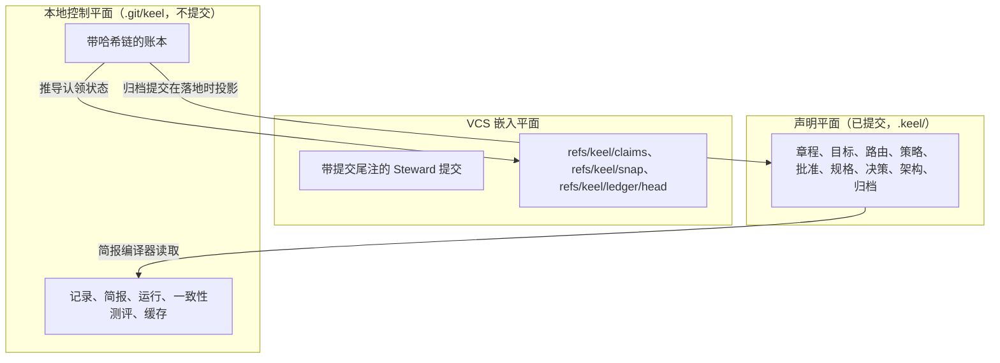

# ADR-0003 位于 git 公共目录中的控制平面

> 英文原文（规范版本）：[ADR-0003-control-plane-in-git-common-dir.md](ADR-0003-control-plane-in-git-common-dir.md)。本文是其简体中文镜像，两者不一致时以英文版为准。

## 状态

于 2026-09-25 接受，按建议采纳。可通过一份取代它的 ADR 撤销。

## 背景

keel 需要一个本地存储来保存事件和进行中的记录，它要：

- 由主检出和 keel 创建的每个工作树（worktree）共享；
- 不出现在差异、提交和 jj 快照中，也不受 `git clean -fdx` 影响；
- 只有一个写者，即 Steward，并且是事件的唯一真相存储。

席位（seat）以同一个操作系统用户运行。在原生 Windows 上，大多数运行时（runtime）没有写边界，因此席位能触及用户能触及的任何路径。Codex 的 `workspace-write` 沙箱把写入限制在其根目录内，但读取不受限制。一份早期草稿声称席位"无法触及"该存储；一次评审表明这一说法在 Windows 上是错误的。

## 决策

1. 本地控制平面位于 `$(git rev-parse --git-common-dir)/keel`，通常是 `.git/keel/`：
   - `ledger/<yyyy-mm>.jsonl`：规范的事件日志；
   - `records/`（EV 缓存、VD、TR、IM）、`briefs/`、`runs/<RUN>/`、`conformance/`、`cache/`（索引、`trace.db`、看板）和 `locks/`。
2. 账本（ledger）是带哈希链的。每个事件携带 `prev`（前一个事件的哈希）和它自己的 `hash`。唯一的写者在 `O_EXCL` 锁下追加，并在每次追加之前检查文件尾部是否等于由 Steward 拥有的锚点引用 `refs/keel/ledger/head` 所保存的链哈希；每次追加之后，它以 CAS 方式更新该锚点。每个进程（包括新的 `keel land` 进程）都对照锚点检查，而不是凭自己的记忆。`refs/keel` 属于派生前的引用快照，因此移动锚点的席位会造成一次保留操作发现；在摄取时，负责监督的 Steward 只接受运行窗口内它自己的追加（[04-trace-and-state.zh-CN.md](../04-trace-and-state.zh-CN.md)）。
3. 每条批准记录都包含账本链头，因此之后对已记录链头之前事件的任何编辑都可作为不一致被检测到（这是一项一致性检查，而不是针对连记录也一并改写的写者的防御；[ADR-0005](ADR-0005-explicit-confirmation-approvals.zh-CN.md)）。
4. 认领（claim）状态、租约、心跳和当前轨道（track）都是账本事件。认领引用只是持有令牌的只可创建 CAS 锁。提案（proposal）、任务和架构元素（element）的状态由事件计算得出，从不存储。
5. 席位只通过其提交通道写入（[ADR-0004](ADR-0004-steward-commits-and-submit-channels.zh-CN.md)）；Steward 在摄取时校验每一次投递，只持久化白名单内的类型化字段。
6. 落地（land）时，归档提交把账本片段、证据（evidence）、评审结论（verdict）、分诊记录、报告和回执（receipt）投影到 `.keel/archive/`，并受投影门禁约束。投影是历史，从不作为输入。
7. `keel doctor` 按运行时和操作系统报告 `control_plane_exposure`（`sandboxed` 或 `exposed`），每份回执都携带它。

## 后果

- 一个存储服务所有工作树，并能在 `git clean -fdx` 后保留；工作树差异和 jj 快照永远看不到它。
- 完整性建立在哈希链及其锚点引用、对照当前内容核验的批准记录、带窗口检查的摄取捕获和落地重新执行之上，而不是建立在"无法触及"之上。论证以及比运行活得更久的进程这一残余局限，见 [14-trust-security.zh-CN.md](../14-trust-security.zh-CN.md)。
- 暴露情况如实报告：大多数原生 Windows 路由报告 `exposed`，回执也会如此说明。
- 该存储只属于一个克隆。其他机器只能看到已提交的批准记录和归档投影；多机协作仍是开放问题（[17-open-decisions.zh-CN.md](../17-open-decisions.zh-CN.md)）。
- 派生数据（`trace.db`、索引缓存、看板）可以删除并重建；`keel audit --rebuild` 通过集合差异比较增量构建和完整构建。
- 账本格式、id 和脱敏规则位于 [04-trace-and-state.zh-CN.md](../04-trace-and-state.zh-CN.md)。

## 考虑过的备选方案

- **工作树中已提交的状态文件。** 否决：它们污染差异、在 restack 时产生冲突，并且位于每个席位的可写树内。
- **以数据库作为真相存储。** 否决：单一的只追加、带哈希链的日志更易于验证；`trace.db` 仅作为派生索引存在。
- **以 git 引用或 notes 作为事件存储。** 否决：引用只保存认领令牌；notes 是可选的派生索引，默认关闭。
- **仓库之外的按用户目录。** 否决：它失去了仓库与其事件之间的绑定，而且席位同样可以写入。
- **一个保存状态的本地服务器进程。** 否决：keel 不是托管服务，服务器会增加第二条权威路径。

## 来源

- OpenHands：事件溯源的运行日志。
- Gas Town Refinery：验证合并后的批次，这是落地重新执行的依据。
- 蓝图提案 C：位于 git 公共目录中的控制平面。
- 合规与事实评审轮次：原生 Windows 上的控制平面暴露、批准记录中的链头。
- 参见 [16-sources-credits.zh-CN.md](../16-sources-credits.zh-CN.md)。
