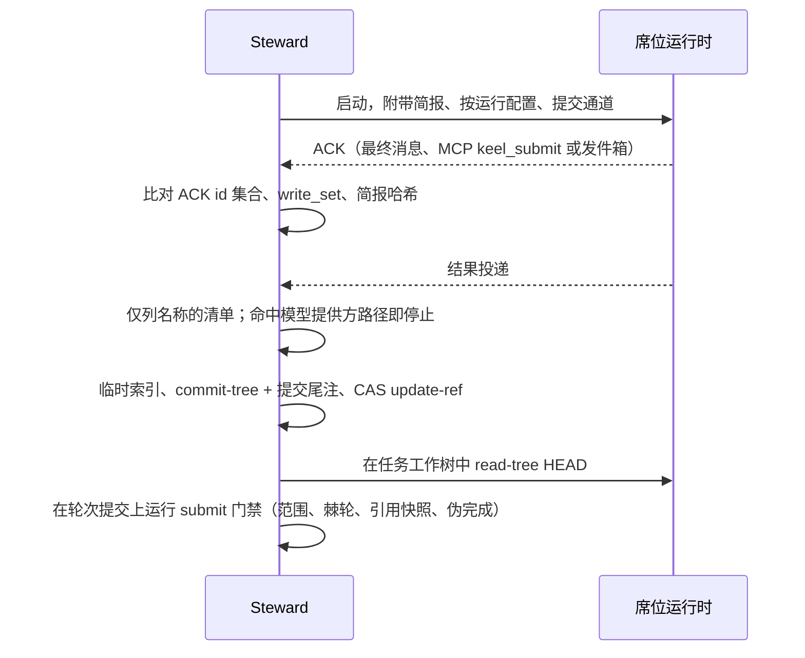

# ADR-0004 Steward 提交（commit）与提交通道（submit channel）

> 英文原文（规范版本）：[ADR-0004-steward-commits-and-submit-channels.md](ADR-0004-steward-commits-and-submit-channels.md)。本文是其简体中文镜像，两者不一致时以英文版为准。

## 状态

于 2026-09-25 接受，按建议采纳。可通过一份取代它的 ADR 撤销。

## 背景

每一行落地（land）的代码都必须能通过提交尾注（trailer）追溯到轮次、任务、需求（requirement）和目标（goal）。如果由席位（seat）来提交，提交尾注的诚实程度就只取决于席位本身；而拥有提交权限的席位还能移动引用、写入控制平面并改写历史。钩子无法可靠地阻止这些：它们失败时放行，只在受信任的项目中加载，而且有些运行时（runtime）根本没有项目钩子。

席位还需要一种方式把 ACK（复述确认）、裁定（ruling）、提问和结果交给 keel。各运行时之间存在差异：

- 有的返回经过 schema 检查的最终消息（Codex 的 `--output-schema` 加 `-o`；Claude Code 和 Qwen Code 的 `--json-schema`，其中 Claude Code 接受内联 JSON，Qwen Code 接受字面量或 `@path`）；
- 有的可以调用 MCP 工具；
- 只读模式无法写文件，因此在那里不可能进行文件投递；
- 网页聊天（梯级（rung）D）以上都没有。

## 决策

1. 席位从不提交。每次提交都由 Steward 完成：
   - 在摄取提交（submit）时，它先只按名称列出已变更的路径（命中模型提供方路径时，该轮次在任何暂存之前即停止），再通过临时的 `GIT_INDEX_FILE` 并带上针对模型提供方路径的排除路径规格写出树，带着轮次提交尾注运行 `commit-tree -p <tip>`，并以 CAS 方式更新任务分支；
   - 随后在该轮次提交上运行 submit 门禁；未通过的轮次作为历史把提交留在任务分支上，永远不进入验证；
   - 然后它运行 `git -C <ws> read-tree HEAD`，使任务工作树的索引与新的 HEAD 一致（文件本身已经一致）；
   - 如果存在席位自己产生的提交，它们会被保存在 `refs/keel/snap/<task>/seat-<n>` 下，从不被信任；
   - 治理文档只能通过带 `Keel-Doc` 和 `Keel-Approval` 的 Steward 治理提交进入主干。
2. 每个运行时描述符按模式声明一个 `submit_channel`，取值之一：
   - `final-message`：运行时原生的结构化输出，带 `schema_flag_takes: inline | path`；
   - `mcp`：`keel_submit` 工具，它唯一的写入是在运行的发件箱中投递（MCP 服务器是否在工具沙箱之外运行，需按运行时待探测验证（verify by probe））；
   - `outbox`：通过 `keel api` 进行的 `O_EXCL` JSON 投递，仅用于能写入的模式。
3. 只读模式下的席位通过一次简短预运行的结构化最终消息或通过 MCP 进行 ACK。
4. 在梯级 D，由人使用网页聊天产生的内容运行 `keel api ack` 和 `keel api submit`。
5. Steward 在摄取时从子进程的通道捕获投递，依据 `schemas/ack|result|verdict.schema.json` 校验它们，将 ACK id 集合与简报（brief）做差异比对，从不信任席位侧的检查。
6. 可选的 commit-msg 钩子（M2）只为交互式的人工会话添加提交尾注。

## 后果

- 提交尾注只由 keel 代码写入，因此追溯存储在各运行时之间是一致的。
- 席位权限可以完全排除 git 写操作；任何不是 keel 做出的引用变化都是一个保留操作发现项（finding）（[05-vcs.zh-CN.md](../05-vcs.zh-CN.md)）。
- 摄取必须解析每个运行时的流格式和通道；描述符携带解析器 id 以及按字段的验证状态（[09-runtimes.zh-CN.md](../09-runtimes.zh-CN.md)）。
- 唯一的非交互模式会绕过权限的运行时（Kimi Code `-p`）停留在梯级 D，直到验证出更安全的模式。
- 按运行时和模式列出的通道表位于 [02-alignment.zh-CN.md](../02-alignment.zh-CN.md)；MCP 写入范围位于 [12-cli-api-mcp.zh-CN.md](../12-cli-api-mcp.zh-CN.md)。

## 考虑过的备选方案

- **席位提交，由钩子添加提交尾注。** 否决：钩子失败时放行且依赖信任层，而提交权限让席位能够移动引用。
- **用于提交的回环 HTTP 端点。** 否决：它为每次运行打开一个端口，而按模式的通道已经覆盖了每个梯级。
- **席位直接追加到账本（ledger）。** 否决：账本只有一个写者，席位输出是数据，而不是权威。
- **只用文件投递。** 否决：只读模式无法写文件。

## 来源

- oh-my-claudecode：适用于其他运行时上评审者的评审结论（verdict）文件契约。
- OpenSpec：单 JSON 智能体契约。
- jj-agentic-workflow（CodeAlive）：集成者作为唯一的主干写者。
- Claude Code、Codex CLI 和 Qwen Code 结构化输出的运行时文档。
- 事实评审轮次：只读模式下的 ACK 和提交、Claude Code 的内联 schema。
- 参见 [16-sources-credits.zh-CN.md](../16-sources-credits.zh-CN.md)。
