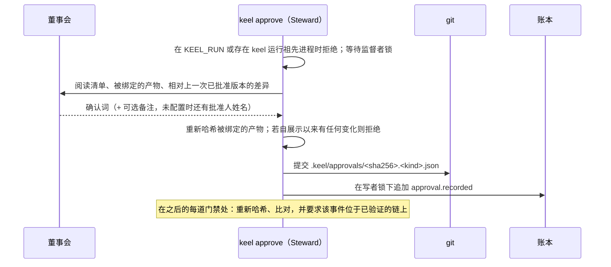

# ADR-0005 显式确认的董事会批准

> 英文原文（规范版本）：[ADR-0005-explicit-confirmation-approvals.md](ADR-0005-explicit-confirmation-approvals.md)。本文是其简体中文镜像，两者不一致时以英文版为准。

## 状态

于 2026-09-26 接受。由所有者决定（D6，即 [00-mandate.zh-CN.md](../00-mandate.zh-CN.md) 中声明的第 6 条）。

## 背景

董事会批准是 keel 唯一的权威来源：契约、计划、落地和回执检查点；治理文档（章程、目标、路由、策略）；策略路径请求；以及裁定。所有者对它们提出两项要求：由人在查看具体变更之后作出决定，并且实际运行的内容与所批准的内容完全一致。所有者明确不要求 keel 挫败在同一操作系统账户下运行的恶意程序，并排除了 SSH 签名、密钥管理、签名者列表、ssh-agent 检查、硬件密钥检查、在场验证以及任何独立的身份系统。

这排除了密码学设计，也确定了一个诚实的本地设计所能承诺的范围。在原生 Windows 上，大多数 agent CLI 以用户的完整文件权限运行，因此 keel 写出的任何记录都可能被同一用户的某个进程改写；所以 keel 承诺的是其自身协作式流程内的一致性检查和拒绝，并说明这一局限，而不是声称一种它无法提供的真实性。

## 决策

1. **董事会批准是对所展示变更的显式确认。** `keel approve` 展示主题及其具体变更（`org/checkpoints.yaml` 中的阅读清单、被绑定的产物及其相对上一次已批准版本的差异），董事会通过输入确认词来确认。单独按 Enter 或泛泛的“继续”不是批准；确认只适用于所展示的主题和内容版本。
2. **记录绑定主题、哈希、批准人和时间。** Steward 写入 `.keel/approvals/<record-sha256>.<kind>.json`（`AP-<sha12>`），其中包含种类以及阶段或裁定类型、主题、提交、每个被绑定产物（以其规范化字节的 `{path, sha256}` 表示）、该种类若有则包含契约哈希或请求文本或落地绑定、可选的备注、声明的批准人、账本链头以及本地批准时间。记录从不哈希自身。结构以 `schemas/approval.schema.json` 为准；流程见 [02-alignment.zh-CN.md](../02-alignment.zh-CN.md)。
3. **已批准的内容一旦变化，批准即失效。** 在每道门禁处，Steward 重新哈希被绑定的产物并与记录比对。任何差异都是 `missing-approval`：董事会必须查看变更并重新批准。对记录未覆盖文件的变更、其他提案的活动以及普通的账本追加都不会使其失效。在展示与记录之间，`keel approve` 会再重新哈希一次，若有任何变动即拒绝（`changed-during-confirmation`），因此确认绝不会绑定到董事会没有看到的内容上。
4. **只有 `keel approve` 能产生批准。** 一个批准存在，当且仅当其记录由 `keel approve` 写出，且其 `approval.recorded` 事件由同一进程在账本写者锁下、在任何运行窗口之外追加。没有该事件却出现在 `.keel/approvals/` 下的文件、声称批准的席位投递或最终消息、行为者自称 `board` 的账本行，以及席位的完成声明，都是数据，永远不是批准。`keel approve` 继续在 `KEEL_RUN`、`KEEL_RUN_ID` 以及存在 keel 运行祖先进程时拒绝执行，并且像其他每个会改变状态的动词一样等待监督者锁。
5. **批准人是一个声明的名字，时间是本地时钟。** 名字来自 `.keel/local.yaml` 中的 `board.approver`、来自 `--as`，或在确认时输入。keel 记录它，但不对其做身份验证。不引入任何账户系统、密钥、签名者列表或在场检查。
6. **不为 keel 不提供的保证增添任何补偿措施。** 没有常驻服务，没有身份验证系统，没有隔离架构。成立的控制措施列在下文。

## 后果

### keel 保证的内容

- 席位输出无法批准或推进任何受保护的状态；批准只来自在任何运行之外的交互式终端上运行的 `keel approve`。
- Steward 在每道门禁处检查批准的主题、种类和内容版本；对冻结块、计划文件、治理文档或回执草稿的一字节改动都会使覆盖它的批准失效。
- 修订案、过期（豁免、策略）、常设策略的撤销、回执确认以及落地前提条件（针对草稿的落地批准，或已批准的落地策略加已批准的请求加红绿证明）照常适用。
- 落地时的证据重新执行、范围检查、追踪检查、引用快照以及带锚点引用的单写者账本独立于批准而成立。每条记录中的链头让 `keel audit` 能检测到对该链头之前事件的编辑。
- 看板保持只读，没有批准路径（[ADR-0008](ADR-0008-read-only-dashboard.zh-CN.md)）。

### keel 不声称的内容

- 批准记录不自我认证，无法在任意克隆上被验证为真实，也不能证明某个具名的人做出了行为。在克隆上它们是过程历史。
- 批准人字段是一个声明的本地身份；批准时间是本地时钟，不是可信的时间戳；产物哈希绑定的是内容，不是身份。
- 哈希链和记录中的链头是一致性检查。它们无法抵御一个拥有用户权限、把记录、账本行和锚点一起改写的进程。根据所有者的声明，该威胁不在范围内。
- 没有任何账本事件能自我验证，因此摄入时的窗口检查只接受负责监督的进程自己的追加；其他任何事件，包括 `approval.recorded`，都是外来的。
- 董事会的日常路径除了一个终端之外不需要任何东西：没有密钥、没有签名者列表、没有硬件、没有签名命令。`keel init` 也不需要它们中的任何一个。M1b 的退出标准是 [15-roadmap.zh-CN.md](../15-roadmap.zh-CN.md) 和 `test/README.md` 中列出的七项批准行为。

## 考虑过的备选方案

- **对记录做 SSH 签名（`ssh-keygen -Y`），依据已提交的签名者列表验证，并对 agent 所持密钥和 FIDO2 硬件密钥做失败即关闭检查。** 被所有者否决。它防御的是同一账户下的恶意软件，而这不在范围内；它让每次批准都需要一把密钥、一个口令或一次触碰、一个签名者主体、一份公钥列表和一个环境变量，并且没有密钥就无法初始化；它把未经验证的平台事实（Windows `ssh-keygen` 上的 FIDO2 `-sk`、agent 管道）放在关键路径上；它还会招致“记录自我认证并能证明是谁做出了行为”的夸大声称，而原生 Windows 上一把 agent 可触及的密钥无法支撑这种声称。可选的签名模式出于同样理由被否决：不允许双轨并行的批准。
- **GPG 或 git 提交签名。** 否决，理由相同，另外提交是由 Steward 产生的。
- **每次批准使用一个确认码或一次性令牌。** 否决：这是又一个需要管理的凭据，而对于所有者要求的保证而言，它相比显式确认没有任何收益。
- **常驻的批准服务或独立的席位操作系统账户。** 否决：它们所能恢复的保证并非必需。

## 来源

- old-coder：绑定到某个版本的同意（对所展示版本的显式确认，附带可选备注）。
- superpowers：批准只绑定所呈现的产物。
- BMAD-METHOD：批准后冻结意图。
- 所有者声明第 6 条（[00-mandate.zh-CN.md](../00-mandate.zh-CN.md)）。
- 参见 [16-sources-credits.zh-CN.md](../16-sources-credits.zh-CN.md)。
