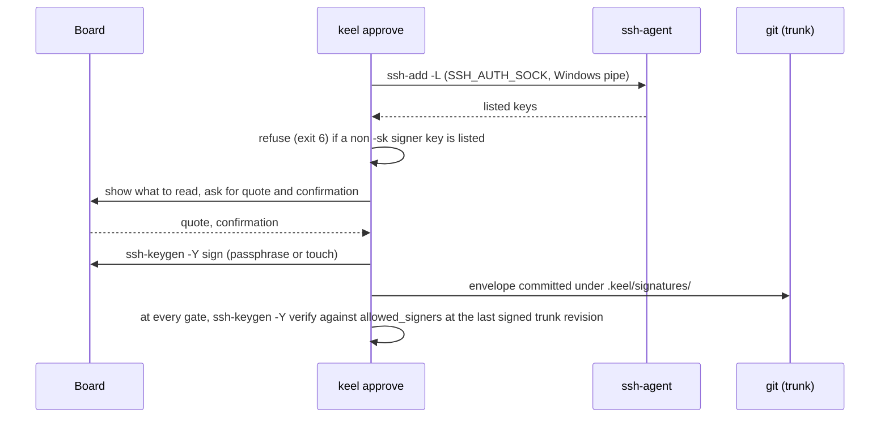

# ADR-0005 Signed Board approvals

## Status

Accepted on 2026-09-25. Decided by the owner (D6).

## Context

Board approvals are keel's only source of authority: contract, plan, land and receipt checkpoints; signed
documents (charter, goals, routing, policies, signers); policy-path requests; and rulings. They must:

- bind exactly the artifacts the Board read, so that any later edit invalidates them;
- be impossible for a seat or a script to produce or relay;
- verify on every clone, not only in the local ledger;
- work on native Windows with the tools already installed.

A TTY check alone works only while every process cooperates. On Windows an ssh-agent serves keys to any
process of the same user, so a key loaded in an agent lets a seat sign silently. Approvals stored only in
the local ledger cannot be verified by anyone else.

## Decision

1. `keel approve` is the single signing path, for `--stage contract|plan|land|receipt`, `--doc`,
   `--policy`, `--request` and `--rule answer|budget|track|override|dismiss|degraded|unverified|abandon`.
2. It builds an envelope `{stage | kind, subject, commit, artifacts [{path, sha256}], quote, approver,
   ledger_chain_head, ts, nonce}` over normalized artifact bytes, shows exactly what to read, and asks for
   interactive confirmation (a TTY, or a typed confirmation code under Git Bash mintty).
3. It signs with `ssh-keygen -Y sign -n keel-approval`. The detached envelope is committed at
   `.keel/signatures/<blob-sha256>.<kind>.json`, where it authenticates itself; the ledger references it.
4. Verification runs `ssh-keygen -Y verify` against the `allowed_signers` blob at the last Board-signed
   trunk revision, never a working-tree copy. The root signer fingerprint is pinned in the signed charter,
   and `keel init` records trust on first use.
5. Key hygiene fails closed: `keel approve`, dispatch and `keel land` exit 6 while any allowed signer's
   public key is listed by a reachable ssh-agent (through `SSH_AUTH_SOCK` or the Windows pipe
   `\\.\pipe\openssh-ssh-agent`), unless it is a FIDO2 `-sk` key. `-sk` keys are recommended on Windows;
   `-sk` support in the Windows and Git for Windows `ssh-keygen` is to be verified by probe.
6. Every mutating verb refuses under `KEEL_RUN`/`KEEL_RUN_ID` and under a keel-run ancestor (Windows
   ancestry walk: verify by probe).
7. The receipt signed at land names the integrated commit and the expected trunk tip; the landed sha goes
   into the `land.completed` event, so the signature never has to cover its own result.

## Consequences

- Any edit to an approved artifact, including a one-byte change to a frozen block, invalidates its
  approval; amendments need a fresh Board signature.
- Approvals verify on every clone and offline; no server is involved.
- Each signature needs a human act: a hardware touch or a passphrase. That is deliberate friction, kept
  small by the track right-sizing (typically two Board touches per feature).
- The dashboard cannot approve ([ADR-0008](ADR-0008-read-only-dashboard.md)).
- Key hygiene, the `allowed_signers` format and known limits live in
  [14-trust-security.md](../14-trust-security.md); the envelope and approval flow live in
  [02-alignment.md](../02-alignment.md).

## Alternatives considered

- **GPG signatures.** Rejected: an extra toolchain and keyring on Windows, while OpenSSH ships with Windows
  and with Git for Windows.
- **TTY confirmation only.** Rejected: it rests on cooperation; any process that can fake a terminal or
  call the verb can approve.
- **Approvals recorded only in the local ledger.** Rejected: not verifiable on a clone.
- **Signed git commits or tags as approvals.** Rejected: commits are Steward-made, and an approval must bind
  specific artifact hashes, a quote and the chain head rather than a whole commit.
- **Allowing agent-held keys with a warning.** Rejected: the warning would not stop a seat from signing.

## Sources

- old-coder: quotable consent bound to a version.
- superpowers: an approval binds only the presented artifact.
- BMAD-METHOD: intent frozen after approval.
- OpenSSH: `ssh-keygen -Y sign/verify`, `allowed_signers`, FIDO2 `-sk` keys.
- The compliance and facts review passes: agent-held keys on Windows, committed envelopes, signed
  requests.
- See [16-sources-credits.md](../16-sources-credits.md).
