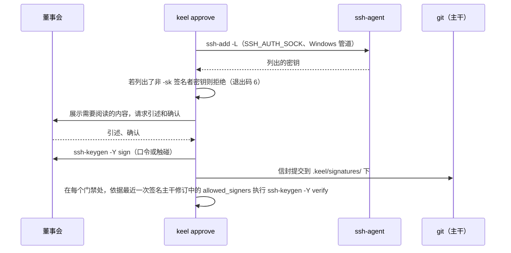

# ADR-0005 已签名的董事会批准

> 英文原文（规范版本）：[ADR-0005-signed-board-approvals.md](ADR-0005-signed-board-approvals.md)。本文是其简体中文镜像，两者不一致时以英文版为准。

## 状态

于 2026-09-25 接受。由所有者决定（D6）。

## 背景

董事会（Board）批准是 keel 唯一的权威来源：契约、计划、落地（land）和回执（receipt）检查点（checkpoint）；已签名的文档（章程（charter）、目标、路由、策略、签名者）；策略路径请求；以及裁定（ruling）。它们必须：

- 精确绑定董事会所阅读的产物，使之后的任何编辑都会让它们失效；
- 不可能由席位（seat）或脚本产生或转发；
- 在每个克隆上都能验证，而不仅仅在本地账本（ledger）中；
- 在原生 Windows 上用已安装的工具即可工作。

单靠 TTY 检查只在每个进程都配合时才有效。在 Windows 上，ssh-agent 会把密钥提供给同一用户的任何进程，因此加载在 agent 中的密钥可以让席位悄无声息地签名。仅存储在本地账本中的批准无法被其他任何人验证。

## 决策

1. `keel approve` 是唯一的签名路径，适用于 `--stage contract|plan|land|receipt`、`--doc`、`--policy`、`--request` 以及 `--rule answer|budget|track|override|dismiss|degraded|unverified|abandon`。
2. 它基于规范化后的产物字节构建一个信封 `{stage | kind, subject, commit, artifacts [{path, sha256}], quote, approver, ledger_chain_head, ts, nonce}`，准确展示需要阅读的内容，并请求交互式确认（一个 TTY，或者在 Git Bash mintty 下输入确认码）。
3. 它用 `ssh-keygen -Y sign -n keel-approval` 签名。分离的信封提交在 `.keel/signatures/<blob-sha256>.<kind>.json`，并在那里自我认证；账本引用它。
4. 验证依据最近一个董事会签名的主干修订中的 `allowed_signers` blob 运行 `ssh-keygen -Y verify`，从不使用工作树副本。根签名者指纹固定在已签名的章程中，`keel init` 记录首次使用即信任（trust on first use）。
5. 密钥卫生失败即关闭：只要任何允许的签名者公钥被可访问的 ssh-agent（通过 `SSH_AUTH_SOCK` 或 Windows 管道 `\\.\pipe\openssh-ssh-agent`）列出，`keel approve`、派发和 `keel land` 就以退出码 6 退出，除非它是 FIDO2 `-sk` 密钥。在 Windows 上推荐 `-sk` 密钥；Windows 和 Git for Windows 的 `ssh-keygen` 对 `-sk` 的支持有待探测验证（verify by probe）。
6. 每个变更类动词在 `KEEL_RUN`/`KEEL_RUN_ID` 下以及存在 keel 运行祖先进程时拒绝执行（Windows 祖先进程遍历：待探测验证）。
7. 落地时签名的回执指明集成提交和预期的主干顶端；落地后的 sha 写入 `land.completed` 事件，因此签名永远不必覆盖它自己的结果。

## 后果

- 对已批准产物的任何编辑，包括对冻结块的一字节改动，都会使其批准失效；修订案（amendment）需要新的董事会签名。
- 批准在每个克隆上都能离线验证；不涉及任何服务器。
- 每次签名都需要一个人为动作：一次硬件触碰或一次口令输入。这是有意为之的摩擦，并通过轨道（track）按需定级保持在较小程度（每个 feature 通常两次董事会介入）。
- 看板（dashboard）无法批准（[ADR-0008](ADR-0008-read-only-dashboard.zh-CN.md)）。
- 密钥卫生、`allowed_signers` 格式和已知局限位于 [14-trust-security.zh-CN.md](../14-trust-security.zh-CN.md)；信封和批准流程位于 [02-alignment.zh-CN.md](../02-alignment.zh-CN.md)。

## 考虑过的备选方案

- **GPG 签名。** 否决：在 Windows 上需要额外的工具链和密钥环，而 OpenSSH 随 Windows 和 Git for Windows 一同提供。
- **仅 TTY 确认。** 否决：它依赖配合；任何能伪造终端或调用该动词的进程都能批准。
- **仅记录在本地账本中的批准。** 否决：无法在克隆上验证。
- **以已签名的 git 提交或标签作为批准。** 否决：提交由 Steward 产生，而批准必须绑定具体的产物哈希、引述和链头，而不是整个提交。
- **允许 agent 持有的密钥但给出警告。** 否决：警告无法阻止席位签名。

## 来源

- old-coder：绑定到版本的可引述同意。
- superpowers：批准只绑定所呈现的产物。
- BMAD-METHOD：批准后冻结意图（frozen intent）。
- OpenSSH：`ssh-keygen -Y sign/verify`、`allowed_signers`、FIDO2 `-sk` 密钥。
- 合规与事实评审轮次：Windows 上 agent 持有的密钥、已提交的信封、已签名的请求。
- 参见 [16-sources-credits.zh-CN.md](../16-sources-credits.zh-CN.md)。
