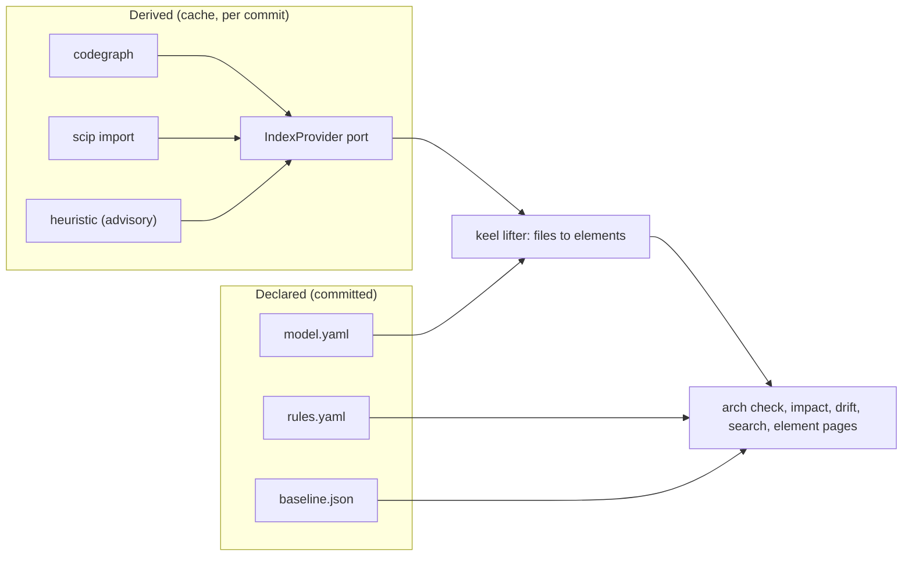

# ADR-0007 Declared architecture and the IndexProvider port

## Status

Accepted on 2026-09-25, adopted by recommendation. Reversible through a superseding ADR.

## Context

keel promises architecture intelligence in the spirit of Sourcegraph and arch-viewer: search, impact, drift,
ownership and a change feed, tied to each landed line. Two kinds of facts are involved.

- Intent: which elements exist, which paths realize them, who owns them, which dependencies are allowed.
  Only people and the architect seat can state this.
- Reality: which files and symbols depend on which. Code graph engines compute this better than keel could,
  but their output can be stale, partial or heuristic.

Architecture views that invent edges or reduce health to a single score mislead humans and agents. Building
a code graph engine is out of scope for keel.

## Decision

1. Declared plane, committed and changed only through `arch.delta` applied at land:
   - `.keel/arch/model.yaml`: C4-style elements (`el:<dotted>`, kind system, container or component, parent,
     path globs, owner label, tags, relations, ADRs), layers and mapping overrides;
   - `.keel/arch/rules.yaml`: rules `AR-<5>` of kind forbidden, allowed, required, layers, acyclic or
     independent;
   - `.keel/arch/baseline.json`: frozen known violations, which shrink freely and grow only through a
     contract approval;
   - ADR obligations with `applies_to` globs.
2. Derived plane, cached under `.git/keel/cache/index/<commit>/` and never committed, behind the
   IndexProvider port in `src/arch/index-provider.ts`:
   - `status(commit)`: upload state (queued, processing, completed, errored), nearest indexed ancestor,
     coverage and provenance mix;
   - `search(query)` over text, symbols and paths;
   - `definitions(symbol)` and `references(symbol)`;
   - `dependents(files, depth)`.
3. Backends: `codegraph` (the default when installed; run only in a detached verify or index checkout, index
   and query commands only, never init or install, with telemetry and the daemon off and `.codegraph/`
   moved into the cache; all verify by probe), `scip` (import of the user's own `index.scip`), `heuristic`
   (an import scan plus text search, advisory only) and `none`.
4. keel's lifter maps each file to the most specific element glob and aggregates symbol edges into element
   edges. Unmapped files are listed, never guessed.
5. Every edge carries provenance (`scip`, `tree-sitter`, `heuristic`, `llm`) and a confidence. Only new
   errors backed by `scip` or `tree-sitter` edges fail the arch check. A stale or failed overlay answers
   `unknown`, which blocks on the system track or when rules reach the affected elements, and is advisory
   otherwise.
6. No index is ever mandatory for gates other than the architecture check. doctor states plainly when the
   architecture checks are inert (backend `none` or heuristic only, or no `model.yaml`).
7. There is no scalar health score; LLM narration is optional and labelled non-authoritative.

## Consequences

- Intent stays reviewable and Board-approved; derived facts stay replaceable and labelled.
- keel depends on no particular engine; codegraph and SCIP are optional external adapters.
- Architecture checks may be inert on a project without an index or a model, and keel says so instead of
  showing green.
- The codegraph constraints must be probed per version (M4); a failed probe falls back to SCIP or the
  heuristic backend.
- Before M4, or with backend `none`, the track ratchet uses a conservative path fallback.
- The full model, drift classes, impact and element pages live in
  [07-architecture-intelligence.md](../07-architecture-intelligence.md).

## Alternatives considered

- **A code graph engine built into keel.** Rejected: keel is not a code-graph engine, and mature engines
  exist.
- **SCIP only as the default.** Rejected as default: it requires the user to run an indexer per language;
  it remains a supported backend.
- **A built-in tree-sitter indexer as the default.** Rejected: a large maintenance surface for little gain
  over renting codegraph.
- **Architecture inferred by a model.** Rejected: LLM edges are advisory only and never fail a gate.
- **A scalar architecture health score.** Rejected: it hides denominators and provenance.

## Sources

- Sourcegraph: per-commit index states, nearest indexed ancestor with a diff overlay, the code-intel API
  shape (definitions, references, search), desired-state plans, series, ownership as data.
- The architecture visualization survey: a pluggable IndexProvider with codegraph as default and SCIP
  optional; derived data gitignored, declared data committed.
- axumquant/arch-viewer: a self-contained view with click-through and a change feed; its fabricated edges and
  score are counter-examples.
- codegraph: edge provenance, impact and freshness.
- dependency-cruiser, ArchUnit, import-linter: executable rules with frozen baselines. LikeC4, Structurizr:
  the C4 hierarchy. SCIP: symbol ids.
- See [16-sources-credits.md](../16-sources-credits.md).
