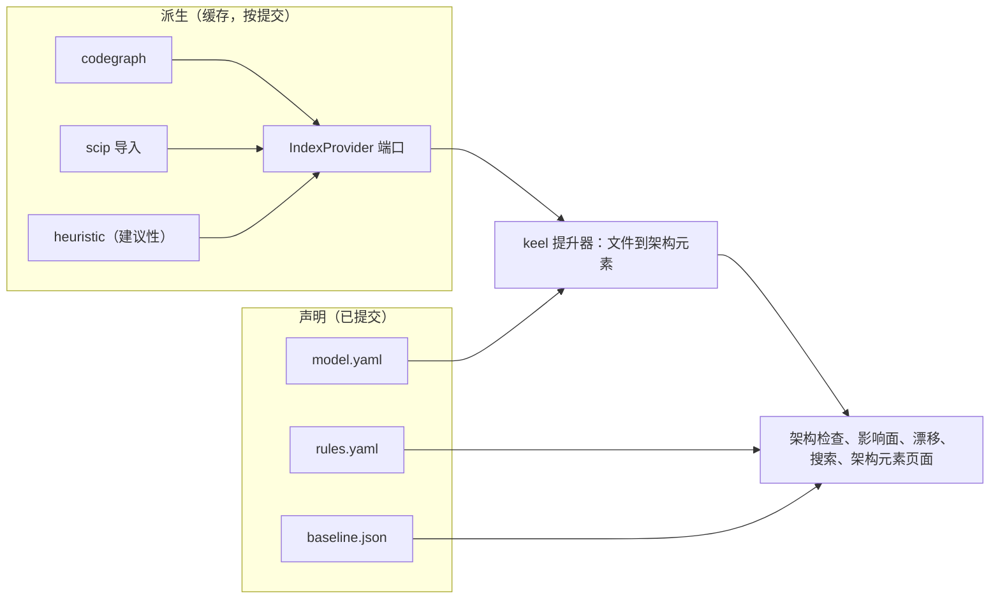

# ADR-0007 声明的架构与 IndexProvider 端口

> 英文原文（规范版本）：[ADR-0007-declared-vs-derived-architecture.md](ADR-0007-declared-vs-derived-architecture.md)。本文是其简体中文镜像，两者不一致时以英文版为准。

## 状态

于 2026-09-25 接受，按建议采纳。可通过一份取代它的 ADR 撤销。

## 背景

keel 承诺提供 Sourcegraph 和 arch-viewer 风格的架构智能：搜索、影响面（impact）、漂移（drift）、所有权和变更流，并与每一行落地（land）的代码关联。这涉及两类事实。

- 意图：存在哪些架构元素（element），哪些路径实现它们，谁拥有它们，允许哪些依赖。只有人和架构席位（architect seat）能陈述这些。
- 现实：哪些文件和符号依赖于哪些。代码图引擎计算这些比 keel 更好，但它们的输出可能过时、不完整或基于启发式。

编造边或把健康状况简化为单一分数的架构视图会误导人和智能体。构建代码图引擎不在 keel 的范围之内。

## 决策

1. 声明平面，已提交，只通过落地时应用的 `arch.delta` 改变：
   - `.keel/arch/model.yaml`：C4 风格的架构元素（`el:<dotted>`，种类为 system、container 或 component，父元素，路径 glob，所有者标签，标签，关系，ADR）、分层和映射覆盖；
   - `.keel/arch/rules.yaml`：规则 `AR-<5>`，种类为 forbidden、allowed、required、layers、acyclic 或 independent；
   - `.keel/arch/baseline.json`：冻结的已知违规，它们可以自由缩减，只能通过契约批准增长；
   - 带 `applies_to` glob 的 ADR 义务（obligation）。
2. 派生平面，缓存在 `.git/keel/cache/index/<commit>/` 下，从不提交，位于 `src/arch/index-provider.ts` 中的 IndexProvider 端口之后：
   - `status(commit)`：上传状态（queued、processing、completed、errored）、最近的已索引祖先、覆盖率和来源构成；
   - `search(query)`：覆盖文本、符号和路径；
   - `definitions(symbol)` 和 `references(symbol)`；
   - `dependents(files, depth)`。
3. 后端：`codegraph`（安装时的默认后端；只在分离的验证或索引检出中运行，只使用索引和查询命令，从不执行 init 或 install，关闭遥测和守护进程，并把 `.codegraph/` 移入缓存；以上均待探测验证（verify by probe））、`scip`（导入用户自己的 `index.scip`）、`heuristic`（导入扫描加文本搜索，仅作建议）以及 `none`。
4. keel 的提升器（lifter）把每个文件映射到最具体的架构元素 glob，并把符号边聚合为架构元素边。未映射的文件会被列出，从不猜测。
5. 每条边都带有来源（`scip`、`tree-sitter`、`heuristic`、`llm`）和置信度。只有由 `scip` 或 `tree-sitter` 边支撑的新错误才会使架构检查失败。过时或失败的覆盖层回答 `unknown`，它在 system 轨道（track）上或当规则触及受影响的架构元素时阻塞，其他情况下仅作建议。
6. 除架构检查外，索引对任何门禁（gate）都不是必需的。当架构检查失效时（后端为 `none` 或仅有启发式，或者没有 `model.yaml`），doctor 会明确说明。
7. 没有标量健康评分；LLM 叙述是可选的，并标注为非权威。

## 后果

- 意图保持可评审且已签名；派生事实保持可替换且有标注。
- keel 不依赖任何特定引擎；codegraph 和 SCIP 是可选的外部适配器。
- 在没有索引或模型的项目上，架构检查可能处于失效状态，keel 会如实说明，而不是显示为绿色。
- codegraph 的约束必须按版本探测（M4）；探测失败时回退到 SCIP 或启发式后端。
- 在 M4 之前，或者后端为 `none` 时，轨道棘轮使用保守的路径回退。
- 完整的模型、漂移类别、影响面和架构元素页面位于 [07-architecture-intelligence.zh-CN.md](../07-architecture-intelligence.zh-CN.md)。

## 考虑过的备选方案

- **内置在 keel 中的代码图引擎。** 否决：keel 不是代码图引擎，而且已有成熟的引擎。
- **仅以 SCIP 作为默认。** 作为默认被否决：它要求用户为每种语言运行一个索引器；它仍然是受支持的后端。
- **以内置的 tree-sitter 索引器作为默认。** 否决：相比租用 codegraph，它维护面很大而收益很小。
- **由模型推断的架构。** 否决：LLM 边只作建议，从不使门禁失败。
- **标量架构健康评分。** 否决：它隐藏了分母和来源。

## 来源

- Sourcegraph：按提交的索引状态、带差异覆盖的最近已索引祖先、代码智能 API 形态（定义、引用、搜索）、期望状态计划、序列、作为数据的所有权。
- 架构可视化调研：可插拔的 IndexProvider，默认 codegraph、可选 SCIP；派生数据被 git 忽略，声明数据被提交。
- axumquant/arch-viewer：带点击穿透和变更流的自包含视图；它捏造的边和评分是反例。
- codegraph：边的来源、影响面和新鲜度。
- dependency-cruiser、ArchUnit、import-linter：带冻结基线（baseline）的可执行规则。LikeC4、Structurizr：C4 层级。SCIP：符号 id。
- 参见 [16-sources-credits.zh-CN.md](../16-sources-credits.zh-CN.md)。
